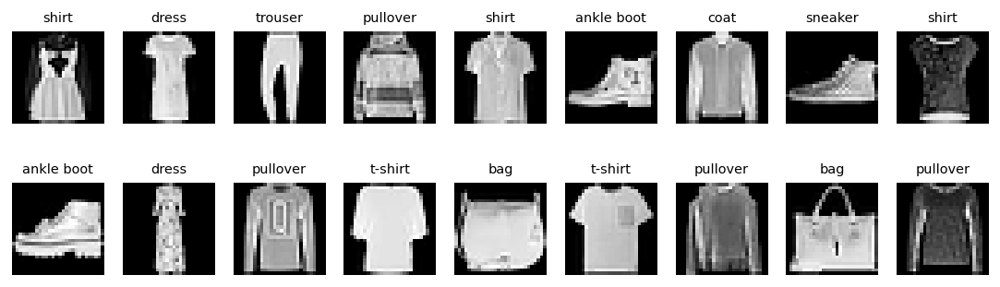

# Generative AI Foundations: Colab and Tensors

Before diving into the tools, it's essential to understand the paradigm shift we are experiencing. Traditional machine learning models, often referred to as discriminative models, focus on predicting outputs by learning the conditional probability of some expected output given an input. They are adept at tasks like classification or regression. Generative Artificial Intelligence (GenAI), on the other hand, seeks to learn and replicate complex data distributions to synthesize entirely new and original data, mirroring human-like outputs. 

According to *Generative AI Foundations in Python*, state-of-the-art generative models can behave as collaborators capable of synthetic understanding and generating sophisticated responses. The rapid growth of generative approaches fundamentally reshapes how we interact with technology. Whether you are synthesizing images with Diffusion models or generating text with Large Language Models (LLMs) based on the Transformer architecture, these models require immense computational power. This is where tools like Google Colab become indispensable for modern AI development. Jupyter notebooks enable live code execution, visualization, and explanatory text, suitable for prototyping and data analysis. Google Colab is a cloud-based version of Jupyter Notebook specifically designed for machine learning prototyping. It provides free GPU resources and integrates directly with Google Drive for file storage and sharing, making it the perfect environment to handle the computational complexity of deep generative models.


```{python}
#| label: setup
#| eval: true
#| echo: false
import os, warnings
import numpy as np
import matplotlib

import matplotlib.pyplot as plt
import matplotlib.patches as mpatches
import matplotlib.animation as animation
from matplotlib.patches import FancyArrowPatch
from mpl_toolkits.mplot3d import Axes3D
warnings.filterwarnings('ignore')

fig_dir = "M0_lecture03_figures"
os.makedirs(fig_dir, exist_ok=True)
# print(f"✓ Figures directory ready: {fig_dir}/")
```


## Overview {.unnumbered}

This lecture is a comprehensive, chapter-length treatment of the conceptual and computational foundations of neural networks.  We cover four interconnected topics based on @zhang2023d2l, @Goodfellow.Bengio.Courville.2016.:

| Part | Topic |
|------|-------|
| I | Linear Regression|
| II | Softmax Regression & Classification |
| III | Multilayer Perceptrons |
| IV | Building Deep Networks (Builders Guide) |

By the end you will be able to: 

1. derive and implement linear regression from scratch and with PyTorch;
2. extend the framework to multi-class classification via softmax;
3. design, train, and regularize MLPs;
4. manage PyTorch modules, parameters, Initialization schemes, and GPU resources like a practitioner.


# Linear Regression {#sec-linreg}

## The Model {#sec-linreg-basics}

**The regression problem.** Given an input vector $\mathbf{x} \in \mathbb{R}^d$ representing $d$ measured features (e.g. square footage, number of bedrooms, age of a house), predict a *continuous* scalar output $y \in \mathbb{R}$ (e.g. price).

**The linear model.** We model the prediction as a weighted sum of inputs plus a scalar bias:

$$
\begin{align}
\hat{y} = \mathbf{w}^\top \mathbf{x} + b = w_1 x_1 + w_2 x_2 + \cdots + w_d x_d + b
\end{align}
$$

where $\mathbf{w} \in \mathbb{R}^d$ is the *weight vector* and $b \in \mathbb{R}$ is the *bias* (also called *intercept*).  The pair $(\mathbf{w}, b)$ are the *parameters* we need to learn.

**Loss function — Mean Squared Error (MSE).** We measure prediction quality on $n$ training pairs $\{(\mathbf{x}^{(i)}, y^{(i)})\}_{i=1}^n$ with the squared $L_2$ loss:

$$
\begin{align}
\mathcal{L}(\mathbf{w}, b) = \frac{1}{2n} \sum_{i=1}^{n} \bigl(\hat{y}^{(i)} - y^{(i)}\bigr)^2 = \frac{1}{2n}\|\hat{\mathbf{y}} - \mathbf{y}\|^2
\end{align}
$$

The factor of $\frac{1}{2}$ is purely for notational convenience — it cancels the $2$ that appears when we differentiate the squared term.

**Gradient descent.** There is an analytic closed-form solution $\mathbf{w}^* = (\mathbf{X}^\top \mathbf{X})^{-1}\mathbf{X}^\top \mathbf{y}$ (the Normal Equations), but it requires inverting an $d \times d$ matrix and does not scale to millions of parameters.  Instead, we use **gradient descent**: iteratively move the parameters in the direction that decreases the loss.

$$
\begin{align}
\mathbf{w} \leftarrow \mathbf{w} - \eta \frac{\partial \mathcal{L}}{\partial \mathbf{w}}, \qquad b \leftarrow b - \eta \frac{\partial \mathcal{L}}{\partial b}
\end{align}
$$

The gradients are:

$$
\begin{align}
\frac{\partial \mathcal{L}}{\partial \mathbf{w}} = \frac{1}{n} \mathbf{X}^\top(\hat{\mathbf{y}} - \mathbf{y}), \qquad \frac{\partial \mathcal{L}}{\partial b} = \frac{1}{n}\sum_{i=1}^{n}(\hat{y}^{(i)} - y^{(i)})
\end{align}
$$

**Stochastic Gradient Descent (SGD).** Computing the full gradient over all $n$ examples is expensive.  In **mini-batch SGD** we compute the gradient over a random mini-batch $\mathcal{B} \subset \{1, \ldots, n\}$ of size $|\mathcal{B}|$:

$$
\begin{align}
\mathbf{w} \leftarrow \mathbf{w} - \frac{\eta}{|\mathcal{B}|} \sum_{i \in \mathcal{B}} \frac{\partial \ell^{(i)}}{\partial \mathbf{w}}
\end{align}
$$

The key hyperparameters are the **learning rate** $\eta$ and the **batch size** $|\mathcal{B}|$.

```{python}
#| label: fig-linear-regression
#| fig-cap: "Simulated linear regression: true line vs. fitted model after SGD."
#| fig-alt: "Two-panel figure. Left: scatter plot of noisy simulated data points with a dashed true line and a solid fitted regression line. Right: MSE loss contour plot with the gradient descent path converging to the minimum."
#| eval: true
#| echo: true
import numpy as np, matplotlib

import matplotlib.pyplot as plt
import os
fig_dir = "M0_lecture03_figures"
os.makedirs(fig_dir, exist_ok=True)

np.random.seed(42)
n = 200
w_true, b_true = 2.5, -1.0
X = np.random.randn(n, 1)
y = w_true * X.squeeze() + b_true + 0.6 * np.random.randn(n)

# Simple closed-form fit for illustration
X_aug = np.column_stack([X, np.ones(n)])
theta = np.linalg.lstsq(X_aug, y, rcond=None)[0]
w_hat, b_hat = theta[0], theta[1]

fig, axes = plt.subplots(1, 2, figsize=(11, 5))
ax = axes[0]
ax.scatter(X, y, alpha=0.4, color='steelblue', label='Data')
xs = np.linspace(X.min(), X.max(), 100)
ax.plot(xs, w_true * xs + b_true, 'g--', lw=1, label=f'True: y={w_true}x+{b_true}')
ax.plot(xs, w_hat * xs + b_hat, 'r-', lw=1, label=f'Fitted: y={w_hat:.2f}x+{b_hat:.2f}')
ax.set_xlabel('x'); ax.set_ylabel('y')
ax.set_title('Linear Regression Fit'); ax.legend()

# MSE loss surface
w_vals = np.linspace(0, 5, 60)
b_vals = np.linspace(-3, 1, 60)
WW, BB = np.meshgrid(w_vals, b_vals)
LL = np.array([[np.mean((w*X.squeeze()+b - y)**2)/2
                for w in w_vals] for b in b_vals])
ax2 = axes[1]
cp = ax2.contourf(WW, BB, LL, levels=30, cmap='viridis')
ax2.scatter([w_true], [b_true], c='white', s=100, zorder=5, label='True')
ax2.scatter([w_hat], [b_hat], c='red', s=100, marker='*', zorder=5, label='Fitted')
ax2.set_xlabel('weight w'); ax2.set_ylabel('bias b')
ax2.set_title('MSE Loss Surface (contour)'); ax2.legend()
plt.colorbar(cp, ax=ax2, label='MSE Loss')
plt.tight_layout()
plt.savefig(f"{fig_dir}/fig_linear_regression.png", dpi=130, bbox_inches='tight')
plt.show()
# print("Saved fig_linear_regression.png")
```


```{python}
#| label: fig-sgd-animation
#| fig-cap: "SGD gradient descent path on the MSE loss contour. The optimizer spirals toward the minimum."
#| fig-alt: "Animated contour plot of the MSE loss surface as a function of slope and intercept parameters. A colored path shows successive gradient descent steps spiraling inward toward the minimum at the center of the elliptical contours."
#| eval: true
#| echo: true
import numpy as np, matplotlib

import matplotlib.pyplot as plt
from matplotlib.animation import FuncAnimation, FFMpegWriter
from IPython.display import HTML, display
import os
fig_dir = "M0_lecture03_figures"
os.makedirs(fig_dir, exist_ok=True)

np.random.seed(42)
n = 100
w_true, b_true = 2.5, -1.0
X = np.random.randn(n)
y = w_true * X + b_true + 0.5 * np.random.randn(n)

w_vals = np.linspace(0, 5, 80); b_vals = np.linspace(-3, 1, 80)
WW, BB = np.meshgrid(w_vals, b_vals)
LL = np.array([[np.mean((w*X+b - y)**2)/2 for w in w_vals] for b in b_vals])

# SGD path
lr = 0.12; w, b = 4.5, 0.8
path_w, path_b = [w], [b]
for _ in range(40):
    y_hat = w * X + b
    dw = np.mean((y_hat - y) * X); db = np.mean(y_hat - y)
    w -= lr * dw; b -= lr * db
    path_w.append(w); path_b.append(b)

fig, ax = plt.subplots(figsize=(7, 5))
ax.contourf(WW, BB, LL, levels=25, cmap='Blues')
ax.contour(WW, BB, LL, levels=10, colors='white', linewidths=0.5, alpha=0.4)
line, = ax.plot([], [], 'ro-', markersize=5, lw=1.5, label='SGD path')
start_pt = ax.scatter([path_w[0]], [path_b[0]], c='yellow', s=80, zorder=6, label='Start')
end_pt = ax.scatter([w_true], [b_true], c='lime', s=100, marker='*', zorder=6, label='Minimum')
ax.set_xlabel('weight w'); ax.set_ylabel('bias b')
ax.set_title('SGD Path on Loss Surface'); ax.legend(loc='upper right')

def update(frame):
    line.set_data(path_w[:frame+1], path_b[:frame+1])
    return line,

ani = FuncAnimation(fig, update, frames=len(path_w), interval=150, blit=True)
video_path = f"{fig_dir}/fig_sgd_animation.mp4"
ffmpeg_ready = False

# Prefer a bundled ffmpeg binary if imageio-ffmpeg is installed.
try:
    import imageio_ffmpeg as iioffmpeg
    matplotlib.rcParams["animation.ffmpeg_path"] = iioffmpeg.get_ffmpeg_exe()
    ffmpeg_ready = True
except Exception:
    ffmpeg_ready = False

try:
    # Export as HTML5-compatible MP4 for accessible playback controls in the page.
    if ffmpeg_ready:
        ani.save(video_path, writer=FFMpegWriter(fps=8, bitrate=1800))
        print("Saved fig_sgd_animation.mp4")
    else:
        print("MP4 export skipped: ffmpeg not available in this environment.")
except Exception as e:
    print(f"MP4 save skipped: {e}")
# Show final frame statically
line.set_data(path_w, path_b)
plt.savefig(f"{fig_dir}/fig_sgd_path.png", dpi=130, bbox_inches='tight')
plt.show()
# print("Saved fig_sgd_path.png")

if os.path.exists(video_path):
    display(HTML(
        f"""
<video controls loop muted playsinline width=\"760\" aria-label=\"Animation of SGD steps moving across an MSE loss contour toward the minimum\">
  <source src=\"{video_path}\" type=\"video/mp4\">
  Your browser does not support the video tag.
</video>
"""
    ))
else:
    display(HTML("<p><em>Interactive animation video unavailable (ffmpeg not found). Static path figure shown above.</em></p>"))
```


::: {.callout-tip}
The contour plot shows that the loss is a *bowl* (convex quadratic for linear regression).  SGD follows the negative gradient — always descending — and converges to the global minimum for any positive learning rate (if small enough).
:::

## Vectorization for Speed {#sec-vectorization}

Naive Python loops over training examples are orders of magnitude slower than vectorized NumPy/PyTorch operations that delegate to optimized BLAS kernels (cuBLAS on GPU).  The key insight is to operate on the entire **design matrix** $\mathbf{X} \in \mathbb{R}^{n \times d}$ at once:

$$
\begin{align}
\hat{\mathbf{y}} = \mathbf{X}\mathbf{w} + b \in \mathbb{R}^n \quad \text{(one matrix-vector multiply)}
\end{align}
$$

```{python}
#| eval: true
#| echo: true
import torch, time

n, d = 10_000, 512
X = torch.randn(n, d); w = torch.randn(d)

# Loop version (slow)
start = time.time()
y_loop = torch.zeros(n)
for i in range(n):
    y_loop[i] = (X[i] * w).sum()
print(f"Loop: {time.time()-start:.3f}s")

# Vectorized (fast)
start = time.time()
y_vec = X @ w
print(f"Vectorized: {time.time()-start:.4f}s")

# Result is identical
assert torch.allclose(y_loop, y_vec, atol=1e-4)
```

On a modern CPU, the vectorized version is typically **100–1000× faster**.  On a GPU the speedup can reach **10,000×** for large matrices.

## The Normal Distribution and Squared Loss {#sec-normal-dist}

The choice of MSE loss has a deep probabilistic motivation.  Assume observations are corrupted by **Gaussian noise**:

$$
\begin{align}
y = \mathbf{w}^\top \mathbf{x} + b + \epsilon, \quad \epsilon \sim \mathcal{N}(0, \sigma^2)
\end{align}
$$

The conditional likelihood is:

$$
\begin{align}
p(y \mid \mathbf{x}; \mathbf{w}, b) = \frac{1}{\sqrt{2\pi\sigma^2}} \exp\!\left(-\frac{(y - \hat{y})^2}{2\sigma^2}\right)
\end{align}
$$

Taking the log over $n$ i.i.d. samples and negating (to turn maximization into minimization):

$$
\begin{align}
-\log p(\mathbf{y} \mid \mathbf{X}) = \frac{n}{2}\log(2\pi\sigma^2) + \frac{1}{2\sigma^2}\sum_{i=1}^{n}(y^{(i)} - \hat{y}^{(i)})^2
\end{align}
$$

Minimizing the negative log-likelihood **is equivalent** to Minimizing MSE.  The noise assumption $\epsilon \sim \mathcal{N}(0, \sigma^2)$ is what justifies using squared error rather than, say, absolute error.

```{python}
#| label: fig-normal-dist
#| fig-cap: "Gaussian noise model. Different σ values produce different 'tightness' around the regression line — motivating why larger σ corresponds to less confidence (higher loss)."
#| fig-alt: "Two panels. Left: scatter plot with regression line and shaded Gaussian noise bands for two sigma values (narrow and wide). Right: negative log-likelihood as a function of residuals for both sigma values, showing the connection between noise variance and MSE loss."
#| eval: true
#| echo: false

import numpy as np
import matplotlib.pyplot as plt
import os

fig_dir = "M0_lecture03_figures"
os.makedirs(fig_dir, exist_ok=True)

x = np.linspace(-4, 4, 500)
sigmas = [0.5, 1.0, 2.0]
colors = ['blue', 'orange', 'green']

fig, axes = plt.subplots(2, 1, figsize=(6.5, 11))

# -----------------------------
# 1. Gaussian PDFs
# -----------------------------
for sigma, color in zip(sigmas, colors):
    pdf = (1/(np.sqrt(2*np.pi)*sigma)) * np.exp(-x**2/(2*sigma**2))
    axes[0].plot(x, pdf, color=color, lw=1.4, label=f'σ={sigma}')

axes[0].set_xlabel('Residual ε = y − ŷ', fontsize=12)
axes[0].set_ylabel('Density', fontsize=12)
axes[0].set_title('Gaussian Noise Assumption', fontsize=14)
axes[0].legend()

# -----------------------------
# 2. Negative Log-Likelihood
# -----------------------------
residuals = np.linspace(-4, 4, 200)

for sigma, color in zip(sigmas, colors):
    nll = residuals**2 / (2*sigma**2) + np.log(np.sqrt(2*np.pi)*sigma)
    axes[1].plot(residuals, nll, color=color, lw=1.4, label=f'σ={sigma}')

axes[1].axhline(0, color='gray', lw=0.5, alpha=0.5)
axes[1].set_xlabel('Residual', fontsize=12)
axes[1].set_ylabel('−log p(y|x)', fontsize=12)
axes[1].set_title('Negative Log-Likelihood (= scaled MSE)', fontsize=14)
axes[1].legend()

plt.tight_layout()
plt.savefig(f"{fig_dir}/fig_normal_dist.png", dpi=130, bbox_inches='tight')
plt.show()

```

## Linear Regression as a Neural Network {#sec-linreg-as-nn}

Linear regression is a **single-layer neural network** with no hidden layers and a *linear* output activation:

- **Input layer**: $d$ input nodes, one per feature
- **Output layer**: 1 node, with a linear (identity) activation
- **Parameters**: weight matrix $\mathbf{W} \in \mathbb{R}^{1 \times d}$ and bias $b \in \mathbb{R}$

This view is crucial because it directly generalizes:

- Add hidden layers → **MLP** (multi-layer perceptron)
- Change output to softmax → **Softmax regression** (classification)
- Add convolutions → **CNN**

```{python}
#| label: fig-linear-nn
#| fig-cap: "Linear regression drawn as a single-layer neural network. All d input nodes connect to a single output with linear activation."
#| fig-alt: "Network diagram with input layer nodes labeled x1 through xd (plus a bias node), each connected by weighted edges to a single output node labeled y-hat, representing linear regression as a one-layer neural network."
#| eval: true
#| echo: false
# import numpy as np, matplotlib

# import matplotlib.pyplot as plt
# import os
# fig_dir = "M0_lecture03_figures"
# os.makedirs(fig_dir, exist_ok=True)

# fig, ax = plt.subplots(figsize=(9, 5))
# ax.set_xlim(0, 10); ax.set_ylim(0, 10); ax.axis('off')

# # Input nodes
# input_y = [2, 4, 6, 8]
# d = len(input_y)
# for i, y in enumerate(input_y):
#     circle = plt.Circle((2, y), 0.4, color='steelblue', zorder=5)
#     ax.add_patch(circle)
#     label = f'$x_{i+1}$' if i < d-1 else f'$x_d$'
#     ax.text(1.1, y, label, ha='center', va='center', fontsize=13)

# # Output node
# out_y = 5
# circle = plt.Circle((8, out_y), 0.5, color='tomato', zorder=5)
# ax.add_patch(circle)
# ax.text(8, out_y, r'$\hat{y}$', ha='center', va='center', fontsize=13, color='white', fontweight='bold')

# # Connections
# for y in input_y:
#     ax.annotate('', xy=(7.5, out_y), xytext=(2.4, y),
#                 arrowprops=dict(arrowstyle='->', color='gray', lw=1.2))
#     ax.text(4.5, (y + out_y)/2 + 0.1, f'$w_i$', fontsize=9, color='gray', ha='center')

# # Bias
# ax.text(8, 2.5, f'$+b$', fontsize=12, ha='center', color='dimgray')
# ax.text(2, 9.3, 'Input Layer\n(d features)', ha='center', fontsize=11)
# ax.text(8, 9.3, 'Output Layer\n(linear act.)', ha='center', fontsize=11)
# ax.set_title('Linear Regression as a Single-Layer Neural Network', fontsize=13)
# plt.tight_layout()
# plt.savefig(f"{fig_dir}/fig_linear_nn.png", dpi=130, bbox_inches='tight')
# plt.show()
from IPython.display import SVG
import svgwrite
import os

def linear_regression_nn_svg(
    path="M0_lecture03_figures/fig_linear_nn.svg",
    input_y=None,
    input_labels=None,
    output_y=5,
    node_r=22,
    colors=None
):
    # -----------------------------
    # Setup
    # -----------------------------
    os.makedirs(os.path.dirname(path), exist_ok=True)

    if input_y is None:
        input_y = [2, 4, 6, 8]

    if input_labels is None:
        d = len(input_y)
        input_labels = [f"x_{i+1}" if i < d-1 else "x_d" for i in range(d)]

    if colors is None:
        colors = {
            "input": "steelblue",
            "output": "tomato",
            "arrow": "gray",
            "text": "black"
        }

    dwg = svgwrite.Drawing(path, size=("900px", "500px"))

    # -----------------------------
    # Title + Layer Labels
    # -----------------------------
    dwg.add(dwg.text(
        "Linear Regression as a Single-Layer Neural Network",
        insert=("50%", 40),
        text_anchor="middle",
        font_size="22px",
        font_family="Arial"
    ))

    dwg.add(dwg.text(
        "Input Layer (d features)",
        insert=(150, 80),
        text_anchor="middle",
        font_size="16px"
    ))

    dwg.add(dwg.text(
        "Output Layer (linear act.)",
        insert=(750, 80),
        text_anchor="middle",
        font_size="16px"
    ))

    # -----------------------------
    # Define arrow marker (correct svgwrite pattern)
    # -----------------------------
    arrow = dwg.marker(id="arrow", insert=(10, 5), size=(10, 10), orient="auto")
    arrow.add(dwg.path(d="M0,0 L10,5 L0,10 z", fill=colors["arrow"]))
    dwg.defs.add(arrow)

    # -----------------------------
    # Output node position
    # -----------------------------
    out_cy = 100 + output_y * 40

    # -----------------------------
    # Draw input nodes + connections
    # -----------------------------
    for label, y in zip(input_labels, input_y):
        cy = 100 + y * 40

        # Input node
        dwg.add(dwg.circle(center=(150, cy), r=node_r, fill=colors["input"]))

        # Label
        dwg.add(dwg.text(
            f"${label}$",
            insert=(110, cy + 5),
            font_size="18px",
            font_family="Arial"
        ))

        # Arrow to output
        dwg.add(dwg.line(
            start=(150 + node_r, cy),
            end=(750 - node_r, out_cy),
            stroke=colors["arrow"],
            stroke_width=2,
            **{"marker-end": "url(#arrow)"}
        ))

        # Weight label
        mid_x = (150 + node_r + 750 - node_r) / 2
        mid_y = (cy + out_cy) / 2
        dwg.add(dwg.text(
            "$w_i$",
            insert=(mid_x, mid_y - 5),
            font_size="14px",
            fill=colors["arrow"]
        ))

    # -----------------------------
    # Output node
    # -----------------------------
    dwg.add(dwg.circle(center=(750, out_cy), r=node_r + 5, fill=colors["output"]))
    dwg.add(dwg.text(
        "$\\hat{y}$",
        insert=(750, out_cy + 6),
        text_anchor="middle",
        font_size="20px",
        fill="white",
        font_family="Arial"
    ))

    # Bias
    dwg.add(dwg.text(
        "$+b$",
        insert=(750, out_cy + 60),
        text_anchor="middle",
        font_size="18px",
        fill="dimgray"
    ))

    # -----------------------------
    # Save SVG
    # -----------------------------
    dwg.save()
    return dwg.tostring()


# Generate the figure
lr_nn = linear_regression_nn_svg()
SVG(lr_nn)
```


# Training Infrastructure {#sec-oop}

Three abstract base classes:

| Class | Responsibility |
|-------|---------------|
| `Module` | Wraps `nn.Module`; stores `hparams`; defines `training_step`, `validation_step`, `configure_optimizers` |
| `DataModule` | Manages `train_dataloader()` and `val_dataloader()` |
| `Trainer` | Orchestrates the epoch loop, calling `training_step` and accumulating metrics |

```{python}
#| eval: false
import torch
from torch import nn
from torch.utils import data

class Module(nn.Module):
    """Base model class (simplified d2l pattern)."""
    def __init__(self):
        super().__init__()
        self.board = []  # stores (epoch, train_loss, val_loss)

    def loss(self, y_hat, y):
        raise NotImplementedError

    def forward(self, X):
        raise NotImplementedError

    def configure_optimizers(self):
        return torch.optim.SGD(self.parameters(), lr=self.lr)

    def training_step(self, batch):
        X, y = batch
        l = self.loss(self(X), y)
        return l

    def validation_step(self, batch):
        X, y = batch
        return self.loss(self(X), y)


class DataModule:
    """Wraps a dataset into train and val dataloaders."""
    def __init__(self, root='./data', batch_size=32):
        self.root = root
        self.batch_size = batch_size

    def get_dataloader(self, tensors, train):
        dataset = data.TensorDataset(*tensors)
        return data.DataLoader(dataset, self.batch_size, shuffle=train)


class Trainer:
    """Runs the training loop."""
    def __init__(self, max_epochs):
        self.max_epochs = max_epochs

    def fit(self, model, data_module):
        optim = model.configure_optimizers()
        for epoch in range(self.max_epochs):
            model.train()
            train_loss = 0
            for batch in data_module.train_dataloader():
                l = model.training_step(batch)
                optim.zero_grad(); l.backward(); optim.step()
                train_loss += l.item()
            print(f"Epoch {epoch+1}: train_loss={train_loss:.4f}")
```


# Synthetic Regression Data {#sec-synthetic-data}

## Generating the Dataset

Synthetic data lets us know the *ground truth* parameters, making it ideal for validating our implementation:

$$
\begin{align}
\mathbf{y} = \mathbf{X}\mathbf{w}^* + b^* + \boldsymbol{\epsilon}, \quad \boldsymbol{\epsilon} \sim \mathcal{N}(\mathbf{0}, \sigma^2 \mathbf{I})
\end{align}
$$

```{python}
#| eval: false
import torch

def synthetic_data(w, b, num_examples, noise=0.01):
    """Generate y = Xw + b + noise with X ~ N(0,1)."""
    X = torch.randn(num_examples, len(w))
    y = X @ w + b
    y += torch.randn(y.shape) * noise
    return X, y.reshape(-1, 1)

# True parameters
w_true = torch.tensor([2.0, -3.4])
b_true = 4.2
X, y = synthetic_data(w_true, b_true, 1000)
print(f"X shape: {X.shape}, y shape: {y.shape}")  # torch.Size([1000, 2]), [1000, 1]
```

## Mini-batch Iterator

```{python}
#| eval: false
from torch.utils import data

def load_array(data_arrays, batch_size, is_train=True):
    """Construct a PyTorch data iterator."""
    dataset = data.TensorDataset(*data_arrays)
    return data.DataLoader(dataset, batch_size, shuffle=is_train)

batch_size = 10
data_iter = load_array((X, y), batch_size)
X_batch, y_batch = next(iter(data_iter))
print(X_batch.shape, y_batch.shape)   # [10, 2], [10, 1]
```

# Linear Regression from Scratch {#sec-linreg-scratch}

## Defining the Model

```{python}
#| eval: false
import torch

def linreg(X, w, b):
    """The linear regression model."""
    return X @ w + b
```

## Defining the Loss Function

```{python}
#| eval: false
def squared_loss(y_hat, y):
    """Mean squared error."""
    return ((y_hat - y.reshape(y_hat.shape))**2).mean() / 2
```

## Defining the Optimization Algorithm

```{python}
#| eval: false
def sgd(params, lr, batch_size):
    """Minibatch stochastic gradient descent."""
    with torch.no_grad():
        for param in params:
            param -= lr * param.grad / batch_size
            param.grad.zero_()
```

## Training

The complete from-scratch training loop:

```{python}
#| eval: false
import torch

w_true = torch.tensor([2.0, -3.4]); b_true = 4.2
X, y = synthetic_data(w_true, b_true, 1000)
data_iter = load_array((X, y), batch_size=10)

# Random Initialization
w = torch.normal(0, 0.01, size=(2, 1), requires_grad=True)
b = torch.zeros(1, requires_grad=True)

lr, num_epochs = 0.03, 10
for epoch in range(num_epochs):
    for X_b, y_b in data_iter:
        l = squared_loss(linreg(X_b, w, b), y_b)
        l.backward()
        sgd([w, b], lr, batch_size=10)
    with torch.no_grad():
        train_l = squared_loss(linreg(X, w, b), y)
        print(f"Epoch {epoch+1}: loss {float(train_l):.6f}")

print(f"Error in w: {w_true - w.reshape(w_true.shape)}")
print(f"Error in b: {b_true - b}")
```

# Generalization {#sec-generalization}
## Training vs. Generalization Error

A model that perfectly memorizes the training set may fail spectacularly on unseen data.  We define:

- **Training error** $R_\text{emp}$: loss averaged over the training set
- **Generalization error** $R$: expected loss over all possible future examples (unobservable; approximated by the **test set**)

The **generalization gap** $= R - R_\text{emp}$.  The goal of learning is to minimise $R$, not $R_\text{emp}$.

## Underfitting vs. Overfitting

- **Underfitting**: model is too simple to capture the data's structure ($R_\text{emp}$ is large, $R$ is large)
- **Overfitting**: model fits the training noise ($R_\text{emp}$ is tiny, $R$ is large)
- The optimal model achieves the lowest **generalization error**

The **bias–variance decomposition** states:

$$
\begin{align}\text{Expected Test Error} = \text{Bias}^2 + \text{Variance} + \text{Irreducible Noise}
\end{align}
$$

- High bias → underfitting (model assumptions too rigid)
- High variance → overfitting (model sensitive to training sample)

```{python}
#| label: fig-bias-variance
#| fig-cap: "Bias-variance tradeoff: training error decreases monotonically with model complexity, but test error has a U-shape. The sweet spot minimises test error."
#| fig-alt: "Line chart with model complexity on the x-axis and error on the y-axis. A blue curve (training error) decreases monotonically. A red curve (test error) forms a U-shape with a minimum at intermediate complexity. The regions of high bias (left) and high variance (right) are labeled, with the optimal complexity point marked."
#| eval: true
#| echo: true
import numpy as np, matplotlib
import matplotlib.pyplot as plt
import os
fig_dir = "M0_lecture03_figures"
os.makedirs(fig_dir, exist_ok=True)

complexity = np.linspace(1, 10, 200)
train_err = 0.8 * np.exp(-0.5 * complexity) + 0.02
test_err  = 0.7 * np.exp(-0.5 * complexity) + 0.15 + 0.02 * (complexity - 4)**2

fig, ax = plt.subplots(figsize=(8, 5))
ax.plot(complexity, train_err, 'b-', lw=1.5, label='Training Error')
ax.plot(complexity, test_err,  'r-', lw=1.5, label='Test Error (≈ Generalization Error)')
ax.axvline(x=4.5, color='green', linestyle='--', lw=1.5, label='Optimal Complexity')
ax.fill_between(complexity[complexity<4.5], 0, 0.7,
                alpha=0.08, color='blue', label='Underfitting region')
ax.fill_between(complexity[complexity>4.5], 0, 0.7,
                alpha=0.08, color='red', label='Overfitting region')
ax.set_xlabel('Model Complexity', fontsize=12)
ax.set_ylabel('Error', fontsize=12)
ax.set_title('Bias–Variance Tradeoff', fontsize=13)
ax.legend(fontsize=9); ax.set_ylim(0, 0.7)
plt.tight_layout()
plt.savefig(f"{fig_dir}/fig_bias_variance.png", dpi=130, bbox_inches='tight')
plt.show()
```

## Model Selection

To choose the best model without "peeking" at the test set, we use:

1. **Validation set**: held-out portion of training data used for hyperparameter tuning
2. **K-fold cross-validation**: split training data into $K$ folds; rotate which fold is the validation set; average the $K$ validation scores

The test set is used **exactly once** for the final unbiased performance estimate.


# Weight Decay {#sec-weight-decay}

## Regularized Loss

Regularization constrains model complexity by penalizing large weights.  The **L2-regularised loss** (ridge regression) adds the squared $\ell_2$ norm of the weights:

$$
\begin{align}
\tilde{\mathcal{L}}(\mathbf{w}, b) = \mathcal{L}(\mathbf{w}, b) + \frac{\lambda}{2}\|\mathbf{w}\|^2
\end{align}
$$

The gradient update becomes:

$$
\begin{align}
\mathbf{w} \leftarrow (1 - \eta\lambda)\,\mathbf{w} - \eta \frac{\partial \mathcal{L}}{\partial \mathbf{w}}
\end{align}
$$

The factor $(1-\eta\lambda)$ "decays" the weight at each step — hence the name **weight decay**.  $\lambda > 0$ is the regularization strength:

- $\lambda = 0$: no regularization (same as before)
- $\lambda \to \infty$: drives all weights to zero

```{python}
#| label: fig-weight-decay
#| fig-cap: "Effect of weight decay strength λ on learned weights. Larger λ forces weights closer to zero, reducing overfitting at the cost of higher bias."
#| fig-alt: "Semi-log line plot with regularization strength lambda on the x-axis (log scale) and average absolute weight magnitude on the y-axis. As lambda increases from small to large values the weights shrink toward zero, illustrating L2 regularization shrinkage."
#| eval: true
#| echo: true
import numpy as np, matplotlib

import matplotlib.pyplot as plt
import os
fig_dir = "M0_lecture03_figures"
os.makedirs(fig_dir, exist_ok=True)

lambdas = np.logspace(-3, 2, 100)
# For a simple 1D ridge problem, w* = X^T y / (X^T X + λ)
# Simulate: true w=2, X^T X = 50, X^T y = 100
w_star = 100 / (50 + lambdas)
fig, ax = plt.subplots(figsize=(8, 4))
ax.semilogx(lambdas, w_star, 'b-', lw=1.5)
ax.axhline(y=2.0, color='green', linestyle='--', lw=1.5, label='True w = 2.0')
ax.axhline(y=0.0, color='red', linestyle=':', lw=1.5, label='w → 0 as λ→∞')
ax.set_xlabel('regularization strength λ (log scale)', fontsize=12)
ax.set_ylabel('Learned weight w*', fontsize=12)
ax.set_title('Weight Decay: Shrinkage of Parameters', fontsize=13)
ax.legend(); plt.tight_layout()
plt.savefig(f"{fig_dir}/fig_weight_decay.png", dpi=130, bbox_inches='tight')
plt.show()
```

## Implementation from Scratch

```{python}
#| eval: false
def l2_penalty(w):
    return (w**2).sum() / 2

for epoch in range(num_epochs):
    for X_b, y_b in data_iter:
        # Add regularization term to loss
        l = squared_loss(linreg(X_b, w, b), y_b) + lambd * l2_penalty(w)
        l.backward()
        sgd([w, b], lr, batch_size)
```


# Softmax Classification {#sec-softmax}

## The Model {#sec-softmax-basics}

In *classification* the output $y$ is a **discrete category** rather than a continuous value.  For $K$ classes, we represent the true label as a **one-hot vector** $\mathbf{y} \in \{0,1\}^K$ where exactly one entry is 1.

The model computes **logits** (pre-activation scores):

$$
\begin{align}
\mathbf{o} = \mathbf{W}\mathbf{x} + \mathbf{b}, \quad \mathbf{o} \in \mathbb{R}^K
\end{align}
$$

We then convert logits to a valid **probability distribution** using the **softmax function**:

$$
\begin{align}
\hat{y}_k = \text{softmax}(\mathbf{o})_k = \frac{\exp(o_k)}{\sum_{j=1}^{K} \exp(o_j)}, \quad k = 1, \ldots, K
\end{align}
$$

Properties: (1) $\hat{y}_k \ge 0$; (2) $\sum_k \hat{y}_k = 1$; (3) the class with the highest logit has the highest probability.

```{python}
#| label: fig-softmax
#| fig-cap: "Softmax converts raw logits into a probability distribution. The class with the highest logit dominates, but all classes receive non-zero probability."
#| fig-alt: "Two-panel bar chart. Left panel shows raw logit scores for four classes with varying heights. Right panel shows the corresponding softmax probabilities, all positive and summing to 1, with the class corresponding to the highest logit having the tallest bar."
#| eval: true
#| echo: true
import numpy as np, matplotlib

import matplotlib.pyplot as plt
import os
fig_dir = "M0_lecture03_figures"
os.makedirs(fig_dir, exist_ok=True)

logits = np.array([2.0, 1.0, 0.1, -0.5, 3.0])
def softmax(o):
    e = np.exp(o - o.max())
    return e / e.sum()
probs = softmax(logits)
classes = [f'Class {i}' for i in range(len(logits))]

fig, axes = plt.subplots(1, 2, figsize=(10.5, 4))
axes[0].bar(classes, logits, color='steelblue')
axes[0].set_title('Raw Logits $o$'); axes[0].set_ylabel('Logit value')
axes[1].bar(classes, probs, color='tomato')
for i, v in enumerate(probs):
    axes[1].text(i, v + 0.01, f'{v:.2f}', ha='center', fontsize=10)
axes[1].set_title('Softmax Probabilities $\\hat{y}$')
axes[1].set_ylabel('Probability'); axes[1].set_ylim(0, 0.7)
plt.suptitle('Softmax: Logits → Probabilities', fontsize=13)
plt.tight_layout()
plt.savefig(f"{fig_dir}/fig_softmax.png", dpi=130, bbox_inches='tight')
plt.show()
```

## Cross-Entropy Loss

The appropriate loss for probabilistic classification is **cross-entropy**:

$$
\begin{align}
\ell(\mathbf{y}, \hat{\mathbf{y}}) = -\sum_{k=1}^{K} y_k \log \hat{y}_k
\end{align}
$$

For one-hot labels this simplifies to:

$$
\begin{align}
\ell = -\log \hat{y}_{k^*}
\end{align}
$$

Where $k^*$ is the true class.  The model is penalized for assigning *low* probability to the correct class.

Over a mini-batch of $n$ examples:

$$
\begin{align}
\mathcal{L} = -\frac{1}{n}\sum_{i=1}^{n}\log \hat{y}_{k_i^*}^{(i)}
\end{align}
$$

## Information-Theoretic View

**Entropy** measures the average "surprise" (uncertainty) of a random variable $X$ with distribution $P$:

$$
\begin{align}
H(P) = -\sum_x P(x)\log P(x)
\end{align}
$$

**Cross-entropy** between reference distribution $P$ (true labels) and model distribution $Q$ (predictions):

$$
\begin{align}
H(P, Q) = -\sum_x P(x)\log Q(x)
\end{align}
$$

**KL divergence** (non-negative) measures how $Q$ differs from $P$:

$$
\begin{align}
D_{KL}(P \| Q) = H(P, Q) - H(P) \ge 0
\end{align}
$$

Minimizing cross-entropy is equivalent to Minimizing KL divergence when $P$ is fixed (the true data distribution). This provides the information-theoretic justification for the cross-entropy loss.


## Fashion-MNIST {#sec-image-classification-data}

The standard toy benchmark for classification is **Fashion-MNIST**: 70,000 grayscale $28 \times 28$ images of clothing items, 10 classes.

```{python}
#| eval: false
#| echo: true
#| label: fig-fashion-mnist-samples
import torch
import torchvision
from torchvision import transforms

def load_data_fashion_mnist(batch_size, resize=None):
    trans = [transforms.ToTensor()]
    if resize:
        trans.insert(0, transforms.Resize(resize))
    trans = transforms.Compose(trans)
    mnist_train = torchvision.datasets.FashionMNIST(
        root='./data', train=True, transform=trans, download=True)
    mnist_test  = torchvision.datasets.FashionMNIST(
        root='./data', train=False, transform=trans, download=True)
    return (torch.utils.data.DataLoader(mnist_train, batch_size, shuffle=True),
            torch.utils.data.DataLoader(mnist_test,  batch_size, shuffle=False))

train_iter, test_iter = load_data_fashion_mnist(batch_size=256)
# Each batch: X shape [256, 1, 28, 28], y shape [256]
```

###  Visualization

```{python}
#| fig-cap: "Sample images from the Fashion-MNIST dataset. Each image is a 28x28 grayscale representation of a clothing item, with the corresponding label shown above."
#| fig-alt: "Grid of 18 grayscale images from the Fashion-MNIST dataset, showing various clothing items with their corresponding labels."
#| fig-align: center
#| eval: false
#| echo: true
import matplotlib.pyplot as plt
labels = ['t-shirt','trouser','pullover','dress','coat',
          'sandal','shirt','sneaker','bag','ankle boot']
fig_dir = "M0_lecture03_figures"
X, y = next(iter(train_iter))
fig, axes = plt.subplots(2, 9, figsize=(10.5, 3))
for i, ax in enumerate(axes.flat):
    ax.imshow(X[i].squeeze(), cmap='gray')
    ax.set_title(labels[y[i]], fontsize=8)
    ax.axis('off')
plt.savefig(f"{fig_dir}/fig_fashion_mnist_samples.png", dpi=130, bbox_inches='tight')   
plt.tight_layout()
plt.show()
```

{width=80% fig-align="center" fig-alt="Grid of 18 grayscale images from the Fashion-MNIST dataset, showing various clothing items with their corresponding labels." #fig-fashion-mnist-samples}

# Base Classifier {#sec-base-classifier}

```{python}
#| eval: false
class Classifier(nn.Module):
    """Base classifier with accuracy metric."""
    def __init__(self):
        super().__init__()

    def accuracy(self, y_hat, y, averaged=True):
        """Fraction of predictions that are correct."""
        y_hat = y_hat.argmax(dim=1)   # predicted class
        cmp = y_hat.type(y.dtype) == y
        return cmp.float().mean() if averaged else cmp.float().sum()

    def loss(self, y_hat, y):
        return nn.CrossEntropyLoss()(y_hat, y)

    def configure_optimizers(self):
        return torch.optim.SGD(self.parameters(), lr=self.lr)
```

## Accuracy

The **accuracy** metric counts the fraction of examples where $\arg\max_k \hat{y}_k$ equals the true class:

$$
\begin{align}
\text{Accuracy} = \frac{1}{n}\sum_{i=1}^{n} \mathbf{1}[\hat{y}^{(i)} = y^{(i)}]
\end{align}
$$

Note: optimizing accuracy directly is difficult because it is *non-differentiable*.  We optimize cross-entropy instead and monitor accuracy as a secondary metric.

# Softmax from Scratch {#sec-softmax-scratch}

## Numerically Stable Softmax

```{python}
#| eval: false
def softmax(X):
    X_exp = torch.exp(X - X.max(dim=1, keepdim=True).values)  # subtract max for stability
    partition = X_exp.sum(dim=1, keepdim=True)
    return X_exp / partition   # shape: [batch, num_classes]
```

## The Model

```{python}
#| eval: false
# Flatten 28x28 images to 784-dimensional vectors
def net(X):
    return softmax(torch.matmul(X.reshape(-1, 784), W) + b)

num_inputs, num_outputs = 784, 10
W = torch.normal(0, 0.01, size=(784, 10), requires_grad=True)
b = torch.zeros(10, requires_grad=True)
```

## The Cross-Entropy Loss

```{python}
#| eval: false
def cross_entropy(y_hat, y):
    # y_hat: [n, K] probabilities; y: [n] integer class labels
    return -torch.log(y_hat[range(len(y_hat)), y]).mean()
```

## Training

```{python}
#| eval: false
lr, num_epochs = 0.1, 10
for epoch in range(num_epochs):
    for X_b, y_b in train_iter:
        y_hat = net(X_b)
        l = cross_entropy(y_hat, y_b)
        l.backward()
        sgd([W, b], lr, X_b.shape[0])
    # Evaluate
    acc = sum(net(X).argmax(dim=1) == y for X,y in test_iter) / len(test_iter.dataset)
    print(f"Epoch {epoch+1}: test accuracy {acc:.3f}")
```


# Test Set Best Practices {#sec-gen-classification}

## Test Set and Its Caveats

The test set estimates the *generalisation error* — but only if used correctly:

1. **Never tune hyperparameters** using the test set (this inflates the reported accuracy)
2. **Never look at test examples** during model development
3. Use a separate **validation set** for all tuning decisions

## Test Set Reuse (Contamination)

If we run 100 models and pick the best test accuracy, we are effectively fitting to the test set.  This is called **test set contamination** or **p-hacking** and explains why many published results fail to replicate.

## Statistical Learning Theory

PAC (Probably Approximately Correct) learning gives bounds on generalization error.  For a model class $\mathcal{H}$ with finite $|\mathcal{H}|$, with probability $\ge 1 - \delta$:

$$
\begin{align}
R \le \hat{R} + \sqrt{\frac{\log|\mathcal{H}| + \log(1/\delta)}{2n}}
\end{align}
$$

This says: more training data $n$ and simpler model class (smaller $|\mathcal{H}|$) → tighter generalization.


# Distribution Shift {#sec-dist-shift}

## Types of Distribution Shift

| Type | Description | Example |
|------|-------------|---------|
| **Covariate shift** | $p(\mathbf{x})$ changes, $p(y|\mathbf{x})$ stays the same | Train on daytime photos, test on night |
| **Label shift** | $p(y)$ changes, $p(\mathbf{x}|y)$ stays the same | Disease prevalence changes over time |
| **Concept shift** | $p(y|\mathbf{x})$ changes | Sentiment of "sick" changed after COVID |

## Examples of Distribution Shift

- **Medical AI**: trained on hospital A, deployed at hospital B with different equipment
- **NLP models**: trained on news from 2020, deployed in 2025 (new vocabulary, events)
- **Credit scoring**: trained in a boom economy, evaluated in a recession

## Correction of Distribution Shift

**Importance weighting** corrects for covariate shift by reweighting training examples:

$$
\begin{align}w(\mathbf{x}) = \frac{p_\text{test}(\mathbf{x})}{p_\text{train}(\mathbf{x})}
\end{align}
$$

**Domain adaptation** fine-tunes on small labelled target-domain data.

## Fairness, Accountability, and Transparency

Distribution shift becomes an equity issue when training data **under-represents** certain demographic groups.  A model trained predominantly on one population may systematically underperform for others.  Best practices:

1. Audit training data for representation gaps
2. Stratify evaluation metrics by subgroup
3. Document model limitations in a **model card**


# Multilayer Perceptrons {#sec-mlp-basics}

## Why We Need Hidden Layers

Linear models can only learn **linearly separable** patterns.  Consider XOR: no single line can separate the classes $\{(0,0)→0,\,(0,1)→1,\,(1,0)→1,\,(1,1)→0\}$.  By adding one or more **hidden layers** with non-linear activations, the network can learn *arbitrarily complex* decision boundaries.

The **universal approximation theorem** (Cybenko, 1989; Hornik, 1991) guarantees that a single hidden layer with sufficient neurons and a non-linear activation can approximate *any* continuous function on a compact domain to arbitrary precision.  However:

- We may need an *exponentially* large hidden layer to approximate certain functions with just one layer
- **Depth** is more parameter-efficient than width for many function classes

## Architecture

A **fully-connected MLP** with one hidden layer:

$$
\begin{align}
\mathbf{h} = \sigma(\mathbf{W}_1 \mathbf{x} + \mathbf{b}_1) \in \mathbb{R}^h\\
\hat{\mathbf{y}} = \mathbf{W}_2 \mathbf{h} + \mathbf{b}_2 \in \mathbb{R}^K
\end{align}
$$

For an MLP with $L$ hidden layers:

$$
\begin{align}
\mathbf{h}^{(l)} = \sigma\!\left(\mathbf{W}^{(l)} \mathbf{h}^{(l-1)} + \mathbf{b}^{(l)}\right), \quad l = 1, \ldots, L\\
\hat{\mathbf{y}} = \mathbf{W}^{(L+1)}\mathbf{h}^{(L)} + \mathbf{b}^{(L+1)}
\end{align}
$$

```{python}
#| label: fig-mlp-arch
#| fig-cap: "MLP with 3 inputs, one hidden layer of 4 neurons, and 2 outputs. The non-linear activation σ is applied to each hidden unit."
#| fig-alt: "Neural network architecture diagram with three layers: an input layer of 3 nodes (x1, x2, x3), a hidden layer of 4 nodes each labeled with the activation symbol sigma, and an output layer of 2 nodes. All nodes in adjacent layers are fully connected by arrows."
#| eval: true
#| echo: true
import numpy as np, matplotlib

import matplotlib.pyplot as plt
import os
fig_dir = "M0_lecture03_figures"
os.makedirs(fig_dir, exist_ok=True)

def draw_neural_net(ax, layer_sizes, layer_labels=None):
    n_layers = len(layer_sizes)
    v_spacing = 1.0; h_spacing = 2.5
    for i, n in enumerate(layer_sizes):
        y_positions = np.linspace(0, (n-1)*v_spacing, n)
        y_positions -= y_positions.mean()
        x = i * h_spacing
        for j, y in enumerate(y_positions):
            color = 'steelblue' if i == 0 else ('mediumpurple' if i < n_layers-1 else 'tomato')
            circle = plt.Circle((x, y), 0.35, color=color, zorder=5, ec='white', lw=1.5)
            ax.add_patch(circle)
            if layer_labels:
                ax.text(x, y, layer_labels[i][j], ha='center', va='center',
                        fontsize=9, color='white', fontweight='bold')
        # Connections to next layer
        if i < n_layers - 1:
            ny_next = np.linspace(0, (layer_sizes[i+1]-1)*v_spacing, layer_sizes[i+1])
            ny_next -= ny_next.mean()
            x_next = (i+1) * h_spacing
            for y0 in y_positions:
                for y1 in ny_next:
                    ax.plot([x+0.35, x_next-0.35], [y0, y1], 'gray', lw=0.6, alpha=0.5, zorder=1)
    # Layer labels
    xlabels = ['Input\n(x₁,x₂,x₃)', 'Hidden Layer\n(σ activation)', 'Output\n(ŷ₁,ŷ₂)']
    xpos = [i * h_spacing for i in range(n_layers)]
    for x, lbl in zip(xpos, xlabels):
        ax.text(x, -2.5, lbl, ha='center', va='top', fontsize=10, color='#333333')

fig, ax = plt.subplots(figsize=(10, 6))
ax.set_xlim(-1, 6.5); ax.set_ylim(-3.5, 2.5); ax.axis('off')
draw_neural_net(ax, [3, 4, 2])
ax.set_title('Multilayer Perceptron (3 → 4 → 2)', fontsize=13)
plt.tight_layout()
plt.savefig(f"{fig_dir}/fig_mlp_arch.png", dpi=130, bbox_inches='tight')
plt.show()
```

## Activation Functions {#sec-activations}

Without non-linear activations, a deep network collapses to a *single* linear transformation.  Common activations:

**ReLU (Rectified Linear Unit)**:
$$
\begin{align}
\text{ReLU}(x) = \max(0, x)
\end{align}
$$

*Why it works well*: simple gradient ($0$ or $1$), no vanishing gradients for positive inputs.  *Limitation*: "dead neurons" when input is always negative.

**Sigmoid**:
$$
\begin{align}
\sigma(x) = \frac{1}{1 + e^{-x}} \in (0, 1)
\end{align}
$$

*Historically used for binary outputs/gates.  Saturates → vanishing gradients for large $|x|$.*

**Tanh**:
$$
\begin{align}
\tanh(x) = \frac{e^x - e^{-x}}{e^x + e^{-x}} \in (-1, 1)
\end{align}
$$

*Zero-centred (unlike sigmoid), but still saturates.*

**Softmax** (output layer for multi-class):
$$
\begin{align}
\text{softmax}(\mathbf{o})_k = \frac{e^{o_k}}{\sum_j e^{o_j}}
\end{align}
$$

```{python}
#| label: fig-activations
#| fig-cap: "Comparison of activation functions and their derivatives. ReLU dominates in practice for hidden layers due to its non-saturating gradient."
#| fig-alt: "Grid of 8 line plots arranged in 2 rows and 4 columns. The top row shows the function curves for ReLU, sigmoid, tanh, and ELU. The bottom row shows their respective derivative curves. ReLU has a constant derivative of 1 for positive inputs, while sigmoid and tanh have derivatives that approach zero at the extremes (saturation)."
#| eval: true
#| echo: true
import numpy as np, matplotlib

import matplotlib.pyplot as plt
import os
fig_dir = "M0_lecture03_figures"
os.makedirs(fig_dir, exist_ok=True)

x = np.linspace(-5, 5, 500)
relu   = np.maximum(0, x)
sigmoid= 1 / (1 + np.exp(-x))
tanh_v = np.tanh(x)
elu    = np.where(x >= 0, x, np.exp(x) - 1)

drelu  = (x > 0).astype(float)
dsigm  = sigmoid * (1 - sigmoid)
dtanh  = 1 - tanh_v**2
delu   = np.where(x >= 0, 1.0, np.exp(x))

fig, axes = plt.subplots(4, 2, figsize=(10, 12))  # 4 rows, 2 columns

names = ['ReLU', 'Sigmoid', 'Tanh', 'ELU']
fns   = [relu, sigmoid, tanh_v, elu]
dfns  = [drelu, dsigm, dtanh, delu]
colors= ['dodgerblue', 'tomato', 'forestgreen', 'darkorange']

for i, (name, f, df, c) in enumerate(zip(names, fns, dfns, colors)):
    
    # Activation (left column)
    ax = axes[i, 0]
    ax.plot(x, f, color=c, lw=1.5)
    ax.axhline(0, color='k', lw=0.5)
    ax.axvline(0, color='k', lw=0.5)
    ax.set_title(f'{name}(x)', fontsize=12)
    ax.set_xlim(-5, 5)
    
    # Derivative (right column)
    ax2 = axes[i, 1]
    ax2.plot(x, df, color=c, lw=1.5, linestyle='--')
    ax2.axhline(0, color='k', lw=0.5)
    ax2.axvline(0, color='k', lw=0.5)
    ax2.set_title(f"d/dx {name}(x)", fontsize=12)
    ax2.set_xlim(-5, 5)

# Labels
axes[0,0].set_ylabel('Value', fontsize=11)
axes[0,1].set_ylabel('Gradient', fontsize=11)

plt.suptitle('Activation Functions and Their Derivatives', fontsize=14, y=1.02)
plt.tight_layout()
plt.savefig(f"{fig_dir}/fig_activations_2col4row.png", dpi=130, bbox_inches='tight')
plt.show()
```

# MLP from Scratch {#sec-mlp-impl}

## From Scratch

```{python}
#| eval: false
import torch
from torch import nn

# Initialise parameters
num_inputs, num_hiddens, num_outputs = 784, 256, 10
W1 = nn.Parameter(torch.randn(num_inputs,  num_hiddens) * 0.01)
b1 = nn.Parameter(torch.zeros(num_hiddens))
W2 = nn.Parameter(torch.randn(num_hiddens, num_outputs) * 0.01)
b2 = nn.Parameter(torch.zeros(num_outputs))
params = [W1, b1, W2, b2]

def relu(X):
    return torch.max(X, torch.zeros_like(X))

def net(X):
    X = X.reshape(-1, num_inputs)          # flatten
    H = relu(X @ W1 + b1)                  # hidden layer
    return H @ W2 + b2                     # output logits

loss = nn.CrossEntropyLoss()
trainer = torch.optim.SGD(params, lr=0.1)
```


# Forward and Backward Pass {#sec-forwardbackward}

## Forward Propagation

Forward propagation computes the output from inputs by sequentially applying layer transformations:

For a 2-layer MLP:

$$
\begin{align}
\mathbf{z}^{(1)} &= \mathbf{W}^{(1)}\mathbf{x} + \mathbf{b}^{(1)} \quad \text{(linear transform)} \\
\mathbf{h}^{(1)} &= \sigma(\mathbf{z}^{(1)}) \quad \text{(activation)} \\
\mathbf{z}^{(2)} &= \mathbf{W}^{(2)}\mathbf{h}^{(1)} + \mathbf{b}^{(2)} \quad \text{(output logits)} \\
\mathcal{L} &= \text{CrossEntropy}(\mathbf{z}^{(2)}, \mathbf{y}) \quad \text{(loss)}
\end{align}
$$

## Computational Graph

A **computational graph** represents the computation as a directed acyclic graph (DAG) where:
- Nodes = variables (tensors or scalars)
- Edges = operations

PyTorch builds this graph dynamically as operations execute, enabling **automatic differentiation**.

```{python}
#| eval: false
import torch

x = torch.tensor(2.0, requires_grad=True)
y = x**2 + 3*x + 1          # builds the graph
y.backward()                 # traverses graph backwards
print(x.grad)                # dy/dx = 2x + 3 = 7
```

## Backpropagation {#sec-backprop}

Backpropagation applies the **chain rule of calculus** to efficiently compute gradients through the computational graph.  For a composition $f = f_L \circ \cdots \circ f_1$:

$$
\begin{align}
\frac{\partial \mathcal{L}}{\partial \mathbf{W}^{(l)}} = \frac{\partial \mathcal{L}}{\partial \mathbf{z}^{(l)}} \cdot \frac{\partial \mathbf{z}^{(l)}}{\partial \mathbf{W}^{(l)}}
\end{align}
$$

The **error signal** $\boldsymbol{\delta}^{(l)} = \frac{\partial \mathcal{L}}{\partial \mathbf{z}^{(l)}}$ is propagated backward:

$$
\begin{align}
\boldsymbol{\delta}^{(l)} = \left((\mathbf{W}^{(l+1)})^\top \boldsymbol{\delta}^{(l+1)}\right) \odot \sigma'\!\left(\mathbf{z}^{(l)}\right)
\end{align}
$$

Key insight: gradients are computed once per backward pass and reused — making it as efficient as a single forward pass.

```{python}
#| label: fig-backprop
#| fig-cap: "Computational graph of a 2-layer MLP showing forward pass (solid arrows) and backward pass (dashed arrows) of gradients."
#| fig-alt: "Directed graph with nodes for inputs, weight matrices W1 and W2, hidden activations, and the output loss. Solid black arrows point left-to-right representing the forward pass computation. Dashed red arrows point right-to-left representing the backward gradient flow via the chain rule."
#| eval: true
#| echo: true
import matplotlib

import matplotlib.pyplot as plt
import matplotlib.patches as mpatches
from matplotlib.patches import FancyArrowPatch
import os
fig_dir = "M0_lecture03_figures"
os.makedirs(fig_dir, exist_ok=True)

fig, ax = plt.subplots(figsize=(10.5, 5))
ax.set_xlim(0, 12); ax.set_ylim(0, 5); ax.axis('off')

nodes = {
    'x':     (1, 2.5), 'W1': (1, 4.0), 'b1': (1, 1.0),
    'z1':    (3, 2.5), 'h1': (5, 2.5),
    'W2':    (5, 4.0), 'b2': (5, 1.0),
    'z2':    (7, 2.5), 'L':  (9, 2.5),
}
colors = {
    'x':'steelblue','W1':'forestgreen','b1':'forestgreen',
    'z1':'mediumpurple','h1':'mediumpurple',
    'W2':'darkorange','b2':'darkorange',
    'z2':'mediumpurple','L':'tomato'
}
for name, (px, py) in nodes.items():
    c = plt.Circle((px, py), 0.45, color=colors[name], zorder=5, ec='white', lw=1.5)
    ax.add_patch(c)
    ax.text(px, py, name, ha='center', va='center', fontsize=10, color='white', fontweight='bold')

fwd_edges = [('x','z1'),('W1','z1'),('b1','z1'),('z1','h1'),
             ('h1','z2'),('W2','z2'),('b2','z2'),('z2','L')]
for (s, e) in fwd_edges:
    sx, sy = nodes[s]; ex, ey = nodes[e]
    ax.annotate('', xy=(ex-0.45, ey), xytext=(sx+0.45, sy),
                arrowprops=dict(arrowstyle='->', color='navy', lw=1.8))

bwd_edges = [('L','z2'),('z2','h1'),('z2','W2'),('z2','b2'),
             ('h1','z1'),('z1','x'),('z1','W1'),('z1','b1')]
for (s, e) in bwd_edges:
    sx, sy = nodes[s]; ex, ey = nodes[e]
    ax.annotate('', xy=(ex+0.45, ey-0.15), xytext=(sx-0.45, sy-0.15),
                arrowprops=dict(arrowstyle='->', color='crimson', lw=1.5,
                                linestyle='dashed',
                                connectionstyle='arc3,rad=0.15'))

fwd_p = mpatches.Patch(color='navy',  label='Forward pass')
bwd_p = mpatches.Patch(color='crimson', label='Backward pass (gradients)')
ax.legend(handles=[fwd_p, bwd_p], loc='lower right', fontsize=10)
ax.set_title('Computational Graph: Forward & Backward Propagation', fontsize=13)
plt.tight_layout()
plt.savefig(f"{fig_dir}/fig_backprop.png", dpi=130, bbox_inches='tight')
plt.show()
```

## Memory Trade-offs in Training

Backprop requires storing all intermediate activations $\{\mathbf{h}^{(l)}\}$ computed in the forward pass.  For deep networks on large batches this dominates GPU memory.  Techniques to manage this:

- **Gradient checkpointing**: recompute activations during backward pass to trade compute for memory
- **Mixed precision training**: use float16 for activations (4× memory reduction)
- **Micro-batching**: accumulate gradients over multiple small batches before stepping

# Stability and Initialization {#sec-numerical-stability}

## Vanishing and Exploding Gradients

Consider a depth-$L$ network where each layer multiplies the gradient by the Jacobian $\mathbf{J}^{(l)}$.  The full gradient involves the **product** of $L$ Jacobians:

$$
\begin{align}
\frac{\partial \mathcal{L}}{\partial \mathbf{W}^{(1)}} \propto \mathbf{J}^{(L)} \cdots \mathbf{J}^{(1)}
\end{align}
$$

- If each $\|\mathbf{J}^{(l)}\| < 1$ → gradients **shrink exponentially** → early layers get negligible updates (**vanishing gradients**)
- If each $\|\mathbf{J}^{(l)}\| > 1$ → gradients **explode** → training diverges (**exploding gradients**)

This is particularly severe with **sigmoid/tanh** activations (derivative $\le 0.25$ everywhere), making deep sigmoid networks nearly impossible to train from scratch.  **ReLU** mitigates vanishing gradients for positive activations.

```{python}
#| label: fig-vanishing
#| fig-cap: "Vanishing gradients with sigmoid activations: gradient magnitude decays exponentially with depth. ReLU maintains gradient magnitude through positive activations."
#| fig-alt: "Line plot with network depth (number of layers) on the x-axis and gradient magnitude on the y-axis (log scale). The sigmoid line drops sharply toward zero as depth increases. The ReLU line remains approximately constant. A third line for batch normalization also remains stable, demonstrating how both ReLU and batch normalization mitigate vanishing gradients."
#| eval: true
#| echo: true
import numpy as np, matplotlib

import matplotlib.pyplot as plt
import os
fig_dir = "M0_lecture03_figures"
os.makedirs(fig_dir, exist_ok=True)

depths = np.arange(1, 21)
# Sigmoid: each layer multiplies gradient by ≈0.25 max
sig_grad = 0.25**depths
# ReLU: gradient is 1 for active neurons (approx 50% of neurons active)
relu_grad = 0.5**depths
# BatchNorm (mitigated): approximately constant
bn_grad   = np.ones(len(depths)) * 0.5

fig, ax = plt.subplots(figsize=(9, 5))
ax.semilogy(depths, sig_grad,  'r-o',  lw=1, ms=5, label='Sigmoid (worst case)')
ax.semilogy(depths, relu_grad, 'b-s',  lw=1, ms=5, label='ReLU (50% active)')
ax.semilogy(depths, bn_grad,   'g--',  lw=1, ms=5, label='BatchNorm + ReLU (approx)')
ax.set_xlabel('Network Depth (number of layers)', fontsize=12)
ax.set_ylabel('Gradient Magnitude (log scale)', fontsize=12)
ax.set_title('Vanishing Gradients by Depth and Activation', fontsize=13)
ax.legend(fontsize=10); ax.grid(True, which='both', alpha=0.3)
plt.tight_layout()
plt.savefig(f"{fig_dir}/fig_vanishing.png", dpi=130, bbox_inches='tight')
plt.show()
```

## Initialization

**Random Initialization** breaks symmetry: if all weights are equal, all neurons compute the same function and all gradients are equal — the network never differentiates.

**Xavier/Glorot Initialization** (for sigmoid/tanh):

$$
\begin{align}
W \sim \mathcal{U}\!\left(-\sqrt{\frac{6}{n_\text{in}+n_\text{out}}},\;\sqrt{\frac{6}{n_\text{in}+n_\text{out}}}\right)
\end{align}
$$

**He/Kaiming Initialization** (for ReLU):

$$
\begin{align}
W \sim \mathcal{N}\!\left(0, \frac{2}{n_\text{in}}\right)
\end{align}
$$

```{python}
#| eval: false
# PyTorch built-in Initializations
nn.init.xavier_uniform_(layer.weight)   # Xavier uniform
nn.init.xavier_normal_(layer.weight)    # Xavier normal
nn.init.kaiming_uniform_(layer.weight, nonlinearity='relu')  # He uniform
nn.init.kaiming_normal_(layer.weight,  nonlinearity='relu')  # He normal
```


# Deep Learning Regularization {#sec-deep-gen}

## Regularization Strategies

Deep networks can memorise training data perfectly (they have enough capacity), yet often generalize well.  This "benign overfitting" is not fully understood, but several regularization techniques reliably help:

| Technique | How it works |
|-----------|-------------|
| **Early stopping** | Stop training when validation loss starts rising |
| **Weight decay (L2)** | Penalize large weights |
| **Dropout** | Randomly zero-out neurons during training |
| **Data augmentation** | Artificially expand the training set |
| **Batch normalisation** | Normalise layer activations |

## Early Stopping

Monitor the **validation loss** every epoch.  Stop when it has not decreased for $p$ consecutive epochs (**patience**).  Restore the weights from the epoch with the lowest validation loss.

```{python}
#| label: fig-learning-curves
#| fig-cap: "Training vs. validation loss over epochs. Overfitting begins when training loss keeps decreasing but validation loss rises. Early stopping saves the best checkpoint."
#| fig-alt: "Line chart with training epochs on the x-axis and loss on the y-axis. A blue line (training loss) decreases monotonically. An orange dashed line (validation loss) decreases then rises, forming a U-shape. A vertical dashed line marks the early stopping point at the minimum validation loss."
#| eval: true
#| echo: true
import numpy as np, matplotlib

import matplotlib.pyplot as plt
import os
fig_dir = "M0_lecture03_figures"
os.makedirs(fig_dir, exist_ok=True)

np.random.seed(7)
epochs = np.arange(1, 81)
train_loss = 1.0 * np.exp(-0.08 * epochs) + 0.03 + 0.005*np.random.randn(len(epochs))
val_loss   = 0.9 * np.exp(-0.07 * epochs) + 0.08 + 0.02*(epochs/80)**3 + 0.008*np.random.randn(len(epochs))
best_ep = np.argmin(val_loss) + 1

fig, ax = plt.subplots(figsize=(9, 5))
ax.plot(epochs, train_loss, 'b-', lw=1, label='Training Loss')
ax.plot(epochs, val_loss,   'r-', lw=1, label='Validation Loss')
ax.axvline(x=best_ep, color='green', lw=1, linestyle='--', label=f'Early stopping (epoch {best_ep})')
ax.scatter([best_ep], [val_loss[best_ep-1]], c='green', s=80, zorder=6)
ax.set_xlabel('Epoch', fontsize=12); ax.set_ylabel('Loss', fontsize=12)
ax.set_title('Learning Curves with Early Stopping', fontsize=13)
ax.legend(fontsize=10); plt.tight_layout()
plt.savefig(f"{fig_dir}/fig_learning_curves.png", dpi=130, bbox_inches='tight')
plt.show()
```


# Dropout {#sec-dropout}

**Dropout** (Srivastava et al., 2014) randomly zeros out each neuron's activation during training with probability $p$ (the *dropout rate*).  At test time, no neurons are dropped but activations are scaled by $(1-p)$ to maintain expected value.

Intuition: Forces the network to learn *redundant representations* — it cannot rely on any single neuron, leading to a more robust, distributed encoding.

$$
\begin{align}
h_i' = \begin{cases} 0 & \text{with probability } p \\ h_i / (1-p) & \text{with probability } 1-p \end{cases}
\end{align}
$$

```{python}
#| label: fig-dropout
#| fig-cap: "Dropout at training time: crossed neurons are randomly deactivated. At test time, all neurons are active but outputs are scaled."
#| fig-alt: "Two side-by-side network diagrams. Left (training): a fully connected network with some neurons marked with an X and greyed out, representing random dropout. Right (test): the same network with all neurons active but with a note indicating outputs are scaled by the dropout probability to maintain expected activation magnitude."
#| eval: true
#| echo: true
import numpy as np, matplotlib

import matplotlib.pyplot as plt
import os
fig_dir = "M0_lecture03_figures"
os.makedirs(fig_dir, exist_ok=True)

np.random.seed(42)
fig, axes = plt.subplots(1, 2, figsize=(10.5, 5))
for ax_idx, (title, dropped) in enumerate([('Training (p=0.5)', [1, 3]),
                                             ('Test Time (no dropout)', [])]):
    ax = axes[ax_idx]
    ax.set_xlim(-1, 10); ax.set_ylim(-1, 8); ax.axis('off')
    layers = [(1, [1,2,3,4]), (5, [1,2,3,4]), (9, [2,3])]
    for x, ys in layers:
        for y in ys:
            is_dropped = (x == 5 and y in dropped)
            color = 'lightgray' if is_dropped else 'steelblue'
            circle = plt.Circle((x, y), 0.4, color=color, ec='black', lw=1.2, zorder=5)
            ax.add_patch(circle)
            if is_dropped:
                ax.text(x, y, '✗', ha='center', va='center', fontsize=14, color='red', fontweight='bold')
    # Draw connections
    for y0 in [1,2,3,4]:
        for y1 in [1,2,3,4]:
            is_src_dropped = (y0 in dropped) and title.startswith('Train')
            c = 'lightgray' if is_src_dropped else 'gray'
            ax.plot([1.4, 4.6], [y0, y1], c, lw=0.8, alpha=0.5, zorder=1)
        for y1 in [2,3]:
            ax.plot([5.4, 8.6], [y0, y1], 'gray', lw=0.8, alpha=0.5, zorder=1)
    ax.set_title(title, fontsize=12)

plt.suptitle('Dropout: Training vs. Test Time', fontsize=13)
plt.tight_layout()
plt.savefig(f"{fig_dir}/fig_dropout.png", dpi=130, bbox_inches='tight')
plt.show()
```

## Implementation from Scratch

```{python}
#| eval: false
import torch

def dropout_layer(X, dropout):
    assert 0 <= dropout <= 1
    if dropout == 1: return torch.zeros_like(X)
    if dropout == 0: return X
    mask = (torch.rand(X.shape) > dropout).float()
    return mask * X / (1.0 - dropout)   # inverted dropout (scale up)
```


::: {.callout-tip}
**Practical advice**: Dropout is disabled automatically when you call `model.eval()` and re-enabled with `model.train()`.  Always set the correct mode before inference.
:::

# Predicting House Prices on Kaggle {#sec-kaggle-housing}

The Kaggle Ames Housing competition is a classic MLP regression task.  Key steps:

## Data Preprocessing

```{python}
#| eval: false
import pandas as pd, torch
from torch import nn

train_data = pd.read_csv('train.csv'); test_data = pd.read_csv('test.csv')
all_features = pd.concat([train_data.iloc[:,1:-1], test_data.iloc[:,1:]])

# Standardise numeric features
numeric_features = all_features.dtypes[all_features.dtypes != 'object'].index
all_features[numeric_features] = all_features[numeric_features].apply(
    lambda x: (x - x.mean()) / x.std())
all_features[numeric_features] = all_features[numeric_features].fillna(0)

# One-hot encode categoricals
all_features = pd.get_dummies(all_features, dummy_na=True)
print(all_features.shape)   # (2919, ~331) after encoding
```

## Error Measure — Root Mean Squared Log Error (RMSLE)

Kaggle evaluates on **log-scale RMSE** so that errors on cheap vs. expensive houses are weighted equally:

$$
\begin{align}
\text{RMSLE} = \sqrt{\frac{1}{n}\sum_{i=1}^{n}\bigl(\log\hat{y}_i - \log y_i\bigr)^2}
\end{align}
$$

## $K$-Fold Cross-Validation

```{python}
#| eval: false
def get_k_fold_data(k, i, X, y):
    """Return the i-th validation fold from a k-fold split."""
    fold_size = X.shape[0] // k
    X_train, y_train = None, None
    for j in range(k):
        idx = slice(j * fold_size, (j+1) * fold_size)
        X_part, y_part = X[idx, :], y[idx]
        if j == i:
            X_valid, y_valid = X_part, y_part
        elif X_train is None:
            X_train, y_train = X_part, y_part
        else:
            X_train = torch.cat([X_train, X_part], dim=0)
            y_train = torch.cat([y_train, y_part], dim=0)
    return X_train, y_train, X_valid, y_valid
```


# PyTorch Builders Guide {#sec-builders}

## Modules and Layers {#sec-layers-modules}

### `nn.Module`

Every neural network in PyTorch inherits from `nn.Module`.  You must implement:

1. `__init__`: define sub-layers and parameters
2. `forward(X)`: define how data flows through the network

```{python}
#| eval: false
import torch
from torch import nn

class MLP(nn.Module):
    def __init__(self, num_inputs, num_hiddens, num_outputs):
        super().__init__()
        self.hidden = nn.Linear(num_inputs, num_hiddens)
        self.out    = nn.Linear(num_hiddens, num_outputs)

    def forward(self, X):
        return self.out(torch.relu(self.hidden(X)))

net = MLP(784, 256, 10)
X   = torch.randn(4, 784)
print(net(X).shape)   # torch.Size([4, 10])
```

### The Sequential Module

`nn.Sequential` is a special `Module` that holds an ordered list of sub-modules and calls their `forward` methods in sequence:

```{python}
#| eval: false
net = nn.Sequential(
    nn.Linear(784, 256), nn.ReLU(),
    nn.Linear(256, 128), nn.ReLU(),
    nn.Linear(128, 10)
)
# Equivalent to manually coding the MLP above
```

### Custom Module with State

```{python}
#| eval: false
class FixedHiddenMLP(nn.Module):
    def __init__(self):
        super().__init__()
        # This weight is NOT a parameter — it will not be updated by the optimizer
        self.rand_weight = torch.rand((20, 20))
        self.linear = nn.Linear(20, 20)

    def forward(self, X):
        X = self.linear(X)
        X = torch.relu(X @ self.rand_weight + 1)
        X = self.linear(X)   # reuse the same linear layer
        while X.abs().sum() > 1:
            X /= 2
        return X.sum()
```


## Parameter Management {#sec-param-management}

### Accessing Parameters

```{python}
#| eval: false
net = nn.Sequential(nn.Linear(4, 8), nn.ReLU(), nn.Linear(8, 1))

# Access a single layer's parameters
print(net[2].state_dict())    # OrderedDict with 'weight' and 'bias'
print(net[2].weight)          # Parameter of shape [1, 8]
print(net[2].weight.data)     # The raw tensor (no grad tracking)
print(net[2].weight.grad)     # Gradient (None before backward)

# Enumerate all named parameters
for name, param in net.named_parameters():
    print(name, param.shape)
# 0.weight [8, 4], 0.bias [8], 2.weight [1, 8], 2.bias [1]
```

### Tied Parameters (Weight Sharing)

```{python}
#| eval: false
# Shared layer: same object used in two places
shared = nn.Linear(8, 8)
net = nn.Sequential(nn.Linear(4, 8), nn.ReLU(),
                    shared, nn.ReLU(),
                    shared, nn.ReLU(),   # same layer again
                    nn.Linear(8, 1))

# Gradients from both uses are accumulated into shared.weight.grad
```


## Initialization Schemes {#sec-init}

### Built-in Initialization

```{python}
#| eval: false
def init_normal(module):
    if isinstance(module, nn.Linear):
        nn.init.normal_(module.weight, mean=0, std=0.01)
        nn.init.zeros_(module.bias)

def init_xavier(module):
    if isinstance(module, nn.Linear):
        nn.init.xavier_uniform_(module.weight)

def init_constant(module):
    if isinstance(module, nn.Linear):
        nn.init.constant_(module.weight, 1)
        nn.init.zeros_(module.bias)

net.apply(init_normal)   # applies recursively to all sub-modules
```

**Custom Initialization**:

```{python}
#| eval: false
def custom_init(module):
    if isinstance(module, nn.Linear):
        nn.init.uniform_(module.weight, -10, 10)
        # Zero out small weights
        module.weight.data *= (module.weight.data.abs() >= 5).float()

net.apply(custom_init)
```


## Lazy Initialization {#sec-lazy-init}

With `nn.LazyLinear`, the input dimension is inferred at first call — you don't need to specify `in_features`:

```{python}
#| eval: false
net = nn.Sequential(nn.LazyLinear(256), nn.ReLU(), nn.LazyLinear(10))

# Parameters not yet allocated:
print(net[0].weight)   # UninitializedParameter

# First forward pass materialises the parameters
X = torch.randn(2, 784)
net(X)
print(net[0].weight.shape)   # torch.Size([256, 784])
```


## Custom Layers {#sec-custom-layers}

### Layers without Parameters

```{python}
#| eval: false
class CentredLayer(nn.Module):
    def __init__(self):
        super().__init__()

    def forward(self, X):
        return X - X.mean()

layer = CentredLayer()
print(layer(torch.tensor([1.0, 2, 3, 4, 5])))  # [-2, -1,  0,  1,  2]
```

### Layers with Parameters

```{python}
#| eval: false
class MyLinear(nn.Module):
    def __init__(self, in_units, units):
        super().__init__()
        # nn.Parameter registers the tensor as a trainable parameter
        self.weight = nn.Parameter(torch.randn(in_units, units))
        self.bias   = nn.Parameter(torch.zeros(units))

    def forward(self, X):
        return X @ self.weight + self.bias
```


## File I/O — Saving and Loading {#sec-file-io}

### Saving and Loading Tensors

```{python}
#| eval: false
import torch

x = torch.arange(4, dtype=torch.float32)
torch.save(x, 'x-file')
x2 = torch.load('x-file')
print(x2)   # tensor([0., 1., 2., 3.])

# Multiple tensors
y = torch.zeros(4)
torch.save([x, y], 'xy-files')
x2, y2 = torch.load('xy-files')
```

### Saving and Loading Model Parameters

```{python}
#| eval: false
# Save only parameters (recommended)
torch.save(net.state_dict(), 'mlp.params')

# Restore: first re-instantiate the architecture, then load
clone = MLP(784, 256, 10)
clone.load_state_dict(torch.load('mlp.params'))
clone.eval()

# Verify
print(net(X).argmax(dim=1) == clone(X).argmax(dim=1))   # all True
```

::: {.callout-note}
**Best practice**: Save `state_dict()`, not the whole model object.  Saving the whole model with `torch.save(net, ...)` uses Python's `pickle` and can break if the class definition changes.
:::

## GPUs {#sec-gpus}

### Computing Devices

```{python}
#| eval: false
import torch

# Check available devices
print(torch.cuda.is_available())
print(torch.cuda.device_count())
print(torch.cuda.get_device_name(0))

# Convenience helpers
def try_gpu(i=0):
    if torch.cuda.device_count() >= i + 1:
        return torch.device(f'cuda:{i}')
    return torch.device('cpu')

def try_all_gpus():
    return [torch.device(f'cuda:{i}') for i in range(torch.cuda.device_count())] \
           or [torch.device('cpu')]
```

### Tensors and GPUs

```{python}
#| eval: false
device = try_gpu()

# Create tensor directly on GPU
x = torch.ones(2, 3, device=device)
print(x.device)   # cuda:0 (or cpu)

# Move existing tensor to GPU
x_cpu = torch.randn(3, 3)
x_gpu = x_cpu.to(device)
print(x_gpu.device)

# Operations happen on the device the tensors live on
# Both operands MUST be on the same device
```

### Neural Networks and GPUs

```{python}
#| eval: false
net = MLP(784, 256, 10)
net = net.to(device)    # move all parameters to GPU

# Training loop on GPU
for X_b, y_b in train_iter:
    X_b, y_b = X_b.to(device), y_b.to(device)   # move data to GPU
    l = loss(net(X_b), y_b)
    trainer.zero_grad(); l.backward(); trainer.step()
```

::: {.callout-tip}
**Memory rules**:
1. Tensors must be on the same device before any operation between them
2. `print()` moves a GPU tensor to CPU automatically
3. `.item()` (to get a scalar) does not require explicit `.cpu()`
4. Use `model.to(device)` once; use `batch.to(device)` in the training loop
:::


# Summary {#sec-summary}

This lecture built a complete conceptual and implementation stack from linear models to deep neural networks:

| Concept | Key formula | PyTorch API |
|---------|-------------|-------------|
| Linear regression | $\hat{y} = \mathbf{w}^\top\mathbf{x}+b$ | `nn.Linear` |
| MSE loss | $\frac{1}{2n}\|\hat{\mathbf{y}}-\mathbf{y}\|^2$ | `nn.MSELoss()` |
| Softmax | $\hat{y}_k = \frac{e^{o_k}}{\sum_j e^{o_j}}$ | Built into `CrossEntropyLoss` |
| Cross-entropy loss | $-\log\hat{y}_{k^*}$ | `nn.CrossEntropyLoss()` |
| MLP forward pass | $\mathbf{h} = \sigma(\mathbf{W}_1\mathbf{x}+\mathbf{b}_1)$ | `nn.Sequential` |
| Backpropagation | Chain rule through DAG | `loss.backward()` |
| Weight decay | $\tilde{\mathcal{L}} = \mathcal{L} + \frac{\lambda}{2}\|\mathbf{w}\|^2$ | `weight_decay=` in optimizer |
| Dropout | Zero neurons w.p. $p$ | `nn.Dropout(p)` |
| Xavier init | $\sim\mathcal{U}(-\sqrt{6/(n_\text{in}+n_\text{out})},\ldots)$ | `nn.init.xavier_uniform_` |
| GPU | Move tensors/modules | `.to(device)` |

**Connection to Tutorial and Lab**:

- **Tutorial (T3)**: hands-on comparison of single-layer perceptron vs. 3-layer MLP on simulated regression data — watch how adding hidden layers captures non-linear patterns
- **Lab (L3)**: apply MLP regression to the **Ames Housing** dataset and MLP classification to the **Palmer Penguins** dataset — real-world validation of everything learned here

## Bridge to Module 1

Before moving into Module 1, it is useful to make one final conceptual jump: the same neural machinery used here for regression and classification becomes the foundation of early neural NLP.

In text settings:

- a **vocabulary** defines the feature space
- **one-hot**, Bag-of-Words, or TF-IDF vectors play the role of model inputs
- **logits** become scores over document classes or vocabulary items
- **softmax** converts those scores into probabilities
- **cross-entropy** trains the model by rewarding correct predictions

That means the core transition into Module 1 is not a new theory stack. It is the reuse of the same deep-learning logic on language data:

$$
\text{text} \rightarrow \text{tokens} \rightarrow \text{vector representation} \rightarrow \text{MLP or embedding model} \rightarrow \text{softmax probabilities}
$$

For a simple neural language model, the prediction target becomes the next word:

$$
P(w_t \mid w_1, w_2, \ldots, w_{t-1})
$$

So the ideas in this chapter about hidden layers, softmax, generalization, and regularization are exactly the ideas students will need when they begin neural NLP in Module 1.

## References {.unnumbered}

::: {#refs}
:::


