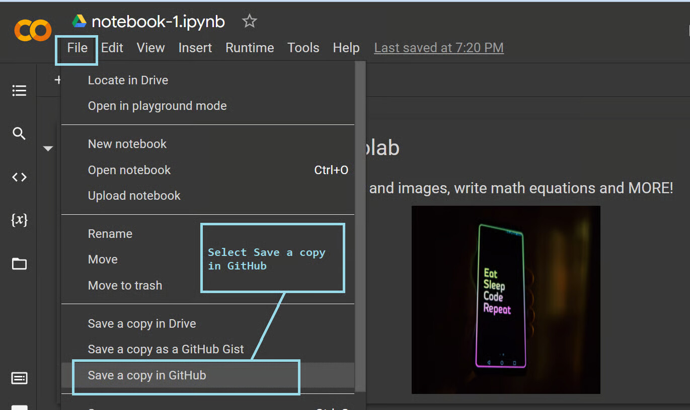

## Overview {.unnumbered}

In this lab you apply the neural network concepts from Lecture 3 to two real datasets:

| Problem | Dataset | Task | Metric |
|---------|---------|------|--------|
| **Regression** | California Housing | Predict median house value | RMSE, R² |
| **Classification** | Palmer Penguins | Classify species (3 classes) | Accuracy, Confusion Matrix |

You will implement the full ML pipeline for each: data loading → preprocessing → model definition → training → evaluation.

**Required packages** (already installed in the course environment):

```python
pandas, numpy, matplotlib, seaborn, scikit-learn, torch
```

**Submission**: Run all cells and submit the rendered HTML.

---

## Setup

```{python}
#| label: lab-setup
#| eval: true
import os, warnings
import numpy as np
import pandas as pd
import matplotlib
matplotlib.use('Agg')
import matplotlib.pyplot as plt
import seaborn as sns
from sklearn.metrics import (confusion_matrix, classification_report,
                              r2_score, mean_squared_error)
from sklearn.preprocessing import StandardScaler, LabelEncoder
from sklearn.model_selection import train_test_split
import torch
from torch import nn
from torch.utils import data as torchdata
warnings.filterwarnings('ignore')
torch.manual_seed(42); np.random.seed(42)

fig_dir = "M0_lecture03_figures"
os.makedirs(fig_dir, exist_ok=True)
device = torch.device('cuda' if torch.cuda.is_available() else 'cpu')
print(f"PyTorch {torch.__version__} | device: {device}")
```

---

# Problem Set 1: California Housing — MLP Regression {#sec-ames}

The [California Housing dataset](https://scikit-learn.org/stable/datasets/real_world.html#california-housing-dataset) contains 8 numeric features (median income, house age, avg rooms, etc.) for 20,640 census block groups in California.  The task is to predict the **median house value** (in units of $100,000).

> **Note**: This dataset ships with scikit-learn and requires no internet access — making it ideal for reproducible lab work.

## Problem 1.1 — Load and Explore the Data {#sec-p1-1}

```{python}
#| label: ames-load
#| eval: true

from sklearn.datasets import fetch_california_housing

cal = fetch_california_housing(as_frame=True)
df_ames = cal.frame.copy()
# Rename target to SalePrice for consistent code below (units: $100k)
df_ames = df_ames.rename(columns={'MedHouseVal': 'SalePrice'})

print(f"Shape: {df_ames.shape}")
print(f"\nFeatures: {list(df_ames.columns)}")
print(f"\nFirst 5 rows:")
df_ames.head()
```

```{python}
#| label: ames-explore
#| eval: true
# Distribution of the target variable
print("Target: SalePrice (median house value, units: $100k)")
print(df_ames['SalePrice'].describe())
```

```{python}
#| label: fig-ames-eda
#| fig-cap: "California Housing EDA: (left) target distribution; (right) log-transformed; (bottom) feature correlation heatmap."
#| eval: true
fig = plt.figure(figsize=(14, 9))
gs = fig.add_gridspec(2, 2)

ax1 = fig.add_subplot(gs[0, 0])
prices = df_ames['SalePrice'].astype(float)
ax1.hist(prices, bins=50, color='steelblue', edgecolor='white')
ax1.set_xlabel('Median House Value ($100k)'); ax1.set_ylabel('Count')
ax1.set_title('Sale Price Distribution')

ax2 = fig.add_subplot(gs[0, 1])
ax2.hist(np.log1p(prices), bins=50, color='tomato', edgecolor='white')
ax2.set_xlabel('log(1 + Value)'); ax2.set_ylabel('Count')
ax2.set_title('Log-Transformed Target')

ax3 = fig.add_subplot(gs[1, :])
corr = df_ames.corr(numeric_only=True)
sns.heatmap(corr, annot=True, fmt='.2f', cmap='coolwarm', ax=ax3,
            linewidths=0.5, annot_kws={'size': 8})
ax3.set_title('Feature Correlation Matrix')

plt.suptitle('California Housing — Exploratory Data Analysis', fontsize=13)
plt.tight_layout()
plt.savefig(f"{fig_dir}/fig_Lab3_ames_eda.png", dpi=130, bbox_inches='tight')
plt.show()
```

## Problem 1.2 — Preprocessing {#sec-p1-2}

California Housing is all-numeric with no missing values, so preprocessing is straightforward:

1. **Log-transform** the target to reduce right skew
2. **Standardize** features to zero mean / unit variance
3. **Split** into train / val / test sets

```{python}
#| label: ames-preprocess
#| eval: true

# Separate target
y_raw = df_ames['SalePrice'].astype(float).values
y_log = np.log1p(y_raw)   # predict log(1+value) to handle skewness

# Feature matrix: all columns except target
X_proc = df_ames.drop(columns=['SalePrice']).astype(np.float32)
print(f"Features: {list(X_proc.columns)}")
print(f"Missing values: {X_proc.isna().sum().sum()}  (none expected)")

# --- Train / val / test split (70/15/15) ---
X_tr, X_tmp, y_tr, y_tmp = train_test_split(X_proc.values, y_log, test_size=0.3, random_state=42)
X_val, X_te, y_val, y_te = train_test_split(X_tmp, y_tmp, test_size=0.5, random_state=42)
print(f"Train: {X_tr.shape[0]} | Val: {X_val.shape[0]} | Test: {X_te.shape[0]}")

# --- Standardise ---
scaler = StandardScaler()
X_tr_s  = scaler.fit_transform(X_tr).astype(np.float32)
X_val_s = scaler.transform(X_val).astype(np.float32)
X_te_s  = scaler.transform(X_te).astype(np.float32)

# Convert to tensors
def to_tensor(arr):  return torch.from_numpy(arr.astype(np.float32))
Xtr_t = to_tensor(X_tr_s);  ytr_t = to_tensor(y_tr.astype(np.float32)).unsqueeze(1)
Xv_t  = to_tensor(X_val_s); yv_t  = to_tensor(y_val.astype(np.float32)).unsqueeze(1)
Xte_t = to_tensor(X_te_s);  yte_t = to_tensor(y_te.astype(np.float32)).unsqueeze(1)

n_features = Xtr_t.shape[1]
print(f"\nInput dimension: {n_features}")
```

## Problem 1.3 — Build Three MLP Architectures {#sec-p1-3}

Compare three model depths on the California Housing regression task.

**Your task**: Fill in the `MLP_2Layer` and `MLP_3Layer` architectures following the same pattern as `MLP_1Layer`.

```{python}
#| label: ames-models
#| eval: true

class MLP_1Layer(nn.Module):
    """Single linear layer (= linear regression)."""
    def __init__(self, n_in):
        super().__init__()
        self.net = nn.Sequential(nn.Linear(n_in, 1))

    def forward(self, x): return self.net(x)


class MLP_2Layer(nn.Module):
    """1 hidden layer: Linear(n_in→256) → ReLU → Linear(256→1)."""
    def __init__(self, n_in):
        super().__init__()
        # TODO: build self.net using nn.Sequential
        # Hint: nn.Linear(n_in, 256), nn.ReLU(), nn.Linear(256, 1)
        self.net = nn.Sequential(
            nn.Linear(n_in, 256),
            nn.ReLU(),
            nn.Linear(256, 1)
        )

    def forward(self, x): return self.net(x)


class MLP_3Layer(nn.Module):
    """2 hidden layers: n_in → 256 → 128 → 1, with dropout."""
    def __init__(self, n_in, dropout=0.3):
        super().__init__()
        # TODO: build self.net
        # Hint: Add nn.Dropout(dropout) after each ReLU
        self.net = nn.Sequential(
            nn.Linear(n_in, 256), nn.ReLU(), nn.Dropout(dropout),
            nn.Linear(256, 128),  nn.ReLU(), nn.Dropout(dropout),
            nn.Linear(128, 1)
        )

    def forward(self, x): return self.net(x)


# Quick parameter count
for ModelClass in [MLP_1Layer, MLP_2Layer, MLP_3Layer]:
    m = ModelClass(n_features)
    params = sum(p.numel() for p in m.parameters())
    print(f"{ModelClass.__name__:15s}: {params:,} parameters")
```

## Problem 1.4 — Train and Evaluate {#sec-p1-4}

```{python}
#| label: ames-train
#| eval: true

def train_reg(model, Xtr, ytr, Xval, yval,
              lr=1e-3, epochs=150, batch_size=64, weight_decay=1e-4):
    """Train a regression model, return (train_losses, val_losses)."""
    loader  = torchdata.DataLoader(
        torchdata.TensorDataset(Xtr.to(device), ytr.to(device)),
        batch_size=batch_size, shuffle=True
    )
    loss_fn = nn.MSELoss()
    optim   = torch.optim.Adam(model.parameters(), lr=lr, weight_decay=weight_decay)
    tr_hist, vl_hist = [], []

    for epoch in range(1, epochs+1):
        model.train(); ep_loss = 0
        for Xb, yb in loader:
            pred = model(Xb); l = loss_fn(pred, yb)
            optim.zero_grad(); l.backward(); optim.step()
            ep_loss += l.item() * len(Xb)
        tr_hist.append(ep_loss / len(Xtr))
        model.eval()
        with torch.no_grad():
            vl_hist.append(loss_fn(model(Xval.to(device)), yval.to(device)).item())
        if epoch % 50 == 0:
            print(f"  Epoch {epoch:3d} | Train MSE: {tr_hist[-1]:.4f} | Val MSE: {vl_hist[-1]:.4f}")
    return tr_hist, vl_hist


model_classes = {'Linear (1-layer)': MLP_1Layer,
                 '2-Layer MLP':       MLP_2Layer,
                 '3-Layer MLP':       MLP_3Layer}

trained_models = {}
histories = {}

for name, Cls in model_classes.items():
    print(f"\nTraining {name}...")
    m = Cls(n_features).to(device)
    tr, vl = train_reg(m, Xtr_t, ytr_t, Xv_t, yv_t,
                       lr=1e-3, epochs=150, batch_size=64)
    trained_models[name] = m
    histories[name] = (tr, vl)
```

```{python}
#| label: fig-ames-loss
#| fig-cap: "Training and validation MSE (on log-price) for three model architectures."
#| eval: true

fig, axes = plt.subplots(1, 3, figsize=(15, 4))
colors = ['steelblue', 'darkorange', 'tomato']
for ax, ((name, (tr, vl)), color) in zip(axes, zip(histories.items(), colors)):
    ax.plot(tr, color=color, lw=2, label='Train')
    ax.plot(vl, color=color, lw=2, linestyle='--', alpha=0.7, label='Val')
    ax.set_title(name, fontsize=11)
    ax.set_xlabel('Epoch'); ax.set_ylabel('MSE (log-price)')
    ax.legend(fontsize=9)

plt.suptitle('California Housing — Training Dynamics', fontsize=13)
plt.tight_layout()
plt.savefig(f"{fig_dir}/fig_Lab3_ames_loss.png", dpi=130, bbox_inches='tight')
plt.show()
```

```{python}
#| label: ames-eval
#| eval: true

print(f"\n{'Model':<20}  {'Test RMSE ($100k)':>18}  {'R²':>8}")
print('-' * 52)
for name, m in trained_models.items():
    m.eval()
    with torch.no_grad():
        y_pred_log = m(Xte_t.to(device)).cpu().numpy().flatten()
    # Inverse-transform: exp(prediction) - 1  (units: $100k)
    y_pred = np.expm1(y_pred_log)
    y_true = np.expm1(y_te)
    rmse = np.sqrt(mean_squared_error(y_true, y_pred))
    r2   = r2_score(y_true, y_pred)
    print(f"{name:<20}  {rmse:>18.4f}  {r2:>8.4f}")
```

```{python}
#| label: fig-ames-predictions
#| fig-cap: "Predicted vs. actual median house value (3-Layer MLP, units: $100k). Points close to the diagonal indicate accurate predictions."
#| eval: true

best_model = trained_models['3-Layer MLP']
best_model.eval()
with torch.no_grad():
    y_pred_log = best_model(Xte_t.to(device)).cpu().numpy().flatten()
y_pred_price = np.expm1(y_pred_log)
y_true_price = np.expm1(y_te)

fig, axes = plt.subplots(1, 2, figsize=(13, 5))
ax = axes[0]
ax.scatter(y_true_price, y_pred_price, alpha=0.4, s=20, color='tomato')
min_p, max_p = y_true_price.min(), y_true_price.max()
ax.plot([min_p, max_p], [min_p, max_p], 'k--', lw=1.5, label='Perfect prediction')
ax.set_xlabel('Actual Value ($100k)'); ax.set_ylabel('Predicted Value ($100k)')
ax.set_title('3-Layer MLP: Predicted vs. Actual')
ax.legend()

ax2 = axes[1]
residuals = y_pred_price - y_true_price
ax2.scatter(y_true_price, residuals, alpha=0.4, s=20, color='steelblue')
ax2.axhline(0, color='black', lw=1.5, linestyle='--')
ax2.set_xlabel('Actual Value ($100k)'); ax2.set_ylabel('Residual (ŷ − y)')
ax2.set_title('Residual Plot')

plt.tight_layout()
plt.savefig(f"{fig_dir}/fig_Lab3_ames_pred.png", dpi=130, bbox_inches='tight')
plt.show()
```

### Reflection Questions — Problem 1 {.unnumbered}

> **Q1.1** Which model achieved the lowest test RMSE?  Was the improvement between the 1-layer and 3-layer model significant?

*Your answer here.*

> **Q1.2** Look at the residual plot.  Are errors roughly symmetric around zero?  What does a pattern in the residuals suggest?

*Your answer here.*

> **Q1.3** The target was log-transformed before training.  Why?  What would happen if we trained directly on the raw values?

*Your answer here.*

---

# Problem Set 2: Palmer Penguins — MLP Classification {#sec-penguins}

The [Palmer Penguins](https://github.com/allisonhorst/palmerpenguins) dataset contains measurements of 344 penguins across 3 species (*Adelie*, *Chinstrap*, *Gentoo*).  The task is to predict the species from physical measurements.

## Problem 2.1 — Load and Explore the Data {#sec-p2-1}

```{python}
#| label: penguins-load
#| eval: true

# Load via seaborn
penguins = sns.load_dataset('penguins').dropna()
print(f"Shape: {penguins.shape}")
print(f"\nSpecies counts:")
print(penguins['species'].value_counts())
print(f"\nFirst 5 rows:")
penguins.head()
```

```{python}
#| label: fig-penguins-eda
#| fig-cap: "Palmer Penguins EDA: pairplot of numeric features coloured by species."
#| eval: true

fig, axes = plt.subplots(2, 3, figsize=(14, 8))
features = ['bill_length_mm', 'bill_depth_mm', 'flipper_length_mm', 'body_mass_g']
species_colors = {'Adelie': 'steelblue', 'Chinstrap': 'tomato', 'Gentoo': 'forestgreen'}
species_list = list(species_colors.keys())

# Scatter matrix (top 3 feature pairs)
pairs = [('bill_length_mm', 'bill_depth_mm'),
         ('bill_length_mm', 'flipper_length_mm'),
         ('flipper_length_mm', 'body_mass_g')]
for i, (fx, fy) in enumerate(pairs):
    ax = axes[0, i]
    for sp, c in species_colors.items():
        sub = penguins[penguins['species'] == sp]
        ax.scatter(sub[fx], sub[fy], s=25, alpha=0.6, color=c, label=sp)
    ax.set_xlabel(fx, fontsize=9); ax.set_ylabel(fy, fontsize=9)
    ax.set_title(f'{fx} vs {fy}', fontsize=9)
    if i == 0: ax.legend(fontsize=8)

# Boxplots
for i, feat in enumerate(features[:3]):
    ax = axes[1, i]
    for j, (sp, c) in enumerate(species_colors.items()):
        data = penguins[penguins['species'] == sp][feat]
        ax.boxplot(data, positions=[j], patch_artist=True,
                   boxprops=dict(facecolor=c, alpha=0.6),
                   medianprops=dict(color='black', lw=2))
    ax.set_xticks([0, 1, 2]); ax.set_xticklabels(species_list, fontsize=9)
    ax.set_title(feat, fontsize=10)

plt.suptitle('Palmer Penguins — Exploratory Data Analysis', fontsize=13)
plt.tight_layout()
plt.savefig(f"{fig_dir}/fig_Lab3_penguins_eda.png", dpi=130, bbox_inches='tight')
plt.show()
```

## Problem 2.2 — Preprocessing {#sec-p2-2}

```{python}
#| label: penguins-preprocess
#| eval: true

# Encode species as integers
le = LabelEncoder()
y_peng = le.fit_transform(penguins['species'].values)
print(f"Class mapping: {dict(zip(le.classes_, le.transform(le.classes_)))}")

# Feature matrix: numeric features only (drop island, sex for simplicity)
feature_cols = ['bill_length_mm', 'bill_depth_mm', 'flipper_length_mm', 'body_mass_g']
X_peng = penguins[feature_cols].values.astype(np.float32)

# Train / val / test split (70 / 15 / 15)
Xp_tr, Xp_tmp, yp_tr, yp_tmp = train_test_split(X_peng, y_peng, test_size=0.3,
                                                   random_state=42, stratify=y_peng)
Xp_val, Xp_te, yp_val, yp_te = train_test_split(Xp_tmp, yp_tmp, test_size=0.5,
                                                   random_state=42, stratify=yp_tmp)
print(f"Train: {len(Xp_tr)} | Val: {len(Xp_val)} | Test: {len(Xp_te)}")

# Standardise
sc_p = StandardScaler()
Xp_tr_s  = sc_p.fit_transform(Xp_tr).astype(np.float32)
Xp_val_s = sc_p.transform(Xp_val).astype(np.float32)
Xp_te_s  = sc_p.transform(Xp_te).astype(np.float32)

# Tensors
XPt  = torch.from_numpy(Xp_tr_s);  yPt  = torch.from_numpy(yp_tr.astype(np.int64))
XPv  = torch.from_numpy(Xp_val_s); yPv  = torch.from_numpy(yp_val.astype(np.int64))
XPte = torch.from_numpy(Xp_te_s);  yPte = torch.from_numpy(yp_te.astype(np.int64))

n_classes = len(le.classes_)
n_peng_feat = Xp_tr_s.shape[1]
print(f"\nInput features: {n_peng_feat} | Classes: {n_classes} ({', '.join(le.classes_)})")
```

## Problem 2.3 — Build the Classifier {#sec-p2-3}

**Your task**: Complete the `PenguinMLP` class.  The output layer must have `n_classes` outputs (no softmax — `CrossEntropyLoss` handles it internally).

```{python}
#| label: penguins-model
#| eval: true

class PenguinMLP(nn.Module):
    """
    MLP classifier for Palmer Penguins.
    Architecture: 4 → 32 → 16 → 3 (output logits)
    """
    def __init__(self, n_in=4, n_out=3, dropout=0.2):
        super().__init__()
        # TODO: complete the network
        # Hint: use nn.Sequential with Linear, ReLU, and Dropout layers
        # Final layer: nn.Linear(16, n_out) — no activation (CrossEntropyLoss handles softmax)
        self.net = nn.Sequential(
            nn.Linear(n_in, 32),
            nn.ReLU(),
            nn.Dropout(dropout),
            nn.Linear(32, 16),
            nn.ReLU(),
            nn.Dropout(dropout),
            nn.Linear(16, n_out)
        )

    def forward(self, x):
        return self.net(x)


peng_model = PenguinMLP(n_peng_feat, n_classes).to(device)
print(peng_model)
print(f"\nTotal parameters: {sum(p.numel() for p in peng_model.parameters()):,}")
```

## Problem 2.4 — Train the Classifier {#sec-p2-4}

```{python}
#| label: penguins-train
#| eval: true

def train_clf(model, Xtr, ytr, Xval, yval,
              lr=5e-3, epochs=200, batch_size=32, weight_decay=1e-3):
    loader  = torchdata.DataLoader(
        torchdata.TensorDataset(Xtr.to(device), ytr.to(device)),
        batch_size=batch_size, shuffle=True
    )
    loss_fn = nn.CrossEntropyLoss()
    optim   = torch.optim.Adam(model.parameters(), lr=lr, weight_decay=weight_decay)
    tr_hist, vl_hist, acc_hist = [], [], []

    for epoch in range(1, epochs+1):
        model.train(); ep_loss = 0
        for Xb, yb in loader:
            logits = model(Xb); l = loss_fn(logits, yb)
            optim.zero_grad(); l.backward(); optim.step()
            ep_loss += l.item() * len(Xb)
        tr_hist.append(ep_loss / len(Xtr))

        model.eval()
        with torch.no_grad():
            val_logits = model(Xval.to(device))
            vl_hist.append(loss_fn(val_logits, yval.to(device)).item())
            acc = (val_logits.argmax(1) == yval.to(device)).float().mean().item()
            acc_hist.append(acc)

        if epoch % 50 == 0:
            print(f"  Epoch {epoch:3d} | Train loss: {tr_hist[-1]:.4f} | "
                  f"Val loss: {vl_hist[-1]:.4f} | Val Acc: {acc:.4f}")
    return tr_hist, vl_hist, acc_hist


print("Training Penguin MLP Classifier...")
peng_tr, peng_vl, peng_acc = train_clf(
    peng_model, XPt, yPt, XPv, yPv,
    lr=5e-3, epochs=200, batch_size=32
)
```

```{python}
#| label: fig-penguins-loss
#| fig-cap: "Training and validation loss/accuracy curves for the penguin classifier."
#| eval: true

fig, axes = plt.subplots(1, 2, figsize=(12, 4))
epochs_p = range(1, len(peng_tr)+1)
axes[0].plot(epochs_p, peng_tr, 'b-', lw=2, label='Train')
axes[0].plot(epochs_p, peng_vl, 'r--', lw=2, label='Val')
axes[0].set_xlabel('Epoch'); axes[0].set_ylabel('Cross-Entropy Loss')
axes[0].set_title('Loss Curves — Penguin Classifier')
axes[0].legend()

axes[1].plot(epochs_p, peng_acc, 'g-', lw=2)
axes[1].axhline(1.0, color='gray', lw=1, linestyle='--', alpha=0.5, label='Perfect accuracy')
axes[1].set_xlabel('Epoch'); axes[1].set_ylabel('Validation Accuracy')
axes[1].set_title('Validation Accuracy')
axes[1].set_ylim(0, 1.05); axes[1].legend()

plt.suptitle('Palmer Penguins — Training Dynamics', fontsize=13)
plt.tight_layout()
plt.savefig(f"{fig_dir}/fig_Lab3_penguins_loss.png", dpi=130, bbox_inches='tight')
plt.show()
```

## Problem 2.5 — Evaluate the Classifier {#sec-p2-5}

```{python}
#| label: penguins-eval
#| eval: true

peng_model.eval()
with torch.no_grad():
    logits = peng_model(XPte.to(device))
    y_pred_p = logits.argmax(1).cpu().numpy()

test_acc = (y_pred_p == yp_te).mean()
print(f"Test Accuracy: {test_acc:.4f} ({test_acc*100:.1f}%)")
print()
print(classification_report(yp_te, y_pred_p, target_names=le.classes_))
```

```{python}
#| label: fig-confusion-matrix
#| fig-cap: "Confusion matrix for the penguin classifier. Rows = true class, columns = predicted class."
#| eval: true

cm = confusion_matrix(yp_te, y_pred_p)
fig, ax = plt.subplots(figsize=(7, 5))
sns.heatmap(cm, annot=True, fmt='d', cmap='Blues',
            xticklabels=le.classes_, yticklabels=le.classes_,
            ax=ax, linewidths=0.5)
ax.set_xlabel('Predicted Species', fontsize=12)
ax.set_ylabel('True Species', fontsize=12)
ax.set_title(f'Confusion Matrix — Penguin MLP (Acc = {test_acc:.2%})', fontsize=12)
plt.tight_layout()
plt.savefig(f"{fig_dir}/fig_Lab3_penguins_cm.png", dpi=130, bbox_inches='tight')
plt.show()
```

```{python}
#| label: fig-penguins-decision
#| fig-cap: "Decision regions for the penguin classifier using the two most discriminative features (bill length vs. flipper length)."
#| eval: true

# Use only 2 features for visualisation
feat_idx = [0, 2]   # bill_length_mm, flipper_length_mm
feat_names = [feature_cols[i] for i in feat_idx]

X_2d = Xp_tr_s[:, feat_idx]; X_2d_te = Xp_te_s[:, feat_idx]

model_2d = nn.Sequential(
    nn.Linear(2, 64), nn.ReLU(),
    nn.Linear(64, 32), nn.ReLU(),
    nn.Linear(32, 3)
).to(device)
loss_fn2d = nn.CrossEntropyLoss()
optim2d   = torch.optim.Adam(model_2d.parameters(), lr=5e-3, weight_decay=1e-3)
Xtr_2d_t = torch.from_numpy(X_2d).to(device)
ytr_2d_t = torch.from_numpy(yp_tr.astype(np.int64)).to(device)
for _ in range(500):
    model_2d.train()
    l = loss_fn2d(model_2d(Xtr_2d_t), ytr_2d_t)
    optim2d.zero_grad(); l.backward(); optim2d.step()

x1_min, x1_max = X_2d[:, 0].min()-0.5, X_2d[:, 0].max()+0.5
x2_min, x2_max = X_2d[:, 1].min()-0.5, X_2d[:, 1].max()+0.5
xx1, xx2 = np.meshgrid(np.linspace(x1_min, x1_max, 200),
                        np.linspace(x2_min, x2_max, 200))
grid = torch.from_numpy(
    np.c_[xx1.ravel(), xx2.ravel()].astype(np.float32)).to(device)
model_2d.eval()
with torch.no_grad():
    zz = model_2d(grid).argmax(1).cpu().numpy().reshape(xx1.shape)

cmap_back = plt.cm.Pastel1
cmap_pts  = [species_colors[s] for s in le.classes_]

fig, ax = plt.subplots(figsize=(8, 6))
ax.contourf(xx1, xx2, zz, alpha=0.35, cmap=cmap_back, levels=[-0.5,0.5,1.5,2.5])
for cls_idx, (sp, color) in enumerate(species_colors.items()):
    mask = yp_te == cls_idx
    ax.scatter(X_2d_te[mask, 0], X_2d_te[mask, 1],
               s=40, color=color, edgecolors='black', lw=0.5, label=sp, zorder=5)
ax.set_xlabel(feat_names[0]); ax.set_ylabel(feat_names[1])
ax.set_title('Decision Boundaries — 2-Feature Penguin MLP')
ax.legend(fontsize=9)
plt.tight_layout()
plt.savefig(f"{fig_dir}/fig_Lab3_penguins_boundary.png", dpi=130, bbox_inches='tight')
plt.show()
```

### Reflection Questions — Problem 2 {.unnumbered}

> **Q2.1** Which species is hardest to classify correctly?  Why might this be (hint: look at the EDA scatter plots)?

*Your answer here.*

> **Q2.2** Our model uses only 4 numeric features and drops `island` and `sex`.  Would adding these improve accuracy?  How would you encode them?

*Your answer here.*

> **Q2.3** The model outputs raw logits.  How do you convert these to probabilities for a real deployment scenario?

*Your answer here.*

---

# Problem Set 3 (Stretch): Model Comparison {#sec-stretch}

Compare your best Ames Housing MLP with a **logistic regression baseline** for the penguins problem (or a **linear regression baseline** for Ames).

```{python}
#| label: baseline-comparison
#| eval: true
from sklearn.linear_model import LogisticRegression, LinearRegression

# Penguin baseline: logistic regression
lr_clf = LogisticRegression(max_iter=500, random_state=42)
lr_clf.fit(Xp_tr_s, yp_tr)
lr_preds = lr_clf.predict(Xp_te_s)
lr_acc   = (lr_preds == yp_te).mean()
mlp_acc  = (y_pred_p == yp_te).mean()

# California Housing baseline: linear regression
lin_reg = LinearRegression()
lin_reg.fit(X_tr_s, y_tr)
lin_preds = lin_reg.predict(X_te_s)
lin_rmse  = np.sqrt(mean_squared_error(np.expm1(y_te), np.expm1(lin_preds)))

best_model.eval()
with torch.no_grad():
    mlp_preds_log = best_model(Xte_t.to(device)).cpu().numpy().flatten()
mlp_rmse = np.sqrt(mean_squared_error(np.expm1(y_te), np.expm1(mlp_preds_log)))

print("=" * 60)
print("  COMPARISON SUMMARY")
print("=" * 60)
print(f"{'Task':<30} {'Baseline':>14} {'MLP':>12}")
print("-" * 60)
print(f"{'Penguins (Accuracy)':<30} {lr_acc:>14.4f} {mlp_acc:>12.4f}")
print(f"{'CA Housing (RMSE, $100k)':<30} {lin_rmse:>14.4f} {mlp_rmse:>12.4f}")
```

```{python}
#| label: fig-comparison
#| fig-cap: "Side-by-side comparison: MLP vs. baseline models on both tasks."
#| eval: true

fig, axes = plt.subplots(1, 2, figsize=(11, 5))
# Classification
axes[0].bar(['Logistic Reg.', 'MLP'], [lr_acc, mlp_acc],
            color=['steelblue', 'tomato'], edgecolor='white')
axes[0].set_ylim(0, 1.05); axes[0].set_ylabel('Test Accuracy')
axes[0].set_title('Penguins: Classification Accuracy')
for i, v in enumerate([lr_acc, mlp_acc]):
    axes[0].text(i, v+0.01, f'{v:.1%}', ha='center', fontsize=12, fontweight='bold')

# Regression
axes[1].bar(['Linear Reg.', 'MLP'], [lin_rmse, mlp_rmse],
            color=['steelblue', 'tomato'], edgecolor='white')
axes[1].set_ylabel('Test RMSE ($100k)')
axes[1].set_title('CA Housing: RMSE ($100k)')
for i, v in enumerate([lin_rmse, mlp_rmse]):
    axes[1].text(i, v+0.005, f'{v:.3f}', ha='center', fontsize=11, fontweight='bold')

plt.suptitle('MLP vs. Linear Baseline', fontsize=13)
plt.tight_layout()
plt.savefig(f"{fig_dir}/fig_Lab3_comparison.png", dpi=130, bbox_inches='tight')
plt.show()
```

### Reflection Questions — Problem 3 {.unnumbered}

> **Q3.1** On the penguins task, did the MLP significantly outperform logistic regression?  What does this tell you about the dataset's linear separability?

*Your answer here.*

> **Q3.2** On the California Housing task, the MLP should outperform linear regression.  By how much?  In practical terms, what does that RMSE improvement mean for predicting house values?

*Your answer here.*

---

## Summary {.unnumbered}

| Step | Ames Housing (Regression) | Palmer Penguins (Classification) |
|------|--------------------------|----------------------------------|
| **Target** | `log(1+MedHouseVal)` | Species (3 classes, integer) |
| **Features** | 8 numeric (built-in, no download) | 4 numeric |
| **Loss** | `nn.MSELoss()` | `nn.CrossEntropyLoss()` |
| **Output layer** | `nn.Linear(→1)` | `nn.Linear(→3)` |
| **Metric** | RMSE (on original scale), R² | Accuracy, Confusion Matrix |
| **Key preprocessing** | Impute, one-hot encode, standardise | Drop NaN, encode target, standardise |

## References {.unnumbered}

::: {#refs}
:::


## What is Google Colab?
Google Colab is a cloud-based Jupyter notebook environment from Google Research. With its simple and easy-to-use interface, Colab helps you get started with your data science journey with almost no setup.

If you're interested in data science with Python, Colab is a great place to kickstart your data science projects without worrying about configuring your environment. Google Colab facilitates writing and execution of Python code right from your browser, and also comes with some of the most popular Python data science libraries pre-installed.

In the subsequent sections, you'll learn more about Google Colab's features.

## Creating your first Google Colab notebook
The best way to understand something is to try it yourself. Let's start by creating our very first colab notebook:

Head over to colab.research.google.com. You'll see the following screen. To be able to write and run code, you need to sign in with your Google credentials. This is the only step that's required from your end. No other configuration is needed.



Once you've signed in to Colab, you can create a new notebook by clicking on 'File' → 'New notebook', as shown below:
Creating your first Google Colab notebook 2

After you've created a new notebook, you can rename the notebook to a name of your choice. You're now all set to code your way through the project.

Google Colab is a self-contained environment. It allows you to write Python code as well as text—using markdown cells—to include rich text and media, as shown below. This helps in adding instructions for a step-by-step walkthrough of the project, thereby improving readability.
Creating your first Google Colab notebook 3

Now that you've learned how to create a Colab notebook, let's look at its advantages in the next sections.

## Why you should consider using Google Colab
Apart from being a browser-based environment that requires a simple Google sign-in, Colab has several useful features that make it helpful for the data science community. The following are some of the advantages:

## Pre-installed data science libraries
Easy sharing and collaboration
Seamless integration with GitHub
Working with data from various sources
Automatic storage and version control
Access to hardware accelerators such as GPUs and TPUs
Pre-installed data science libraries
Pre-installed libraries are one of the reasons why Colab is a popular choice to set up your data science project almost instantly.

Colab comes with pre-installed Python libraries for data analysis and visualization, such as NumPy, pandas, matplotlib, and seaborn. This means you can go straight ahead and import them into your current project, and use any of the modules as needed without having to install them.

As you may know, these libraries suffice for most data analysis projects, and for successfully finishing the data preprocessing and exploratory data analysis (EDA) steps in the ML pipeline for larger projects.

If you're interested in gaining proficiency over these data science libraries, be sure to check out DataCamp's Data Analyst with Python track.

In addition to these, Colab has machine learning libraries pre-installed, including scikit-learn, and deep learning libraries such as PyTorch, TensorFlow and Keras.

It is possible to build machine learning and deep learning projects with absolutely no installation required. All you need is access to a browser, and you can get your project up and running in a few minutes.

Working on a project as a group is a great learning experience. In the next section, you'll learn how Colab facilitates collaboration.

## Easy sharing and collaboration
Working in a Jupyter notebook environment in your local machine has limitations when it comes to collaborating with others. However, with Colab, you can share your notebook and collaboratively work on it with your friends and colleagues.

You can enable sharing in one easy step, as shown in the image below.

Easy sharing and collaboration 1

## Seamless Integration with GitHub
As a developer, you'll use GitHub all the time to keep track of changes to the different files in your project, and integrating it with Colab can only make things better.

Let's see how you can save your notebooks to GitHub repositories:

### Saving Colab notebooks to GitHub
To save your notebook to a GitHub repository, go to 'File' → 'Save a copy in GitHub'.
Saving Colab notebooks to GitHub 1

You'll then be prompted to authorize Colab. This authorization is required for Colab to be able to push commits to your repository.
Saving Colab notebooks to GitHub 2

You'll then have to confirm access following the prompts on the screen.

Once the authorization is successful, the following window should pop up on your screen.

Saving Colab notebooks to GitHub 3

In the above image:

The 'username' and 'name of the repo' are placeholders. You'll see your GitHub username, and can choose the repository that you'd like to push the current notebook to as the "name of the repo".
The default branch is the 'main' branch of the chosen repository, but you can choose any branch you'd like. You can also customize the file path as needed.
Finally, write a good commit message and click 'Ok'—your commit will now be pushed to the chosen GitHub repository.
This way, you can host all your Colab notebooks in GitHub repositories. This also facilitates knowledge dissemination, and thriving open-source projects.
  
## Working with data from various sources
In any data science project, you'll have to start by importing the dataset into your working environment. In this section, you'll learn about the different ways you can do this in Google Colab.

### Loading data from your local machine
To upload files containing the data from your local machine, click on the 'File upload' icon in the 'Files' tab as shown below, and choose the file that you'd like to upload.

Loading data from your local machine

### Mounting Google drive to Colab instance
If you prefer storing all your files in Google drive, you can easily mount it onto the current instance of Colab. This will enable you to access all the datasets and files that are stored in your drive.

There are a couple of ways you can do this:

You can click on the 'drive' icon in the 'Files' tab and follow the prompts on the screen.
Mounting Google drive to Colab instance

After your drive has been mounted successfully, you should be able to view the 'drive' folder listed as an available directory in the 'Files' tab.
Mounting Google drive to Colab instance 2

To mount your Google drive to the current Colab instance, you could alternatively run the following lines of code in a code cell in your notebook.

from google.colab import drive
drive.mount('content/drive')

You'll be prompted to grant access. Choose option 'Connect to Google Drive'. As with the previous method, you should be able to view the 'drive' folder listed in the 'Files' tab.

### Cloning a GitHub repo into Colab instance
If you need access to all files in a particular GitHub repository, you can clone it into your current workspace as follows.

Cloning a GitHub repo into Colab instance

Running the following line of code will enable you to clone any remote GitHub repository—simply replace the placeholder

!git clone <URL of the repo>

### Fetching remote data
Sometimes, you may need to fetch your dataset from the web; here's how to do so:

As you can run common shell commands inside the notebook environment, you may use the '!wget' command to fetch remote data by specifying its URL.

Let's now try to fetch the Boston housing dataset that's used in DataCamp's Supervised Learning with scikit-learn course.

The dataset can be found at this URL, and the following image shows how you can successfully retrieve it.

Fetching remote data

Automatic storage and version control
Have you ever had a hard time recovering lost files in your project?

With Colab, losing your project files is not a problem as all notebooks are auto-saved to the drive of the Google account that you've signed in with.

Even when you're collaborating with your friends and colleagues on a project, you can track all changes made to the notebook over time by looking up the revision history. Go to 'File' → 'Revision History' and you'll be able to view the changes and when a particular change was made.

Here's a sample revision history:

## Automatic storage and version control

## Access GPUs and TPUs
More often than not, the specifications of your local machine, and the constraints on processing power, can be a concern, especially when working with large deep learning models.

To overcome these limitations of your hardware, Colab provides access to hardware accelerators—Graphics Processing Unit (GPU) and Tensor Processing Unit (TPU) to train deep learning models faster.

The following figures illustrate how you can enable the use of GPUs in Colab notebook—it can be done in two simple steps.

Go to 'Runtime' → 'Change runtime type'
Access to computer hardware accelerators such as GPUs and TPUs 1

Set the hardware accelerator to either GPU or TPU as needed.Access to computer hardware accelerators such as GPUs and TPUs 2
So far, you've learned about useful features of Colab for data science.If this sounds exciting at all, you might also be interested in checking DataLab. You start using DataLab by signing up for a free DataCamp account.

## Limitations of Google Colab
Although Colab makes things easier, the following are some limitations that you should be aware of:

The free instance of Colab suffices for small to medium-scale projects. However, there's a constraint on the use of GPUs. The typical duration for which you can train your models on the GPU is 12 hours, after which the runtime gets disconnected. For extended usage of GPUs and TPUs, you'll have to upgrade to Colab Pro for enhanced usage.
Google Colab is tailor-made for data science in Python. However, there are times when you may want to use R, SQL or other programming languages to retrieve data from databases. Colab currently supports only Python. If you'd prefer to use R for your data science needs, and require integrations to MySQL databases, be sure to check out DataLab.
In Colab, the demand for and allocation of hardware accelerators all happens in real time. At times, this may result in fluctuations in GPU and TPU access.
The files and libraries that you install and import are specific to the particular instance of Colab. Upon disconnecting the runtime, you'll lose all files and packages in the instance. If you need to work on the notebook in multiple sprints, you'll have to connect to a runtime, and install all required packages yet again.

Colab imposes a disk space limitation in every instance, depending on the machine that you've been allocated for that instance. This may be prohibitive for very large datasets.