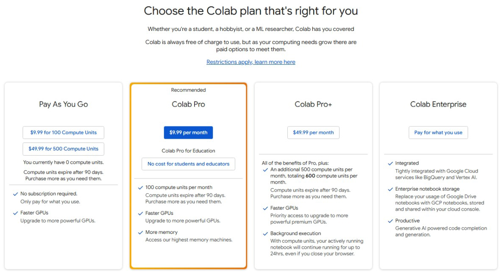

## Why This Lecture Matters

Before students can build neural models, RAG pipelines, or generative AI systems, they need three foundations:

1. A reliable runtime
2. Correct GPU usage
3. Basic tensor fluency

Module 0 starts there.

---

## Roadmap

- Why Colab is the default AD698 runtime
- Runtime setup and persistence rules
- Google Drive workflow
- Verifying GPU access
- Tensor ranks, shapes, and devices
- Indexing, reshaping, broadcasting, and reductions
- Why this matters for later labs, assignments, and projects

---

## The Shift to Generative AI

Traditional ML often predicts labels from fixed features.
Generative AI systems learn richer data distributions and require much more compute.

Why this matters for AD698:

- LLMs, transformers, and embedding models are compute-heavy
- We need an environment students can access quickly
- We want the whole course to run in a shared, reproducible notebook workflow

---

## Why Google Colab in AD698?

:::{.columns}
:::{.column width="55%"}

- No local CUDA setup required
- Fast start for Python notebooks
- GPU access for deep learning
- Tight integration with Google Drive
- Easy sharing and reproducibility
- Works well with the course notebook format

:::
:::{.column width="45%"}

{width="90%"}

:::
:::

---

## The Basic Colab Workflow

1. Open [Google Colab](https://colab.research.google.com/)
2. Create a new notebook
3. Rename it clearly
4. Save it in Drive
5. Change runtime to GPU when needed
6. Run cells top to bottom
7. Save outputs to Drive-backed folders, not just `/content`

---

## Runtime and Persistence

Colab is convenient, but it is not persistent by default.

Key rule:

- anything stored only in `/content` can disappear after runtime reset

Students should save:

- notebooks in Drive
- outputs in Drive-backed folders
- final deliverables outside the temporary runtime

:::{.callout-warning}
Restarting the runtime clears variables and temporary files.
:::

---

## Switching to GPU

When deep-learning code appears in the course, students should:

1. Click `Runtime -> Change runtime type`
2. Select `T4 GPU`
3. Save and reconnect
4. Verify the device inside Python

```python
import torch
print(torch.cuda.is_available())
if torch.cuda.is_available():
    print(torch.cuda.get_device_name(0))
```

---

## Drive Mount Pattern

This is the basic pattern we want students to reuse across the course:

```python
from google.colab import drive
drive.mount('/content/drive')
```

And then define stable folders:

```python
base = "/content/drive/MyDrive/AD698/M0"
```

---

## Tensor Vocabulary

- Scalar: one value
- Vector: 1D tensor
- Matrix: 2D tensor
- Tensor: general n-dimensional array

In deep learning, dimensions usually encode meaning:

- batch
- features or channels
- sequence or time
- height and width for images

---

## Tensor Shapes Matter

From the lecture notes:

```python
import torch

x_vec = torch.arange(6)
x_mat = torch.arange(12).reshape(3, 4)
x_tensor3 = torch.arange(24).reshape(2, 3, 4)
```

Students should always inspect:

- rank
- shape
- dtype
- device

---

## Common Tensor Operations

The tutorial and Lab 1 reinforce four operations students must become comfortable with:

1. Reshaping
2. Indexing and slicing
3. Broadcasting
4. Reductions such as `sum()` and `mean()`

These show up everywhere later in PyTorch models.

---

## Why Tensors Matter for Neural Networks

Neural networks are just tensor programs with learned parameters.

Examples:

- input batches are tensors
- model weights are tensors
- logits are tensors
- gradients are tensors

If students do not understand shapes, debugging later models becomes much harder.

---

## Course Alignment

Module 0 uses this foundation immediately:

- **Tutorial 1**: Colab setup, Drive, tensors
- **Lab 1**: tensor operations and environment checks
- **Later labs and assignments**: PyTorch models, GPU execution, and reproducible notebooks

This is why Module 0 begins with infrastructure and tensor fluency instead of jumping directly into models.

---

## Key Takeaways

- Colab is the primary execution environment for AD698 notebooks
- GPU setup should be deliberate and verified
- Drive-backed storage is essential for persistence
- Tensor shape and device awareness are core deep-learning skills
- Students who master this workflow early move much faster in later modules

