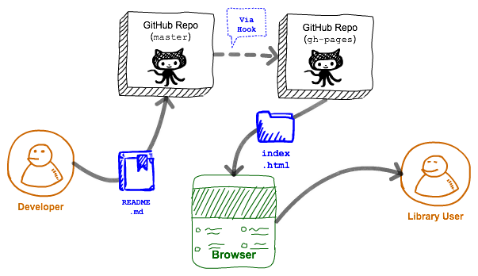
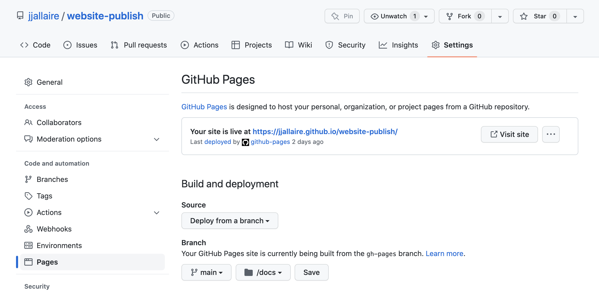
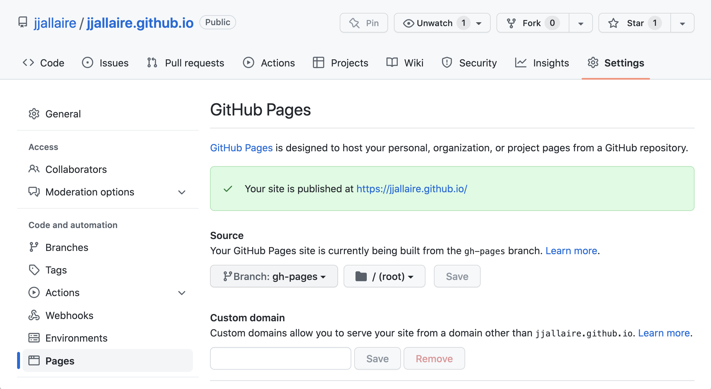

## How to print RevealJS slides

{width="80%" fig-align="center"}

---

# Why Google Colab?

## The cloud-first development model

:::{.columns}

:::{.column width="55%"}

- **No local install** — Colab runs Python in your browser; no conda, no CUDA drivers
- **Free GPU access** — T4 / A100 GPUs for training in minutes
- **Shareable notebooks** — send a link and anyone can open your exact environment
- **Deep GitHub integration** — open, edit, and push notebooks directly from a repo
- **Industry standard** — used by researchers, practitioners, and Kaggle competitors alike

:::

:::{.column width="45%"}

{width="90%" fig-align="center"}

:::

:::

---

## What Colab is good for

- Rapid prototyping of ML models without environment headaches
- Running GPU-intensive training jobs for free
- Sharing reproducible analysis notebooks with collaborators
- Accessing large pre-trained models (BERT, GPT-2, etc.) in seconds
- Following along with course materials — every AD698 notebook is Colab-ready

---

## What Colab is NOT a replacement for

- A full local IDE (no debugger, limited file access)
- Long-running production workloads (session times out after idle)
- Large-scale data storage (Google Drive is the workaround)
- Version control — you still need Git for that

::: {.callout-tip}
**Recommended workflow**: code on Colab, commit to GitHub, pull locally when needed.
:::

---

# Signing Up for Colab

## Step 1: Sign in with Google

:::{.columns}

:::{.column width="50%"}

1. Go to [colab.research.google.com](https://colab.research.google.com)
2. Click **Sign in** (top right)
3. Use your **personal** Google account — not your BU account
4. BU Google Workspace may restrict Colab access in some regions
5. Once signed in, you see the Colab welcome splash screen

:::

:::{.column width="50%"}

{width="90%" fig-align="center"}

:::

:::

---

## Step 2: Create a new notebook

:::{.columns}

:::{.column width="50%"}

1. From the Colab welcome screen click **New notebook**
2. A new `.ipynb` file opens in your Google Drive
3. Rename it by clicking the title at the top
4. Colab notebooks are saved automatically to **My Drive → Colab Notebooks**

:::

:::{.column width="50%"}

{width="90%" fig-align="center"}

:::

:::

---

## Your new notebook

:::{.columns}

:::{.column width="50%"}

- The notebook opens with one empty **code cell**
- Add cells with **+ Code** or **+ Text** buttons
- Run a cell with `Shift+Enter` or click the ▶ button
- Colab auto-connects to a runtime on first run

:::

:::{.column width="50%"}

{width="90%" fig-align="center"}

:::

:::

---

# Configuring the Runtime

## Why runtime matters

- The **runtime** is the virtual machine (CPU or GPU) that runs your code
- By default Colab starts a **CPU runtime**
- For deep learning (PyTorch, TensorFlow, Hugging Face), you want **GPU**
- You must change the runtime **before** running compute-heavy cells

---

## Step 1: Open Runtime settings

:::{.columns}

:::{.column width="50%"}

1. Click **Runtime** in the menu bar
2. Select **Change runtime type**
3. A dialog box opens

:::

:::{.column width="50%"}

{width="90%" fig-align="center"}

:::

:::

---

## Step 2: Select GPU accelerator

:::{.columns}

:::{.column width="50%"}

1. Under **Hardware accelerator** choose **T4 GPU** (free tier)
2. Click **Save**
3. Colab will restart the runtime — your variables are cleared
4. You can confirm GPU is active by running:

```python
import torch
print(torch.cuda.is_available())
print(torch.cuda.get_device_name(0))
```

:::

:::{.column width="50%"}

{width="90%" fig-align="center"}

:::

:::

---

# Running Notebooks

## Running your first cell

:::{.columns}

:::{.column width="50%"}

- Click any cell and press `Shift+Enter` to run
- The first run **connects to a new runtime** — takes ~15 seconds
- A green checkmark appears when the cell succeeds
- Output appears directly below the cell

:::

:::{.column width="50%"}

{width="90%" fig-align="center"}

:::

:::

---

## Running all cells

:::{.columns}

:::{.column width="50%"}

- **Runtime → Run all** executes every cell in order
- Useful for a clean end-to-end test of your notebook
- Watch for red error banners — they usually point to import or shape issues
- Re-run individual cells after fixing errors

:::

:::{.column width="50%"}

{width="90%" fig-align="center"}

:::

:::

---

## Completed run

:::{.columns}

:::{.column width="50%"}

- All cells show green checkmarks when successful
- Cell execution numbers appear in brackets `[1]`, `[2]`, …
- Figures and DataFrames render inline below each cell
- Save your work — Colab auto-saves, but manually commit to GitHub

:::

:::{.column width="50%"}

{width="90%" fig-align="center"}

:::

:::

---

# Connecting Colab to GitHub

## Why connect Colab to GitHub?

- Open notebooks directly from a private or public repo
- Save changes back without leaving the browser
- Keep a full version history of every notebook change
- Required for AD698 — all submissions go through GitHub Classroom

---

## Step 1: Authorize GitHub in Colab

:::{.columns}

:::{.column width="50%"}

1. In Colab click **File → Open notebook**
2. Select the **GitHub** tab
3. Click **Authorize with GitHub**
4. GitHub opens an OAuth dialog — click **Authorize google-colaboratory**
5. You are redirected back to Colab

:::

:::{.column width="50%"}

{width="90%" fig-align="center"}

:::

:::

---

## Step 2: Search for your repository

:::{.columns}

:::{.column width="50%"}

1. After authorizing, type your GitHub username or repo name in the search box
2. Colab lists all notebooks (`.ipynb`) it finds in the repository
3. Click the notebook to open it in Colab

:::

:::{.column width="50%"}

{width="90%" fig-align="center"}

:::

:::

---

## Step 3: Open the notebook

:::{.columns}

:::{.column width="50%"}

- The notebook opens exactly as stored in the repo
- Colab shows a banner: *"Opened from GitHub"*
- Any edits you make are **not** automatically saved back to GitHub
- You must explicitly push changes (see next slides)

:::

:::{.column width="50%"}

{width="90%" fig-align="center"}

:::

:::

---

## Step 4: Copy to Drive (optional)

:::{.columns}

:::{.column width="50%"}

- Click **File → Save a copy in Drive** to create a personal editable copy
- This copy lives in **My Drive → Colab Notebooks**
- Useful for experimenting without affecting the original repo
- Remember to sync changes back to GitHub when done

:::

:::{.column width="50%"}

{width="90%" fig-align="center"}

:::

:::

---

## Steps 5–7: Push changes back to GitHub

:::{.columns}

:::{.column width="55%"}

5. Click **File → Save a copy in GitHub**
6. A dialog shows the target repo, branch, and commit message
7. Edit the commit message to describe your change, then click **OK**
8. Colab commits the notebook to the chosen branch

:::

:::{.column width="45%"}

:::{.r-stack}

{.fragment .fade-out width="90%" fig-align="center"}

{.fragment .fade-in-then-out width="90%" fig-align="center"}

{.fragment width="90%" fig-align="center"}

:::

:::

:::

---

## Pushing a notebook from Colab

:::{.columns}

:::{.column width="50%"}

- The push creates a new commit in your GitHub repo
- Navigate to your repo on GitHub to confirm the commit appears
- Best practice: use a descriptive commit message ("Add GPU runtime check cell")
- You can push to any branch — use `main` for finished work and a feature branch for drafts

:::

:::{.column width="50%"}

{width="90%" fig-align="center"}

:::

:::

---

# Publishing with GitHub Pages

## Share your work publicly

:::{.columns}

:::{.column width="55%"}

- **GitHub Pages** turns a repo into a free static website
- Perfect for sharing reports, dashboards, and rendered notebooks
- Activate in **Settings → Pages → Branch: main → Folder: /docs**
- Every push to `main` automatically rebuilds the site

:::

:::{.column width="45%"}

{width="90%" fig-align="center"}

:::

:::

---

## Your published site

:::{.columns}

:::{.column width="50%"}

- Your site is live at `https://username.github.io/repo-name/`
- GitHub shows the URL in the Pages settings panel
- Changes take ~60 seconds to propagate after a push
- Great for course project deliverables and portfolios

:::

:::{.column width="50%"}

{width="90%" fig-align="center"}

:::

:::

---

# Key Takeaways

## What you can do now

:::{.columns}

:::{.column width="55%"}

- :white_check_mark: **Sign in** to Google Colab and create a new notebook
- :white_check_mark: **Switch to GPU** runtime before running deep learning code
- :white_check_mark: **Open** any AD698 notebook directly from GitHub
- :white_check_mark: **Edit and push** changes back to GitHub without leaving the browser
- :white_check_mark: **Publish** rendered outputs via GitHub Pages

:::

:::{.column width="45%"}

::: {.callout-note}
## AD698 Workflow in One Line

Open from GitHub → Run on GPU → Push back → Done.
:::

:::

:::

---

## Stop and check

[Before the next session, confirm you can:]{.uured-bold}

1. **Open a notebook** from the AD698 GitHub Classroom repo in Colab
2. **Change the runtime** to GPU and verify `torch.cuda.is_available()` returns `True`
3. **Edit a cell**, run it, and **push the change** back to GitHub with a meaningful commit message
4. (Optional) Enable GitHub Pages on your personal project repo

::: {.callout-tip}
Having trouble? Post in the course discussion board with a screenshot of the error message.
:::

