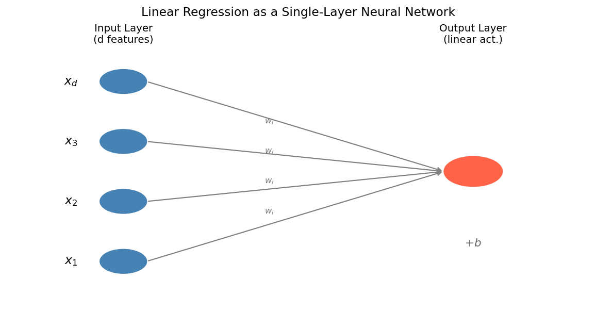
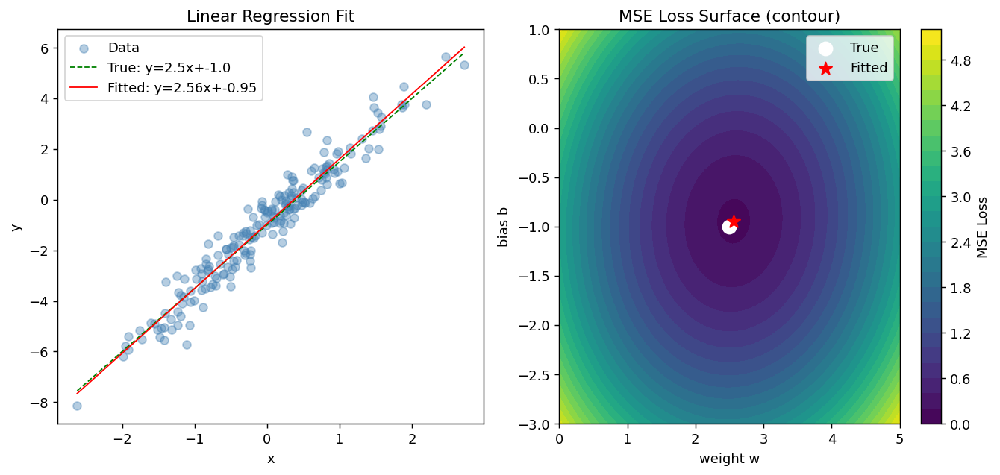
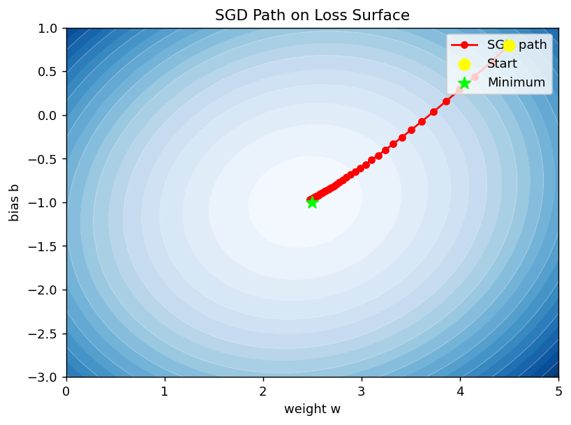
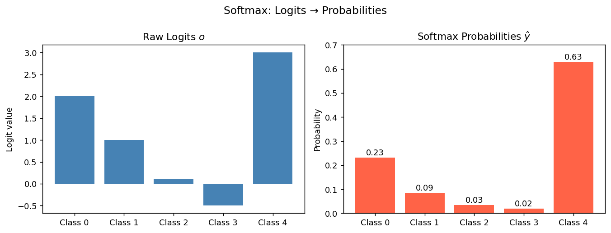
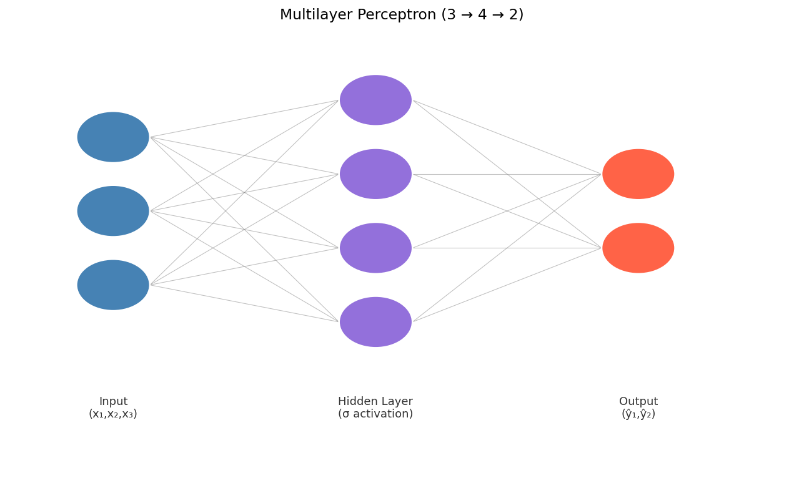
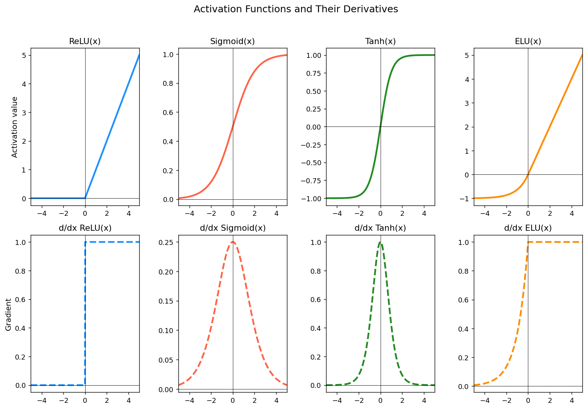

## Roadmap

- Linear regression as the simplest neural model
- Loss functions and optimization
- Softmax regression for classification
- MLP architecture and nonlinearity
- Backpropagation and regularization
- How this maps into PyTorch workflows

---

## Why This Lecture Matters

This lecture connects the math from the previous chapter to actual model families students will build in AD698.

The main progression is:

1. Linear model
2. Classification model
3. Multi-layer neural network
4. Practical PyTorch implementation

---

## Linear Regression

$$
\hat{y} = \mathbf{w}^\top \mathbf{x} + b
$$

This is the simplest neural model:

- one affine transformation
- no hidden layer
- continuous output

It is a useful baseline and a conceptual starting point for deeper networks.

---

## Linear Regression as a Network

{width="80%"}

This is just one neuron:

- inputs
- weights
- bias
- output

---

## Loss and Optimization

For regression, a common loss is mean squared error:

$$
\mathcal{L}(\mathbf{w}, b)=\frac{1}{2n}\|\hat{\mathbf{y}}-\mathbf{y}\|^2
$$

We minimize this with gradient-based optimization rather than solving everything analytically in large systems.

---

## Linear Regression Fit

{width="90%"}

This figure helps students see both:

- the data/model fit
- the parameter-space view of optimization

---

## SGD Path on the Loss Surface

{width="80%"}

Optimization is easier to understand when students can see the path, not just the final answer.

---

## From Regression to Classification

Regression predicts a continuous value.
Classification predicts a class label.

For multiclass classification we use logits plus softmax:

$$
\hat{p}_k = \frac{e^{o_k}}{\sum_{j=1}^{K} e^{o_j}}
$$

---

## Softmax Intuition

{width="85%"}

Students should learn to interpret logits as raw scores and softmax outputs as normalized class probabilities.

---

## Why We Need Hidden Layers

One linear layer can only express linear boundaries.

To model complex patterns, we need:

- hidden layers
- nonlinear activation functions

That is the step from linear models to multilayer perceptrons.

---

## MLP Architecture

$$
\mathbf{h}^{(1)} = \sigma(\mathbf{W}^{(1)}\mathbf{x}+\mathbf{b}^{(1)})
$$

$$
\hat{\mathbf{y}} = \text{softmax}(\mathbf{W}^{(L)}\mathbf{h}^{(L-1)}+\mathbf{b}^{(L)})
$$

Each hidden layer transforms the representation before the final prediction.

---

## MLP Diagram

{width="85%"}

This is the core architecture students will implement in Lab 3 and Assignment 0.

---

## Activation Functions Revisited

{width="88%"}

Why it matters here:

- activations prevent layer collapse
- ReLU is a practical default for hidden layers
- output activation depends on the task

---

## Backpropagation

Backpropagation computes gradients efficiently through the network by chaining local derivatives.

Students do not need to derive every expression by hand every time, but they do need to understand:

- what the gradients represent
- why deeper models can be harder to optimize
- how PyTorch automates the gradient bookkeeping

---

## Regularization and Overfitting

When networks get more expressive, they can overfit.

Key ideas students should know:

- train/validation/test split
- early stopping
- dropout
- weight decay

These show up directly in later labs and assignments.

---

## PyTorch Mapping

The lecture-note progression maps directly to PyTorch:

- parameters -> `nn.Parameter`
- model blocks -> `nn.Module`
- forward computation -> `forward()`
- training loop -> loss, backward, optimizer step

This is why Module 0 moves from math to code so quickly.

---

## Course Alignment

This presentation now lines up with:

- **Lecture Note 3**: linear models to MLPs
- **Tutorial 3**: single-layer perceptron vs. 3-layer MLP
- **Lab 3**: California Housing regression and Penguins classification
- **Assignment 0**: end-to-end PyTorch regression and classification workflows
- **Module 1**: early neural NLP, embeddings, and text classification

---

## Bridge to Module 1

In the next module, the same architecture logic is applied to text:

- tokens become vectors
- hidden layers transform text representations
- logits score classes or vocabulary items
- softmax produces probabilities
- cross-entropy drives learning

So Module 1 is best understood as **neural networks for language**, not as a separate mathematical world.

---

## Key Takeaways

- Linear regression is the simplest neural baseline
- Softmax extends the framework to multiclass classification
- Hidden layers plus activations create expressive nonlinear models
- Backpropagation and SGD make training practical
- PyTorch turns these mathematical ideas into reusable code patterns

