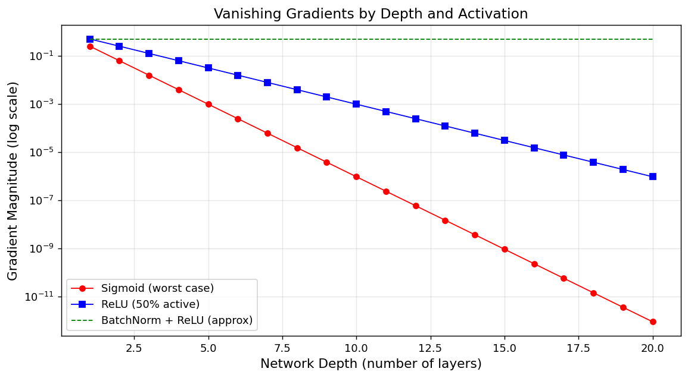
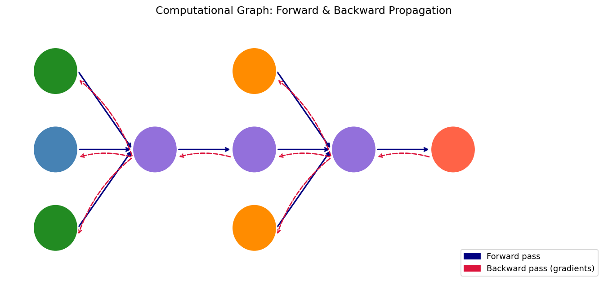
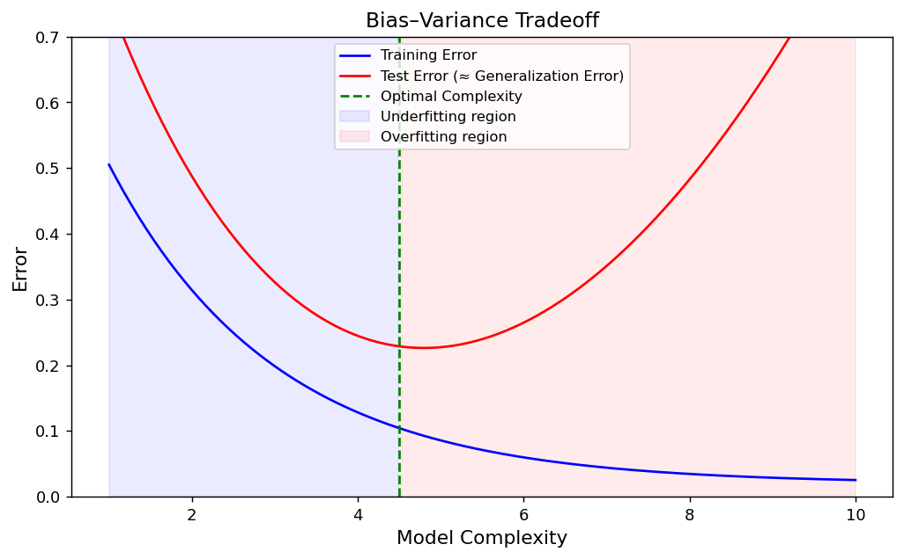
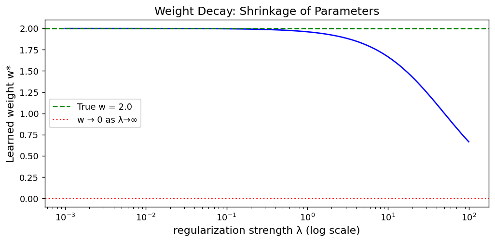
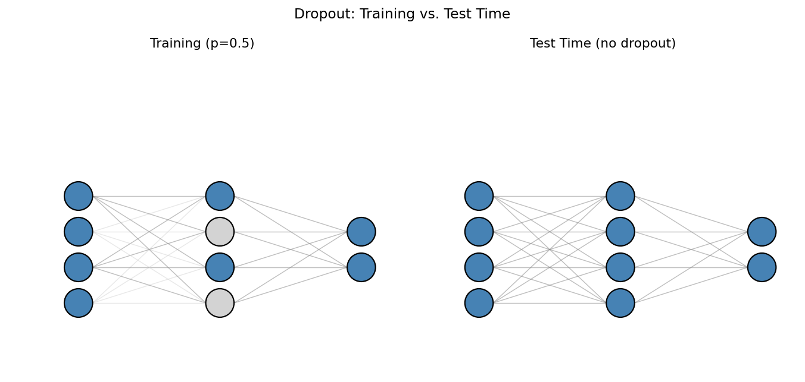
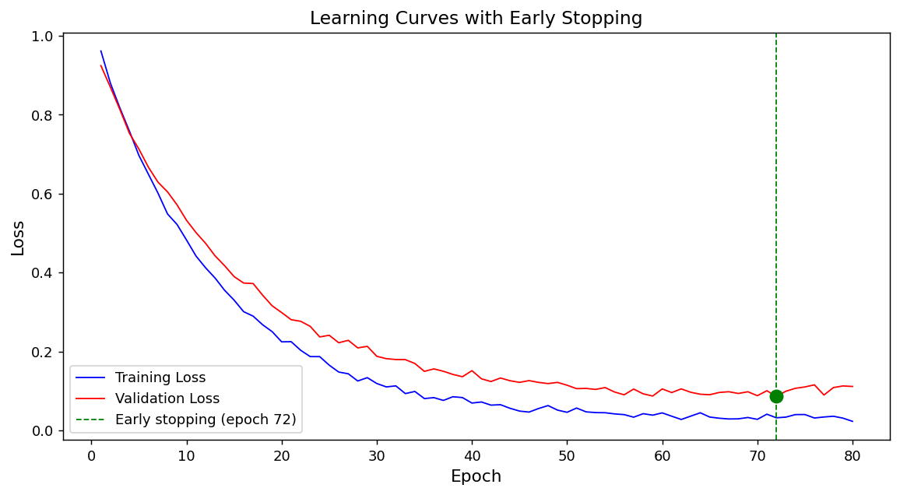

## Roadmap for Today

::: {.incremental}
- From **data → prediction**: the linear regression model
- **Optimization**: gradient descent and stochastic gradient descent
- **Multi-class classification**: the softmax function
- **Deep networks**: multi-layer perceptrons (MLPs)
- **Activation functions** and what they contribute
- **Backpropagation**: how networks learn
- **Regularization**: preventing overfitting
:::

---

## Why Neural Networks?

> "A neural network is a universal function approximator — given enough parameters and data it can learn *any* mapping from inputs to outputs."

::: {.columns}
::: {.column width="55%"}
**Classic ML limitations**

- Hand-crafted features
- Linear decision boundaries (mostly)
- Poor scaling to raw text/image/audio
:::
::: {.column width="45%"}
**Neural networks**

- Learn features automatically
- Non-linear boundaries
- Foundation of modern GenAI
:::
:::

---

## Linear Regression

$$
\begin{align}
\hat{y} &= \mathbf{w}^\top \mathbf{x} + b
\end{align}
$$

- $\mathbf{x} \in \mathbb{R}^d$: input features
- $\mathbf{w} \in \mathbb{R}^d$: learned weights
- $b \in \mathbb{R}$: bias term
- $\hat{y} \in \mathbb{R}$: predicted output

This is a **single-layer network** with no activation function.

---

## Linear Regression as a Graph

{width="80%"}

Each input $x_i$ is multiplied by weight $w_i$; results are summed and a bias is added.

---

## MSE Loss

$$
\begin{align}
\mathcal{L}(\mathbf{w}, b) &= \frac{1}{n} \sum_{i=1}^{n} \left( \hat{y}^{(i)} - y^{(i)} \right)^2
\end{align}
$$

- Penalizes large deviations quadratically
- Differentiable everywhere → amenable to gradient-based optimization
- Assumes errors are **Gaussian** (derived via MLE)

---

## Gradient Descent

$$
\begin{align}
\mathbf{w} &\leftarrow \mathbf{w} - \eta \, \nabla_{\mathbf{w}} \mathcal{L}
\end{align}
$$

- $\eta$ — **learning rate** (step size)
- $\nabla_{\mathbf{w}} \mathcal{L}$ — direction of steepest ascent; we step *opposite* to it
- Repeat until convergence

::: {.callout-tip}
Think of gradient descent as rolling a ball down a loss surface toward the lowest point.
:::

---

## SGD vs. Full-Batch

| | Full Batch | Mini-Batch SGD |
|---|---|---|
| **Data per update** | All $n$ samples | $B$ samples (e.g., 32–256) |
| **Gradient estimate** | Exact | Noisy but unbiased |
| **Speed per epoch** | Slow (large data) | Fast |
| **Memory** | High | Low |

In practice: **mini-batch SGD** is the default.

---

## SGD Path on a Loss Surface

{width="80%"}

Noisy updates help escape shallow local minima.

---

## Softmax Classification

For $K$ classes, produce a **probability distribution** over classes:

$$
\begin{align}
\hat{p}_k &= \frac{e^{o_k}}{\sum_{j=1}^{K} e^{o_j}}, \quad k = 1, \ldots, K
\end{align}
$$

- $o_k = \mathbf{w}_k^\top \mathbf{x} + b_k$ — raw logit for class $k$
- Outputs sum to 1 and are all positive ✓

---

## Softmax: Intuition

{width="85%"}

---

## Cross-Entropy Loss

$$
\begin{align}
\mathcal{L} &= -\sum_{k=1}^{K} y_k \log \hat{p}_k
\end{align}
$$

- $y_k \in \{0, 1\}$ — one-hot true label
- Heavily penalizes confident wrong predictions
- Equivalent to **maximum likelihood** for categorical data

---

## MLP Architecture

$$
\begin{align}
\mathbf{h}^{(1)} &= \sigma\!\left( \mathbf{W}^{(1)} \mathbf{x} + \mathbf{b}^{(1)} \right) \\
\mathbf{h}^{(2)} &= \sigma\!\left( \mathbf{W}^{(2)} \mathbf{h}^{(1)} + \mathbf{b}^{(2)} \right) \\
\hat{\mathbf{y}} &= \text{softmax}\!\left( \mathbf{W}^{(3)} \mathbf{h}^{(2)} + \mathbf{b}^{(3)} \right)
\end{align}
$$

Hidden layers introduce **non-linearity** via $\sigma(\cdot)$.

---

## MLP Architecture (Diagram)

{width="85%"}

---

## Why Activation Functions?

Without non-linearity:

$$
\begin{align}
\mathbf{W}^{(2)}\!\left(\mathbf{W}^{(1)} \mathbf{x}\right) = \underbrace{\mathbf{W}^{(2)}\mathbf{W}^{(1)}}_{\text{one matrix}} \mathbf{x}
\end{align}
$$

Multiple linear layers collapse into **one linear layer** — no extra expressive power!

Activation functions break this linearity.

---

## Common Activation Functions

{width="90%"}

| Function | Formula | Range |
|---|---|---|
| **Sigmoid** | $\frac{1}{1+e^{-z}}$ | $(0, 1)$ |
| **Tanh** | $\frac{e^z - e^{-z}}{e^z + e^{-z}}$ | $(-1, 1)$ |
| **ReLU** | $\max(0, z)$ | $[0, \infty)$ |

---

## The Vanishing Gradient Problem

{width="80%"}

- Sigmoid/Tanh saturate → gradients near **zero** for large $|z|$
- Gradients multiply through layers → exponentially **small** in early layers
- Solution: **ReLU** and its variants (Leaky ReLU, GELU, SiLU)

---

## Backpropagation

For a composition $\mathcal{L} = f(g(h(\mathbf{x})))$:

$$
\begin{align}
\frac{\partial \mathcal{L}}{\partial \mathbf{x}} &= \frac{\partial \mathcal{L}}{\partial f} \cdot \frac{\partial f}{\partial g} \cdot \frac{\partial g}{\partial h} \cdot \frac{\partial h}{\partial \mathbf{x}}
\end{align}
$$

**Backprop** = efficient application of the chain rule over a computational graph.

---

## Forward and Backward Pass

{width="85%"}

::: {.incremental}
1. **Forward pass** — compute predictions and loss
2. **Backward pass** — propagate gradients from output to input
3. **Parameter update** — apply gradient descent step
:::

---

## Bias–Variance Tradeoff

$$
\begin{align}
\text{Expected Error} &= \text{Bias}^2 + \text{Variance} + \text{Noise}
\end{align}
$$

{width="80%"}

- **High bias (underfitting)**: model too simple
- **High variance (overfitting)**: model memorizes training data

---

## Weight Decay

Add a penalty on parameter magnitude to the loss:

$$
\begin{align}
\mathcal{L}_{\text{reg}} &= \mathcal{L} + \frac{\lambda}{2} \|\mathbf{w}\|^2
\end{align}
$$

- $\lambda$ controls regularization strength
- Encourages **smaller** weights → smoother functions
- Equivalent to a **Gaussian prior** on weights (Bayesian view)

---

## Weight Decay Effect

{width="80%"}

---

## Dropout

During training, randomly **zero out** hidden units with probability $p$:

$$
\begin{align}
\tilde{\mathbf{h}} &= \mathbf{m} \odot \mathbf{h}, \quad m_i \sim \text{Bernoulli}(1-p)
\end{align}
$$

At test time: **no dropout** — use full network (scale by $1-p$).

{width="75%"}

---

## Learning Curves

{width="80%"}

Key diagnostics:

- **Train loss ↓, Val loss ↓**: still learning — keep going
- **Train loss ↓, Val loss ↑**: overfitting — add regularization or stop early
- **Both losses high**: underfitting — increase model capacity

---

## MLP from Scratch

```python
import torch

# Parameters (registered manually)
W1 = torch.randn(784, 256, requires_grad=True) * 0.01
b1 = torch.zeros(256, requires_grad=True)
W2 = torch.randn(256, 10,  requires_grad=True) * 0.01
b2 = torch.zeros(10,  requires_grad=True)

params = [W1, b1, W2, b2]

def net(X):
    H = torch.relu(X @ W1 + b1)   # hidden layer
    return H @ W2 + b2             # output logits
```

::: {.callout-note}
Explicit parameter tensors give full visibility into the forward computation — no hidden layers of abstraction.
:::

---

## Training from Scratch

```python
def cross_entropy(y_hat, y):
    """Numerically stable cross-entropy from raw logits."""
    log_sum = torch.log(y_hat.exp().sum(dim=1, keepdim=True))
    return -(y_hat - log_sum)[range(len(y)), y].mean()

def sgd(params, lr):
    with torch.no_grad():
        for p in params:
            p -= lr * p.grad
            p.grad.zero_()

for epoch in range(num_epochs):
    for X_b, y_b in train_iter:
        l = cross_entropy(net(X_b), y_b)
        l.backward()
        sgd(params, lr=0.1)
```

Three-step pattern: **forward → backward → update**.

---

## Fashion-MNIST: Benchmark Dataset

{width="85%"}

10 classes, 28×28 grayscale images — canonical benchmark for classification models.

---

## Key Takeaways

::: {.incremental}
- **Linear regression** is a single-neuron network; loss is MSE
- **Softmax** converts logits to probabilities for multi-class problems
- **MLPs** stack linear + activation layers to learn non-linear functions
- **Backprop** = chain rule on a computational graph
- **Overfitting** is controlled with weight decay and dropout
- **ReLU** avoids vanishing gradients that plague sigmoid/tanh
:::

---

## Looking Ahead

| Module | Topic |
|---|---|
| **M1** | Text representation — Bag of Words, TF-IDF |
| **M2** | Word embeddings — Word2Vec, GloVe |
| **M3** | Sequence models — RNNs, LSTMs |
| **M4** | Transformers & Attention |
| **M5** | Large Language Models |
| **M6** | Retrieval-Augmented Generation |
| **M7** | Fine-tuning & Alignment |

---

## How to Print These Slides

{width="80%"}

