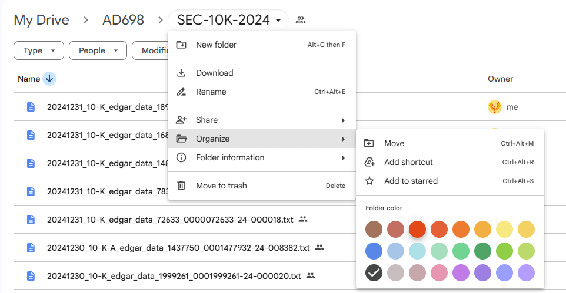

## Lab Purpose

This lab should feel like a **small applied analysis**, not a worked tutorial.

- `M01_T1` and `M01_T2` should be your main worked references for preprocessing mechanics on easier or more guided examples.
- This lab asks you to adapt those ideas to real SEC 10-K text.
- `M01_A` then asks you to apply the same workflow more independently to rival-company filings.

## Research Framing

Treat this lab as asking structured questions of corporate text:

- What changes when we clean 10-K text aggressively?
- Which tokens survive preprocessing?
- How much information is lost or preserved?
- Which intermediate artifacts are worth saving for later modeling?

## Recommended Notebook Pattern

1. Setup and data access
2. Raw-text inspection
3. One preprocessing transformation at a time
4. Validation output after each transformation
5. Short interpretation

## Validation Standard

After each major step, show at least one of the following:

- sample text before and after processing
- token counts or sentence counts
- POS or dependency examples
- string-matching or vocabulary summary
- one short note explaining what the output tells you

## Minimal Setup

```{python}
#| eval: false
import re
from pathlib import Path
import pandas as pd
```

## Questions

### Q1. Load and Inspect SEC Text

Select a small set of 10-K text files and inspect them.

Required evidence:

- number of files loaded
- one short metadata table
- one sample excerpt from a filing

Answer: what makes these files messier than textbook NLP examples?

### Q2. Sentence Segmentation and Tokenization

Apply sentence segmentation and tokenization to one sample document.

Required evidence:

- sentence count
- first 5 to 10 sentences
- first 20 to 30 tokens

Answer: what tokenization issues do you notice in SEC language?

### Q3. Cleaning Choices

Apply at least three cleaning steps such as:

- lowercasing
- punctuation handling
- stop-word removal
- lemmatization or stemming
- number filtering

Required evidence:

- before/after comparison on one excerpt
- token-count change
- one short note on what may have been lost

### Q4. Linguistic Annotation

Use at least one annotation step such as POS tagging or dependency parsing.

Required evidence:

- one tagged example
- one short interpretation of what the annotation reveals about business language

### Q5. Corpus-Level Summary

Create at least two corpus summaries, such as:

- most frequent tokens
- company-level token comparison
- section-level token comparison
- vocabulary size before vs after cleaning

Include at least one plot.

### Q6. Save Reusable Artifacts

Save at least two artifacts that would be useful later, such as:

- cleaned corpus
- token table
- vocabulary list
- chunk-ready text output

Answer: why is saving intermediate artifacts better than repeating the whole pipeline every time?

## AI Use and Share Links {.unnumbered}

If generative AI materially supports your work for this lab, include an AI disclosure appendix or separate AI disclosure document if your instructor requests one. Include the complete prompt(s), relevant output excerpt(s), validation steps, and direct shared chat link(s) when available.

{width="80%" fig-align="center"}
