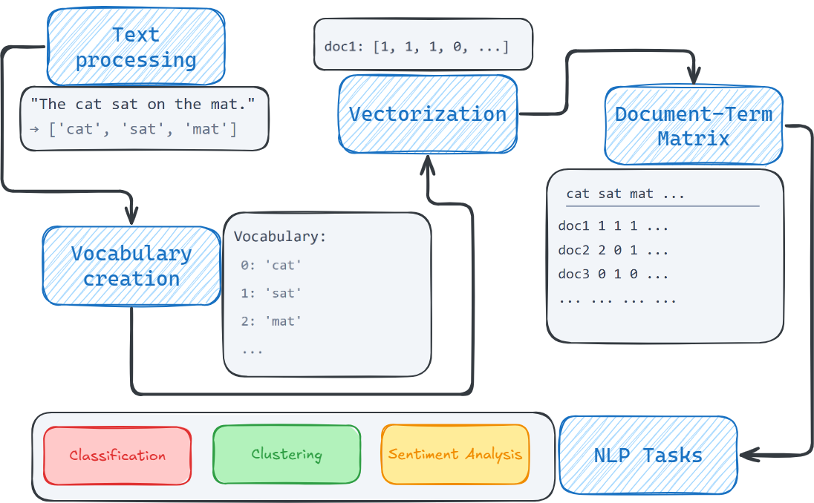

## Why This Lecture Matters

- `M01_Lab1` taught us how to clean and inspect text
- This lecture explains how cleaned text becomes numbers
- It also explains why language is modeled probabilistically
- That sets up early neural NLP and later generative AI

---

## The Flow for Today

1. The NLP pipeline
2. Count-based representations
3. N-gram language models
4. Early neural NLP
5. Why this matters for Module 1 work

---

## The Core NLP Pipeline

```{dot}
//| echo: false
//| fig-align: center
//| fig-alt: "Core NLP pipeline from raw text to output"
//| file: ./M01_lecture02_figures/m01_core_nlp_pipeline.dot
```

---

## From Acquisition to Modeling

```{dot}
//| echo: false
//| fig-align: center
//| fig-alt: "Data acquisition to modeling pipeline"
//| file: ./M01_lecture02_figures/m01_data_to_model_pipeline.dot
```

---

## What This Means in Practice

- We can download data from the web
- We can call APIs for structured metadata
- We can parse HTML or plain text
- We often combine structured and unstructured data in the same project

This is exactly what later SEC-based assignments will do.

---

## Structured and Unstructured Data

- Structured: ratios, returns, tabular company metadata
- Unstructured: filings, MD&A text, risk factors, notes

Typical modeling directions:

- regression on structured variables
- classification on text
- clustering or similarity on text embeddings

---

## Example: SEC API Metadata

```python
import requests
import pandas as pd

headers = {"User-Agent": "your-email@bu.edu"}
cik = "0000320193"
url = f"https://data.sec.gov/submissions/CIK{cik}.json"
```

```python
resp = requests.get(url, headers=headers, timeout=30)
recent = pd.DataFrame(resp.json()["filings"]["recent"])
recent[["form", "filingDate", "accessionNumber"]].head()
```

---

## Example: HTML Table Extraction

```python
import pandas as pd

tables = pd.read_html("https://www.macrotrends.net/stocks/charts/AAPL/apple/revenue")
print("tables found:", len(tables))
tables[0].head()
```

This is still text acquisition, but it lands as structured data.

---

## Example: Filing Text Extraction

```python
from bs4 import BeautifulSoup

html = requests.get(filing_url, headers=headers, timeout=30).text
soup = BeautifulSoup(html, "html.parser")
text = soup.get_text(" ", strip=True)
```

That is the raw material for text mining and NLP.

---

## What the Pipeline Means in AD698

- Raw text: SEC filings, reviews, business documents
- Tokenization: split text into usable units
- Cleaning: normalize text for analysis
- Representation: convert text to vectors
- Model: classify, retrieve, or predict
- Output: label, score, ranking, or next token

The models change across the course, but this flow stays remarkably stable.

---

## What We Do With Text-Mined Data

- supervised classification
- unsupervised clustering
- retrieval and similarity search
- dimensionality reduction for exploration

So text mining is not one task. It is an entry point into many analytics workflows.

---

## Bag of Words

::: {.columns}

::: {.column}

Bag of Words keeps:

- which terms appear
- how often they appear

Bag of Words loses:

- word order
- syntax
- long-range context
- semantic similarity


:::

::: {.column}

{width=80% fig-align="center" fig-alt="Bag of Words" #fig-bow}


:::

:::


---

## Why Bag of Words Still Matters

- It is easy to compute
- It is easy to interpret
- It is a strong baseline for classification
- It is the cleanest first bridge from language to linear algebra

If students do not understand BoW, later embeddings often feel like magic instead of engineering.

---

## Preparing Financial Text for Vectorization

```{python}
docs = [
    "Revenue increased due to stronger iPhone demand and services growth.",
    "Risk factors include supply chain disruption and foreign exchange volatility.",
    "Management expects continued capital expenditure for AI infrastructure.",
    "Operating margin declined because of restructuring and impairment charges."
]
```

```{python}
import re
def normalize_text(text):
    text = text.lower()
    text = re.sub(r"[^a-z\\s]", " ", text)
    return re.sub(r"\\s+", " ", text).strip()
```

---

## Cleaned Text and Tokens

```{python}
clean_docs = [normalize_text(x) for x in docs]
token_lists = [doc.split() for doc in clean_docs]

print(clean_docs[0])
print(token_lists[0])
```

This is the practical handoff from text cleaning to vectorization.

---

## Bag of Words in Python

```{python}
from sklearn.feature_extraction.text import CountVectorizer

bow = CountVectorizer()
X_bow = bow.fit_transform(clean_docs)

print(bow.get_feature_names_out())
print(X_bow.toarray())
```

---

## TF-IDF

BoW counts words.

TF-IDF reweights words so that terms common in one document but less common across the corpus receive more emphasis.

$$
\text{tfidf}(t, d) = \text{tf}(t, d) \cdot \log\left(\frac{N}{1 + \text{df}(t)}\right)
$$

Both BoW and TF-IDF are:

- sparse
- fixed-length
- useful for baseline retrieval and classification

---

## TF-IDF in Python

```{python}
from sklearn.feature_extraction.text import TfidfVectorizer

tfidf = TfidfVectorizer()
X_tfidf = tfidf.fit_transform(clean_docs)

print(tfidf.get_feature_names_out())
print(X_tfidf.toarray().round(3))
```

---

## What Count-Based NLP Misses

- `bank` can mean finance or river edge
- `risk` and `uncertainty` are related but counted separately
- `"not good"` and `"good"` can look too similar
- long-distance dependencies are almost invisible

This is where language probability and neural representations become important.

---

## A Supervised Use Case

Once we vectorize text, we can classify it.

Examples:

- company vs competitor
- positive vs negative sentiment
- risk-heavy vs growth-heavy language
- industry labels

This is exactly why Module 1 assignments start with representations.

---

## Language as a Probability Problem

Language models estimate probabilities over sequences:

$$
P(w_1, w_2, \dots, w_T)
$$

Using the chain rule:

$$
P(w_1, \dots, w_T) = \prod_{t=1}^{T} P(w_t \mid w_1, \dots, w_{t-1})
$$

Modern LLMs still build on this same idea.

---

## N-gram Language Models

Early practical systems simplified the full context using the Markov assumption:

$$
P(w_t \mid w_1, \dots, w_{t-1}) \approx P(w_t \mid w_{t-n+1}, \dots, w_{t-1})
$$

That gives us:

- unigram
- bigram
- trigram
- more generally, n-gram models

---

## What N-grams Improved

Compared with pure document counts, n-grams introduced:

- local sequence information
- collocations
- phrase-level patterns
- short-range predictability

So they were an important step from static counts toward actual language modeling.

---

## Why N-grams Were Not Enough

- sparse counts grow quickly
- unseen phrases are hard to handle
- similar words do not share meaning
- context windows remain short

So the next question became:

> Can a model learn a better internal representation of words?

---

## Early Neural NLP

Neural Network Language Models changed the representation layer:

1. map words to dense vectors
2. combine context vectors
3. transform through hidden layers
4. predict the next word with softmax

$$
\hat{y} = \text{softmax}(W_2 \cdot h + b_2)
$$

This is the start of learned embeddings.

---

## Why Embeddings Matter

Dense embeddings let models:

- place related words near each other
- generalize better than exact counts
- learn similarity from context
- support downstream tasks beyond counting

This is the major conceptual bridge from classical NLP to early neural NLP.

---

## Word2Vec as the Transition Model

- **CBOW** predicts a word from nearby context
- **Skip-gram** predicts nearby context from a word

These models are simpler than modern LLMs, but they are central historically because they made learned word representations practical and useful.

---

## Word2Vec in Python

```{python}
#| echo: true
#| fig-align: center
#| output-location: column
from gensim.models import Word2Vec
from tabulate import tabulate
import numpy as np
import pandas as pd
from IPython.display import HTML

sentences = [doc.split() for doc in clean_docs]
w2v = Word2Vec(sentences, vector_size=50, window=3, min_count=1, sg=1, epochs=200)

word = "risk"
similar = pd.DataFrame(w2v.wv.most_similar(word, topn=5),
                       columns=["Word", "Similarity"])

HTML(similar.to_html(index=False, float_format="%.3f"))


# vec = w2v.wv["risk"]
# df = pd.DataFrame(vec.reshape(5, -1))  # 5×10 block
# df.style.background_gradient(cmap="Blues")


```

---


## Continuous Bag‑of‑Words (CBOW)
CBOW predicts a **target word** given its **context window**.

Formally:

$$
\begin{align}
p(w_t \mid w_{t-m}, \ldots, w_{t-1}, w_{t+1}, \ldots, w_{t+m})
\end{align}
$$

- Input: average (or sum) of context word embeddings  
- Output: probability distribution over vocabulary  
- Objective: maximize likelihood of the center word  
- Computationally efficient because context is aggregated  
- Smooths noisy contexts → stable embeddings  
- Good for frequent words  

---

## Skip‑gram
Skip‑gram predicts **context words** given a **target word**.

Formally:

$$
\begin{align}
 \prod_{-m \leq j \leq m, j \neq 0} p(w_{t+j} \mid w_t)
\end{align}
$$

- Input: embedding of the center word  
- Output: multiple predictions (one per context position)  
- Objective: maximize likelihood of surrounding words  
- Better for rare words (each rare word generates many training pairs)  
- Produces richer semantic structure  

---

## Continuous Bag‑of‑Words (CBOW)

- Predicts the **center word** from its **context window**  
- Input representation:  
  $$
  v_{context} = \frac{1}{2m} \sum_{j \neq 0} v(w_{t+j})
  $$
- Output: softmax over vocabulary  
- Objective:  
  $$
  \max \log p(w_t \mid context)
  $$
- Characteristics:  
  - Fast, stable  
  - Smooths noisy contexts  
  - Works well for frequent words  
- Interpretation: “Given the neighborhood, infer the missing word.”

---

## Skip‑gram (Technical + Narrative)

- Predicts **context words** from the **center word**  
- Objective:  
  $$
  \max \sum_{j=-m}^{m} \log p(w_{t+j} \mid w_t)
  $$
- Each training example generates multiple (target, context) pairs  
- Characteristics:  
  - Excellent for rare words  
  - Produces richer semantic geometry  
  - More training pairs → more expressive embeddings  
- Interpretation: “Given a word, infer its linguistic neighborhood.”

## CBOW and Skip-gram Differences


::: {.columns}

::: {.column}

| Aspect | CBOW | Skip‑gram |
|-------|------|-----------|
| Direction | context → target | target → context |
| Training pairs | fewer | many |
| Good for | frequent words | rare words |
| Stability | smoother | more expressive |
| Complexity | lower | higher |

Both use **[negative sampling]{.uublue-bold}** or **[hierarchical softmax]{.uublue-bold}** to approximate the softmax efficiently.

:::

::: {.column}


{width=35% fig-align="center" fig-alt="CBOW"}

{width=35% fig-align="center" fig-alt="Skip-gram"}

:::

:::


---

## From Representation to Classification

A shallow neural classifier already shows the transition:

$$
\begin{align}
\hat{y} = \text{softmax}(W_2 \cdot \text{ReLU}(W_1 x + b_1) + b_2)
\end{align}
$$

The pipeline is still the same:

- text
- vector representation
- model
- output probabilities

What changes is that the model learns a richer mapping than a fixed rule or pure count score.

---

## Unsupervised Use Case

After vectorization, we can also cluster documents:

```{python}
#| echo: true
#| fig-align: center
#| fig-alt: "KMeans clustering of TF-IDF vectors"
#| 
from sklearn.cluster import KMeans

kmeans = KMeans(n_clusters=2, random_state=42, n_init=10)
clusters = kmeans.fit_predict(X_tfidf)
```

This is useful when labels do not exist yet.

---

## PCA for Exploration

PCA can project TF-IDF or embedding vectors into 2D:

```python
from sklearn.decomposition import PCA

coords = PCA(n_components=2).fit_transform(X_tfidf.toarray())
```

PCA does not replace representation learning. It helps us inspect the geometry of the representation.

---

## Classical, Early Neural, and Modern NLP

| Stage | Main representation | Typical model | Main strength |
|---|---|---|---|
| Classical NLP | BoW / TF-IDF | Naive Bayes, logistic regression, SVM | simple and interpretable |
| Early sequence models | N-grams | probabilistic LMs | local word order |
| Early neural NLP | embeddings | NNLM, Word2Vec, shallow MLP | semantic generalization |
| Modern NLP | contextual embeddings | RNN, LSTM, Transformer | richer context and generation |

---

## How This Connects to Module 1

- `M01_Lab1`: preprocessing and text discipline
- `M01_Lab2`: learned text representations
- `M01_A`: SEC-based text classification

So this lecture is not a side topic. It explains the logic behind the full Module 1 build.

---

## Key Takeaways

- NLP begins with a pipeline, not just a model
- BoW and TF-IDF are foundational because they make text computable
- N-grams introduced local sequence probability
- Early neural models introduced dense embeddings
- Modern generative AI grows out of these earlier ideas

---

## Looking Ahead

The next major move is from:

- static vectors to context-aware vectors
- short context windows to richer context modeling
- document classification to sequence prediction and generation

That is the doorway to modern LLM thinking.

---

### References {.unnumbered}
