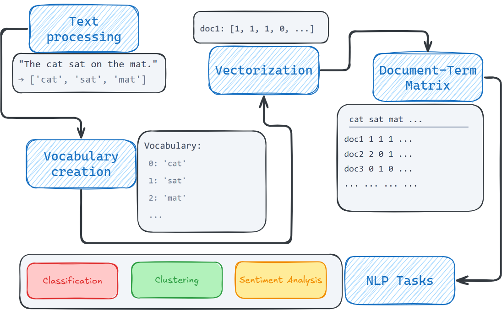
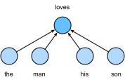
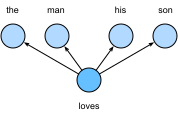

## Learning Objectives

- Construct document vectors using term counts and TF-IDF.
- Calculate next-word probabilities from n-gram counts.
- Explain how neural models learn word embeddings.
- Distinguish CBOW, Skip-gram, and autoregressive prediction.
- Evaluate representation choices for business text analytics.

---

## Lecture Outline

1. **Text analytics pipeline:** data, preprocessing, and outputs
2. **Document representation:** Bag of Words and TF-IDF
3. **Language modeling:** sequence probabilities and n-grams
4. **Neural representations:** embeddings and Word2Vec
5. **Applications:** classification, clustering, and evaluation

# Text Analytics Pipeline

## The Core NLP Pipeline

```{dot}
//| fig-height: 1.5
//| echo: false
//| fig-align: center
//| fig-alt: "Core NLP pipeline from raw text to output"
//| file: ./M01_lecture02_figures/m01_core_nlp_pipeline.dot
```

- **Preprocessing** defines the units retained for analysis.
- **Representation** determines what information reaches the model.
- **Evaluation** measures performance on the intended task.

---

## Structured and Unstructured Business Data

| Data type | Examples | Preparation |
|---|---|---|
| Structured | Ratios, returns, filing dates | Validate types, units, and missing values |
| Unstructured | Risk factors, MD&A, reviews | Extract text, tokenize, and vectorize |

**Unit of analysis:** a filing, section, paragraph, or sentence.

**Linking key:** company identifier and reporting period when combining text with financial variables.

---

## From Acquisition to Modeling

```{dot}
//| fig-height: 1.5
//| echo: false
//| fig-align: center
//| fig-alt: "Data acquisition to modeling pipeline"
//| file: ./M01_lecture02_figures/m01_data_to_model_pipeline.dot
```

| Acquisition method | Output | Validation |
|---|---|---|
| API request | Filing metadata | Identifier, form, and date |
| HTML table extraction | Tabular values | Headers, units, and period |
| HTML text extraction | Document text | Section boundaries and boilerplate |

---

## Preprocessing Decisions

- **Tokenization:** define words, subwords, or other analysis units.
- **Normalization:** standardize case and whitespace where appropriate.
- **Filtering:** retain task-relevant numbers, negation, and terminology.
- **Segmentation:** preserve document and sentence boundaries.

**Example:** removing “not” changes the interpretation of “revenue did not increase.”

# Count-Based Document Representations

## Bag of Words: Definition

::: {.columns}
::: {.column width="60%"}

For a vocabulary of $V$ terms, represent document $d$ as:

$$
x_d = [c_{d1}, c_{d2}, \ldots, c_{dV}]
$$

$c_{dj}$ is the count of term $j$ in document $d$.

- One feature per vocabulary term
- A shared feature order across documents
- No encoding of word order within a document

:::
::: {.column width="40%"}

{width=90% fig-alt="Words represented as an unordered collection" #fig-bow}

:::
:::

---

## Worked Example: Document-Term Matrix

- $d_1$: “revenue growth”
- $d_2$: “revenue risk”
- $d_3$: “risk risk”

| Document | growth | revenue | risk |
|---|---:|---:|---:|
| $d_1$ | 1 | 1 | 0 |
| $d_2$ | 0 | 1 | 1 |
| $d_3$ | 0 | 0 | 2 |

**Matrix shape:** $D \times V$ = documents × vocabulary terms.

**Sparsity:** most entries are zero when each document uses only a small fraction of the vocabulary.

---

## Bag of Words: Uses and Limitations

| Uses | Limitations |
|---|---|
| Interpretable term-level features | Synonyms occupy separate dimensions |
| Baseline document classification | A word has the same feature across meanings |
| Exact-term retrieval | Word order and syntax are discarded |
| Sparse matrix computation | Vocabulary grows with the corpus |

**Order loss:** “supplier acquires retailer” and “retailer acquires supplier” have identical unigram counts.

---

## Preparing Financial Text for Vectorization

```{python}
#| echo: true
#| output: false
docs = [
    "Revenue increased due to stronger iPhone demand and services growth.",
    "Risk factors include supply chain disruption and foreign exchange volatility.",
    "Management expects continued capital expenditure for AI infrastructure.",
    "Operating margin declined because of restructuring and impairment charges."
]
```

**Illustrative corpus:** four short business statements.

The examples demonstrate computation; they are too small for reliable model evaluation.

---

## Normalization and Tokenization

```{python}
#| echo: true
import re

def normalize_text(text):
    text = re.sub(r"[^a-z\s]", " ", text.lower())
    return re.sub(r"\s+", " ", text).strip()

clean_docs = [normalize_text(doc) for doc in docs]
token_lists = [doc.split() for doc in clean_docs]
print(token_lists[0])
```

**Scope:** this simplified normalizer removes numbers and punctuation. Financial applications may need to preserve amounts, percentages, and identifiers.

---

## Bag of Words in Python

```{python}
#| echo: true
from sklearn.feature_extraction.text import CountVectorizer
import pandas as pd
from IPython.display import HTML

bow = CountVectorizer()
X_bow = bow.fit_transform(clean_docs)
counts = pd.DataFrame(
    X_bow.toarray(), columns=bow.get_feature_names_out()
)
HTML(counts[["revenue", "risk", "growth", "margin"]].to_html())
```

**Display:** four selected terms; the fitted matrix contains the full vocabulary.

---

## TF-IDF: Weighting Distinctive Terms

Term frequency–inverse document frequency combines within-document counts with corpus-wide rarity:

$$
\operatorname{tfidf}(t,d)=c(t,d)\operatorname{idf}(t)
$$

For the smoothed convention used in the next example:

$$
\operatorname{idf}(t)=\log\left(\frac{1+N}{1+\operatorname{df}(t)}\right)+1
$$

- $N$: number of documents
- $\operatorname{df}(t)$: number of documents containing term $t$
- Terms occurring in fewer documents receive larger IDF weights.

[Source: scikit-learn TF-IDF documentation](https://scikit-learn.org/stable/modules/generated/sklearn.feature_extraction.text.TfidfTransformer.html)

---

## Worked Example: TF-IDF Weights

Using the three-document corpus:

| Term | Document frequency | Smoothed IDF |
|---|---:|---:|
| growth | 1 | $\log(4/2)+1 \approx 1.693$ |
| revenue | 2 | $\log(4/3)+1 \approx 1.288$ |
| risk | 2 | $\log(4/3)+1 \approx 1.288$ |

For $d_1$ = “revenue growth,” in vocabulary order:

$$
x_{d_1}=[1.693,\;1.288,\;0]
$$

With L2 normalization, divide by $\lVert x_{d_1}\rVert_2$ to obtain approximately $[0.796,\;0.605,\;0]$.

---

## TF-IDF in Python

```{python}
#| echo: true
from sklearn.feature_extraction.text import TfidfVectorizer

tfidf = TfidfVectorizer(smooth_idf=True, norm="l2")
X_tfidf = tfidf.fit_transform(clean_docs)
weights = pd.DataFrame(
    X_tfidf.toarray(), columns=tfidf.get_feature_names_out()
)
HTML(weights[["revenue", "risk", "growth", "margin"]]
     .to_html(float_format="%.3f"))
```

**Interpretation:** values combine counts, IDF, and document normalization; they are not probabilities.

# Language Probability and N-grams

## Language Modeling: The Chain Rule

A language model assigns a probability to a token sequence:

$$
P(w_1,\ldots,w_T)=\prod_{t=1}^{T}P(w_t\mid w_1,\ldots,w_{t-1})
$$

- $w_t$: token at position $t$
- $w_{<t}$: all preceding tokens
- At each step, the conditional probabilities sum to one over the vocabulary.

**Autoregressive generation:** predict a distribution, select a token, append it to the context, and repeat.

---

## N-gram Language Models

Approximate the full history using the previous $n-1$ tokens:

$$
P(w_t\mid w_{<t})\approx P(w_t\mid w_{t-n+1},\ldots,w_{t-1})
$$

| Model | Context | Example prediction |
|---|---|---|
| Unigram | None | $P(\text{growth})$ |
| Bigram | One token | $P(\text{growth}\mid\text{revenue})$ |
| Trigram | Two tokens | $P(\text{growth}\mid\text{strong revenue})$ |

**Assumption:** tokens outside the fixed window do not affect the prediction.

---

## Worked Example: Bigram Estimation

Maximum-likelihood estimate:

$$
\hat P(v\mid u)=\frac{c(u,v)}{\sum_{v'}c(u,v')}
$$

Suppose “revenue” is followed by:

| Next word | Count | Estimated probability |
|---|---:|---:|
| increased | 6 | 0.60 |
| declined | 3 | 0.30 |
| stabilized | 1 | 0.10 |

An unseen continuation receives probability zero without smoothing.

---

## N-gram Features and N-gram Language Models

| | N-gram features | N-gram language model |
|---|---|---|
| Representation | Counts of token sequences | Conditional token probabilities |
| Example | Feature for “not profitable” | $P(\text{profitable}\mid\text{not})$ |
| Typical use | Classification or retrieval | Sequence scoring or generation |

Including bigrams in a document vector preserves some local phrase information, but does not by itself define a language model.

---

## Sparsity and Smoothing

- The number of possible n-grams grows rapidly with vocabulary size.
- Many plausible sequences are absent from the training corpus.
- Larger context windows require more data to estimate probabilities.

One simple remedy is additive smoothing:

$$
\hat P(v\mid u)=\frac{c(u,v)+\alpha}{\sum_{v'}c(u,v')+\alpha V},\qquad\alpha>0
$$

**Tradeoff:** smoothing assigns probability to unseen events but does not learn similarity between words.

# Neural Word Representations

## Neural Language Models

A feedforward neural language model learns both word vectors and a next-word predictor. [@Bengio2003NeuralLM]

1. Look up embeddings for the context words.
2. Combine them into a context vector $x$.
3. Compute a hidden representation: $h=\tanh(W_1x+b_1)$.
4. Predict: $P(w_t\mid\text{context})=\operatorname{softmax}(W_2h+b_2)$.

**Training objective:** minimize the negative log-probability of observed next words.

---

## Embeddings: Learned Dense Vectors

An embedding matrix $E\in\mathbb{R}^{V\times k}$ assigns a vector to each vocabulary item, typically with $k\ll V$.

- Vector values are learned from a prediction objective.
- Shared parameters allow information to transfer across contexts.
- Similarity reflects patterns in the training corpus.

$$
\operatorname{cosine}(u,v)=\frac{u^\top v}{\lVert u\rVert_2\lVert v\rVert_2}
$$

**Limitation:** static embeddings assign one vector to “bank” across its financial and geographic uses.

---

## Word2Vec: Two Prediction Objectives

Word2Vec learns static word embeddings from local context. [@Mikolov2013Efficient]

| Architecture | Input | Prediction |
|---|---|---|
| CBOW | Surrounding words | Center word |
| Skip-gram | Center word | Surrounding words |

For “strong revenue growth,” with a context radius of one:

- **CBOW:** {strong, growth} → revenue
- **Skip-gram:** revenue → strong; revenue → growth

These objectives learn word representations; neither is a full autoregressive generator.

---

## Continuous Bag of Words (CBOW)

Let $C_t$ be the available context positions around position $t$, excluding $t$.

$$
\bar v_t=\frac{1}{|C_t|}\sum_{j\in C_t}v(w_j)
$$

$$
\max_{\theta}\sum_t\log P_{\theta}(w_t\mid\bar v_t)
$$

- Aggregate context embeddings by averaging or summing.
- Predict the center word from the aggregate.
- Context aggregation discards order within the window.

---

## Skip-gram

Predict each surrounding word from the center word:

$$
\max_{\theta}\sum_t\sum_{j\in C_t}\log P_{\theta}(w_j\mid w_t)
$$

- Each center word produces multiple center–context pairs.
- The center position is excluded from its own context.
- Each pair contributes a training signal to the embeddings.

**Computation:** negative sampling provides an alternative training objective that avoids a full vocabulary softmax. [@Mikolov2013Word2Vec]

---

## CBOW and Skip-gram Architectures

::: {.columns}
::: {.column width="50%"}

**CBOW: context → center**

{height=300 fig-alt="Context word inputs combined to predict a center word"}

:::
::: {.column width="50%"}

**Skip-gram: center → context**

{height=300 fig-alt="A center word used to predict surrounding context words"}

:::
:::

---

## Word2Vec in Python

```{python}
#| echo: true
from gensim.models import Word2Vec

w2v = Word2Vec(
    token_lists, vector_size=50, window=3, min_count=1,
    sg=1, epochs=200, seed=42, workers=1
)
print("Vector dimensions:", w2v.wv["risk"].shape)
```

- `sg=1` selects Skip-gram; `sg=0` selects CBOW.
- `vector_size` controls the embedding dimension.
- `window` controls the maximum context radius.

**Interpretation limit:** four sentences demonstrate the API, not meaningful semantic neighborhoods.

# Applications and Evaluation

## From Representation to Classification

For document vector $x$, a shallow neural classifier can compute:

$$
\hat y=\operatorname{softmax}\left(W_2\operatorname{ReLU}(W_1x+b_1)+b_2\right)
$$

- **Input:** BoW, TF-IDF, or an aggregate of word embeddings
- **Target:** sentiment, industry, or disclosure category
- **Output:** predicted class probabilities

**Distinction:** document classification predicts a label; language modeling predicts tokens.

---

## Clustering Documents

K-means groups document vectors by distance to cluster centroids.

```{python}
#| echo: true
from sklearn.cluster import KMeans

kmeans = KMeans(n_clusters=2, random_state=42, n_init=10)
clusters = kmeans.fit_predict(X_tfidf)
print("Cluster assignments:", clusters)
```

- Cluster identifiers have no inherent business meaning.
- Interpretation requires reading representative documents.
- Four documents illustrate assignment, not validated topic discovery.

---

## Projecting Vectors for Exploration

PCA finds directions of maximum variance for a low-dimensional projection.

```{python}
#| echo: true
#| output: false
from sklearn.decomposition import PCA

coords = PCA(n_components=2).fit_transform(X_tfidf.toarray())
```

- A 2D projection can conceal distances present in the full feature space.
- Visible separation does not establish classification accuracy.
- Dense conversion is suitable here only because the example is small; truncated SVD is an alternative for large sparse matrices.

---

## Representation Choices

| Representation | Encodes | Key limitation |
|---|---|---|
| BoW / TF-IDF | Term occurrence and weight | No order with unigram features |
| N-gram features | Local token sequences | Sparse, limited context |
| Static embeddings | Learned word-level associations | One vector per vocabulary item |
| Contextual embeddings | Token meaning conditioned on context | Greater computational cost |

**Selection criterion:** performance on the intended task, given data, interpretability, and computational constraints.

---

## Applying the Pipeline in Module 1

1. **Define the task:** select the text unit and target label.
2. **Prepare the data:** inspect extraction, cleaning, and tokenization.
3. **Establish a baseline:** fit BoW or TF-IDF with a classifier.
4. **Compare representations:** evaluate embeddings on the same split.
5. **Inspect errors:** examine negation, boilerplate, and domain terminology.

**Prevent leakage:** split documents before fitting vocabulary or IDF; use company or time grouping when the prediction task requires it.

---

## Summary

- BoW maps documents to term-count vectors.
- TF-IDF reweights counts using document frequency.
- N-gram language models estimate probabilities from limited history.
- Neural objectives learn dense vectors through shared parameters.
- CBOW predicts a center word; Skip-gram predicts its context.
- Representation quality must be evaluated on a defined task.

---

## From Static Embeddings to Generative Models

| Dimension | Static word embeddings | Autoregressive contextual models |
|---|---|---|
| Token representation | Fixed per vocabulary item | Depends on preceding context |
| Training signal | Local context prediction | Next-token prediction |
| Direct output | Word vectors | Next-token distribution |

**Continuity:** both learn representations from prediction tasks; autoregressive models apply sequence probability to generate text token by token.

---

## References {.unnumbered .smaller}

::: {#refs}
:::
