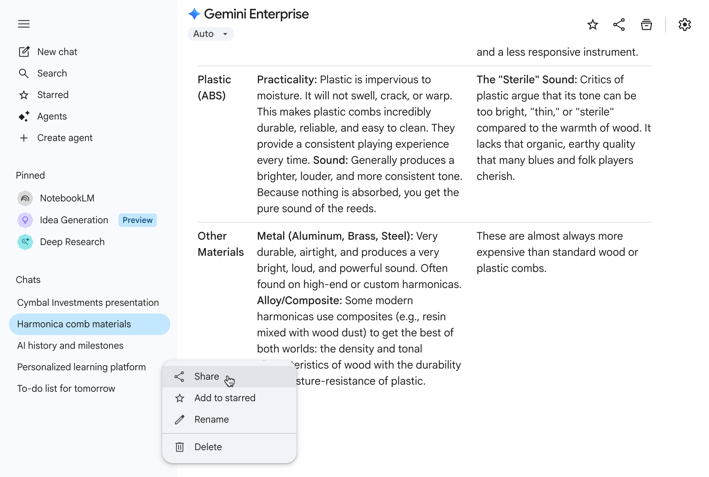

# Overview {.unnumbered}

In this participation assignment, you will work in **Group/Weeks** to study, synthesize, and present a **foundational or state-of-the-art research paper** in Generative AI, Large Language Models (LLMs), or reproducible computational practice.

[Online Students]{.uured-bold}: Please submit a one page pdf/word independently [per week, see details at the end]{.uured-bold}

The goal is **not** to reproduce the paper technically, but to:

* Understand *why* the paper mattered
* Explain *what problem* it solved
* Situate it within the **modern GenAI stack**
* Critically assess its **assumptions, limitations, and downstream implications**

Each Group/Week will deliver a **short academic-style presentation** aimed at a technically literate but non-specialist audience (e.g., analytics managers, graduate students, applied researchers).

This assignment emphasizes:

* Conceptual clarity
* Systems thinking
* Research literacy
* Responsible AI awareness

# Goals {.unnumbered}

By completing this assignment, you will:

* Develop the ability to **read and interpret AI research papers**
* Learn how modern GenAI systems evolved from earlier computational ideas
* Practice explaining complex ideas clearly and precisely
* Engage critically with **reproducibility, scale, alignment, and responsibility**
* Strengthen academic and professional presentation skills

# Paper Selection (One Paper per Group/Week)

- Everyone must read through the curated list below.
- Papers are organized by **theme**. 
- Each Group/Week will need to present a presentation on one of the papers from the week's theme listed under numbered list.
- Names of the papers are listed in the table and are also available at the end of this document.
- You can also search these papers on [scholar.google.com](https://scholar.google.com). 

## Open science & reproducibility (classic but still essential)

[Reading instruction]{.uured-bold}: Read these, no presentation. 

- Wilson et al. (2014) *Best Practices for Scientific Computing*
- Peng (2011) *Reproducible Research in Computational Science*
- Stodden et al. (2014) *The Practice of Reproducible Research*
- Stodden et al. (2016) *Computational Reproducibility*
- Knuth (1984) *Literate Programming

## Foundations Readings in Language Representation

[Reading instruction]{.uured-bold}: Read these, no presentation. 

| **Neural Foundations**             | **Distributional Semantics**  | **Embeddings in Practice**        |
| ----------------------------------------- | ------------------------------------ | ---------------------------------------- |
| A Neural Probabilistic Language Model [@Bengio2003NeuralLM] | Vector Space Models of Semantics [@TurneyPantel2010VSM] | Distributed Representations of Words [@Mikolov2013Word2Vec] |
|Sequence to sequence learning [@Sutskever2014Sequence]|Are LLMs Models of Distributional Semantics? A Case Study on Quantifiers  [@Enyan2024Distributional]|Efficient Estimation of Word Representations in Vector Space [@Mikolov2013Efficient]|

## Group/Week 1 – Transformers: Architecture and Attention

| **Transformer Core**                                      | **Interpretability & Attention**                   | **Representational Power**                                              |
| --------------------------------------------------------- | -------------------------------------------------- | ----------------------------------------------------------------------- |
| Attention Is All You Need [@Vaswani2017Attention]         | What Does BERT Look At? [@Clark2019Bert]       | On the Turing Completeness of Modern Neural Network Architectures [@Perez2019Turing] |
| Sequence to Sequence Learning [@Sutskever2014Sequence]    | Quantifying attention flow in transformers [@Abnar2020Quantifying] | Are Transformers Universal Approximators? [@Yun2019Transformers]        |
| Self-Attention with Relative Position [@Shaw2018Selfattention] | Attention Is Not Explanation [@Jain2019Attention]  | Efficient streaming language models[@Xiao2023Efficient]          |

## Group/Week 2 – Scaling & Emergence

* Scaling Laws for Neural LMs [@Kaplan2020Scaling]
* Sparks of AGI [@Bubeck2023SparksAGI]

## Group/Week 3 – Text-as-Data & Business NLP

* Text as Data [@Gentzkow2019TextAsDataPaper]
* Information Extraction from Business Text [@Kogan2019BusinessIE]

## Group/Week 4 – Prompting & Reasoning

* Chain-of-Thought Prompting [@Wei2022CoT]
* ReAct [@Yao2023ReAct]

## Group/Week 5 – Alignment & Instruction

* Training Language Models with Human Feedback [@Ouyang2022RLHF]
* Constitutional AI [@Bai2022Constitutional]

## Group/Week 6 – Retrieval-Augmented Generation

* Retrieval-Augmented Generation [@Lewis2020RAG]
* Self-RAG [@Asai2023SelfRAG]

## Group/Week 7 – Efficient Fine-Tuning

* LoRA [@Hu2021LoRA]
* QLoRA [@Dettmers2023QLoRA]

## Group/Week 8 – Long Context & Memory

* Lost in the Middle [@Liu2023ContextWindow]
* Transformer-XL [@Dai2019TransformerXL]

## Group/Week 9 – Evaluation & Benchmarks

* HELM Benchmark [@Liang2022HELM]
* Evaluating LLMs [@Chang2023EvaluatingLLMs]

## Group/Week 10 – Hallucination & Trust

* Survey on Hallucination in LLMs [@Huang2023Hallucinations]
* Stochastic Parrots [@Bender2021StochasticParrots]

## Group/Week 11 – Governance & Deployment

* Worldwide AI ethics [@Correa2023worldwide]
* Responsible AI pattern catalogue [@Lu2024responsible]

# Presentation Expectations

## Presentation Length

* **10–12 minutes total**
* **5–7 slides**
* All Group/Week members must participate

## Suggested Slide Structure

Your presentation **must include**:

1. **Problem Framing**

   * What problem did this paper address?
   * Why was it important *at the time*?

2. **Core Contribution**

   * Key idea, model, framework, or insight
   * What changed because of this paper?

3. **Technical Intuition (Not Math-Heavy)**

   * Diagrams encouraged
   * Focus on system logic, not equations

4. **Impact and Legacy**

   * How does this paper influence modern GenAI systems?
   * Where do we see it today?

5. **Limitations and Critique**

   * What does the paper *not* address?
   * What assumptions may no longer hold?

6. **Relevance to This Course**

   * How does this connect to:

     * Prompting
     * RAG
     * Fine-tuning
     * Reproducibility
     * Responsible AI

# Submission Requirements

1. **Presentation Slides (PDF)**
2. **One-page Paper Brief (PDF)** including:
   - Paper citation
   - Key contribution (≤150 words)
   - One critique
   - One open research question

:::{.callout-important}
[Online Students]{.uured-bold}: Please submit a one page pdf/word independently [per week]{.uured-bold} with answers to the following questions by the end of the week. Please include the name of the paper and the authors in your submission.

On the second page of the document, please include your AI disclosure and the output (actual output) from the AI tool you used. Failure to disclose AI usage will result in a 50% penalty.

1. Core Idea
   1. What problem does the paper solve?
   2. What is the model/system contribution?
2. Mechanism
   1. How does it work (pipeline / architecture)?
   2. Key equation / concept / diagram
3. Critical Evaluation
   1. Where does it fail?
   2. Assumptions that break in real-world systems
   3. Application Layer (important for your course)
4. How would this be used in:
    1. RAG systems?
    2. Agents?
    3. Business pipelines?
5. What would you Improve in the papers model/approach? (don't say more data or bigger model) 

:::

## Hints and Best Practices

* Focus on **ideas**, not implementation details
* Assume your audience understands Python and ML basics
* Use diagrams over equations
* Avoid reading slides verbatim
* Practice explaining the paper *without jargon*

This assignment is designed to help you **think like a researcher and systems designer**, not just a tool user.
Choose wisely, read deeply, and present with clarity.

:::{.ref}

:::

## AI Use and Share Links {.unnumbered}

If generative AI materially supports your work for this participation activity, include an AI disclosure appendix or separate AI disclosure document if your instructor requests one. Include the complete prompt(s), relevant output excerpt(s), validation steps, and direct shared chat link(s) when available.

{width="80%" fig-align="center"}

{width="80%" fig-align="center"}

When possible, use **one continuous chat** for the activity so the full reasoning trail can be reviewed in one place. If you used multiple chats, share **all chats directly related** to the work.

Tools such as **ChatGPT**, **Claude**, and **Gemini** support direct chat sharing. If sharing or export is not available, include copied prompt/output evidence or screenshots instead. Because shared links may be viewable by anyone with the link, do not include confidential, personal, or restricted information in those chats.

