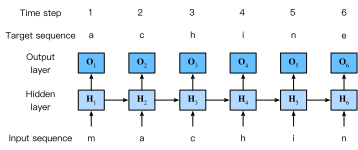

# Foundations of Language Modeling

Modern NLP rests on two complementary ideas. The first is **probabilistic**: language can be modeled as a probability distribution over sequences. The second is **representational**: linguistic objects such as words, subwords, and contexts can be encoded numerically so that a model can compute with them. Together, these ideas explain why language models can predict, generate, compare, and score text.

This lecture note develops the probabilistic view first, then links it to tokenization, text classification, and distributed representations. The goal is to move gradually from the abstract mathematical objects, such as $\mathbb{P}(\mathbf{w})$, to concrete computational artifacts, such as tokens, count matrices, and short Python programs.

## Language as a Distribution Over Sequences

At the heart of probabilistic language modeling lies a single premise:

> **Language is a probability distribution over sequences of tokens.**

Every sentence—grammatical or not, common or rare—has a probability. This probability reflects how likely a sequence is to occur in natural usage. The model's task is to approximate this distribution.

Let a sequence of tokens be  
$$
\begin{align}
\mathbf{w} = (w_1, w_2, \ldots, w_M).
\end{align}
$$  

A language model assigns a probability  

$$
\begin{align}
\mathbb{P}(w_1, w_2, \ldots, w_M).
\end{align}
$$

This probability is not arbitrary. It encodes patterns of co‑occurrence, syntactic regularities, semantic plausibility, and pragmatic expectations. A fluent model assigns high probability to sequences like:

> *The cat sat on the mat.*

and low probability to sequences like:

> *Mat the on sat cat the.*

The model does not "know" grammar in a symbolic sense; instead, it captures statistical regularities that correlate with grammaticality.

An equivalent way to express the modeling objective is to say that we seek a parameterized approximation

$$
\begin{align}
\mathbb{P}_{\theta}(\mathbf{w}) \approx \mathbb{P}_{\mathrm{data}}(\mathbf{w}),
\end{align}
$$

where $\mathbb{P}_{\mathrm{data}}$ is the unknown data-generating distribution and $\theta$ denotes the learnable parameters of the model. In practice, the model never sees the full population distribution. It only sees a finite sample of text and must generalize beyond it.

## Autoregressive Factorization

Directly modeling $\mathbb{P}(\mathbf{w})$ is intractable because the space of all sequences is enormous. The standard solution is to factor the joint distribution using the chain rule:

$$
\begin{align}
\mathbb{P}(w_1, \ldots, w_M)
= \prod_{t=1}^{M} \mathbb{P}(w_t \mid w_1, \ldots, w_{t-1}).
\end{align}
$$

This factorization is the foundation of autoregressive language models. It says:

- **Generation = sampling one token at a time**,  
- **Conditioned on all previous tokens**,  
- **Using the model's learned distribution**.

This is why LLMs generate text sequentially: each new token is chosen based on the probability distribution conditioned on the entire preceding context.

For a short sentence such as

$$
\mathbf{w} = (\text{the}, \text{market}, \text{rallied}),
$$

the chain rule gives

$$
\begin{align}
\mathbb{P}(\mathbf{w})
= \mathbb{P}(\text{the})
  \mathbb{P}(\text{market} \mid \text{the})
  \mathbb{P}(\text{rallied} \mid \text{the}, \text{market}).
\end{align}
$$

This decomposition is conceptually important because it turns one difficult global prediction problem into a sequence of local conditional predictions.

## Training Data Defines the Distribution

A language model does not invent its distribution from scratch. It **learns** it from data. During training, the model adjusts its parameters so that sequences in the training corpus receive higher probability than sequences that rarely or never occur.

Thus:

- The model's "knowledge" is statistical.  
- Its "fluency" is a reflection of corpus patterns.  
- Its "world knowledge" is encoded implicitly in token co‑occurrence statistics.

This probabilistic framing unifies tasks such as:

- next‑token prediction  
- text generation  
- scoring candidate sentences  
- continuation and infilling  
- perplexity evaluation  

All are simply different ways of interacting with the same underlying distribution.


# From Classification to Generation

To appreciate the shift from discriminative to generative modeling, consider the contrast with standard supervised learning.

## Probabilistic Classification

In classification, we model:

$$
\begin{align}
\mathbb{P}(y \mid \mathbf{x}),
\end{align}
$$

where $\mathbf{x}$ is an input (e.g., a document) and $y$ is a label (e.g., sentiment). The model's job is to choose the most likely label given the input.

This is a **conditional** distribution.

## Language Modeling as Sequence Probability

Language modeling inverts the perspective. Instead of predicting a label given text, we predict the probability of the text itself:

$$
\begin{align}
\mathbb{P}(\mathbf{w}).
\end{align}
$$

Here:

- The "output space" is not a small set of labels but the space of all possible sequences.  
- The vocabulary $\mathcal{V}$ is finite (typically 30k–100k tokens).  
- A sequence is a path through this vocabulary, one token at a time.

This shift—from predicting labels to predicting sequences—transforms NLP from a classification problem into a generative modeling problem.

The contrast can be summarized compactly:

| Task | Probability object | Typical output |
|---|---|---|
| Classification | $\mathbb{P}(y \mid \mathbf{x})$ | One label from a small set |
| Language modeling | $\mathbb{P}(\mathbf{w})$ or $\mathbb{P}(w_t \mid w_{<t})$ | One token at a time from a large vocabulary |

Because the output space of language modeling is combinatorially large, even simple examples quickly motivate approximation, smoothing, and efficient numerical representations.

# Linear Text Classification 

Continuing from the bag of words, we know the joint probability of a bag of words $\boldsymbol{x}$ and its true label $y$ is written $\mathbf{p}(\boldsymbol{x}, y)$. Suppose we have a dataset of $N$ labeled instances, $\left\{\left(\boldsymbol{x}^{(i)}, y^{(i)}\right)\right\}_{i=1}^N$, which we assume are independent and identically distributed (IID) (see § A.3). Then the joint probability of the entire dataset, written $\mathrm{p}\left(\boldsymbol{x}^{(1: N)}, y^{(1: N)}\right)$, is equal to $\prod_{i=1}^N \mathrm{p}_{X, Y}\left(\boldsymbol{x}^{(i)}, y^{(i)}\right).$^[The notation $\mathrm{p}_{x, Y}\left(\boldsymbol{x}^{(1)}, y^{(1)}\right)$ indicates the joint probability that random variables $X$ and $Y$ take the specific values $x^{(1)}$ and $y^{(1)}$ respectively. The subscript will often be omitted when it is clear from context.]

What does this have to do with classification? One approach to classification is to set the weights $\theta$ so as to maximize the joint probability of a training set of labeled documents. This is known as maximum likelihood estimation:

$$
\begin{align}
\hat{\boldsymbol{\theta}} & =\underset{\boldsymbol{\theta}}{\operatorname{argmax}} \mathrm{p}\left(\boldsymbol{x}^{(1: N)}, y^{(1: N)} ; \boldsymbol{\theta}\right) \\
& =\underset{\boldsymbol{\theta}}{\operatorname{argmax}} \prod_{i=1}^N \mathrm{p}\left(\boldsymbol{x}^{(i)}, y^{(i)} ; \boldsymbol{\theta}\right) \\
& =\underset{\boldsymbol{\theta}}{\operatorname{argmax}} \sum_{i=1}^N \log \mathrm{p}\left(\boldsymbol{x}^{(i)}, y^{(i)} ; \boldsymbol{\theta}\right) .
\end{align}
$$


The notation $\mathrm{p}\left(\boldsymbol{x}^{(i)}, y^{(i)} ; \boldsymbol{\theta}\right)$ indicates that $\boldsymbol{\theta}$ is a parameter of the probability function. The product of probabilities can be replaced by a sum of log-probabilities because the log function is monotonically increasing over positive arguments, and so the same $\theta$ will maximize both the probability and its logarithm. Working with logarithms is desirable because of numerical stability: on a large dataset, multiplying many probabilities can underflow to zero.^[Throughout this text, you may assume all logarithms and exponents are base 2, unless otherwise indicated. Any reasonable base will yield an identical classifier, and base 2 is most convenient for working out examples by hand.] 

```{.pseudocode}
#| html-indent-size: "1.2em"
#| html-comment-delimiter: "//"
#| html-line-number: true
#| html-line-number-punc: ":"
#| html-no-end: false

\begin{algorithm}
\caption{Naïve Bayes Generative Model}
\begin{algorithmic}
\For{$i = 1$ \textbf{to} $N$}
    \State Sample class label:
        $y^{(i)} \sim \text{Categorical}(\mu)$
    \State Sample feature vector:
        $x^{(i)} \sim \text{Multinomial}(\phi_{y^{(i)}})$
\EndFor
\end{algorithmic}
\end{algorithm}

```

The probability $\mathrm{p}\left(\boldsymbol{x}^{(i)}, y^{(i)} ; \boldsymbol{\theta}\right)$ is defined through a generative model - an idealized random process that has generated the observed data. ${ }^6$ Algorithm 1 describes the generative model underlying the Naïve Bayes classifier, with parameters $\theta=\{\mu, \phi\}$.
- The first line of this generative model encodes the assumption that the instances are mutually independent: neither the label nor the text of document $i$ affects the label or text of document $j .{ }^7$ Furthermore, the instances are identically distributed: the distributions over the label $y^{(i)}$ and the text $\boldsymbol{x}^{(i)}$ (conditioned on $y^{(i)}$ ) are the same for all instances $i$. In other words, we make the assumption that every document has the same distribution over labels, and that each document's distribution over words depends only on the label, and not on anything else about the document. We also assume that the documents don't affect each other. if the word whale appears in document $i=7$, that does not make it any more or less likely that it will appear again in document $i=8$.
- The second line of the generative model states that the random variable $y^{(i)}$ is drawn from a categorical distribution with parameter $\boldsymbol{\mu}$. Categorical distributions are like weighted dice: the column vector $\boldsymbol{\mu}=\left[\mu_1 ; \mu_2 ; \ldots ; \mu_K\right]$ gives the probabilities of each label, so that the probability of drawing label $y$ is equal to $\mu_y$. For example, if $\mathcal{Y}=\{$ POSITIVE, NEGATIVE, NEUTRAL $\}$, we might have $\boldsymbol{\mu}=[0.1 ; 0.7 ; 0.2]$. We require $\sum_{y \in \mathcal{Y}} \mu_y=1$ and $\mu_y \geq 0, \forall y \in \mathcal{Y}$ : each label's probability is non-negative, and the sum of these probabilities is equal to one. ${ }^8$
- The third line describes how the bag-of-words counts $\boldsymbol{x}^{(i)}$ are generated. By writing $\boldsymbol{x}^{(i)} \mid y^{(i)}$, this line indicates that the word counts are conditioned on the label, so that the joint probability is factored using the chain rule,

$$
\mathrm{p}_{X, Y}\left(\boldsymbol{x}^{(i)}, y^{(i)}\right)=\mathrm{p}_{X \mid Y}\left(\boldsymbol{x}^{(i)} \mid y^{(i)}\right) \times \mathrm{p}_Y\left(y^{(i)}\right) .
$$


The specific distribution $\mathrm{p}_{X \mid Y}$ is the multinomial, which is a probability distribution over vectors of non-negative counts. The probability mass function for this distribution is:

$$
\begin{align}
\mathrm{P}_{\mathrm{mult}}(\boldsymbol{x} ; \phi) & =B(\boldsymbol{x}) \prod_{j=1}^V \phi_j^{x_j} \\
B(\boldsymbol{x}) & =\frac{\left(\sum_{j=1}^V x_j\right)!}{\prod_{j=1}^V\left(x_{j}!\right)}
\end{align}
$$


As in the categorical distribution, the parameter $\phi_j$ can be interpreted as a probability: specifically, the probability that any given token in the document is the word $j$. The multinomial distribution involves a product over words, with each term in the product equal to the probability $\phi_j$, exponentiated by the count $x_j$. Words that have zero count play no role in this product, because $\phi_j^0=1$. The term $B(\boldsymbol{x})$ is called the multinomial coefficient. It doesn't depend on $\phi$, and can usually be ignored. Can you see why we need this term at all? ${ }^9$
The notation $\mathrm{p}(\boldsymbol{x} \mid y ; \phi)$ indicates the conditional probability of word counts $\boldsymbol{x}$ given label $y$, with parameter $\phi$, which is equal to $\mathrm{p}_{\text {mult }}\left(\boldsymbol{x} ; \phi_y\right)$. By specifying the multinomial distribution, we describe the multinomial Naïve Bayes classifier. Why "naïve"? Because the multinomial distribution treats each word token independently, conditioned on the class: the probability mass function factorizes across the counts.

## Worked Naive Bayes Example from the Apple 10-K

To keep the same example thread running, we can also use Apple 10-K language for text classification. Suppose we want to classify short passages into two section-like categories:

- `product`: text about Apple products and features
- `risk`: text about business risks and adverse conditions

This lets us connect the earlier sequence-probability discussion to a **document classification** setting. A language model asks, "How likely is this sequence?" A Naive Bayes classifier asks, "How likely is this bag of words under each class?"

Consider the simplified training set below, built in the style of the Apple filing:

```{python}
#| eval: true
import re

nb_docs = [
    ("product", "iphone includes siri and apple pay on qualifying devices"),
    ("product", "apple watch includes health features and digital services"),
    ("risk", "adverse economic conditions could affect demand and operating results"),
    ("risk", "supply shortages could materially affect financial condition and results"),
]

def bow_tokenize(text: str):
    return re.findall(r"[a-z]+", text.lower())

nb_tokenized = [(label, bow_tokenize(text)) for label, text in nb_docs]
for label, tokens_doc in nb_tokenized:
    print(label, "->", tokens_doc)
```

The class prior is estimated as usual:

$$
\begin{align}
\hat{\mathbb{P}}(y) = \frac{\mathrm{count}(y)}{N}.
\end{align}
$$

For the multinomial Naive Bayes model, the class-conditional token probability with Laplace smoothing is

$$
\begin{align}
\hat{\mathbb{P}}(w_j \mid y)
= \frac{\mathrm{count}(w_j, y) + \alpha}{\sum_{v \in \mathcal{V}} \mathrm{count}(v, y) + \alpha |\mathcal{V}|}.
\end{align}
$$

```{python}
#| eval: true
from collections import Counter, defaultdict

alpha = 1.0
class_counts = Counter(label for label, _ in nb_tokenized)
vocab_nb = sorted({tok for _, toks in nb_tokenized for tok in toks})
token_counts_by_class = defaultdict(Counter)
total_tokens_by_class = Counter()

for label, toks in nb_tokenized:
    token_counts_by_class[label].update(toks)
    total_tokens_by_class[label] += len(toks)

num_docs = len(nb_tokenized)
vocab_size_nb = len(vocab_nb)

def nb_prior(label: str) -> float:
    return class_counts[label] / num_docs

def nb_word_prob(word: str, label: str, alpha: float = 1.0) -> float:
    return (token_counts_by_class[label][word] + alpha) / (
        total_tokens_by_class[label] + alpha * vocab_size_nb
    )

print("Class priors:")
for label in class_counts:
    print(f"  P({label}) = {nb_prior(label):.3f}")

print("\nSelected token probabilities:")
for word, label in [("apple", "product"), ("iphone", "product"), ("affect", "risk"), ("financial", "risk")]:
    print(f"  P({word} | {label}) = {nb_word_prob(word, label, alpha):.4f}")
```

Now classify a short test sentence:

> *financial condition could affect demand*

Under Naive Bayes, we compare

$$
\begin{align}
\mathbb{P}(y \mid \boldsymbol{x})
&\propto \mathbb{P}(y)\mathbb{P}(\boldsymbol{x} \mid y) \\
&\propto \mathbb{P}(y)\prod_{j=1}^{V} \mathbb{P}(w_j \mid y)^{x_j}.
\end{align}
$$

```{python}
#| eval: true
import math

test_doc = "financial condition could affect demand"
test_tokens = bow_tokenize(test_doc)

def nb_log_score(tokens_doc, label: str, alpha: float = 1.0) -> float:
    score = math.log(nb_prior(label))
    counts = Counter(tokens_doc)
    for word, count in counts.items():
        score += count * math.log(nb_word_prob(word, label, alpha))
    return score

scores = {label: nb_log_score(test_tokens, label, alpha) for label in class_counts}

print("Test document tokens:", test_tokens)
print("Naive Bayes log scores:")
for label, score in scores.items():
    print(f"  {label:<8} {score:.3f}")

predicted_label = max(scores, key=scores.get)
print(f"\nPredicted label: {predicted_label}")
```

This example helps unify the module:

- in the **language-modeling** view, Apple text gives us token sequences and conditional next-token probabilities
- in the **Naive Bayes** view, Apple text gives us class priors and token likelihoods for document classification

The same corpus can therefore support both **generation/scoring** and **classification**, depending on which probability object we choose to model.

# Tokens: Linguistic Units vs. Computational Units

A central subtlety in modern NLP arises from the fact that the word *token* is used in two very different senses. In traditional linguistics and early NLP, a *token* refers to a linguistically meaningful unit—typically a word or punctuation mark—obtained by segmenting text according to grammatical and orthographic conventions. In contrast, contemporary neural language models use *tokens* as computational units derived from statistical compression schemes rather than linguistic theory. Although they share a name, these two notions of "token" emerge from different intellectual traditions and serve different purposes.

## Linguistic Tokens

In linguistics, a token is the concrete realization of a word in running text. When a sentence is written or spoken, each occurrence of a word counts as a token. This notion is tied to the study of morphology, syntax, and semantics: tokens are the observable instances of types, and they form the basis for counting frequencies, analyzing collocations, and studying grammatical structure. Tokenization in this classical sense is a process of segmentation guided by linguistic rules—spaces, punctuation, affixes, contractions, and orthographic conventions. For example, the sentence *"I can't believe it's raining."* would typically be segmented into the tokens *I*, *ca*, *n't*, *believe*, *it*, *'s*, *raining*, and *.* depending on the tokenizer's treatment of contractions. The goal is to preserve units that correspond to meaningful linguistic categories, enabling downstream tasks such as part‑of‑speech tagging, parsing, or named‑entity recognition.

This form of tokenization is inherently language‑dependent. Chinese and Japanese require character‑ or dictionary‑based segmentation; agglutinative languages like Turkish or Finnish produce long, morphologically complex words that may be split into stems and affixes; and languages with rich inflectional morphology may require sophisticated rules to identify word boundaries. In all cases, the guiding principle is linguistic interpretability: tokens should reflect the structure of the language as humans understand it.

## Tokens in Modern NLP and LLMs

Modern neural language models adopt a very different perspective. For these models, a token is not a linguistic unit but a **computational primitive**—a unit of text chosen to make the model efficient, expressive, and robust. Instead of relying on linguistic rules, tokenization is learned from data using algorithms such as Byte‑Pair Encoding (BPE), WordPiece, or SentencePiece. These methods identify frequently occurring character sequences and merge them into subword units that strike a balance between vocabulary size and coverage. As a result, a token may correspond to a whole word, a meaningful subword fragment, a single character, or even whitespace.

This design is motivated by practical constraints. A vocabulary consisting of all words in a language would be enormous, sparse, and brittle. Subword tokenization allows the model to represent rare or novel words by composing them from smaller, frequently occurring pieces. It also ensures that the model can encode any string, including misspellings, code snippets, or foreign words, without requiring an ever‑expanding vocabulary. The resulting tokens are not linguistically interpretable; they are artifacts of a compression scheme optimized for statistical efficiency.

An important consequence is that tokenization becomes context‑sensitive. The same word may be split differently depending on capitalization, leading spaces, or its frequency in the training corpus. For instance, *"red"*, *" red"*, and *"Red"* may map to entirely different token IDs because the tokenizer has learned distinct patterns for these forms. Token IDs themselves are assigned according to frequency, with common tokens receiving low indices and rare ones receiving high indices, further emphasizing the statistical rather than linguistic nature of the system.

## A Quick Tokenization Workflow

The tokenization pipeline used by LLM applications is straightforward in spirit even if the underlying tokenizer is learned statistically:

1. Raw text is segmented into tokens.
2. Each token is mapped to an integer ID from a fixed vocabulary.
3. The model processes the resulting sequence of IDs.
4. The model predicts the next token ID.
5. IDs are decoded back into human-readable text.

The distinction between words and model tokens is especially important in practice:

| String | Linguistic intuition | Possible computational interpretation |
|---|---|---|
| `market` | one word | one token |
| `unhappiness` | one word | multiple subword tokens |
| ` can't` | contraction | tokens that may separate leading space and subword pieces |
| `AAPL` | ticker symbol | one rare token or several character-like pieces |

As a rough rule of thumb in English, one token is often around four characters or about three-quarters of a word, but this varies by language, formatting, and domain.

## Why the Distinction Matters

Although both linguistic and computational tokens serve as "units" of text, they belong to different conceptual frameworks. Linguistic tokens reflect human‑interpretable structure; LLM tokens reflect the internal mechanics of a probabilistic model. When we say that a language model assigns a probability to a sequence of tokens, we are referring to these computational units, not to words in the linguistic sense. The probabilistic model is defined over the tokenizer's vocabulary, and the granularity of these units shapes the model's behavior, its efficiency, and its ability to generalize.

Understanding this distinction is essential for interpreting model outputs, estimating token counts, managing context windows, and reasoning about the statistical foundations of language modeling. It also clarifies why token counts do not align neatly with word counts, why different languages behave differently under the same tokenizer, and why the same sentence may produce different tokenizations depending on subtle formatting differences.

Two small examples are useful in lecture because students can inspect every word:

| English sentence | Translation | What to notice |
|---|---|---|
| The model predicts the next token. | El modelo predice el siguiente token. | The semantic units align, but the model still sees tokenizer-specific pieces. |
| The analyst reviews quarterly revenue trends. | Der Analyst prüft vierteljährliche Umsatztrends. | Business terms and compounds can change the number of subword tokens. |

These examples connect directly to the `help-code/1-foundations/Section 2.2 - Tokenization.ipynb` notebook: the lecture idea is conceptual, while the notebook lets students inspect tokenization behavior procedurally.

# From Discrete Symbols to Distributed Representations

Probability alone is not enough. A language model also needs a numerical representation for the symbols it manipulates. A naïve starting point is to represent each word as a discrete symbol, but this immediately creates a problem: discrete symbols tell us that two words are different, yet they say nothing about whether the words are similar.

## One-Hot Encoding and Its Limits

Suppose the vocabulary is

$$
\mathcal{V} = \{\text{hotel}, \text{motel}, \text{bank}, \text{river}\}.
$$

Then one-hot vectors might be written as

$$
\begin{align}
\text{hotel} &= [1,0,0,0], \\
\text{motel} &= [0,1,0,0].
\end{align}
$$

These vectors are easy to store and manipulate, but they are orthogonal. The representation says that *hotel* and *motel* are no more similar than *hotel* and *river*, which is clearly unsatisfactory for semantic modeling.

## Distributional Intuition

Distributional semantics addresses this limitation by replacing isolated symbols with contextual evidence. The core idea is often summarized by J. R. Firth's famous statement: *You shall know a word by the company it keeps.* If two words occur in similar contexts, their vectors should be similar even if the words themselves are different.

In practice, we build a matrix of co-occurrence statistics. Rows represent target words, columns represent context words, and entries record how often the context appears near the target. This transforms qualitative linguistic intuition into quantitative structure that algorithms can learn from.

It is useful to distinguish this kind of lexical count table from a **confusion matrix**, which is used for classification evaluation rather than semantic representation. In a confusion matrix, rows correspond to actual labels and columns correspond to predicted labels. The entries summarize outcomes such as true positives, false positives, false negatives, and true negatives.

{width="78%" #fig-contingency-matrix fig-align="center" fig-alt="Confusion matrix style contingency table showing true positives, false positives, false negatives, true negatives, and derived classification metrics such as recall, precision, specificity, and F1 score." fig-cap="A confusion-matrix-style contingency table for classification evaluation. Unlike a lexical co-occurrence matrix, this table summarizes prediction outcomes and derived performance metrics."}

Both confusion matrices and co-occurrence matrices are structured count tables, but they answer very different questions. A confusion matrix asks, "How well did the classifier predict labels?" A co-occurrence matrix asks, "Which words tend to appear near which other words?" The code example below focuses on the second use, because that is the foundation of distributional semantics and word vectors.

## Building a Toy Co-Occurrence Matrix

The following example shows how to construct a simple co-occurrence-style matrix from a tiny corpus. This does not yet produce modern embeddings, but it demonstrates the statistical foundation that later models refine.

```{python}
#| eval: true
from collections import Counter, defaultdict

mini_corpus = [
    "the bank approved the loan",
    "the river overflowed near the bank",
    "she applied for a loan at the bank",
]

window = 1
co_occurrence = defaultdict(Counter)

for doc in mini_corpus:
    words = doc.split()
    for i, word in enumerate(words):
        left = max(0, i - window)
        right = min(len(words), i + window + 1)
        for j in range(left, right):
            if i != j:
                co_occurrence[word][words[j]] += 1

print("Toy co-occurrence matrix:")
targets = ["bank", "loan", "river"]
contexts = ["bank", "loan", "river", "the"]

header = f"{'word':<8}" + "".join(f"{ctx:<8}" for ctx in contexts)
print(header)
for word in targets:
    row = f"{word:<8}" + "".join(f"{co_occurrence[word][ctx]:<8}" for ctx in contexts)
    print(row)
```

Even in this tiny example, the word *bank* has meaningful statistical relationships with both *loan* and *river*. That is the beginning of semantic representation: meaning emerges from context counts before it ever becomes a dense neural embedding.

# Computational Language Modeling: Code Demonstrations

## N-gram Language Model

N-gram models estimate the probability of the next word given the previous $n-1$ words. The bigram model uses just the immediately preceding word. Below we build bigram counts from a short text corpus and use them to estimate conditional probabilities.

```{python}
#| eval: true
from collections import Counter, defaultdict
import numpy as np

# Sample text — replace with real corpus for production
corpus = (
    "the market for artificial intelligence is growing rapidly . "
    "companies that invest in machine learning gain a competitive advantage . "
    "the technology sector shows strong revenue growth in artificial intelligence . "
    "machine learning models require large amounts of training data . "
    "the stock price reflects investor confidence in the technology sector ."
)

tokens = corpus.split()
print(f"Corpus: {len(tokens)} tokens, {len(set(tokens))} types\n")

# Bigram counts
bigrams = Counter(zip(tokens[:-1], tokens[1:]))
unigrams = Counter(tokens)

# Conditional probability: P(w2 | w1) with Laplace smoothing
V = len(unigrams)  # vocabulary size

def bigram_prob(w1: str, w2: str, alpha: float = 1.0) -> float:
    """P(w2 | w1) with add-alpha smoothing."""
    return (bigrams[(w1, w2)] + alpha) / (unigrams[w1] + alpha * V)

# Show top bigrams starting with "the"
print("Top bigrams starting with 'the':")
for (w1, w2), cnt in sorted(bigrams.items(), key=lambda x: -x[1]):
    if w1 == "the":
        p = bigram_prob(w1, w2)
        print(f"  P({w2!r:<18} | 'the') = {p:.4f}  (count={cnt})")
```

## Perplexity: Evaluating Language Model Quality

Perplexity measures how surprised a model is by a held-out test sentence. Lower perplexity means the model assigns higher probability to the test data — i.e., it has learned a better distribution.

$$
\begin{align}
\text{PPL}(W) = \exp\!\left(-\frac{1}{N}\sum_{i=1}^{N}\log P(w_i \mid w_{i-1})\right)
\end{align}
$$

```{python}
#| eval: true
import math

def sentence_perplexity(sentence: str, alpha: float = 1.0) -> float:
    """Compute bigram perplexity of a sentence."""
    words = sentence.split()
    log_prob = 0.0
    for i in range(1, len(words)):
        p = bigram_prob(words[i-1], words[i], alpha)
        log_prob += math.log(p)
    N = len(words) - 1
    return math.exp(-log_prob / N)

test_sentences = [
    "the market is growing rapidly",       # in-distribution
    "machine learning shows strong growth", # partially in-distribution
    "purple elephants dance underwater",    # out-of-distribution
]

print(f"{'Sentence':<45} {'Perplexity':>12}")
print("-" * 60)
for sent in test_sentences:
    ppl = sentence_perplexity(sent)
    print(f"{sent:<45} {ppl:>12.1f}")
```

## Bigram Sampling: Generating Text

Once we have a bigram model, we can generate new text by sampling from the conditional distribution at each step — the core idea behind autoregressive language generation.

```{python}
#| eval: true
import random

def sample_next_word(current_word: str, alpha: float = 1.0) -> str:
    """Sample the next word given the current word."""
    vocab = list(unigrams.keys())
    probs = np.array([bigram_prob(current_word, w, alpha) for w in vocab])
    probs /= probs.sum()  # normalize (smoothing may break exact sum=1)
    return random.choices(vocab, weights=probs, k=1)[0]

def generate_text(start_word: str, n_words: int = 15, seed: int = 42) -> str:
    """Generate text using bigram sampling."""
    random.seed(seed)
    tokens_gen = [start_word]
    for _ in range(n_words - 1):
        next_word = sample_next_word(tokens_gen[-1])
        tokens_gen.append(next_word)
        if next_word == ".":
            break
    return " ".join(tokens_gen)

print("Generated text samples:")
for start in ["the", "machine", "companies"]:
    print(f"  [{start}] → {generate_text(start)}")
```

## Worked Example: Apple 10-K Business Text and Cross-Lingual Word Order

The `colab_tokenization_demo.ipynb` notebook contains a realistic business-text example drawn from Apple's 10-K. That kind of text is useful pedagogically because it is repetitive enough to make n-gram counting meaningful, but still natural enough to show why token order matters. Consider this English sentence from the filing:

> *The Company designs, manufactures and markets mobile communication and media devices and personal computers.*

For classroom comparison, we can place it next to faithful translations:

- Spanish: *La empresa diseña, fabrica y comercializa dispositivos móviles de comunicación y medios y computadoras personales.*
- German: *Das Unternehmen entwickelt, produziert und vermarktet mobile Kommunikations- und Mediengeräte sowie Personal Computer.*

These translations preserve the business meaning, but they do **not** preserve identical token sequences or identical word-order preferences. A language model trained on English business text should therefore assign higher probability to fluent English ordering than to a literal translation-like English ordering.

To make this concrete, we can compute conditional probabilities from a small Apple-style business corpus built from sentences in the notebook. In addition to simple bigram probabilities such as

$$
\begin{align}
\mathbb{P}(\text{company} \mid \text{the})
= \frac{\mathrm{count}(\text{the}, \text{company})}{\mathrm{count}(\text{the})},
\end{align}
$$

we can also inspect trigram probabilities such as

$$
\begin{align}
\mathbb{P}(\text{operating} \mid \text{financial}, \text{condition})
= \frac{\mathrm{count}(\text{financial}, \text{condition}, \text{operating})}{\mathrm{count}(\text{financial}, \text{condition})}.
\end{align}
$$

```{python}
#| eval: true
import re
from collections import Counter

apple_demo_text = (
    "The Company designs, manufactures and markets mobile communication and media devices and personal computers. "
    "The Company sells its products worldwide through its retail stores, online stores and direct sales force. "
    "The business, financial condition and operating results of the Company can be affected by a number of factors."
)

def simple_tokenize(text: str):
    return re.findall(r"[a-z]+", text.lower())

apple_tokens = simple_tokenize(apple_demo_text)
apple_unigrams = Counter(apple_tokens)
apple_bigrams = Counter(zip(apple_tokens[:-1], apple_tokens[1:]))
apple_trigrams = Counter(zip(apple_tokens[:-2], apple_tokens[1:-1], apple_tokens[2:]))
apple_bigram_prefixes = Counter(w1 for w1, _ in apple_bigrams.elements())
apple_trigram_prefixes = Counter((w1, w2) for w1, w2, _ in apple_trigrams.elements())
V_apple = len(set(apple_tokens))

def apple_bigram_prob(w1: str, w2: str, alpha: float = 1.0) -> float:
    return (apple_bigrams[(w1, w2)] + alpha) / (apple_unigrams[w1] + alpha * V_apple)

def apple_trigram_prob(w1: str, w2: str, w3: str, alpha: float = 1.0) -> float:
    prefix_count = apple_trigram_prefixes[(w1, w2)]
    return (apple_trigrams[(w1, w2, w3)] + alpha) / (prefix_count + alpha * V_apple)

print("Selected conditional probabilities from Apple-style business text:")
print(f"  P(company | the) = {apple_bigram_prob('the', 'company'):.4f}")
print(f"  P(designs | company) = {apple_bigram_prob('company', 'designs'):.4f}")
print(f"  P(operating | financial, condition) = {apple_trigram_prob('financial', 'condition', 'operating'):.4f}")
```

Now compare three English sequences:

1. a fluent business sentence
2. an awkward English sequence that imitates a more literal Spanish-style ordering
3. an awkward English sequence that imitates a more literal German-style ordering

```{python}
#| eval: true
def sentence_log_prob_bigram(sentence: str, alpha: float = 1.0) -> float:
    words = simple_tokenize(sentence)
    total = 0.0
    for i in range(1, len(words)):
        total += math.log(apple_bigram_prob(words[i - 1], words[i], alpha))
    return total

english_fluent = "the company sells its products worldwide through its retail stores"
english_spanish_literal = "the company sells worldwide its products through its retail stores"
english_german_literal = "the company through its retail stores sells its products worldwide"

candidates = [
    ("Fluent English", english_fluent),
    ("Spanish-style literal order", english_spanish_literal),
    ("German-style literal order", english_german_literal),
]

print("Bigram log-probability comparison under the English business-text model:")
for label, sent in candidates:
    score = sentence_log_prob_bigram(sent)
    print(f"  {label:<28} {score:>8.3f}   {sent}")
```

The point is not that this tiny bigram model "understands" translation. It does not. Rather, it captures enough local structure to prefer the more natural English sequence over the more awkward literal-order alternatives. That is the same intuition behind the earlier translation example: a language model helps distinguish fluent target-language text from unlikely token orderings, even when the underlying meaning is similar.

# From N-grams to Neural Language Models

N-gram models are historically important because they make language modeling concrete and computable. However, they also expose the central weaknesses of purely count-based methods:

- unseen sequences receive unreliable estimates  
- longer contexts create a combinatorial explosion in parameters  
- similar words do not share statistical strength  
- sparse counts make generalization difficult  

Neural language models address these issues by replacing large count tables with learned vector representations and differentiable functions. Instead of memorizing every observed context separately, they learn parameters that can generalize across contexts and across semantically related words.

## Feedforward Neural Language Models

The classical feedforward neural language model, associated with Bengio et al. (2003), predicts the next token from a **fixed-size window** of previous tokens. Suppose the context consists of the previous $n-1$ tokens:

$$
\begin{align}
(w_{t-n+1}, \ldots, w_{t-1}).
\end{align}
$$

Each token is mapped to an embedding vector through a learned embedding matrix $E$. These embeddings are concatenated and passed through a hidden layer:

$$
\begin{align}
\mathbf{e}_{t-i} &= E[w_{t-i}], \\
\mathbf{x}_t &= [\mathbf{e}_{t-n+1}; \cdots; \mathbf{e}_{t-1}], \\
\mathbf{h}_t &= \phi(\mathbf{W}_h \mathbf{x}_t + \mathbf{b}_h), \\
\mathbf{o}_t &= \mathbf{W}_o \mathbf{h}_t + \mathbf{b}_o, \\
\mathbb{P}(w_t \mid w_{t-n+1}, \ldots, w_{t-1}) &= \mathrm{softmax}(\mathbf{o}_t).
\end{align}
$$

This architecture introduces two key advances over n-grams. First, the model learns **continuous embeddings** rather than relying on discrete count tables. Second, the same parameters are reused across all contexts, so the model can generalize from previously seen phrases to unseen but related ones.

The tradeoff is that the context window is still fixed. A feedforward NNLM can learn richer local patterns than a bigram or trigram model, but it still cannot naturally maintain an unbounded memory of the full preceding sequence.

### A Tiny Feedforward NNLM Forward Pass

The example below shows the mechanics of a feedforward next-token predictor. We use a tiny vocabulary, two context words, a learned embedding table, one hidden layer, and a softmax output.

```{python}
#| eval: true
import numpy as np

toy_vocab = ["the", "market", "rallied", "fell", "today"]
word_to_id = {w: i for i, w in enumerate(toy_vocab)}

rng = np.random.default_rng(7)
embedding_dim = 3
hidden_dim = 4
context_words = ["the", "market"]

E = rng.normal(0, 0.5, size=(len(toy_vocab), embedding_dim))
W_h = rng.normal(0, 0.5, size=(hidden_dim, len(context_words) * embedding_dim))
b_h = rng.normal(0, 0.1, size=hidden_dim)
W_o = rng.normal(0, 0.5, size=(len(toy_vocab), hidden_dim))
b_o = rng.normal(0, 0.1, size=len(toy_vocab))

def softmax(logits):
    shifted = logits - np.max(logits)
    exps = np.exp(shifted)
    return exps / exps.sum()

context_vec = np.concatenate([E[word_to_id[w]] for w in context_words])
h = np.tanh(W_h @ context_vec + b_h)
logits = W_o @ h + b_o
probs = softmax(logits)

print("Context:", context_words)
print("Hidden representation:", np.round(h, 3))
print("Next-token probabilities:")
for word, p in sorted(zip(toy_vocab, probs), key=lambda x: -x[1]):
    print(f"  {word:<8} {p:.3f}")
```

## Backpropagation in Neural Language Models

Once the model produces logits and softmax probabilities, training proceeds by comparing the predicted distribution with the true next token. For a one-hot target vector $\mathbf{y}_t$, the cross-entropy loss is

$$
\begin{align}
\mathcal{L}_t = - \sum_{k=1}^{|\mathcal{V}|} y_{t,k} \log \hat{y}_{t,k},
\end{align}
$$

where $\hat{\mathbf{y}}_t = \mathrm{softmax}(\mathbf{o}_t)$. In the one-hot case, this simplifies to the negative log-probability assigned to the correct next token.

Backpropagation applies the chain rule through each stage of the network:

$$
\begin{align}
\mathbf{x}_t \rightarrow \mathbf{h}_t \rightarrow \mathbf{o}_t \rightarrow \hat{\mathbf{y}}_t \rightarrow \mathcal{L}_t.
\end{align}
$$

For the output layer under softmax plus cross-entropy, the gradient takes a particularly simple and important form:

$$
\begin{align}
\frac{\partial \mathcal{L}_t}{\partial \mathbf{o}_t} = \hat{\mathbf{y}}_t - \mathbf{y}_t.
\end{align}
$$

This error signal is then propagated backward through the output weights, hidden layer, and embedding lookups. In other words, embeddings are not static dictionaries; they are updated because prediction errors flow back into them during training.

### A Tiny Cross-Entropy and Gradient Example

```{python}
#| eval: true
target_word = "rallied"
target_idx = word_to_id[target_word]

loss = -np.log(probs[target_idx])
grad_logits = probs.copy()
grad_logits[target_idx] -= 1.0

print(f"Target word: {target_word}")
print(f"Cross-entropy loss: {loss:.3f}")
print("Gradient wrt logits (softmax - one-hot):")
for word, g in zip(toy_vocab, grad_logits):
    print(f"  {word:<8} {g:+.3f}")
```

Even this small example captures the core logic of neural language-model training: the model predicts a full distribution over the vocabulary, receives a loss based on the correct next token, and then updates all relevant parameters through the backward pass.

# Recurrent Neural Networks for Language Modeling

Feedforward neural language models improve on n-grams, but they still treat context as a fixed-width window. Recurrent neural networks (RNNs) replace this fixed window with a **hidden state** that is updated one time step at a time and acts as a running summary of the sequence.

Instead of approximating next-token probability with only a short context, we write

$$
\begin{align}
\mathbb{P}(w_t \mid w_{<t}) \approx \mathbb{P}(w_t \mid \mathbf{h}_{t-1}),
\end{align}
$$

where $\mathbf{h}_{t-1}$ stores information about all previous tokens seen so far.

## RNN State Update

At time step $t$, let $\mathbf{x}_t$ denote the embedding of the current token. A simple RNN updates its hidden state by combining the current input with the previous hidden state:

$$
\begin{align}
\mathbf{h}_t &= \tanh(\mathbf{W}_x \mathbf{x}_t + \mathbf{W}_h \mathbf{h}_{t-1} + \mathbf{b}_h), \\
\mathbf{o}_t &= \mathbf{W}_o \mathbf{h}_t + \mathbf{b}_o, \\
\mathbb{P}(w_{t+1} \mid w_{\le t}) &= \mathrm{softmax}(\mathbf{o}_t).
\end{align}
$$

The crucial difference from a feedforward NNLM is **parameter sharing across time**. The same matrices $\mathbf{W}_x$, $\mathbf{W}_h$, and $\mathbf{W}_o$ are reused at every position in the sequence. This keeps the number of parameters manageable and allows the model to process sequences of variable length.

{width="72%" fig-align="center" fig-alt="Diagram of a recurrent neural network with repeated cells across time. Each time step takes an input, updates a hidden state, and passes that state forward to the next step while also producing an output." fig-cap="A recurrent neural network reuses the same parameters at each time step while carrying a hidden state forward through the sequence."}

## Character-Level Language Modeling

One useful way to understand RNN language models is through character prediction. Suppose the sequence is

$$
\texttt{machine}.
$$

For training, we shift the sequence by one position:

- input sequence: `machin`
- target sequence: `achine`

At each step, the model sees the current character and predicts the next one. This makes the autoregressive structure extremely explicit.

{width="78%" fig-align="center" fig-alt="Character-level RNN training diagram showing the input sequence machin and the target sequence achine, where each input character is used to predict the next character." fig-cap="Character-level language modeling with an RNN: the target sequence is the input sequence shifted one step to the left."}

### Building Next-Character Training Pairs

```{python}
#| eval: true
word = "machine"
inputs = list(word[:-1])
targets = list(word[1:])

print("Input  -> Target")
for x, y in zip(inputs, targets):
    print(f"  {x}      ->   {y}")
```

## A Tiny RNN Forward Pass

The next example runs a simple character-level RNN over the sequence `machin`. The model is randomly initialized, so its predictions are not meaningful yet; the point is to show the mechanics of recurrent state updates and next-token prediction.

```{python}
#| eval: true
chars = sorted(set(word))
char_to_id = {ch: i for i, ch in enumerate(chars)}
id_to_char = {i: ch for ch, i in char_to_id.items()}

rng = np.random.default_rng(11)
vocab_size = len(chars)
hidden_size = 5

W_x = rng.normal(0, 0.4, size=(hidden_size, vocab_size))
W_hh = rng.normal(0, 0.4, size=(hidden_size, hidden_size))
b_h = np.zeros(hidden_size)
W_out = rng.normal(0, 0.4, size=(vocab_size, hidden_size))
b_out = np.zeros(vocab_size)

def one_hot(idx, size):
    vec = np.zeros(size)
    vec[idx] = 1.0
    return vec

h = np.zeros(hidden_size)

print("Step-by-step RNN predictions:")
for ch in inputs:
    x = one_hot(char_to_id[ch], vocab_size)
    h = np.tanh(W_x @ x + W_hh @ h + b_h)
    logits = W_out @ h + b_out
    probs = softmax(logits)
    pred = id_to_char[int(np.argmax(probs))]
    print(f"  current='{ch}'  hidden={np.round(h, 3)}  predicted-next='{pred}'")
```

The hidden state changes after every character, so the representation at the end of the prefix `mach` is different from the representation after seeing only `m` or `ma`. This is exactly why RNNs are more expressive than fixed-window models: the state evolves with the sequence.

## Backpropagation Through Time

Training an RNN still uses backpropagation, but now the computational graph extends across time. If the sequence length is $T$, the average loss is often written as

$$
\begin{align}
\mathcal{L} = \frac{1}{T}\sum_{t=1}^{T} \ell(y_t, \mathbf{o}_t),
\end{align}
$$

where each $\mathbf{o}_t$ depends on $\mathbf{h}_t$, and each $\mathbf{h}_t$ depends on $\mathbf{h}_{t-1}$. To compute gradients, we conceptually **unroll** the RNN across the sequence:

$$
\begin{align}
\mathbf{x}_1 \rightarrow \mathbf{h}_1 \rightarrow \mathbf{x}_2 \rightarrow \mathbf{h}_2 \rightarrow \cdots \rightarrow \mathbf{x}_T \rightarrow \mathbf{h}_T.
\end{align}
$$

For the short character sequence `machin`, this means the model does not learn from each step independently. Instead, the prediction error at later characters flows backward through earlier hidden states:

$$
\begin{align}
m \rightarrow a \rightarrow c \rightarrow h \rightarrow i \rightarrow n.
\end{align}
$$

If the model predicts the wrong next character after reading `mach`, the training signal affects not only the most recent state but also the recurrent parameters that helped produce the earlier states.

Because the recurrent weights are reused at every time step, the gradient with respect to a recurrent parameter accumulates contributions from many positions:

$$
\begin{align}
\frac{\partial \mathcal{L}}{\partial \mathbf{W}_h}
= \sum_{t=1}^{T}
\frac{\partial \mathcal{L}}{\partial \mathbf{h}_t}
\frac{\partial \mathbf{h}_t}{\partial \mathbf{W}_h}.
\end{align}
$$

This procedure is called **backpropagation through time (BPTT)**. It is mathematically just the chain rule applied to a repeated structure, but it is worth separating the training workflow into clear steps:

1. Run the RNN forward through the entire sequence and store each hidden state.
2. Compute the loss at each time step from the predicted next-token distribution.
3. Backpropagate gradients from the final step toward the earliest step.
4. Sum gradient contributions for the shared recurrent parameters.
5. Update the parameters with gradient descent or one of its variants.

The key conceptual difference from ordinary feedforward backpropagation is that the same recurrent matrix appears many times in the unrolled graph. In a feedforward network, each layer is used once per example. In an RNN, the recurrent transition is reused at every time step, so the model learns a transition rule for sequence memory rather than a single static input-output map.

In practice, full BPTT over very long sequences is computationally expensive and often numerically unstable. For that reason, language models commonly use **truncated BPTT**, where the backward pass is limited to a fixed number of steps. This gives an approximate gradient, but it is much cheaper and usually much more stable.

## Vanishing and Exploding Gradients

If the gradient is repeatedly multiplied by values smaller than $1$, it shrinks exponentially and early tokens stop influencing learning. If it is repeatedly multiplied by values larger than $1$, it can grow explosively and destabilize training. The simplified scalar demonstration below shows this effect directly.

```{python}
#| eval: true
small_factor = 0.5
large_factor = 1.5
steps = 10

vanishing = [small_factor ** t for t in range(1, steps + 1)]
exploding = [large_factor ** t for t in range(1, steps + 1)]

print("Repeated gradient factors across time:")
print("  with factor 0.5:", [round(v, 5) for v in vanishing])
print("  with factor 1.5:", [round(v, 5) for v in exploding])
```

This is why simple RNNs often struggle with long-range dependencies. In practice, several techniques are used to make training more stable:

- gradient clipping prevents extremely large updates  
- truncated BPTT backpropagates through only a limited number of time steps  
- gated architectures such as LSTMs and GRUs preserve information more effectively  

## Why RNNs Matter Historically

RNNs were a major step beyond feedforward language models because they treated language as a true sequence rather than a collection of local windows. They introduced the idea that a model could maintain a learned memory while reading text token by token. Even though modern LLMs are transformer-based rather than recurrent, the RNN era remains foundational because it sharpened the central questions of sequence modeling:

- How should a model represent context?  
- How can it carry information forward through long sequences?  
- How can it be trained when gradients must flow through many steps?  

Those same questions continue to shape modern generative AI, even when the architectural answer is no longer a recurrent network.


