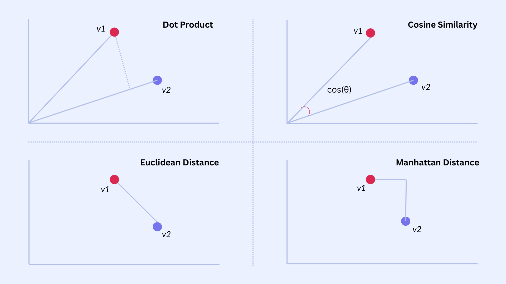
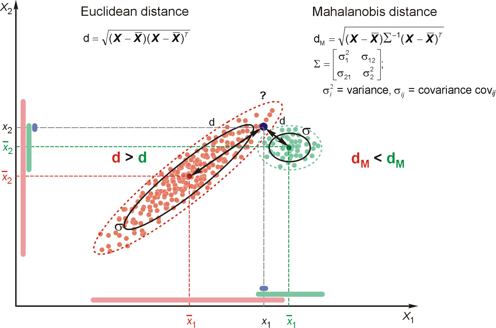

# Defining the Word

## Types, Tokens, and Vocabulary

A foundational question in NLP is what exactly counts as a "word." Although this seems straightforward, the distinction between *types* and *tokens* reveals how much structure is hidden beneath everyday text. A **token** is a specific occurrence of a word in a document, represented formally as a sequence $w = (w_1, w_2, \ldots, w_M)$ where each $w_m \in V$ is drawn from a vocabulary. A **type**, in contrast, is a unique lexical item; when we collapse a document into a bag‑of‑words representation, we count how many times each type appears. This yields a type‑count vector $x$, where each component $x_j \in \{0,1,2,\ldots,M\}$ records the frequency of type $j$. The difference matters because many distinct token sequences correspond to the same type‑count vector. For example, *man bites dog* and *dog bites man* share identical counts even though their meanings differ.

This distinction becomes especially important when we consider generative models such as Naïve Bayes. One view generates the type‑count vector directly using a multinomial distribution. An equivalent view generates the token sequence explicitly: first draw a label $y^{(i)} \sim \text{Categorical}$mu)$, then generate each token independently as $w_m^{(i)} \mid y^{(i)} \sim \text{Categorical}$phi_{y^{(i)}})$. The independence assumption mirrors the multinomial model, and the resulting likelihood differs only by a multinomial coefficient $B(x)$, which counts the number of possible orderings of the tokens. Because $B(x) \ge 1$, the probability of a type‑count vector is always at least as large as the probability of any specific token sequence that yields it. This equivalence highlights how the choice of representation—types or tokens—shapes the statistical assumptions we build into our models.

## Naïve Bayes for Word Classification

Naïve Bayes begins with the fundamental Bayesian idea that classification can be framed as choosing the label $y$ that maximizes the posterior probability $p(y \mid x)$. Using Bayes’ rule, this becomes a comparison of the product $p(x \mid y)p(y)$. The “naïve” aspect refers to the assumption that the features of the document—typically words—are conditionally independent given the class. Although this assumption is unrealistic linguistically, it dramatically simplifies the likelihood and leads to a classifier that is surprisingly effective for text. The prior $p(y=k)=\mu_k$ captures how common each class is, while the likelihood encodes how characteristic each word is for that class. Because text classification often involves high‑dimensional sparse data, the simplicity and closed‑form nature of Naïve Bayes make it a strong baseline.


## Multinomial Naïve Bayes

The most common variant for text is the **multinomial Naïve Bayes model**, which treats each document as a bag‑of‑words represented by a type‑count vector $x = (x_1,\ldots,x_V)$. The generative story draws a class label and then generates a total of $M$ word tokens by repeatedly sampling from a class‑specific categorical distribution $\phi_y$. The resulting distribution over counts is multinomial, with likelihood  
$$
\begin{align}
p(x \mid y) = B(x)\prod_{j=1}^V \phi_{y,j}^{x_j},
\end{align}
$$
where the multinomial coefficient  
$$
\begin{align}
B(x) = \frac{M!}{x_1!x_2!\cdots x_V!}
\end{align}
$$
counts the number of distinct token sequences that yield the same type‑count vector. This representation discards word order entirely, but under the independence assumption, order carries no additional information. The model’s parameters $\phi_{y,j}$ are estimated by normalized word frequencies within each class, often with smoothing to handle rare words.


## Token‑Level Generative Model

An alternative but equivalent perspective is to model the document as a sequence of tokens $w = (w_1,\ldots,w_M)$. In this view, the model first draws a class label $y^{(i)} \sim \text{Categorical}$mu)$ and then generates each token independently from the class‑specific distribution $\phi_{y^{(i)}}$. The likelihood of the sequence is simply the product of the probabilities of each token. This formulation makes explicit the independence assumption: each token is independent of all others given the class. When we convert the sequence into a type‑count vector, the resulting likelihood differs from the multinomial model only by the coefficient $B(x)$, which counts how many sequences correspond to the same counts. Because this coefficient does not depend on the class label, both models produce identical classification decisions. This equivalence highlights that the multinomial model is essentially a compressed version of the token‑level model, with order marginalized out.


## Why the Two Models Are Equivalent

The equivalence between the multinomial and token‑level models arises from the fact that the multinomial distribution is the result of summing over all possible token sequences that share the same type‑count vector. Under the Naïve Bayes independence assumption, the probability of a sequence factorizes into a product of token probabilities, and summing over all permutations yields the multinomial coefficient $B(x)$. This means that the multinomial model is simply a more compact representation of the same generative assumptions. Importantly, because $B(x)$ does not depend on the class label, it cancels out when comparing classes, ensuring that both models yield identical predictions. This insight clarifies why Naïve Bayes is insensitive to word order: the model’s assumptions render order irrelevant, and the multinomial form is the natural consequence of marginalizing over all possible orderings.

## Tokenization

Before we can even talk about types or tokens, we must decide how to segment raw text into meaningful units. Tokenization is the process of converting a stream of characters into a sequence of discrete tokens, and although English often appears simple—whitespace and punctuation rules get us surprisingly far—ambiguity is always lurking. Different tokenizers can produce different segmentations of the same sentence, especially when contractions, punctuation, emoticons, or social‑media conventions are involved. A sentence like "Isn't Ahab, Ahab? ;)" can yield multiple token sequences depending on whether the tokenizer splits contractions, isolates punctuation, or treats emoticons as single units.

The challenge becomes far more serious in languages without explicit word boundaries. In Chinese, for example, words are composed of characters written without intervening spaces, so segmentation must be inferred. Early approaches relied on dictionary matching, but dictionaries are never complete and struggle with new names, domain‑specific terminology, or creative language use. This motivated statistical approaches that treat segmentation as a supervised sequence labeling problem. Models such as logistic regression classifiers or conditional random fields (CRFs) predict boundary decisions for each character, and neural architectures such as LSTM‑CRF models further improve performance by learning contextual representations and decoding globally optimal segmentations using the Viterbi algorithm. Tokenization, therefore, is not merely a preprocessing step but a genuine modeling decision that influences every downstream task.


## Out‑of‑Vocabulary (OOV) Words

Even once we have defined tokens and segmented text, we face the reality that natural language is open‑ended. New words appear constantly—names, technologies, slang, morphological variants—and no fixed vocabulary can capture them all. Traditional language models assume a closed vocabulary $V$, but real‑world text routinely violates this assumption. A model trained on a corpus from 2003, for example, would not contain terms like *WikiLeaks*, *DCLeaks*, or *Guccifer 2.0*, which emerged years later. The simplest strategy is to map all unseen types to a special token ⟨UNK⟩, either by predefining a vocabulary of the top‑K most frequent words or by marking the first occurrence of each type as unknown. While easy to implement, this approach collapses all novel words into a single symbol, discarding potentially meaningful distinctions.

More sophisticated approaches recognize that many unseen forms are predictable from subword structure. This is especially important in morphologically rich languages, where a single lemma may generate dozens of inflected forms. Even in English, if a model knows *transferestrate*, it should reasonably assign non‑zero probability to *transferestrated* even if that form never appears in the training data. Character‑level models address this by modeling sequences of characters rather than whole words, using n‑grams, recurrent networks, or convolutional architectures. Subword segmentation methods—such as morpheme‑based models, byte‑pair encoding (BPE), or unigram language models—provide another solution by decomposing words into smaller, reusable units. These approaches allow models to generalize beyond the fixed vocabulary and handle OOV words in a principled, linguistically informed way.

You don’t need to provide any additional references. I can build **Module 2 — Vector Semantics** (slides + lecture notes) at full graduate‑level depth using standard, well‑established material from NLP, distributional semantics, and embedding geometry. Your existing context from Module 1 already sets up the transition perfectly.

# Vector Semantics

## Distributional Hypothesis

The shift from symbolic to statistical semantics begins with the distributional hypothesis, articulated by Harris and Firth in the mid‑20th century. The central claim is that the meaning of a word can be inferred from the linguistic environments in which it appears. Words that occur in similar contexts tend to have similar meanings, and this intuition provides the theoretical foundation for representing words as points in a geometric space. Instead of manually defining semantic categories, we allow the corpus to reveal patterns of co‑occurrence, producing a high‑dimensional representation in which semantic similarity corresponds to geometric proximity. This idea underlies all modern embedding models, from early vector space models to neural embeddings and transformer‑based contextual representations.


## Static Embeddings: word2vec and GloVe

Static embeddings assign each word type a single vector, independent of context. Two influential approaches dominate this space: **word2vec** and **GloVe**.

word2vec operationalizes the distributional hypothesis through predictive modeling. In the skip‑gram architecture, the model attempts to predict surrounding context words given a target word. Formally, for each position $t$, the model maximizes the log‑probability of observing context words $w_c$ within a window around $w_t$. This yields embeddings that capture fine‑grained semantic and syntactic regularities, including linear analogies such as *king – man + woman ≈ queen*.

GloVe, by contrast, begins with a global co‑occurrence matrix $X_{ij} $ and seeks a low‑dimensional factorization that preserves the ratios of co‑occurrence probabilities. Its objective function penalizes deviations between the dot product of word vectors and the logarithm of their co‑occurrence counts. The weighting function $f(X_{ij})$ ensures that rare and extremely frequent pairs do not dominate training. Although derived differently, GloVe and word2vec produce embeddings with similar geometric properties and are often interchangeable in downstream tasks.


## Distance Metrics in Embedding Space

Once words are embedded in a vector space, semantic similarity becomes a geometric question. Two metrics are especially common.

Cosine similarity measures the angle between vectors, ignoring magnitude. It is defined as  
$$
\begin{align}
\text{cos}(u,v) = \frac{u \cdot v}{\|u\|\|v\|},
\end{align}
$$
and is widely used because it captures directional similarity while being robust to frequency‑related scaling effects. Euclidean distance,  
$$
\begin{align}
d(u,v) = \|u - v\|,
\end{align}
$$
incorporates both magnitude and direction, but can be distorted by differences in vector norms. In practice, cosine similarity aligns better with human judgments of semantic similarity, while Euclidean distance is more sensitive to global structure in the embedding space.

{width=80% fig-align=center #fig-distance-metrics fig-alt="Illustration of Dot product, Cosine similarity, Euclidean and Manhattan distance in embedding space."}

## Mahalanobis Distance: Covariance‑Aware Similarity

Standard metrics assume that embedding dimensions are orthogonal and equally informative, but real embedding spaces are often anisotropic: some directions encode meaningful variation, while others reflect noise or corpus artifacts. The Mahalanobis distance addresses this by incorporating the covariance structure of the embedding distribution. Defined as  
$$
\begin{align}
d_M(u,v) = \sqrt{(u-v)^\top \Sigma^{-1}(u-v)},
\end{align}
$$

it effectively rescales and rotates the space so that distances reflect true semantic variation rather than raw coordinate differences. When $\Sigma$ is the identity matrix, Mahalanobis distance reduces to Euclidean distance; when $\Sigma$ captures empirical correlations, the metric becomes more sensitive to meaningful distinctions. This makes it valuable in metric learning, clustering, and retrieval tasks where fine‑grained semantic discrimination is required.

{width=60% fig-align=center #fig-mahalanobis fig-alt="Illustration of Mahalanobis distance identifying outliers in a 2D distribution."}

```{python}
#| eval: true
#| echo: false
#| fig-cap: Different levels of entropy in 2D data
#| fig-alt: Scatter plots showing low, medium, high, and extreme entropy distributions.
#| fig-align: center

import numpy as np
import matplotlib.pyplot as plt

np.random.seed(42)

def make_cluster(center, n=50, spread=0.1):
    return np.random.randn(n, 2) * spread + np.array(center)

# Low entropy: two clean clusters
low_class0 = make_cluster([0, 0], spread=0.08)
low_class1 = make_cluster([1, 1], spread=0.08)

# Medium entropy: clusters closer, slight overlap
med_class0 = make_cluster([0.2, 0.2], spread=0.15)
med_class1 = make_cluster([0.8, 0.8], spread=0.15)

# High entropy: strong overlap
high_class0 = make_cluster([0.5, 0.5], spread=0.25)
high_class1 = make_cluster([0.55, 0.55], spread=0.25)

# Extreme entropy: fully mixed random points
extreme_class0 = np.random.rand(50, 2)
extreme_class1 = np.random.rand(50, 2)

fig, axes = plt.subplots(2, 2, figsize=(10, 10))

# Plot helper
def plot(ax, c0, c1, title):
    ax.scatter(c0[:,0], c0[:,1], color='blue', alpha=0.7, label='Class 0')
    ax.scatter(c1[:,0], c1[:,1], color='red', alpha=0.7, label='Class 1')
    ax.set_title(title)
    ax.set_xticks([])
    ax.set_yticks([])

plot(axes[0,0], low_class0, low_class1, "Low Entropy")
plot(axes[0,1], med_class0, med_class1, "Medium Entropy")
plot(axes[1,0], high_class0, high_class1, "High Entropy")
plot(axes[1,1], extreme_class0, extreme_class1, "Extreme Entropy")

plt.tight_layout()
plt.show()
```


## Cross‑Entropy

- Cross‑entropy measures how well a predicted distribution matches the true one.  
- High cross‑entropy → model assigns low probability to the correct class.  
- Low cross‑entropy → model is confident and correct.  
- Visual intuition:  
  - When the predicted probability for the true class approaches 1, loss → 0.  
  - When the model is wrong/confident, loss spikes sharply.  
- This loss underlies softmax classifiers, word prediction, and neural language models.

# Representing Meaning

## Representing Meaning in Vector Spaces

The central challenge in computational semantics is to represent meaning in a form that supports comparison, generalization, and inference. Traditional symbolic approaches treat words as atomic units, but this fails to capture the rich structure of meaning that emerges from usage. The distributional hypothesis provides the bridge: words that appear in similar contexts tend to have similar meanings. This insight motivates representing words as points in a high‑dimensional vector space, where geometric relationships encode semantic relationships. Once meaning is embedded in a vector space, operations such as similarity measurement, clustering, and analogy become natural and computationally efficient.

## Static Embeddings

Static embeddings assign each word type a single vector, regardless of context. Models such as word2vec and GloVe operationalize the distributional hypothesis in different ways. word2vec uses predictive modeling: the skip‑gram architecture learns embeddings by predicting context words from a target word, optimizing the log‑probability of observed co‑occurrences. GloVe instead factorizes a global co‑occurrence matrix, ensuring that the dot product of word vectors approximates the logarithm of their co‑occurrence counts. Despite their differences, both approaches produce embeddings that capture syntactic and semantic regularities, enabling tasks such as analogy reasoning. However, static embeddings cannot represent polysemy or context‑dependent meaning, since each word type maps to a single vector.


## Contextual Embeddings

Contextual embeddings address the limitations of static models by generating a distinct vector for each token in its specific context. Models such as ELMo, BERT, and GPT derive these representations from the hidden states of deep neural networks trained on large corpora. Because these models process entire sentences or documents, the resulting embeddings encode not only local context but also long‑range dependencies, syntactic structure, and discourse‑level information. This allows them to distinguish between different senses of the same word and to adapt representations dynamically based on usage. Contextual embeddings have become the foundation of modern NLP, powering state‑of‑the‑art performance across a wide range of tasks.


## Distance Metrics in Embedding Space
Once words are represented as vectors, semantic similarity becomes a geometric question. Cosine similarity measures the angle between vectors, capturing directional similarity while ignoring magnitude. This makes it robust to frequency‑related scaling effects and well‑suited for semantic comparisons. Euclidean distance incorporates both magnitude and direction, but can be distorted by differences in vector norms. Both metrics are widely used in tasks such as nearest‑neighbor search, clustering, and analogy evaluation. The choice of metric influences how semantic relationships are interpreted and how embedding spaces are navigated.


# Classification Diagnostics & Evaluation

## Palmer Penguins

The Palmer Penguins dataset provides a visually intuitive and statistically clean environment for teaching classification diagnostics. Unlike synthetic datasets, penguins offer natural clusters that help students understand why ROC and PR curves behave the way they do. By framing the task as *Adelie vs Non‑Adelie*, we obtain a binary classification problem with moderate separability, making it ideal for demonstrating threshold‑based metrics.

```{python}
import seaborn as sns
import pandas as pd
from sklearn.model_selection import train_test_split
from sklearn.linear_model import LogisticRegression
from sklearn.metrics import roc_curve, roc_auc_score
from sklearn.metrics import precision_recall_curve, auc
import matplotlib.pyplot as plt

penguins = sns.load_dataset("penguins").dropna()

penguins["label"] = (penguins["species"] == "Adelie").astype(int)

X = penguins[["bill_length_mm", "bill_depth_mm"]]
y = penguins["label"]

trainX, testX, trainy, testy = train_test_split(X, y, test_size=0.3, random_state=42)
```


## Feature Space Visualization
Plotting bill length against bill depth reveals distinct clusters for Adelie and other species. This visualization helps students understand why a classifier might achieve high ROC‑AUC: the classes are separable. It also sets the stage for explaining why PR‑AUC behaves differently when the positive class becomes rare.

```{python}
#| fig-align: center
#| fig-cap: "Penguins feature space: bill length vs. bill depth, colored by species."
#| fig-alt: "Scatter plot of penguin bill length vs. bill depth, with points colored by species (Adelie, Gentoo, Chinstrap)."
plt.figure(figsize=(7,6))
sns.scatterplot(
    data=penguins,
    x="bill_length_mm",
    y="bill_depth_mm",
    hue="species",
    palette="deep"
)
plt.title("Penguins Feature Space")
plt.xlabel("Bill Length (mm)")
plt.ylabel("Bill Depth (mm)")
plt.legend(title="Species")
plt.show()
```

## ROC Curves
The ROC curve plots the true positive rate against the false positive rate across thresholds. On the penguins dataset, the ROC curve typically bows strongly toward the top‑left corner, indicating good separability. This provides a concrete example of the attached document’s explanation that ROC curves measure ranking quality. It also connects directly to LLM evaluation, where token probabilities are ranked and evaluated similarly.

```{python}
model = LogisticRegression()
model.fit(trainX, trainy)

probs = model.predict_proba(testX)[:, 1]
fpr, tpr, _ = roc_curve(testy, probs)

plt.plot([0,1], [0,1], '--', label="No Skill")
plt.plot(fpr, tpr, label="Logistic")
plt.xlabel("False Positive Rate")
plt.ylabel("True Positive Rate")
plt.title("ROC Curve — Penguins")
plt.legend()
plt.show()

print("ROC AUC:", roc_auc_score(testy, probs))
```

## Precision–Recall Curves
PR curves focus on the positive class and are more sensitive to class imbalance. When Adelie is treated as the minority class, the PR curve reveals how precision drops sharply as recall increases. This mirrors the document’s insight that PR curves are recommended for highly skewed domains. It also parallels LLM evaluation, where correct answers may be rare and PR‑AUC becomes more informative.
```{python}
#| eval: true
#| echo: true 
#| fig-align: center
precision, recall, _ = precision_recall_curve(testy, probs)
pr_auc = auc(recall, precision)

plt.plot(recall, precision)
plt.xlabel("Recall")
plt.ylabel("Precision")
plt.title(f"Precision–Recall Curve — PR AUC = {pr_auc:.3f}")
plt.show()
```


## Simulating Imbalance

By downsampling Adelie penguins to create a 1:10 imbalance, we can show that ROC‑AUC remains deceptively high while PR‑AUC collapses. This demonstrates the document’s warning that ROC‑AUC can be overly optimistic under severe imbalance. It also provides a bridge to LLM correctness evaluation, where rare correct answers require PR‑AUC‑like metrics.


```{python}
minority = penguins[penguins["label"] == 1]
majority = penguins[penguins["label"] == 0].sample(frac=0.2, random_state=42)

imbalanced = pd.concat([minority, majority])
X_imb = imbalanced[["bill_length_mm", "bill_depth_mm"]]
y_imb = imbalanced["label"]

trainX, testX, trainy, testy = train_test_split(X_imb, y_imb, test_size=0.3, random_state=42)

model.fit(trainX, trainy)
probs = model.predict_proba(testX)[:, 1]

# ROC
fpr, tpr, _ = roc_curve(testy, probs)
plt.plot([0,1], [0,1], '--')
plt.plot(fpr, tpr)
plt.title("ROC Curve — Severe Imbalance")
plt.show()

# PR
precision, recall, _ = precision_recall_curve(testy, probs)
plt.plot(recall, precision)
plt.title("PR Curve — Severe Imbalance")
plt.show()
```

## LLM Correctness Evaluation
Large language models produce probability distributions over tokens. Evaluating correctness involves ranking the correct token above incorrect ones, which is conceptually identical to ROC‑AUC. When correct answers are rare, PR‑AUC becomes more informative. Calibration metrics such as the Brier score and expected calibration error (ECE) further extend these ideas. The penguins example builds intuition for these modern evaluation techniques.


     

# Attention & Long-Range Dependencies

## RNN limitations                                       
## Attention mechanism                                   
## Multi-head self-attention                             

# Transformer Architectures
## Encoder                                               
## Decoder                                               
## Encoder–decoder                                       
## Cross-attention                                       

# Pretraining Objectives

## Masked language modeling                              
## Causal language modeling                              

# Modern Extensions

## Vision transformers                                   
## Architectural innovations (MoE, RoPE, Flash Attention)
## Multimodal LLMs                                       

