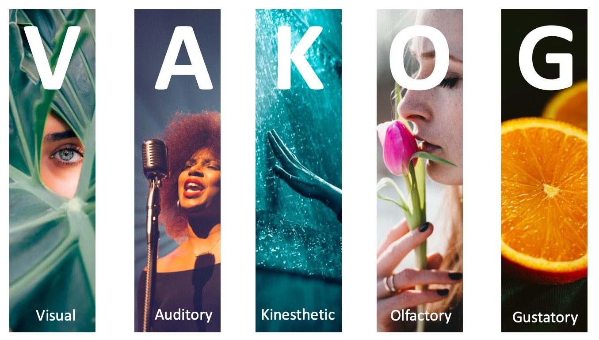

# Defining the Word

## Types, Tokens, and Vocabulary

- A **token** is an individual occurrence of a word in a document:  
  $w = (w_1, w_2, \ldots, w_M)$, where each $w_m \in V$.  
- A **type** is a unique word in the vocabulary.  
- A document’s type‑count vector is  
  $$
  \begin{align}
    x_j \in \{0,1,2,\ldots,M\}
  \end{align}
  $$
  
  - where $x_j$ counts how many times type $j$ appears.

- Order matters for tokens; order is lost in type counts.  
- Many token sequences map to the same type‑count vector.  
- Multinomial Naïve Bayes uses type counts, but an equivalent generative model can produce tokens directly.

## Naïve Bayes for Word Classification

- Goal: classify a document $x$ into a label $y \in \{1,\ldots,K\}$.  
- Bayes rule:  
  $$
  \begin{align}
  \hat{y} = \arg\max_y \; p(y \mid x) = \arg\max_y \; p(x \mid y)\,p(y)
  \end{align}
  $$
- **Naïve assumption:** features (words) are conditionally independent given the class.  
- Prior:  
  $$
  \begin{align}
  p(y=k) = \mu_k
  \end{align}
  $$
- Likelihood factorizes across features.

---

## Multinomial Naïve Bayes

- Represent document as type‑count vector  
  $$
  \begin{align}
  x = (x_1, x_2, \ldots, x_V)
  \end{align}
  $$
- Generative process:  
  1. Draw class $y \sim \text{Categorical}(\mu)$.  
  2. Draw counts from a multinomial: $x \mid y \sim \text{Multinomial}(M, \phi_y)$
- Likelihood:  
  $$
  \begin{align}
  p(x \mid y) = B(x)\prod_{j=1}^V \phi_{y,j}^{x_j}
  \end{align}
  $$
  - where $B(x) = \frac{M!}{x_1!x_2!\cdots x_V!}$ is the multinomial coefficient.

---

## Token‑Level Generative Model

- Alternative generative process (Algorithm 2):  
  $$
  \begin{align}
  y^{(i)} &\sim \text{Categorical}(\mu)\\
  w_m^{(i)} &\mid y^{(i)} \sim \text{Categorical}(\phi_{y^{(i)}})
  \end{align}
  $$
- Conditional independence:  
  $$
  \begin{align}
  w_m^{(i)} \perp w_{m'}^{(i)} \mid y^{(i)}
  \end{align}
  $$
- Probability of sequence:  
  $$
  \begin{align}
  p(w \mid y) = \prod_{m=1}^M \phi_{y,\,w_m}
  \end{align}
  $$
- Equivalent to multinomial NB up to the multinomial coefficient $B(x)$.


## Why the Two Models Are Equivalent

- Many token sequences correspond to the same type‑count vector.  
- Relationship:  
  $$
  \begin{align}
  p(w \mid y) = \frac{1}{B(x)}\,p(x \mid y)
  \end{align}
  $$
- Since $B(x) \ge 1$,  
  $$
  \begin{align}
  p(x \mid y) \ge p(w \mid y)
  \end{align}
  $$
- Classification decisions identical because $B(x)$ does [not]{.uured-bold} depend on $y$.  
- [Order adds no information under the Naïve Bayes independence assumption]{.uublue-bold}.


## Tokenization

- Converts raw character sequences into discrete units.  
- English: whitespace + punctuation rules often suffice.  
- Other languages: segmentation is non‑trivial (e.g., Chinese, Japanese).
- Challenges:
  - Ambiguity: "Isn’t Ahab, Ahab? ;)" → different tokenizers produce different segmentations.  
  - Languages without spaces require statistical segmentation.  
  - Social media, hashtags, emojis, and code‑switching complicate boundaries.
- Algorithmic Approaches
  - Rule‑based (regex, dictionaries).  
  - Supervised sequence labeling (e.g., logistic regression, CRF).  
  - Neural models (LSTM‑CRF, CNN‑based encoders).

---

## Out‑of‑Vocabulary (OOV) Words

- Closed vs. open vocabulary
  - Closed vocabulary: fixed $V$.  
  - Real text introduces new names, slang, technologies, numbers, and morphological variants.
- Basic OOV handling
  - Replace unseen types with a special token: ⟨UNK⟩.  
  - Option: mark first occurrence of each type as ⟨UNK⟩.
- Better OOV modeling
  - Character‑level models (n‑grams, RNNs, CNNs).  
  - Subword segmentation (morphemes, BPE, unigram LM).  
  - Helps with morphologically rich languages (e.g., Portuguese verb paradigms).

---

## Vocabulary Size and Coverage

- Larger vocabulary → higher coverage but larger models.  
- English movie reviews: ~4k types cover ~90% of tokens.  
- Portuguese (MAC‑Morpho): >10k types needed for similar coverage.

- Design decisions
  - Limit vocabulary to top‑K types.  
  - Consider stemming/lemmatization.  
  - Avoid over‑aggressive stopword removal in supervised tasks.  
  - Feature hashing for fixed‑size representations.


# Vector Semantics

## Distributional Semantics: The Core Idea

- Meaning emerges from **contextual usage**.  
- Harris (1954), Firth (1957): *"You shall know a word by the company it keeps."*  
- Represent words as [vectors]{.uublue-bold} in a high‑dimensional space.  
- Similarity = [geometric closeness]{.uublue-bold}.  
- Foundation for all modern embeddings.

---

## Static Embeddings: word2vec & GloVe

- word2vec
  - Learns embeddings by predicting context.  
- Two architectures:  
  - [CBOW]{.uured-bold}: predict target from context.  
  - [Skip‑gram]{.uured-bold}: predict context from target.  
- Objective (skip‑gram):  
  $$
  \begin{align}
  \max_\theta \sum_{t=1}^T \sum_{c \in \mathcal{C}(t)} \log p(w_c \mid w_t)
  \end{align}
  $$

- GloVe
  - Global co‑occurrence matrix factorization.  
  $$
  \begin{align}
  J = \sum_{i,j} f(X_{ij})\left( w_i^\top \tilde{w}_j + b_i + \tilde{b}_j - \log X_{ij} \right)^2
  \end{align}
  $$

---

## Geometry of Embedding Spaces

- Embedding space = [semantic geometry]{.uublue-bold}.
- Cosine similarity:  
  - Cosine: angle → semantic similarity.  
  $$
  \begin{align}
  \text{cos}(u,v) = \frac{u \cdot v}{\|u\|\|v\|}
  \end{align}
  $$
- Euclidean distance:  
  - Euclidean: magnitude + direction → sensitive to frequency effects.  
  $$
  \begin{align}
  d(u,v) = \|u - v\|
  \end{align}
  $$

---

## Distance Metrics in Embedding Space

{width=80% fig-align=center #fig-distance-metrics fig-alt="Illustration of Dot product, Cosine similarity, Euclidean and Manhattan distance in embedding space."}

---

## Mahalanobis Distance: Covariance‑Aware Similarity

- Accounts for [correlated dimensions]{.uublue-bold}.  
- Generalized distance:  
  $$
  \begin{align}
  d_M(u,v) = \sqrt{(u-v)^\top \Sigma^{-1}(u-v)}
  \end{align}
  $$
- $\Sigma$ = covariance matrix of embedding distribution.  
- Benefits:  
  - Downweights noisy or redundant dimensions.  
  - Captures anisotropy in embedding spaces.  
- Useful in metric learning, clustering, and specialized retrieval tasks.

## Mahalanobis Distance

{width=60% fig-align=center #fig-mahalanobis fig-alt="Illustration of Mahalanobis distance identifying outliers in a 2D distribution."}

## Cross‑Entropy

```{python}
#| eval: true
#| echo: false
#| fig-cap: Different levels of entropy in 2D data
#| fig-alt: Scatter plots showing low, medium, high, and extreme entropy distributions.
#| fig-align: center
#| label: fig-entropy


import numpy as np
import matplotlib.pyplot as plt

np.random.seed(42)

def make_cluster(center, n=50, spread=0.1):
    return np.random.randn(n, 2) * spread + np.array(center)

# Low entropy: two clean clusters
low_class0 = make_cluster([0, 0], spread=0.08)
low_class1 = make_cluster([1, 1], spread=0.08)

# Medium entropy: clusters closer, slight overlap
med_class0 = make_cluster([0.2, 0.2], spread=0.15)
med_class1 = make_cluster([0.8, 0.8], spread=0.15)

# High entropy: strong overlap
high_class0 = make_cluster([0.5, 0.5], spread=0.25)
high_class1 = make_cluster([0.55, 0.55], spread=0.25)

# Extreme entropy: fully mixed random points
extreme_class0 = np.random.rand(50, 2)
extreme_class1 = np.random.rand(50, 2)

fig, axes = plt.subplots(2, 2, figsize=(6, 6))

# Plot helper
def plot(ax, c0, c1, title):
    ax.scatter(c0[:,0], c0[:,1], color='blue', alpha=0.7, label='Class 0')
    ax.scatter(c1[:,0], c1[:,1], color='red', alpha=0.7, label='Class 1')
    ax.set_title(title)
    ax.set_xticks([])
    ax.set_yticks([])

plot(axes[0,0], low_class0, low_class1, "Low Entropy")
plot(axes[0,1], med_class0, med_class1, "Medium Entropy")
plot(axes[1,0], high_class0, high_class1, "High Entropy")
plot(axes[1,1], extreme_class0, extreme_class1, "Extreme Entropy")

plt.tight_layout()
plt.show()
```


## Cross‑Entropy

- Cross‑entropy measures how well a predicted distribution matches the true one.  
- High cross‑entropy → model assigns low probability to the correct class.  
- Low cross‑entropy → model is confident and correct.  
- Visual intuition:  
  - When the predicted probability for the true class approaches 1, loss → 0.  
  - When the model is wrong/confident, loss spikes sharply.  
- This loss underlies softmax classifiers, word prediction, and neural language models.

# Representing Meaning

## VAKOG: Visual, Auditory, Kinesthetic modalities.

{width=75% fig-align=center #fig-vakog fig-alt="Diagram illustrating the VAKOG representational meaning model, showing how words can evoke visual, auditory, and kinesthetic representations."}

## Why Represent Meaning in Vectors?

- Words carry meaning through **patterns of use**.  
- Distributional hypothesis → represent meaning via **co‑occurrence structure**.  
- Vector spaces allow:  
  - Similarity comparisons  
  - Analogy reasoning  
  - Clustering & retrieval  
  - Input to neural models  
- Meaning becomes **geometry**.

---

## Static Embeddings

- One vector per word type (context‑independent).  
- Learned from large corpora.  
- Two major families:  
  - **word2vec** (predictive)  
  - **GloVe** (count‑based factorization)  
- Capture syntactic & semantic regularities.  
- Limitations:  
  - Polysemy collapsed into one vector  
  - No contextual variation

---

## Contextual Embeddings

- Meaning depends on **context**.  
- Same word → different vectors in different sentences.  
- Produced by deep LMs (ELMo, BERT, GPT).  
- Representations come from **hidden states** of the model.  
- Capture:  
  - Word sense  
  - Syntax  
  - Long‑range dependencies  
  - Discourse‑level meaning


# Classification Diagnostics & Evaluation

## Classification Example

- Dataset includes **Adelie, Gentoo, Chinstrap** penguins.  
- Features: bill length, bill depth, flipper length, body mass.  
- For evaluation demos, create a **binary task**:  
  - *Adelie* vs *Non‑Adelie*  
- Allows clean visualization of:  
  - Class separation  
  - Threshold effects  
  - ROC & PR curves  
  - Imbalance manipulation

```{python}
#| eval: true
#| echo: false 
#| output-location: slide

import seaborn as sns
import pandas as pd
from sklearn.model_selection import train_test_split
from sklearn.linear_model import LogisticRegression
from sklearn.metrics import roc_curve, roc_auc_score
from sklearn.metrics import precision_recall_curve, auc
import matplotlib.pyplot as plt

penguins = sns.load_dataset("penguins").dropna()

penguins["label"] = (penguins["species"] == "Adelie").astype(int)

X = penguins[["bill_length_mm", "bill_depth_mm"]]
y = penguins["label"]

trainX, testX, trainy, testy = train_test_split(X, y, test_size=0.3, random_state=42)

```


---

## Visualizing the Feature Space

```{python}
#| eval: true
#| echo: false
#| fig-align: center
#| fig-cap: "Penguins feature space: bill length vs. bill depth, colored by species."
#| fig-alt: "Scatter plot of penguin bill length vs. bill depth, with points colored by species (Adelie, Gentoo, Chinstrap)."
plt.figure(figsize=(7,6))
sns.scatterplot(
    data=penguins,
    x="bill_length_mm",
    y="bill_depth_mm",
    hue="species",
    palette="deep"
)
plt.title("Penguins Feature Space")
plt.xlabel("Bill Length (mm)")
plt.ylabel("Bill Depth (mm)")
plt.legend(title="Species")
plt.show()
```

---

## ROC Curve on Penguins
- ROC = TPR vs FPR across thresholds.  
- AUC = ranking quality.  
- Penguins show clear separation → high AUC.  
- Connects to LLM evaluation:  
  - LLM token ranking ≈ classifier score ranking.

```{python}
#| eval: true
#| echo: false 
#| fig-align: center
#| fig-cap: "ROC curve for logistic regression on penguin data."
model = LogisticRegression()
model.fit(trainX, trainy)

probs = model.predict_proba(testX)[:, 1]
fpr, tpr, _ = roc_curve(testy, probs)


plt.plot([0,1], [0,1], '--', label="No Skill")
plt.plot(fpr, tpr, label="Logistic")
plt.xlabel("False Positive Rate")
plt.ylabel("True Positive Rate")
plt.title("ROC Curve — Penguins")
plt.legend()
plt.show()

print("ROC AUC:", roc_auc_score(testy, probs))
```

---

## Precision–Recall Curve on Penguins
- PR curve focuses on the **positive class**.  
- More sensitive to imbalance.  
- Demonstrates why PR‑AUC is preferred when positives are rare.  
- Connects to LLM correctness:  
  - Rare correct answers → PR‑AUC is more informative.

```{python}
#| eval: true
#| echo: false 
#| fig-align: center
precision, recall, _ = precision_recall_curve(testy, probs)
pr_auc = auc(recall, precision)

plt.plot(recall, precision)
plt.xlabel("Recall")
plt.ylabel("Precision")
plt.title(f"Precision–Recall Curve — PR AUC = {pr_auc:.3f}")
plt.show()
```

---

## Creating Imbalance in Penguins
- Downsample Adelie to simulate 1:10 imbalance.  
- ROC remains high; PR collapses.  
- Mirrors the attached document’s insight:  
  > “ROC AUC can be optimistic on severely imbalanced classification problems.”

```{python}
#| eval: true
#| echo: false 
#| fig-align: center
minority = penguins[penguins["label"] == 1]
majority = penguins[penguins["label"] == 0].sample(frac=0.2, random_state=42)

imbalanced = pd.concat([minority, majority])
X_imb = imbalanced[["bill_length_mm", "bill_depth_mm"]]
y_imb = imbalanced["label"]

trainX, testX, trainy, testy = train_test_split(X_imb, y_imb, test_size=0.3, random_state=42)

model.fit(trainX, trainy)
probs = model.predict_proba(testX)[:, 1]

# ROC
fpr, tpr, _ = roc_curve(testy, probs)
plt.plot([0,1], [0,1], '--')
plt.plot(fpr, tpr)
plt.title("ROC Curve — Severe Imbalance")
plt.show()

# PR
precision, recall, _ = precision_recall_curve(testy, probs)
plt.plot(recall, precision)
plt.title("PR Curve — Severe Imbalance")
plt.show()
```
---

## LLM Correctness Evaluation
- LLMs output **ranked token distributions**, not labels.  
- Evaluation parallels ROC/PR:  
  - Ranking quality → ROC‑AUC  
  - Rare correct answers → PR‑AUC  
  - Calibration → Brier score  
- Penguins example builds intuition for LLM scoring.

# Feedforward Architectures

## Sigmoid & ReLU Neurons


# Attention & Long-Range Dependencies

## RNN limitations                                       
## Attention mechanism                                   
## Multi-head self-attention                             

# Transformer Architectures
## Encoder                                               
## Decoder                                               
## Encoder–decoder                                       
## Cross-attention                                       

# Pretraining Objectives

## Masked language modeling                              
## Causal language modeling                              

# Modern Extensions

## Vision transformers                                   
## Architectural innovations (MoE, RoPE, Flash Attention)
## Multimodal LLMs                                       

