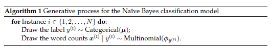
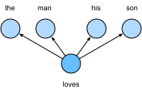
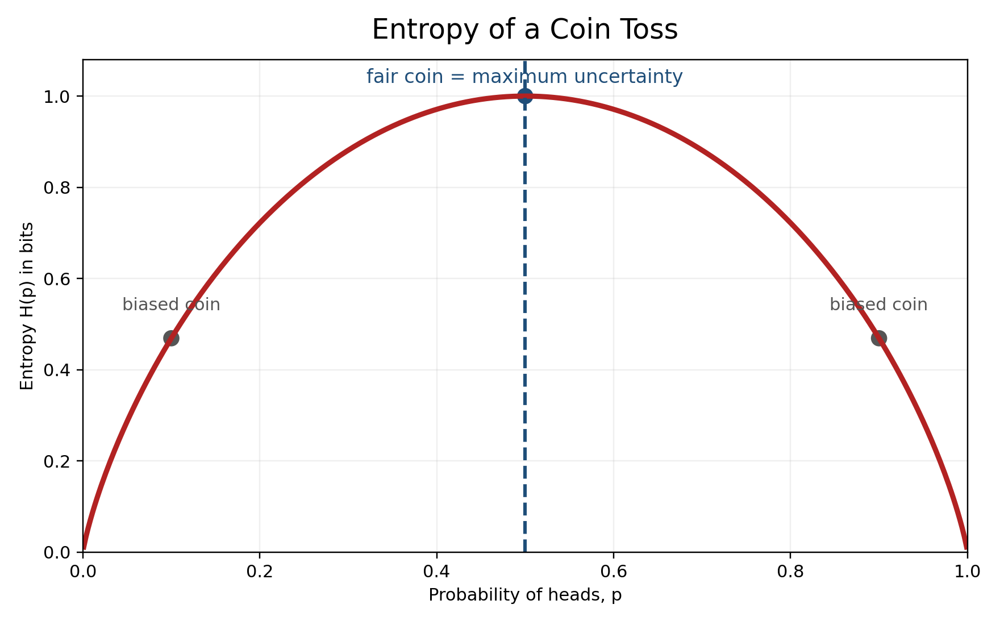
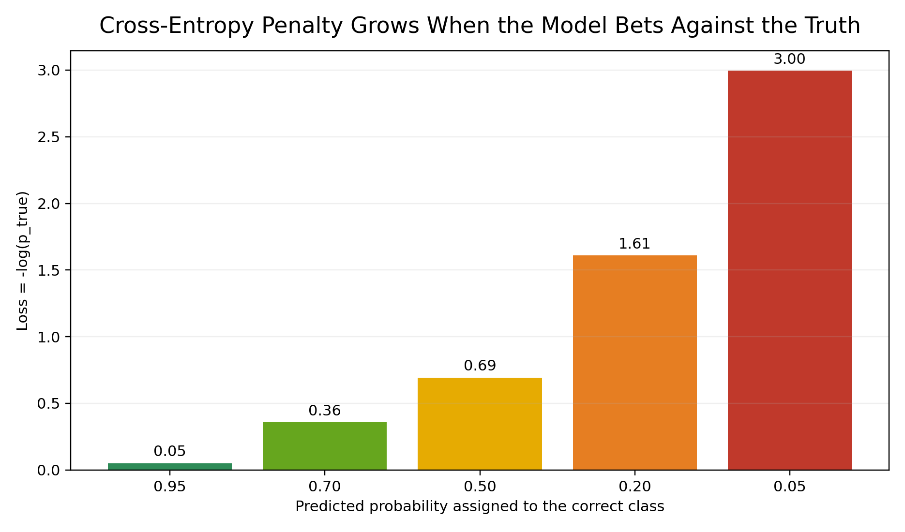
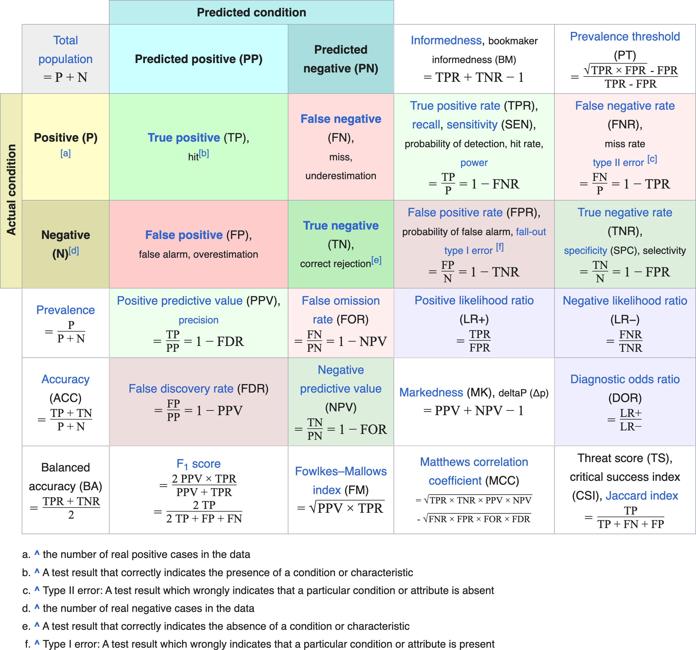
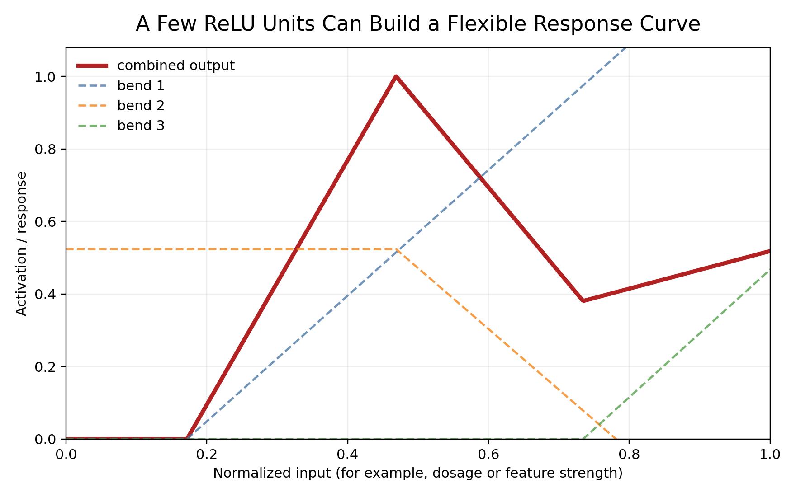
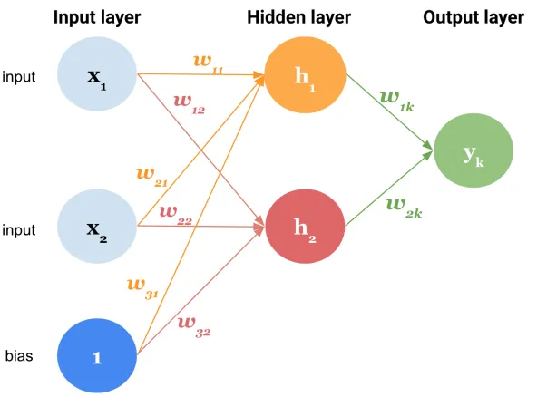
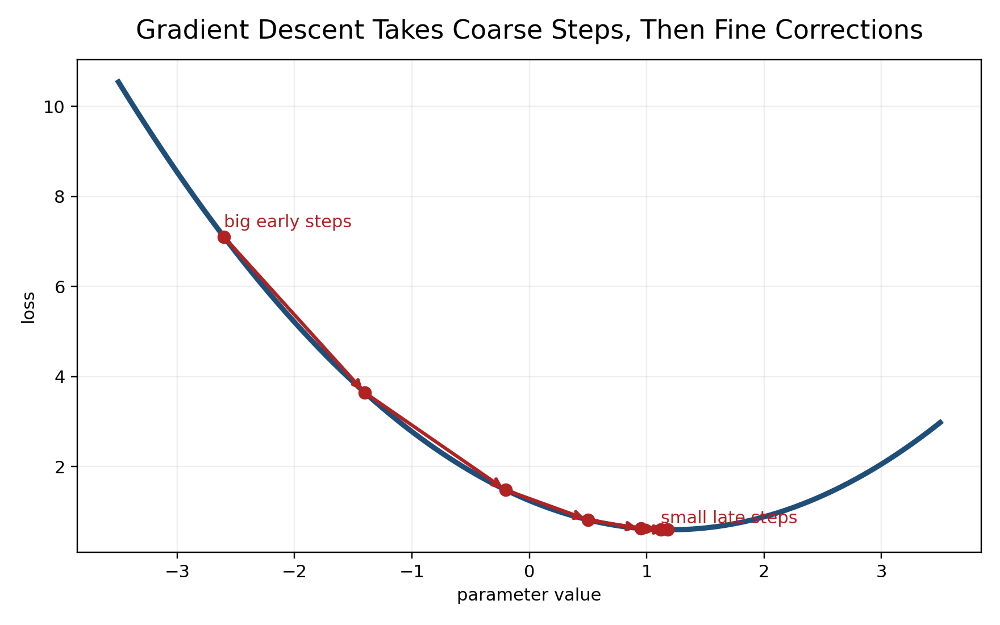
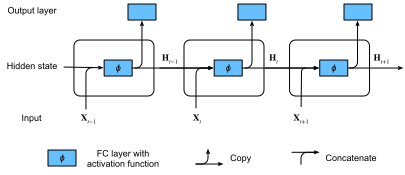
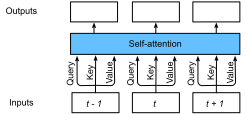

## How to print Revealjs slides

{width="80%" fig-align="center"}

# From Words to Vectors

## Module arc

- Start with tokens, counts, and vocabularies.
- Move from sparse text features to dense vector semantics.
- Use entropy, cross-entropy, and KL divergence to explain how neural models learn.
- Build the bridge from feedforward networks to RNNs, attention, and transformers.
- Keep one question in view:
  - How does a model turn text into probabilities, then probabilities into meaning?

---

## Types, tokens, and vocabulary

- A **token** is one occurrence in a sequence.
- A **type** is a unique vocabulary item.
- Bag-of-words keeps counts but discards order.
- Sequence models keep order and predict the next token from context.

$$
\begin{align}
w = (w_1, w_2, \ldots, w_M), \qquad x_j = \text{count of type } j
\end{align}
$$

---

## Why sparse representations still matter

- Count vectors are simple, interpretable, and strong baselines.
- Naive Bayes and logistic regression still work well for:
  - topic classification
  - spam detection
  - risk-factor tagging
- They help us see what neural models are replacing, not just what they outperform.

{width="62%" fig-alt="Simple illustration connecting bag-of-words classification to learned word vectors."}

---

## Naive Bayes as a probabilistic text model

- Draw a class label first.
- Then generate words from a class-specific distribution.
- Under the conditional-independence assumption:

$$
\begin{align}
\hat{y} = \arg\max_y \; p(y \mid x) = \arg\max_y \; p(x \mid y)p(y)
\end{align}
$$

- Strong simplification, but excellent intuition for token probabilities.

# Vector Semantics

## Distributional semantics

- Meaning comes from **patterns of use**.
- Words that occur in similar contexts get similar vectors.
- Vector spaces make semantics geometric:
  - nearby vectors = similar usage
  - distant vectors = different roles or meanings

> Modern LLMs still rely on this idea, but learn it dynamically and contextually.

---

## Static embeddings

- One vector per word type.
- Learned from large corpora.
- Classic families:
  - **CBOW** predicts the center word from context.
  - **Skip-gram** predicts context from the center word.
  - **GloVe** factorizes global co-occurrence statistics.

{width="42%" fig-alt="CBOW architecture diagram."}
{width="42%" fig-alt="Skip-gram architecture diagram."}

---

## Contextual embeddings

- One word can mean different things in different contexts.
- Static embeddings collapse polysemy into one vector.
- Contextual models produce a new vector for each token instance.

Examples:

- `bank` in *river bank*
- `bank` in *investment bank*

This is the representational leap from word2vec to BERT/GPT-style encoders and decoders.

---

## Geometry of embedding spaces

- Semantic similarity is often measured with cosine similarity.

$$
\begin{align}
\text{cos}(u,v) = \frac{u \cdot v}{\|u\|\|v\|}
\end{align}
$$

- Euclidean distance also matters, but is more sensitive to vector magnitude.
- Retrieval systems, clustering, and nearest-neighbor search all rely on this geometry.


## Distance Metrics in Embedding Space

```{python}
#| echo: false
#| eval: true
#| fig-alt: "Distance metrics in embedding space."
#| label: fig-distance-metrics
#| fig-align: center
#| caption: "Distance metrics in embedding space."

import matplotlib.pyplot as plt
import numpy as np

# --- helper: place equation in top-right of axes ---
def annotate_equation(ax, text):
    ax.text(
        0.98, 0.98, text,
        transform=ax.transAxes,
        ha='right', va='top',
        fontsize=12, fontweight='bold',
        bbox=dict(facecolor='white', alpha=0.7, edgecolor='none')
    )

# --- sample vectors ---
v1 = np.array([2, 1])
v2 = np.array([1, 2])

fig, axes = plt.subplots(2, 2, figsize=(6, 6))

# ---------------- DOT PRODUCT ----------------
ax = axes[0, 0]
ax.quiver(0, 0, v1[0], v1[1], angles='xy', scale_units='xy', scale=1, color='red')
ax.quiver(0, 0, v2[0], v2[1], angles='xy', scale_units='xy', scale=1, color='blue')
annotate_equation(ax, r"$v_1 \cdot v_2 = \sum_i v_{1i}v_{2i}$")
ax.set_title("Dot Product")
ax.set_xlim(0, 3); ax.set_ylim(0, 3); ax.set_aspect('equal')

# ---------------- COSINE SIMILARITY ----------------
ax = axes[0, 1]
ax.quiver(0, 0, v1[0], v1[1], angles='xy', scale_units='xy', scale=1, color='red')
ax.quiver(0, 0, v2[0], v2[1], angles='xy', scale_units='xy', scale=1, color='blue')
annotate_equation(ax, r"$\cos\theta=\frac{v_1\cdot v_2}{\|v_1\|\|v_2\|}$")
ax.set_title("Cosine Similarity")
ax.set_xlim(0, 3); ax.set_ylim(0, 3); ax.set_aspect('equal')

# ---------------- EUCLIDEAN DISTANCE ----------------
ax = axes[1, 0]
ax.plot([v1[0], v2[0]], [v1[1], v2[1]], 'k--')
ax.scatter([v1[0], v2[0]], [v1[1], v2[1]], color=['red','blue'])
annotate_equation(ax, r"$d=\sqrt{\sum_i (v_{1i}-v_{2i})^2}$")
ax.set_title("Euclidean Distance")
ax.set_xlim(0, 3); ax.set_ylim(0, 3); ax.set_aspect('equal')

# ---------------- MANHATTAN DISTANCE ----------------
ax = axes[1, 1]
ax.plot([v1[0], v1[0]], [v1[1], v2[1]], 'k--')
ax.plot([v1[0], v2[0]], [v2[1], v2[1]], 'k--')
ax.scatter([v1[0], v2[0]], [v1[1], v2[1]], color=['red','blue'])
annotate_equation(ax, r"$d=\sum_i |v_{1i}-v_{2i}|$")
ax.set_title("Manhattan Distance")
ax.set_xlim(0, 3); ax.set_ylim(0, 3); ax.set_aspect('equal')

plt.tight_layout()
plt.show()

```

<!-- {width="76%" fig-alt="Distance metrics in embedding space."} -->

---

## Covariance-aware distance

- Real embedding spaces are not perfectly isotropic.
- Mahalanobis distance adjusts for correlated dimensions.
- Useful idea for metric learning and specialized retrieval.

$$
\begin{align}
d_M(u,v) = \sqrt{(u-v)^\top \Sigma^{-1}(u-v)}
\end{align}
$$


{width="54%" fig-alt="Mahalanobis distance illustration." fig-align="center" #fig-mahalanobis}

# Entropy to Learning

## Entropy starts with uncertainty

- Entropy measures how uncertain a distribution is.
- For a Bernoulli event like a coin toss:

$$
\begin{align}
H(p) = -p\log_2 p - (1-p)\log_2(1-p)
\end{align}
$$

- If the coin is fair, uncertainty is highest.
- If the coin is heavily biased, uncertainty is lower.

---

## Coin toss intuition
- A fair coin surprises us more on average because both outcomes remain plausible.

- A biased coin is easier to predict, so average surprise drops.


{width="74%" fig-alt="Entropy curve for a coin toss showing maximum uncertainty at p equals 0.5." fig-align="center" #fig-entropy-coin}


---

## Surprise is the building block

- For one event, surprise is:

$$
\begin{align}
I(x) = -\log p(x)
\end{align}
$$

- Rare events create large surprise.
- Likely events create small surprise.
- Entropy is just the **expected surprise** over all outcomes.

---

## Cross-entropy = how expensive your wrong beliefs are

- Suppose reality is one distribution, but your model predicts another.
- Cross-entropy asks:
  - How many bits of surprise do I incur when I encode reality using my model?

$$
\begin{align}
H(P, Q) = -\sum_x P(x)\log Q(x)
\end{align}
$$

- This is the loss behind softmax classifiers and next-token prediction.

---

## Betting against the truth gets expensive fast

- If the correct class gets probability near 1, loss is tiny.
- If the correct class gets probability near 0, loss explodes.
- This is exactly why confident mistakes are punished so strongly during training.

{width="78%" fig-alt="Bar chart showing cross-entropy penalty increasing as predicted probability for the correct class decreases." fig-align="center" #fig-cross-entropy}

---

## KL divergence = extra surprise from a bad model

- KL divergence compares the true distribution to the model distribution.

$$
\begin{align}
D_{KL}(P \| Q) = \sum_x P(x)\log\frac{P(x)}{Q(x)}
\end{align}
$$

- Key identity:

$$
\begin{align}
H(P, Q) = H(P) + D_{KL}(P \| Q)
\end{align}
$$

- Cross-entropy = irreducible uncertainty + penalty for mismatch.

---

## Why this matters for LLMs

- An LLM outputs a distribution over the next token.
- Training asks the model to assign high probability to the correct next token.
- Backpropagation adjusts weights to reduce cross-entropy.

- entropy = uncertainty in the task
- cross-entropy = cost of the model's bets
- KL divergence = how far the model is from the target distribution

# Diagnostics and Evaluation

## From logits to decisions

- A classifier produces logits.
- Softmax converts logits to probabilities.
- The predicted class is the largest probability.
- Good probability models need:
  - accurate ranking
  - sensible thresholds
  - reasonable calibration

---

## Core classification diagnostics

- Confusion matrix tells us what kinds of mistakes we make.
- ROC curve emphasizes ranking quality.
- Precision-recall curve is better when positives are rare.
- These ideas transfer directly to LLM evaluation:
  - token ranking
  - top-k accuracy
  - calibration
  - perplexity and loss

--- 

## Confusion matrix

{width="56%" fig-alt="Confusion matrix diagram." fig-align="center" #fig-confusion-matrix}

# Feedforward Networks

## Neural networks are not magic

- A neural network is not a black box in the mystical sense.
- It is a stack of simple operations:
  - weighted sums
  - biases
  - activation functions
  - a loss function
  - gradient-based updates
- The complexity comes from composition, not from hidden rules.

---

## One hidden unit makes one bend

- A hidden unit with an activation function can create a bend or hinge in the response.
- A few hidden units can combine those bends into a flexible curve.
- This is the intuition behind why neural networks can fit nonlinear patterns.

{width="76%" fig-alt="A few ReLU units combining into a flexible squiggle-like response curve." fig-align="center" #fig-relu-squiggle}

---

## Feedforward neural networks

- A multilayer perceptron maps input vectors to hidden representations, then to output logits.
- Each layer learns a better internal representation for the task.
- For text, the input may be:
  - bag-of-words
  - TF-IDF
  - pooled embeddings

{width="40%" fig-alt="Multilayer perceptron diagram." fig-align="center" #fig-multilayer-perceptron}

---

## Why ReLU became so popular

- ReLU is simple:

$$
\begin{align}
\text{ReLU}(z)=\max(0,z)
\end{align}
$$

- It is computationally cheap.
- It helps deep models learn piecewise-linear structure.
- It often trains more easily than older saturating activations.

## Backpropagation in one slide

1. Run a forward pass to compute logits and loss.
2. Compare predictions to the true label with cross-entropy.
3. Compute gradients of the loss with respect to each parameter.
4. Update weights with gradient descent or Adam.

$$
\begin{align}
\theta \leftarrow \theta - \eta \nabla_\theta \mathcal{L}
\end{align}
$$

- Cross-entropy gives the error signal.
- Backpropagation moves that signal through the network.

---

## Gradient descent intuition

- We do not search every possible parameter value.
- We move downhill using slope information from the loss surface.
- Far from a good solution, the updates are often larger.
- Near a good solution, updates become smaller corrections.

{width="65%" fig-alt="Gradient descent takes larger steps early and smaller steps near the minimum." fig-align="center" #fig-gradient-descent}

---

## Backpropagation is organized chain rule

- Backpropagation feels complicated because the network is deep.
- Conceptually it is just this:
  - each parameter affects a node
  - that node affects the output
  - the output affects the loss
- So we multiply local derivatives along the path.

$$
\begin{align}
\frac{\partial \mathcal{L}}{\partial w}
=
\frac{\partial \mathcal{L}}{\partial \hat{y}}
\cdot
\frac{\partial \hat{y}}{\partial z}
\cdot
\frac{\partial z}{\partial w}
\end{align}
$$

---

## Argmax is for reading, softmax is for learning

- `argmax` tells us which class wins.
- But `argmax` is not useful for gradient-based training.
- `softmax` turns logits into smooth probabilities we can differentiate.
- Then cross-entropy measures how bad those probabilities are.
  - use `argmax` to report the decision
  - use `softmax + cross-entropy` to train the model

---

## From Classification to LLMs

- In a classifier, the outputs are class probabilities.
- In an LLM, the outputs are token probabilities.
- Same core loop:
  - produce logits
  - apply softmax
  - compute cross-entropy
  - backpropagate
  - update weights


## Minimal PyTorch pattern

```{python}
#| echo: true
#| eval: false
#| 

import torch
import torch.nn as nn

# -----------------------------
# 1. Build a toy vocabulary
# -----------------------------
stoi = {
    "<pad>": 0,
    "<unk>": 1,
    "companys": 2,
    "financial": 3,
    "condition": 4,
    "market": 5,
    "risk": 6,
    "exposure": 7
}

vocab_size = len(stoi)
num_classes = 2   # binary classification

# -----------------------------
# 2. Convert text → bag-of-words vector
# -----------------------------
def text_to_bow(tokens, stoi):
    vec = torch.zeros(len(stoi))
    for tok in tokens:
        idx = stoi.get(tok, stoi["<unk>"])
        vec[idx] = 1
    return vec

# Example batch of tokenized texts
batch_tokens = [
    ["companys", "financial", "condition"],
    ["market", "risk", "exposure"]
]

batch_x = torch.stack([text_to_bow(toks, stoi) for toks in batch_tokens])
batch_y = torch.tensor([0, 1])  # class labels

# -----------------------------
# 3. Define the model
# -----------------------------
model = nn.Sequential(
    nn.Linear(vocab_size, 256),
    nn.ReLU(),
    nn.Dropout(0.2),
    nn.Linear(256, num_classes)
)

# -----------------------------
# 4. Forward pass + loss
# -----------------------------
logits = model(batch_x)
loss_fn = nn.CrossEntropyLoss()
loss = loss_fn(logits, batch_y)

print("Logits:", logits)
print("Loss:", loss.item())

# -----------------------------
# 5. Backprop
# -----------------------------
loss.backward()
print("Backward pass completed.")


```

# Sequence Models

## Recurrent neural networks

- RNNs process one token at a time.
- Hidden state carries forward compressed context.

$$
\begin{align}
h_t = f(h_{t-1}, x_t)
\end{align}
$$

- Useful historical step toward modern sequence modeling.

{width="54%" fig-alt="Recurrent neural network diagram."}

---

## LSTM and GRU improve memory

- Gates decide what to keep, forget, and expose.
- They reduce but do not eliminate the long-range dependency problem.
- They still process tokens sequentially, which limits parallelism.

{width="42%" fig-alt="LSTM diagram."}
{width="42%" fig-alt="GRU diagram."}

---

## Why RNNs struggle at scale

- Information bottleneck:
  - too much history compressed into one state
- Optimization issues:
  - vanishing and exploding gradients
- Systems issues:
  - slow sequential computation

This is exactly where attention becomes necessary.

# Attention and Transformers

## Self-attention: direct access to context

- Instead of forcing everything through one hidden state, let each token look at all other tokens.
- Each token produces:
  - a query
  - a key
  - a value

$$
\begin{align}
\text{Attention}(Q,K,V)=\text{softmax}\left(\frac{QK^\top}{\sqrt{d_k}}\right)V
\end{align}
$$

---

## Self-Attention as a Lookup Operation

:::: {.columns}
::: {.column width="52%"}
{width="95%" fig-alt="Self-attention diagram showing tokens attending to other token representations."}
:::

::: {.column width="48%"}
- Query: what this token is looking for
- Key: what each token offers for matching
- Value: the information retrieved if matched
- Softmax turns scores into a distribution over context
:::
::::

---

## Multi-head attention

- Different heads can learn different relations:
  - syntax
  - topic
  - coreference
  - positional structure
- Outputs are concatenated, then projected.

This is why transformer representations are richer than simple recurrent summaries.

---

## Multiple Heads, Multiple Relations

:::: {.columns}
::: {.column width="52%"}
{width="96%" fig-alt="Multi-head attention diagram with several attention heads feeding a combined representation."}
:::

::: {.column width="48%"}
- One head might connect a pronoun to an entity.
- Another might track local syntax.
- Another might follow business-domain terms.
- The combined vector carries several contextual views at once.
:::
::::

---

## Transformer block

- Multi-head self-attention
- Residual connection + normalization
- Position-wise feedforward network
- Residual connection + normalization

The feedforward sublayer matters:

- attention mixes information across positions
- feedforward transforms each position nonlinearly

---

## Encoder, decoder, encoder-decoder

- **Encoder-only**
  - bidirectional context
  - strong for classification and retrieval
  - example: BERT
- **Decoder-only**
  - causal next-token prediction
  - strong for generation
  - example: GPT
- **Encoder-decoder**
  - map one sequence to another
  - strong for translation and summarization
  - example: T5

---

## Pretraining objectives

- **Masked language modeling**
  - predict hidden tokens from both left and right context
- **Causal language modeling**
  - predict the next token from left context only
- **Sequence-to-sequence**
  - encode source text, decode target text

These objectives all use cross-entropy.

---

## BERT-style architecture intuition

```{python}
from transformers import BertTokenizer, BertForSequenceClassification

tokenizer = BertTokenizer.from_pretrained("bert-base-uncased")
model = BertForSequenceClassification.from_pretrained(
    "bert-base-uncased", num_labels=2
)
```

- subword tokenization
- embedding layer
- stacked transformer encoders
- task head on top of the `[CLS]` representation

---

## Modern LLM takeaways

- Vector semantics gives us the geometry.
- Cross-entropy gives us the training signal.
- Backpropagation updates parameters.
- Attention gives direct access to long-range context.
- Transformers scale this recipe to billions of parameters and trillions of tokens.

# What students should remember

## Five key takeaways

1. Sparse features explain the baseline probabilistic view of text.
2. Embeddings turn semantics into geometry.
3. Entropy, cross-entropy, and KL divergence explain learning under uncertainty.
4. Feedforward and recurrent nets are stepping stones, not dead ends.
5. Transformers succeed because they combine token embeddings, attention, and cross-entropy-driven learning at scale.
