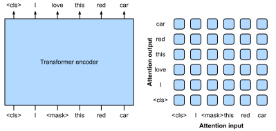
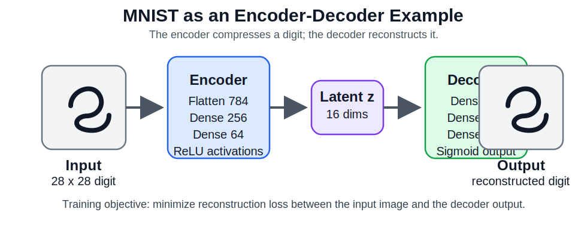

# Sequence Models and the Emergence of the Transformer

According to *Generative AI Foundations in Python*, modeling long-range dependencies required more sophisticated network architectures, leading to the use of RNNs. Recurrent Neural Networks process data sequences by iterating through each element while maintaining a dynamic internal state. This was further improved by Long Short-Term Memory (LSTM) networks, which applied a unique gating architecture to control the flow of information, maintaining and accessing information over long sequences without suffering from the vanishing gradient problem.

Concurrently, Convolutional Neural Networks (CNNs) were adapted for NLP to extract hierarchical features using convolutional layers over local n-gram windows. However, the true paradigm shift occurred in 2017 with the introduction of the Transformer architecture by Vaswani et al. The Transformer applied a self-attention mechanism, allowing each element in the input sequence to focus on distinct parts of the sequence, capturing dependencies regardless of their positions. This sequence-to-sequence learning model became the foundation for all modern generative language models.


```{python}
#| echo: false
#| eval: true
import matplotlib.pyplot as plt

def set_economist_theme():
    rc = {
        "font.family": "serif",
        "axes.titlesize": 14,
        "axes.titleweight": "bold",
        "axes.labelsize": 12,
        "axes.labelweight": "bold",
        "xtick.labelsize": 9,
        "ytick.labelsize": 9,
        "grid.color": "#d9d9d9",
        "grid.linewidth": 0.6,
        "axes.edgecolor": "#333333",
        "axes.linewidth": 0.8,
        "axes.spines.top": False,
        "axes.spines.right": False,
        "lines.linewidth": 1.0,
        "figure.figsize": (8, 4),
        "figure.dpi": 120,
        "legend.frameon": False,
    }

    try:
        import seaborn as sns
        sns.set_theme(context="talk", style="whitegrid", rc=rc)
    except ModuleNotFoundError:
        plt.rcParams.update(rc)
        plt.style.use("seaborn-v0_8-whitegrid")

set_economist_theme()
```

# A Brief History of Language Models {#sec-llm-history}

## From Text to Intelligence: The Language Modeling Imperative

Language is a prominent ability in human beings to express and communicate, which develops
in early childhood and evolves over a lifetime. Machines, however, cannot naturally grasp
the abilities of understanding and communicating in the form of human language, unless
equipped with powerful artificial intelligence (AI) algorithms. It has been a longstanding
research challenge to enable machines to read, write, and communicate like humans
[@turing-test].

Technically, **language modeling (LM)** is one of the major approaches to advancing
language intelligence of machines. In general, LM aims to model the generative likelihood
of word sequences, so as to predict the probabilities of future (or missing) tokens.
The research of LM has received extensive attention in the literature, which can be divided
into four major development stages [@zhao2023survey]:

- **Statistical language models (SLM)**. SLMs are developed based on **statistical
  learning** methods that rose in the 1990s. The basic idea is to build the word prediction
  model based on the Markov assumption — predicting the next word based on the most recent
  context. The SLMs with a fixed context length $n$ are also called $n$-gram language
  models (bigram, trigram). SLMs suffer from the *curse of dimensionality*: estimating
  high-order transition probabilities requires exponential sample size, so smoothing
  strategies (back-off, Good–Turing) were needed to alleviate data sparsity.

- **Neural language models (NLM)**. NLMs characterize the probability of word sequences
  by neural networks — MLP and RNNs. The seminal work of @Bengio-JMLR-2003-A introduced
  the concept of **distributed representation** of words and built word prediction
  conditioned on aggregated context features. word2vec [@Mikolov-NIPS-2013] further
  simplified this to a shallow network and demonstrated effective representations across
  NLP tasks. These studies initiated the use of language models for *representation
  learning*, beyond simple sequence modeling.

- **Pre-trained language models (PLM)**. ELMo [@Peters-NAACL-2018] captured
  context-aware word representations by pre-training a bidirectional LSTM and then
  fine-tuning for downstream tasks. BERT [@Devlin-NAACL-2019-BERT] extended this with the
  Transformer architecture and masked pre-training, establishing the **pre-training and
  fine-tuning** learning paradigm. A large number of follow-up models (GPT-2, BART,
  RoBERTa) were built on this foundation.

- **Large language models (LLM)**. Scaling PLMs in model size or data volume leads to
  improved capacity following the **scaling law** [@Kaplan-arxiv-2020-Scaling]. Large-sized
  PLMs (GPT-3 at 175B parameters; PaLM at 540B) display **emergent abilities** not seen in
  smaller models — most notably, **in-context learning** (solving new tasks from a handful
  of examples without gradient updates). These models are now general-purpose task solvers
  rather than task-specific tools.

## The Pivotal Shift: From Task-Specific to General-Purpose

From the perspective of task solving, the four generations of language models have
exhibited different levels of model capacity:

| Generation | Representative Models | Task Approach |
|---|---|---|
| SLM | n-gram, SRILM | Enhance task-specific pipelines (IR, ASR) |
| NLM | word2vec, fastText, ELMo | Learn task-agnostic representations |
| PLM | BERT, GPT-2, BART | Pre-train once, fine-tune per task |
| LLM | GPT-3, GPT-4, PaLM, LLaMA | General-purpose solver via prompting |

The key conceptual jump is from **language modeling** to **task solving** — and from
*training-time* adaptation (fine-tuning) to *inference-time* steering (prompting).
This is the paradigm shift we trace through Modules 3 and 4.


# Introduction: The Challenge of Sequential Data {#sec-sequential}

Language is inherently sequential. A sentence is not a bag of independent tokens — the
meaning of a word depends on what came before it (and sometimes after it). This simple
observation has deep consequences for model design.

When we moved from Modules 1–2 (bag-of-words, TF-IDF, static embeddings) to sequences,
we faced a new challenge: **how do we encode order and long-range dependencies?**

The approaches fall into a clear historical arc:

1. **N-gram models** — Markov assumption: only the last $n-1$ tokens matter.
2. **RNNs** — maintain a hidden state that summarizes all previous tokens.
3. **Attention mechanisms** — directly weight all prior tokens without a bottleneck.
4. **Transformers** — replace recurrence entirely with multi-head self-attention.

The rest of this lecture builds this arc from the ground up.








# From Recurrence to Attention {#sec-recurrence-to-attention}

## The RNN Bottleneck

RNNs process sequences token by token, updating a hidden state $h_t$ at each step:

$$
\begin{align}
h_t = f(x_t,\, h_{t-1})
\end{align}
$$

This design has two fundamental weaknesses:

1. **Sequential computation** — each step depends on the previous, so training cannot be
   parallelized across time steps. Long sequences become slow.
2. **Information bottleneck** — the entire history must be compressed into a fixed-size
   vector $h_t$. For long sequences, early tokens are increasingly hard to recall. This
   is the **vanishing gradient** problem.

LSTM and GRU cells mitigate (but do not eliminate) the vanishing gradient by adding gated
memory cells. But the bottleneck remains.

## Encoder-Decoder Models Before Attention

Encoder-decoder models extend the language modeling idea to **conditional generation**.
Instead of predicting the next token from only the previous output tokens, the decoder
also conditions on an encoded input.

{width=75% fig-align=center fig-alt="Generic encoder-decoder architecture mapping an input sequence into an encoded state and decoding an output sequence" #fig-ln-encoder-decoder}

The encoder reads a source sequence $x_1, \dots, x_S$ and produces a context
representation. The decoder generates the target sequence one token at a time:

$$
P(y_1, \dots, y_T \mid x_1, \dots, x_S)
= \prod_{t=1}^{T} P(y_t \mid y_1^{t-1}, \operatorname{Enc}(x_1^S)).
$$

This architecture is natural for translation, summarization, question answering over
documents, and many business workflows where an input artifact must be transformed into a
different output artifact.

## Sequence-to-Sequence with RNNs

{width=80% fig-align=center fig-alt="RNN sequence-to-sequence architecture for machine translation with beginning and end of sequence tokens" #fig-ln-seq2seq}

In the classical RNN version, the encoder transforms the input into hidden states
$h_1,\dots,h_S$ and often compresses them into a context variable $\mathbf{c}$:

$$
\begin{aligned}
h_j &= f(x_j, h_{j-1})\\
\mathbf{c} &= q(h_1,\dots,h_S)
\end{aligned}
$$

The decoder then behaves like a conditional language model:

$$
P(y_t \mid y_1^{t-1}, \mathbf{c}) = \operatorname{softmax}(V s_t + b).
$$

During training, we often use **teacher forcing**: the decoder receives the true previous
target token. At inference time, the decoder must feed its own previous prediction back
into the next step. Search strategies such as greedy search and beam search determine
which output sequence is selected.

## The Encoder-Decoder Bottleneck

The original encoder-decoder setup asks one fixed representation to carry everything the
decoder might need. That is a severe bottleneck for long inputs.

{width=45% fig-align=center fig-alt="Machine translation encoder-decoder diagram where the encoder state is provided to every decoder step" #fig-ln-decoder-conditioning}

Even if the encoder representation is passed to every decoding step, the decoder still
receives the **same** source summary while generating different target words. Human
translation is more selective: when producing a particular output word, we tend to focus
on the source words most relevant to that word.

## The Attention Insight

What if, instead of compressing history into a single vector, we allowed the model to
**directly access any past token** when processing the current one?

This is the attention mechanism. Given a **query** $q$ and a set of **key–value** pairs
$(k_i, v_i)$, attention computes a weighted sum of values:

$$
\begin{align}
\text{Attention}(q, K, V) = \sum_i \alpha_i \, v_i, \qquad
\alpha_i = \text{softmax}\!\left(\frac{q \cdot k_i}{\sqrt{d_k}}\right)
\end{align}
$$

The weights $\alpha_i$ measure how relevant each key $k_i$ is to the current query $q$.
The division by $\sqrt{d_k}$ prevents the dot products from growing too large in high
dimensions (scaled dot-product attention, @vaswani2017attention).

For encoder-decoder models, the same idea can be written in the notation of machine
translation. Let $s_{t-1}$ be the previous decoder state and $h_j$ be the encoder state
for the $j^{\text{th}}$ source token. The model computes an alignment score:

$$
e_{jt} = f_{\text{ATT}}(s_{t-1}, h_j)
$$

One common additive attention form is:

$$
e_{jt} = v_{\text{att}}^\top \tanh(U_{\text{att}}s_{t-1} + W_{\text{att}}h_j).
$$

The scores are normalized into attention weights:

$$
\alpha_{jt}
= \frac{\exp(e_{jt})}{\sum_{k=1}^{S}\exp(e_{kt})},
\qquad
c_t = \sum_{j=1}^{S}\alpha_{jt}h_j.
$$

{width=82% fig-align=center fig-alt="Attention mechanism showing encoder states, attention weights, context vector, and decoder update" #fig-ln-attention-mechanism}

The decoder now updates from both the previous target token and the time-specific context
vector:

$$
s_t = \operatorname{RNN}\!\left(s_{t-1}, [e(\hat{y}_{t-1}), c_t]\right).
$$

Attention therefore removes the fixed-vector bottleneck by letting the decoder retrieve
different source information at different output positions.

## Visualizing Attention

Attention weights can be plotted as heatmaps. These visualizations are useful because they
show whether the model has learned a plausible soft alignment between input tokens and
generated output tokens.

:::: {.columns}
::: {.column width="50%"}
{width=92% fig-align=center fig-alt="Attention heatmap from an attention-based summarization system" #fig-ln-attention-summarization}
:::

::: {.column width="50%"}
{width=92% fig-align=center fig-alt="Attention heatmap from an attention-based neural machine translation model" #fig-ln-attention-translation}
:::
::::

Each cell corresponds to an attention weight $\alpha_{jt}$: how much the decoder focuses
on source position $j$ while producing target position $t$.

## Multi-Head Attention

A single attention function may attend to one type of relationship. **Multi-head attention**
runs $H$ attention heads in parallel, each projecting queries, keys, and values into a
different subspace:

$$
\begin{align}
\text{MultiHead}(Q,K,V) = \text{Concat}(\text{head}_1, \ldots, \text{head}_H)\,W^O \\
\text{where} \quad \text{head}_i = \text{Attention}(Q W_i^Q,\, K W_i^K,\, V W_i^V)
\end{align}
$$

Different heads can learn to attend to syntactic structure, semantic similarity, coreference,
and long-range dependencies simultaneously.

## Why Attention Replaces Recurrence

| Property | RNN | Transformer (Self-Attention) |
|---|---|---|
| Long-range dependency | ✗ (degrades) | ✓ (direct path) |
| Parallel training | ✗ (sequential) | ✓ (all positions at once) |
| Constant path length | ✗ ($O(n)$) | ✓ ($O(1)$) |
| Memory per token | Fixed ($d_h$) | $O(n)$ (attention matrix) |

The trade-off is memory: transformers store an $n \times n$ attention matrix per layer,
which is expensive for very long sequences. Modern variants (FlashAttention, sparse
attention) address this.


# Transformers and the Attention Mechanism {#sec-transformers}

## The Transformer Timeline

The transformer architecture [@vaswani2017attention] introduced in 2017 ("Attention is
All You Need") revolutionized NLP and laid the groundwork for modern LLMs.

{width=80% fig-align=center fig-alt="Timeline of transformer-based models" #fig-timeline}

## Transformer Architecture

{width=80% fig-align=center fig-alt="Transformer architecture diagram" #fig-transformer-architecture}

The full Transformer stack (encoder + decoder) adds several key components beyond
multi-head attention:

- **Positional encoding** — since self-attention is order-agnostic, sinusoidal or learned
  position embeddings are added to the token embeddings.
- **Feed-forward sublayer** — a two-layer MLP applied position-wise after each attention
  block.
- **Layer normalization + residual connections** — stabilize training of deep stacks.
- **Masking** — encoder uses full bidirectional attention; decoder uses causal masking to
  prevent attending to future tokens.

```{python}
#| echo: false
#| eval: true
from pathlib import Path
import sys

repo_root = Path.cwd().resolve().parent
if str(repo_root) not in sys.path:
    sys.path.append(str(repo_root))

from utils.sequence_diagrams import (
    build_mnist_autoencoder_svg,
    build_rnn_language_model_svg,
)

build_rnn_language_model_svg(repo_root / "M3" / "M03_lecture01_figures" / "rnn1.svg")
build_mnist_autoencoder_svg(repo_root / "M3" / "M03_lecture01_figures" / "mnist_autoencoder.svg")
```

## Encoder and Decoder Models

Modern sequence models usually specialize one of three ways:

- **Encoder-only** models build rich contextual representations of the input.
- **Decoder-only** models generate the next token autoregressively.
- **Encoder-decoder** models first compress the input and then generate an output sequence.

That design choice is closely tied to the task: understanding, generation, or
sequence-to-sequence transformation.

## Decoder-Only Intuition from Language Modeling

:::: {.columns}
::: {.column width="52%"}
{width=96% fig-align=center fig-alt="Readable diagram of an RNN language model predicting one token at a time" #fig-rnn-architecture}
:::

::: {.column width="48%"}
- Decoder-style models predict the **next token** from the tokens that came before it.
- At time step $t$, the model estimates
  $$
  P(y_t \mid y_1, y_2, \dots, y_{t-1})
  $$
- The hidden state $s_t$ acts as a compressed summary of the prefix.
- GPT-style models keep this same autoregressive objective, but replace recurrence with
  masked self-attention.
- Strength: excellent for open-ended generation, chat, summarization, and code completion.
:::
::::

## Encoder-Only Models

:::: {.columns}
::: {.column width="50%"}
{width=92% fig-align=center fig-alt="Encoder-only transformer architecture" #fig-encoder-only}
:::

::: {.column width="50%"}
- Encoder-only models read the **entire input at once**.
- Because attention is bidirectional, each token can use both left and right context.
- The output is a contextual embedding for each input token, not a generated sequence.
- Typical uses:
  - sentiment classification
  - named entity recognition
  - retrieval and semantic search
- Example family: **BERT**.
:::
::::

## Decoder-Only Models

:::: {.columns}
::: {.column width="50%"}
{width=92% fig-align=center fig-alt="Decoder-only transformer architecture" #fig-decoder-only}
:::

::: {.column width="50%"}
- Decoder-only models are trained with a **causal mask**.
- Each position can attend only to earlier tokens, never future ones.
- This makes them natural next-token predictors:
  $$
  P(y_t \mid y_1^{t-1})
  $$
- Typical uses:
  - text generation
  - dialogue systems
  - code generation
- Example family: **GPT**.
:::
::::

## Encoder-Decoder Models

:::: {.columns}
::: {.column width="52%"}
{width=100% fig-align=center fig-alt="Encoder-decoder architecture transforming an input sequence into an output sequence" #fig-transformer-encoder-decoder}
:::

::: {.column width="48%"}
- The encoder converts the source input into a set of contextual representations.
- The decoder then generates the target sequence one token at a time.
- Cross-attention lets the decoder look back at the encoder outputs while generating.
- This is ideal when the input and output are **different sequences**.
- Typical uses:
  - translation
  - summarization
  - question answering over documents
- Example families: **T5**, **BART**, and the original Transformer.
:::
::::

In modern transformer encoder-decoder models, the decoder uses **cross-attention** over
the encoder outputs. This is the transformer version of the same attention idea introduced
above: at each generated token, the decoder can select the source information it needs
rather than relying on one fixed summary vector.

## A Simple MNIST Encoder-Decoder Example

:::: {.columns}
::: {.column width="54%"}
{width=100% fig-align=center fig-alt="MNIST autoencoder showing encoder, latent vector, and decoder" #fig-mnist-autoencoder}
:::

::: {.column width="46%"}
- A classic image example is an **autoencoder** trained on MNIST digits.
- The **encoder** compresses a $28 \times 28 = 784$ pixel image into a small latent vector.
- The **decoder** expands that latent vector back into a reconstructed image.
- Here, the target is not a sentence but the original image itself.
- This makes encoder-decoder ideas easy to visualize before moving back to text.
:::
::::

## MNIST Data and Model Sketch

:::: {.columns}
::: {.column width="50%"}
```{python}
from torchvision import datasets, transforms
from torch.utils.data import DataLoader

transform = transforms.ToTensor()
train_ds = datasets.MNIST(
    root="data",
    train=True,
    download=True,
    transform=transform,
)
train_loader = DataLoader(
    train_ds,
    batch_size=128,
    shuffle=True,
)
```
:::

::: {.column width="50%"}
```{python}
import torch.nn as nn

class MNISTAutoencoder(nn.Module):
    def __init__(self):
        super().__init__()
        self.encoder = nn.Sequential(
            nn.Flatten(),
            nn.Linear(784, 256), nn.ReLU(),
            nn.Linear(256, 64), nn.ReLU(),
            nn.Linear(64, 16)
        )
        self.decoder = nn.Sequential(
            nn.Linear(16, 64), nn.ReLU(),
            nn.Linear(64, 256), nn.ReLU(),
            nn.Linear(256, 784), nn.Sigmoid()
        )
```
:::
::::

## How the MNIST Encoder-Decoder Is Trained

:::: {.columns}
::: {.column width="55%"}
```{python}
model = MNISTAutoencoder()
criterion = nn.MSELoss()

for images, _ in train_loader:
    z = model.encoder(images)
    recon = model.decoder(z)
    recon = recon.view(-1, 1, 28, 28)
    loss = criterion(recon, images)
```
:::

::: {.column width="45%"}
- We ignore the class label and train on the image itself.
- The latent vector $z$ is a compressed representation of the digit.
- The decoder tries to reconstruct the original pixels from $z$.
- A low reconstruction loss means the encoder preserved the important structure.
- This is the same high-level pattern used in many generative systems:
  - compress information
  - operate in a latent space
  - decode back into the target output
:::
::::


## What's Next: Token Representations and Semantic Geometry

In Lecture 2 (M03_LN2) we move from *architecture* to *representation*: how do
transformers convert tokens into dense vectors that capture semantic meaning?

We will cover:

- Subword tokenization (BPE, WordPiece, SentencePiece) — how raw text becomes token IDs
- Static vs. contextual embeddings — word2vec vs. BERT-style representations
- Semantic geometry — cosine similarity, analogy arithmetic, clustering in embedding space
- Self-attention code demonstrations — computing attention weights from scratch


### References {.unnumbered}

::: {#refs}
:::

