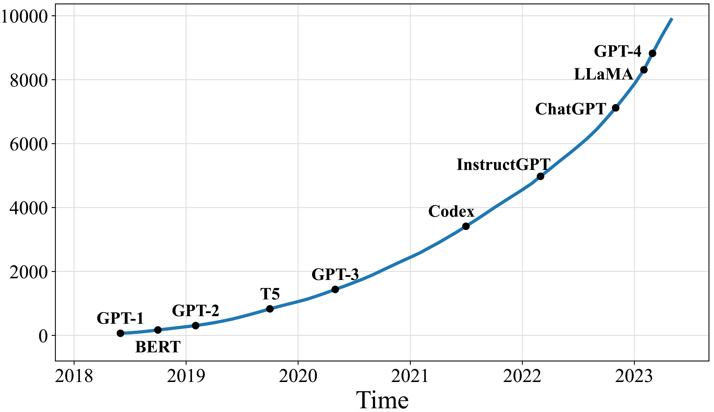
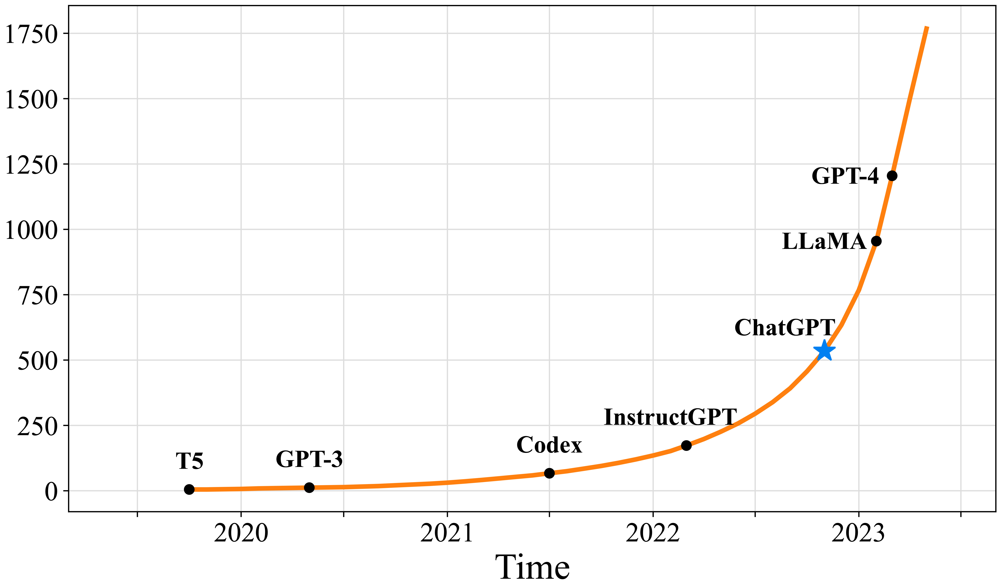

```{python}
#| echo: false
#| eval: true
import seaborn as sns
import matplotlib.pyplot as plt

def set_economist_theme():
    sns.set_theme(
        context="talk",
        style="whitegrid",
        rc={
            # Fonts
            "font.family": "serif",
            "axes.titlesize": 14,
            "axes.titleweight": "bold",
            "axes.labelsize": 12,
            "axes.labelweight": "bold",
            "xtick.labelsize": 9,
            "ytick.labelsize": 9,

            # Grid + Spines
            "grid.color": "#d9d9d9",
            "grid.linewidth": 0.6,
            "axes.edgecolor": "#333333",
            "axes.linewidth": 0.8,
            "axes.spines.top": False,
            "axes.spines.right": False,

            # Lines
            "lines.linewidth": 1.0,

            # Figure
            "figure.figsize": (8, 4),
            "figure.dpi": 120,

            # Legend
            "legend.frameon": False,
        }
    )
set_economist_theme()
```

# Introduction {#sec-introduction}

::: {.callout-note .right}
**“The limits of my language mean the limits of my world.”**  
*— Ludwig Wittgenstein*
:::


::: {#fig-paper-number layout-ncol=2}

{width=100%}

{width=100% fig-align="center" #fig-paper_number}

The trends of the cumulative numbers of arXiv papers that contain the keyphrases
*“language model”* (since June 2018) and *“large language model”* (since October 2019),
respectively. The statistics are calculated using exact match queries in titles or abstracts
by month. We set different x‑axis ranges for the two keyphrases because “language models”
have been explored earlier. We label points corresponding to important landmarks in the
research progress of LLMs. A sharp increase occurs after the release of ChatGPT: the average
number of published arXiv papers containing *“large language model”* in the title or abstract
goes from 0.40 per day to 8.58 per day.

:::

::: {#fig-task-solvers}

{width=90%}

An evolution process of the four generations of language models (LM) from the perspective
of task‑solving capacity. The time periods are approximate and based on publication dates
of representative studies. For neural language models, we abbreviate two representative
papers: NPLM (“A neural probabilistic language model”) and NLPS (“Natural language
processing (almost) from scratch”). Due to space limitations, not all representative studies
are listed.

:::


Language  is a prominent ability in human beings to express and communicate, which develops in early childhood and evolves over a lifetime [@instinct-book;@hauser-science-2002-faculty].  Machines, however, cannot naturally grasp the abilities of understanding and communicating in the form of human language, unless equipped with powerful artificial intelligence (AI) algorithms. It has been a longstanding research challenge to achieve this goal, to enable machines to read, write, and communicate like humans [@turing-test]. 


Technically, **language modeling (LM)** is one of the major approaches to advancing language intelligence of machines.  
In general, LM aims to model  the generative likelihood of word sequences, so as to predict the probabilities of future (or missing) tokens. 
The research of LM has received extensive attention in the literature, which can be divided into four major development stages:   


- **Statistical language models (SLM)**.  SLMs [@NLP-speech-book;@SLM-2004;@rosenfeld2000two;@stolcke2002srilm] are developed based on **statistical learning** methods that rose in the 1990s. The basic idea is to build the word prediction model based on the Markov assumption, for example, predicting the next word based on the most recent context. The SLMs with a fixed context length $n$ are also called $n$-gram language models, for example, bigram and trigram language models. SLMs have been widely applied to enhance task performance in information retrieval (IR) [@SLM-IR1;@SLM-IR2] and natural language processing (NLP) [@Thede-acl-1999-a;@bahl1989tree;@Brants-emnlp-2007-large].  
However, they often suffer from the curse of dimensionality: it is difficult to accurately estimate high-order language models since an exponential number of transition probabilities need to be  estimated. Thus, specially designed smoothing strategies such as back-off estimation [@Katz-IEEE-1987-estimation] and Good–Turing estimation [@Gale-JQL-1995-good] have been introduced to alleviate the data sparsity problem.


- **Neural language models (NLM)**. NLMs [@Bengio-JMLR-2003-A;@Mikolov-INTERSPEECH-2010;@Kombrink-INTERSPEECH-2011] characterize the probability of  word sequences by neural networks, for example, multi-layer perceptron (MLP) and recurrent neural networks (RNNs).   
As a remarkable contribution, the work in [@Bengio-JMLR-2003-A] introduced the concept of **distributed representation** of words and built the word prediction function conditioned on the aggregated context features (i.e. the distributed word vectors).  
By extending the idea of learning effective features for text data, a general neural network approach was developed to build a unified, end-to-end  solution for various NLP tasks [@Collobert-JMLR-2011]. Furthermore, word2vec [@Mikolov-NIPS-2013;@Mikolov-ICLR-2013] was proposed to build a simplified shallow neural network for learning distributed word representations, which were demonstrated to be very effective across a variety of NLP tasks. 
These studies have initiated the use of language models for representation learning (beyond word sequence modeling),  having  an important impact on the field of NLP.  
 
- **Pre-trained language models (PLM)**. As an early attempt,  ELMo [@Peters-NAACL-2018] was proposed to  capture  context-aware word representations by first pre-training a bidirectional LSTM (biLSTM)  network ({instead of learning fixed word representations}) and then fine-tuning the biLSTM network according to specific downstream tasks.  Furthermore, based on the highly parallelizable Transformer 
architecture [@Vaswani-NIPS-2017-Attention] with self-attention mechanisms, 
BERT [@Devlin-NAACL-2019-BERT] was proposed by  pre-training  bidirectional language models with specially designed pre-training tasks on large-scale unlabeled corpora.  These pre-trained context-aware word representations are very effective as general-purpose semantic features, which have largely raised the performance bar of NLP tasks. This study has inspired a large number of follow-up work, which sets the **pre-training** and **fine-tuning** learning paradigm. 
Following this paradigm, a great number of studies on PLMs have been developed, introducing either different architectures [@Lewis-ACL-2020-BART;@Fedus-JMLR-2021-Switch] (for example, GPT-2 [@radford-blog-2019-language] and BART [@Lewis-ACL-2020-BART]) or improved pre-training strategies [@Liu-CoRR-2019-RoBERTa;@Sanh-ICLR-2022-Multitask;@Wang-ICML-2022-What]. In this paradigm, it often requires fine-tuning the PLM for adapting to different downstream tasks.  

- **Large language models (LLM)**. Researchers find that scaling PLM (for example, scaling model size or data size)  often leads to an improved model capacity on downstream tasks (i.e. following the scaling law [@Kaplan-arxiv-2020-Scaling]). A number of studies have explored the performance limit by training an ever larger PLM (for example, the 175B-parameter GPT-3 and the 540B-parameter PaLM). Although scaling is mainly conducted in model size (with similar architectures and pre-training tasks), these large-sized PLMs display different behaviors from smaller PLMs (for example, 330M-parameter BERT and 1.5B-parameter GPT-2) and show surprising abilities (called **emergent abilities** [@Wei-arxiv-2022-Emergent]) in solving a series of complex tasks. 
For example, GPT-3 can  solve few-shot tasks through **in-context learning**, whereas GPT-2 cannot do well. 
Thus, the research community coins the  term  **large language models (LLM)** for these large-sized PLMs [@Shanahan-arxiv-2022-Talking;@Wei-arxiv-2022-chain;@Hoffmann-arxiv-2022-Training;@Taylor-arxiv-2022-Galactica], which attract increasing research attention (See @fig-paper_number). 
A remarkable application of LLMs is **ChatGPT** that adapts the LLMs from the GPT series for dialogue, which presents an amazing conversation ability with humans. We can observe a sharp increase of the  arXiv papers that are related to LLMs after the release of ChatGPT in Figure @fig-paper-number.

As discussed before, language model is not a new technical concept specially for LLMs, but has evolved with the advance of artificial intelligence over the decades. Early language models mainly aim to model and generate text data, while latest language models (for example, GPT-4) focus on  **complex task solving**. From **language modeling** to **task solving**, it is an important leap in scientific thinking, which is the key to understand the development of   language models in the research history. 
From the perspective of task solving, the four generations of language models have exhibited different levels of model capacities.  
  In Figure @fig-task-solvers, we describe the  evolution  process  of language models in terms of the task solving capacity.
At first, statistical language models mainly assisted in some specific tasks (for example, retrieval or speech tasks), in which the predicted or estimated probabilities can enhance the performance of task-specific approaches.
Subsequently, neural language models focused on learning task-agnostic representations (for example, features), aiming  to reduce the efforts for human feature engineering. Furthermore, pre-trained language models  learned context-aware representations that can be optimized according to downstream  tasks. For the latest generation of language model, LLMs are enhanced by exploring the scaling effect on model capacity, which can be considered as   general-purpose task solvers. To summarize, in the evolution process, the task scope that can be solved by language models have been greatly extended, and the task performance attained by language models have been significantly enhanced. 

In the existing literature, PLMs have been widely discussed and surveyed [@Liu-survey-2023-Pre-train;@Zhou-arxiv-2023-A;@Han-AIopen-2021-PTM;@qiu-CoRR-2020-PTM], while LLMs are seldom reviewed in a systematic way. To  motivate our survey, we first highlight three major differences between LLMs and PLMs. 
First, LLMs display some surprising emergent abilities that may not be observed in previous smaller  PLMs. These abilities are key to the performance of language models on complex tasks, making AI algorithms unprecedently powerful and effective.   
Second, LLMs would  revolutionize  the way that humans  develop and use AI algorithms.    
Unlike small PLMs, the major approach to accessing LLMs is  through the prompting interface (for example, GPT-4 API). Humans have to understand how LLMs work and format their tasks in a way that LLMs can follow.   
Third, the development of LLMs no longer draws a clear distinction between research and engineering. The training of LLMs requires extensive  practical experiences in large-scale data processing and distributed parallel training.  
To develop capable LLMs, researchers have to solve complicated engineering issues, working with engineers or being engineers. 

Nowadays,  LLMs are posing a significant impact on the AI community, and the advent of ChatGPT and GPT-4 leads to the rethinking of the possibilities of artificial general intelligence (AGI). OpenAI has published a technical article entitled **Planning for AGI and beyond**, which discusses the short-term and long-term plans to approach  AGI [@OpenAI-blog-2023-Planning], and a more recent paper has argued that GPT-4 might be considered as an early version of an AGI system [@Bubeck-arxiv-2023-Sparks]. 
The research areas of AI are being revolutionized by the rapid progress of LLMs. 
In the field of NLP,  LLMs can serve as a general-purpose  language task solver (to some extent), and  the research paradigm has been shifting towards the use of LLMs. 
In the field of IR, traditional search engines are challenged by the new information seeking way through AI chatbots (i.e. ChatGPT), and  \emph{New Bing}\footnote{https://www.bing.com/new} presents an initial attempt that enhances  the search results based on LLMs. 
In the field of  CV, the researchers  try to develop ChatGPT-like vision-language models that can better serve multimodal dialogues [@Huang-CoRR-2023;@Cao-arxiv-2023-comprehensive;@driess-arxiv-2023-palm;@wu-arxiv-2023-visual], and  GPT-4 [@OpenAI-OpenAI-2023-GPT-4] has  supported multimodal input by integrating the visual information.  
This new wave of technology would potentially lead to a prosperous
 ecosystem of real-world applications based on LLMs. 
For instance, Microsoft 365  is being empowered by  LLMs (i.e. Copilot) to automate the office work, and OpenAI supports the use of   plugins in ChatGPT for implementing special functions.  


Despite the  progress and impact,  the underlying principles of LLMs are still not well explored. Firstly, it is  mysterious   why emergent abilities occur in  LLMs,   instead of smaller PLMs. As a more general issue, there  lacks a deep, detailed investigation of the key factors that contribute to the superior abilities of LLMs. 
It is important to study when and how LLMs obtain such abilities [@FU-blog-2022-how]. Although there are some meaningful discussions about this problem [@Wei-arxiv-2022-Emergent;@FU-blog-2022-how], more principled investigations are needed to uncover the **secrets** of LLMs. 
Secondly, it is difficult for the research community to train capable LLMs.  
Due to the huge demand of computation resources, it is very costly to carry out repetitive, ablating studies for investigating the effect of various strategies for training LLMs. 
Indeed,  LLMs are mainly trained by industry, where many important training details (for example, data collection and cleaning) are not revealed to the public. 
Thirdly, it is  challenging to align LLMs with human values or preferences. Despite the capacities, LLMs are also likely to produce toxic, fictitious, or harmful contents. It requires effective and efficient control approaches  to  eliminating the potential risk of the use of LLMs [@OpenAI-OpenAI-2023-GPT-4].  

Faced with both opportunities and challenges, it needs more  attention on the research and development of LLMs. 

# Language Models {#sec-language-model}



# Recurrent Neural Networks {#sec-rnn}



# Self-Attention: Code Demonstrations

## Scaled Dot-Product Attention in PyTorch

The core attention operation: each token queries every other token for relevant information.

```{python}
#| eval: false
import torch
import torch.nn as nn
import torch.nn.functional as F
import matplotlib.pyplot as plt
import numpy as np

def scaled_dot_product_attention(Q, K, V):
    """
    Q, K, V: (batch, seq_len, d_k)
    Returns: output (batch, seq_len, d_k), weights (batch, seq_len, seq_len)
    """
    d_k = Q.shape[-1]
    scores = torch.bmm(Q, K.transpose(1, 2)) / (d_k ** 0.5)  # (B, T, T)
    weights = F.softmax(scores, dim=-1)
    output = torch.bmm(weights, V)                              # (B, T, d_k)
    return output, weights

# Demo: 1 batch, 6 tokens, d_k=8
torch.manual_seed(0)
B, T, d_k = 1, 6, 8
Q = torch.randn(B, T, d_k)
K = torch.randn(B, T, d_k)
V = torch.randn(B, T, d_k)

output, attn_weights = scaled_dot_product_attention(Q, K, V)
print(f"Input  shape: {Q.shape}")
print(f"Output shape: {output.shape}")
print(f"Attention weights shape: {attn_weights.shape}")

# Visualise the attention map
tokens = ["The", "model", "attends", "to", "each", "token"]
fig, ax = plt.subplots(figsize=(6, 5))
im = ax.imshow(attn_weights[0].detach().numpy(), cmap="Blues", vmin=0, vmax=1)
ax.set_xticks(range(T)); ax.set_xticklabels(tokens, rotation=45, ha="right")
ax.set_yticks(range(T)); ax.set_yticklabels(tokens)
ax.set_title("Attention Weight Matrix (single head)")
plt.colorbar(im, ax=ax)
plt.tight_layout()
plt.show()
```

## Multi-Head Attention with nn.MultiheadAttention

PyTorch's built-in MHA lets us quickly explore how multiple attention heads learn different patterns in a sequence.

```{python}
#| eval: false
# Toy sequence: 6 tokens of dimension 16, 2 heads
embed_dim = 16
num_heads  = 2
seq_len    = 6

mha = nn.MultiheadAttention(embed_dim=embed_dim, num_heads=num_heads, batch_first=True)

torch.manual_seed(42)
x = torch.randn(1, seq_len, embed_dim)           # (batch=1, seq, embed)
attn_out, attn_wt = mha(x, x, x)                  # self-attention: Q=K=V=x

print(f"Output:          {attn_out.shape}")         # (1, 6, 16)
print(f"Attention weight: {attn_wt.shape}")         # (1, 6, 6) averaged over heads

# Heatmap of averaged attention weights
fig, ax = plt.subplots(figsize=(5, 4))
ax.imshow(attn_wt[0].detach().numpy(), cmap="Oranges")
ax.set_title("MultiheadAttention (heads averaged)")
ax.set_xlabel("Key position"); ax.set_ylabel("Query position")
plt.tight_layout()
plt.show()
```

## Semantic Similarity with Cosine Distance

Contextual embeddings encode meaning as geometry — semantically similar inputs produce similar vectors.

```{python}
#| eval: false
import torch.nn.functional as F

# Simulate contextual embeddings (e.g. from a transformer encoder last layer)
torch.manual_seed(7)
embed_dim = 64

# Three pairs: similar, partially similar, unrelated
phrases = {
    "revenue growth":       torch.randn(embed_dim),
    "sales increase":       None,   # will be constructed as near-copy
    "net income":           torch.randn(embed_dim),
    "operating profit":     None,
    "regulatory risk":      torch.randn(embed_dim),
    "weather forecast":     torch.randn(embed_dim),  # unrelated
}

# Make "sales increase" close to "revenue growth"
phrases["sales increase"]   = phrases["revenue growth"] + 0.1 * torch.randn(embed_dim)
phrases["operating profit"] = phrases["net income"]     + 0.15 * torch.randn(embed_dim)

keys   = list(phrases.keys())
embeds = torch.stack(list(phrases.values()))           # (6, 64)
embeds = F.normalize(embeds, dim=-1)                   # unit-norm

sim_matrix = embeds @ embeds.T                         # cosine similarity matrix

print(f"{'Pair':<40} {'Cosine Sim':>12}")
print("-" * 55)
for i in range(len(keys)):
    for j in range(i + 1, len(keys)):
        sim = sim_matrix[i, j].item()
        print(f"{keys[i]:<18} ↔  {keys[j]:<18} {sim:>8.3f}")
```
