## How to print Revealjs slides

{width="80%" fig-align="center"}

# Why Start With Reasoning Models?

## Reasoning Models as the New User Expectation

Recent LLM systems are often judged not only by whether they answer, but by whether they can:

- break complex tasks into smaller steps
- explain or expose a defensible path to the answer
- revise a mistake when challenged
- call tools when text prediction is not enough
- separate evidence from speculation

This creates a useful starting question for the course:

> What turns a fluent text generator into a useful reasoning system?

## Reasoning Is More Than Remembering

Reasoning-oriented LLM behavior is not the same as memorization or retrieval.

| Capability | What the model is doing | Example course connection |
|---|---|---|
| Remembering | recalling likely facts or patterns | pretraining knowledge |
| Retrieving | looking up external evidence | RAG and vector search |
| Reasoning | transforming information across steps | prompting, tools, agents |
| Verifying | checking whether the output is supported | evaluation and auditability |

The important point: reasoning is a **system behavior**, not just a model property.

## How Reasoning Behavior Is Induced

Reasoning models usually combine several design patterns:

- **chain-of-thought style prompting** for stepwise decomposition
- **self-consistency** for comparing multiple solution paths
- **tree or graph search** for exploring alternatives
- **tool use** for search, calculation, data access, or code execution
- **post-training feedback** that rewards better final answers or better intermediate steps

Source framing: [Labellerr, "LLMs & Reasoning Models: How They Work and Are Trained"](https://www.labellerr.com/blog/llms-reasoning-models-how-they-work/).

## Why This Belongs Before the Basics

Reasoning models can look magical from the outside.

This module works backward from that experience:

1. prompts steer behavior at inference time
2. language models generate one token at a time
3. attention lets context shape each prediction
4. embeddings make semantic similarity computable
5. retrieval, tools, and agents extend what the model can do

So we begin with the visible product: **reasoning behavior**.

Then we unpack the machinery that makes it possible.

# The Shift to Prompt-Based Approaches

## From Training-Centric AI to Inference-Centric AI

Traditional ML paradigm:

- Model behavior determined primarily during [training]{.uublue-bold}
- Deployment phase largely **static**
- Adaptation requires:
  - retraining
  - fine-tuning
  - feature redesign

Large Language Model paradigm:

- Model behavior can be **modified at inference time**
- Adaptation occurs through:
  - prompts
  - context
  - task specification

This represents a **fundamental architectural shift** in AI systems.

## Classical Learning vs Generative Conditioning

- Classical supervised learning: $y = f_\theta(x)$
- Behavior changes require updating $\theta$ through training.
- Generative language models: $P(Y \mid X, \theta)$
- Prompt-based control introduces: $P(Y \mid X, p, \theta)$
- Prompting modifies [inference distribution]{.uured-bold}, not model weights.


## Prompt as an Inference-Time Control Signal

A prompt functions as:

- a conditioning signal
- a soft constraint
- a semantic policy
- a probabilistic steering mechanism

Implications:

- rapid task adaptation
- reduced need for retraining
- dynamic behavior shaping
- interactive AI workflows

---


## Prompt Engineering, Fine-tuning, and RAG

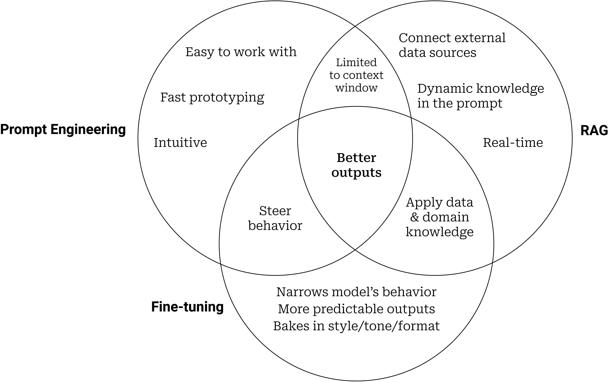{width=60% fig-align=center fig-alt="Venn diagram showing the relationship between prompt engineering, fine-tuning, and RAG" #fig-venn-diagram}

---

## Why Prompting Works

- Prompting works because LLMs are:
  - trained on diverse linguistic patterns
  - capable of contextual reasoning
  - sensitive to semantic structure
  - internally structured via attention mechanisms
- Prompting activates **latent capabilities** rather than creating new ones.


# Encoder and Decoder Models

## Encoder-Decoder Models

:::: {.columns}
::: {.column width="50%"}
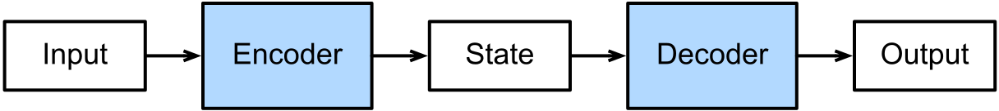{width=95% fig-align=center fig-alt="Generic encoder-decoder architecture mapping an input sequence into an encoded state and decoding an output sequence" #fig-encoder-decoder}
:::

::: {.column width="50%"}
- An **encoder** reads the input and builds a representation.
- A **decoder** generates the output, usually one token at a time.
- This lets us model tasks where:
  - input and output lengths differ
  - alignment is not known in advance
  - the output depends on both the input and previous outputs
- The decoder is a **conditional language model**.
:::
::::

## Why Encoder-Decoder Models Matter

- Many business AI tasks are not simple classification problems.
- They are **input-to-output generation** problems:
  - document $\rightarrow$ summary
  - question + context $\rightarrow$ answer
  - image $\rightarrow$ caption
  - customer request $\rightarrow$ response draft
  - source language $\rightarrow$ target language
- Encoder-decoder models gave neural networks a reusable pattern for these transformations.

## Encoder-Decoder as Conditional Generation

The model estimates a conditional sequence distribution:

$$
P(y_1, \dots, y_T \mid x_1, \dots, x_S)
= \prod_{t=1}^{T} P(y_t \mid y_1^{t-1}, \operatorname{Enc}(x_1^S)).
$$

- The encoder compresses or organizes the source information.
- The decoder uses that information plus the partial output history.
- If we remove the encoder, the decoder becomes an ordinary language model.

## Two Design Choices

:::: {.columns}
::: {.column width="50%"}
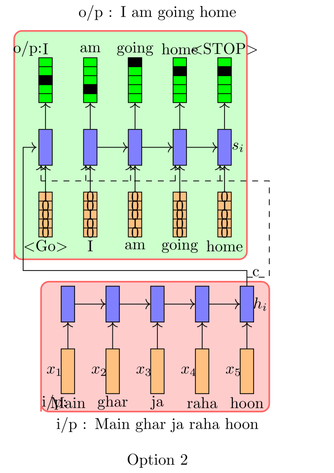{width=90% fig-align=center fig-alt="Machine translation encoder-decoder diagram where the encoder state initializes the decoder" #fig-translation-option-1}
:::

::: {.column width="50%"}
{width=90% fig-align=center fig-alt="Machine translation encoder-decoder diagram where the encoder state is provided to every decoder step" #fig-translation-option-2}
:::
::::

- Use the encoder output once to initialize the decoder state.
- Or feed the encoder output to each decoding step.
- Attention and transformers generalize this second idea.

## Language Modeling with RNNs

:::: {.columns}
::: {.column width="50%"}
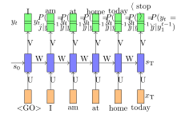{width=85% fig-align=center fig-alt="Diagram of a simple RNN architecture" #fig-rnn-architecture}

:::

::: {.column width="50%"}
- We will start by revisiting the problem of language modeling.
- Informally, given $t-1$ words, we are interested in predicting the $t^{\text{th}}$ word.
- More formally, given $y_1, y_2, \dots, y_{t-1}$, we want to find
  $$
  y^* = \arg\max P(y_t \mid y_1, y_2, \dots, y_{t-1})
  $$

- Let us see how we model $P(y_t \mid y_1, y_2, \dots, y_{t-1})$ using an RNN.
- We will refer to $P(y_t \mid y_1, y_2, \dots, y_{t-1})$ using the shorthand notation:

  $$
  P(y_t \mid y_1^{t-1})
  $$

:::
::::


## RNN Probability Computation

:::: {.columns}
::: {.column width="50%"}
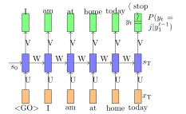{width=85% fig-align=center fig-alt="Diagram of RNN probability computation" #fig-rnn-probability}

:::

::: {.column width="50%"}
::: {.incremental}
- We are interested in

  $$
  P(y_t = j \mid y_1, y_2, \dots, y_{t-1})
  $$

  where $j \in V$ and $V$ is the set of all vocabulary words.

- Using an RNN, we compute this as

  $$
  P(y_t = j \mid y_1^{t-1}) = \operatorname{softmax}(V s_t + c)_j
  $$

- In other words, we compute

  $$
  \begin{aligned}
  P(y_t = j \mid y_1^{t-1}) &= P(y_t = j \mid s_t) \\
  &= \operatorname{softmax}(V s_t + c)_j
  \end{aligned}
  $$

- Notice that the recurrent connections ensure that $s_t$ has information about $y_1^{t-1}$.
:::
:::
::::


## Training an RNN Language Model

:::: {.columns}
::: {.column width="50%"}
:::{.callout-note}
**Data:** India, officially the Republic of India, is a country in South Asia. It is the seventh-largest country by area, ..... 
:::
:::

::: {.column width="50%"}
::: {.incremental}
- **Data:** All sentences from any large corpus (say Wikipedia).

- **Model:**

  $$
  \begin{aligned}
  s_t &= \sigma(W s_{t-1} + U x_t + b) \\
  P(y_t = j \mid y_1^{t-1}) &= \operatorname{softmax}(V s_t + c)_j
  \end{aligned}
  $$

- **Parameters:** $U, V, W, b, c$

- **Loss:**

  $$
  \begin{aligned}
  \mathcal{L}(\theta) &= \sum_{t=1}^{T} \mathcal{L}_t(\theta) \\
  \mathcal{L}_t(\theta) &= - \log P(y_t = \ell_t \mid y_1^{t-1})
  \end{aligned}
  $$

  where $\ell_t$ is the true word at time step $t$.
:::
:::
::::


## What Is the Input at Each Time Step?

:::: {.columns}
::: {.column width="50%"}

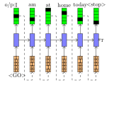{width=84% fig-align=center fig-alt="Diagram showing the input at each time step in an RNN" #fig-rnn-input}

:::

::: {.column width="50%"}
- What is the input at each time step?
- It is simply the word that we predicted at the previous time step.
- In general,

  $$
  s_t = \operatorname{RNN}(s_{t-1}, x_t)
  $$

- Let $j$ be the index of the word assigned the maximum probability at time step $t-1$.

  $$
  x_t = e(v_j)
  $$

- $x_t$ is essentially a one-hot vector, $e(v_j)$, representing the $j^{\text{th}}$ word in the vocabulary.

- In practice, instead of a one-hot representation, we use a pre-trained word embedding of the $j^{\text{th}}$ word.
:::
::::


---

## Initial Hidden State

:::: {.columns}
::: {.column width="50%"}
{width=80% fig-align=center fig-alt="Diagram of RNN probability computation" #fig-rnn-probability}

:::

::: {.column width="50%"}
- Notice that $s_0$ is not computed but instead randomly initialized.

- We learn it along with the other parameters of the RNN
  (or LSTM or GRU).

- We will return to this later.
:::
::::

---

## Compact Recurrent Notation

Before moving on, it is useful to write the functions computed by
RNNs, GRUs, and LSTMs in a compact form.

We will use these notations going forward.

## Compact Form: RNN

:::: {.columns}
::: {.column width="45%"}
$$
\begin{align}
s_t &= \sigma(U x_t + W s_{t-1} + b)\\
s_t &= \operatorname{RNN}(s_{t-1}, x_t)
\end{align}
$$
:::

::: {.column width="55%"}
- A standard RNN updates its hidden state using:

  - the current input $x_t$
  - the previous hidden state $s_{t-1}$

- This compact notation emphasizes that the hidden state is a function of:

  $$
  (s_{t-1}, x_t)
  $$

- We will use this shorthand repeatedly in later derivations.
:::
::::

## Compact Form: Gated Recurrent Unit (GRU)


:::: {.columns}
::: {.column width="55%"}
$$
\begin{align}
\tilde{s_t} &= \sigma\!\left(W (o_t \odot s_{t-1}) + U x_t + b\right)\\
s_t &= i_t \odot s_{t-1} + (1 - i_t) \odot \tilde{s_t}\\
s_t &= \operatorname{GRU}(s_{t-1}, x_t)
\end{align}
$$

:::

::: {.column width="45%"}
- A GRU modifies the standard recurrent update with gating.
- These gates regulate how much past information is preserved and how much new information is incorporated.
- In compact form, we treat the whole gated update as:

  $$
  \operatorname{GRU}(s_{t-1}, x_t)
  $$
:::
::::


## Compact Form: LSTM

:::: {.columns}
::: {.column width="58%"}
$$
\begin{align}
\tilde{s_t} &= \sigma(W h_{t-1} + U x_t + b)\\
s_t &= f_t \odot s_{t-1} + i_t \odot \tilde{s_t}\\
h_t &= o_t \odot \sigma(s_t)\\
h_t, s_t &= \operatorname{LSTM}(h_{t-1}, s_{t-1}, x_t)
\end{align}
$$
:::

::: {.column width="42%"}
- The LSTM maintains two recurrent quantities:
  - the cell state $s_t$
  - the hidden state $h_t$
- This allows the model to preserve long-range information more effectively than a standard RNN.
- In compact notation, the update is written as:

  $$
  (h_t, s_t) = \operatorname{LSTM}(h_{t-1}, s_{t-1}, x_t)
  $$

:::
::::


## From RNN Language Models to Sequence-to-Sequence

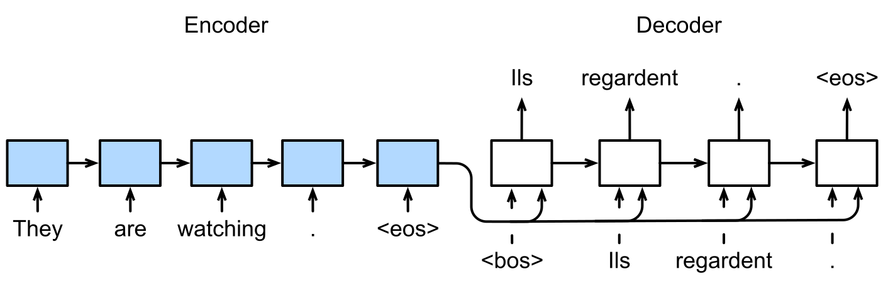{width=78% fig-align=center fig-alt="RNN sequence-to-sequence architecture for machine translation with beginning and end of sequence tokens" #fig-d2l-seq2seq}

- The encoder RNN reads $x_1, \dots, x_S$ and produces a context variable $\mathbf{c}$.
- The decoder RNN predicts $y_t$ from $\mathbf{c}$ and the previous target tokens.
- Special tokens such as `<bos>` and `<eos>` mark the beginning and end of generation.

## Encoder and Decoder Interfaces

:::: {.columns}
::: {.column width="50%"}
**Encoder**

$$
\begin{aligned}
h_t &= f(x_t, h_{t-1})\\
\mathbf{c} &= q(h_1, \dots, h_S)
\end{aligned}
$$

- Takes variable-length input.
- Returns encoded states or a context variable.
:::

::: {.column width="50%"}
**Decoder**

$$
P(y_t \mid y_1^{t-1}, \mathbf{c})
= \operatorname{softmax}(V s_t + b)
$$

- Initializes state from encoder output.
- Generates one target token distribution per step.
:::
::::

## Layers in an RNN Encoder-Decoder

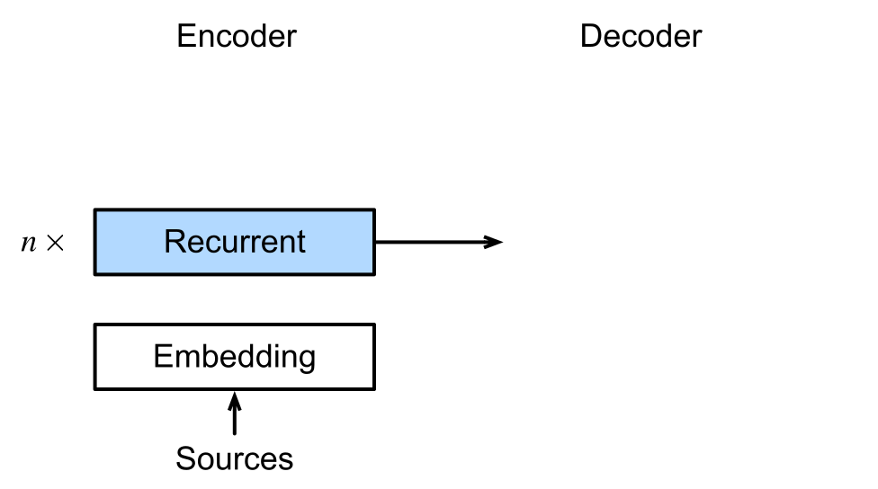{width=74% fig-align=center fig-alt="Detailed RNN encoder-decoder layers with embeddings, recurrent layers, and output projection" #fig-d2l-seq2seq-details}

- The source sequence is embedded and passed through an encoder RNN.
- The target-side decoder receives shifted target tokens during training.
- The output layer maps decoder states into vocabulary probabilities.

## Teacher Forcing

- During training, the decoder usually receives the **true previous target token**.
- The decoder input is shifted right:

$$
\langle bos \rangle,\; y_1,\; y_2,\; \dots,\; y_{T-1}
\quad \rightarrow \quad
y_1,\; y_2,\; \dots,\; y_T,\; \langle eos \rangle
$$

- This is efficient and stable because every decoding step gets the correct history.
- At inference time, the model must use its own previous predictions.

## Prediction at Test Time

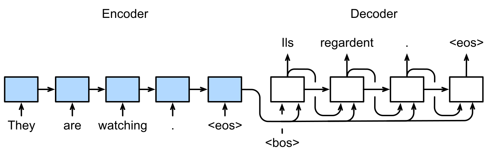{width=78% fig-align=center fig-alt="RNN encoder-decoder prediction process where each generated token is fed into the next decoder step" #fig-d2l-seq2seq-predict}

- Start with `<bos>`.
- Predict the next token distribution.
- Feed the selected token back into the decoder.
- Stop when the model emits `<eos>` or a maximum length is reached.

## Greedy Search and Beam Search

:::: {.columns}
::: {.column width="52%"}
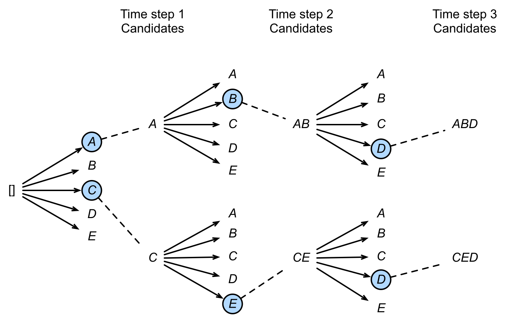{width=95% fig-align=center fig-alt="Beam search diagram showing candidate output sequences retained across decoding steps" #fig-d2l-beam-search}
:::

::: {.column width="48%"}
- **Greedy search:** keep only the most likely token at each step.
- **Beam search:** keep the top $k$ partial sequences.
- Larger beams explore more candidates but cost more computation.
- Greedy search is beam search with $k = 1$.
:::
::::

## Guiding Questions for Sequence Modeling Tasks

- What kind of network can we use to encode the input(s)?  
- What kind of a network can we use to decode the output?  
- What are the parameters of the model?
- What is an appropriate loss function?

---

## Example: Image Captioning

{width=75% fig-align=center fig-alt="Image of a dog captioned 'good doggo'" #fig-image-captioning}

## Example: Image Captioning

- **Algorithm:** Gradient descent with backpropagation
- **Model:**
  - **Encoder:**
    $$
    s_0 = \operatorname{CNN}(x_i)
    $$

  - **Decoder:**
   
    $$
    \begin{align}
    s_t &= \operatorname{RNN}(s_{t-1}, e(\hat{y}_{t-1}))\\
    P(y_t \mid y_1^{t-1}, I) &= \operatorname{softmax}(V s_t + b)
    \end{align}
    $$

- **Parameters:**  
  $$
  U_{\text{dec}},\; V,\; W_{\text{dec}},\; W_{\text{conv}},\; b
  $$

- **Loss:**
  $$
  \begin{align}
  \mathcal{L}(\theta)& =\sum_{t=1}^{T} \mathcal{L}_t(\theta) = - \sum_{t=1}^{T} \log P(y_t = \ell_t \mid y_1^{t-1}, I)
  \end{align}
  $$


## Image Captioning 

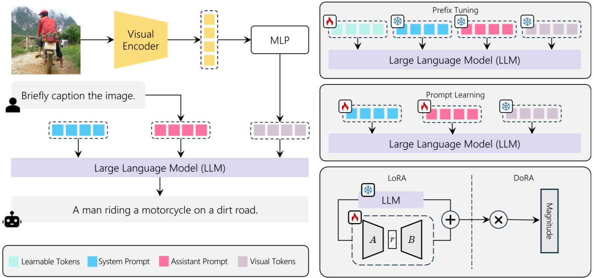{width=80% fig-align=center fig-alt="Diagram of an image captioning model using a large language model" #fig-image-captioning-llm}

## Other Tasks

- Textual entailment
- Machine translation
- Transliteration (e.g., English to Hindi)
- Image generation from text
- Code generation from text
- Speech recognition
- etc.


# Attention Mechanisms

## Why Do We Need Attention?

:::: {.columns}
::: {.column width="45%"}
{width=80% fig-align=center fig-alt="Diagram illustrating the machine translation process" #fig-machine-translation}

:::

::: {.column width="55%"}
- Let us motivate the task of attention with the help of machine translation.
- The encoder reads the source sentence only once and produces an encoding.
- At each time step, the decoder uses this encoding to produce a new word.
- But is this how humans translate a sentence? [Not really]{.uured-bold}.
:::
::::

---

## Human Intuition Behind Attention

:::: {.columns}
::: {.column width="50%"}

**Output:** I am going home
$$
\begin{align}
t_1 : [1,\;0,\;0,\;0,\;0]\\
t_2 : [0,\;0,\;0,\;0,\;1]\\
t_3 : [0,\;0,\;0.5,\;0.5,\;0]\\
t_4 : [0,\;1,\;0,\;0,\;0]
\end{align}
$$

**Input:** Main ghar ja raha hoon

:::

::: {.column width="50%"}
- Humans often produce each output word by focusing only on certain words in the input.
- At each time step, we can think of the translator as forming a distribution over the input words.
- This distribution tells us how much attention to pay to each input word at that time step.
- Ideally, the decoder should receive primarily the relevant information, rather than the entire source representation uniformly.
:::
::::

---

## Tiny Translation Walkthrough

| Source | Target | Likely alignment |
|---|---|---|
| The small robot opens the red door. | Der kleine Roboter öffnet die rote Tür. | adjective-noun pairs stay close |
| The analyst reviews the quarterly revenue report. | La analista revisa el informe trimestral de ingresos. | business noun phrase expands |

- The decoder should not use the same source summary for every target word.
- For *robot* / *Roboter*, attention should concentrate on the noun.
- For *quarterly revenue report*, attention may spread over a phrase because the target language expresses the concept differently.

## Attention as Learned Relevance

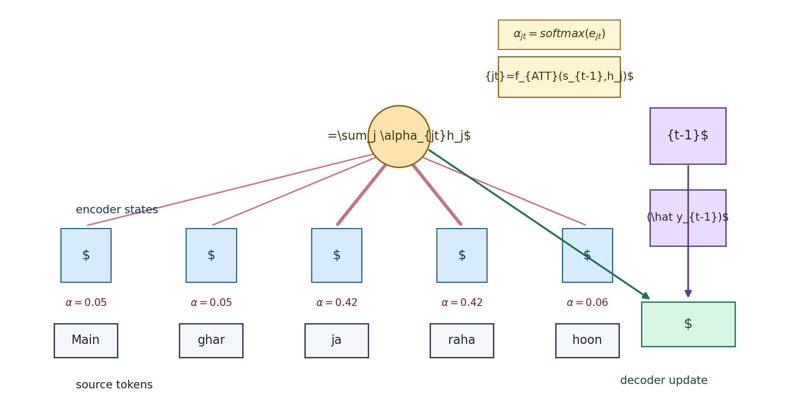{width=82% fig-align=center fig-alt="Attention mechanism showing encoder states, attention weights, context vector, and decoder update" #fig-attention-mechanism}

- At each decoder step $t$, the model decides which encoder states matter.
- The attention weights form a distribution over source positions.
- The decoder receives a context vector built from the relevant source states.

## Attention Scores

Let $s_{t-1}$ be the previous decoder state and $h_j$ be the encoder state for the $j^{\text{th}}$ source token.

The model first computes an **alignment score**:

$$
e_{jt} = f_{\text{ATT}}(s_{t-1}, h_j)
$$

One common additive attention form is:

$$
e_{jt} = v_{\text{att}}^\top \tanh(U_{\text{att}} s_{t-1} + W_{\text{att}} h_j)
$$

- $e_{jt}$ measures how useful source position $j$ is for producing target token $t$.
- $U_{\text{att}}$, $W_{\text{att}}$, and $v_{\text{att}}$ are learned with the rest of the model.

## Attention Weights

Scores become a probability distribution using softmax:

$$
\alpha_{jt}
= \frac{\exp(e_{jt})}{\sum_{k=1}^{S} \exp(e_{kt})}
$$

- $\alpha_{jt}$ is the model's learned focus on source token $j$ at decoder step $t$.
- The weights sum to one over the source sequence.
- We do not need labeled alignments; the translation loss teaches the model useful attention.

## Context Vector

The decoder receives a weighted average of encoder states:

$$
c_t = \sum_{j=1}^{S} \alpha_{jt} h_j
$$

Then the decoder update becomes:

$$
s_t = \operatorname{RNN}\!\left(s_{t-1}, [e(\hat{y}_{t-1}), c_t]\right)
$$

and the next-token distribution is:

$$
P(y_t \mid y_1^{t-1}, x_1^S) = \operatorname{softmax}(V s_t + b)
$$

## Attention-Based Machine Translation

:::: {.columns}
::: {.column width="50%"}
**Encoder**

$$
h_j = \operatorname{RNN}(h_{j-1}, x_j)
$$

**Attention**

$$
\begin{aligned}
e_{jt} &= v_{\text{att}}^\top \tanh(U_{\text{att}}s_{t-1}+W_{\text{att}}h_j)\\
\alpha_{jt} &= \operatorname{softmax}(e_{jt})\\
c_t &= \sum_j \alpha_{jt} h_j
\end{aligned}
$$
:::

::: {.column width="50%"}
**Decoder**

$$
\begin{aligned}
s_t &= \operatorname{RNN}(s_{t-1}, [e(\hat{y}_{t-1}), c_t])\\
\ell_t &= \operatorname{softmax}(V s_t + b)
\end{aligned}
$$

- Same training objective as seq2seq.
- More expressive information flow.
- Soft alignment is learned as a byproduct.
:::
::::

## Visualizing Attention

:::: {.columns}
::: {.column width="50%"}
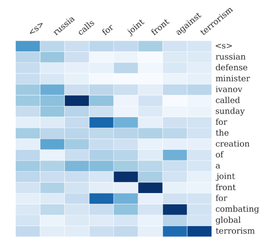{width=92% fig-align=center fig-alt="Attention heatmap from an attention-based summarization system" #fig-attention-summarization}
:::

::: {.column width="50%"}
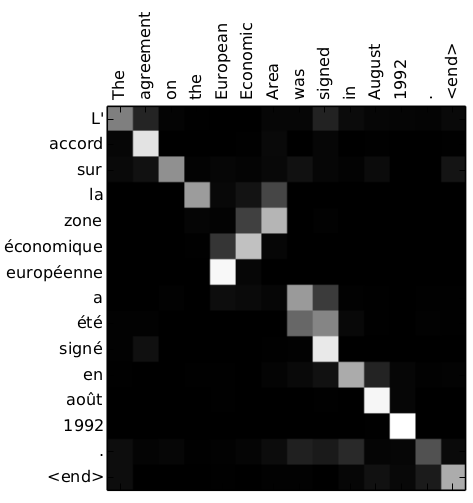{width=92% fig-align=center fig-alt="Attention heatmap from an attention-based neural machine translation model" #fig-attention-translation}
:::
::::

- Heatmaps reveal the soft alignment between input tokens and generated output tokens.
- Each cell corresponds to an attention weight $\alpha_{jt}$.


# Transformer Models

## The Transformers Timeline

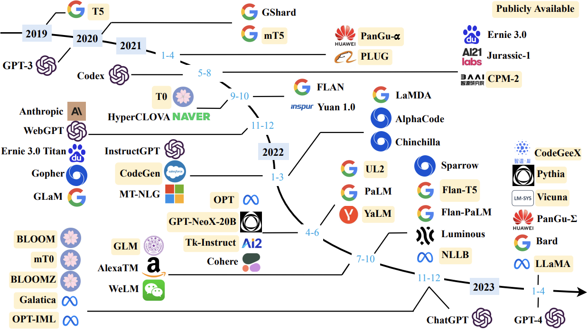{width=80% fig-align=center fig-alt="Timeline of transformer-based models" #fig-timeline}


## Transformer Models

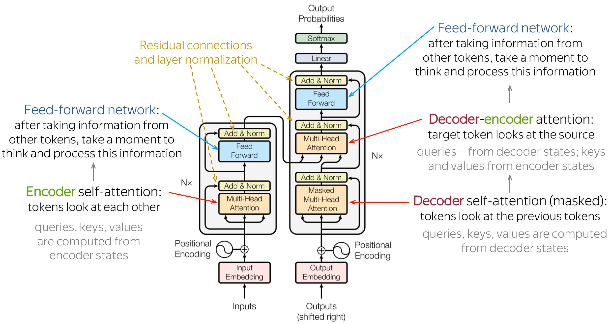{width=80% fig-align=center fig-alt="Transformer architecture diagram" #fig-transformer-architecture}

---

## Transformer Attention Internals

:::: {.columns}
::: {.column width="50%"}
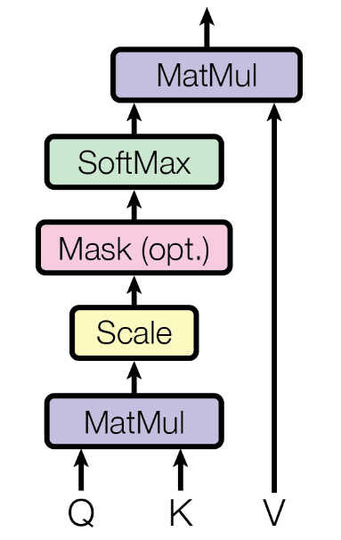{width=90% fig-align=center fig-alt="Scaled dot-product attention diagram with query, key, value, softmax, and output."}
:::

::: {.column width="50%"}
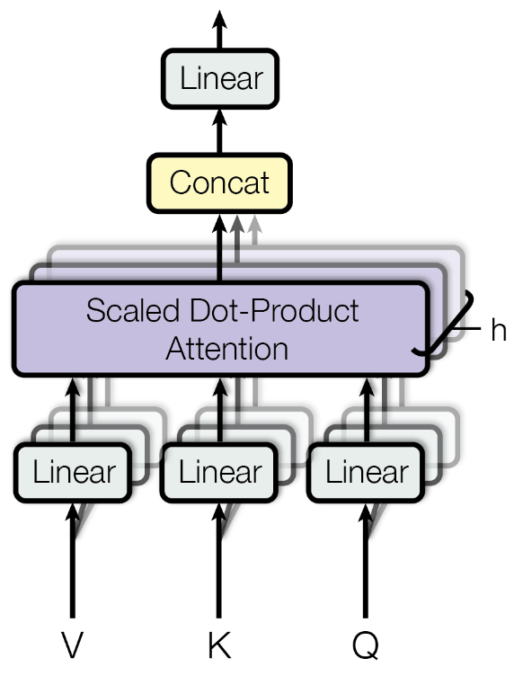{width=90% fig-align=center fig-alt="Multi-head attention diagram showing multiple attention heads and output projection."}
:::
::::

- Scaled dot-product attention is the basic operation.
- Multi-head attention repeats it in several learned representation spaces.
- The transformer block wraps attention with residuals, normalization, and feedforward layers.


# Prompt Engineering as System Design

## Two Sea Changes in NLP

- **Fully supervised learning**  
  Models trained only on task-specific labeled data  
  → heavy reliance on **feature engineering**  
  (e.g., \cite{kotsiantis2007supervised,Lafferty2001ConditionalRF})

- **Neural supervised learning**  
  Features learned jointly through **architecture engineering**  
  (e.g., CNNs, RNNs, attention models)  
  (e.g., \cite{hochreiter1997long,kalchbrenner-etal-2014-convolutional,vaswani2017attention})

- **Pre-train → Fine-tune paradigm (2017–2019)**  
  Large language models trained on massive corpora, then adapted via  
  **objective engineering**  
  (e.g., \cite{Radford2018ImprovingLU,peters-etal-2018-deep,lewis-etal-2020-bart})

- **Pre-train → Prompt → Predict (current paradigm)**  
  Tasks reformulated as language modeling problems using **textual prompts**  
  (e.g., \cite{brown2020language,petroni-etal-2019-language,schick2021its})

---

## Four Paradigms in NLP

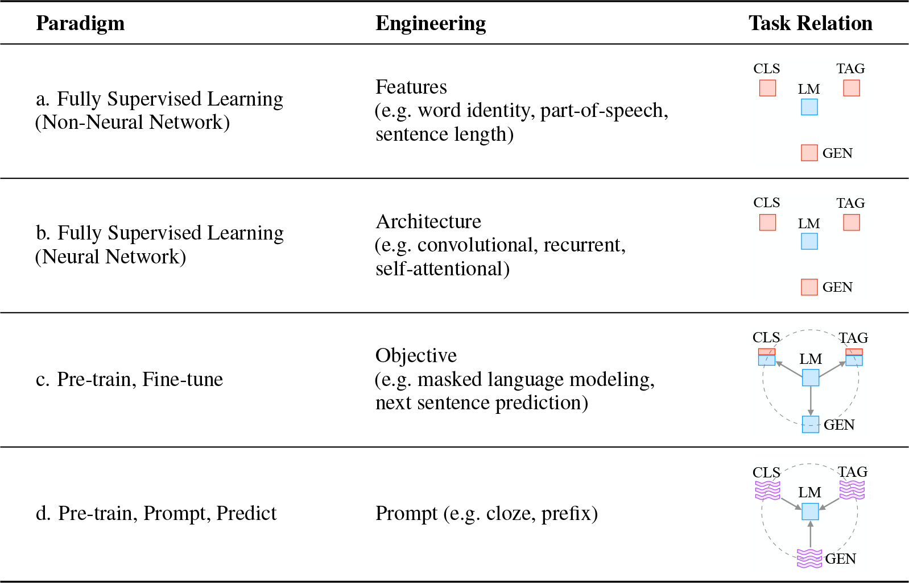{width=90% fig-align=center fig-alt="Diagram showing the four paradigms in NLP"}


---

## Typology of Prompting Methods

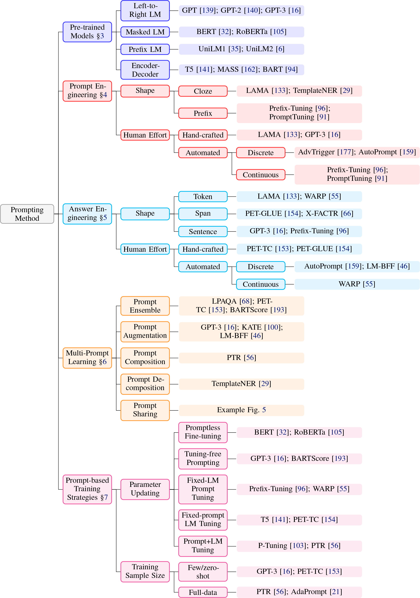{width=80% fig-align=center fig-alt="Diagram showing the typology of prompting methods" #fig-prompt-typology}


---

## Language Modeling Perspective

Instead of modeling:

$$
P(\mathbf{y} \mid \mathbf{x})
$$

we train a model to learn:

$$
P(\mathbf{x})
$$

over large text corpora.

This allows models to learn:

- syntax
- semantics
- discourse structure
- world knowledge

Prompting uses this learned distribution to solve tasks.

---

## Prompting Concept

- Prompt-based learning reformulates tasks as language modeling.
- Instead of:
  - training a task-specific model
- we:
  - Convert input into a structured textual form  
  - Ask the language model to complete it  
- This reduces dependence on supervised data.


## Prompting Terminology

| Concept | Notation | Example | Description |
|--------|----------|---------|------------|
| Input | $\mathbf{x}$ | I love this movie. | Raw input text |
| Output | $\mathbf{y}$ | ++ | Final task output |
| Prompting Function | $f_{\text{prompt}}(\mathbf{x})$ | [X] Overall it was a [Z] movie | Converts input into prompt form |
| Prompt | $\mathbf{x'}$ | I love this movie. Overall it was a [Z] movie | Input inserted, answer slot open |
| Filled Prompt | $f_{\text{fill}}(\mathbf{x'}, \mathbf{z})$ | Overall it was a bad movie | Candidate answer inserted |
| Answered Prompt | $f_{\text{fill}}(\mathbf{x'}, \mathbf{z^*})$ | Overall it was a good movie | True answer inserted |
| Answer | $\mathbf{z}$ | good / bad / fantastic | Token or phrase used to solve task |


## Prompt Construction

Prompting transforms input:

$$
\mathbf{x'} = f_{\text{prompt}}(\mathbf{x})
$$

Typical template structure:

- input slot: [X]
- answer slot: [Z]

Example (sentiment):

$$
[X] \; \text{Overall it was a [Z] movie}
$$

Example (translation):

$$
\text{Finnish: [X] English: [Z]}
$$

---


## Types of Prompts

Two common forms:

**Cloze prompts**
- answer slot inside sentence  

Example:

```

The movie was [Z].

```

**Prefix prompts**
- answer follows entire input  

Example:

```

Translate: [X]

```

Prompts may also:

- use virtual tokens  
- use continuous embeddings  
- contain multiple input or output slots


--

## Answer Search

We define:

$$
\mathcal{Z} = \text{set of possible answers}
$$

Then compute:

$$
\hat{\mathbf{z}} =
\arg\max_{\mathbf{z} \in \mathcal{Z}}
P(f_{\text{fill}}(\mathbf{x'}, \mathbf{z}); \theta)
$$

Search strategies:

- argmax decoding
- probabilistic sampling


---


## Mapping Answers to Outputs

In some tasks:

$$
\hat{\mathbf{y}} = \hat{\mathbf{z}}
$$

In others:

- multiple answers correspond to same label  

Example:

excellent, amazing → positive  

Thus we define:

$$
g: \mathbf{z} \rightarrow \mathbf{y}
$$


---


## Design Considerations in Prompting

Key dimensions:

- Choice of pre-trained model
- Prompt engineering
- Answer engineering
- Multi-prompt learning
- Prompt-based training strategies

Prompting is not just inference —  
it is a full modeling paradigm.

## Prompting Design Space

Prompting methods vary across:

- Pre-trained model type  
- Prompt construction method  
- Answer representation  
- Training strategy  
- Multi-prompt composition  

This defines a rich design space for LLM control.


## Implications for AI Engineering

The shift to prompt-based approaches enables:

- faster prototyping cycles
- lower development costs
- human-in-the-loop interaction
- dynamic system reconfiguration
- probabilistic software architectures

This marks a transition from:

> **Static Models → Interactive Generative Systems**


