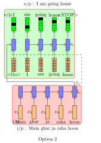

## How to print Revealjs slides

{width="80%" fig-align="center"}

# The Shift to Prompt-Based Approaches

## From Training-Centric AI to Inference-Centric AI

Traditional ML paradigm:

- Model behavior determined primarily during [training]{.uublue-bold}
- Deployment phase largely **static**
- Adaptation requires:
  - retraining
  - fine-tuning
  - feature redesign

Large Language Model paradigm:

- Model behavior can be **modified at inference time**
- Adaptation occurs through:
  - prompts
  - context
  - task specification

This represents a **fundamental architectural shift** in AI systems.

## Classical Learning vs Generative Conditioning

- Classical supervised learning: $y = f_\theta(x)$
- Behavior changes require updating $\theta$ through training.
- Generative language models: $P(Y \mid X, \theta)$
- Prompt-based control introduces: $P(Y \mid X, p, \theta)$
- Prompting modifies [inference distribution]{.uured-bold}, not model weights.


## Prompt as an Inference-Time Control Signal

A prompt functions as:

- a conditioning signal
- a soft constraint
- a semantic policy
- a probabilistic steering mechanism

Implications:

- rapid task adaptation
- reduced need for retraining
- dynamic behavior shaping
- interactive AI workflows

---


## Prompt Engineering, Fine-tuning, and RAG

{width=60% fig-align=center fig-alt="Venn diagram showing the relationship between prompt engineering, fine-tuning, and RAG" #fig-venn-diagram}

---

## Why Prompting Works

- Prompting works because LLMs are:
  - trained on diverse linguistic patterns
  - capable of contextual reasoning
  - sensitive to semantic structure
  - internally structured via attention mechanisms
- Prompting activates **latent capabilities** rather than creating new ones.


# Transformer Models

## The Transformers Timeline

{width=80% fig-align=center fig-alt="Timeline of transformer-based models" #fig-timeline}


## Transformer Models

{width=80% fig-align=center fig-alt="Transformer architecture diagram" #fig-transformer-architecture}

## Encoder and Decoder Models
## Language Modeling with RNNs

:::: {.columns}
::: {.column width="50%"}
{width=85% fig-align=center fig-alt="Diagram of a simple RNN architecture" #fig-rnn-architecture}

:::

::: {.column width="50%"}
- We will start by revisiting the problem of language modeling.
- Informally, given $t-1$ words, we are interested in predicting the $t^{\text{th}}$ word.
- More formally, given $y_1, y_2, \dots, y_{t-1}$, we want to find
  $$
  y^* = \arg\max P(y_t \mid y_1, y_2, \dots, y_{t-1})
  $$

- Let us see how we model $P(y_t \mid y_1, y_2, \dots, y_{t-1})$ using an RNN.
- We will refer to $P(y_t \mid y_1, y_2, \dots, y_{t-1})$ using the shorthand notation:

  $$
  P(y_t \mid y_1^{t-1})
  $$

:::
::::


## RNN Probability Computation

:::: {.columns}
::: {.column width="50%"}
{width=85% fig-align=center fig-alt="Diagram of RNN probability computation" #fig-rnn-probability}

:::

::: {.column width="50%"}
::: {.incremental}
- We are interested in

  $$
  P(y_t = j \mid y_1, y_2, \dots, y_{t-1})
  $$

  where $j \in V$ and $V$ is the set of all vocabulary words.

- Using an RNN, we compute this as

  $$
  P(y_t = j \mid y_1^{t-1}) = \operatorname{softmax}(V s_t + c)_j
  $$

- In other words, we compute

  $$
  \begin{aligned}
  P(y_t = j \mid y_1^{t-1}) &= P(y_t = j \mid s_t) \\
  &= \operatorname{softmax}(V s_t + c)_j
  \end{aligned}
  $$

- Notice that the recurrent connections ensure that $s_t$ has information about $y_1^{t-1}$.
:::
:::
::::


## Training an RNN Language Model

:::: {.columns}
::: {.column width="50%"}
:::{.callout-note}
**Data:** India, officially the Republic of India, is a country in South Asia. It is the seventh-largest country by area, ..... 
:::
:::

::: {.column width="50%"}
::: {.incremental}
- **Data:** All sentences from any large corpus (say Wikipedia).

- **Model:**

  $$
  \begin{aligned}
  s_t &= \sigma(W s_{t-1} + U x_t + b) \\
  P(y_t = j \mid y_1^{t-1}) &= \operatorname{softmax}(V s_t + c)_j
  \end{aligned}
  $$

- **Parameters:** $U, V, W, b, c$

- **Loss:**

  $$
  \begin{aligned}
  \mathcal{L}(\theta) &= \sum_{t=1}^{T} \mathcal{L}_t(\theta) \\
  \mathcal{L}_t(\theta) &= - \log P(y_t = \ell_t \mid y_1^{t-1})
  \end{aligned}
  $$

  where $\ell_t$ is the true word at time step $t$.
:::
:::
::::


## What Is the Input at Each Time Step?

:::: {.columns}
::: {.column width="50%"}

{width=84% fig-align=center fig-alt="Diagram showing the input at each time step in an RNN" #fig-rnn-input}

:::

::: {.column width="50%"}
- What is the input at each time step?
- It is simply the word that we predicted at the previous time step.
- In general,

  $$
  s_t = \operatorname{RNN}(s_{t-1}, x_t)
  $$

- Let $j$ be the index of the word assigned the maximum probability at time step $t-1$.

  $$
  x_t = e(v_j)
  $$

- $x_t$ is essentially a one-hot vector, $e(v_j)$, representing the $j^{\text{th}}$ word in the vocabulary.

- In practice, instead of a one-hot representation, we use a pre-trained word embedding of the $j^{\text{th}}$ word.
:::
::::


---

## Initial Hidden State

:::: {.columns}
::: {.column width="50%"}
{width=80% fig-align=center fig-alt="Diagram of RNN probability computation" #fig-rnn-probability}

:::

::: {.column width="50%"}
- Notice that $s_0$ is not computed but instead randomly initialized.

- We learn it along with the other parameters of the RNN
  (or LSTM or GRU).

- We will return to this later.
:::
::::

---

## Compact Recurrent Notation

Before moving on, it is useful to write the functions computed by
RNNs, GRUs, and LSTMs in a compact form.

We will use these notations going forward.

## Compact Form: RNN

:::: {.columns}
::: {.column width="45%"}
$$
\begin{align}
s_t &= \sigma(U x_t + W s_{t-1} + b)\\
s_t &= \operatorname{RNN}(s_{t-1}, x_t)
\end{align}
$$
:::

::: {.column width="55%"}
- A standard RNN updates its hidden state using:

  - the current input $x_t$
  - the previous hidden state $s_{t-1}$

- This compact notation emphasizes that the hidden state is a function of:

  $$
  (s_{t-1}, x_t)
  $$

- We will use this shorthand repeatedly in later derivations.
:::
::::

## Compact Form: Gated Recurrent Unit (GRU)


:::: {.columns}
::: {.column width="55%"}
$$
\begin{align}
\tilde{s_t} &= \sigma\!\left(W (o_t \odot s_{t-1}) + U x_t + b\right)\\
s_t &= i_t \odot s_{t-1} + (1 - i_t) \odot \tilde{s_t}\\
s_t &= \operatorname{GRU}(s_{t-1}, x_t)
\end{align}
$$

:::

::: {.column width="45%"}
- A GRU modifies the standard recurrent update with gating.
- These gates regulate how much past information is preserved and how much new information is incorporated.
- In compact form, we treat the whole gated update as:

  $$
  \operatorname{GRU}(s_{t-1}, x_t)
  $$
:::
::::


## Compact Form: LSTM

:::: {.columns}
::: {.column width="58%"}
$$
\begin{align}
\tilde{s_t} &= \sigma(W h_{t-1} + U x_t + b)\\
s_t &= f_t \odot s_{t-1} + i_t \odot \tilde{s_t}\\
h_t &= o_t \odot \sigma(s_t)\\
h_t, s_t &= \operatorname{LSTM}(h_{t-1}, s_{t-1}, x_t)
\end{align}
$$
:::

::: {.column width="42%"}
- The LSTM maintains two recurrent quantities:
  - the cell state $s_t$
  - the hidden state $h_t$
- This allows the model to preserve long-range information more effectively than a standard RNN.
- In compact notation, the update is written as:

  $$
  (h_t, s_t) = \operatorname{LSTM}(h_{t-1}, s_{t-1}, x_t)
  $$

:::
::::


## Guiding Questions for Sequence Modeling Tasks

- What kind of network can we use to encode the input(s)?  
- What kind of a network can we use to decode the output?  
- What are the parameters of the model?
- What is an appropriate loss function?

---

## Example: Image Captioning

{width=75% fig-align=center fig-alt="Image of a dog captioned 'good doggo'" #fig-image-captioning}

## Example: Image Captioning

- **Algorithm:** Gradient descent with backpropagation
- **Model:**
  - **Encoder:**
    $$
    s_0 = \operatorname{CNN}(x_i)
    $$

  - **Decoder:**
   
    $$
    \begin{align}
    s_t &= \operatorname{RNN}(s_{t-1}, e(\hat{y}_{t-1}))\\
    P(y_t \mid y_1^{t-1}, I) &= \operatorname{softmax}(V s_t + b)
    \end{align}
    $$

- **Parameters:**  
  $$
  U_{\text{dec}},\; V,\; W_{\text{dec}},\; W_{\text{conv}},\; b
  $$

- **Loss:**
  $$
  \begin{align}
  \mathcal{L}(\theta)& =\sum_{t=1}^{T} \mathcal{L}_t(\theta) = - \sum_{t=1}^{T} \log P(y_t = \ell_t \mid y_1^{t-1}, I)
  \end{align}
  $$


## Image Captioning 

{width=80% fig-align=center fig-alt="Diagram of an image captioning model using a large language model" #fig-image-captioning-llm}

## Other Tasks

- Textual entailment
- Machine translation
- Transliteration (e.g., English to Hindi)
- Image generation from text
- Code generation from text
- Speech recognition
- etc.


# Attention Mechanisms

## Why Do We Need Attention?

:::: {.columns}
::: {.column width="45%"}
{width=80% fig-align=center fig-alt="Diagram illustrating the machine translation process" #fig-machine-translation}

:::

::: {.column width="55%"}
- Let us motivate the task of attention with the help of machine translation.
- The encoder reads the source sentence only once and produces an encoding.
- At each time step, the decoder uses this encoding to produce a new word.
- But is this how humans translate a sentence? [Not really]{.uured-bold}.
:::
::::

---

## Human Intuition Behind Attention

:::: {.columns}
::: {.column width="50%"}

**Output:** I am going home
$$
\begin{align}
t_1 : [1,\;0,\;0,\;0,\;0]\\
t_2 : [0,\;0,\;0,\;0,\;1]\\
t_3 : [0,\;0,\;0.5,\;0.5,\;0]\\
t_4 : [0,\;1,\;0,\;0,\;0]
\end{align}
$$

**Input:** Main ghar ja raha hoon

:::

::: {.column width="50%"}
- Humans often produce each output word by focusing only on certain words in the input.
- At each time step, we can think of the translator as forming a distribution over the input words.
- This distribution tells us how much attention to pay to each input word at that time step.
- Ideally, the decoder should receive primarily the relevant information, rather than the entire source representation uniformly.
:::
::::

## More Complex Attention Patterns

:::{.callout-note}
We will cover these in video lectures in Module 8
:::


# Prompt Engineering as System Design

## Two Sea Changes in NLP

- **Fully supervised learning**  
  Models trained only on task-specific labeled data  
  → heavy reliance on **feature engineering**  
  (e.g., \cite{kotsiantis2007supervised,Lafferty2001ConditionalRF})

- **Neural supervised learning**  
  Features learned jointly through **architecture engineering**  
  (e.g., CNNs, RNNs, attention models)  
  (e.g., \cite{hochreiter1997long,kalchbrenner-etal-2014-convolutional,vaswani2017attention})

- **Pre-train → Fine-tune paradigm (2017–2019)**  
  Large language models trained on massive corpora, then adapted via  
  **objective engineering**  
  (e.g., \cite{Radford2018ImprovingLU,peters-etal-2018-deep,lewis-etal-2020-bart})

- **Pre-train → Prompt → Predict (current paradigm)**  
  Tasks reformulated as language modeling problems using **textual prompts**  
  (e.g., \cite{brown2020language,petroni-etal-2019-language,schick2021its})

---

## Four Paradigms in NLP

{width=90% fig-align=center fig-alt="Diagram showing the four paradigms in NLP"}


---

## Typology of Prompting Methods

{width=80% fig-align=center fig-alt="Diagram showing the typology of prompting methods" #fig-prompt-typology}


---

## Language Modeling Perspective

Instead of modeling:

$$
P(\mathbf{y} \mid \mathbf{x})
$$

we train a model to learn:

$$
P(\mathbf{x})
$$

over large text corpora.

This allows models to learn:

- syntax
- semantics
- discourse structure
- world knowledge

Prompting uses this learned distribution to solve tasks.

---

## Prompting Concept

- Prompt-based learning reformulates tasks as language modeling.
- Instead of:
  - training a task-specific model
- we:
  - Convert input into a structured textual form  
  - Ask the language model to complete it  
- This reduces dependence on supervised data.


## Prompting Terminology

| Concept | Notation | Example | Description |
|--------|----------|---------|------------|
| Input | $\mathbf{x}$ | I love this movie. | Raw input text |
| Output | $\mathbf{y}$ | ++ | Final task output |
| Prompting Function | $f_{\text{prompt}}(\mathbf{x})$ | [X] Overall it was a [Z] movie | Converts input into prompt form |
| Prompt | $\mathbf{x'}$ | I love this movie. Overall it was a [Z] movie | Input inserted, answer slot open |
| Filled Prompt | $f_{\text{fill}}(\mathbf{x'}, \mathbf{z})$ | Overall it was a bad movie | Candidate answer inserted |
| Answered Prompt | $f_{\text{fill}}(\mathbf{x'}, \mathbf{z^*})$ | Overall it was a good movie | True answer inserted |
| Answer | $\mathbf{z}$ | good / bad / fantastic | Token or phrase used to solve task |


## Prompt Construction

Prompting transforms input:

$$
\mathbf{x'} = f_{\text{prompt}}(\mathbf{x})
$$

Typical template structure:

- input slot: [X]
- answer slot: [Z]

Example (sentiment):

$$
[X] \; \text{Overall it was a [Z] movie}
$$

Example (translation):

$$
\text{Finnish: [X] English: [Z]}
$$

---


## Types of Prompts

Two common forms:

**Cloze prompts**
- answer slot inside sentence  

Example:

```

The movie was [Z].

```

**Prefix prompts**
- answer follows entire input  

Example:

```

Translate: [X]

```

Prompts may also:

- use virtual tokens  
- use continuous embeddings  
- contain multiple input or output slots


--

## Answer Search

We define:

$$
\mathcal{Z} = \text{set of possible answers}
$$

Then compute:

$$
\hat{\mathbf{z}} =
\arg\max_{\mathbf{z} \in \mathcal{Z}}
P(f_{\text{fill}}(\mathbf{x'}, \mathbf{z}); \theta)
$$

Search strategies:

- argmax decoding
- probabilistic sampling


---


## Mapping Answers to Outputs

In some tasks:

$$
\hat{\mathbf{y}} = \hat{\mathbf{z}}
$$

In others:

- multiple answers correspond to same label  

Example:

excellent, amazing → positive  

Thus we define:

$$
g: \mathbf{z} \rightarrow \mathbf{y}
$$


---


## Design Considerations in Prompting

Key dimensions:

- Choice of pre-trained model
- Prompt engineering
- Answer engineering
- Multi-prompt learning
- Prompt-based training strategies

Prompting is not just inference —  
it is a full modeling paradigm.

## Prompting Design Space

Prompting methods vary across:

- Pre-trained model type  
- Prompt construction method  
- Answer representation  
- Training strategy  
- Multi-prompt composition  

This defines a rich design space for LLM control.


## Implications for AI Engineering

The shift to prompt-based approaches enables:

- faster prototyping cycles
- lower development costs
- human-in-the-loop interaction
- dynamic system reconfiguration
- probabilistic software architectures

This marks a transition from:

> **Static Models → Interactive Generative Systems**


