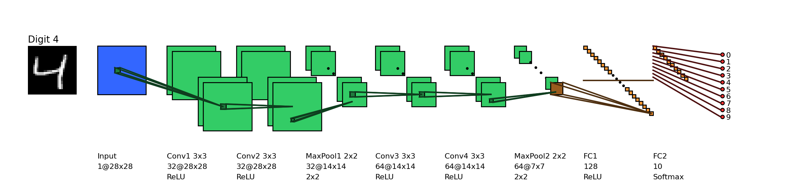
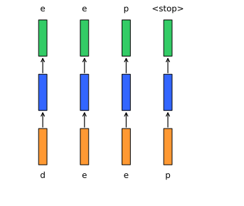

## How to print Revealjs slides

{width="80%" fig-align="center"}

# Language Modeling

## Language Modeling as Next-Token Prediction

Modern generative AI is built on **language modeling**.

Instead of learning a task-specific mapping

$$
P(y \mid x)
$$

we model the probability of a text sequence itself:

$$
P(x_1, x_2, \dots, x_T)
$$

---

## From Joint Probability to Sequential Prediction

Using the chain rule of probability, we can rewrite the probability of a sequence as:

$$
P(x_1, x_2, \dots, x_T)
=
\prod_{t=1}^{T} P(x_t \mid x_1, \dots, x_{t-1})
$$

--- 

## Example of Sequence Factorization

For a short sentence such as:

> deep learning is fun

the joint probability becomes:

$$
\begin{aligned}
P(\text{deep}, \text{learning}, \text{is}, \text{fun})
&= P(\text{deep}) \\
&\quad \times P(\text{learning} \mid \text{deep}) \\
&\quad \times P(\text{is} \mid \text{deep}, \text{learning}) \\
&\quad \times P(\text{fun} \mid \text{deep}, \text{learning}, \text{is})
\end{aligned}
$$

Language generation is therefore a probabilistic unfolding of tokens through context. :contentReference[oaicite:6]{index=6}

---

## Supervised NLP vs Language Modeling

::::{.columns}
:::{.column width="50%"}
### Supervised NLP

$$
P(y \mid x; \theta)
$$

- input text mapped to task-specific output
- requires labeled examples
- separate model or head for each task
:::

:::{.column width="50%"}
### Language Modeling

$$
P(x_1, x_2, \dots, x_T; \theta)
$$

- learns general text structure
- uses abundant unlabeled text
- supports generation, adaptation, and prompting
:::
::::

---

## Why This Matters for Generative AI

If a model learns:

$$
P(x_t \mid x_{<t})
$$

well enough, then it can:

- generate coherent text
- continue instructions
- answer questions
- translate between languages
- simulate task performance through prompting

This is the conceptual bridge from **language models** to **large language models**.

---

## Evaluation Intuition: How Good Is a Language Model?

A good language model should assign high probability to the **actual next token**.

For a sequence of length $n$, the average cross-entropy is:

$$
\frac{1}{n}\sum_{t=1}^{n} -\log P(x_t \mid x_{<t})
$$

A smaller value means:

- less surprise
- better prediction
- more accurate modeling of language structure. :contentReference[oaicite:8]{index=8}

---

## Perplexity

Perplexity is the exponential of average cross-entropy:

$$
\operatorname{Perplexity}
=
\exp\left(
-\frac{1}{n}\sum_{t=1}^{n}\log P(x_t \mid x_{<t})
\right)
$$

---


## Interpreting Perplexity

Perplexity can be understood as the model’s effective uncertainty over the next token.

- **Best case:** model assigns probability 1 to the correct token  
  → perplexity = 1

- **Worst case:** model assigns probability 0 to the correct token  
  → perplexity approaches infinity

- **Uniform baseline:** model spreads probability equally across all tokens  
  → perplexity equals vocabulary size.

---

## Why Perplexity Is Useful

Perplexity gives us:

- a length-normalized measure of prediction quality
- comparability across different text sequences
- an information-theoretic interpretation of model uncertainty

But it does **not** directly measure:

- usefulness
- factuality
- helpfulness
- alignment with human preferences

That is why later LLM systems require additional control layers such as instruction tuning and RLHF.

---

## Bridge to Transformers and Prompting

- Language modeling gives us the foundational objective:$P(x_t \mid x_{<t})$
- Transformers give us a scalable architecture for estimating it.
- Prompting then becomes a way to **shape the context** so that the next-token distribution produces useful outputs.


# Sequence Learning Problems

## Fixed-size inputs in earlier models

:::{.columns}
:::{.column width="50%"}

{width=90% .fragment}

:::
:::{.column width="50%" .incremental}

- In feedforward and convolutional neural networks the size of the input was always fixed.

:::
:::

:::{.columns}
::: {.column width="50%"}

{width=90% .fragment}

:::
::: {.column width="50%" .incremental}

- For example, we fed fixed size ($28 \times 28$) images to convolutional neural networks for image classification (MNIST).
- Similarly in word2vec, we fed a fixed window ($k$) of words to the network.

:::
:::

:::{.columns}
::: {.column width="50%"}

{width=90% .fragment}

:::
::: {.column width="50%" .incremental}

- Further, each input to the network was independent of the previous or future inputs.

:::
:::

:::{.columns}
::: {.column width="50%"}

{width=90% .fragment}

:::
:::{.column width="50%" .incremental}

- For example, the computations, outputs and decisions for two successive images are completely independent of each other.

:::
:::

---

## Auto-completion as a sequence problem

:::{.columns}
::: {.column width="50%"}
```{python}
#| echo: false
#| eval: true
#| fig-align: center
#| fig-alt: "Diagram showing a sequence of inputs and outputs for an auto-completion task."
#| fig-cap: "Diagram showing a sequence of inputs and outputs for an auto-completion task."
#| label: "fig-autocomplete-sequence"

import matplotlib.pyplot as plt
from matplotlib.patches import Rectangle, FancyArrowPatch
import numpy as np

COLOR_IN   = np.array([1.0, 0.6, 0.2])   # orange
COLOR_CELL = np.array([0.2, 0.4, 1.0])   # blue
COLOR_OUT  = np.array([0.2, 0.8, 0.4])   # green

def draw_box(ax, x, y, w, h, color, text, valign="center", pad=0.30):
    rect = Rectangle((x, y), w, h, facecolor=color, edgecolor='black')
    ax.add_patch(rect)

    cx = x + w/2

    if valign == "center":
        cy = y + h/2
    elif valign == "top":
        cy = y + h - pad*h
    elif valign == "bottom":
        cy = y + pad*h
    elif valign == "above":
        cy = y + h + pad*h
    elif valign == "below":
        cy = y - pad*h
    else:
        cy = y + h/2

    ax.text(cx, cy, text, ha='center', va='center', fontsize=12)
    return rect

def arrow_down(ax, top_rect, bottom_rect):
    x_mid = top_rect.get_x() + top_rect.get_width()/2
    y_start = top_rect.get_y()
    y_end = bottom_rect.get_y() + bottom_rect.get_height()

    arrow = FancyArrowPatch(
        (x_mid, y_start),
        (x_mid, y_end),
        arrowstyle='<-',
        mutation_scale=12,
        color='black',
        linewidth=1.2
    )
    ax.add_patch(arrow)

def draw_vertical_column(ax, x, inp, out):
    w, h = 0.25, 1.50
    gap = 0.75

    top_y = 0
    top_box = draw_box(ax, x, top_y, w, h, COLOR_OUT, out, valign="above")

    mid_y = top_y - h - gap
    mid_box = draw_box(ax, x, mid_y, w, h, COLOR_CELL, "", valign="center")

    bot_y = mid_y - h - gap
    bot_box = draw_box(ax, x, bot_y, w, h, COLOR_IN, inp, valign="below")

    arrow_down(ax, top_box, mid_box)
    arrow_down(ax, mid_box, bot_box)

def draw_sequence_vertical(inputs, outputs, column_spacing=2.0,
                           save_svg=False, svg_path="diagram.svg"):
    fig, ax = plt.subplots(figsize=(len(inputs)*1.5, 5))

    for i, (inp, out) in enumerate(zip(inputs, outputs)):
        draw_vertical_column(ax, x=i*column_spacing, inp=inp, out=out)

    ax.set_xlim(-1, len(inputs)*column_spacing + 1)
    ax.set_ylim(-6, 2)
    ax.axis('off')

    if save_svg:
        fig.savefig(svg_path, format="svg", bbox_inches="tight")
        # print(f"Saved SVG to {svg_path}")

    plt.show()

# Example usage
inputs = ["d", "e", "e", "p"]
outputs = ["e", "e", "p", "<stop>"]
column_spacing = 1.25
output_loc = "./M03_lecture02_figures/rnn_sequence.svg"
draw_sequence_vertical(inputs, outputs, column_spacing=column_spacing, save_svg=True, svg_path=output_loc)
```

:::
::: {.column width="50%"}

- In many applications the input is not of a fixed size.
- Further successive inputs may not be independent of each other.
- For example, consider the task of auto completion.
- Given the first character `d` you want to predict the next character `e` and so on.

:::
:::

---

## Properties of sequence inputs

:::{.columns}
::: {.column width="50%"}

{width=80% fig-align="center" fig-alt="Diagram showing a sequence of inputs and outputs for an auto-completion task." fig-cap="Diagram showing a sequence of inputs and outputs for an auto-completion task." #fig-autocomplete-sequence}

:::
::: {.column width="50%"}
- Successive inputs are no longer independent (while predicting `e` you would want to know what the previous input was in addition to the current input).
- The length of the inputs and the number of predictions you need to make is not fixed (for example, “learn”, “deep”, “machine” have different number of characters).
- Each network (orange–blue–green structure) is performing the same task (**input**: character, **output**: character).
- These are known as sequence learning problems.
- We need to look at a sequence of (dependent) inputs and produce an output (or outputs).
- Each input corresponds to one time step.
:::

:::

---

## Part-of-speech tagging as a sequence task

:::{.columns}
::: {.column width="50%"}

```{python}
#| echo: false
#| eval: true
#| fig-align: center
#| fig-alt: "Diagram showing a sequence of inputs and outputs for a part-of-speech tagging task."
#| fig-cap: "Diagram showing a sequence of inputs and outputs for a part-of-speech tagging task."
#| label: "fig-pos-tagging-sequence"

import matplotlib.pyplot as plt
from matplotlib.patches import Rectangle, FancyArrowPatch
import numpy as np

COLOR_IN   = np.array([1.0, 0.6, 0.2])   # orange
COLOR_CELL = np.array([0.2, 0.4, 1.0])   # blue
COLOR_OUT  = np.array([0.2, 0.8, 0.4])   # green

def draw_box(ax, x, y, w, h, color, text, valign="center", pad=0.30):
    rect = Rectangle((x, y), w, h, facecolor=color, edgecolor='black')
    ax.add_patch(rect)

    cx = x + w/2

    if valign == "center":
        cy = y + h/2
    elif valign == "top":
        cy = y + h - pad*h
    elif valign == "bottom":
        cy = y + pad*h
    elif valign == "above":
        cy = y + h + pad*h
    elif valign == "below":
        cy = y - pad*h
    else:
        cy = y + h/2

    ax.text(cx, cy, text, ha='center', va='center', fontsize=12)
    return rect

def arrow_down(ax, top_rect, bottom_rect):
    x_mid = top_rect.get_x() + top_rect.get_width()/2
    y_start = top_rect.get_y()
    y_end = bottom_rect.get_y() + bottom_rect.get_height()

    arrow = FancyArrowPatch(
        (x_mid, y_start),
        (x_mid, y_end),
        arrowstyle='<-',
        mutation_scale=12,
        color='black',
        linewidth=1.2
    )
    ax.add_patch(arrow)

def draw_vertical_column(ax, x, inp, out):
    w, h = 0.25, 1.50
    gap = 0.75

    top_y = 0
    top_box = draw_box(ax, x, top_y, w, h, COLOR_OUT, out, valign="above")

    mid_y = top_y - h - gap
    mid_box = draw_box(ax, x, mid_y, w, h, COLOR_CELL, "", valign="center")

    bot_y = mid_y - h - gap
    bot_box = draw_box(ax, x, bot_y, w, h, COLOR_IN, inp, valign="below")

    arrow_down(ax, top_box, mid_box)
    arrow_down(ax, mid_box, bot_box)

def draw_sequence_vertical(inputs, outputs, column_spacing=2.0,
                           save_svg=False, svg_path="diagram.svg"):
    fig, ax = plt.subplots(figsize=(len(inputs)*1.5, 5))

    for i, (inp, out) in enumerate(zip(inputs, outputs)):
        draw_vertical_column(ax, x=i*column_spacing, inp=inp, out=out)

    ax.set_xlim(-1, len(inputs)*column_spacing + 1)
    ax.set_ylim(-6, 2)
    ax.axis('off')

    if save_svg:
        fig.savefig(svg_path, format="svg", bbox_inches="tight")
        # print(f"Saved SVG to {svg_path}")

    plt.show()

# Example usage
inputs = ["man", "is", "a", "social", "animal"]
outputs = ["NOUN", "VERB", "ARTICLE", "ADJECTIVE", "NOUN"]
column_spacing = 1.25
output_loc = "./M03_lecture02_figures/rnn_pos_tagging.svg"
draw_sequence_vertical(inputs, outputs, column_spacing=column_spacing, save_svg=True, svg_path=output_loc)
```


:::

::: {.column width="50%"}


- Consider the task of predicting the part of speech tag (noun, adverb, adjective, verb) of each word in a sentence.
- Once we see an adjective (social) we are _almost_ sure that the next word should be a noun (man).
- Thus the current output (noun) depends on the current input as well as the previous input.
- Further the size of the input is not fixed (sentences could have arbitrary number of words).
- Notice that here we are interested in producing an output at each time step.
- Each network is performing the same task (**input**: word, **output**: tag).
:::

:::
---

## Sentiment as a sequence-to-label problem

:::{.columns}
::: {.column width="50%"}
```{python}
#| echo: false
#| eval: true
#| fig-align: center
#| fig-alt: "Diagram showing a sentiment as a sequence to label problem"
#| fig-cap: "Diagram showing a sentiment as a sequence to label problem"
#| label: "fig-sentiment-sequence"

import matplotlib.pyplot as plt
from matplotlib.patches import Rectangle, FancyArrowPatch
import numpy as np

COLOR_IN   = np.array([1.0, 0.6, 0.2])   # orange
COLOR_CELL = np.array([0.2, 0.4, 1.0])   # blue
COLOR_OUT  = np.array([0.2, 0.8, 0.4])   # green

def draw_box(ax, x, y, w, h, color, text, valign="center", pad=0.30):
    rect = Rectangle((x, y), w, h, facecolor=color, edgecolor='black')
    ax.add_patch(rect)

    cx = x + w/2

    if valign == "center":
        cy = y + h/2
    elif valign == "top":
        cy = y + h - pad*h
    elif valign == "bottom":
        cy = y + pad*h
    elif valign == "above":
        cy = y + h + pad*h
    elif valign == "below":
        cy = y - pad*h
    else:
        cy = y + h/2

    ax.text(cx, cy, text, ha='center', va='center', fontsize=12)
    return rect

def arrow_down(ax, top_rect, bottom_rect):
    x_mid = top_rect.get_x() + top_rect.get_width()/2
    y_start = top_rect.get_y()
    y_end = bottom_rect.get_y() + bottom_rect.get_height()

    arrow = FancyArrowPatch(
        (x_mid, y_start),
        (x_mid, y_end),
        arrowstyle='<-',
        mutation_scale=12,
        color='black',
        linewidth=1.2
    )
    ax.add_patch(arrow)

def draw_vertical_column(ax, x, inp, out):
    w, h = 0.25, 1.50
    gap = 0.75

    top_y = 0
    top_box = draw_box(ax, x, top_y, w, h, COLOR_OUT, out, valign="above")

    mid_y = top_y - h - gap
    mid_box = draw_box(ax, x, mid_y, w, h, COLOR_CELL, "", valign="center")

    bot_y = mid_y - h - gap
    bot_box = draw_box(ax, x, bot_y, w, h, COLOR_IN, inp, valign="below")

    arrow_down(ax, top_box, mid_box)
    arrow_down(ax, mid_box, bot_box)

def draw_sequence_vertical(inputs, outputs, column_spacing=2.0,
                           save_svg=False, svg_path="diagram.svg"):
    fig, ax = plt.subplots(figsize=(len(inputs)*1.5, 5))

    for i, (inp, out) in enumerate(zip(inputs, outputs)):
        draw_vertical_column(ax, x=i*column_spacing, inp=inp, out=out)

    ax.set_xlim(-1, len(inputs)*column_spacing + 1)
    ax.set_ylim(-6, 2)
    ax.axis('off')

    if save_svg:
        fig.savefig(svg_path, format="svg", bbox_inches="tight")
        # print(f"Saved SVG to {svg_path}")

    plt.show()

# Example usage
inputs = ["the", "movie", "was", "long", "and", ""]
outputs = ["don't\ncare", "don't\ncare", "don't\ncare", "don't\ncare", "boring"]
column_spacing = 1.25
output_loc = "./M03_lecture02_figures/rnn_sequence-to-label.svg"
draw_sequence_vertical(inputs, outputs, column_spacing=column_spacing, save_svg=True, svg_path=output_loc)
```

:::
::: {.column width="50%"}


- Consider sentiment classification for a sentence like “The movie was boring and …”.
- The final sentiment depends on the entire sequence of words.
- Intermediate words like “boring” strongly influence the final decision.
- Again, the input length is variable, but we may only need a single output label at the end.
- Sequences could be composed of anything (not just words)
- For example, a video could be treated as a sequence of images
- We may want to look at the entire sequence and detect the activity being performed
:::

:::


# Recurrent Neural Networks

## Modeling sequences with recurrent neural networks

:::{.callout-important}
How do we model such tasks involving sequences?
:::

- Account for dependence between inputs
- Account for variable number of inputs
- Make sure that the function executed at each time step is the same
- We will focus on each of these to arrive at a model for dealing with sequences

---

## Functional Model of Sequence

:::: {.columns}
::: {.column width="50%"}


```{python}
#| echo: false
#| eval: true
#| fig-align: center
#| fig-alt: "Diagram showing a sequence of inputs and outputs for an auto-completion task."
#| fig-cap: "Diagram showing a sequence of inputs and outputs for an auto-completion task."

import matplotlib.pyplot as plt
from matplotlib.patches import Rectangle, FancyArrowPatch
import numpy as np

# ---------------------------------------------------------
# COLORS
# ---------------------------------------------------------
COLOR_IN   = np.array([1.0, 0.6, 0.2])   # orange
COLOR_CELL = np.array([0.2, 0.4, 1.0])   # blue
COLOR_OUT  = np.array([0.2, 0.8, 0.4])   # green


# ---------------------------------------------------------
# BOX DRAWING (with inside labels + side labels + edge styles)
# ---------------------------------------------------------
def draw_box(ax, x, y, w, h, color, text,
             valign="center", pad=0.30,
             side_label=None, side="left", side_pad=0.25,
             edge_style="solid"):

    rect = Rectangle(
        (x, y), w, h,
        facecolor=color,
        edgecolor='black',
        linestyle=edge_style,
        linewidth=1.2
    )
    ax.add_patch(rect)

    # Inside label vertical placement
    cx = x + w/2
    if valign == "center":
        cy = y + h/2
    elif valign == "top":
        cy = y + h - pad*h
    elif valign == "bottom":
        cy = y + pad*h
    elif valign == "above":
        cy = y + h + pad*h
    elif valign == "below":
        cy = y - pad*h
    else:
        cy = y + h/2

    # Draw inside label
    ax.text(cx, cy, text, ha='center', va='center', fontsize=10)

    # Side label (left or right)
    if side_label:
        sx = x - side_pad if side == "left" else x + w + side_pad
        sy = y + h/2
        ax.text(
            sx, sy, side_label,
            ha='right' if side == "left" else 'left',
            va='center',
            fontsize=10
        )

    return rect


# ---------------------------------------------------------
# ARROWS (with labels)
# ---------------------------------------------------------
def arrow_down(ax, top_rect, bottom_rect,
               label=None, label_side="right", label_pad=0.30):

    x_mid = top_rect.get_x() + top_rect.get_width()/2
    y_start = top_rect.get_y()
    y_end = bottom_rect.get_y() + bottom_rect.get_height()

    # Arrow patch
    arrow = FancyArrowPatch(
        (x_mid, y_start),
        (x_mid, y_end),
        arrowstyle='<-',
        mutation_scale=12,
        color='black',
        linewidth=1.2
    )
    ax.add_patch(arrow)

    # Arrow label
    if label:
        lx = x_mid + (label_pad if label_side == "right" else -label_pad)
        ly = (y_start + y_end) / 2
        ax.text(
            lx, ly, label,
            fontsize=10,
            ha='left' if label_side == "right" else 'right',
            va='center'
        )


# ---------------------------------------------------------
# ONE VERTICAL COLUMN (top → mid → bottom)
# ---------------------------------------------------------
def draw_vertical_column(ax, x, inp, out,
                         w=0.50, h=1.50, gap=0.75,
                         top_edge="solid", mid_edge="solid", bot_edge="solid",
                         arrow_labels=("V", "U")):

    # TOP (green)
    top_box = draw_box(
        ax, x, 0, w, h, COLOR_OUT, out,
        valign="above",
        side_label=None,
        edge_style=top_edge
    )

    # MIDDLE (blue)
    mid_y = 0 - h - gap
    mid_box = draw_box(
        ax, x, mid_y, w, h, COLOR_CELL, "",
        valign="center",
        side_label=None,
        edge_style=mid_edge
    )

    # BOTTOM (orange)
    bot_y = mid_y - h - gap
    bot_box = draw_box(
        ax, x, bot_y, w, h, COLOR_IN, inp,
        valign="below",
        side_label=None,
        edge_style=bot_edge
    )

    # Arrows with labels
    arrow_down(ax, top_box, mid_box, label=arrow_labels[0], label_side="right")
    arrow_down(ax, mid_box, bot_box, label=arrow_labels[1], label_side="right")


# ---------------------------------------------------------
# MULTI‑COLUMN SEQUENCE
# ---------------------------------------------------------
def draw_sequence_vertical(inputs, outputs,
                           column_spacing=1.5,
                           save_svg=False, svg_path="diagram.svg",
                           **kwargs):

    fig, ax = plt.subplots(figsize=(len(inputs)*1.2, 6))

    for i, (inp, out) in enumerate(zip(inputs, outputs)):
        draw_vertical_column(
            ax,
            x=i * column_spacing,
            inp=inp,
            out=out,
            **kwargs
        )

    ax.set_xlim(-1, len(inputs)*column_spacing + 1)
    ax.set_ylim(-6, 2)
    ax.axis('off')

    # if save_svg:
    #     fig.savefig(svg_path, format="svg", bbox_inches="tight")
    #     print(f"Saved SVG to {svg_path}")

    plt.show()

inputs = ["$x_1$", "$x_2$", "$x_3$"]
outputs = ["$y_1$", "$y_2$", "$y_3$"]
column_spacing = 1.25
output_loc = "./M03_lecture02_figures/rnn_sequence-function.svg"
draw_sequence_vertical(inputs, outputs, column_spacing=column_spacing, save_svg=True, svg_path=output_loc, top_edge="solid",
    mid_edge="solid",
    bot_edge="solid",
    arrow_labels=("V", "U"))
```

:::

::: {.column width="50%"}
- What is the function being executed at each time step ($i$)?

$$
\begin{align}
s_i = \sigma(Ux_i + b)\\
y_i = \mathcal{O}(Vs_i + c)
\end{align}
$$

- Since we want the **same function** to be executed at each time step, we should share the same network parameters across time
:::
::::

---

## Parameter Sharing Across Time

:::: {.columns}
::: {.column width="50%"}
<div style="text-align:center; margin-top: 1.0em;">

{width=95%}

</div>
:::

::: {.column width="50%"}
- Parameter sharing ensures that the network becomes agnostic to the length of the input sequence
- Since we compute the same function with the same parameters at every time step, the number of time steps does not change the model definition
- We can view this as creating multiple copies of the same network and applying them across the sequence
:::
::::


---

## A First Attempt at Modeling Dependence

:::: {.columns}
::: {.column width="50%"}
<div style="text-align:center; margin-top: 1.0em;">

{width=90%}

</div>
:::

::: {.column width="50%"}
- How do we account for dependence between inputs?

- A first, but infeasible, idea is to feed all previous inputs into the network at each time step

- At time step $i$, the model would receive:
  - $x_1$
  - $x_2$
  - $\dots$
  - $x_i$

- Is this a good solution?

- No, because it violates the other requirements in our wishlist
:::
::::


---

## Why the Naive Dependence Strategy Fails

:::: {.columns}
::: {.column width="50%"}
<div style="text-align:center; margin-top: 1.0em;">

{width=90%}

</div>
:::

::: {.column width="50%"}
- The function being computed at each time step is now different

$$
\begin{align}
y_1 = f_1(x_1) \\
y_2 = f_2(x_1, x_2)\\
y_3 = f_3(x_1, x_2, x_3)
\end{align}
$$

- The network becomes sensitive to sequence length
- A sequence of length 10 would require $f_1, \dots, f_{10}$, while a sequence of length 100 would require $f_1, \dots, f_{100}$
:::
::::


---

## The Recurrent Solution

:::: {.columns}
::: {.column width="50%"}
<div style="text-align:center; margin-top: 1.0em;">

{width=95%}

</div>
:::

::: {.column width="50%"}
- The solution is to add a **recurrent connection** to the network

$$
s_i = \sigma(Ux_i + Ws_{i-1} + b)
$$

$$
y_i = \mathcal{O}(Vs_i + c)
$$

or more generally,

$$
y_i = f(x_i, s_{i-1}, W, U, V, b, c)
$$

- $s_i$ is the **state** of the network at time step $i$

- The parameters $W, U, V, b, c$ are shared across time steps

- The same model can process sequences of length 10, 100, or more
:::
::::


---

## A More Compact View of Recurrence

:::: {.columns}
::: {.column width="50%"}
<div style="text-align:center; margin-top: 1.0em;">

{width=70%}

</div>
:::

::: {.column width="50%"}
- We can represent recurrence more compactly

- The hidden state is updated by combining:
  - the current input $x_i$
  - the previous state $s_{i-1}$

- This compact view emphasizes that the network carries information forward through time
:::
::::


---

## Revisiting Sequence Learning Problems

:::: {.columns}
::: {.column width="50%"}
<div style="text-align:center; margin-top: 1.0em;">

{width=92%}

</div>
:::

::: {.column width="50%"}
- Let us revisit the sequence learning problems that we saw earlier

- We now have recurrent connections between time steps, which account for dependence between inputs

- This gives us a principled architecture for modeling sequential data
:::
::::

---


# Prompt Engineering and Prompt-Based Learning

## Why Prompt Engineering Matters

Prompt-based learning reframes downstream tasks as language modeling problems.
This means performance depends not only on:

- the pre-trained model
- the data
- the decoding strategy

but also on:

- how the prompt is structured
- how the answer space is designed
- how prompts are combined or tuned


---


## Prompt Shape

Two major prompt shapes are commonly used:

**Cloze prompt**
- the answer slot appears inside the text

Example:

```text
I love this movie. Overall, it was a [Z] movie.
````

**Prefix prompt**

* the input appears before the answer slot

Example:

```text
French: Je vous aime.
English: [Z]
```

Prompt shape affects:

* what the model is asked to do
* how naturally the task aligns with pretraining
* which model families work best. 


## Manual Template Engineering

A manually designed prompt template specifies:

- where the input is inserted
- what linguistic context surrounds it
- what kind of answer is expected

Examples:

- Sentiment:
  ```text
  [X] The movie is [Z].
  ```

* Topic classification:

  ```text
  [X] The text is about [Z].
  ```

* Translation:

  ```text
  French: [X] English: [Z]
  ```

Manual template design is intuitive and interpretable, but it is often brittle and task-sensitive. 

---


## Automated Template Learning

Instead of hand-writing prompts, we can learn them.

Two major approaches:

- **Discrete prompt learning**
- **Continuous prompt learning**

This shifts prompting from:

> prompt writing

to

> prompt optimization

The central idea is that the prompt itself can become an object of search or training.

---


## Discrete Prompts

Discrete prompt learning searches over actual tokens or phrases.

Examples:

- selecting better trigger words
- searching candidate templates
- optimizing label words

Advantages:

- interpretable
- human-readable
- easy to inspect

Limitations:

- combinatorial search space
- token-level optimization is difficult
- may remain brittle across tasks.

---


## Continuous Prompts

Continuous prompts replace natural-language templates with learnable vectors.

Instead of writing:

```text
The movie is [Z].
```

we learn soft prompt embeddings that steer the model.

Advantages:

* highly flexible
* easier to optimize than discrete token search
* often performs well with frozen language models

Limitations:

* less interpretable
* not directly human-readable
* can behave like hidden task-specific parameters. 

---


## Answer Engineering

Prompting does not end with the prompt itself.

We must also decide:

- what form the answer takes
- what answer space is allowed
- how answers map back to task outputs

Examples:

- token answer
- span answer
- sentence answer

Answer engineering is especially important in classification-style prompting, where many different words may correspond to the same label.

---


## Answer Shape and Answer Space Design

Three common answer shapes:

- **Token**
- **Span**
- **Sentence**

Answer space design can be:

**Manual**
- choose verbalizers such as:
  - positive → great
  - neutral → okay
  - negative → terrible

**Discrete search**
- search over candidate answer tokens

**Continuous search**
- learn answer representations in embedding space

This choice strongly affects accuracy, calibration, and task fit. 


---


## Multi-Prompt Learning

A single prompt is rarely sufficient.

Multi-prompt learning extends the framework through:

- [Prompt ensembling]{.uublue-bold}
- [Prompt augmentation]{.uublue-bold}
- [Prompt composition]{.uublue-bold}
- [Prompt decomposition]{.uublue-bold}

This helps reduce prompt sensitivity and improve robustness across tasks.

---


## Multi-Prompt Strategies

- [Prompt ensembling]{.uublue-bold}
  - combine predictions from multiple prompts
- [Prompt augmentation]{.uublue-bold}
  - vary demonstrations or examples
  - generate multiple contextual prompt versions
- [Prompt composition]{.uublue-bold}
  - combine multiple sub-prompts into a larger task structure
- [Prompt decomposition]{.uublue-bold}
  - break a complex task into simpler prompted subtasks
- These strategies move prompting from a single-template method to a small inference system.

---


## Training Strategies for Prompting

Prompt-based learning can be used with different training regimes.

Common settings include:

- zero-shot or few-shot prompting
- full-data prompting
- instruction tuning
- prompt tuning

The important question is:

> Which parameters are actually updated?

---


## Parameter Update Methods

Five major strategies:

1. **Promptless fine-tuning**
   - fine-tune the model directly without prompts

2. **Tuning-free prompting**
   - use prompts only at inference time

3. **Fixed-LM prompt tuning**
   - freeze the model, learn the prompt

4. **Fixed-prompt LM tuning**
   - keep prompt fixed, update model parameters

5. **Prompt + LM tuning**
   - jointly optimize both prompt and model

These strategies differ in:

- cost
- interpretability
- flexibility
- performance.

---


## Big Picture

Prompt-based learning is not one method.

It is a family of design choices involving:

- prompt structure
- answer structure
- multiple prompt coordination
- parameter update strategy

So when we say “prompt engineering,” we are really talking about a broader **inference and adaptation framework** for large language models.

---


## Transition

We now have a richer picture of prompting:

- prompts specify tasks
- answers define decision spaces
- multiple prompts improve robustness
- tuning strategies determine what adapts

The next question is:

> How do these prompt-based methods connect to transformer computation, in-context learning, and alignment?

