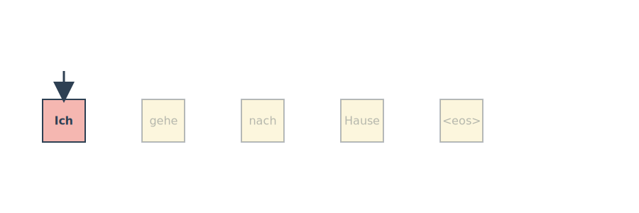
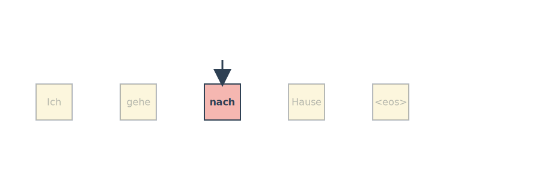
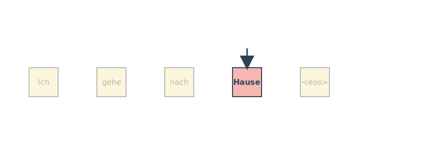

```{python}
#| eval: false
import torch
from torch import nn
from torch.nn import functional as F
import numpy as np
import math
import matplotlib.pyplot as plt
```

# Attention Mechanism and Transformers

## From Classic Deep Learning to the Edge of Its Limits

During the 2010s, Deep Learning experienced its first major boom. Breakthroughs were primarily driven by Multilayer Perceptrons (MLPs), Convolutional Neural Networks (CNNs), and Recurrent Neural Networks/Long Short-Term Memory networks (RNN/LSTMs). While these architectures changed little from their 1980s–1990s origins, significant gains came mostly from:
- **GPUs and parallel computing**
- **Massive datasets and cheap storage**
- **Training innovations** (ReLU, batch norm, dropout, residuals, Adam optimizer)

However, these models eventually plateaued. CNNs dominated vision tasks, while LSTMs dominated Natural Language Processing (NLP). Although thousands of alternative architectures were proposed, few managed to displace the classic models. Progress began to feel more like scaling rather than rethinking fundamental approaches. By the mid‑2010s, the field was primed for a new architectural paradigm.

## The Transformer Era

The attention mechanism was originally added to encoder–decoder RNNs for machine translation. It allowed models to focus selectively on different input tokens, replacing the "single compressed vector" bottleneck that plagued earlier designs. This enabled differentiable, learnable weighting over the entire input sequence.

The true architectural breakthrough arrived with the introduction of Transformers by Vaswani et al. (2017) in their seminal paper "Attention Is All You Need". Transformers abandoned recurrence entirely, relying purely on attention mechanisms. They rapidly outperformed RNNs across NLP tasks and became the foundation for large-scale pretraining (e.g., BERT, RoBERTa, GPT‑2/3). 

The Transformer architecture expanded far beyond NLP, leading to:
- **Vision Transformers** for image recognition, detection, and segmentation.
- Applications in **Speech**, **reinforcement learning**, and **graph neural networks**.

### The New Landscape

The combination of Transformers and large-scale pretraining led to the rise of **foundation models**. The default approach in modern AI is to start with a pretrained Transformer and fine‑tune it for specific downstream tasks. This represents a true architectural shift, not merely the creation of bigger models.

# Why Attention? A Human Translation Story

When humans translate a sentence, we do not memorize the entire input at once. Instead, we look back and forth, focusing on the specific words we need at each moment. Early sequence‑to‑sequence models (Sutskever et al., 2014) lacked this capability. In these models, the encoder read the whole sentence once, compressed it into a single vector, and handed that to the decoder. The decoder then attempted to generate the entire translation from that single vector bottleneck.

## The Problem With Single‑Vector Encodings

Compressing a long, information‑rich sentence into one vector creates a significant bottleneck. RNNs struggle to retain all details, especially for long sequences. Even with improved architectures, the decoder had no way to "look back" at specific words during translation. This mismatch between how humans process information and how RNNs operated motivated a new idea.

## The Key Insight: Focus Selectively

The key insight is to focus selectively. Humans translate by focusing on different input words at different times. At each decoding step, we implicitly form a distribution over the input words:
- Some words matter a lot.
- Some matter a little.
- Some don't matter at all.

Ideally, the decoder should receive only the relevant information for the word it is about to produce.






## From Human Intuition to a Formal Mechanism

Bahdanau, Cho, and Bengio (2014) formalized this intuition. They proposed treating the encoder outputs as a set of **key–value pairs** $(\mathbf{k}_i, \mathbf{v}_i)$. 

At each decoding step:
1. Compute a **query** $\mathbf{q}$.
2. Compare the query to each key to produce **attention weights** $\alpha(\mathbf{q}, \mathbf{k}_i)$.
3. Use these weights to form a **weighted sum of values**:

$$
\text{Attention}(\mathbf{q}, \mathcal{D}) = \sum_i \alpha(\mathbf{q}, \mathbf{k}_i)\mathbf{v}_i.
$$

## Why Queries, Keys, and Values Work So Well

This mechanism possesses several powerful properties:
- It works for **any input length** with no architectural changes needed.
- The query (the "program") is small, but it operates over a large state space.
- The model learns **what to retrieve** and **how strongly**.
- It generalizes special cases, including exact lookup (one weight = 1), uniform averaging, and convex combinations (soft attention).
- Softmax normalization ensures all weights are nonnegative and sum to 1.

## The Bridge to Transformers

Once queries, keys, and values are established, recurrence can be dropped entirely. Attention alone can model all relationships in a sequence, leading directly to the Transformer architecture. Q/K/V attention thus becomes the fundamental building block for a wide array of modern architectures.

# Attention Pooling by Similarity

## Motivation: Why Attention Pooling?

Before the widespread use of Transformers, attention-like mechanisms existed in classical statistics. Nadaraya–Watson regression is one of the earliest mechanisms, using similarity between a query and keys to compute a weighted average of values. This provides a clean conceptual bridge from classical kernel methods to modern attention.


## The Core Idea

Attention pooling in its purest form requires no training, no parameters, and no deep networks. The steps are simple:
1. Compute similarity.
2. Normalize.
3. Compute the weighted sum.

$$
f(q) = \sum_i v_i \frac{\alpha(q, k_i)}{\sum_j \alpha(q, k_j)}
$$

## Kernels as Similarity Functions

Common kernels used in Nadaraya–Watson regression include:

$$
\alpha(q, k) = 
\begin{cases}
\exp(-\|q-k\|^2/2) & \text{Gaussian} \\
1 & \text{if } |q-k| < 1 \quad \text{(Boxcar)}\\
\max(0, 1 - |q-k|) & \text{Epanechikov}
\end{cases}
$$

Let's write pure PyTorch code to plot these common kernels.

```{python}
#| eval: false
# Define some kernels
def gaussian(x):
    return torch.exp(-x**2 / 2)

def boxcar(x):
    return torch.abs(x) < 1.0

def constant(x):
    return 1.0 + 0 * x

def epanechikov(x):
    return torch.max(1 - torch.abs(x), torch.zeros_like(x))

fig, axes = plt.subplots(1, 4, sharey=True, figsize=(12, 3))
kernels = (gaussian, boxcar, constant, epanechikov)
names = ('Gaussian', 'Boxcar', 'Constant', 'Epanechikov')
x = torch.arange(-2.5, 2.5, 0.1)

for kernel, name, ax in zip(kernels, names, axes):
    ax.plot(x.detach().numpy(), kernel(x).detach().numpy())
    ax.set_xlabel(name)
plt.show()
```

## Nadaraya–Watson Attention Pooling in Practice

When approximating a nonlinear function using kernel regression:
- Each validation point acts as a **query**.
- Each training point acts as a **key–value pair**.
- The normalized kernel weights represent the **attention weights**.

```{python}
#| eval: false
def f(x):
    return 2 * torch.sin(x) + x

n = 40
x_train, _ = torch.sort(torch.rand(n) * 5)
y_train = f(x_train) + torch.randn(n)
x_val = torch.arange(0, 5, 0.1)
y_val = f(x_val)

def nadaraya_watson(x_train, y_train, x_val, kernel):
    dists = x_train.reshape((-1, 1)) - x_val.reshape((1, -1))
    k = kernel(dists).type(torch.float32)
    attention_w = k / k.sum(0)
    y_hat = y_train @ attention_w
    return y_hat, attention_w
```

The Gaussian kernel produces the smoothest estimates, while the Boxcar kernel produces sharper transitions. 

### Kernel Width Matters

The width of the kernel (e.g., standard deviation $\sigma$ in a Gaussian kernel) dictates the attention span:
- **Narrow kernels** produce sharp, local attention (collapsing to nearest neighbors).
- **Wide kernels** yield smooth, global attention spread across many points.

## Why This Matters for Transformers

Nadaraya–Watson regression shares the same structure as modern attention: similarity leading to softmax, resulting in a weighted sum. However, its kernels are hand-crafted, representations are fixed, and there is no learning involved. Transformers elevate this concept by replacing fixed kernels with **learned Q/K/V projections**.

# Attention Scoring Functions

Our goal is to understand how we compute the compatibility (score) between a query and a set of keys. Attention pooling requires a score $a(q, k_i)$ for each key, which determines how much each value contributes to the final output. Scoring functions need to be computationally efficient, numerically stable, and expressive.

There are two dominant families of attention scoring functions: **Dot-Product Attention** and **Additive Attention**.

## From Distance Kernels to Learnable Scoring

Previously, we used distance kernels (like Gaussian) to model similarity. However, distance computations are more expensive than dot products. Terms depending only on the query $q$ cancel out after softmax normalization, and layer normalization often keeps $\|k_i\|$ relatively constant. This motivates the shift toward using simple dot products for scoring.

## Dot‑Product Attention

Dot-product attention measures the direct alignment between a query and a key:
$$
a(q, k_i) = q^\top k_i
$$

This works best when $q$ and $k_i$ share a similar scale. However, if $q$ and $k_i$ are $d$-dimensional vectors with independent components, the variance of their dot product grows with $d$. A large $d$ leads to a large variance, causing the softmax function to become unstable and saturate.

## Scaled Dot‑Product Attention

To address the variance issue, we rescale the dot product by $1/\sqrt{d}$:

$$
\begin{align}
a(q, k_i) &= \frac{q^\top k_i}{\sqrt{d}} \\
\alpha(q, k_i) &= \mathrm{softmax}(a(q, k_i))
\end{align}
$$

This rescaling keeps the logits in a stable range, preventing softmax saturation. It is the core mechanism used in Transformers.

For a batch of queries $Q \in \mathbb{R}^{n \times d}$, keys $K \in \mathbb{R}^{m \times d}$, and values $V \in \mathbb{R}^{m \times v}$, the batched scaled dot-product attention is efficiently computed as:

$$
\mathrm{Attention}(Q, K, V) = \mathrm{softmax}\!\left(\frac{QK^\top}{\sqrt{d}}\right)V
$$

```{python}
#| eval: false
Q = torch.ones((2, 3, 4))
K = torch.ones((2, 4, 6))
# BMM yields shape (2, 3, 6)
print(torch.bmm(Q, K).shape)
```

### Masked Softmax

Because sequence lengths vary (especially in NLP), padding tokens are added. However, padding should not influence attention. A masked softmax resolves this by replacing padded positions with a large negative value (e.g., $-10^6$) before the softmax step, ensuring they contribute zero weight to the output.

```{python}
#| eval: false
def masked_softmax(X, valid_lens):
    """Perform softmax operation by masking elements on the last axis."""
    def _sequence_mask(X, valid_len, value=0):
        maxlen = X.size(1)
        mask = torch.arange((maxlen), dtype=torch.float32,
                            device=X.device)[None, :] < valid_len[:, None]
        X[~mask] = value
        return X
    
    if valid_lens is None:
        return nn.functional.softmax(X, dim=-1)
    else:
        shape = X.shape
        if valid_lens.dim() == 1:
            valid_lens = torch.repeat_interleave(valid_lens, shape[1])
        else:
            valid_lens = valid_lens.reshape(-1)
        X = _sequence_mask(X.reshape(-1, shape[-1]), valid_lens, value=-1e6)
        return nn.functional.softmax(X.reshape(shape), dim=-1)

# Example usage
print(masked_softmax(torch.rand(2, 2, 4), torch.tensor([2, 3])))
```

Here is how the Scaled Dot Product attention is implemented.

```{python}
#| eval: false
class DotProductAttention(nn.Module):
    """Scaled dot product attention."""
    def __init__(self, dropout):
        super().__init__()
        self.dropout = nn.Dropout(dropout)

    def forward(self, queries, keys, values, valid_lens=None):
        d = queries.shape[-1]
        # Swap the last two dimensions of keys
        scores = torch.bmm(queries, keys.transpose(1, 2)) / math.sqrt(d)
        self.attention_weights = masked_softmax(scores, valid_lens)
        return torch.bmm(self.dropout(self.attention_weights), values)

queries = torch.normal(0, 1, (2, 1, 2))
keys = torch.normal(0, 1, (2, 10, 2))
values = torch.normal(0, 1, (2, 10, 4))
valid_lens = torch.tensor([2, 6])

attention = DotProductAttention(dropout=0.5)
attention.eval()
print(attention(queries, keys, values, valid_lens).shape)
```

## Additive Attention

Dot-product attention requires the query and key to have the same dimensionality. Additive attention, originally popularized by Bahdanau et al. (2014), handles mismatched dimensions naturally by using a small Multilayer Perceptron (MLP) to compute compatibility:

$$
a(q, k_i) = \mathbf{w}_v^\top \tanh(W_q \mathbf{q} + W_k \mathbf{k}_i)
$$

```{python}
#| eval: false
class AdditiveAttention(nn.Module):
    """Additive attention."""
    def __init__(self, num_hiddens, dropout, **kwargs):
        super(AdditiveAttention, self).__init__(**kwargs)
        self.W_k = nn.LazyLinear(num_hiddens, bias=False)
        self.W_q = nn.LazyLinear(num_hiddens, bias=False)
        self.w_v = nn.LazyLinear(1, bias=False)
        self.dropout = nn.Dropout(dropout)

    def forward(self, queries, keys, values, valid_lens):
        queries, keys = self.W_q(queries), self.W_k(keys)
        # Broadcasting logic
        features = queries.unsqueeze(2) + keys.unsqueeze(1)
        features = torch.tanh(features)
        scores = self.w_v(features).squeeze(-1)
        self.attention_weights = masked_softmax(scores, valid_lens)
        return torch.bmm(self.dropout(self.attention_weights), values)

queries = torch.normal(0, 1, (2, 1, 20))
attention = AdditiveAttention(num_hiddens=8, dropout=0.1)
attention.eval()
print(attention(queries, keys, values, valid_lens).shape)
```

## Comparing Dot‑Product and Additive Attention

- **Dot‑Product Attention:** Fast (relies on highly optimized matrix multiplications), scales well to large models, and is the standard in Transformer architectures. Use this when query and key dimensions match and computational speed is critical.
- **Additive Attention:** More flexible with dimensionality and offers a more expressive scoring function, but is slightly more expensive to compute. Use this when query and key dimensions differ or when model size is small enough that the extra computational cost is negligible.

## Summary

Attention scoring functions compute the compatibility between queries and keys. Scaled dot-product attention has become the default mechanism in modern deep learning architectures due to its efficiency and stability. Additive attention remains a historically significant and flexible alternative. The use of masked softmax is vital for handling variable-length sequences, and overall, modern implementations leverage efficient batch matrix operations to scale to billions of parameters.
