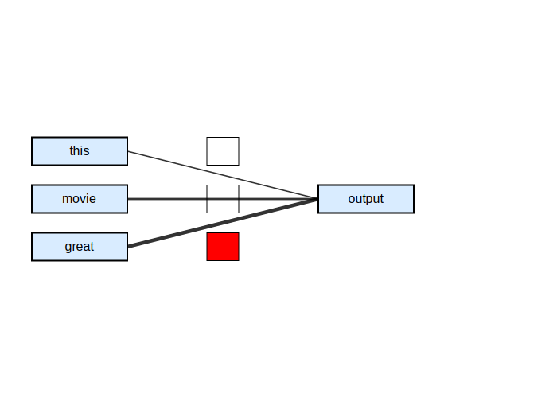

# Transformers, Self-Attention, and Prompt Engineering

At the core of the transformer architecture lies the self-attention mechanism. As described in *Generative AI Foundations in Python*, this mechanism captures complex relationships among different elements within an ordered data sequence. The principle of attention enables a model to focus on certain pivotal aspects of the input data while potentially disregarding less significant parts. 

The transformer bifurcates into two main segments: the encoder and the decoder. The encoder discerns relationships between different positions in the input sequence, while the decoder focuses on generating outputs, employing masked self-attention to prevent consideration of future outputs. To retain sequence order, the model adopts positional encoding, ensuring it preserves the initial order of data. Multi-head attention allows the model to channel attention toward multiple data points simultaneously, capturing a wider range of information from the same input words. This architecture powers the prompt-based generative tasks we rely on today.


```{python}
#| eval: false
import torch
from torch import nn
from torch.nn import functional as F
import numpy as np
import math
import matplotlib.pyplot as plt
```

# Attention Mechanism and Transformers

## From Classic Deep Learning to the Edge of Its Limits

During the 2010s, Deep Learning experienced its first major boom. Breakthroughs were primarily driven by Multilayer Perceptrons (MLPs), Convolutional Neural Networks (CNNs), and Recurrent Neural Networks/Long Short-Term Memory networks (RNN/LSTMs). While these architectures changed little from their 1980s–1990s origins, significant gains came mostly from:
- **GPUs and parallel computing**
- **Massive datasets and cheap storage**
- **Training innovations** (ReLU, batch norm, dropout, residuals, Adam optimizer)

However, these models eventually plateaued. CNNs dominated vision tasks, while LSTMs dominated Natural Language Processing (NLP). Although thousands of alternative architectures were proposed, few managed to displace the classic models. Progress began to feel more like scaling rather than rethinking fundamental approaches. By the mid‑2010s, the field was primed for a new architectural paradigm.

## The Transformer Era

The attention mechanism was originally added to encoder–decoder RNNs for machine translation. It allowed models to focus selectively on different input tokens, replacing the "single compressed vector" bottleneck that plagued earlier designs. This enabled differentiable, learnable weighting over the entire input sequence.

The true architectural breakthrough arrived with the introduction of Transformers by Vaswani et al. (2017) in their seminal paper "Attention Is All You Need". Transformers abandoned recurrence entirely, relying purely on attention mechanisms. They rapidly outperformed RNNs across NLP tasks and became the foundation for large-scale pretraining (e.g., BERT, RoBERTa, GPT‑2/3). 

The Transformer architecture expanded far beyond NLP, leading to:
- **Vision Transformers** for image recognition, detection, and segmentation.
- Applications in **Speech**, **reinforcement learning**, and **graph neural networks**.

### The New Landscape

The combination of Transformers and large-scale pretraining led to the rise of **foundation models**. The default approach in modern AI is to start with a pretrained Transformer and fine‑tune it for specific downstream tasks. This represents a true architectural shift, not merely the creation of bigger models.

## Help-Code Bridge for Module 4

The three Section 4 notebooks provide an executable spine for this module:

| Notebook | Role in lecture | What students should trace |
|---|---|---|
| `Section 4.1 - Transformer (Basic Architecture)` | Builds the transformer from parts. | Embeddings, positional encoding, self-attention, multi-head attention, encoder layers, decoder layers. |
| `Section 4.2 - Transformer Machine Translation` | Turns the architecture into a translation model. | Source/target tokenization, vocabulary construction, masks, teacher forcing, greedy decoding. |
| `Section 4.3 - Generative Pretrained Transformer (GPT)` | Shows the decoder-only path to text generation. | Causal attention, transformer blocks, GPT configuration, and next-token sampling. |

The lecture notes should give the conceptual map; the notebooks should let students inspect tensor shapes and implementation details.

# Why Attention? A Human Translation Story

When humans translate a sentence, we do not memorize the entire input at once. Instead, we look back and forth, focusing on the specific words we need at each moment. Early sequence‑to‑sequence models (Sutskever et al., 2014) lacked this capability. In these models, the encoder read the whole sentence once, compressed it into a single vector, and handed that to the decoder. The decoder then attempted to generate the entire translation from that single vector bottleneck.

Two small examples make the motivation concrete:

| Source sentence | Target / task | Attention cue |
|---|---|---|
| "The analyst reviewed the quarterly revenue report." | "Der Analyst pruefte den vierteljaehrlichen Umsatzbericht genau." | When generating `Umsatzbericht`, focus on `revenue report`. |
| "The model attends to earlier context tokens." | Predict the next token from context. | Earlier tokens become retrievable evidence, not just a compressed memory. |

This mirrors the workflow in the machine translation notebook: tokenize source and target sentences, encode the source sequence, then generate the target sequence step by step while using attention to retrieve the relevant source tokens.

{width=70% fig-align=center fig-alt="Encoder-decoder architecture for sequence translation."}

## The Problem With Single‑Vector Encodings

Compressing a long, information‑rich sentence into one vector creates a significant bottleneck. RNNs struggle to retain all details, especially for long sequences. Even with improved architectures, the decoder had no way to "look back" at specific words during translation. This mismatch between how humans process information and how RNNs operated motivated a new idea.

## The Key Insight: Focus Selectively

The key insight is to focus selectively. Humans translate by focusing on different input words at different times. At each decoding step, we implicitly form a distribution over the input words:
- Some words matter a lot.
- Some matter a little.
- Some don't matter at all.

Ideally, the decoder should receive only the relevant information for the word it is about to produce.

{fig-alt="Image description"}
{fig-alt="Image description"}
{fig-alt="Image description"}
{fig-alt="Image description"}

## From Human Intuition to a Formal Mechanism

Bahdanau, Cho, and Bengio (2014) formalized this intuition. They proposed treating the encoder outputs as a set of **key–value pairs** $(\mathbf{k}_i, \mathbf{v}_i)$. 

At each decoding step:
1. Compute a **query** $\mathbf{q}$.
2. Compare the query to each key to produce **attention weights** $\alpha(\mathbf{q}, \mathbf{k}_i)$.
3. Use these weights to form a **weighted sum of values**:

$$
\text{Attention}(\mathbf{q}, \mathcal{D}) = \sum_i \alpha(\mathbf{q}, \mathbf{k}_i)\mathbf{v}_i.
$$

## Why Queries, Keys, and Values Work So Well

This mechanism possesses several powerful properties:
- It works for **any input length** with no architectural changes needed.
- The query (the "program") is small, but it operates over a large state space.
- The model learns **what to retrieve** and **how strongly**.
- It generalizes special cases, including exact lookup (one weight = 1), uniform averaging, and convex combinations (soft attention).
- Softmax normalization ensures all weights are nonnegative and sum to 1.

## The Bridge to Transformers

Once queries, keys, and values are established, recurrence can be dropped entirely. Attention alone can model all relationships in a sequence, leading directly to the Transformer architecture. Q/K/V attention thus becomes the fundamental building block for a wide array of modern architectures.

The basic architecture notebook breaks this into four pieces:

1. Token embeddings convert integer token IDs into dense vectors.
2. Positional encodings add order information because attention itself is permutation-insensitive.
3. Self-attention lets every token retrieve information from every other token in the same sequence.
4. Multi-head attention repeats this operation in parallel so the model can learn different relation types at once.

{width=65% fig-align=center fig-alt="Transformer architecture diagram."}

{width=65% fig-align=center fig-alt="Multi-head attention diagram."}

# Self-Attention in Detail: Q/K/V Generation

The most common student confusion is the origin of the query, key, and value vectors. In
encoder-decoder attention, it is natural to imagine the decoder asking a question of the
encoder. In **self-attention**, there is no external question. Every token creates its own
query, key, and value from the same input representation.

Let the embedded sequence be:

$$
X \in \mathbb{R}^{T \times d_{\text{model}}}
$$

where $T$ is sequence length and $d_{\text{model}}$ is embedding/model width. The model learns
three projection matrices:

$$
W_Q \in \mathbb{R}^{d_{\text{model}}\times d_k},\quad
W_K \in \mathbb{R}^{d_{\text{model}}\times d_k},\quad
W_V \in \mathbb{R}^{d_{\text{model}}\times d_v}.
$$

The projected sequence views are:

$$
Q = XW_Q,\qquad K = XW_K,\qquad V = XW_V.
$$

| Object | Intuition | Question it answers |
|---|---|---|
| Query $Q$ | what a token is looking for | "What context would help me?" |
| Key $K$ | what a token offers for matching | "When should others attend to me?" |
| Value $V$ | content to be aggregated | "What information do I contribute?" |

This framing is consistent with the UVA Deep Learning tutorial's definition of attention as a
dynamically weighted average over values based on a query-key score [@lippe2021uvadltransformers].
It also mirrors the step-by-step coding walkthrough in Raschka's self-attention tutorial
[@raschka2023selfattention].

## Single-Token Walkthrough

For token $i$, the calculation is:

1. Use $x_i$ to create $q_i$, $k_i$, and $v_i$.
2. Compare $q_i$ with **every** key $k_j$ in the sequence.
3. Scale the dot products by $\sqrt{d_k}$.
4. Apply softmax to produce attention weights.
5. Return a weighted sum of the value vectors.

$$
z_i = \sum_{j=1}^{T}
\underbrace{\mathrm{softmax}\!\left(\frac{q_i k_j^\top}{\sqrt{d_k}}\right)}_{\text{attention weight from token }i\text{ to token }j}
v_j.
$$

For all tokens at once:

$$
Z = \mathrm{softmax}\!\left(\frac{QK^\top}{\sqrt{d_k}}\right)V.
$$

The matrix $QK^\top \in \mathbb{R}^{T\times T}$ is the token-to-token compatibility matrix.
Each row is one token's attention distribution over all tokens.

{width=88% fig-align="center" fig-alt="Single query token self-attention walkthrough."}

This visual version follows the same teaching sequence emphasized in Raschka's walkthrough:
choose one query token, compare it to all keys, normalize those scores, and use the weights to
blend values [@raschka2023selfattention].

{width=88% fig-align="center" fig-alt="Attention matrix as a stack of query-token reading plans."}

The second figure is useful for connecting single-token intuition to the full matrix formula.
Every row is one token's reading plan over the sequence. DataCamp's explanation uses the same
distinction between ordinary self-attention, masked self-attention, and cross-attention: the
formula stays similar, but the visible tokens and the sources of Q/K/V change
[@datacamp2025selfattention].

```{python}
#| eval: false
import torch
import torch.nn.functional as F

torch.manual_seed(7)
T, d_model, d_k, d_v = 5, 6, 4, 3
X = torch.randn(T, d_model)
W_Q = torch.randn(d_model, d_k)
W_K = torch.randn(d_model, d_k)
W_V = torch.randn(d_model, d_v)

Q = X @ W_Q
K = X @ W_K
V = X @ W_V

scores = Q @ K.T / (d_k ** 0.5)
weights = F.softmax(scores, dim=-1)
Z = weights @ V

print("Q:", Q.shape)
print("K:", K.shape)
print("V:", V.shape)
print("attention weights:", weights.shape)
print("contextual output:", Z.shape)
print("row sums:", weights.sum(dim=-1))
```

The last line should be all ones: softmax makes every query token distribute one unit of
attention over the available key/value tokens.

## Worked Matrix Calculation

The compact formula can feel abstract until we multiply a small example. The
Machine Learning Mastery transformer attention tutorial lays out the same sequence:
compute $QK^\top$, scale by $\sqrt{d_k}$, apply a row-wise softmax, then multiply by
$V$ [@cristina2023transformerattention].

Use three tokens with two-dimensional queries and keys. Here $d_k=2$, so the scale
factor is $\sqrt{2}$:

$$
Q=
\begin{bmatrix}
1&0\\
0&1\\
1&1
\end{bmatrix},
\quad
K=
\begin{bmatrix}
1&0\\
1&1\\
0&1
\end{bmatrix},
\quad
V=
\begin{bmatrix}
10&0\\
0&10\\
5&5
\end{bmatrix}.
$$

The first multiplication produces the raw compatibility scores:

$$
QK^\top =
\begin{bmatrix}
1&1&0\\
0&1&1\\
1&2&1
\end{bmatrix}.
$$

Read row 1 as: token 1's query matches keys 1 and 2 equally, and key 3 less strongly.
Read row 3 as: token 3's query matches key 2 most strongly.

After scaling:

$$
\frac{QK^\top}{\sqrt{2}} \approx
\begin{bmatrix}
0.707&0.707&0.000\\
0.000&0.707&0.707\\
0.707&1.414&0.707
\end{bmatrix}.
$$

Apply softmax independently to each row:

$$
A=\mathrm{softmax}\!\left(\frac{QK^\top}{\sqrt{2}}\right)
\approx
\begin{bmatrix}
0.401&0.401&0.198\\
0.198&0.401&0.401\\
0.248&0.503&0.248
\end{bmatrix}.
$$

Every row sums to 1. Each row is a reading plan: how much this query token should
read from value token 1, value token 2, and value token 3.

Finally:

$$
Z=AV \approx
\begin{bmatrix}
5.000&5.000\\
3.983&6.017\\
3.724&6.276
\end{bmatrix}.
$$

The first contextual vector is exactly balanced because its attention weights give
tokens 1 and 2 equal weight and token 3 contributes a balanced value. The second and
third contextual vectors lean toward the second value dimension because their attention
rows put more mass on token 2 and token 3.

```{python}
#| eval: false
import torch
import torch.nn.functional as F

Q = torch.tensor([[1., 0.],
                  [0., 1.],
                  [1., 1.]])
K = torch.tensor([[1., 0.],
                  [1., 1.],
                  [0., 1.]])
V = torch.tensor([[10., 0.],
                  [0., 10.],
                  [5., 5.]])

scores = Q @ K.T
scaled_scores = scores / (Q.shape[-1] ** 0.5)
attention = F.softmax(scaled_scores, dim=-1)
Z = attention @ V

print(scores)
print(scaled_scores.round(decimals=3))
print(attention.round(decimals=3))
print(Z.round(decimals=3))
```

## Why the Scaling Factor Matters

The scale factor $1/\sqrt{d_k}$ is not cosmetic. Suppose $q$ and $k$ have independent
components with variance near 1. Then the raw dot product

$$
q^\top k = \sum_{\ell=1}^{d_k} q_\ell k_\ell
$$

has variance proportional to $d_k$. As $d_k$ grows, raw attention logits can become too large.
Softmax then saturates: one token receives nearly all probability, gradients shrink, and the
model learns poorly. Dividing by $\sqrt{d_k}$ keeps logits in a healthier range
[@Vaswani2017Attention; @lippe2021uvadltransformers].

## Self-Attention, Cross-Attention, and Masked Self-Attention

The same Q/K/V formula covers several attention modes. What changes is where the matrices come
from and which positions are masked.

| Mode | $Q$ comes from | $K,V$ come from | Mask | Example |
|---|---|---|---|---|
| Encoder self-attention | input sequence | input sequence | padding only | BERT-style encoders |
| Decoder masked self-attention | target prefix | target prefix | causal + padding | GPT-style generation |
| Cross-attention | decoder states | encoder outputs | source padding | translation decoder |

DataCamp's explanation makes the same distinction: self-attention lets a sequence attend to
itself, cross-attention lets one sequence attend to another, and masked self-attention prevents
future-token access during autoregressive prediction [@datacamp2025selfattention].

## Causal Masks and Padding Masks

Two masks appear constantly in transformer code:

1. **Padding mask**: prevents `[PAD]` tokens from contributing to attention.
2. **Causal mask**: prevents a token from attending to future positions.

For a length-5 decoder sequence, a causal mask blocks the upper triangle:

```{python}
#| eval: false
def causal_mask(seq_len: int) -> torch.Tensor:
    return torch.triu(torch.ones(seq_len, seq_len, dtype=torch.bool), diagonal=1)

print(causal_mask(5).int())
```

The implementation trick is to add a very negative value to blocked logits before softmax:

```{python}
#| eval: false
scores = torch.randn(5, 5)
mask = causal_mask(5)
masked_scores = scores.masked_fill(mask, -1e9)
weights = F.softmax(masked_scores, dim=-1)
```

After softmax, masked positions receive essentially zero probability.

## Why Position Encodings Are Necessary

Self-attention by itself is **permutation equivariant**. If we shuffle the input tokens, the
outputs are shuffled in the same way. That property is powerful for sets, but language is not a
set. Word order changes meaning:

| Sentence | Meaning |
|---|---|
| "Analysts questioned executives." | analysts ask questions |
| "Executives questioned analysts." | executives ask questions |

The original Transformer adds sinusoidal position encodings to token embeddings before
attention. Modern LLMs often use alternatives such as learned absolute embeddings, relative
position embeddings, RoPE, or ALiBi. The common principle is the same: inject order information
so attention can distinguish token identity **and** token position.

```{python}
#| eval: false
class PositionalEncoding(nn.Module):
    def __init__(self, d_model: int, max_len: int = 5000):
        super().__init__()
        pe = torch.zeros(max_len, d_model)
        position = torch.arange(0, max_len, dtype=torch.float).unsqueeze(1)
        div_term = torch.exp(
            torch.arange(0, d_model, 2).float() * (-math.log(10000.0) / d_model)
        )
        pe[:, 0::2] = torch.sin(position * div_term)
        pe[:, 1::2] = torch.cos(position * div_term)
        self.register_buffer("pe", pe.unsqueeze(0), persistent=False)

    def forward(self, x):
        return x + self.pe[:, : x.size(1)]
```

## Multi-Head Attention

A single attention head produces one weighted average per token. But a token may need several
types of evidence at once: nearby syntax, long-range reference, positional rhythm, and
domain-specific cues. **Multi-head attention** repeats the Q/K/V mechanism in parallel across
smaller subspaces, then mixes the results.

$$
\begin{aligned}
\text{head}_h &= \text{Attention}(QW_h^Q, KW_h^K, VW_h^V)\\
\text{MHA}(Q,K,V) &= \text{Concat}(\text{head}_1,\ldots,\text{head}_H)W^O.
\end{aligned}
$$

If $d_{\text{model}}=768$ and $H=12$, each head usually has width
$d_{\text{head}}=64$.

Most efficient implementations combine the Q/K/V projections into one linear layer, then
reshape the result into heads:

```{python}
#| eval: false
import math
from torch import nn

class MultiHeadSelfAttention(nn.Module):
    def __init__(self, d_model: int, num_heads: int):
        super().__init__()
        assert d_model % num_heads == 0
        self.num_heads = num_heads
        self.head_dim = d_model // num_heads
        self.qkv_proj = nn.Linear(d_model, 3 * d_model)
        self.out_proj = nn.Linear(d_model, d_model)

    def forward(self, x, mask=None):
        batch_size, seq_len, d_model = x.shape
        qkv = self.qkv_proj(x)
        qkv = qkv.reshape(batch_size, seq_len, self.num_heads, 3 * self.head_dim)
        qkv = qkv.permute(0, 2, 1, 3)
        q, k, v = qkv.chunk(3, dim=-1)

        scores = q @ k.transpose(-2, -1) / math.sqrt(self.head_dim)
        if mask is not None:
            scores = scores.masked_fill(mask == 0, -1e9)
        weights = F.softmax(scores, dim=-1)
        context = weights @ v

        context = context.permute(0, 2, 1, 3)
        context = context.reshape(batch_size, seq_len, d_model)
        return self.out_proj(context)
```

This is the key implementation move students should trace in the companion notebook:
`qkv_proj`, reshape into `[batch, heads, sequence, head_dim]`, run scaled dot-product attention,
then concatenate heads back to `[batch, sequence, d_model]`.

## Inside a Transformer Block

A transformer block is not just attention. A standard encoder block contains:

1. Multi-head self-attention.
2. Residual connection and layer normalization.
3. Position-wise feed-forward network.
4. Another residual connection and layer normalization.

```text
x
 -> multi-head attention
 -> x + attention_output
 -> layer norm
 -> position-wise MLP
 -> x + mlp_output
 -> layer norm
```

Attention moves information **between tokens**. The feed-forward network transforms information
**within each token position**. The residual paths preserve the original token stream and make
deep stacks trainable.

```{python}
#| eval: false
class TransformerEncoderBlock(nn.Module):
    def __init__(self, d_model: int, num_heads: int,
                 d_ff: int, dropout: float = 0.1):
        super().__init__()
        self.attn = MultiHeadSelfAttention(d_model, num_heads)
        self.ffn = nn.Sequential(
            nn.Linear(d_model, d_ff),
            nn.GELU(),
            nn.Dropout(dropout),
            nn.Linear(d_ff, d_model),
        )
        self.norm1 = nn.LayerNorm(d_model)
        self.norm2 = nn.LayerNorm(d_model)
        self.dropout = nn.Dropout(dropout)

    def forward(self, x, mask=None):
        x = self.norm1(x + self.dropout(self.attn(x, mask=mask)))
        x = self.norm2(x + self.dropout(self.ffn(x)))
        return x
```

Many modern LLMs use a **pre-norm** variant, where layer normalization happens before attention
and before the MLP. The concept is the same, but pre-norm improves training stability in very
deep networks.

## Encoder, Decoder, and Encoder-Decoder Transformers

| Architecture | Attention pattern | Examples | Best suited for |
|---|---|---|---|
| Encoder-only | bidirectional self-attention | BERT, RoBERTa | classification, NER, retrieval |
| Decoder-only | causal self-attention | GPT-style models | generation, chat, agents |
| Encoder-decoder | encoder self-attn + decoder causal self-attn + cross-attn | original Transformer, T5 | translation, summarization |

The Q/K/V machinery is shared. The mask and the source of Q/K/V determine the model family.

## Why Transformers Replaced RNNs

The CS224n and CS231n materials both emphasize the same motivation: recurrence creates a
sequential dependency bottleneck. In an RNN, hidden state $h_t$ cannot be computed before
$h_{t-1}$. In self-attention, every token-to-token score can be computed with matrix
multiplication.

| Property | RNN/LSTM | Self-attention |
|---|---|---|
| Training parallelism | sequential over time | all positions in parallel |
| Long-range path length | grows with token distance | one attention step |
| Context storage | compressed hidden state | direct token-token retrieval |
| Main cost | slow sequence dependency | $O(T^2)$ attention matrix |

This is why transformers became the default architecture for large-scale pretraining: they map
sequence modeling onto the kind of dense matrix operations GPUs handle extremely well.

# Attention Pooling by Similarity

## Motivation: Why Attention Pooling?

Before the widespread use of Transformers, attention-like mechanisms existed in classical statistics. Nadaraya–Watson regression is one of the earliest mechanisms, using similarity between a query and keys to compute a weighted average of values. This provides a clean conceptual bridge from classical kernel methods to modern attention.

{fig-alt="Computing the output of attention pooling as a weighted average of values, where weights are computed with the attention scoring function and the softmax operation."}

## The Core Idea

Attention pooling in its purest form requires no training, no parameters, and no deep networks. The steps are simple:
1. Compute similarity.
2. Normalize.
3. Compute the weighted sum.

$$
f(q) = \sum_i v_i \frac{\alpha(q, k_i)}{\sum_j \alpha(q, k_j)}
$$

## Kernels as Similarity Functions

Common kernels used in Nadaraya–Watson regression include:

$$
\alpha(q, k) = 
\begin{cases}
\exp(-\|q-k\|^2/2) & \text{Gaussian} \\
1 & \text{if } |q-k| < 1 \quad \text{(Boxcar)}\\
\max(0, 1 - |q-k|) & \text{Epanechikov}
\end{cases}
$$

Let's write pure PyTorch code to plot these common kernels.

```{python}
#| eval: false
# Define some kernels
def gaussian(x):
    return torch.exp(-x**2 / 2)

def boxcar(x):
    return torch.abs(x) < 1.0

def constant(x):
    return 1.0 + 0 * x

def epanechikov(x):
    return torch.max(1 - torch.abs(x), torch.zeros_like(x))

fig, axes = plt.subplots(1, 4, sharey=True, figsize=(12, 3))
kernels = (gaussian, boxcar, constant, epanechikov)
names = ('Gaussian', 'Boxcar', 'Constant', 'Epanechikov')
x = torch.arange(-2.5, 2.5, 0.1)

for kernel, name, ax in zip(kernels, names, axes):
    ax.plot(x.detach().numpy(), kernel(x).detach().numpy())
    ax.set_xlabel(name)
plt.show()
```

## Nadaraya–Watson Attention Pooling in Practice

When approximating a nonlinear function using kernel regression:
- Each validation point acts as a **query**.
- Each training point acts as a **key–value pair**.
- The normalized kernel weights represent the **attention weights**.

```{python}
#| eval: false
def f(x):
    return 2 * torch.sin(x) + x

n = 40
x_train, _ = torch.sort(torch.rand(n) * 5)
y_train = f(x_train) + torch.randn(n)
x_val = torch.arange(0, 5, 0.1)
y_val = f(x_val)

def nadaraya_watson(x_train, y_train, x_val, kernel):
    dists = x_train.reshape((-1, 1)) - x_val.reshape((1, -1))
    k = kernel(dists).type(torch.float32)
    attention_w = k / k.sum(0)
    y_hat = y_train @ attention_w
    return y_hat, attention_w
```

The Gaussian kernel produces the smoothest estimates, while the Boxcar kernel produces sharper transitions. 

### Kernel Width Matters

The width of the kernel (e.g., standard deviation $\sigma$ in a Gaussian kernel) dictates the attention span:
- **Narrow kernels** produce sharp, local attention (collapsing to nearest neighbors).
- **Wide kernels** yield smooth, global attention spread across many points.

## Why This Matters for Transformers

Nadaraya–Watson regression shares the same structure as modern attention: similarity leading to softmax, resulting in a weighted sum. However, its kernels are hand-crafted, representations are fixed, and there is no learning involved. Transformers elevate this concept by replacing fixed kernels with **learned Q/K/V projections**.

# Attention Scoring Functions

Our goal is to understand how we compute the compatibility (score) between a query and a set of keys. Attention pooling requires a score $a(q, k_i)$ for each key, which determines how much each value contributes to the final output. Scoring functions need to be computationally efficient, numerically stable, and expressive.

There are two dominant families of attention scoring functions: **Dot-Product Attention** and **Additive Attention**.

## From Distance Kernels to Learnable Scoring

Previously, we used distance kernels (like Gaussian) to model similarity. However, distance computations are more expensive than dot products. Terms depending only on the query $q$ cancel out after softmax normalization, and layer normalization often keeps $\|k_i\|$ relatively constant. This motivates the shift toward using simple dot products for scoring.

## Dot‑Product Attention

Dot-product attention measures the direct alignment between a query and a key:
$$
a(q, k_i) = q^\top k_i
$$

This works best when $q$ and $k_i$ share a similar scale. However, if $q$ and $k_i$ are $d$-dimensional vectors with independent components, the variance of their dot product grows with $d$. A large $d$ leads to a large variance, causing the softmax function to become unstable and saturate.

## Scaled Dot‑Product Attention

To address the variance issue, we rescale the dot product by $1/\sqrt{d}$:

$$
\begin{align}
a(q, k_i) &= \frac{q^\top k_i}{\sqrt{d}} \\
\alpha(q, k_i) &= \mathrm{softmax}(a(q, k_i))
\end{align}
$$

This rescaling keeps the logits in a stable range, preventing softmax saturation. It is the core mechanism used in Transformers.

For a batch of queries $Q \in \mathbb{R}^{n \times d}$, keys $K \in \mathbb{R}^{m \times d}$, and values $V \in \mathbb{R}^{m \times v}$, the batched scaled dot-product attention is efficiently computed as:

$$
\mathrm{Attention}(Q, K, V) = \mathrm{softmax}\!\left(\frac{QK^\top}{\sqrt{d}}\right)V
$$

```{python}
#| eval: false
Q = torch.ones((2, 3, 4))
K = torch.ones((2, 4, 6))
# BMM yields shape (2, 3, 6)
print(torch.bmm(Q, K).shape)
```

### Masked Softmax

Because sequence lengths vary (especially in NLP), padding tokens are added. However, padding should not influence attention. A masked softmax resolves this by replacing padded positions with a large negative value (e.g., $-10^6$) before the softmax step, ensuring they contribute zero weight to the output.

```{python}
#| eval: false
def masked_softmax(X, valid_lens):
    """Perform softmax operation by masking elements on the last axis."""
    def _sequence_mask(X, valid_len, value=0):
        maxlen = X.size(1)
        mask = torch.arange((maxlen), dtype=torch.float32,
                            device=X.device)[None, :] < valid_len[:, None]
        X[~mask] = value
        return X
    
    if valid_lens is None:
        return nn.functional.softmax(X, dim=-1)
    else:
        shape = X.shape
        if valid_lens.dim() == 1:
            valid_lens = torch.repeat_interleave(valid_lens, shape[1])
        else:
            valid_lens = valid_lens.reshape(-1)
        X = _sequence_mask(X.reshape(-1, shape[-1]), valid_lens, value=-1e6)
        return nn.functional.softmax(X.reshape(shape), dim=-1)

# Example usage
print(masked_softmax(torch.rand(2, 2, 4), torch.tensor([2, 3])))
```

Here is how the Scaled Dot Product attention is implemented.

```{python}
#| eval: false
class DotProductAttention(nn.Module):
    """Scaled dot product attention."""
    def __init__(self, dropout):
        super().__init__()
        self.dropout = nn.Dropout(dropout)

    def forward(self, queries, keys, values, valid_lens=None):
        d = queries.shape[-1]
        # Swap the last two dimensions of keys
        scores = torch.bmm(queries, keys.transpose(1, 2)) / math.sqrt(d)
        self.attention_weights = masked_softmax(scores, valid_lens)
        return torch.bmm(self.dropout(self.attention_weights), values)

queries = torch.normal(0, 1, (2, 1, 2))
keys = torch.normal(0, 1, (2, 10, 2))
values = torch.normal(0, 1, (2, 10, 4))
valid_lens = torch.tensor([2, 6])

attention = DotProductAttention(dropout=0.5)
attention.eval()
print(attention(queries, keys, values, valid_lens).shape)
```

## Additive Attention

Dot-product attention requires the query and key to have the same dimensionality. Additive attention, originally popularized by Bahdanau et al. (2014), handles mismatched dimensions naturally by using a small Multilayer Perceptron (MLP) to compute compatibility:

$$
a(q, k_i) = \mathbf{w}_v^\top \tanh(W_q \mathbf{q} + W_k \mathbf{k}_i)
$$

```{python}
#| eval: false
class AdditiveAttention(nn.Module):
    """Additive attention."""
    def __init__(self, num_hiddens, dropout, **kwargs):
        super(AdditiveAttention, self).__init__(**kwargs)
        self.W_k = nn.LazyLinear(num_hiddens, bias=False)
        self.W_q = nn.LazyLinear(num_hiddens, bias=False)
        self.w_v = nn.LazyLinear(1, bias=False)
        self.dropout = nn.Dropout(dropout)

    def forward(self, queries, keys, values, valid_lens):
        queries, keys = self.W_q(queries), self.W_k(keys)
        # Broadcasting logic
        features = queries.unsqueeze(2) + keys.unsqueeze(1)
        features = torch.tanh(features)
        scores = self.w_v(features).squeeze(-1)
        self.attention_weights = masked_softmax(scores, valid_lens)
        return torch.bmm(self.dropout(self.attention_weights), values)

queries = torch.normal(0, 1, (2, 1, 20))
attention = AdditiveAttention(num_hiddens=8, dropout=0.1)
attention.eval()
print(attention(queries, keys, values, valid_lens).shape)
```

## Comparing Dot‑Product and Additive Attention

- **Dot‑Product Attention:** Fast (relies on highly optimized matrix multiplications), scales well to large models, and is the standard in Transformer architectures. Use this when query and key dimensions match and computational speed is critical.
- **Additive Attention:** More flexible with dimensionality and offers a more expressive scoring function, but is slightly more expensive to compute. Use this when query and key dimensions differ or when model size is small enough that the extra computational cost is negligible.

## Summary

Attention scoring functions compute the compatibility between queries and keys. Scaled dot-product attention has become the default mechanism in modern deep learning architectures due to its efficiency and stability. Additive attention remains a historically significant and flexible alternative. The use of masked softmax is vital for handling variable-length sequences, and overall, modern implementations leverage efficient batch matrix operations to scale to billions of parameters.


# Pretraining: Teaching Transformers at Scale

## The Pretraining Paradigm

Training a transformer from scratch for every task is prohibitively expensive.
The key insight behind modern NLP is **pretraining**: first train a large model on a massive
unlabelled corpus using a self-supervised objective, then adapt it for a downstream task with
far less labelled data.

The pretrained model has already learned grammar, syntax, world knowledge, and reasoning
patterns. The adaptation step merely steers those representations toward the target task.

## Masked Language Modeling (MLM) — BERT

BERT randomly replaces 15% of input tokens with `[MASK]` (80%), a random token (10%),
or the unchanged token (10%), then trains a cross-entropy loss on the masked positions.

```{python}
def mlm_mask(tokens: list[str], mask_prob: float = 0.15,
             mask_token: str = "[MASK]", vocab: list[str] = None):
    """Simulate BERT-style masking; return (masked_tokens, labels)."""
    import random, copy
    labels = copy.copy(tokens)
    masked = copy.copy(tokens)
    for i, tok in enumerate(tokens):
        if random.random() < mask_prob:
            r = random.random()
            if r < 0.80:
                masked[i] = mask_token
            elif r < 0.90 and vocab:
                masked[i] = random.choice(vocab)
            # else: keep original
    return masked, labels

sample = "the company reported strong revenue growth in q3".split()
masked, labels = mlm_mask(sample)
print("Original:", sample)
print("Masked  :", masked)
```

**Key property**: MLM uses *bidirectional* context — both left and right tokens are visible
during encoding. This makes BERT encoders excellent for classification, NER, and extractive QA.

## Causal Language Modeling (CLM) — GPT

GPT models are trained to predict the next token given all previous tokens:

$$
\begin{align}
\mathcal{L} = -\sum_{t=1}^{T} \log P(x_t \mid x_1, \ldots, x_{t-1})
\end{align}
$$

The causal (triangular) attention mask enforces this left-to-right constraint.

```{python}
import torch

def causal_mask(seq_len: int) -> torch.Tensor:
    """Upper-triangular mask: True where attention is BLOCKED."""
    return torch.triu(torch.ones(seq_len, seq_len, dtype=torch.bool), diagonal=1)

print(causal_mask(5).int())
```

## Sequence-to-Sequence Span Corruption — T5

T5 corrupts 15% of token spans (replacing each span with a single sentinel token) and
trains the decoder to reconstruct them.

```
Input:  "The company <X> strong revenue in <Y> quarter."
Target: "<X> reported <Y> Q3 </s>"
```

This objective suits generation tasks — summarization, translation, and open-domain QA —
because the decoder must generate variable-length outputs from a compressed encoder representation.

## The Transfer Learning Paradigm

Transfer learning consists of two stages:

1. **Pretraining** — self-supervised learning on a large unlabelled corpus.
2. **Fine-tuning** — supervised learning on a small labelled dataset, starting from the
   pretrained weights.

| Stage | Data | Objective | Output |
|-------|------|-----------|--------|
| Pretrain | Billions of tokens, no labels | MLM / CLM / span corruption | General-purpose weights |
| Fine-tune | Thousands of labeled examples | Task-specific cross-entropy | Task-adapted model |

**Why it works**: pretraining on diverse text teaches the model to represent language deeply.
Fine-tuning then requires far fewer examples than training from scratch because the model
already understands the input domain.

## What's Next: Beyond Fine-Tuning

Full fine-tuning updates all model weights — expensive for billion-parameter models.
Module 4 Lecture 2 introduces the full spectrum from prompting (zero additional training) through
instruction tuning, RLHF, and parameter-efficient fine-tuning (LoRA, Adapters).


### References {.unnumbered}

::: {#refs}
:::


