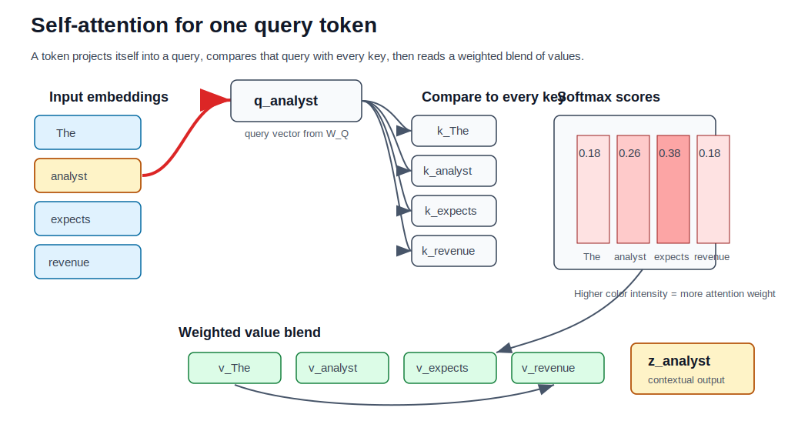
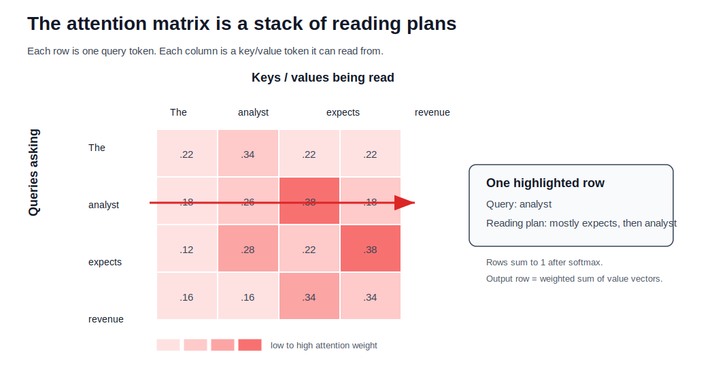

## How to print Revealjs slides

{width="80%" fig-align="center"}

# Attention Mechanism and Transformers

```{python}
#| echo: false
#| eval: true

import svgwrite
import os
from IPython.display import SVG, display
```

## From Classic Deep Learning to the Edge of Its Limits

- The 2010s: Deep Learning’s First Boom
  - Breakthroughs driven by **MLPs, CNNs, and RNN/LSTMs**  
  - Architectures changed little from their 1980s–1990s origins  
  - Gains came mostly from:
    - **GPUs + parallel computing**
    - **Massive datasets + cheap storage**
    - **Training innovations** (ReLU, batch norm, dropout, residuals, Adam)
- Why These Models Plateaued
  - CNNs dominated vision; LSTMs dominated NLP  
  - Thousands of alternative architectures proposed, but few displaced the classics  
  - Progress felt like **scaling**, not **rethinking**  
  - By mid‑2010s, the field was primed for a **new architectural paradigm**

---

## The Transformer Era

- Originally added to encoder–decoder RNNs for machine translation  
- Allowed models to [focus selectively]{.uugreen-bold} on different input tokens  
- Replaced the “single compressed vector” bottleneck  
- Enabled differentiable, learnable weighting over the entire input sequence
- Transformers: The Architectural Breakthrough
  - @Vaswani2017Attention: [no recurrence, all attention]{.uublue-bold}  
  - Rapidly outperformed RNNs across NLP tasks  
  - Became the foundation for [large-scale pretraining]{.uured-bold} (BERT, RoBERTa, GPT‑2/3)  
  - Expanded beyond NLP:
    - [**Vision Transformers**]{.uublue-bold} (image recognition, detection, segmentation)
    - [**Speech**]{.uublue-bold}, [**reinforcement learning**]{.uublue-bold}, [**graph neural networks**]{.uublue-bold}

### The New Landscape
- Transformers + large-scale pretraining → [foundation models]{.uured-bold}  
- Default approach: start with a pretrained Transformer, fine‑tune for downstream tasks  
- Represents a true [architectural shift]{.uured-bold}, not just bigger models

---

## Help-Code Bridge for Module 4

| Notebook | Best classroom use | Module 4 connection |
|---|---|---|
| `Section 4.1` | Build the transformer from parts | embeddings, self-attention, heads, encoder/decoder, positional encoding |
| `Section 4.2` | Train translation end-to-end | encoder-decoder attention and teacher forcing |
| `Section 4.3` | Inspect GPT-2 components | decoder-only blocks, causal masks, next-token generation |

::: {.callout-note}
Use these notebooks as the executable version of the lecture: slides explain the idea, notebooks let students trace tensors.
:::


# Why Attention? A Human Translation Story

## Why Attention? A Human Translation Story

- When we translate a sentence, we don’t memorize the entire thing at once.
- We **look back and forth**, focusing on the specific words we need at each moment.  
- Early sequence‑to‑sequence models [@Sutskever.Vinyals.Le.2014] didn’t do this.  
- The encoder read the whole sentence **once**, compressed it into a single vector, and handed that to the decoder.  
- The decoder then tried to generate the entire translation from that one vector.

```{python}
#| echo: false
#| label: fig-encoder-01
#| fig-align: center

from m4code.attention_diagrams import DiagramBuilder
d = DiagramBuilder(tokens=["Ich", "gehe", "nach", "Hause", "<eos>"])
image = d.encoder_only(label="encoder01")
display(SVG(image))
```

---

## Tiny Attention Examples

- Source: `"The analyst reviewed the quarterly revenue report."`
- Target: `"Der Analyst pruefte den vierteljaehrlichen Umsatzbericht genau."`
- When generating `Umsatzbericht`, attention should concentrate on `revenue report`, not on `analyst`.

::: {.fragment}
- Source: `"The model attends to earlier context tokens."`
- Decoder question: *which earlier token explains the next word?*
- Self-attention turns the sentence into a lookup table of contextual clues.
:::

---

## Section 4.2: Translation as the Test Case

::: {.columns}
::: {.column}
- Encoder reads the source sentence once.
- Decoder generates the target sentence one token at a time.
- Cross-attention lets each target token retrieve source evidence.
- This is the cleanest setting for seeing why attention solved the RNN bottleneck.
:::
::: {.column}
{width="95%" fig-alt="Encoder-decoder architecture for sequence translation."}
:::
:::

---

## The Problem With Single‑Vector Encodings

- Compressing a long, information‑rich sentence into one vector is a bottleneck.  
- RNNs struggle to retain all details, especially for long sequences.  
- Even improved architectures (Kalchbrenner et al., 2014; Yang et al., 2016) only partially help.  
- The decoder has no way to “look back” at specific words.  
- This mismatch between human translation and RNN translation motivates a new idea.

```{python}
#| echo: false
#| label: fig-bottleneck-01
#| fig-align: center

from m4code.attention_diagrams import DiagramBuilder
d = DiagramBuilder(tokens=["Ich", "gehe", "nach", "Hause", "<eos>"])
image = d.bottleneck(label="bottleneck01")
display(SVG(image))
```

---

## The Key Insight: Focus Selectively

- Humans translate by **focusing on different input words at different times**.  
- At each decoding step, we implicitly form a [distribution]{.uured-bold} over the input words:  
  - some words matter a lot,  
  - some matter a little,  
  - some don’t matter at all.  
- Ideally, the decoder should receive [only the relevant information]{.uugblue-bold} for the word it is about to produce.

```{python}
#| echo: false

from m4code.attention_diagrams import DiagramBuilder
d = DiagramBuilder(tokens=["Ich", "gehe", "nach", "Hause", "<eos>"])
image = d.focus_sequence(label="bottleneck01");

```

:::{.r-stack}

{.fragment}

{.fragment}

{.fragment}

{.fragment}

:::

---

## From Human Intuition to a Formal Mechanism

- @Bahdanau.Cho.Bengio.2014 formalized this intuition:
  - Treat the encoder outputs as a **set of key–value pairs**  
    $(\mathbf{k}_i, \mathbf{v}_i)$.  
  - At each decoding step, compute a **query** $\mathbf{q}$.  
  - Compare the query to each key to produce **attention weights**  
    $\alpha(\mathbf{q}, \mathbf{k}_i)$.  
  - Use these weights to form a **weighted sum of values**:  
    $$
    \text{Attention}(\mathbf{q}, \mathcal{D}) = \sum_i \alpha(\mathbf{q}, \mathbf{k}_i)\mathbf{v}_i.
    $$

```{python}
#| echo: false
#| eval: false
from m4code.attention_diagrams import DiagramBuilder
d = DiagramBuilder(tokens=["Ich", "gehe", "nach", "Hause", "<eos>"])
image = d.qkv_dictionary(label="qkv01", blockstyle="c");
display(SVG(image))
```

---

##  Why Queries, Keys, and Values Work So Well

This mechanism has several powerful properties:

- Works for **any input length** — no architectural changes needed.  
- The “program” (the query) is **small**, but it operates over a **large state space**.  
- The model learns **what to retrieve** and **how strongly**.  
- Special cases include:  
  - exact lookup (one weight = 1),  
  - uniform averaging,  
  - convex combinations (soft attention).  
- Softmax normalization ensures weights are nonnegative and sum to 1.


---

##  The Bridge to Transformers

::: {.columns}
::: {.column}
- Once we have queries, keys, and values, we can drop recurrence entirely.  
- @Vaswani2017Attention showed that **attention alone** can model all relationships in a sequence.  
- This leads directly to the Transformer architecture.  
- Q/K/V attention becomes the fundamental building block for:  
  - machine translation,  
  - language modeling (GPT‑2/3),  
  - masked language modeling (BERT),  
  - vision transformers,  
  - speech, RL, and graph models.
:::
::: {.column}
```{python}
#| echo: false
#| eval: true
#| fig-align: center
#| label: fig-transformer-01

import numpy as np
import matplotlib.pyplot as plt

from m4code.attention_pooling_figures import *

input_tokens = ["this", "movie", "was", "great", "I", "happy"]
query_tokens = ["I", "am", "happy", "this", "movie", "great"]

emb = load_embeddings("./data/reviews-word2vec.tiny.txt")
weights = d.compute_attention_weights_cosine(
    query_tokens = ["I", "am", "happy", "this", "movie", "great"],
    input_tokens = ["this", "movie", "was", "great", "I", "happy"],
    embeddings=emb
)
plt.imshow(weights, cmap="Reds", origin="lower")
plt.xticks(range(len(input_tokens)), input_tokens, rotation=45)
plt.yticks(range(len(query_tokens)), query_tokens)
plt.colorbar()
plt.show()

```
:::
:::

---

## Section 4.1: Transformer Parts

::: {.columns}
::: {.column}
- Token embeddings carry meaning.
- Positional encodings carry order.
- Self-attention relates every token to every other token.
- Multi-head attention learns several relation types at once.
:::
::: {.column}
{width="92%" fig-alt="Transformer architecture diagram."}
:::
:::

---

## Multi-Head Attention View

::: {.columns}
::: {.column}
{width="95%" fig-alt="Self-attention diagram."}
:::
::: {.column}
{width="95%" fig-alt="Multi-head attention diagram."}
:::
:::

---

# Self-Attention: Q/K/V From Tokens

## The Missing Step: Where Q, K, V Come From

Self-attention does not receive queries, keys, and values from outside.
It **creates them from the same token representations**.

For token matrix $X \in \mathbb{R}^{T \times d_{\text{model}}}$:

$$
Q = XW_Q,\qquad K = XW_K,\qquad V = XW_V
$$

| Matrix | Meaning | Shape |
|---|---|---|
| $Q$ | what each token is looking for | $T \times d_k$ |
| $K$ | what each token offers for matching | $T \times d_k$ |
| $V$ | information each token contributes | $T \times d_v$ |

## One Token's Attention Calculation

For token $i$ (a compact version of the step-by-step coding walkthrough in @raschka2023selfattention):

::: {.incremental}
1. Take its query $q_i$
2. Compare it to every key: $q_i k_1^\top,\ldots,q_i k_T^\top$
3. Scale by $\sqrt{d_k}$
4. Softmax across all tokens
5. Use those weights to average the value vectors
:::

$$
z_i = \sum_{j=1}^{T}
\mathrm{softmax}\!\left(\frac{q_i k_j^\top}{\sqrt{d_k}}\right)v_j
$$

## Visual Walkthrough: One Query Token

{width="96%" fig-alt="Single query token self-attention walkthrough."}

Raschka's examples are useful because they separate the computation into three teachable moves: project to Q/K/V, compute scores, then mix values [@raschka2023selfattention].

## All Tokens at Once

The whole sequence is computed in one matrix expression:

$$
Z = \mathrm{softmax}\!\left(\frac{QK^\top}{\sqrt{d_k}}\right)V
$$

| Tensor | Shape | Interpretation |
|---|---|---|
| $QK^\top$ | $T \times T$ | token-to-token compatibility |
| softmax rows | $T \times T$ | each token's attention distribution |
| output $Z$ | $T \times d_v$ | contextual token representations |

::: {.callout-note}
Each row of the attention matrix answers: "for this query token, which source tokens should I read from?"
:::

## Attention Matrix: Reading Plans

{width="92%" fig-alt="Attention matrix as a stack of query-token reading plans."}

DataCamp's framing is helpful here: self-attention lets a sequence look back at itself, while masks decide which positions are visible [@datacamp2025selfattention].

## Matrix Calculation: Tiny Example

Following the scaled dot-product sequence in @cristina2023transformerattention:

$$
Q=\begin{bmatrix}1&0\\0&1\\1&1\end{bmatrix},\quad
K=\begin{bmatrix}1&0\\1&1\\0&1\end{bmatrix},\quad
V=\begin{bmatrix}10&0\\0&10\\5&5\end{bmatrix}
$$

$$
QK^\top =
\begin{bmatrix}
1&1&0\\
0&1&1\\
1&2&1
\end{bmatrix}
\quad\Rightarrow\quad
\frac{QK^\top}{\sqrt{2}} =
\begin{bmatrix}
0.71&0.71&0.00\\
0.00&0.71&0.71\\
0.71&1.41&0.71
\end{bmatrix}
$$

## Matrix Calculation: Softmax Then Values

Row-wise softmax turns scores into attention weights:

$$
A=\mathrm{softmax}\!\left(\frac{QK^\top}{\sqrt{2}}\right)
\approx
\begin{bmatrix}
0.401&0.401&0.198\\
0.198&0.401&0.401\\
0.248&0.503&0.248
\end{bmatrix}
$$

Then each output row is a weighted blend of value rows:

$$
Z=AV\approx
\begin{bmatrix}
5.000&5.000\\
3.983&6.017\\
3.724&6.276
\end{bmatrix}
$$

::: {.callout-tip}
Rows in $A$ are "reading plans"; rows in $Z$ are the resulting contextual token vectors.
:::

## Q/K/V Implementation Pattern

Most implementations compute all three projections with one linear layer:

```{python}
#| echo: true
#| eval: false
batch_size, seq_len, d_model = x.shape
qkv = qkv_proj(x)                         # [B, T, 3 * d_model]
qkv = qkv.reshape(batch_size, seq_len, num_heads, 3 * head_dim)
qkv = qkv.permute(0, 2, 1, 3)             # [B, H, T, 3 * D_head]
q, k, v = qkv.chunk(3, dim=-1)            # each [B, H, T, D_head]
```

This is the pattern used in the UVA Transformer tutorial: one projection for efficiency, then reshape into heads [@lippe2021uvadltransformers].

## Self, Cross, and Masked Attention

| Type | Queries come from | Keys/values come from | Used in |
|---|---|---|---|
| Self-attention | Same sequence | Same sequence | Encoder, BERT |
| Masked self-attention | Target prefix | Target prefix | GPT, decoder generation |
| Cross-attention | Decoder states | Encoder outputs | Translation, seq2seq |

::: {.callout-note}
Self-attention is a sequence reading itself. Cross-attention is one sequence retrieving evidence from another [@datacamp2025selfattention].
:::

## Causal Mask: Prevent Looking Ahead

For decoder-only language modeling:

$$
\text{mask}_{ij} =
\begin{cases}
0 & j \le i \\
-\infty & j > i
\end{cases}
$$

```text
        key positions
        1  2  3  4
q=1    ok  X  X  X
q=2    ok ok  X  X
q=3    ok ok ok  X
q=4    ok ok ok ok
```

The triangular mask makes training match generation: predict the next token using only earlier tokens.

## Why Position Encodings Are Necessary

Self-attention by itself treats tokens as a set.

::: {.incremental}
- Shuffle the input tokens
- The attention computation shuffles the outputs the same way
- Nothing in $QK^\top$ says "this token came first"
- Positional information must be injected into the token representations
:::

Common choices: sinusoidal encodings, learned absolute embeddings, relative position embeddings, RoPE, and ALiBi.

## Multi-Head Attention: Parallel Relation Types

One attention head gives one weighted average.
Language needs many relation types at once.

| Head might learn | Example relation |
|---|---|
| Local syntax | adjective modifies noun |
| Long-range reference | pronoun points to entity |
| Position pattern | previous token, next phrase |
| Domain cue | "revenue" attends to "growth" |

Multi-head attention lets the model learn several retrieval patterns in parallel.

## Multi-Head Attention Formula

$$
\begin{aligned}
\text{head}_h &= \text{Attention}(QW_h^Q, KW_h^K, VW_h^V)\\
\text{MHA}(Q,K,V) &= \text{Concat}(\text{head}_1,\ldots,\text{head}_H)W^O
\end{aligned}
$$

Each head works in a smaller subspace:

$$d_{\text{head}} = d_{\text{model}} / H$$

The output projection $W^O$ mixes the heads back into the model dimension.


# Attention Pooling by Similarity

## Motivation: Why Attention Pooling?

- Before Transformers, attention already existed in classical statistics  
- Nadaraya–Watson regression is one of the earliest “attention‑like” mechanisms  
- It uses [similarity]{.uured-bold} between a query and keys to compute a weighted average of values  
- This gives us a clean bridge from classical kernels → modern attention  

```{python}
#| echo: false
#| eval: false

from m4code.attention_pooling_figures import *

fig_kernels_svg()
# fig_regression_svg()
# fig_attention_kernels_svg()
# fig_regression_sigmas_svg()
# fig_attention_sigmas_svg()

```


---

## The Core Idea

::: {.columns}
::: {.column}
- This is attention pooling in its purest form  
- No training, no parameters, no deep nets  
- Just:  
  1. Compute similarity  
  2. Normalize  
  3. Weighted sum  

:::
::: {.column}
$$
f(q) = \sum_i v_i \frac{\alpha(q, k_i)}{\sum_j \alpha(q, k_j)}
$$

:::
:::


---

## Kernels as Similarity Functions

$$
\alpha(q, k) = 
\begin{cases}
\exp(-\|q-k\|^2/2) & \text{Gaussian} \\
1 & \text{if } |q-k| < 1 \\
\max(0, 1 - |q-k|) & \text{Epanechikov}
\end{cases}
$$

```{python}
#| echo: false
#| eval: true
#| fig-align: center
#| label: fig-kernels-01
#| fig-cap: "Common kernels used in Nadaraya–Watson regression."
#| fig-alt: "Line plots of Gaussian, Boxcar, and Epanechikov kernels."

from m4code.attention_pooling_figures import *

fig_kernels_svg()
# fig_regression_svg()
# fig_attention_kernels_svg()
# fig_regression_sigmas_svg()
# fig_attention_sigmas_svg()

```


---

## Generating Synthetic Data

- A simple nonlinear function  
- Add noise to simulate real data  
- We’ll use kernel regression to approximate it  

```{python}
#| echo: false
#| eval: true

def f(x):
    return 2 * torch.sin(x) + x

n = 40
x_train = torch.sort(torch.rand(n) * 5)[0]
y_train = f(x_train) + torch.randn(n)

x_val = torch.arange(0, 5, 0.1)
y_val = f(x_val)
```

### Nadaraya–Watson Attention Pooling

- Each validation point is a [query]{.uured-bold}  
- Each training point is a [key–value pair]{.uured-bold}  
- The normalized kernel weights are [attention weights]{.uured-bold}  

```{python}
#| echo: false
#| eval: true

def nadaraya_watson(x_train, y_train, x_val, kernel):
    dists = x_train[:, None] - x_val[None, :]
    k = kernel(dists)
    weights = k / k.sum(dim=0, keepdim=True)
    y_hat = y_train @ weights
    return y_hat, weights
```

---

## Regression Results

- All kernels except “constant” produce reasonable fits  
- Gaussian is smoothest  
- Boxcar is sharpest  

```{python}
#| echo: false
#| eval: true

kernels = [constant, boxcar, gaussian, epanechikov]
names = ["Constant","Boxcar", "Gaussian", "Epanechikov"]

fig, axes = plt.subplots(1, 3, figsize=(12, 3))
for ax, kernel, name in zip(axes, kernels, names):
    y_hat, _ = nadaraya_watson(x_train, y_train, x_val, kernel)
    ax.plot(x_val, y_val, "k--", label="true")
    ax.plot(x_val, y_hat, label="estimate")
    ax.scatter(x_train, y_train, alpha=0.5)
    ax.set_title(name)
    ax.legend()
plt.show()
```


---

## Attention Weights as Heatmaps

- Each column = a query  
- Each row = a training point  
- Bright = high attention weight  
- Gaussian, Boxcar, Epanechikov → very similar patterns  

```{python}
#| echo: false
#| eval: true
#| fig-align: center
#| label: fig-attention-kernels

from m4code.attention_pooling_figures import *

# fig_kernels_svg()
# fig_regression_svg()
fig_attention_kernels_svg()
# fig_regression_sigmas_svg()
# fig_attention_sigmas_svg()
```


---

## Kernel Width Matters

- Narrow kernels → sharp, local attention  
- Wide kernels → smooth, global attention  
- Small $\sigma$ → attention collapses to nearest neighbors  
- Large $\sigma$ → attention spreads across many points  


```{python}
#| echo: false
#| eval: true
#| fig-align: center
#| label: fig-attention-sigmas

from m4code.attention_pooling_figures import *

# fig_kernels_svg()
# fig_regression_svg()
# fig_attention_kernels_svg()
fig_regression_sigmas_svg()
# fig_attention_sigmas_svg()
```


---

## Why This Matters for Transformers

- Nadaraya–Watson is a **precursor** to modern attention  
- Same structure:  
  - similarity → softmax → weighted sum  
- But:  
  - kernels are hand‑crafted  
  - representations are fixed  
  - no learning  
- Transformers replace kernels with **learned Q/K/V projections**  

---

## Motivation for Attention Scoring Functions

[Goal:]{.uured-bold} Understand how we compute the *compatibility* between a query and a set of keys.

- Attention pooling requires a score $a(q, k_i)$ for each key.  
- These scores determine how much each value contributes to the output.  
- We want scoring functions that are:
  - computationally efficient  
  - numerically stable  
  - expressive enough to model interactions  
- Two dominant families:
  - [Dot‑product attention]{.uublue-bold}
  - [Additive attention]{.uublue-bold}

---

## From Distance Kernels to Learnable Scoring

- [Context:]{.uured-bold} Earlier, we used Gaussian kernels to model similarity.  
- [Issue:]{.uured-bold} Distance computations are more expensive than dot products.
    - Terms depending only on $q$ cancel out after softmax normalization.  
    - Layer normalization often keeps $\|k_i\|$ roughly constant.  
    - This motivates dropping norm‑dependent terms and focusing on dot products.

---

## Dot‑Product Attention


::: {.columns}
::: {.column}
- Measures alignment between query and key.  
- Works best when $q$ and $k_i$ have similar scale.
- If $q, k_i \in \mathbb{R}^d$ with i.i.d. components, $\mathrm{Var}(q^\top k_i) = d$.  
- Large $d$ → large variance → unstable softmax.

:::
::: {.column}
$$
a(q, k_i) = q^\top k_i
$$

:::
:::

---

## Scaled Dot‑Product Attention

::: {.columns}
::: {.column}
- **Fix:** Rescale by $1/\sqrt{d}$.
- Keeps logits in a stable range.  
- Prevents softmax from saturating.  
- Used in Transformers and nearly all modern architectures.

:::
::: {.column}
$$
\begin{align}
a(q, k_i) = \frac{q^\top k_i}{\sqrt{d}}\\
\alpha(q, k_i) = \mathrm{softmax}(a(q, k_i))
\end{align}
$$

:::
:::

---

## Batched Scaled Dot‑Product Attention

- For queries $Q \in \mathbb{R}^{n \times d}$, keys $K \in \mathbb{R}^{m \times d}$, values $V \in \mathbb{R}^{m \times v}$:

$$
\begin{align}
\mathrm{Attention}(Q, K, V) = \mathrm{softmax}\!\left(\frac{QK^\top}{\sqrt{d}}\right)V
\end{align}
$$

---

## Masked Softmax

- NLP sequences have variable lengths.  
- Padding tokens should not contribute to attention.
- Mechanism:
  - Replace padded positions with a large negative value (e.g., $-10^6$).  
  - After softmax, these positions contribute zero.

---

## Padding Mask vs Causal Mask

| Mask | Blocks | Why |
|---|---|---|
| Padding mask | `[PAD]` tokens | variable-length batches |
| Causal mask | future tokens | autoregressive generation |
| Cross-attention mask | padded source tokens | encoder-decoder retrieval |

Implementation trick: add a very negative number to blocked logits **before** softmax.

```text
logits:    [ 2.1,  0.7, -0.4,  1.2]
mask:      [ ok,   ok,  pad,  pad]
masked:    [ 2.1,  0.7, -inf, -inf]
softmax:   [ .80,  .20,  .00,  .00]
```

---

## Additive Attention

- Dot‑product attention requires $q$ and $k_i$ to have the same dimension.  
- Additive attention handles mismatched dimensions naturally.
- A small MLP computes compatibility.  
- Often used in early seq2seq models (Bahdanau attention).

$$
\begin{align}
a(q, k_i) = w_v^\top \tanh(W_q q + W_k k_i)
\end{align}
$$


---

## Comparing Dot‑Product and Additive Attention

- Dot‑Product Attention
  - Fast (matrix multiplications)  
  - Scales well to large models  
  - Standard in Transformers  
- Additive Attention
  - More flexible with dimensionality  
  - Slightly more expensive  
  - Historically important in seq2seq models  


---

# Transformer Blocks

## Inside One Transformer Encoder Block

```text
x
 -> Multi-head self-attention
 -> residual add + layer norm
 -> position-wise feed-forward network
 -> residual add + layer norm
 -> contextualized x
```

::: {.callout-note}
Attention moves information **between positions**. The feed-forward network transforms information **within each position**.
:::

## Why Residual Connections and LayerNorm?

::: {.incremental}
- Residual connections preserve the original token stream
- They keep gradients flowing through deep stacks
- LayerNorm stabilizes feature scales across tokens
- Dropout regularizes attention weights and MLP activations
:::

Without residuals, a randomly initialized attention layer can blur token identity before the model has learned useful retrieval.

## Position-Wise Feed-Forward Network

The same MLP is applied independently to every token position:

$$
\mathrm{FFN}(x) = \max(0, xW_1 + b_1)W_2 + b_2
$$

Typical transformer blocks expand then contract:

```text
d_model -> 4 * d_model -> d_model
```

For LLMs, this MLP often contains more parameters than the attention projections.

## Encoder, Decoder, Encoder-Decoder

| Architecture | Attention pattern | Common models | Best for |
|---|---|---|---|
| Encoder-only | bidirectional self-attention | BERT | classification, retrieval, NER |
| Decoder-only | causal self-attention | GPT | generation, chat, agents |
| Encoder-decoder | encoder self-attn + decoder causal + cross-attn | T5, original Transformer | translation, summarization |

The same Q/K/V mechanism appears in all three. What changes is the mask and where Q/K/V are drawn from.

## Why Transformers Replaced RNNs

| Property | RNN/LSTM | Self-attention |
|---|---|---|
| Parallel training | sequential over time | all positions at once |
| Long path length | grows with distance | one attention step |
| Context access | compressed hidden state | direct token-token retrieval |
| Main cost | recurrence bottleneck | $O(T^2)$ attention matrix |

Transformers won the pretraining era because they turn sequence modeling into large, parallel matrix operations.

---

## When to Use Which Scoring Function
- dot‑product attention when:
  - Query and key dimensions match  
  - You need speed and scalability  
  - You’re building Transformer‑style models  
- additive attention when:
  - Query and key dimensions differ  
  - You want a more expressive scoring function  
  - Model size is small enough that cost is negligible  

---

## Summary

- Attention scoring functions compute compatibility between queries and keys.  
- Scaled dot‑product attention is the default in modern architectures.  
- Additive attention is more flexible but slower.  
- Masked softmax is essential for variable‑length sequences.  
- Efficient implementations rely on batch matrix multiplication.

---

## References
