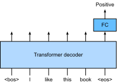

## How to print Revealjs slides

{width="80%" fig-align="center"}

# From Pretraining to Deployment

## The Modern AI Development Lifecycle

::: {.columns}
::: {.column width="48%"}
1. [Pretraining]{.uublue-bold} — learn general language representations from a massive corpus
2. [Adaptation]{.uublue-bold} — specialize the pretrained model for a target task or domain
   1. Full fine-tuning
   2. Instruction tuning
   3. Reinforcement learning from human feedback (RLHF)
   4. Parameter-efficient fine-tuning (PEFT)

:::

::: {.column width="52%"}
Hugging Face model pages often expose this lifecycle as related artifacts:

- [Base model]{.uured-bold} - General next-token distribution
- [Finetunes]{.uured-bold} - New behavior learned into weights
- [Adapters]{.uured-bold} - Detachable task/domain behavior
- [Merges]{.uured-bold} - Combined checkpoints for serving
- [Quantizations]{.uured-bold} - Smaller memory footprint for inference
:::
:::

- Smaller artifacts and quantized variants make larger models (and /or longer context windows, or higher-throughput generation) more practical on limited hardware.

## LLM Training Cycle

| Stage | Objective | Typical data | What changes? |
|---|---|---|---|
| **Pretraining** | Learn language and world patterns | Raw text/code | All weights |
| [Instruction tuning]{.uured-bold} | Learn to follow tasks | Prompt-response pairs | Usually all weights or PEFT |
| **Preference alignment** | Prefer helpful/safe responses | Rankings or preferences | Policy/reward behavior |
| **Deployment adaptation** | Fit a business workflow | Logs, labels, evals | Prompt, RAG, adapter, or model |


## In-Context Learning vs Fine-Tuning

| Choice | Where examples live | Parameter update? | Output |
|---|---|:---:|---|
| In-context learning | Prompt window | No | Temporary behavior |
| Prompt templates | Application code | No | Reusable task framing |
| Full fine-tuning | Model weights | Yes, all | New checkpoint |
| LoRA / QLoRA | Adapter weights | Yes, few | Adapter checkpoint |

Fine-tuning is not "a better prompt." It creates a new learned behavior that persists after the prompt disappears.

## Pretraining Objectives

| Objective | Architecture | Example |
|-----------|-------------|---------|
| Masked Language Modeling (MLM) | Encoder | BERT |
| Causal Language Modeling (CLM) | Decoder | GPT |
| Sequence-to-Sequence (Span Corruption) | Encoder-Decoder | T5, BART |

The objective shapes what the model learns to *do*: fill gaps (BERT) vs predict continuations (GPT).

## Transformer Stack Cheat Sheet

| Model family | Stack | Attention pattern | Best at |
|---|---|---|---|
| **BERT** | Encoder-only | Bidirectional self-attention | Understanding, classification, extraction |
| **GPT** | Decoder-only | Causal masked self-attention | Generation, chat, completion |
| **T5/BART** | Encoder-decoder | Encoder self-attention + decoder cross-attention | Translation, summarization, seq2seq |

::: {.callout-note}
The original Transformer has both encoder and decoder stacks. GPT keeps the decoder-style causal stack but removes encoder-decoder cross-attention because there is no encoder source sequence.
:::

## Technical Stack View

```text
BERT encoder block:
  bidirectional self-attention -> MLP

GPT decoder-only block:
  causal self-attention -> MLP

Original/T5 decoder block:
  causal self-attention -> cross-attention over encoder states -> MLP
```

The fine-tuning recipe depends on which stack produces the representation or next-token distribution.

## Masked Language Modeling (MLM)

BERT randomly masks 15% of tokens and trains the model to predict the missing words.

```
Input:  "The company reported strong [MASK] growth in Q3."
Target:              ↑ "revenue"
```

::: {.callout-note}
MLM forces **bidirectional** context — the model sees tokens on both sides of each mask.
This makes BERT excellent for classification, NER, and QA but not text generation.
:::

## Causal Language Modeling (CLM)

GPT-style models predict the next token, seeing only past context (autoregressive).

```
Input:   "The company reported strong"
Predict: "revenue" → "growth" → "in" → "Q3"
```

::: {.callout-note}
CLM enables **open-ended text generation** but limits direct use of future context during encoding.
:::

## GPT Is Decoder-Only

::: {.columns}
::: {.column}
- No encoder stack.
- No encoder-decoder cross-attention to a source sentence.
- Masked self-attention prevents looking ahead.
- Generation repeats: predict one token, append it, predict again.
:::
::: {.column}
{width="95%" fig-alt="Comparison of ELMo, GPT, and BERT architectures."}
:::
:::

## Causal Mask Mini Example

```
Prompt:  "The analyst expects"
Step 1:  predict "revenue"
Step 2:  "The analyst expects revenue" → predict "growth"
Step 3:  "The analyst expects revenue growth" → predict "this"
```

Future words are hidden during training, so GPT learns the same left-to-right constraint it uses at inference.

## Self-Attention From Scratch: The Flow

Raschka's from-scratch walkthrough is the useful mental model [@raschka2023selfattentionfromscratch]:

```text
token ids -> embeddings X
X @ W_Q -> queries Q
X @ W_K -> keys K
X @ W_V -> values V
QK^T / sqrt(d_k) -> compatibility scores
softmax(scores) @ V -> contextual token vectors
```

::: {.callout-note}
Each token asks a query, compares it to every key, then reads a weighted blend of value vectors.
:::

## One Query Token, Step by Step

For token $i$:

$$
q_i=x_iW_Q,\qquad k_j=x_jW_K,\qquad v_j=x_jW_V
$$

$$
\omega_{ij}=q_i k_j^\top,\qquad
\alpha_{ij}=\mathrm{softmax}_j\left(\frac{\omega_{ij}}{\sqrt{d_k}}\right),
\qquad
z_i=\sum_j \alpha_{ij}v_j
$$

The output $z_i$ is the same token position, but enriched with context from other positions.

## Masking Changes the Reading Plan

In GPT, token $i$ can read only positions $\le i$.

```text
scores before softmax

        The analyst expects revenue
The       ✓
analyst   ✓       ✓
expects   ✓       ✓       ✓
revenue   ✓       ✓       ✓       ✓
```

Masked entries are set to a very negative number before softmax, so their attention weight becomes nearly zero.

# Transfer Learning Paradigm

## Why Transfer Learning Works

Pretraining on large text corpora gives the model:

- **Syntactic knowledge** — sentence structure and grammar
- **Semantic knowledge** — word meaning and relationships
- **World knowledge** — facts encoded in training text
- **Task-adjacent skills** — reading comprehension, reasoning patterns

Fine-tuning on a small labelled dataset then *steers* this knowledge toward the target task.

## The Fine-Tuning Spectrum

```
← Less compute                          More compute →

Zero-shot    Few-shot    Prompt     PEFT      Full Fine-Tune
             prompting   Tuning    (LoRA)

← Less data needed                      More data needed →
```

The right approach depends on: data availability, compute budget, and task difficulty.

## Tiny Adaptation Examples

| Strategy | Tiny input | Desired behavior |
|---|---|---|
| Prompting | "Summarize quarterly risks in two bullets." | Follow task instructions immediately |
| Few-shot | "Revenue rose despite higher cloud costs." | Match examples in context |
| Fine-tuning | "Classify vendor delays as supply-chain risk." | Learn a stable label mapping |

::: {.callout-note}
The same transformer backbone can support all three; what changes is whether behavior comes from context, examples, or updated weights.
:::

## Where Adaptation Attaches

::: {.columns}
::: {.column}
{width="95%" fig-alt="BERT encoder with a classification head for fine-tuning."}
:::
::: {.column}
{width="95%" fig-alt="GPT-style decoder with a classification head for fine-tuning."}
:::
:::

# Full Fine-Tuning

## What is Full Fine-Tuning?

Update **all** model parameters on labelled task data.

Procedure:

::: {.incremental}
1. Start from a pretrained checkpoint (e.g., `bert-base-uncased`)
2. Add a task-specific head (e.g., linear classifier)
3. Train on labelled data with a small learning rate
4. Evaluate on held-out test set
:::

## PyTorch: Classification Head

```{python}
#| eval: false
#| echo: true
import torch.nn as nn

class BertClassifier(nn.Module):
    def __init__(self, bert_hidden: int = 768, num_classes: int = 3):
        super().__init__()
        # In practice: load from transformers.BertModel
        self.encoder = nn.Identity()          # placeholder
        self.dropout = nn.Dropout(0.1)
        self.classifier = nn.Linear(bert_hidden, num_classes)

    def forward(self, cls_embedding):
        return self.classifier(self.dropout(cls_embedding))
```

## Challenges of Full Fine-Tuning

::: {.incremental}
- **Catastrophic forgetting** — model loses general capabilities
- **Compute cost** — updating billions of parameters is expensive
- **Data requirements** — needs thousands of labelled examples
- **Storage** — one full copy of weights per fine-tuned task
:::

## Memory Shock: What Must Fit?

For full fine-tuning, GPU memory holds more than the model weights:

| Component | Typical precision | Why it exists |
|---|---:|---|
| Model weights | fp16/bf16 | Forward pass |
| Gradients | fp16/bf16 | Backpropagation |
| Optimizer states | fp32 often | Adam moments / updates |
| Activations | fp16/bf16 | Needed for backward pass |

::: {.callout-warning}
A 7B model is not just "14 GB." Training needs weights, gradients, optimizer states, activations, and padding for memory spikes.
:::

## Back-of-the-Envelope Cost

Assume 16-bit weights and gradients, plus Adam optimizer states.

| Model size | Weights only | Rough full-tune training state |
|---|---:|---:|
| 7B | 14 GB | 80+ GB |
| 13B | 26 GB | 150+ GB |
| 65B | 130 GB | 700+ GB |

The exact number depends on optimizer, sequence length, batch size, activation checkpointing, and sharding.

## Catastrophic Forgetting

Task-specific tuning can improve one behavior while damaging others.

::: {.incremental}
- A summarization-tuned model may become worse at open-ended chat
- A narrow finance classifier may overuse the training taxonomy
- A small dataset can teach style artifacts instead of the intended skill
- Multi-task instruction data helps preserve broad capability, but costs more
:::

PEFT helps because the base model remains intact and task behavior lives in removable adapter weights.

# Instruction Tuning

## What is Instruction Tuning?

Fine-tune on **(instruction, response)** pairs to teach the model to follow natural language commands.

```
Instruction: "Classify the sentiment of the following review as POSITIVE or NEGATIVE."
Input:       "The product broke after two days of use."
Response:    "NEGATIVE"
```

Examples: FLAN-T5, InstructGPT, Alpaca.

## Why Instruction Tuning Matters

::: {.incremental}
- Models become far more useful for end users without programming
- A single model can handle hundreds of tasks (zero-shot generalisation)
- Enables natural language as the interface to AI systems
:::

# RLHF: Reinforcement Learning from Human Feedback

## The RLHF Pipeline

RLHF (Ouyang et al., 2022 — InstructGPT) aligns models with human preferences:

::: {.incremental}
1. **Supervised Fine-Tuning (SFT)** — fine-tune on human-written demonstrations
2. **Reward Model Training** — train a model to predict human preference scores
3. **PPO Optimisation** — use RL to maximise reward while staying close to the SFT baseline
:::

## Why RLHF is Hard

- Human labellers must rank thousands of output pairs
- Reward models can be gamed (reward hacking)
- PPO is computationally expensive and unstable
- Alternative: **Direct Preference Optimization (DPO)** — simpler, no reward model needed

# Parameter-Efficient Fine-Tuning (PEFT)

## PEFT Families

| Family | What is trained? | Examples | Tradeoff |
|---|---|---|---|
| **Additive** | New small modules or tokens | Adapters, prompt tuning, prefix tuning | Modular, sometimes adds latency/context |
| **Selective** | A subset of existing parameters | Bias-only / BitFit, partial layers | Simple, may underfit |
| **Reparameterized** | Low-dimensional update factors | LoRA, AdaLoRA, QLoRA | Strong quality-memory balance |

LoRA is popular because it is easy to add, cheap to save, and can be merged into the base weights for inference.

## Why PEFT Works

Full fine-tuning updates every parameter, but adaptation often lives in a much smaller subspace.

::: {.incremental}
- Intrinsic-dimension work shows that some LM tasks can be solved by optimizing surprisingly few directions [@Aghajanyan2020IntrinsicDimensionality]
- LoRA exploits this by learning a **low-rank update** instead of a full matrix update [@Hu2021LoRA]
- QLoRA keeps the base model quantized and trains only LoRA adapters [@Dettmers2023QLoRA]
:::

## The PEFT Design Pattern

Freeze the pretrained model and train a small set of added parameters.

::: {.incremental}
- **LoRA** — learn low-rank updates to weight matrices: $W' = W + \Delta W = W + BA$
- **Prefix Tuning** — prepend learnable tokens to the input sequence
- **Prompt Tuning** — learn soft prompt embeddings only
- **QLoRA** — quantize frozen base weights to 4-bit and backprop through LoRA adapters
:::

## LoRA: Low-Rank Adaptation

$$\Delta W = \frac{\alpha}{r} B A \quad \text{where } B \in \mathbb{R}^{d \times r},\; A \in \mathbb{R}^{r \times k},\; r \ll \min(d,k)$$

::: {.incremental}
- Rank $r$ controls the number of trainable parameters
- $\alpha/r$ scales the adapter update
- Typical $r \in \{4, 8, 16, 32\}$ — reduces parameters by 100–10,000×
- At inference: merge $\Delta W$ back into $W$ — **no latency overhead**
:::

## LoRA Runs in Parallel

```text
             frozen path
x --------> W0 x ------------------+
                                    +---- h
x -> dropout -> A -> B -> alpha/r --+
             trainable path
```

During training, $W_0$ is frozen and only $A$ and $B$ get gradients.

During inference, merge the paths:

$$W_{\text{merged}} = W_0 + \frac{\alpha}{r}BA$$

## LoRA Parameter Math

For a dense layer $W \in \mathbb{R}^{4096 \times 4096}$:

| Update type | Trainable parameters |
|---|---:|
| Full update $\Delta W$ | 16,777,216 |
| LoRA rank 8 | 65,536 |
| LoRA rank 16 | 131,072 |
| LoRA rank 32 | 262,144 |

Rank 8 trains **0.39%** of the layer update.

## Full vs LoRA Memory Intuition

| Approach | Frozen base | Trainable params | Optimizer state for base? | Saved task artifact |
|---|:---:|:---:|:---:|---|
| Full fine-tuning | No | All weights | Yes | Full model |
| LoRA | Yes | $A,B$ adapters | No | Adapter |
| QLoRA | 4-bit frozen | $A,B$ adapters | No | Adapter |

The optimizer-state savings are often the real win, not just fewer trainable weights.

## Where LoRA Usually Goes

In decoder-only LLMs, LoRA is commonly attached to attention projections:

```text
hidden states
   -> q_proj + LoRA(q)
   -> k_proj + LoRA(k)
   -> v_proj + LoRA(v)
   -> o_proj + LoRA(o)
```

::: {.callout-note}
This is why the self-attention details matter for fine-tuning: LoRA changes how tokens ask questions (`q_proj`), match context (`k_proj`), read information (`v_proj`), or mix head outputs (`o_proj`). For classification, `q_proj` and `v_proj` may be enough. For instruction tuning, many recipes target all attention projections, sometimes MLP projections too.
:::

## Which Modules Should We Target?

Evidence from LoRA and practical QLoRA guides suggests two useful starting points [@Hu2021LoRA; @Dettmers2023QLoRA; @sooriyarachchi2023efficient]:

| Target modules | Trainable params | When to try |
|---|---:|---|
| `q_proj`, `v_proj` | Lowest | First pass, classification, limited GPU |
| `q_proj`, `k_proj`, `v_proj`, `o_proj` | Medium | Better instruction following |
| All linear layers | Highest | Generation quality is weak or task shift is larger |

Rank is not the only quality knob. Which matrices receive adapters can matter more than doubling $r$.

## Rank: Why Bigger Is Not Always Better

LoRA experiments show that higher rank does not always discover more useful directions.

::: {.incremental}
- Low ranks often capture the dominant task-update directions
- Larger ranks can add capacity, but may add noisy or redundant directions
- Practical rule: increase target coverage before making rank huge
- Evaluate behavior, not just training loss
:::

## Minimal LoRA Configuration

```{python}
#| echo: true
#| eval: false
from peft import LoraConfig, TaskType

lora_config = LoraConfig(
    r=16,
    lora_alpha=32,
    lora_dropout=0.05,
    target_modules=["q_proj", "v_proj"],
    task_type=TaskType.CAUSAL_LM,
)
```

Key knobs: rank `r`, scaling `alpha`, dropout, and which modules receive adapters.

## Training Loop: What Actually Happens?

```text
1. Format examples as prompt -> response
2. Tokenize and mask/pad consistently
3. Load base model
4. Attach LoRA modules
5. Train with SFT loss
6. Save adapter checkpoint
7. Evaluate on held-out behavior
```

The model is still trained with next-token prediction. The trick is that the desired response is now part of the supervised sequence.

## SFTTrainer-Style Recipe

```{python}
#| echo: true
#| eval: false
from trl import SFTTrainer

trainer = SFTTrainer(
    model=model,
    train_dataset=train_data,
    eval_dataset=valid_data,
    peft_config=lora_config,
    args=training_args,
)
trainer.train()
```

In production runs, track hyperparameters, eval metrics, and artifacts with MLflow or a similar experiment tracker.

# QLoRA

## The QLoRA Idea

QLoRA combines quantization and LoRA:

::: {.incremental}
1. Load the pretrained model weights in **4-bit** precision
2. Freeze those quantized weights
3. Train LoRA adapters with gradients flowing through the frozen model
4. Save only the adapter weights, not a full model copy
:::

QLoRA made it possible to fine-tune a 65B model on a single 48GB GPU while preserving 16-bit fine-tuning performance in the original paper [@Dettmers2023QLoRA].

## Quantization in One Slide

Quantization stores continuous values in fewer discrete buckets.

Example: map fp32 values into int8 using an absolute-maximum scale:

$$
X_{\text{quant}}=\operatorname{round}\left(\frac{127}{\max |X|}X\right),
\quad
X_{\text{dequant}}=\frac{\max |X|}{127}X_{\text{quant}}
$$

This saves memory, but the bucket design matters: poor buckets waste precision or distort outliers.

## Quantization Vocabulary

| Term | Meaning | Why it matters |
|---|---|---|
| `fp16` / `bf16` | 16-bit training/inference values | Common baseline |
| `int8` | 8-bit compressed weights | Often good for inference memory |
| `nf4` | 4-bit NormalFloat | Designed for normally distributed weights |
| Double quantization | Quantize quantization constants | Saves extra memory |
| Paged optimizer | Moves optimizer state to manage spikes | Avoids out-of-memory bursts |

## NF4: Why Not Plain 4-bit Integers?

LLM weights are often roughly zero-centered and bell-shaped.

::: {.incremental}
- Uniform 4-bit integers spend buckets evenly across a range
- NF4 places buckets according to normal-distribution quantiles
- More buckets land where weights are dense
- QLoRA computes in bf16/fp16 after dequantizing the frozen weights
:::

NF4 is storage precision, not the full computation precision.

## Blockwise and Double Quantization

Outliers make one global scale inefficient, so QLoRA quantizes weights in blocks.

```text
weight tensor
   -> split into blocks
   -> store 4-bit values per block
   -> store scale constant per block
   -> quantize the scale constants too
```

Double quantization reduces the overhead of storing many block-level constants.

## Paged Optimizers

Long sequences and activation checkpointing can create temporary memory spikes.

Paged optimizers use unified memory to move optimizer state between GPU and CPU when needed.

::: {.callout-note}
Paged optimizers do not make training free. They make occasional spikes less likely to crash the run.
:::

## Loading a 4-bit Model

```{python}
#| echo: true
#| eval: false
import torch
from transformers import AutoModelForCausalLM, BitsAndBytesConfig

bnb_config = BitsAndBytesConfig(
    load_in_4bit=True,
    bnb_4bit_quant_type="nf4",
    bnb_4bit_compute_dtype=torch.bfloat16,
    bnb_4bit_use_double_quant=True,
)

model = AutoModelForCausalLM.from_pretrained(
    "TinyLlama/TinyLlama-1.1B-Chat-v1.0",
    quantization_config=bnb_config,
    device_map="auto",
)
```

## SFT with PEFT: The Workflow

```text
Finance records
   -> prompt template
   -> tokenized dataset
   -> base model + LoRA/QLoRA
   -> train/evaluate
   -> save adapter
   -> merge or load adapter at inference
```

The dataset usually matters more than heroic hyperparameter tuning.

## Finance Example: Risk Labeling

```text
### Instruction:
Classify the disclosure sentence as one risk type:
competition, regulation, supply_chain, macro, cybersecurity, other.

### Input:
The Company faces intense competition from established and emerging firms.

### Response:
competition
```

This is **behavioral specialization**: we are teaching a stable label ontology and response format.

## Baseline Before You Tune

Before training any adapter, record:

::: {.incremental}
- Base-model output on 10-20 representative prompts
- Prompt-only baseline accuracy/F1
- RAG baseline if task depends on source documents
- Format compliance rate
- Failure examples students can inspect after tuning
:::

Fine-tuning should beat a serious prompting baseline, not just "feel better."

## What to Tune First

| Knob | Good starting point | If results are weak |
|---|---|---|
| Rank `r` | 8 or 16 | Increase to 32 |
| Learning rate | `2e-4` for LoRA SFT | Try `1e-4` or `5e-5` |
| Epochs | 1-3 | Stop before memorization |
| Max length | Match task text | Raise for long disclosures |
| Target modules | `q_proj`, `v_proj` | Add `k_proj`, `o_proj`, MLP |

## Databricks LoRA Case Study

The Databricks LoRA guide fine-tuned OpenLLaMA-3B on 5,000 prompt-response examples and compared QLoRA settings [@sooriyarachchi2023efficient].

| Setup | Target modules | Updated params | Qualitative result |
|---|---|---:|---|
| QLoRA, `r=8` | `q_proj`, `v_proj` | 2.66M | Low quality |
| QLoRA, `r=16` | attention blocks | 5.32M | Similar quality |
| QLoRA, `r=8` | all linear layers | 13.0M | Higher quality |
| LoRA, `r=8` | all linear layers | 13.0M | Similar quality |

Takeaway: in that run, targeting more modules mattered more than doubling rank.

## Adapter Deployment Choices

| Deployment pattern | Benefit | Cost |
|---|---|---|
| Load base + adapter | Swap tasks cheaply | Slight extra adapter path |
| Merge adapter into base | Lower inference overhead | One merged model per task |
| Keep many adapters | Multi-tenant specialization | Adapter routing/evaluation needed |

For a course finance workflow, keeping adapters separate is great for comparison and grading.

## Failure Modes

::: {.incremental}
- **Bad labels** produce confidently bad behavior
- **Tiny datasets** can teach format but not robust decision boundaries
- **High learning rates** can erase useful base-model behavior
- **Domain facts** are better handled with RAG than fine-tuning
- **Evaluation leakage** is easy when 10-K sentences repeat across sections
:::

# Summary

## Key Takeaways

::: {.incremental}
- Pretraining objectives (MLM, CLM, seq2seq) determine model strengths and weaknesses
- Transfer learning = leverage pretrained representations for downstream tasks
- Full fine-tuning is powerful but expensive; instruction tuning improves usability
- RLHF aligns models with human preferences — but at significant cost
- LoRA trains low-rank updates while keeping base weights frozen
- QLoRA adds 4-bit quantization so larger models fit on smaller GPUs
- For finance tasks, clean prompts, labels, and evaluation splits matter as much as the method
:::

## What's Next?

- **Lab**: Implement a fine-tuning training loop in PyTorch with a classification head
- **Notebook**: Fine-tune a small transformer on SEC 10-K sentence labels
- **Notebook**: Train a LoRA adapter for financial instruction following
- **Notebook**: Run QLoRA with 4-bit loading for a compact chat model
