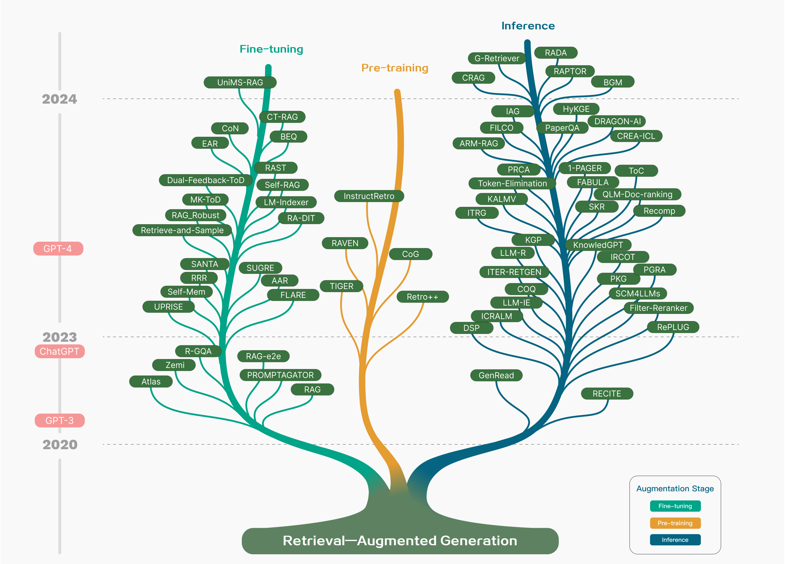
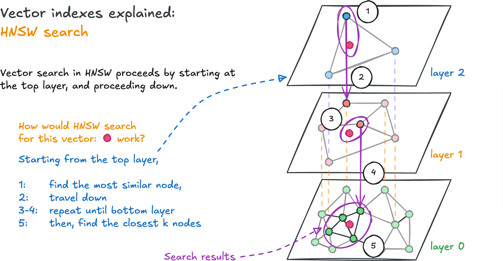
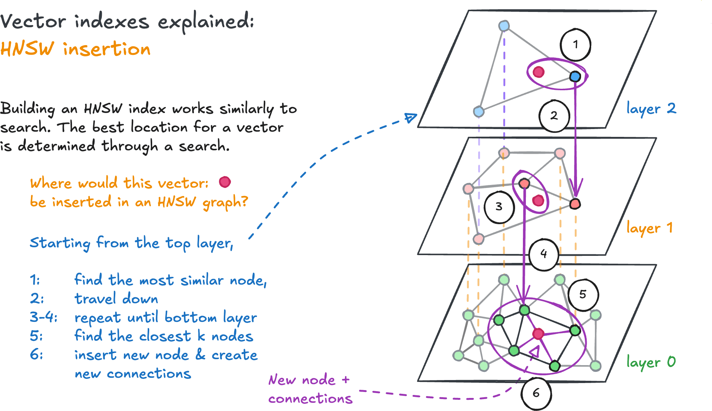

# Why Retrieval-Augmented Generation Matters

Large language models (LLMs) are strong general-purpose generators, but they are weak as always-current, always-grounded knowledge systems. They can answer many questions fluently while still failing on domain-specific details, recent facts, and long-tail knowledge [@longtail; @hallucination]. Retrieval-augmented generation (RAG) addresses that gap by pairing a generator with an external knowledge store.

In practice, RAG turns a model from a static parametric memory into a system that can look up evidence, reason over it, and produce a response tied to sources. That shift matters in business analytics because most useful applications depend on current documents, internal policies, data catalogs, contracts, filings, manuals, or research updates.

{width=80% fig-align="center" #fig-rag-tech-tree fig-alt="Technology tree of RAG research across pre-training, fine-tuning, and inference."}

The research trajectory in @fig-rag-tech-tree shows that retrieval augmentation is no longer only an inference trick. It now appears in three places:

- pre-training, where retrieval is used to improve what the model learns in the first place
- fine-tuning, where retrieval-aware behavior is aligned to a task or domain
- inference, where external evidence is retrieved on demand at answer time

## Core Idea

RAG combines two capabilities:

1. retrieval, which locates useful evidence from an external collection
2. generation, which turns the question plus evidence into a coherent answer

This makes RAG attractive when data changes frequently, when traceability matters, or when the model should answer only from approved content.

{width=80% fig-align="center" #fig-rag-case fig-alt="Representative RAG pipeline with indexing, retrieval, and generation."}

The simple pipeline in @fig-rag-case is still the right mental model:

1. index documents by cleaning, chunking, embedding, and storing them
2. retrieve the most relevant chunks for a user query
3. generate an answer conditioned on the retrieved evidence

:::{.callout-tip}
RAG is most useful when the answer should be grounded in information outside the model weights.
:::

# Paradigms of RAG

The survey literature commonly groups RAG into three paradigms: naive RAG, advanced RAG, and modular RAG.

{width=82% fig-align="center" #fig-rag-paradigms fig-alt="Comparison of naive, advanced, and modular RAG paradigms."}

## Naive RAG

Naive RAG is the straightforward retrieve-then-read pattern. The system indexes documents, embeds a query, retrieves the top $k$ chunks, and passes them to the model.

Its strengths are simplicity, transparency, and fast prototyping. Its weaknesses are also clear:

- weak recall when chunking or embeddings are poor
- irrelevant or redundant chunks in the prompt
- hallucinations when the generator over-trusts its own prior knowledge
- difficulty with multi-step, multi-hop, or ambiguous questions

## Advanced RAG

Advanced RAG improves the basic pattern by optimizing what happens before and after retrieval. Common techniques include:

- richer chunking strategies
- metadata-aware filtering
- query rewriting or expansion
- hybrid search using sparse and dense retrieval together
- reranking and prompt compression after retrieval

The goal is to improve precision, recall, and prompt efficiency without fully redesigning the system.

## Modular RAG

Modular RAG treats the system as a set of components that can be swapped, sequenced differently, or invoked conditionally. New modules may include:

- search engines
- routers
- memory components
- query planners
- task adapters
- evaluators and critics

This matters because many real systems do not follow one linear pipeline. They route queries differently, retrieve iteratively, or invoke specialized tools depending on the task.

## RAG Versus Fine-Tuning

RAG and fine-tuning are not substitutes in every case. They solve different problems.

{width=76% fig-align="center" #fig-rag-vs-ft fig-alt="RAG versus other model optimization methods."}

Use RAG when you need:

- fresh or frequently changing knowledge
- citations and explainability
- low-friction updates to the knowledge base
- domain control without retraining the model

Use fine-tuning when you need:

- behavioral adaptation
- output style consistency
- format control
- specialized task performance encoded in model behavior

In practice, many production systems use both: retrieval for grounding and fine-tuning for behavior.

# Retrieval as the Core Engineering Problem

Most RAG failures start before generation. If the system retrieves weak evidence, the model cannot reliably recover downstream.

## Retrieval Sources

RAG can retrieve from multiple data types.

### Unstructured Text

This is the most common case: PDFs, HTML, Markdown, transcripts, policies, reports, manuals, research articles, and website content. It is easy to ingest but often difficult to segment well.

### Semi-Structured Data

Tables, forms, and PDFs with mixed layout are harder. A naive text splitter may break row-column relationships and reduce retrieval quality. In these cases, layout-aware parsing or table-aware transformation becomes important.

### Structured Data

Knowledge graphs, relational tables, and metadata stores provide cleaner semantics and often better precision, but they require more design effort and maintenance.

### Model-Generated Context

Some systems retrieve not only from external corpora but also from model-generated intermediate artifacts such as hypothetical answers, rewritten queries, or synthetic summaries. These can reduce mismatch between the user question and the stored content.

## Retrieval Granularity

Choosing the retrieval unit affects both quality and cost.

| Granularity | Strength | Risk |
|---|---|---|
| Token / phrase | very precise matching | loses semantic completeness |
| Sentence / proposition | fine-grained evidence | may miss broader context |
| Chunk | balanced default | chunk boundaries matter a lot |
| Full document | preserves context | often too noisy or expensive |

Smaller units help precision but may fragment meaning. Larger units preserve context but increase prompt noise. Good systems choose a granularity that matches the downstream task.

## Indexing Optimization

Indexing is not just storage. It is the stage where the future behavior of the retriever is largely determined.

### Chunking Strategy

The simplest strategy is fixed-size chunking by token count. It is easy to implement, but it can cut across paragraphs, headings, tables, or arguments in ways that weaken retrieval.

Better alternatives include:

- recursive splitting that respects document structure
- sliding windows with overlap
- sentence-first retrieval with neighboring context expansion
- section-aware chunking using titles and headers

The chunk size tradeoff is straightforward:

- larger chunks preserve context but add noise and cost
- smaller chunks improve focus but risk losing semantic completeness

### Metadata Attachments

Metadata helps narrow the search space and improve relevance. Useful metadata includes:

- source file name
- section title
- author or owner
- timestamp or version
- business domain or product line
- document type

Metadata can also be generated. For example, a chunk may store a short summary or a hypothetical question that the chunk can answer.

### Structural Indexing

RAG improves when the index reflects document structure rather than treating every chunk as isolated text. Hierarchical indexes can connect sections, subsections, tables, and summaries. Graph-based indexes can explicitly represent relationships between entities or concepts.

This is one reason why document-aware and graph-aware retrieval have become important extensions of basic vector search.

# Query Optimization

User questions are often incomplete, ambiguous, or badly phrased for retrieval. A strong RAG system treats the incoming question as input to be transformed, not as the final retrieval query.

## Query Expansion

Query expansion generates related versions of the original question. This can include:

- multi-query retrieval from several reformulations
- sub-question decomposition for complex tasks
- verification prompts that test whether the reformulations are plausible

This is useful for complex questions and for corpora where the wording in source documents differs from the wording in user questions.

## Query Transformation

Instead of adding queries, the system can replace the original query with a better retrieval-oriented form.

Common examples:

- query rewrite for clarity and precision
- step-back prompting to generate a higher-level conceptual query
- hypothetical document generation such as HyDE, which retrieves against an imagined answer rather than the literal question

These methods try to close the semantic gap between how users ask questions and how documents express answers.

## Query Routing

Different questions often need different retrieval paths. A robust system can route by:

- metadata filters
- semantic intent
- document type
- tool choice
- domain-specific retrievers

For example, product policy questions may go to one index, while technical troubleshooting questions route to another.

# Embeddings and Hybrid Retrieval

Embeddings sit at the center of dense retrieval. They map questions and chunks into a vector space where semantic similarity can be computed.

## Sparse and Dense Retrieval

Sparse retrieval methods such as BM25 are good at exact token matching and rare terms. Dense retrieval methods are better at semantic matching. Neither is enough alone across all tasks.

That is why hybrid retrieval is common in production. It combines:

- sparse retrieval for lexical precision
- dense retrieval for semantic recall
- reranking to reorder the final candidate set

## Fine-Tuning the Retriever

Retriever fine-tuning is valuable when the domain has specialized language, changing terminology, or unusual structure. It is also useful when the generator and retriever should be better aligned.

Examples include:

- training on domain-specific question-chunk pairs
- using LLM-generated supervision signals
- aligning retriever scores with generator preferences

In business settings, retriever tuning often matters more than model swapping because the retrieval step controls what evidence the model is even allowed to see.

# Vector Databases and HNSW

RAG depends on fast similarity search. Once the corpus grows, brute-force comparison against every vector becomes too slow.

## Why Vector Indexing Matters

Vector indexing organizes embeddings so nearest-neighbor search is fast enough for real applications.

:::{.callout-tip}
Indexing is a speed-quality tradeoff. The goal is not only accurate retrieval, but accurate retrieval fast enough to support real user interaction.
:::

### Types of Vector Indexes

| Index Type | Best Use | Tradeoff |
|---|---|---|
| Flat | small datasets, exact search | slow at scale |
| HNSW | large, high-query-volume systems | higher memory usage |
| Cluster-based IVF-style | large collections with memory constraints | some recall loss |
| Tree-based methods | specific lower-dimensional cases | less common in modern RAG |

## HNSW Intuition

Hierarchical Navigable Small World (HNSW) graphs are a popular default because they provide high-recall approximate nearest-neighbor search with strong speed.

HNSW belongs to the graph family of approximate nearest-neighbor (ANN) indexes. Instead of scanning every vector, it stores a navigable graph whose edges connect each point to a small set of nearby points. Search then becomes a graph-traversal problem rather than a full comparison problem.

The Pinecone explanation is useful because it frames HNSW as a combination of two older ideas:

- probabilistic skip lists, which use layers to move quickly across a structure
- navigable small world graphs, which mix short-range and long-range connections so greedy search can move efficiently toward the target

{width=78% fig-align="center" #fig-hnsw-story-map fig-alt="Story mapping view for layered navigation and search refinement."}

The story map in @fig-hnsw-story-map is a useful mental model for teaching HNSW. Early steps in the search are broad, exploratory, and coarse. Later steps become local, specific, and refinement-oriented. That is exactly what the hierarchy is doing: upper layers help us move across the space quickly, while lower layers help us make precise nearest-neighbor decisions.

{width=72% fig-align="center" fig-alt="HNSW layers and navigation intuition."}

At a high level:

- upper layers provide coarse long-range navigation
- lower layers provide dense local refinement
- search starts high and descends toward better neighbors

This layered structure matters because plain nearest-neighbor graphs can get stuck in local minima too early. HNSW reduces that risk by starting from sparse top layers with long jumps, then progressively narrowing the search at lower layers.

### Skip-List Analogy

In a skip list, high layers let us skip over many elements quickly, and lower layers provide detailed local traversal. HNSW applies the same idea to vector space:

- top layers are sparse and contain fewer points
- each downward step increases graph density
- long links dominate at the top, short links dominate at the bottom

The effect is a two-phase search behavior often described informally as:

- zoom out to get near the right region quickly
- zoom in to refine the exact neighborhood

{width=72% fig-align="center" fig-alt="HNSW search process."}

The common analogy is highways and local roads. Higher layers help jump quickly across the space; lower layers help refine the final result.

### Graph Search Mechanics

Suppose the query vector is $q$ and the current node is $x$. For a distance function $d(q, x)$, greedy search repeatedly moves to a neighboring node $y$ whenever:

$$
\begin{align}
d(q, y) < d(q, x)
\end{align}
$$

If no neighbor improves the distance, the search has reached a local minimum for that layer. In a plain navigable small-world graph, that might stop the search entirely. In HNSW, it becomes the starting point for the next lower layer.

So the layer-by-layer process is:

1. start from the top entry point
2. greedily move to closer neighbors until no improvement exists
3. drop to the next layer using the current best node as the new entry point
4. repeat until layer 0

This is why HNSW often achieves logarithmic-like behavior in practice. It avoids evaluating the whole dataset and instead performs a structured descent through increasingly detailed neighborhoods.

{width=72% fig-align="center" fig-alt="HNSW insertion process."}

In operational terms, HNSW works well because it preserves enough connectivity to find good candidates without comparing against every vector.

### How New Points Are Inserted

Graph construction happens one vector at a time. Each new vector is assigned a highest layer, then inserted into that layer and every layer below it.

The Pinecone article highlights the exponential level distribution used in HNSW. A common formulation is:

$$
\begin{align}
P(L = \ell) \propto e^{-\ell / m_L}
\end{align}
$$

where:

- $L$ is the random highest level assigned to a point
- $\ell$ is a specific level
- $m_L$ is the level multiplier controlling how quickly probability decays

This means most points live only at layer 0, fewer appear at layer 1, and very few appear in higher layers. The result is exactly what we want: sparse upper layers and dense lower layers.

One practical rule of thumb used in implementations derived from the original paper is:

$$
\begin{align}
m_L \approx \frac{1}{\ln(M)}
\end{align}
$$

where $M$ is the target number of neighbors per node on most layers.

This relationship matters because it balances two competing goals:

- too many points in upper layers creates overlap and wasted search effort
- too few points in upper layers increases the number of downward traversals before reaching a good region

### Neighbor Selection During Construction

Once a new vector $q$ is assigned a highest insertion level, the algorithm searches down from the top layer to that level using greedy search. Then, at each relevant layer, it gathers candidate neighbors and chooses up to $M$ links.

Conceptually, if the candidate set is $\mathcal{C}$, a simple nearest-neighbor selection rule is:

$$
\begin{align}
\mathcal{N}(q) = \operatorname*{arg\,min}_{S \subseteq \mathcal{C}, |S| \le M} \sum_{x \in S} d(q, x)
\end{align}
$$

Real implementations often use heuristics that prefer both closeness and graph diversity, because picking only the absolutely closest points can create redundant local structure and reduce navigability.

### Search Breadth Parameters

The two most important runtime/build parameters are:

- `efConstruction`: how many candidates are explored during index construction
- `efSearch`: how many candidates are explored during query-time search

Both control the width of exploration. Larger values mean the algorithm considers more candidate neighbors before committing.

At a high level, increasing either parameter improves recall because search is less likely to stop at a bad local minimum. But the cost differs:

- higher `efConstruction` makes building slower and usually improves graph quality
- higher `efSearch` makes querying slower and usually improves retrieval recall immediately

### Memory and Degree Parameters

The parameter $M$ controls how many neighbors each node stores per layer. Increasing $M$ changes the graph in three ways:

- it increases connectivity
- it usually improves recall
- it increases memory usage significantly

We can summarize the tradeoff qualitatively as:

$$
\begin{align}
	ext{Recall} &\uparrow \text{ as } M, \; efSearch, \; efConstruction \uparrow \\
	ext{Latency} &\uparrow \text{ as } efSearch \uparrow \\
	ext{Build Time} &\uparrow \text{ as } efConstruction \uparrow \\
	ext{Memory} &\uparrow \text{ primarily as } M \uparrow
\end{align}
$$

This is the core engineering story of HNSW. It performs extremely well, but it does so by spending memory on graph structure.

## Practical Tuning

HNSW introduces search-quality versus speed controls. Higher search effort increases recall but costs more latency. Lower effort reduces latency but risks missing good neighbors.

The most useful classroom summary is:

- tune $M$ when you want to change the graph structure itself
- tune `efConstruction` when you want a higher-quality graph at build time
- tune `efSearch` when you want to trade query latency for better recall

For a RAG system, these settings affect whether the right chunks even reach the generator. If HNSW misses the right neighborhood, the downstream LLM never gets the evidence it needs.

### Why HNSW Fits RAG So Well

RAG systems usually care about three things simultaneously:

- high recall, so relevant evidence is not missed
- low latency, so interaction feels responsive
- dynamic scale, because corpora can grow quickly

HNSW is popular because it sits in a practical sweet spot. It is often much faster than flat search, more accurate than many lightweight ANN alternatives, and easier to deploy than more elaborate multi-stage indexing strategies.

That said, it is not free. If the corpus is huge and memory is constrained, cluster-based or compressed indexes may be preferable. HNSW is often chosen because it is an excellent default, not because it dominates every scenario.

This is exactly the kind of engineering tradeoff that matters in production RAG systems.

# Implementation Patterns and Ecosystem Connections

The RAG Hack slide material reinforces a practical lesson: modern RAG systems are not just prompt templates. They are applications built from coordinated services.

Typical components include:

- document loaders and parsers
- embedding generation
- vector storage and search
- optional reranking
- prompt assembly
- answer generation
- evaluation and monitoring

That is why tool ecosystems such as LangChain, LlamaIndex, Azure AI Search, and evaluation frameworks matter. They provide reusable interfaces for retrieval, orchestration, storage, and assessment.

From an implementation perspective, a useful architecture pattern is:

1. prepare and chunk documents
2. embed and index them
3. retrieve candidate evidence with hybrid or vector search
4. rerank or compress context
5. generate an answer with source-aware prompting
6. evaluate retrieval and answer quality separately

## Lecture Takeaways

- RAG is best understood as a retrieval system first and a generation system second.
- The quality of chunking, metadata, embeddings, and indexing usually determines downstream answer quality.
- Naive RAG is a baseline, not an endpoint.
- Advanced and modular RAG emerge because real-world queries, corpora, and latency constraints are messy.
- Vector indexing, especially HNSW, is essential once the corpus becomes non-trivial in size.

LN2 continues with generation strategies, augmentation flows, evaluation, and production-oriented future directions.