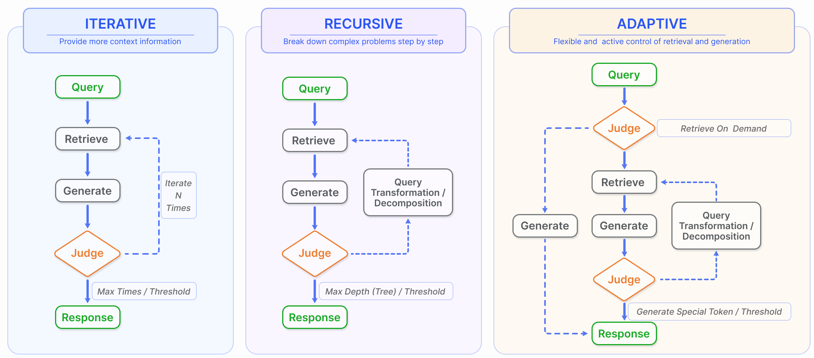
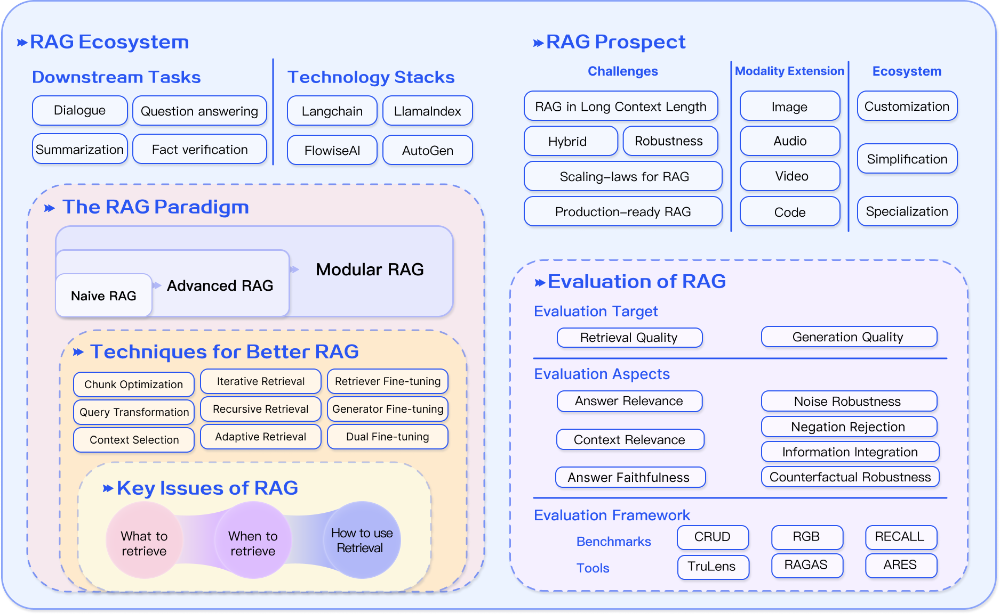

# RAG Foundations and Domain Adaptation

Generative models, while powerful, often lack specific domain knowledge or access to up-to-date information. As outlined in *Generative AI Foundations in Python*, adapting a general-purpose LLM without extensive fine-tuning is achievable through prompt engineering and Retrieval-Augmented Generation (RAG). 

RAG provides techniques to ground the model's responses in factual data by retrieving relevant documents and including them in the context of the prompt. This addresses one of the primary limitations of generative models—hallucination—where models generate factually inaccurate information. By augmenting the model's inputs with additional information that is known to be factual, RAG ensures that the synthesized content is accurate, contextually relevant, and grounded in reality.


# From Retrieval to Answer Quality

Retrieving relevant chunks is necessary, but it is not sufficient. A RAG system still has to decide:

- which retrieved evidence to trust
- how much of it to include
- how to order it in the prompt
- when another retrieval step is needed
- how to tell whether the answer is actually good

LN1 focused on retrieval design. LN2 shifts to the second half of the problem: generation quality, augmentation strategies, evaluation, and production concerns.

# Generation-Side Design in RAG

Once documents have been retrieved, the next challenge is prompt construction. Passing every retrieved chunk directly to the model often reduces answer quality instead of improving it.

## Why More Context Can Hurt

Long prompts create three common problems:

- the model pays uneven attention across the context window
- redundant evidence crowds out useful evidence
- irrelevant chunks increase confusion and hallucination risk

This is often described as the "lost in the middle" problem [@lostinthemiddle]. Models tend to overweight the beginning and end of a long prompt while underusing the middle.

## Reranking

Reranking is the simplest high-value post-retrieval improvement. Instead of trusting the raw retrieval order, the system re-scores candidate chunks and reorders them before prompting the model.

Reranking can be based on:

- hand-crafted heuristics such as diversity or recency
- cross-encoders or specialized rerankers
- LLM-based judgment

In practice, reranking serves two roles at once:

- it improves relevance ordering
- it acts as a filter that shrinks the prompt to the most useful evidence

## Context Compression

Sometimes the system retrieves useful material but too much of it. Context compression reduces prompt length while trying to preserve the important information.

Common compression strategies include:

- extractive filtering of the most relevant sentences
- summary generation over retrieved chunks
- token-level pruning
- small-model compression before final generation

The engineering objective is simple: preserve signal, reduce noise.

## Fine-Tuning the Generator

Fine-tuning on the generation side is useful when the model must produce:

- a specific answer format
- a domain-specific style or tone
- structured outputs
- task-specific reasoning behavior

This matters especially when the same retrieval system serves a recurring workflow such as compliance responses, product support, or internal analytics reporting.

# Augmentation Processes Beyond One-Shot Retrieval

Basic RAG usually retrieves once and generates once. That works for straightforward factual questions, but it breaks down for multi-step problems, ambiguous questions, and tasks requiring search refinement.

{width=84% fig-align="center" #fig-aug-process fig-alt="Retrieval augmentation processes: iterative, recursive, and adaptive retrieval."}

The survey literature highlights three important augmentation patterns in @fig-aug-process.

## Iterative Retrieval

Iterative retrieval alternates between retrieval and generation. The model retrieves evidence, drafts intermediate reasoning or partial output, then uses that intermediate state to retrieve again.

This is useful when:

- the first retrieval is incomplete
- the task requires multi-hop reasoning
- the answer needs progressively refined evidence

The downside is that bad early retrieval can propagate into later steps.

## Recursive Retrieval

Recursive retrieval decomposes a hard question into smaller or more precise subproblems. It is useful when the original query is too broad, ambiguous, or structurally complex.

Typical use cases:

- long documents with section hierarchy
- multi-hop questions over several documents
- graph-like knowledge dependencies

The key idea is that the system does not retrieve against the whole problem at once. It retrieves against a refined form of the problem as it learns more.

## Adaptive Retrieval

Adaptive retrieval allows the model or controller to decide whether retrieval is needed and when to stop. Instead of assuming every prompt requires the same number of retrieval steps, the system treats retrieval as conditional.

This is attractive because not every task is equally knowledge-intensive. Some questions can be answered from the prompt alone, while others require multiple evidence lookups.

Adaptive methods are especially relevant to agentic systems, where the model decides whether to search, which tool to call, and when enough evidence has been collected.

# Evaluation of RAG Systems

The RAG Hack evaluation slides emphasize a practical truth: users do not care whether your vector search is elegant. They care whether the answer is correct, understandable, grounded, and useful.

## Why Evaluation Is Hard

RAG evaluation is difficult because retrieval quality and answer quality are related but not identical.

A system may retrieve good evidence and still produce a poor answer. A system may also retrieve mediocre evidence and still appear to answer correctly on a lucky case. That is why evaluation should separate retrieval from generation.

## Two Evaluation Targets

### Retrieval Quality

This asks whether the system found the right evidence.

Useful metrics include:

- hit rate
- mean reciprocal rank (MRR)
- normalized discounted cumulative gain (NDCG)
- precision and recall over relevant chunks

### Generation Quality

This asks whether the final answer is good given the evidence.

Depending on the task, evaluation may use:

- accuracy or exact match
- ROUGE or BLEU for overlap-based tasks
- semantic relevance scoring
- human evaluation of clarity, usefulness, and faithfulness

## Three Common Quality Scores

Modern RAG evaluation often uses three high-level quality concepts [@RAGAS; @ARES]:

- context relevance: whether the retrieved content actually fits the question
- answer faithfulness: whether the answer stays grounded in the retrieved evidence
- answer relevance: whether the answer addresses what the user asked

These are more informative than a single task score because they diagnose where the failure occurred.

## RAGAS-Style Evaluation Language

RAGAS is useful in this course less because students need one specific library, and more because it gives a precise vocabulary for separating retrieval failure from generation failure.

| Evaluation concept | What it asks | Typical evidence needed | Failure it reveals |
|---|---|---|---|
| Faithfulness | Is the answer supported by the retrieved context? | answer + retrieved chunks | hallucinated or unsupported claims |
| Answer relevancy | Does the answer address the actual question? | question + answer | fluent but off-target responses |
| Context precision | Are the top retrieved chunks useful, especially near the top? | question + ranked contexts | noisy top-k retrieval |
| Context recall | Did retrieval find enough evidence to answer completely? | question + ground truth or reference evidence | missing facts or incomplete evidence |
| Context entity recall | Did retrieval capture the key entities? | expected entities + retrieved context | wrong company, year, item, or entity |

The practical classroom workflow is:

1. create a small test set of representative SEC questions
2. save the retrieved chunks for each question
3. save the generated answer
4. score retrieval and answer quality separately
5. inspect low-scoring rows and decide whether to tune chunking, embeddings, reranking, or prompting

```{python}
#| eval: false
eval_rows = [
    {
        "question": "How does the company describe inflation risk?",
        "contexts": [doc.page_content for doc in retrieved_docs],
        "answer": generated_answer,
        "ground_truth": "Reference answer or instructor-approved evidence summary",
    }
]

eval_df = pd.DataFrame(eval_rows)
eval_df
```

If using RAGAS directly, the same table can be converted into the library's expected dataset format and scored with metrics such as faithfulness, answer relevancy, context precision, and context recall. If the library is not available, students can still apply the same rubric manually.

```{python}
#| eval: false
from datasets import Dataset
from ragas import evaluate
from ragas.metrics import faithfulness, answer_relevancy, context_precision, context_recall

ragas_dataset = Dataset.from_pandas(eval_df)

ragas_scores = evaluate(
    ragas_dataset,
    metrics=[faithfulness, answer_relevancy, context_precision, context_recall],
)

ragas_scores.to_pandas()
```

:::{.callout-note}
RAGAS-style metrics should not replace human review in financial analysis. Use them as triage signals that tell you which examples deserve closer inspection.
:::

## Four Abilities Worth Testing

The survey also highlights four abilities that stress-test RAG systems [@RGB; @RECALL].

### Noise Robustness

Can the model ignore chunks that are related to the topic but not actually useful?

### Negative Rejection

Can the model decline to answer or admit uncertainty when the evidence is insufficient?

### Information Integration

Can the model combine evidence from multiple documents into one coherent answer?

### Counterfactual Robustness

Can the model resist being misled by incorrect or contradictory retrieved content?

These abilities matter because production corpora are rarely clean.

## Manual and Automated Evaluation

There are two broad approaches.

### Manual Evaluation

Humans review answers for correctness, grounding, clarity, and usefulness. This is slower but often necessary for high-stakes domains.

### Automated Evaluation

Tooling now supports automated judging with LLM-based or rule-based evaluators. This aligns with the evaluation slide deck examples that score relevance and answer quality programmatically.

A practical evaluation workflow is:

1. collect representative questions
2. store retrieved chunks and final answers
3. score retrieval and answer quality separately
4. inspect failure modes by category
5. tune chunking, search, reranking, and prompting iteratively

## LangSmith Tracing for RAG Debugging

Metrics tell us whether a run was weak. Traces help explain why.

LangSmith-style tracing records the actual sequence of events in a RAG application:

- the user question
- any query rewrite or decomposition
- retriever inputs and retrieved documents
- reranker inputs and reordered documents
- prompt construction
- model response
- latency, token usage, and errors

For Module 5, tracing is especially helpful because many failures happen before generation. A final answer might be wrong because the prompt was weak, but it might also be wrong because the retriever never surfaced the relevant SEC section.

```{python}
#| eval: false
import os

os.environ["LANGSMITH_TRACING"] = "true"
os.environ["LANGSMITH_PROJECT"] = "ad698-m05-rag-evaluation"

# Run your retriever or RAG chain after setting these variables.
# Inspect the trace for retrieval inputs, retrieved chunks, prompt text, and final answer.
```

When writing up results, students should include a compact trace summary rather than screenshots alone:

| Trace field | What to report |
|---|---|
| question | the exact user query |
| retriever query | original or rewritten retrieval query |
| top retrieved chunks | ticker, year, item, source row, short preview |
| reranker change | which chunks moved up or down |
| prompt evidence | how many chunks entered the final prompt |
| answer issue | unsupported claim, missing evidence, vague synthesis, or correct answer |

# Downstream Tasks for RAG

Question answering remains the dominant application, but RAG now extends to many other tasks:

- open-domain question answering
- multi-hop reasoning
- long-form summarization
- domain-specific assistants
- dialogue systems
- recommendation
- information extraction
- code search
- fact checking

This spread matters pedagogically because it shows RAG is not one application. It is an architectural pattern.

# Production RAG and Application Architecture

The RAG Hack Python and Azure AI Studio slides add an important implementation perspective: a usable RAG application is a composed system, not just a model call.

## Typical Production Stack

A modern RAG application often includes:

- storage for source documents
- parsing and chunking pipeline
- embedding generation
- vector or hybrid search engine
- optional reranker
- prompt orchestration layer
- LLM endpoint
- evaluation and monitoring layer
- user interface and citation flow

This is why frameworks and services matter. They reduce the amount of custom glue code needed to build end-to-end systems.

## Connections and Orchestration

The AI Studio connection-oriented framing is useful here. In practice, RAG applications often connect multiple resources:

- model endpoints
- search indexes
- storage accounts
- databases
- evaluation tools
- observability services

A good production design makes those dependencies explicit, manageable, and secure.

## What Actually Affects Quality in Production

The RAG evaluation presentation emphasizes a set of levers that consistently matter:

- search engine choice
- search mode: keyword, vector, or hybrid
- chunk size and overlap
- number of retrieved documents
- reranking behavior
- prompt instructions
- model choice
- grounding and citation handling

This is useful for class because it moves students away from the idea that "better model" is the only knob.

## NVIDIA Notebook Patterns You Can Reuse

Yes, the notebooks in `Building-RAG-Agents-with-LLMs-NVIDIA` are directly useful for this module. They provide practical, composable patterns that map very cleanly to our AD698 RAG workflow.

The most reusable pieces come from:

- `05_documents.ipynb`: document loading and chunking workflows
- `06_embeddings.ipynb`: query-vs-document embedding usage
- `07_vectorstores.ipynb`: FAISS retriever + LCEL composition
- `08_evaluation.ipynb`: LLM-as-a-judge style evaluation loop
- `09_langserve.ipynb`: FastAPI + LangServe deployment routes

Below are adapted versions of those patterns, rewritten for course use.

### Pattern 1: Document Loading and Chunking

Use this to build your retrieval corpus from arXiv or local files.

```python
from langchain.document_loaders import ArxivLoader, UnstructuredFileLoader
from langchain.text_splitter import RecursiveCharacterTextSplitter

# Option A: arXiv paper
docs = ArxivLoader(query="2404.16130").load()

# Option B: local PDF
# docs = UnstructuredFileLoader("./data/my_report.pdf").load()

splitter = RecursiveCharacterTextSplitter(
	chunk_size=1000,
	chunk_overlap=100,
)
chunks = splitter.split_documents(docs)
print(f"Chunks created: {len(chunks)}")
```

### Pattern 2: Embedding Model Setup

Notebook 6 emphasizes that `embed_query` and `embed_documents` serve different roles. Keep that distinction in mind even when the vector store API hides it.

```python
from langchain_nvidia_ai_endpoints import NVIDIAEmbeddings

embedder = NVIDIAEmbeddings(
	model="nvidia/nv-embed-v1",
	truncate="END"
)

# Optional explicit usage
q_vec = embedder.embed_query("How does HNSW improve retrieval?")
d_vecs = embedder.embed_documents([c.page_content for c in chunks[:3]])
```

### Pattern 3: FAISS Vector Store + Retriever

This is the core RAG indexing pattern used in Notebook 7.

```python
from langchain_community.vectorstores import FAISS

vector_db = FAISS.from_documents(chunks, embedder)
retriever = vector_db.as_retriever(
	search_type="mmr",
	search_kwargs={"k": 5}
)

hits = retriever.invoke("What are the key phases of HNSW search?")
print(len(hits), "documents retrieved")
```

### Pattern 4: LCEL RAG Chain (Retriever + Generator)

This adapted LCEL pattern composes retrieval and generation into one runnable chain.

```python
from operator import itemgetter
from langchain_core.prompts import ChatPromptTemplate
from langchain_core.output_parsers import StrOutputParser
from langchain_core.runnables import RunnableAssign
from langchain_nvidia_ai_endpoints import ChatNVIDIA

llm = ChatNVIDIA(model="meta/llama-3.1-8b-instruct") | StrOutputParser()

prompt = ChatPromptTemplate.from_messages([
	("system", "Use only the context to answer. If unsure, say you do not know."),
	("user", "Context:\n{context}\n\nQuestion:\n{input}")
])

def docs_to_str(docs):
	return "\n\n".join(d.page_content for d in docs)

context_getter = itemgetter("input") | retriever | docs_to_str
retrieval_chain = {"input": lambda x: x} | RunnableAssign({"context": context_getter})
generator_chain = prompt | llm

rag_chain = retrieval_chain | generator_chain
print(rag_chain.invoke("Compare naive RAG and modular RAG."))
```

### Pattern 5: Lightweight LLM-as-a-Judge Evaluation

Notebook 8 uses synthetic QA + judge-style scoring. For class assignments, this minimal loop is enough to demonstrate evaluation mechanics.

```python
judge_prompt = ChatPromptTemplate.from_messages([
	("system", "Score answer quality. Output [1] if grounded and correct, else [0]."),
	("user", "Question: {q}\nReference: {ref}\nCandidate: {cand}")
])

judge = judge_prompt | llm

dataset = [
	{
		"q": "What is efSearch in HNSW?",
		"ref": "efSearch controls search breadth at query time.",
		"cand": rag_chain.invoke("What is efSearch in HNSW?")
	}
]

scores = []
for row in dataset:
	verdict = judge.invoke(row)
	scores.append(1 if "[1]" in verdict else 0)

print("Preference score:", sum(scores) / len(scores))
```

### Pattern 6: Serving Retriever and Generator via LangServe

Notebook 9 shows how to expose reusable endpoints for frontend integration.

```python
from fastapi import FastAPI
from langserve import add_routes

app = FastAPI(title="AD698 RAG Service")

add_routes(app, retriever, path="/retriever")
add_routes(app, generator_chain, path="/generator")
add_routes(app, llm, path="/basic_chat")

# uvicorn server_app:app --host 0.0.0.0 --port 9012
```

### Integration Guidance for AD698

To align these notebook patterns with this course repository:

- use `./data/SEC-10K-2024*` and your assignment chunk files as ingestion sources
- keep artifact outputs in module-specific artifact folders
- prefer retrieval + reranking + concise prompting before model fine-tuning
- evaluate retrieval and generation separately in grading rubrics
- expose retriever and generator endpoints only when moving to app deployment

These integrations are intentionally incremental: first make retrieval reliable, then optimize generation, then add evaluation and serving.

# Future Directions

{width=84% fig-align="center" #fig-rag-summary fig-alt="Summary of the RAG ecosystem and future directions."}

The survey closes by framing several open directions, summarized visually in @fig-rag-summary.

## RAG Versus Long Context

As context windows grow, some people ask whether RAG will become unnecessary. The answer is still no.

Long context helps, but RAG still offers:

- better latency for large corpora through selective retrieval
- traceability through explicit sources
- lower cost than stuffing everything into the prompt
- cleaner access control over what the model may use

Long context and RAG should be seen as complements, not opposites.

## Robustness

RAG systems remain vulnerable to noise, contradiction, and misleading evidence. Improving robustness is one of the most important open problems.

## Hybrid Approaches

Future systems are likely to mix:

- retrieval
- fine-tuning
- agents and tool use
- reinforcement-style feedback
- specialized smaller models inside the pipeline

## Scaling Laws for RAG

Scaling laws are well studied for LLMs, but less settled for retrieval-augmented systems. Questions remain about how retrieval quality, model size, corpus size, and end-to-end optimization interact.

## Production-Ready RAG

Production deployment raises concerns that classroom demos often ignore:

- retrieval latency
- index freshness
- access control
- source leakage
- compliance and auditability
- monitoring drift in both retrieval and generation

## Multimodal RAG

RAG is increasingly expanding beyond text. Future systems will retrieve and ground over:

- images
- video
- audio
- tables
- code
- graph data

That expansion matters for business analytics because enterprise knowledge is already multimodal.

# Final Takeaways

- Retrieval quality and answer quality must be evaluated separately.
- One-shot retrieval is only a baseline; iterative, recursive, and adaptive patterns matter for harder tasks.
- Production RAG is an application architecture problem as much as a modeling problem.
- Evaluation, routing, reranking, and monitoring are not optional extras.
- The field is moving toward hybrid, modular, and multimodal systems.

Together, LN1 and LN2 provide a complete Module 5 note set: foundations and retrieval first, then generation, evaluation, and production concerns.

