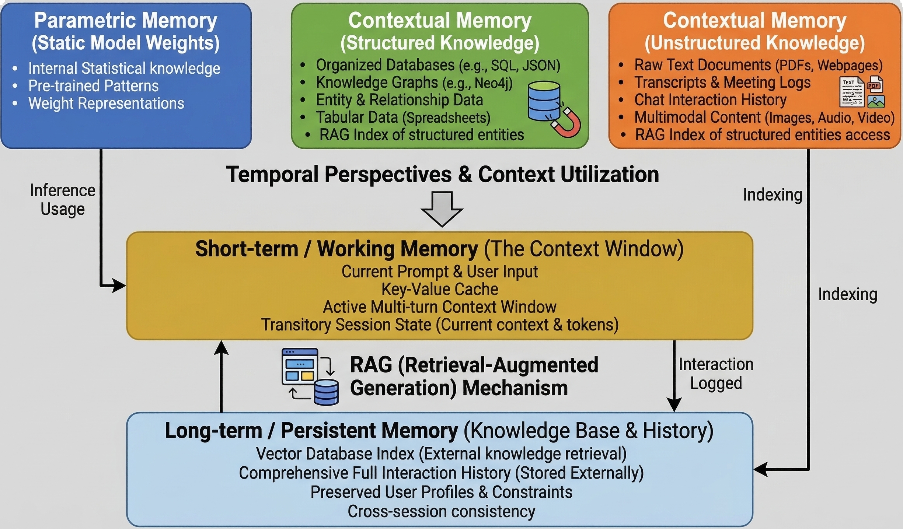
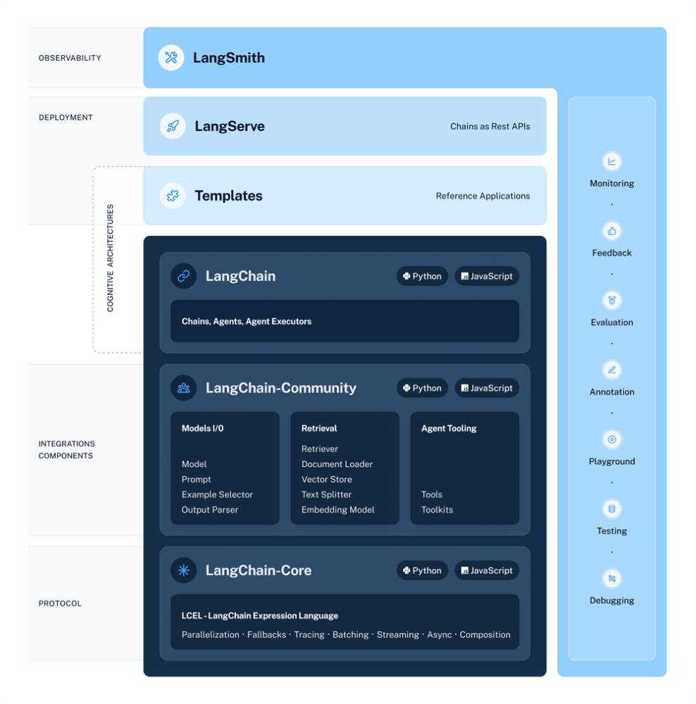
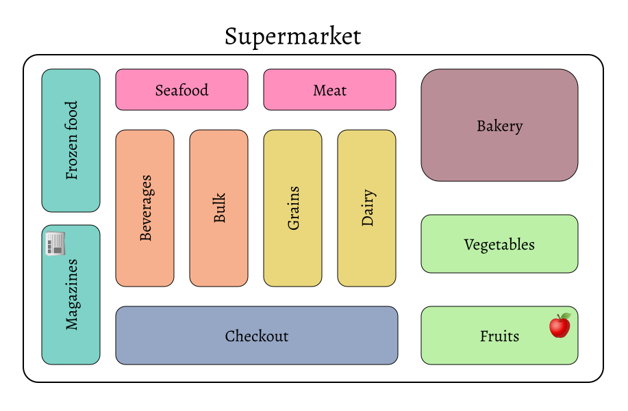
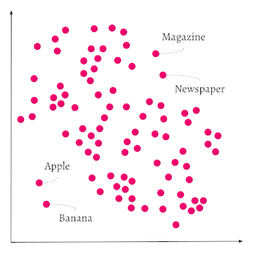

# The Problem: Why RAG Exists

## LLMs Are Powerful, But…

- LLMs excel at language understanding and generation  
- But they struggle with **domain-specific**, **knowledge-intensive**, and **time-sensitive** tasks  
- They hallucinate when asked about:  
  - long-tail knowledge [@longtail]  
  - out-of-distribution facts  
  - recent events [@hallucination]

---

## Why Hallucinations Happen

{width=75% fig-align="center" fig-alt="Parametric memory vs external knowledge"}

---

## Enter RAG

:::{.callout-tip}
RAG augments LLMs with **retrieval from external knowledge bases** using semantic similarity.
:::

- Reduces hallucinations  
- Enables up-to-date answers  
- Supports domain-specific tasks  
- Improves factual grounding  

---

## RAG Pipeline

{width=75% fig-align="center" fig-alt="RAG pipeline: query → retrieve → generate"}


# The Evolution of RAG

## RAG Has Evolved Rapidly


- Early RAG emerged alongside Transformers  
- Initial focus: **pre-training augmentation** (REALM, RAG, RETRO)  
- ChatGPT era shifted focus to **inference-time augmentation**  
- Modern RAG integrates with **fine-tuning** and **pre-training**


```{mermaid}
%%| label: "RAG Evolution Timeline"
%%| fig-align: center


stateDiagram-v2
direction TB

state "Pre-training Stage" as pretrain {
    state "Retrieval-Augmented Pre-training" as PT1
    state "Document-aware LM" as PT2
    state "Long-context Pre-training" as PT3
}

state "Fine-tuning Stage" as finetune {
    state "Retrieval-aware Fine-tuning" as FT1
    state "End-to-end RAG Training" as FT2
    state "Self-refinement / Feedback Loops" as FT3
    state "Task-specific RAG" as FT4
}

state "Inference Stage" as infer {
    state "Query Rewriting / Decomposition" as IF1
    state "Multi-step Retrieval" as IF2
    state "Reranking / Filtering" as IF3
    state "Context Optimization" as IF4
}

pretrain --> finetune
finetune --> infer


```

---

## Three Eras of RAG
1. **Pre-training era**  
   - Retrieval-augmented pre-training  
   - Document-aware LMs  
   - Long-context pre-training  

2. **Inference era**  
   - Query rewriting  
   - Multi-step retrieval  
   - Reranking & filtering  
   - Context optimization  

3. **Fine-tuning era**  
   - Retrieval-aware fine-tuning  
   - End-to-end RAG  
   - Self-refinement loops  


---

## Three Core Paradigms

{width=75% fig-align="center" fig-alt="Three RAG paradigms: Native RAG, Advanced RAG, Modular RAG"}

---

## Three Core Stages

{width=75% fig-align="center" fig-alt="RAG stages: Retrieval, Augmentation, Generation"}


# Evaluation Landscape

## Evaluation Metrics

---


## Why Evaluation Is Hard
- Retrieval quality ≠ answer quality  
- Context length constraints  
- Noise sensitivity  
- Multi-hop reasoning  
- Negative rejection  
- Counterfactual robustness  


---

# Hands-On: Building a Local RAG System

*"Let's build a RAG system from scratch."*

## Architecture of a RAG System

{width=75% fig-align="center" fig-alt="RAG Langchain architecture: retriever, generator, and optional reranker"}

---

## Langchain Ecosystem - LangChain-Core

:::{.columns}
:::{.column width="50%"}

- **Foundational Interfaces** for LLM components (LLMs, document loaders, embeddings, vector stores, retrievers, metrics, monitoring)
- **Common APIs**  
  - Shared interface layer for vendors (OpenAI, Google, Meta).  
  - Implementation optional for vendors.
- **Document Loaders**  
  - Load data from files (PDF, CSV, text), DBs, websites, S3, cloud storage.
- **Embedding Models**
  - Convert raw text → numerical vectors for semantic search, clustering, QA, etc.
:::
:::{.column width="50%"}

{width=95% fig-align="center" fig-alt="Langchain ecosystem"}

:::
:::


## Langchain Ecosystem - LangChain-Core

:::{.columns}
:::{.column width="50%"}
- **Vector Store Interfaces**  
  - Standardized access to Pinecone, FAISS, Annoy, Kendra, etc.
- **Retrievers**  
  - Query‑driven document selection; Core provides interfaces for custom retrievers.
- **Metrics & Monitoring**  
  - Track performance and health of LLM applications.
- **Pre/Post‑Processing Interfaces**  
  - Cleaning, normalization, output shaping.
- **LCEL (LangChain Expression Language)**  
  - Declarative way to define chains and pipelines.

:::
:::{.column width="50%"}

{width=95% fig-align="center" fig-alt="Langchain ecosystem"}

:::
:::

---

## LangChain-Community

:::{.columns}
:::{.column width="50%"}


- Historically, LangChain bundled **~700 integrations** inside core.
- This created maintenance and versioning complexity.
- Integrations are now moved to **langchain-community**:
  - Document loaders  
  - Vector stores  
  - Embedding wrappers  
  - Tools, APIs, connectors  
- Clear separation between **core abstractions** and **optional integrations**
- Better maintainability
- Cleaner developer experience
- Combine **Core (interfaces + LCEL)** with **Community (integrations)**  
  to build full LLM applications.

:::
:::{.column width="50%"}

{width=95% fig-align="center" fig-alt="Langchain ecosystem"}

:::
:::
---

## LangChain (Full Ecosystem)

:::{.columns}
:::{.column width="50%"}

A modular, extensible, developer‑friendly platform for building robust LLM applications with clean separation between **core logic** and **external integrations**:

- **LangChain-Core** → foundational abstractions + LCEL  
- **LangChain-Community** → integrations with external tools  
- **Chains** - The processing pipeline: load → preprocess → retrieve → LLM → postprocess.
- **Agents** - Decision‑making components that choose next actions dynamically.
- **Executors** - Ensure agent decisions are executed correctly and sequentially.

:::
:::{.column width="50%"}

{width=95% fig-align="center" fig-alt="Langchain ecosystem"}

:::
:::

---

## Langchain + Hugging Face + W&B

- **LangChain** for RAG orchestration - [Langchain Docs](https://docs.langchain.com/oss/python/learn)
- HF embeddings + generation  
- W&B logging:  
  - recall@k  
  - latency  
  - embedding drift  
  - reranker performance  


# Hierarchical Navigable Small World Graphs (HNSW) And Vector Databases

## What Is Vector Indexing?

:::{.callout-tip}
Vector indexing is a data‑structure strategy for organizing embeddings so that similarity search becomes fast and scalable.  
The attached document explains that vector indexing ["significantly increases the speed of similarity search with only a minimal tradeoff in accuracy"]{.uublue-bold}.
:::

:::{.columns}
:::{.column}

- Embeddings = coordinates in high‑dimensional space  
- Similar items cluster together  
- Indexing reduces the number of comparisons needed  
- Essential for semantic search, retrieval, and RAG

:::

:::{.column}

:::{.r-stack}
{width=90% fig-align="center" fig-alt="Supermarket layout analogy for vector indexing" .fragment .fade-out}

{width=90% fig-align="center" fig-alt="Supermarket layout analogy for vector indexing" .fragment .fade-in-then-out}
:::
:::
:::

---

## Why Indexing Matters for RAG

:::{.callout-tip}

RAG systems rely on **fast nearest‑neighbor search** to retrieve relevant chunks. Without indexing, search is linear and too slow at scale. Indexing Enables:

- Low‑latency retrieval  
- High throughput  
- Efficient memory usage  
- Scalability to millions/billions of vectors

:::

:::{.callout-tip}
["Vector databases efficiently measure semantic similarity… using a vectorized version of the query to find objects… similar to the query vector."]{.uublue-bold}
:::


---

## Types of Vector Indexes

:::{.columns}
:::{.column}

### Graph Indexes (e.g., HNSW)
- Multi‑layer graph  
- Fast traversal  
- Great for high‑dimensional vectors  
- Scales extremely well  
- Default choice for large RAG systems  


### Tree‑Based Indexes (e.g., ANNOY)
- Binary tree partitions  
- Good for low‑dimensional vectors  
- Updates can be expensive  

:::

:::{.column}

### Cluster‑Based Indexes (e.g., IVF, HFresh‑style)
- Partition vectors into clusters  
- Search only relevant clusters  
- Memory‑efficient  
- Slightly lower recall  


### Flat Index

- Stores all vectors in a list  
- Exact search  
- Linear time  
- Best for small datasets  
:::

:::


---

## Hierarchical Navigable Small World Graphs (HNSW)


- RAG needs fast nearest‑neighbor search over millions of embeddings.
- Brute‑force search is too slow.
- HNSW gives log‑like search time with high recall, using a multi‑layer graph.
- Inspired by skip lists and navigable small‑world graphs .


## HNSW: How It Works

:::{.callout-tip}
Search starts at the top, greedily moves toward closer nodes, and descends layer by layer until reaching the best neighbors.
:::

::: {.columns}
::: {.column}
- Top layers:
  - Very sparse
  - Long‑range links
  - Quickly jump across the vector space
- Lower layers:
  - Dense
  - Short‑range links
  - Precisely refine the nearest neighbors
:::
::: {.column}
{width=90% fig-align="center" fig-alt="HNSW graph structure"}
:::
:::


---


## HNSW Search Process

::: {.columns}
::: {.column}
- “Zoomed‑out map → zoomed‑in streets”  
- High layers = highways  
- Bottom layer = local roads

:::
::: {.column}
{width=90% fig-align="center" fig-alt="HNSW graph structure"}

:::
:::


---

# **Slide 6 — HNSW Insertions**  

::: {.columns}
::: {.column}

- Find nearest neighbors at top  
- Descend  
- Insert at appropriate location  
- Connect to neighbors  

:::
::: {.column}

{width=90% fig-align="center" fig-alt="HNSW insertion process"}
:::
:::


---

## HNSW: How It Works

:::{.r-stack}

{width=90% fig-align="center" fig-alt="HNSW graph structure" .fragment}

{width=90% fig-align="center" fig-alt="HNSW search process" .fragment}

:::

---

## Memory & Performance Considerations0


- Node size: 2–12 KB per vector  
- Edge size: ~200 bytes per vector  
- Memory grows with number of vectors and connections  


---

# Tuning Search Quality vs Speed


- Higher `ef` → more accurate, slower  
- Lower `ef` → faster, less accurate  

Dynamic `ef` formula:

```
ef = min(max(dynamicEfMin, queryLimit * dynamicEfFactor), dynamicEfMax)
```


---

## Dynamic Indexing (Flat → HNSW)

- Starts as flat  
- Automatically switches to HNSW when data grows  


---

## Cluster‑Based Indexing (HFresh‑style)

- Partitions vectors into clusters  
- Uses HNSW for centroid search  
- Searches only relevant clusters  

---

## Choosing the Right Index  

The document provides a comparison table.  
Here is a vendor‑neutral version:

| Feature | Flat | HNSW | Cluster‑Based |
|--------|------|------|----------------|
| Memory usage | Very low | High | Low |
| Speed (small data) | Fast | Very fast | Moderate |
| Speed (large data) | Slow | Very fast | Fast |
| Best for | Small datasets | Large, high‑QPS | Large, memory‑constrained |


---

## How This Connects to RAG

1. Embed query  
2. Use vector index (HNSW, flat, cluster)  
3. Retrieve top‑k neighbors  
4. Feed into LLM  
5. Generate grounded answer

**Why indexing matters:**  
   - Latency  
   - Recall  
   - Scalability  
   - Cost


---


# Future Directions
