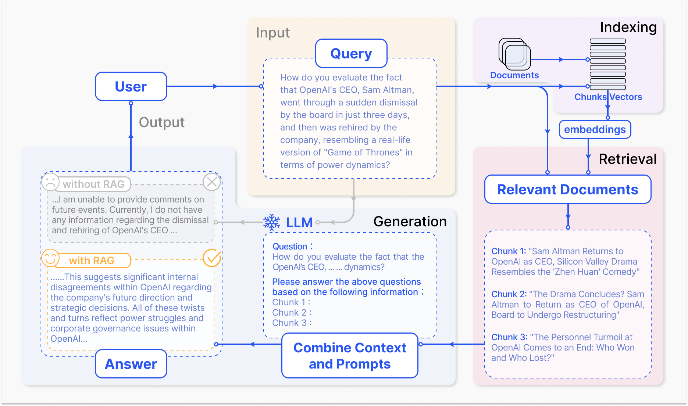
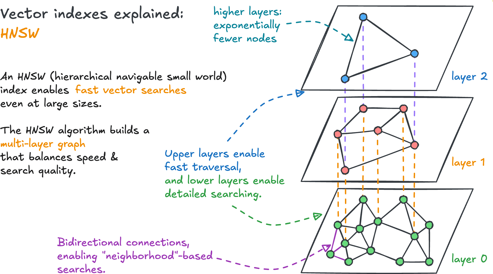
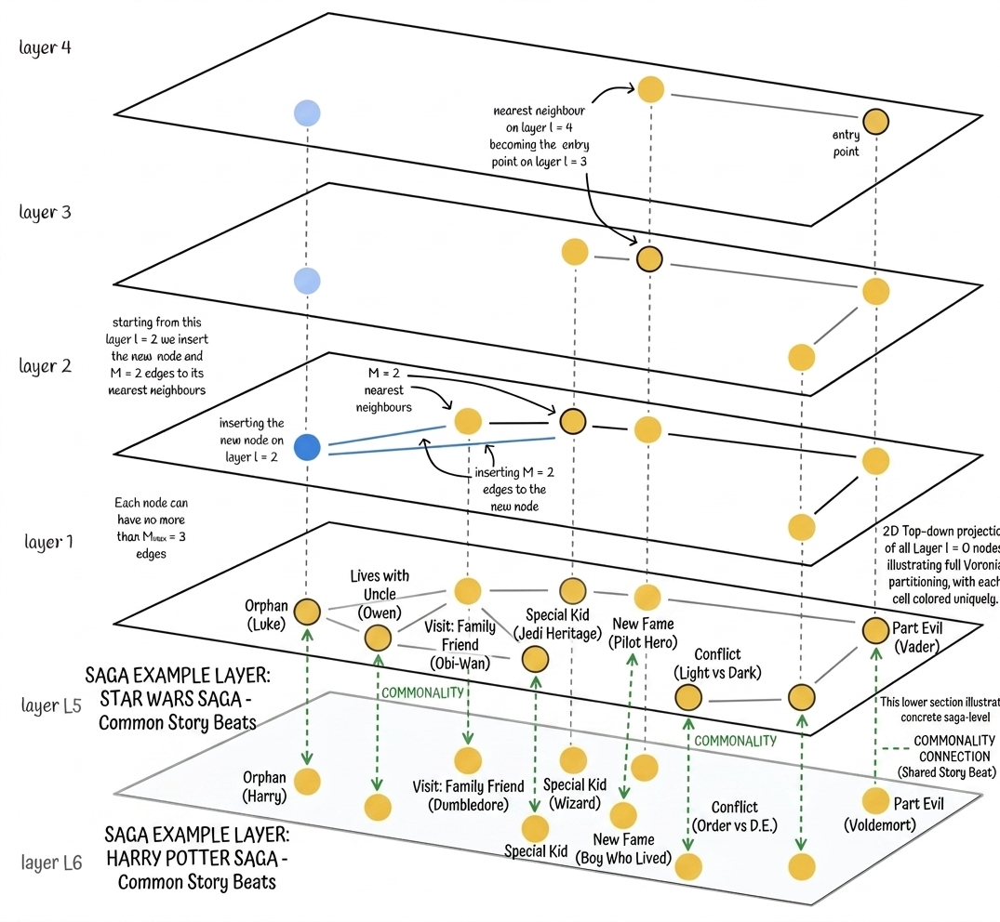
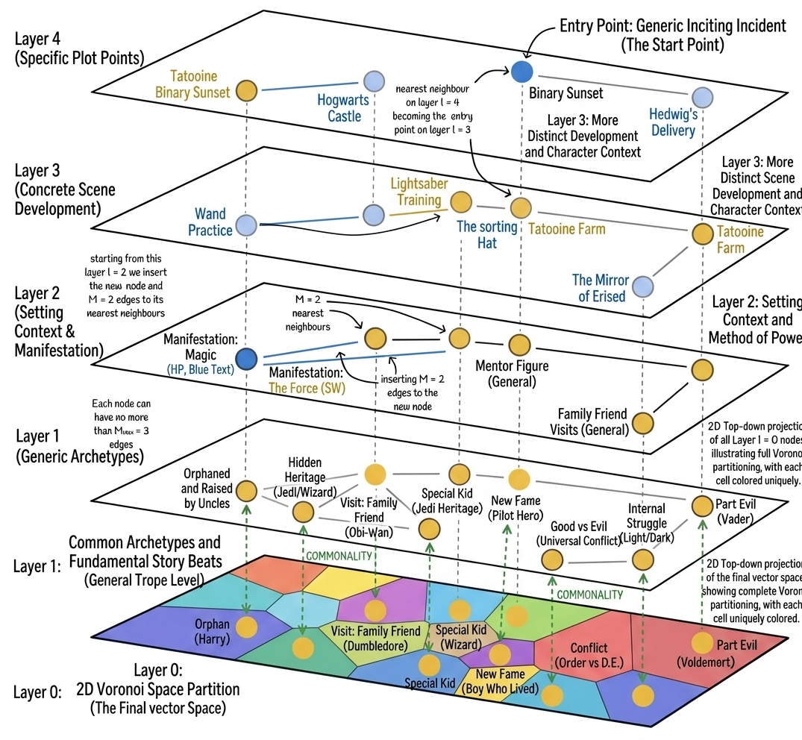
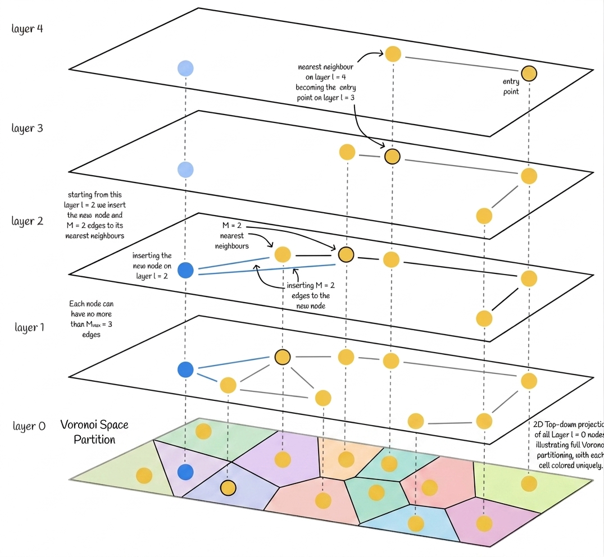
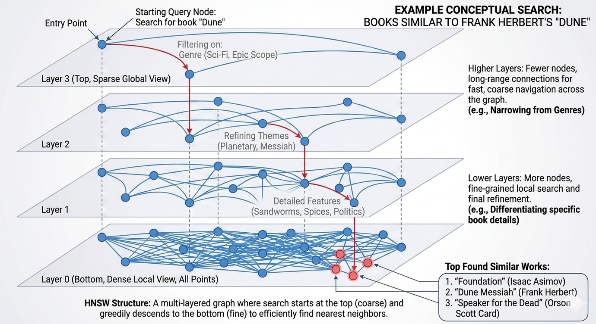

## How to print Revealjs slides

{width="80%" fig-align="center"}

# Why RAG Exists

## LLMs Are Powerful, But Not Grounded

- Strong on fluent generation
- Weak on current, domain-specific, auditable facts
- Can hallucinate under uncertainty [@hallucination]

---

## Core Idea of RAG

Retrieval-Augmented Generation =

1. Retrieve relevant evidence
2. Condition generation on that evidence
3. Improve grounding and traceability

:::{.callout-tip}
RAG converts static model memory into dynamic, evidence-aware answering.
:::

---

## Standard Pipeline

{width=74% fig-alt="RAG indexing retrieval generation"}

- Indexing: split, embed, store
- Retrieval: top-$k$ relevant chunks
- Generation: answer with context

---

## Retrieval Is the Measurement Layer

Before the LLM writes anything, retrieval decides what evidence exists.

| Pipeline choice | Controls | Failure mode |
|---|---|---|
| parser | what text enters corpus | missing tables or sections |
| splitter | retrievable unit | broken context |
| metadata | filtering and citation | weak audit trail |
| embedding | semantic match | missed domain language |
| index | speed vs recall | right chunk not found |
| reranker | prompt evidence | noisy or redundant context |

For SEC analysis, a bad retriever can make a strong model look unreliable.

# RAG Paradigms

## Three Paradigms

{width=78% fig-alt="Naive advanced modular RAG"}

---

## Naive RAG

- Simple retrieve-then-read
- Fast to prototype
- Common weaknesses:
  - irrelevant chunks
  - missed evidence
  - hallucinations

---

## Advanced RAG

- Query rewrite / expansion
- Better chunking and metadata
- Reranking and context compression
- Hybrid retrieval (sparse + dense)

---

## Modular RAG

- Router + retriever + reranker + generator + evaluator
- Dynamic execution paths
- Easier to adapt for enterprise constraints

---

## RAG vs Fine-Tuning

{width=75% fig-alt="RAG vs fine-tuning"}

- RAG: freshness + traceability
- Fine-tuning: behavior/style adaptation
- Production systems often combine both

# Retrieval Design

## Retrieval Sources

- Unstructured text (PDF, HTML, markdown)
- Semi-structured files (tables in PDFs)
- Structured stores (KG, SQL)
- Model-generated auxiliary context

---

## Chunking and Metadata

- Chunk size and overlap control recall vs noise
- Metadata enables filtering and routing
- Structural chunking beats naive fixed windows

---

## Choosing the Right Splitter

| Splitter | Best source | Preserves |
|---|---|---|
| `RecursiveCharacterTextSplitter` | cleaned text | paragraphs and sentence-ish boundaries |
| `MarkdownHeaderTextSplitter` | markdown filings | heading hierarchy |
| `HTMLHeaderTextSplitter` | SEC HTML pages | `h1` / `h2` / `h3` metadata |
| `HTMLSectionSplitter` | sectioned HTML | larger document blocks |
| `HTMLSemanticPreservingSplitter` | tables/lists/media | semantic elements |

Question for students:

> What information would be lost if this chunk were retrieved without its heading, table, or section label?

---

## SEC Chunk Blueprint

```python
Document(
    page_content=chunk_text,
    metadata={
        "ticker": "AAPL",
        "year": 2024,
        "filing": "10-K",
        "item": "Item 7",
        "source_row": 137,
        "chunk_strategy": "recursive_800_150",
    },
)
```

- Text supports generation
- Metadata supports filtering, citations, and evaluation
- Strategy labels make splitter experiments auditable

---

## Query Optimization

- Query expansion (multi-query, sub-queries)
- Query transformation (rewrite, HyDE)
- Query routing by intent/domain

---

## Sparse + Dense Retrieval

Dense similarity:

$$
\operatorname{sim}(q,d)=
\frac{q \cdot d}{\lVert q\rVert \lVert d\rVert}
$$

Sparse retrieval:

- strong for exact terms, tickers, accounting phrases
- useful when wording matters

Dense retrieval:

- strong for semantic paraphrases
- useful when user language differs from filing language

Hybrid retrieval combines both, then reranks.

---

## MMR: Relevant But Not Redundant

Maximal Marginal Relevance:

$$
\operatorname{MMR}(d_i)=
\lambda \operatorname{sim}(d_i,q)
-
(1-\lambda)\max_{d_j\in S}\operatorname{sim}(d_i,d_j)
$$

- First term: close to the query
- Second term: not too similar to already selected chunks
- Useful when top-$k$ returns repeated boilerplate risk language

# Vector Indexing and HNSW

## Why Indexing Matters

- Brute-force search is too slow at scale
- ANN indexes trade exactness for speed
- In RAG, latency and recall must both be acceptable

---

## HNSW Intuition

{width=70% fig-alt="HNSW layers"}

- Top layers: sparse, long-range links
- Bottom layers: dense, local refinement
- Search: coarse-to-fine descent

---

## Story Map for Search

{width=78% fig-alt="Story mapping for layered navigation"}

Interpretation:

- Early phase: explore region quickly
- Late phase: refine local neighbors

---

## Similar Stories as Nearby Vectors

{width=73% fig-alt="Star Wars and Harry Potter story beats shown as nearby vector regions"}

- Similarity search does not require exact keyword overlap
- It can retrieve works with shared structure, archetypes, or themes
- HNSW makes that search fast by moving coarse-to-fine

---

## Detailed Similarity Layers

{width=78% fig-alt="Detailed Star Wars and Harry Potter analogy mapped through HNSW layers"}

- Upper layers: broad archetypes
- Middle layers: setting, conflict, mentor patterns
- Lower layers: specific scenes and details

---

## Voronoi View of Vector Space

{width=72% fig-alt="Voronoi-style partition of vector space under HNSW layers"}

Each cell is a neighborhood. HNSW tries to reach the right neighborhood without scanning every point.

---

## Query Example: Similar to Dune

{width=82% fig-alt="Conceptual HNSW search for books similar to Dune"}

The query starts broad, narrows by genre and themes, then refines to local neighbors.

---

## HNSW Search Math

Greedy move rule:

$$
\begin{align}
\text{move from }x\text{ to }y\text{ if } d(q,y) < d(q,x)
\end{align}
$$

Layer assignment decays exponentially:

$$
\begin{align}
P(L = \ell) \propto e^{-\ell/m_L}
\end{align}
$$

Rule of thumb:

$$
\begin{align}
m_L \approx \frac{1}{\ln(M)}
\end{align}
$$

---

## Tuning Knobs

- $M$: graph connectivity (memory-heavy)
- `efConstruction`: build-time search breadth
- `efSearch`: query-time search breadth

Tradeoff summary:

- recall increases with larger values
- query latency mainly rises with `efSearch`
- memory mostly rises with $M$

---

## Why This Matters for Assignment 4

Assignment 4 requires fair comparison of:

- Prompt-only
- RAG
- Pretraining-only

RAG quality depends heavily on retrieval quality. If retrieval fails, generation cannot recover.

# Preview of P2

## Next Lecture

- RAG generation patterns
- Evaluation matrix design
- LLM-as-a-judge workflows
- Deploying retriever/generator endpoints

