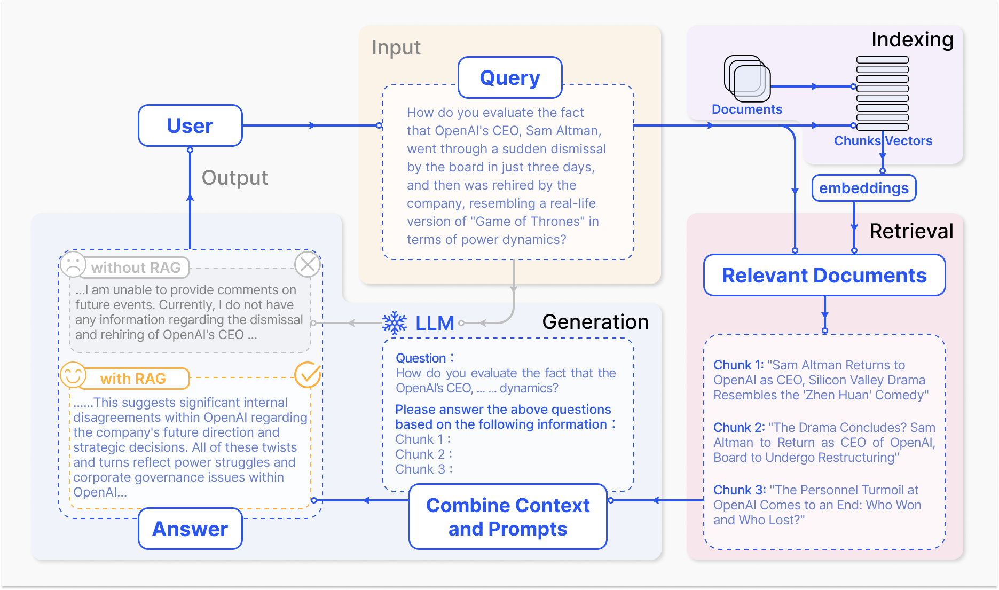
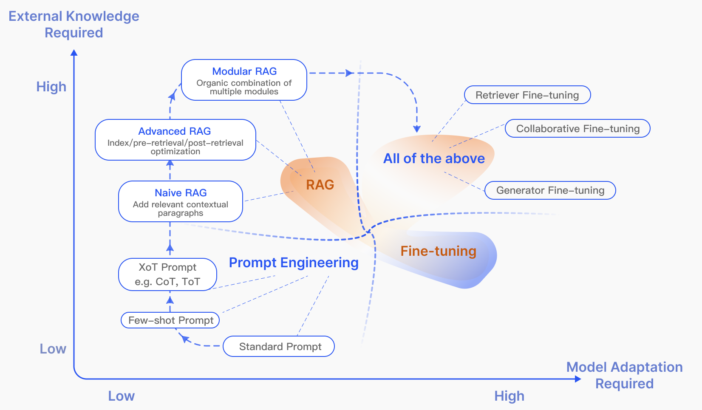
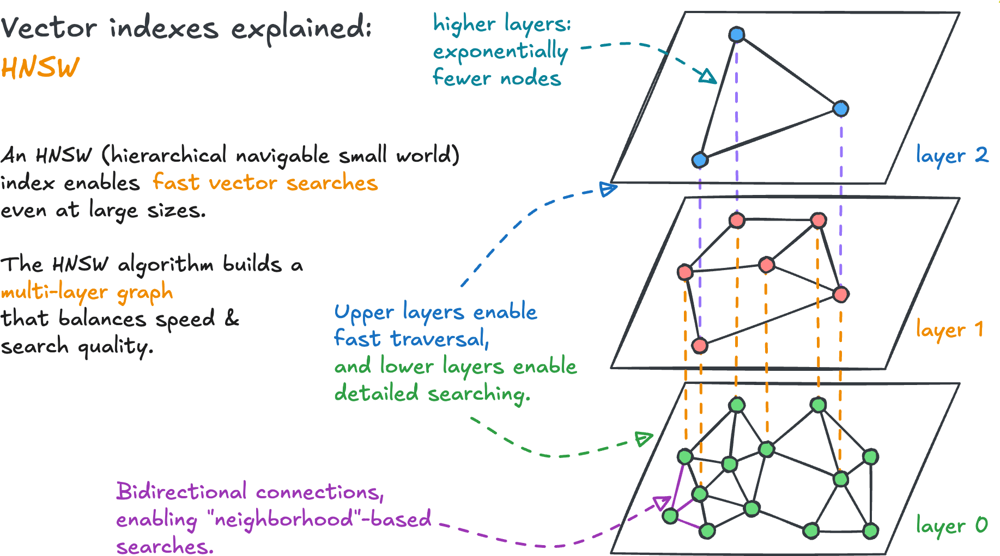
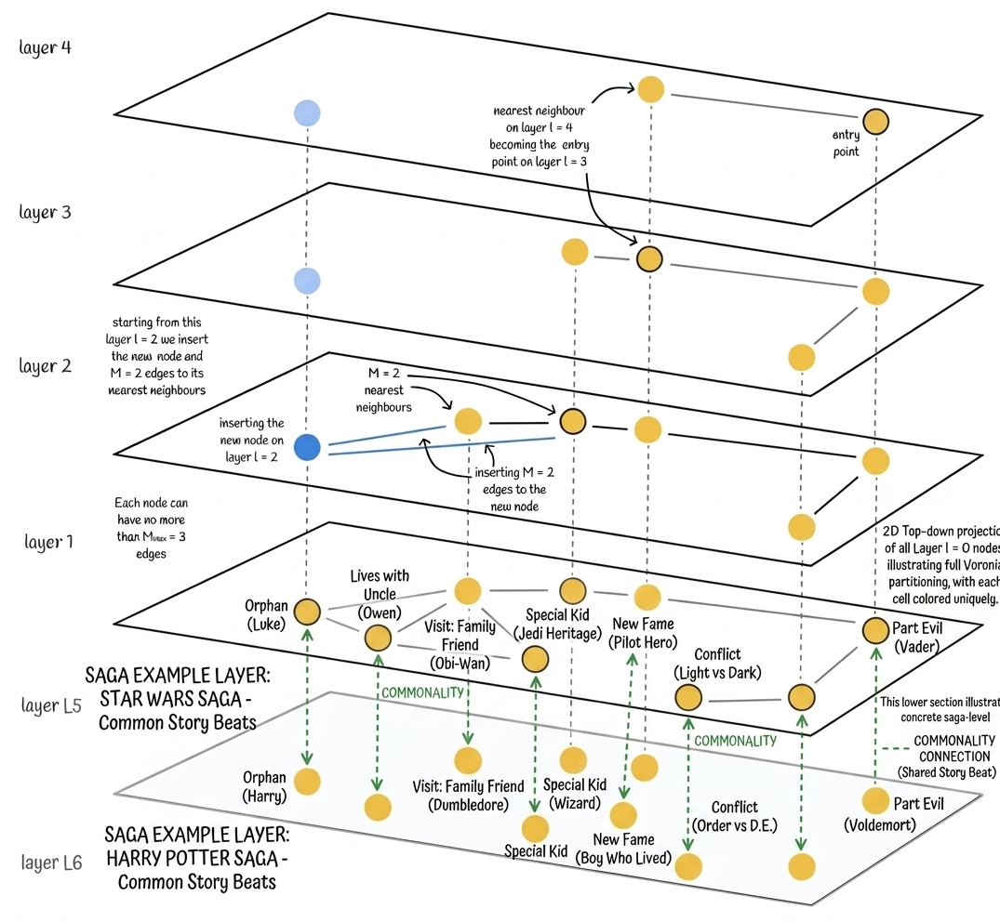
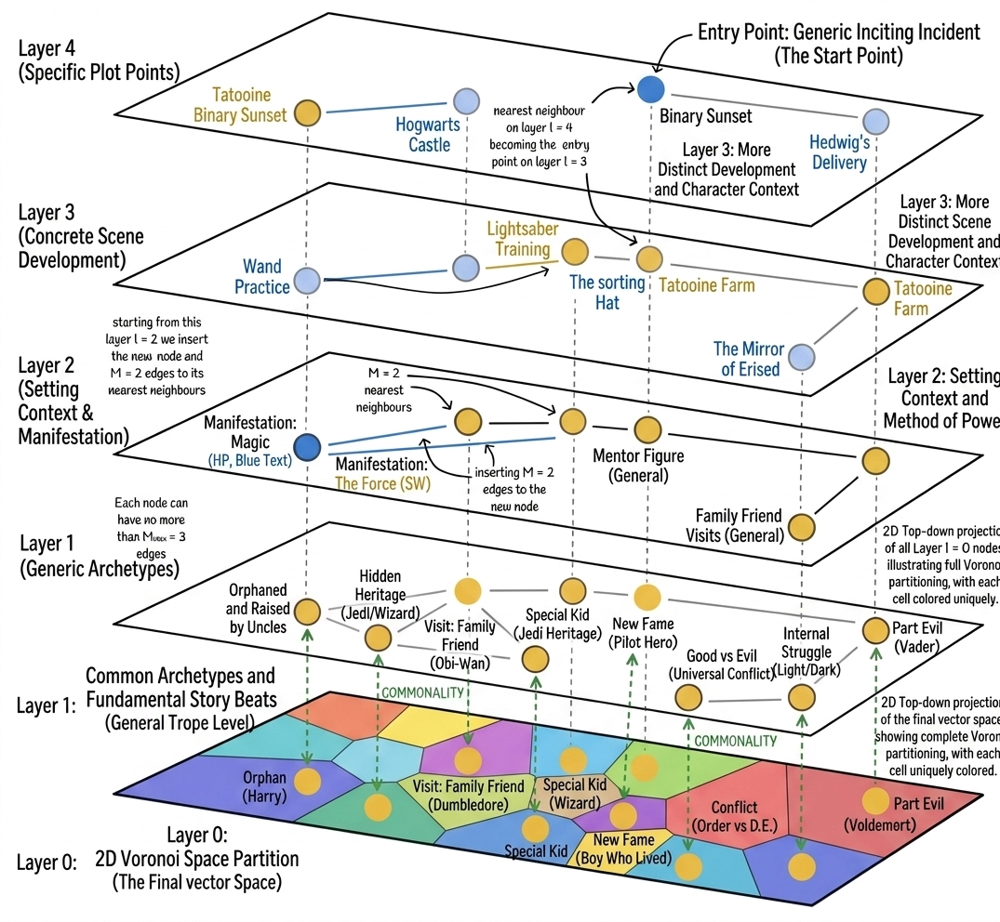
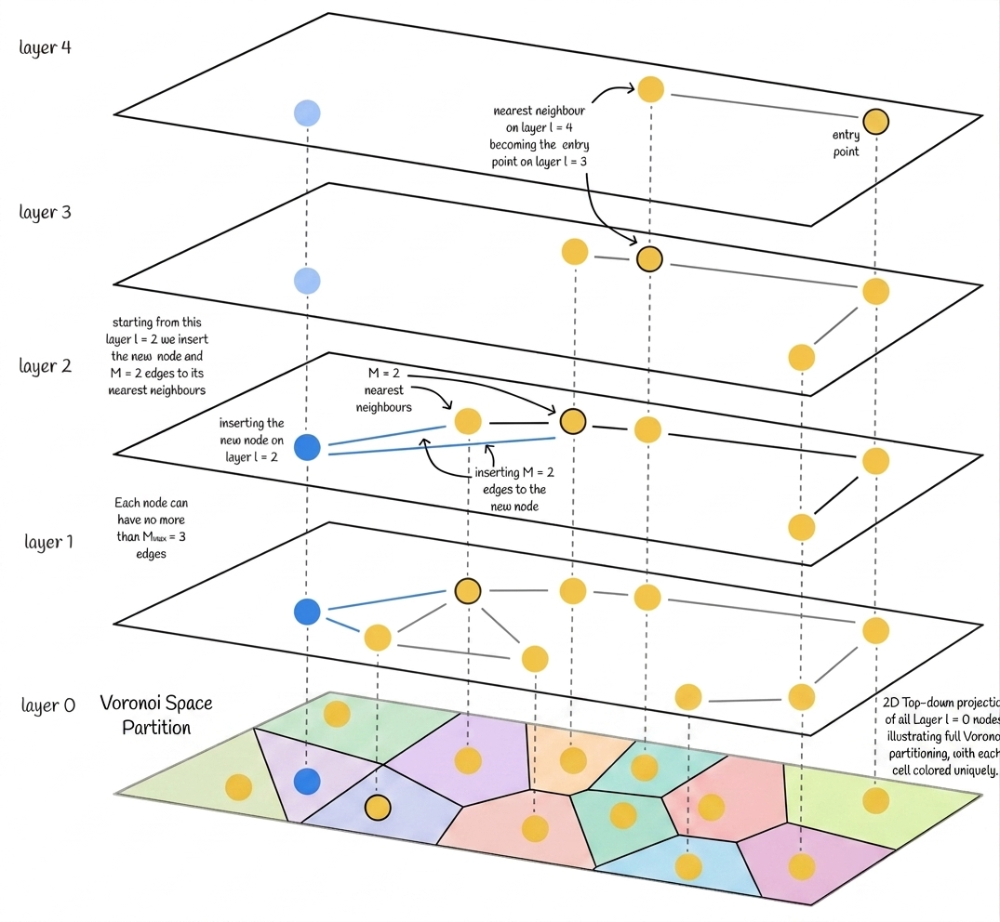
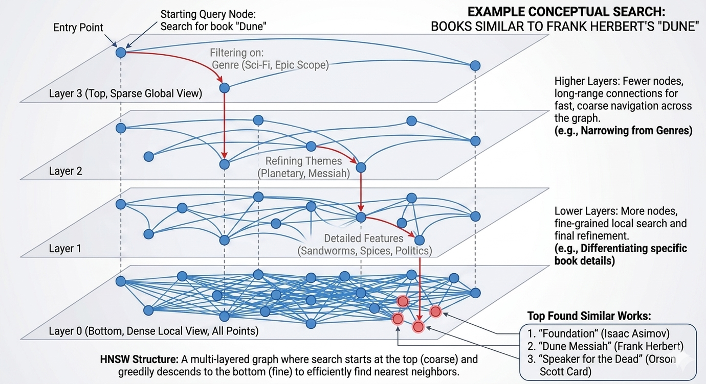

# Why RAG Exists

## LLMs Are Powerful, But Not Grounded

- Strong on fluent generation
- Weak on current, domain-specific, auditable facts
- Can hallucinate under uncertainty [@hallucination]

---

## Foundation Model vs RAG System

Foundation model:

- reusable base trained on broad data
- strong general language behavior
- static knowledge after training

RAG system:

- adds a retriever and knowledge store
- pulls current/domain evidence at query time
- turns static memory into auditable workflow


---

## Core Idea of RAG

Retrieval-Augmented Generation =

1. Retrieve relevant evidence
2. Condition generation on that evidence
3. Improve grounding and traceability

:::{.callout-tip}
RAG converts static model memory into dynamic, evidence-aware answering.
:::

---

## Standard Pipeline

{width=74% fig-align="center" fig-alt="Standard RAG pipeline for indexing, retrieval, and generation" #fig-p1-rag-pipeline}

- Indexing: split, embed, store
- Retrieval: top-$k$ relevant chunks
- Generation: answer with context

---

## Prompt-Only vs RAG for 10-K Questions

| Method | What the model sees | What can go wrong |
|---|---|---|
| Prompt-only | question + model weights | confident but stale or generic answer |
| RAG | question + retrieved 10-K chunks | weak answer if retrieval misses evidence |

SEC example:

> "How did Tesla describe battery supply and production risk across its 10-K filings?"

The RAG answer should cite retrieved filing passages. The prompt-only answer can only rely on model memory.

---

## Retrieval Is the Measurement Layer

Before the LLM writes anything, retrieval decides what evidence exists.

| Pipeline choice | Controls | Failure mode |
|---|---|---|
| parser | what text enters corpus | missing tables or sections |
| splitter | retrievable unit | broken context |
| metadata | filtering and citation | weak audit trail |
| embedding | semantic match | missed domain language |
| index | speed vs recall | right chunk not found |
| reranker | prompt evidence | noisy or redundant context |

For SEC analysis, a bad retriever can make a strong model look unreliable.

# RAG Paradigms

## Three Paradigms

{width=78% fig-align="center" fig-alt="Naive, advanced, and modular RAG paradigms" #fig-rag-paradigms}

---

## Naive RAG

- Simple retrieve-then-read
- Fast to prototype
- Common weaknesses:
  - irrelevant chunks
  - missed evidence
  - hallucinations

---

## Advanced RAG

- Query rewrite / expansion
- Better chunking and metadata
- Reranking and context compression
- Hybrid retrieval (sparse + dense)

---

## Modular RAG

- Router + retriever + reranker + generator + evaluator
- Dynamic execution paths
- Easier to adapt for enterprise constraints

---

## RAG vs Fine-Tuning

{width=75% fig-align="center" fig-alt="RAG compared with fine-tuning for model adaptation" #fig-p1-rag-vs-finetuning}

- RAG: freshness + traceability
- Fine-tuning: behavior/style adaptation
- Production systems often combine both

# Retrieval Design

## Retrieval Sources

- Unstructured text (PDF, HTML, markdown)
- Semi-structured files (tables in PDFs)
- Structured stores (KG, SQL)
- Model-generated auxiliary context

---

## Chunking and Metadata

- Chunk size and overlap control recall vs noise
- Metadata enables filtering and routing
- Structural chunking beats naive fixed windows

---

## Choosing the Right Splitter

| Splitter | Best source | Preserves |
|---|---|---|
| `RecursiveCharacterTextSplitter` | cleaned text | paragraphs and sentence-ish boundaries |
| `MarkdownHeaderTextSplitter` | markdown filings | heading hierarchy |
| `HTMLHeaderTextSplitter` | SEC HTML pages | `h1` / `h2` / `h3` metadata |
| `HTMLSectionSplitter` | sectioned HTML | larger document blocks |
| `HTMLSemanticPreservingSplitter` | tables/lists/media | semantic elements |

Core diagnostic:

> What information would be lost if this chunk were retrieved without its heading, table, or section label?

---

## SEC Chunk Blueprint

```python
Document(
    page_content=chunk_text,
    metadata={
        "ticker": "TSLA",
        "year": 2024,
        "filing": "10-K",
        "item": "Item 7",
        "chunk_id": "TSLA-2024-00137",
        "chunk_strategy": "recursive_1200_180",
    },
)
```

- Text supports generation
- Metadata supports filtering, citations, and evaluation
- Strategy labels make splitter experiments auditable

---

## Multi-Year SEC Evidence

RAG turns a filing archive into a query-time evidence system.

| Evidence layer | Role in RAG | Failure if missing |
|---|---|---|
| filing text | source for generated claims | generic or stale answer |
| year metadata | comparison across time | weak temporal reasoning |
| chunk IDs | citation and audit trail | unverifiable answer |
| retrieval scores | ranking evidence | noisy or buried context |

For Tesla, the same question can retrieve evidence from early production years and recent filings, making change over time visible.

---

## Query Optimization

- Query expansion (multi-query, sub-queries)
- Query transformation (rewrite, HyDE)
- Query routing by intent/domain

---

## Sparse + Dense Retrieval

Dense similarity:

$$
\begin{align}
\operatorname{sim}(q,d)=
\frac{q \cdot d}{\lVert q\rVert \lVert d\rVert}
\end{align}
$$

Sparse retrieval:

- strong for exact terms, tickers, accounting phrases
- useful when wording matters

Dense retrieval:

- strong for semantic paraphrases
- useful when user language differs from filing language

Hybrid retrieval combines both, then reranks.

---

## Embeddings as Coordinates

An embedding model maps text into a vector space:

$$
\begin{align}
E(\text{text}) = [x_1, x_2, \ldots, x_n]
\end{align}
$$

Nearby vectors usually mean nearby meaning, not identical words.

| Text | Vector-space signal |
|---|---|
| "battery cell supply" | technical EV component language |
| "manufacturing ramp risk" | production and execution language |
| "regulatory approval for Autopilot" | safety and compliance language |

The retriever searches this geometry before the language model writes an answer.

---

## Embedding Service Pattern

```python
from typing import Any, Dict, List
from langchain_core.embeddings import Embeddings
from langchain_huggingface import HuggingFaceEmbeddings

class EmbeddingService(Embeddings):
    def __init__(self, config: Dict[str, Any]):
        model_name = config.get("embeddingModelName", "Qwen/Qwen3-Embedding-4B")
        self.hf_embeddings = HuggingFaceEmbeddings(
            model_name=model_name,
            model_kwargs={"trust_remote_code": True},
        )

    def embed_documents(self, texts: list[str]) -> List[List[float]]:
        return self.hf_embeddings.embed_documents(
            [text.replace("\n", " ") for text in texts]
        )

    def embed_query(self, text: str) -> List[float]:
        return self.hf_embeddings.embed_query(text.replace("\n", " "))
```

The output vector is not interpretable one dimension at a time. Its value comes from distance comparisons across many dimensions.

---

## Sparse Evidence Is Easy to Miss

If "battery" or "batteries" appears 44 times in a filing with about 62,143 words:

$$
\begin{align}
P(\text{battery word}) \approx \frac{44}{62143} \approx 0.00071
\end{align}
$$

That is about 0.071% of the words.

Implication:

- a relevant concept can exist in the filing and still be rare
- top-$k$ retrieval can miss sparse evidence
- query wording matters when the target evidence is thin

This is why dense retrieval, sparse matching, reranking, and metadata filters often work better together.

---

## MMR: Relevant But Not Redundant

Maximal Marginal Relevance:

$$
\begin{align}
\operatorname{MMR}(d_i)=
\lambda \operatorname{sim}(d_i,q)
-
(1-\lambda)\max_{d_j\in S}\operatorname{sim}(d_i,d_j)
\end{align}
$$

- First term: close to the query
- Second term: not too similar to already selected chunks
- Useful when top-$k$ returns repeated boilerplate risk language

# Vector Indexing and HNSW

## Why Indexing Matters

- Brute-force search is too slow at scale
- ANN indexes trade exactness for speed
- In RAG, latency and recall must both be acceptable

---

## HNSW Intuition

{width=70% fig-align="center" fig-alt="HNSW layers for coarse-to-fine vector search" #fig-p1-hnsw-layers}

- Top layers: sparse, long-range links
- Bottom layers: dense, local refinement
- Search: coarse-to-fine descent

---

## Story Map for Search

{width=78% fig-align="center" fig-alt="Story mapping analogy for layered search navigation" #fig-p1-story-mapping}

Interpretation:

- Early phase: explore region quickly
- Late phase: refine local neighbors

---

## Similar Stories as Nearby Vectors

{width=73% fig-align="center" fig-alt="Star Wars and Harry Potter story beats shown as nearby vector regions" #fig-p1-hsw-basic}

- Similarity search does not require exact keyword overlap
- It can retrieve works with shared structure, archetypes, or themes
- HNSW makes that search fast by moving coarse-to-fine

---

## Detailed Similarity Layers

{width=78% fig-align="center" fig-alt="Detailed Star Wars and Harry Potter analogy mapped through HNSW layers" #fig-p1-hsw-detailed}

- Upper layers: broad archetypes
- Middle layers: setting, conflict, mentor patterns
- Lower layers: specific scenes and details

---

## Voronoi View of Vector Space

{width=72% fig-align="center" fig-alt="Voronoi-style partition of vector space under HNSW layers" #fig-p1-hsw-voronoi}

Each cell is a neighborhood. HNSW tries to reach the right neighborhood without scanning every point.

---

## Finding Stories Similar to Dune

{width=82% fig-align="center" fig-alt="Conceptual HNSW search for books similar to Dune" #fig-p1-hsw-dune}

The query starts broad, narrows by genre and themes, then refines to local neighbors.

---

## HNSW Search Math

Greedy move rule:

$$
\begin{align}
\text{move from }x\text{ to }y\text{ if } d(q,y) < d(q,x)
\end{align}
$$

Layer assignment decays exponentially:

$$
\begin{align}
P(L = \ell) \propto e^{-\ell/m_L}
\end{align}
$$

Rule of thumb:

$$
\begin{align}
m_L \approx \frac{1}{\ln(M)}
\end{align}
$$

---

## HNSW Layer Probability

HNSW gives most vectors short-range links and gives a few vectors long-range links.

If layer probability decays exponentially:

$$
\begin{align}
P(L \ge \ell) \approx e^{-\ell/m_L}
\end{align}
$$

Then higher layers contain fewer points:

| Layer | Role | Intuition |
|---|---|---|
| high | long-range navigation | jump near the right region |
| middle | neighborhood routing | narrow the candidate area |
| bottom | local search | inspect close neighbors |

The structure acts like a probabilistic shortcut system through vector space.

---

## Search Breadth as a Recall Tradeoff

`efSearch` controls how many candidates remain active during query-time search.

| Setting | Search behavior | Typical effect |
|---|---|---|
| low `efSearch` | fewer candidates | lower latency, higher miss risk |
| high `efSearch` | more candidates | higher recall, higher latency |

For rare Tesla evidence such as battery-specific language, increasing search breadth can recover chunks that a narrower search skips.

---

## Tuning Knobs

- $M$: graph connectivity (memory-heavy)
- `efConstruction`: build-time search breadth
- `efSearch`: query-time search breadth

Tradeoff summary:

- recall increases with larger values
- query latency mainly rises with `efSearch`
- memory mostly rises with $M$

---

## References
