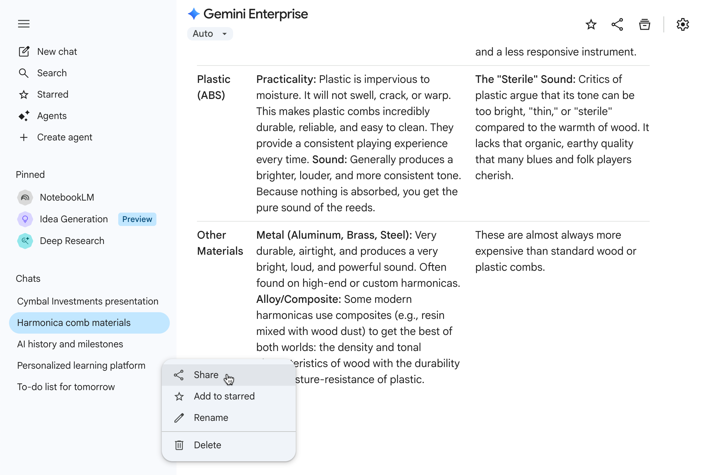

## LangChain package setup

Use Python 3.11 or 3.12 for this course. Run the `%pip` cell below in the notebook's active kernel before the examples. After installing or upgrading, restart the kernel (Colab: restart the session), then run the example cells from the top. In a terminal, use `python -m pip install -U` with the same package list.

Install names use hyphens, while Python imports use underscores: install `langchain-core`, then use `from langchain_core.prompts import ChatPromptTemplate`. Text splitters come from `langchain_text_splitters`, loaders/vector stores from `langchain_community`, and provider integrations from their own packages. Installing `langchain` alone does not supply all these integrations.

If an import fails, check the selected kernel with `import sys; print(sys.executable)`, rerun the setup cell there, and restart it. Do not restore old import paths to fix a missing package. See the [LangChain migration guide](https://docs.langchain.com/oss/python/migrate/langchain-v1).

```python
%pip install -U langchain-core langchain-community langchain-huggingface faiss-cpu sentence-transformers pandas
```


## Module Learning Objectives

By the end of Module 5, students should be able to:

1. build a retrieval pipeline over course-aligned text data
2. combine retrieval and generation in a grounded workflow
3. inspect retrieval quality rather than assuming retrieval works
4. save reusable RAG artifacts for later evaluation

## Tutorial Learning Objectives

Build a minimum viable RAG pipeline over **course-aligned text data** so you can reuse it in `M05_Lab1`, `M05_Lab2`, and `M05_A`.

Use one of these sources:

- your saved `assignment01/chunks.csv`
- the course SEC starter corpus in `data/outputs/sec_10k_sections/sec_10k_2024_retrieval_ready_chunks.csv`
- the Apple finance examples in `help-code/4-nlp-finance/data/`
- a curated text set in `data/corpora`

## How This Tutorial Connects

- `M05_Lab1` extends this into retrieval diagnostics and chunking comparison.
- `M05_T2` adds evaluation and auditability.
- `M05_A` compares prompt-only, RAG, and pretraining-only methods.
- `M05_Proj` can reuse the same retrieval design decisions in a larger system.

## Architecture

1. Load corpus
2. Chunk or reuse chunks
3. Embed and index
4. Retrieve context
5. Generate answer
6. Save retrieval evidence

## Step 1: Load SEC-aligned text

```python
from pathlib import Path
import pandas as pd

chunks_path = Path("/content/drive/MyDrive/assignment01/chunks.csv")
course_chunks_path = Path("data/outputs/sec_10k_sections/sec_10k_2024_retrieval_ready_chunks.csv")
apple_excerpt_path = Path("help-code/4-nlp-finance/data/apple_2025_10k_excerpt.txt")

if chunks_path.exists():
    chunks_df = pd.read_csv(chunks_path)
    text_col = "chunk_text"
    print("Loaded your Assignment 1 chunks")
elif course_chunks_path.exists():
    chunks_df = pd.read_csv(course_chunks_path)
    text_col = "chunk_text"
    chunks_df = chunks_df.rename(columns={"filing_year": "year", "section_name": "item"})
    chunks_df["ticker"] = chunks_df.get("ticker", "COURSE_SEC")
    print("Loaded course SEC starter chunks")
elif apple_excerpt_path.exists():
    apple_text = apple_excerpt_path.read_text(encoding="utf-8")
    chunks_df = pd.DataFrame(
        {
            "chunk_id": ["apple_2025_10k_excerpt"],
            "ticker": ["AAPL"],
            "year": [2025],
            "item": ["10-K excerpt"],
            "chunk_text": [apple_text],
        }
    )
    text_col = "chunk_text"
    print("Loaded Apple 2025 10-K companion excerpt")
else:
    raise FileNotFoundError("Provide assignment01/chunks.csv, the course SEC starter CSV, or the Apple companion excerpt.")

chunks_df[[c for c in ["chunk_id", "ticker", "year", "item", text_col] if c in chunks_df.columns]].head()
```

## Step 2: Build document objects

```python
from langchain_core.documents import Document

docs = [
    Document(
        page_content=row[text_col],
        metadata={
            "ticker": row.get("ticker"),
            "year": row.get("year"),
            "item": row.get("item"),
            "chunk_id": row.get("chunk_id"),
            "source_file": row.get("file_name"),
            "retrieval_unit": row.get("retrieval_unit"),
        },
    )
    for _, row in chunks_df.head(500).iterrows()
]

print("Documents prepared:", len(docs))
```

## Step 3: Embeddings + FAISS

```python
from langchain_community.vectorstores import FAISS
from langchain_huggingface import HuggingFaceEmbeddings

embed_model = HuggingFaceEmbeddings(model_name="sentence-transformers/all-MiniLM-L6-v2")
vectorstore = FAISS.from_documents(docs, embed_model)
retriever = vectorstore.as_retriever(search_kwargs={"k": 5})

print("FAISS vectors:", vectorstore.index.ntotal)
```

## Step 4: Retriever Interface

```python
def format_docs(retrieved_docs):
    return "\n\n".join(
        (
            f"[{d.metadata.get('ticker')} {d.metadata.get('year')} "
            f"{d.metadata.get('item')} | {d.metadata.get('chunk_id')}]\n"
            f"{d.page_content}"
        )
        for d in retrieved_docs
    )
```

## Step 5: Prompt + Chain

```python
from langchain_core.prompts import ChatPromptTemplate

prompt = ChatPromptTemplate.from_template(
    """
    Answer the question using only the SEC filing context below.
    If the evidence is missing or weak, say that you do not have enough filing support.

    Question: {question}

    Context:
    {context}
    """
)

print("Wire your chosen chat model to this prompt.")
```

## Step 6: Query Function

```python
def ask_rag(question: str) -> str:
    retrieved = retriever.invoke(question)
    context = format_docs(retrieved)
    # return chain.invoke({"question": question, "context": context})
    return context
```

In this tutorial, returning the formatted context is enough to validate retrieval before you connect a chat model. Once retrieval looks reasonable, wire your provider model to the prompt and return the generated answer.

## Suggested Practice Queries

Use company-comparison questions that resemble the assignment:

1. How do the two companies describe supply chain risk differently?
2. Which company emphasizes capital expenditure more strongly in Item 7?
3. What evidence exists for regulatory or litigation risk?

## Quality Checklist

Before moving on:

1. At least one retrieved chunk is clearly relevant for each test query.
2. Retrieved metadata identifies company, year, and section.
3. The answer abstains when the evidence is weak.
4. You save one retrieval evidence table for later reporting.

## Output Artifact

Export one notebook or script with:

- `ask_rag(question)` function
- config block (`chunk_size`, `overlap`, `k`)
- at least three SEC-focused sample Q&A runs
- one small retrieval evidence table

## AI Use and Share Links {.unnumbered}

If generative AI materially supports your work for this tutorial, include an AI disclosure appendix or separate AI disclosure document if your instructor requests one. Include the complete prompt(s), relevant output excerpt(s), validation steps, and direct shared chat link(s) when available.

{width="80%" fig-align="center" fig-alt="ChatGPT shared conversation link interface" #fig-t1-chatgpt-share}

{width="80%" fig-align="center" fig-alt="Gemini shared conversation link interface" #fig-t1-gemini-share}

When possible, use **one continuous chat** for the activity so the full reasoning trail can be reviewed in one place. If you used multiple chats, share **all chats directly related** to the work.

Tools such as **ChatGPT**, **Claude**, and **Gemini** support direct chat sharing. If sharing or export is not available, include copied prompt/output evidence or screenshots instead. Because shared links may be viewable by anyone with the link, do not include confidential, personal, or restricted information in those chats.
