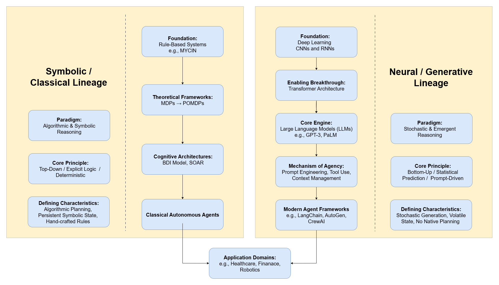

# Why Agentic AI Needs Its Own Vocabulary

Module 6 moves from retrieval and generation toward **systems that can pursue goals through sequences of actions**. That shift sounds simple, but it changes the object of analysis. We are no longer asking only whether a model can summarize a document or classify text. We are asking whether a system can interpret a goal, decide what information or tools it needs, act in an environment, observe the result, and revise its next step.

That is the core idea of **agentic AI**. An agentic system is not just a model. It is a model embedded inside a larger control structure: prompts, memory, tools, skills, policies, traces, evaluators, and human oversight. Recent surveys emphasize that modern AI agents should be studied as **systems** rather than isolated language models, because their behavior depends on architecture, environment, interfaces, and evaluation design [@aiAgentSystems2026; @agenticArtificialIntelligence2026; @pathAheadAgenticAI2026].

For business analytics, this distinction matters. A chatbot can answer a question about an SEC filing. A financial agent can retrieve the filing, decide which sections matter, call parsing tools, compare evidence across firms, produce an auditable answer, and expose the limitations of its workflow. The second system is more useful, but also more risky. It has more moving parts, more degrees of freedom, and more ways to fail.

# Agents, Agency, and Autonomicity

An **agent** is a system that maps observations to actions in pursuit of a goal. At the most abstract level, an agent receives information about an environment, updates some internal state, chooses an action, and observes the consequences.

The word **agency** refers to the system's capacity to act in a goal-directed way. The word **autonomy** refers to how much of that action can occur without direct human intervention. These are related, but not identical.

| Concept | Core Question | Example |
|---|---|---|
| Agency | Can the system pursue a goal through action? | A workflow that retrieves evidence, drafts an answer, and checks itself |
| Autonomy | How independently can the system operate? | A system that runs a multi-step analysis without step-by-step human approval |
| Autonomicity | Can the system regulate its own operation? | A system that monitors failures, retries tools, changes strategy, or asks for help |

The term **autonomicity** is useful because it shifts attention from raw independence to self-regulation. A highly autonomous system that cannot detect its own failures is not robust. A good agentic system should not merely act; it should monitor whether its actions are working.

In Module 6, we will use four levels of agency:

| Level | Description | Course Example |
|---|---|---|
| Assistive | Produces recommendations or drafts, but a human drives the workflow | A model summarizes retrieved SEC chunks |
| Tool-using | Calls bounded tools selected by a human-designed interface | A LangChain tool retrieves Item 7 and Item 7A passages |
| Workflow-agentic | Plans and executes a multi-step sequence within constraints | A single SEC research agent plans, retrieves, answers, and logs evidence |
| Multi-agent | Coordinates specialized roles or subagents | Researcher, analyst, critic, and compliance-review agents work together |

The deeper the level of agency, the stronger the need for constraints, traces, evaluation, and governance.

# The Agent Loop

Most agentic systems can be described by a repeating loop:

1. **Perceive**: receive user goals, context, retrieved documents, tool outputs, or environment state
2. **Reason**: decide what the situation means and what should happen next
3. **Act**: call a tool, ask a question, write code, retrieve data, update memory, or produce output
4. **Observe**: inspect the result of the action
5. **Revise**: continue, stop, retry, delegate, or ask for human input

This loop is simple enough to teach, but it hides a major design question: **what controls the transition from one step to the next?**

In classical AI, the transition is often controlled by explicit rules, planners, or policies. In modern LLM agents, the transition may be partly generated by the model from a prompt, partly constrained by schemas, and partly governed by an orchestration framework. That is why architecture matters so much. The same model can behave differently when placed inside different loops.

{#fig-m6-dual-lineages width="90%" fig-align="center" fig-alt="A conceptual diagram distinguishing symbolic/classical and neural/generative lineages of agentic AI."}

# Mathematical Background: Sequential Decision-Making

Agentic AI is new in its LLM-based implementation, but the mathematical idea of goal-directed action is older. The standard formal language comes from sequential decision-making.

## Markov Decision Processes

A **Markov Decision Process** (MDP) describes an agent interacting with an environment when the current state is fully observable. It is usually written as:

$$
\mathcal{M} = (\mathcal{S}, \mathcal{A}, P, R, \gamma)
$$

where:

- $\mathcal{S}$ is the set of possible states
- $\mathcal{A}$ is the set of possible actions
- $P(s' \mid s, a)$ is the transition probability from state $s$ to state $s'$ after action $a$
- $R(s, a, s')$ is the reward or utility signal
- $\gamma \in [0,1]$ is a discount factor that controls how much future reward matters

A policy $\pi(a \mid s)$ tells the agent which action to take in each state. The goal is to find a policy that maximizes expected discounted return:

$$
J(\pi) = \mathbb{E}_{\pi}\left[\sum_{t=0}^{T} \gamma^t R(s_t, a_t, s_{t+1})\right]
$$

This formalism is useful because it gives us a clean vocabulary:

- state
- action
- transition
- reward
- policy
- horizon

But MDPs are too clean for many LLM-agent settings. A financial research agent usually does not have a complete state description. It has partial evidence, noisy retrieval results, uncertain model outputs, and tools that may fail.

## Partially Observable Decision Processes

When the agent cannot directly observe the full state, we move toward a **Partially Observable Markov Decision Process** (POMDP):

$$
\mathcal{P} = (\mathcal{S}, \mathcal{A}, P, R, \Omega, O, \gamma)
$$

where $\Omega$ is the set of observations and $O(o \mid s', a)$ is the probability of observing $o$ after action $a$ leads to state $s'$.

Because the true state is hidden, the agent maintains a **belief state**:

$$
b_t(s) = P(s_t = s \mid o_{1:t}, a_{1:t-1})
$$

This idea maps surprisingly well to LLM agents. An LLM agent rarely knows the world directly. It has a belief-like working context built from:

- system instructions
- user prompts
- retrieved passages
- tool outputs
- memory summaries
- trace history
- evaluator feedback

The practical question becomes: **how do we keep that working context reliable enough to support action?**

## Why the Math Still Matters

We do not need to solve a full POMDP to build a course SEC agent. But the mathematical framing helps students understand why agentic AI is difficult:

| Formal Concept | LLM-Agent Analogy | Failure Mode |
|---|---|---|
| State | Current context, memory, evidence, and tool results | Missing or stale context |
| Action | Tool call, retrieval query, answer draft, delegation | Wrong tool or unsafe action |
| Reward | Business usefulness, factuality, faithfulness, cost | Optimizing fluency instead of correctness |
| Policy | Prompt, planner, graph, routing rule, or learned controller | Inconsistent next-step decisions |
| Observation | Tool output, retrieved evidence, critic feedback | Misread or untrusted output |
| Horizon | Number of reasoning/tool steps | Long-horizon drift or compounding errors |

This is the first important lesson of Module 6: **an agent is a control system over a model, not just a model with a longer prompt**.

# From Tools to Skills

Early LLM-agent discussions often focused on **tools**. A tool is an external function the model can call: search, calculator, file reader, database query, SEC parser, Python executor, or API endpoint.

Tools matter, but they are not enough. Recent work argues that **skills** are a richer unit of agent capability than tool calls alone [@agenticSkillsBeyondToolUse2026]. A skill is a reusable unit of know-how. It may include instructions, examples, scripts, templates, constraints, and resources. A tool tells the agent what it can call. A skill tells the agent how to perform a class of work.

In the Module 6 context:

| Component | What It Provides | SEC Agent Example |
|---|---|---|
| Tool | An executable capability | `retrieve_sec_evidence(question)` |
| Skill | Reusable procedure and expertise | "Compare risk disclosures using Item 7A and cite source rows" |
| Memory | Prior context or learned experience | Previous ticker mappings, section labels, common SEC language |
| Policy | Rule for selecting actions | "Retrieve before answering; stop if evidence is insufficient" |
| Trace | Record of what happened | Tool calls, inputs, outputs, latency, source rows |

The difference matters because skills make agentic work **composable**. Instead of asking a model to rediscover a workflow each time, we provide structured competence that can be loaded, inspected, and reused.

{#fig-agent-skills-architecture width="80%" fig-align="center" fig-alt="A teaching diagram that distinguishes skills, MCP servers, subagents, hooks, tools, filesystem context, and plugins in an agentic architecture."}

The diagram above is useful because it separates several ideas that students often collapse:

- **Skills** are reusable knowledge and workflows.
- **MCP servers** connect the agent to external tools and data.
- **Subagents** delegate work to isolated specialist workers.
- **Hooks** automate deterministic events before or after tool use.
- **Filesystem context** provides persistent project knowledge.
- **Plugins** bundle capabilities for distribution.

In a serious agentic architecture, these pieces should not be vague metaphors. They should be explicit design objects.

## MCP Servers Are Not Agents

It is important to separate **agentic AI** from **MCP servers**. These concepts are related, but they live at different layers of the system.

An MCP server is an interface layer. It exposes tools, resources, prompts, or structured data to a model-facing application. It answers the question: **How can the agent connect to this capability?**

An agentic AI system is a control layer. It decides what goal to pursue, what context to load, which tool or MCP server to use, when to delegate, whether to revise, and when to stop. It answers the question: **How should the system act over time?**

| Concept | Primary Role | Typical Unit | Failure Mode |
|---|---|---|---|
| MCP server | Capability boundary | tool, resource, data connector | unsafe exposure, bad schema, malicious description, permission leakage |
| Skill | Procedural knowledge | reusable workflow instruction | vague steps, missing validation, overbroad scope |
| Tool | Executable action | function or API call | wrong input, unreliable output, unhandled error |
| Agent | Control policy | loop over state, actions, observations | poor planning, unsupported claims, unsafe autonomy |
| Multi-agent system | Coordinated control | role-specialized agents | coordination cost, conflicting instructions, weak handoff |

The distinction matters in governance. Securing an MCP server does not automatically make an agent safe. A safe server can still be misused by a poorly designed agent. Similarly, a well-designed agent can still fail if a server exposes too much authority or returns ambiguous results.

# Architecture: The System Around the Model

The current literature increasingly treats agentic AI as an architecture problem [@aiAgentSystems2026; @agenticArtificialIntelligence2026; @orchestrationMultiAgentSystems2026]. The model is important, but the system behavior depends on how the model is embedded.

## Core Architectural Layers

| Layer | Purpose | Design Question |
|---|---|---|
| Model layer | Language understanding, reasoning, synthesis | Which model is good enough for which role? |
| Prompt and instruction layer | Defines role, constraints, and output format | What should the model know before acting? |
| Tool layer | Exposes external actions and data | Which actions are allowed, and with what permissions? |
| Skill layer | Encodes reusable procedures | What workflows should be standardized? |
| Memory layer | Stores state, context, and experience | What should persist across steps or sessions? |
| Orchestration layer | Controls sequence, routing, branching, and delegation | Who acts next, and why? |
| Evaluation layer | Checks output and process quality | What counts as success or failure? |
| Governance layer | Sets boundaries, accountability, and audit requirements | What must be logged, restricted, or escalated? |

An applied business agent needs all of these layers. If any layer is missing, reliability depends too heavily on model behavior alone.

## Single-Agent Architecture

A single-agent workflow uses one primary decision-making unit. It may still call many tools, but one agent controls the process.

Advantages:

- simpler to teach
- easier to trace
- fewer coordination failures
- good for bounded tasks

Limitations:

- overloaded context
- weak role separation
- difficult to specialize evaluation
- high risk of hidden reasoning shortcuts

For Module 6, Tutorial 1 starts here: one SEC research agent retrieves evidence, drafts an answer, and logs the evidence it used.

## Multi-Agent Architecture

A multi-agent workflow decomposes work into specialized roles. For example:

- planner
- retriever
- financial analyst
- critic
- compliance reviewer
- report writer

The literature on multi-agent orchestration emphasizes that the benefit is not "more agents" by itself. The benefit comes from **structured division of labor** and **controlled coordination** [@orchestrationMultiAgentSystems2026; @financialDocumentAgents2026]. Poorly designed multi-agent systems can become slower, more expensive, and less reliable than a single agent.

For business analytics, multi-agent design is justified when:

1. the task naturally has separable roles,
2. role separation improves validation,
3. the trace reveals who did what,
4. the cost is justified by better reliability or auditability.

# Agentic RAG and Memory

Module 5 introduced retrieval-augmented generation. Module 6 asks what happens when retrieval becomes part of an agent loop.

In ordinary RAG, retrieval usually looks like:

$$
\text{question} \rightarrow \text{retrieve chunks} \rightarrow \text{generate answer}
$$

In **agentic RAG**, retrieval becomes iterative and strategic [@agenticRAGSurvey2025]:

$$
\text{goal} \rightarrow \text{plan query} \rightarrow \text{retrieve} \rightarrow \text{inspect} \rightarrow \text{refine} \rightarrow \text{answer}
$$

This makes retrieval more powerful, but also more complex. The agent may decide:

- which query to ask,
- whether retrieved evidence is sufficient,
- whether to search a different section,
- whether to compare across companies,
- whether to stop and report uncertainty.

Memory adds another layer. Memory can be:

| Memory Type | Meaning | Example |
|---|---|---|
| Working memory | Current prompt context and intermediate results | Current SEC chunks and plan |
| Episodic memory | Records of prior runs | Prior analysis of NVIDIA 10-K risk factors |
| Semantic memory | Durable domain knowledge | Mapping between SEC item numbers and business concepts |
| Procedural memory | Reusable workflows | Skill for comparing risk disclosures |

The governance question is: **which memory should be trusted, and when?** Memory can help an agent adapt, but it can also preserve errors, private information, or stale assumptions.

# Evaluation and Auditability

Agentic systems need evaluation at two levels:

1. **Output evaluation**: Is the final answer correct, relevant, useful, and well-supported?
2. **Process evaluation**: Did the agent use the right tools, retrieve the right evidence, follow constraints, and stop appropriately?

Modern evaluation frameworks increasingly emphasize traces, verifiability, and controlled execution rather than only final-answer scoring [@aemaVerifiableEvaluation2026; @agentArchBenchmark2025]. This is exactly why Module 6 requires audit artifacts.

For the SEC agent, an audit trace should include:

| Trace Element | Why It Matters |
|---|---|
| User question | Defines the task |
| Plan or role sequence | Shows intended workflow |
| Tool calls | Reveals actions taken |
| Inputs and outputs | Supports reproducibility |
| Retrieved source rows | Connects claims to evidence |
| Latency and errors | Supports operational evaluation |
| Critic findings | Shows validation process |
| Final answer | Links process to outcome |
| Limitations | Makes uncertainty explicit |

Without traceability, an agentic answer is too difficult to audit. The final prose may look reasonable even when the process was weak.

# Security, Governance, and Trust Boundaries

Agentic systems are risky because they connect language models to actions. The model may be uncertain, manipulated, or wrong, but the tool call may still execute. That creates new trust-boundary problems.

Three risks are central for Module 6:

| Risk | Description | Course Implication |
|---|---|---|
| Prompt injection | Retrieved or user-provided text attempts to alter the agent's instructions | Treat retrieved text as evidence, not authority |
| Tool misuse | The agent calls the wrong tool, calls a tool with unsafe arguments, or overuses tools | Restrict permissions and log tool calls |
| Protocol exposure | External tool interfaces expand the attack surface | Use typed schemas, sandboxing, and least privilege |

Recent work on MCP security, tool safety, and prompt-injection attacks shows that agentic architecture must be treated as a security surface [@mcpSandboxScan2026; @secureMCP2026; @safeToolUseAgents2026; @promptInjectionSkills2026]. This does not mean students should be afraid of tool use. It means they should design tool use deliberately.

For business analytics, the practical governance principles are:

1. **Least privilege**: give the agent only the tools and data it needs.
2. **Typed inputs**: require schemas for tool arguments and outputs.
3. **Evidence separation**: keep retrieved content separate from system instructions.
4. **Human escalation**: pause when evidence is insufficient or actions are consequential.
5. **Trace preservation**: log the process, not just the answer.

# A Course Taxonomy of Agentic AI

The following taxonomy will guide the rest of Module 6.

| Dimension | Low-Agency Design | High-Agency Design | Key Risk |
|---|---|---|---|
| Goal handling | Human specifies each step | Agent decomposes goal | Wrong decomposition |
| Tool use | Human calls tools | Agent selects tools | Unsafe or irrelevant action |
| Retrieval | Fixed query | Iterative agentic RAG | Retrieval drift |
| Memory | Stateless | Persistent memory | Stale or poisoned memory |
| Evaluation | Final answer check | Trace and process evaluation | Hidden failure |
| Coordination | One model call | Multi-agent roles | Coordination overhead |
| Governance | Informal review | Explicit constraints and audit | False confidence |

This table is the bridge between theory and implementation. LN2 will turn these ideas into a concrete build architecture.

# What Students Should Take Away

By the end of this lecture, you should be able to explain:

1. why an agent is a system around a model,
2. how autonomy, agency, and autonomicity differ,
3. why MDP/POMDP language helps us reason about agent loops,
4. why skills are more than tool calls,
5. why architecture shapes reliability,
6. why traces are necessary for evaluation,
7. why governance must be built into tool and memory design.

The central idea is simple but important:

> A capable model is not the same thing as a reliable agent. Reliability comes from the architecture that surrounds the model: skills, tools, memory, orchestration, evaluation, and governance.
