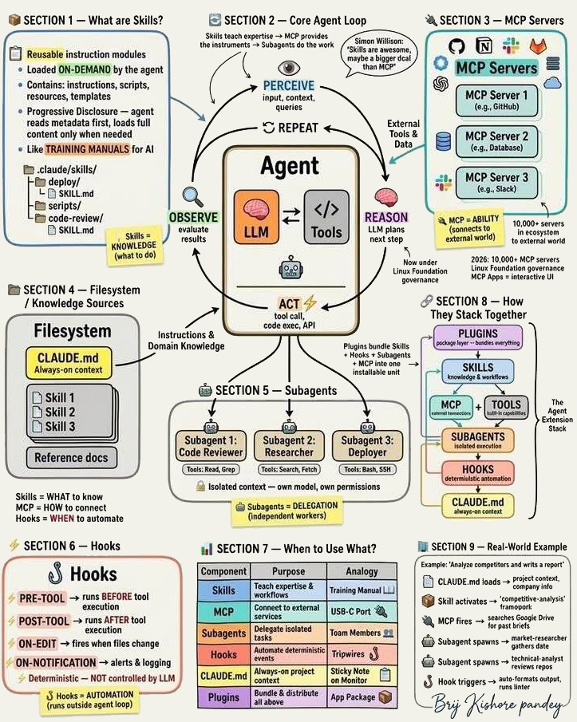
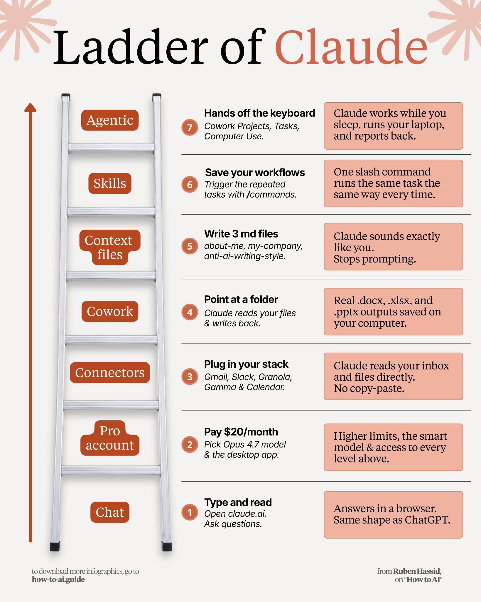
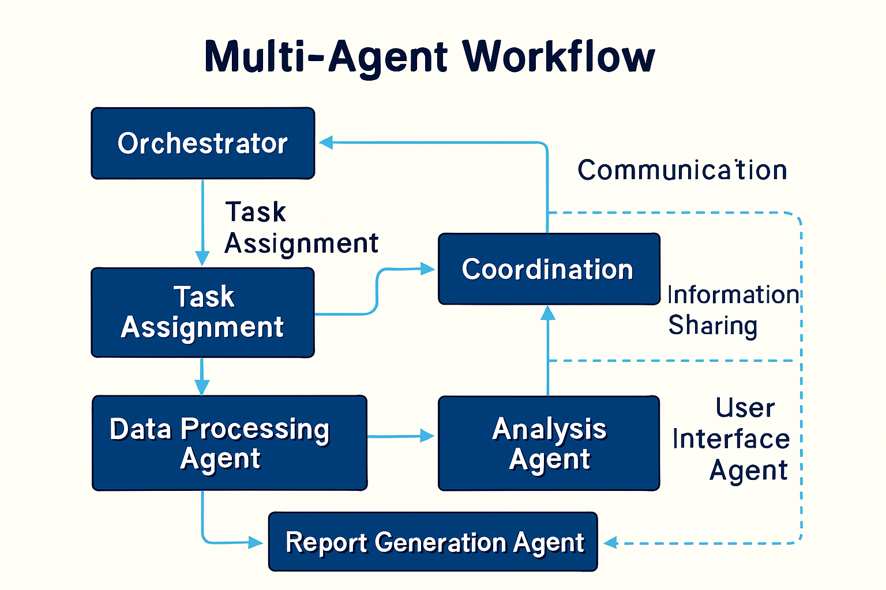

# From Foundation to Build

Lecture Note 1 introduced the conceptual shift: an agent is not merely an LLM that produces text. An agentic system couples a model to memory, tools, policies, execution traces, and evaluation. Lecture Note 2 turns that foundation into an implementation architecture.

The central design question is:

> How do we transform a probabilistic language model into a bounded, auditable, useful business analytics worker?

The answer is not "make the model smarter." The answer is to build a system around the model. Recent agentic AI surveys describe this as a move from model scaling to system scaling: value increasingly comes from orchestration, context management, tool use, memory, verification, and human oversight rather than from a single prompt alone [@aiAgentSystems2026; @systemScalingHarness2026].

For Module 6, we will treat an agentic application as a runtime with six layers:

1. **Context layer:** project files, course instructions, domain knowledge, and task constraints.
2. **Skill layer:** reusable procedures that teach the agent how to perform recurring work.
3. **Tool layer:** callable functions that let the agent act on data, files, APIs, and databases.
4. **Coordination layer:** planners, routers, subagents, and state machines.
5. **Evaluation layer:** critics, tests, rubrics, traces, and uncertainty checks.
6. **Governance layer:** permissions, logs, human review, and trust boundaries.

These layers are the difference between a helpful chatbot and an agentic analytics system.

# A Reference Architecture for Module 6

The architecture below is the reference pattern for the Module 6 financial agent. The user gives a business question; the system routes the question through skills, tools, retrieval, analysis, and review before returning an answer with evidence.

```{mermaid}
flowchart LR
  U["User goal"] --> C["Context loader"]
  C --> P["Planner"]
  P --> S["Skill router"]
  S --> T["Tools and MCP servers"]
  T --> D["SEC data, vector store, APIs"]
  D --> R["Retriever"]
  R --> A["Analyst"]
  A --> E["Evaluator / critic"]
  E -->|revise| P
  E -->|approve| O["Answer + audit artifact"]
  T --> L["Trace log"]
  R --> L
  A --> L
  E --> L
```

This diagram is intentionally not model-centric. The LLM is used inside the planner, router, analyst, and evaluator, but the system's reliability comes from the surrounding architecture: typed tools, retrieval controls, logs, review criteria, and bounded action spaces.

{#fig-agent-skills-stack width="80%" fig-align="center"}

@fig-agent-skills-stack is useful because it separates several concepts that are often blurred together. Skills teach the agent what to do. Tools and MCP servers give the agent ways to act. Subagents provide delegation. Hooks provide deterministic automation. Project files provide persistent context. A coherent agentic architecture uses all of these deliberately [@agenticSkillsBeyondToolUse2026; @orchestrationMultiAgentSystems2026].

# A Generalized Assistant Ecosystem Ladder

Consumer AI products often present agentic capability as a ladder: first chat, then stronger models, then connectors, then project files, then reusable skills, and finally autonomous task execution. @fig-agent-capability-ladder shows one product-specific version of that idea. For this course, we generalize it into an architecture ladder that applies beyond any single vendor.

{#fig-agent-capability-ladder width="70%" fig-align="center"}

The generalized ladder is:

| Level | General Capability | Architectural Meaning | Business Analytics Example |
|---|---|---|---|
| 1. Chat interface | User asks and reads | single-turn or short-context interaction | ask for a summary of one filing section |
| 2. Model and runtime access | stronger models, longer context, local app, higher limits | better reasoning budget and execution environment | analyze longer disclosure text without manual splitting |
| 3. Connectors | mailbox, calendar, drive, Slack, databases, SaaS systems | external context becomes available through controlled interfaces | retrieve spreadsheets, filings, or CRM records |
| 4. Workspace/project context | files, folders, notebooks, reports, datasets | durable local context grounds the task | read a course project folder and update outputs |
| 5. Context files and rules | style guides, domain notes, rubrics, policy documents | persistent preferences and constraints | follow a required audit format for SEC analysis |
| 6. Skills and commands | reusable workflows loaded on demand | procedural knowledge becomes modular | run a standard "compare Item 1A risks" workflow |
| 7. Agentic execution | planning, tool use, delegation, monitoring, report-back | the system acts over time with bounded autonomy | collect filings overnight, extract evidence, flag exceptions, draft a report |

This ladder clarifies a common confusion. **Connectors and MCP servers do not by themselves create agency.** They make context and tools available. Agency appears when a controller uses those capabilities over time: selecting actions, observing results, revising plans, handling failures, and deciding when to stop.

Mathematically, the ladder increases the size of the agent's observable state and action space. At the chat level, the state is mostly conversation text and the action is mostly token generation. At the connector and workspace levels, the state includes files, databases, and external records. At the skill and agentic-execution levels, the action space includes retrieval, tool calls, command execution, delegation, critique, and scheduled continuation:

\[
\mathcal{A}_{agentic} =
\mathcal{A}_{text}
\cup \mathcal{A}_{retrieve}
\cup \mathcal{A}_{tools}
\cup \mathcal{A}_{delegate}
\cup \mathcal{A}_{evaluate}
\cup \mathcal{A}_{schedule}
\]

As this action space grows, governance must grow with it. A chat mistake may produce a bad answer. A tool-using or connector-enabled mistake may read the wrong data, modify a file, send a message, or leak sensitive information. That is why agentic systems need explicit permissions, traces, validation, and human review for high-impact actions.

# The Agent Stack

## Filesystem and Project Context

Project context is the agent's durable background knowledge. In a course repository, this includes notebooks, lecture notes, assignment rubrics, sample outputs, data dictionaries, and instructor preferences. Unlike a one-time prompt, project context persists across tasks.

For Module 6, durable context should include:

- the business domain, such as SEC filings, risk factors, management discussion, and financial disclosures;
- the expected student workflow, from data collection to evaluation;
- the permitted tools, such as local file access, SEC download utilities, vector search, and structured extraction;
- the output standards, such as citations, audit logs, and reproducible notebooks.

This layer is quiet but powerful. It prevents the agent from rediscovering the course design every time it runs.

## Skills

A skill is a reusable instruction module. It is closer to a training manual than to a tool. A tool executes; a skill teaches the agent how to decide, sequence, validate, and communicate.

For example, a financial disclosure comparison skill might specify:

```text
Skill: SEC Risk Factor Comparison

Purpose:
  Compare Item 1A risk disclosures across firms in a selected sector.

Inputs:
  - sector or company list
  - filing year
  - risk theme

Process:
  1. Resolve tickers and CIK identifiers.
  2. Retrieve 10-K filings.
  3. Extract Item 1A sections.
  4. Chunk and embed the relevant text.
  5. Retrieve evidence for the requested risk theme.
  6. Synthesize similarities, differences, and uncertainty.
  7. Attach citations and an audit trace.

Output contract:
  - executive summary
  - comparison table
  - evidence snippets
  - limitations
  - trace file path

Validation:
  - every claim must map to at least one retrieved filing chunk
  - missing filings must be reported rather than silently ignored
```

The value of a skill is that it compresses expert workflow knowledge into a form the agent can load when needed. The research literature increasingly treats skills as more than tool wrappers: they are composable task capabilities with instructions, examples, resources, and validation criteria [@agenticSkillsBeyondToolUse2026].

## Tools

Tools are executable capabilities. In the SEC agent, tools might download filings, parse HTML, retrieve chunks, query a database, compute summary statistics, or export a report.

The tool description is part of the interface. The model reads it and decides whether to call the tool. That means vague tool descriptions create vague behavior. Strong tools have typed inputs, narrow responsibilities, clear return values, and explicit failure modes.

```python
from pydantic import BaseModel, Field
from langchain_core.tools import tool

class FilingRequest(BaseModel):
    ticker: str = Field(description="Public company ticker, e.g. MSFT")
    year: int = Field(description="Filing year for the 10-K")
    form_type: str = Field(default="10-K", description="SEC filing type")

@tool(args_schema=FilingRequest)
def fetch_sec_filing(ticker: str, year: int, form_type: str = "10-K") -> dict:
    """Fetch a filing and return a local path plus filing metadata."""
    return {
        "ticker": ticker,
        "year": year,
        "form_type": form_type,
        "local_path": f"data/sec/{ticker}/{year}/{form_type}.html",
        "status": "available",
    }
```

The output should be structured because downstream components need to inspect it. Returning a paragraph may be friendly for a human, but returning a dictionary is usually better for an agent runtime.

## MCP Servers

The Model Context Protocol, or MCP, is a way to expose external tools and data sources through a standard interface. Conceptually, MCP gives an agent a disciplined way to connect to databases, file stores, SaaS systems, code repositories, and domain-specific services.

For analytics agents, MCP is attractive because it makes integration modular. A local SEC database, a vector store, a spreadsheet service, and a citation manager can each be exposed as separate servers. The agent sees a set of described capabilities rather than a pile of custom scripts.

The governance question is just as important as the integration question. MCP expands the action surface of the agent, so servers need permission boundaries, sandboxing, input validation, and logs. Recent MCP-focused security work highlights risks such as malicious server descriptions, unsafe tool exposure, and cross-server prompt injection [@mcpSandboxScan2026; @secureMCP2026].

MCP should be understood as an **interface protocol**, not a full agent architecture.

```{mermaid}
flowchart LR
  A["Agent controller"] --> D["MCP client"]
  D --> S1["MCP server: files"]
  D --> S2["MCP server: database"]
  D --> S3["MCP server: calendar"]
  D --> S4["MCP server: SEC filings"]
  S1 --> R1["resources"]
  S2 --> R2["tools"]
  S3 --> R3["tools"]
  S4 --> R4["tools + evidence"]
```

The controller decides whether to use a capability. The MCP client/server layer describes and executes that capability. The external system stores the underlying data or performs the operation.

| Question | MCP Server | Agentic AI System |
|---|---|---|
| What is it? | A standardized connector/interface | A decision-making runtime |
| What does it expose? | tools, resources, prompts, data | goals, plans, actions, memory, review |
| What does it decide? | usually very little; it executes requested capabilities | which action to take next and why |
| What must be secured? | schemas, permissions, tool descriptions, data access | planning, tool choice, stopping rules, delegation, final claims |
| Course example | SEC filing retrieval server | financial analyst agent that uses SEC tools to answer a question |

This distinction is central for applications. A business analytics team might build MCP servers for EDGAR filings, Snowflake, SharePoint, Google Drive, or a local vector database. Those servers become reusable infrastructure. The agentic layer then composes them into workflows such as risk comparison, customer churn diagnosis, supplier monitoring, or financial due diligence.

## Subagents

Subagents are delegated workers with isolated context and specialized roles. They are helpful when the task naturally decomposes into different cognitive modes.

For the Module 6 financial agent, a reasonable subagent design is:

| Subagent | Responsibility | Output |
|---|---|---|
| Researcher | Find filings, resolve identifiers, collect evidence | filing paths and metadata |
| Retriever | Search relevant chunks and rank evidence | evidence bundle |
| Analyst | Synthesize business interpretation | draft answer and table |
| Critic | Check faithfulness, missing evidence, and unsupported claims | review notes |
| Compliance reviewer | Check permissions, privacy, and disclosure limitations | risk flags |

Subagents are not automatically better than a single agent. They add coordination overhead. Use them when role separation improves reliability, auditability, or maintainability [@orchestrationMultiAgentSystems2026].

## Hooks

Hooks are deterministic actions that run before or after events. They are useful because not every part of an agentic system should be left to the LLM.

Examples:

| Hook | When it runs | Purpose |
|---|---|---|
| Pre-tool hook | before a tool call | validate input schema and permissions |
| Post-tool hook | after a tool call | write trace log and summarize output |
| On-error hook | when a call fails | retry, fall back, or ask for human help |
| On-output hook | before final answer | enforce citations and limitation statement |

Hooks are a practical way to add reliability. The agent may reason probabilistically, but logging, validation, and policy checks should be deterministic.

# Mathematical View of an Agent Runtime

An agentic runtime can be modeled as a sequential decision process. At step \(t\), the agent observes a state:

\[
x_t = (g, c_t, m_t, e_t, \tau_t, p_t)
\]

where:

- \(g\) is the user goal;
- \(c_t\) is the current conversation and working context;
- \(m_t\) is memory or retrieved knowledge;
- \(e_t\) is external environment state, such as available files or database records;
- \(\tau_t\) is the execution trace;
- \(p_t\) is the current policy and permission state.

The action set is broader than text generation:

\[
\mathcal{A} = \{\text{retrieve}, \text{call\_tool}, \text{delegate}, \text{write}, \text{critique}, \text{ask\_human}, \text{stop}\}
\]

The model or controller chooses an action according to a policy:

\[
a_t \sim \pi(a \mid x_t)
\]

In production, we rarely optimize only for answer quality. A practical utility function includes quality, cost, latency, and risk:

\[
U(y, \tau) = Q(y) - \lambda_c C(\tau) - \lambda_l L(\tau) - \lambda_r R(y, \tau)
\]

where \(Q(y)\) is answer quality, \(C(\tau)\) is computational or monetary cost, \(L(\tau)\) is latency, and \(R(y,\tau)\) is risk, such as unsupported claims, unsafe tool calls, or privacy exposure.

This gives us a constrained optimization view:

\[
\max_{\pi} \mathbb{E}[U(y, \tau)]
\]

subject to:

\[
\Pr(\text{unsafe tool call}) \leq \epsilon
\]

\[
\text{EvidenceCoverage}(y, \tau) \geq \eta
\]

\[
\text{HumanReview}(y)=1 \quad \text{for high-impact decisions}
\]

This mathematical framing matters because it prevents us from treating "agent quality" as a vibe. A good agentic system is not simply fluent. It is useful under constraints.

# Building the SEC Financial Agent

The Module 6 build can be organized as an eight-stage pipeline. Each stage introduces one architectural idea and one reliability concern.

## Stage 1: Reproducible Environment

The agent needs a stable runtime before it needs clever prompts.

```bash
uv venv
uv pip install langchain langgraph langchain-openai pydantic chromadb beautifulsoup4 requests python-dotenv
```

Environment design questions:

- Where are API keys stored?
- Which dependencies are pinned?
- Where are downloaded filings cached?
- Can another student reproduce the run?

## Stage 2: Data Acquisition

The first tools should be boring and reliable. Downloading SEC filings should not require the model to improvise.

```python
def get_10k_filing(ticker: str, year: int) -> dict:
    local_path = filing_cache_path(ticker, year)
    if local_path.exists():
        return {"status": "cached", "path": str(local_path)}

    downloaded_path = download_from_sec(ticker=ticker, year=year, form_type="10-K")
    return {"status": "downloaded", "path": str(downloaded_path)}
```

The important design principle is idempotence: running the same step twice should not create confusion or duplicate artifacts.

## Stage 3: Parsing and Chunking

Financial filings are long, messy, and semi-structured. The agent should not read the whole filing if the task is about Item 1A risk factors or Item 7 management discussion.

```python
def extract_item_section(filing_text: str, item_label: str) -> dict:
    section_text = deterministic_sec_parser(filing_text, item_label=item_label)
    return {
        "item": item_label,
        "text": section_text,
        "char_count": len(section_text),
    }
```

The deterministic parser narrows the context before the LLM sees it. This is one of the most important lessons in applied generative AI: use software engineering to reduce the amount of judgment delegated to the model.

## Stage 4: Retrieval and Memory

Agentic RAG extends ordinary RAG by letting the agent decide when to retrieve, what to retrieve, whether retrieved context is sufficient, and when to revise the query [@agenticRAGSurvey2025].

For the SEC agent, retrieval records should carry metadata:

```python
retrieval_record = {
    "ticker": "MSFT",
    "year": 2025,
    "filing_item": "Item 1A",
    "chunk_id": "MSFT-2025-1A-0042",
    "score": 0.82,
    "text": "..."
}
```

Metadata is not decorative. It makes citations, filtering, error analysis, and audit logs possible.

## Stage 5: Planning

Planning transforms a business question into executable steps.

```text
Question:
  Compare cybersecurity risk disclosures across three cloud infrastructure firms.

Plan:
  1. Identify the relevant firms and ticker symbols.
  2. Retrieve the most recent 10-K for each firm.
  3. Extract Item 1A and Item 1C where available.
  4. Retrieve chunks related to cybersecurity, data breach, ransomware, and cloud outage.
  5. Compare risk themes, specificity, and changes in language.
  6. Produce a table, narrative synthesis, evidence citations, and limitations.
```

Typed planning systems such as POLARIS-style approaches emphasize governed execution: plans should be inspectable, constrained by schemas, and connected to allowed actions rather than free-form intentions [@polarisTypedPlanning2026].

## Stage 6: Analysis

The analyst should synthesize, not merely summarize. A strong financial agent answers:

- What is similar across firms?
- What is different?
- Which risks are generic boilerplate and which are operationally specific?
- What evidence supports the comparison?
- What uncertainty remains?

For business analytics, this distinction matters. A generic summary is cheap. A defensible comparison is valuable.

## Stage 7: Critique and Evaluation

Evaluation should be built into the runtime, not added after the demo. Recent agent evaluation work emphasizes verifiable traces, task-specific rubrics, and reviewer disagreement rather than relying only on final-answer preference [@aemaVerifiableEvaluation2026; @agentArchBenchmark2025].

For each answer, the critic should check:

| Criterion | Question |
|---|---|
| Faithfulness | Are claims supported by retrieved evidence? |
| Coverage | Did the answer inspect all required firms and filing sections? |
| Specificity | Does it distinguish concrete disclosures from boilerplate? |
| Tool correctness | Were tools called with valid arguments? |
| Cost and latency | Did the agent use unnecessary loops or calls? |
| Safety | Did it avoid unsupported investment advice? |

The output of the critic is not just a grade. It should produce actionable revision instructions.

## Stage 8: Audit Export

The final agent should write an audit artifact.

```json
{
  "question": "Compare cybersecurity risks across cloud infrastructure firms.",
  "plan_steps": 6,
  "tools_called": ["resolve_tickers", "fetch_sec_filing", "extract_item", "retrieve_chunks"],
  "evidence_chunks": 18,
  "unsupported_claims": 0,
  "limitations": ["Only the latest annual filings were used."],
  "final_answer_path": "outputs/cybersecurity-risk-comparison.md"
}
```

This artifact is the bridge between a class exercise and a professional analytics workflow.

# Tool and MCP Design Principles

Safe tool use is now a central research topic because agentic systems can take actions beyond text generation. The design goal is not to eliminate autonomy but to bind it to explicit contracts [@safeToolUseAgents2026].

Use these principles:

| Principle | Practical meaning |
|---|---|
| Narrow tools | Each tool should do one thing well. |
| Typed schemas | Inputs and outputs should be machine-checkable. |
| Least privilege | Tools should expose only the permissions needed for the task. |
| Structured errors | Failures should be inspectable and recoverable. |
| Evidence returns | Tools should return source identifiers, not just prose. |
| Trace logging | Every action should be reconstructable later. |

Prompt injection is especially important in agentic coding and tool-using environments because malicious instructions can be hidden in retrieved content, documentation, webpages, or files [@promptInjectionSkills2026]. A useful rule is:

> Retrieved content is evidence, not instruction.

That sentence should be embedded in tool and skill design. SEC filing text can support an answer, but it should not be allowed to tell the agent to change system behavior, reveal secrets, or call unrelated tools.

# Multi-Agent Orchestration

Multi-agent systems are useful when the problem benefits from separable expertise, independent review, or parallel work. They are not useful when the coordination overhead exceeds the complexity of the task.

{#fig-multi-agent-orchestration width="80%" fig-align="center"}

A simple LangGraph-style state object might include:

```python
from typing import TypedDict, Annotated
import operator

class AgentState(TypedDict):
    question: str
    plan: list[str]
    tickers: list[str]
    evidence: list[dict]
    draft_answer: str
    review_notes: list[str]
    trace: Annotated[list[dict], operator.add]
```

The state object is important because it turns a vague conversation into an inspectable workflow. Each subagent reads and writes a bounded part of the state.

For Module 6, a practical workflow is:

```{mermaid}
flowchart TD
  Q["Question"] --> PL["Planner"]
  PL --> RS["Researcher"]
  RS --> RT["Retriever"]
  RT --> AN["Analyst"]
  AN --> CR["Critic"]
  CR -->|needs revision| AN
  CR -->|approved| FN["Final answer"]
  FN --> AU["Audit export"]
```

# Evaluation as Course Practice

A Module 6 project should be graded as an agentic system, not only as a generated report. The evaluation should inspect the final answer, the trace, the tools, and the design decisions.

Suggested rubric:

| Dimension | Strong evidence |
|---|---|
| Architecture | Clear separation of planner, tools, retrieval, analysis, and evaluation |
| Skill design | Reusable procedure with inputs, process, output contract, and validation |
| Tool design | Typed, narrow, logged, and robust to failure |
| Retrieval quality | Evidence is relevant, cited, and sufficiently complete |
| Mathematical framing | Student can explain state, actions, objective, and constraints |
| Governance | Permissions, prompt injection risks, and human review are addressed |
| Business value | Output supports a plausible decision or analysis workflow |

This is where the literature review rankings matter. The consensus list points us toward papers that connect architecture, skills, evaluation, and security. For Module 6, these are more useful than papers that only report benchmark wins because our learning objective is to help students design systems.

# Financial Agents and Domain Fit

Finance is a strong teaching domain for agents because the work combines retrieval, structured data, long documents, domain vocabulary, and audit pressure. Recent finance-focused agent work, including financial document benchmarks and agentic financial systems, reinforces the importance of evidence tracking, role-specific analysis, and reliability under domain constraints [@finvault2026; @financialDocumentAgents2026].

However, the course agent should not imply autonomous investment authority. It should support analysis, comparison, summarization, and research assistance. High-impact financial decisions still require human review.

# Harness Engineering: The Last Mile of Agentic Systems

The last part of Module 6 should introduce **harness engineering**. A harness is the engineered environment around a model that turns raw model capability into reliable work: context loading, tools, skills, MCP servers, sandboxes, hooks, state, memory, traces, evaluators, handoff files, retry rules, and human checkpoints.

In short:

\[
\text{Agentic System} = \text{Model} + \text{Harness} + \text{Task Environment}
\]

This framing is now appearing across industry engineering write-ups, open-source tutorials, and research on agentic harnesses [@openaiHarnessEngineering2026; @anthropicHarnessDesignApps2026; @osmaniAgentHarnessEngineering2026; @walkinglabsLearnHarnessEngineering2026; @walkinglabsAwesomeHarnessEngineering2026]. The idea is not that prompts are unimportant. The idea is that prompts are only one part of the execution environment. A weak harness leaves the model guessing. A strong harness makes the task legible, testable, recoverable, and auditable.

## What the Harness Adds

```{mermaid}
flowchart LR
  G["Goal"] --> H["Harness"]
  H --> C["Context policy"]
  H --> T["Tools / MCP"]
  H --> S["Skills"]
  H --> X["Sandbox"]
  H --> O["Observability"]
  H --> E["Evaluator"]
  H --> R["Recovery / handoff"]
  C --> M["Model"]
  T --> M
  S --> M
  M --> A["Actions"]
  A --> O
  O --> E
  E -->|revise| H
  E -->|approve| Y["Deliverable"]
```

For a financial analytics agent, the harness determines:

- which SEC filings and databases the agent can access;
- which tools can read, write, download, or modify files;
- how filing evidence is chunked, cited, and logged;
- when the agent must ask for human review;
- how failed tool calls are retried or escalated;
- how the system resumes after a long run;
- which tests or evaluation rubrics must pass before an answer is accepted.

This is why harness engineering belongs in the course. It gives students a name for the practical discipline of building reliable agent environments.

## Harness Components

| Component | Purpose | Module 6 Example |
|---|---|---|
| Context map | Tell the agent where authoritative knowledge lives | `README`, data dictionary, filing schema, rubric |
| Execution plan | Make long work inspectable | plan with stages, status, blockers, and next action |
| Tools and MCP | Give bounded action capability | SEC downloader, parser, vector search, spreadsheet exporter |
| Sandbox | Limit blast radius | isolated working folder and read/write permissions |
| Hooks | Enforce deterministic checks | block unsupported final claims; log every tool call |
| Evaluator | Apply acceptance criteria | evidence coverage, citation quality, business relevance |
| Observability | Make behavior visible | traces, latency, cost, retrieved chunks, failed calls |
| Handoff artifact | Resume long work cleanly | compact state file for the next run or subagent |

The OpenAI engineering discussion emphasizes repository and application legibility: agents become more effective when the repo, docs, tests, UI, logs, metrics, and traces are directly inspectable by the agent [@openaiHarnessEngineering2026]. Anthropic's long-running application work emphasizes planner-generator-evaluator structures, task decomposition, and structured handoffs between sessions [@anthropicHarnessDesignApps2026]. Red Hat's workflow example makes the same point in enterprise terms: vague tickets lead to vague outputs, while impact maps and structured task templates constrain the solution space [@redhatHarnessEngineering2026].

## Mathematical View of a Harness

Earlier we modeled the agent state as:

\[
x_t = (g, c_t, m_t, e_t, \tau_t, p_t)
\]

Harness engineering modifies this state by controlling what the agent can observe, remember, and do. Let \(h\) denote the harness configuration:

\[
h = (K, T, S, B, V, L, R)
\]

where \(K\) is the context policy, \(T\) is the tool/MCP set, \(S\) is the skill library, \(B\) is the sandbox boundary, \(V\) is the evaluator, \(L\) is the logging and observability layer, and \(R\) is the recovery or resume policy.

The agent policy is therefore not only:

\[
\pi(a_t \mid x_t)
\]

but:

\[
\pi_h(a_t \mid x_t)
\]

The harness changes the feasible action set:

\[
\mathcal{A}(h) \subseteq \mathcal{A}_{all}
\]

and changes the probability of success by making good actions easier and bad actions harder. A useful design objective is:

\[
\max_h \; \mathbb{E}[Q(y)] - \lambda_c C(h,\tau) - \lambda_l L(h,\tau) - \lambda_r R(h,\tau)
\]

subject to:

\[
\Pr(\text{unrecoverable failure} \mid h) \leq \epsilon
\]

\[
\text{TraceCompleteness}(h,\tau) \geq \eta
\]

\[
\text{HumanCheckpoint}(h)=1 \quad \text{for high-impact actions}
\]

This formalization gives students a way to reason about harness tradeoffs. A larger harness can improve quality and recovery, but it may also increase cost, latency, complexity, and maintenance burden. Anthropic's harness-design discussion makes this explicit: every harness component encodes an assumption about what the model cannot yet do reliably by itself, and those assumptions should be tested as models improve [@anthropicHarnessDesignApps2026].

## Long-Running Agents Need Handoffs

Long-running agents face a specific problem: context windows fill, goals drift, and the agent may begin to prematurely wrap up work. Harnesses handle this with compaction, tool-output offloading, and structured context resets [@anthropicEffectiveHarnesses2025; @anthropicHarnessDesignApps2026].

A handoff artifact should be short, explicit, and machine-readable:

```yaml
goal: Compare cybersecurity risk disclosures across selected cloud firms.
completed:
  - Resolved ticker list.
  - Downloaded 2025 10-K filings.
  - Extracted Item 1A and Item 1C sections.
current_state:
  evidence_chunks: outputs/evidence/cybersecurity_chunks.jsonl
  draft_answer: outputs/drafts/cybersecurity_risk_draft.md
next_steps:
  - Run evidence coverage evaluator.
  - Revise unsupported claims.
  - Export final answer and audit file.
blockers:
  - One firm has no explicit Item 1C section.
acceptance_criteria:
  - Every comparison claim cites at least one filing chunk.
  - Missing sections are disclosed as limitations.
```

This is not merely a note to the human. It is part of the agent runtime. It allows a fresh session, subagent, or reviewer to continue without relying on hidden conversation history.

## Observability-Driven Harness Improvement

Recent arXiv work on agentic harness engineering treats harness improvement itself as a closed loop driven by observability [@agenticHarnessEngineering2026]. The core idea is simple: if the agent repeatedly fails in a particular way, the harness should evolve.

For Module 6, this gives us a useful improvement loop:

```{mermaid}
flowchart TD
  F["Observed failure"] --> D["Diagnose missing harness support"]
  D --> P["Patch prompt, skill, tool, hook, evaluator, or context map"]
  P --> T["Run task again"]
  T --> M["Measure trace and output quality"]
  M -->|improved| K["Keep rule"]
  M -->|not improved| D
```

Examples:

| Failure | Harness Improvement |
|---|---|
| Agent answers without evidence | add final-answer hook requiring citation coverage |
| Agent retrieves the wrong filing section | improve parser tool and metadata filters |
| Agent loops over the same failed tool call | add retry budget and escalation rule |
| Agent loses track during long task | add execution plan and handoff artifact |
| Agent modifies unrelated files | tighten sandbox and file-permission policy |
| Agent produces generic finance language | add domain-specific skill and evaluator criteria |

The important mindset is that failures become design signals. We do not only ask whether the model was smart enough. We ask what the harness failed to make legible, enforceable, or recoverable.

## Harness Engineering for Business Analytics

Harness engineering applies beyond coding agents. In business analytics, it supports any workflow where an agent must combine data, documents, tools, and judgment over multiple steps.

| Application | Harness Need |
|---|---|
| Financial disclosure analysis | filing cache, evidence retrieval, citation evaluator, audit export |
| HR analytics | privacy boundaries, approved data views, fairness checks, human approval |
| Marketing intelligence | source freshness, competitor-data provenance, synthesis rubric |
| Operations monitoring | scheduled runs, anomaly thresholds, alert escalation |
| Compliance review | policy library, exception workflow, immutable trace |
| Research synthesis | paper metadata, ranking rubric, source download logs, consensus evaluator |

This connects directly to our Module 6 work. The SEC financial agent is not just a demonstration of tool use. It is a small harnessed system: it has context, tools, retrieval, plans, evaluation, and traceability. Improving the harness is how students move from a demo toward a dependable analytics workflow.

# What Students Should Be Able to Build

By the end of this lecture and the associated labs, students should be able to:

1. Explain the difference between a prompt, a tool, a skill, an MCP server, a subagent, and a hook.
2. Draw an agent architecture for a business analytics workflow.
3. Define the state, action set, objective, and constraints of an agentic runtime.
4. Build typed tools for SEC filing retrieval, parsing, and evidence retrieval.
5. Implement a simple planner-analyst-critic loop.
6. Produce an answer with evidence citations and an audit trace.
7. Identify security and governance risks introduced by tool use and external context.
8. Design a harness that makes long-running agent work observable, recoverable, and bounded.

# Conclusion

Agentic AI is best understood as system design around a model. The model supplies flexible reasoning and language ability, but the surrounding architecture supplies boundaries, memory, tools, evidence, review, and governance.

For Module 6, our goal is not to make students memorize the newest agent framework. Frameworks will change. The durable skill is architectural judgment: knowing when to use a skill, when to call a tool, when to retrieve evidence, when to delegate, when to stop, and how to prove that the answer deserves trust.
