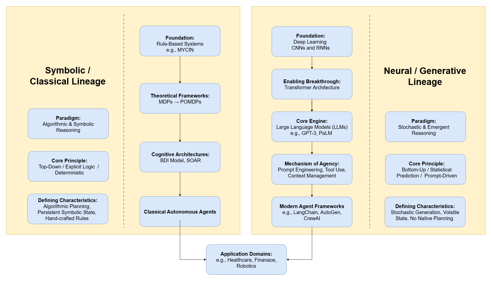
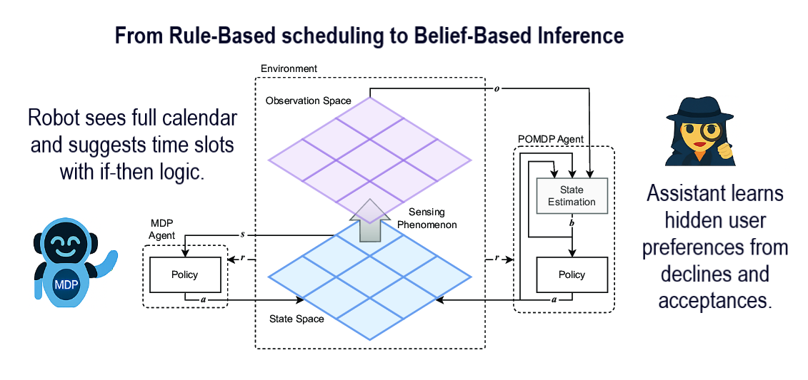
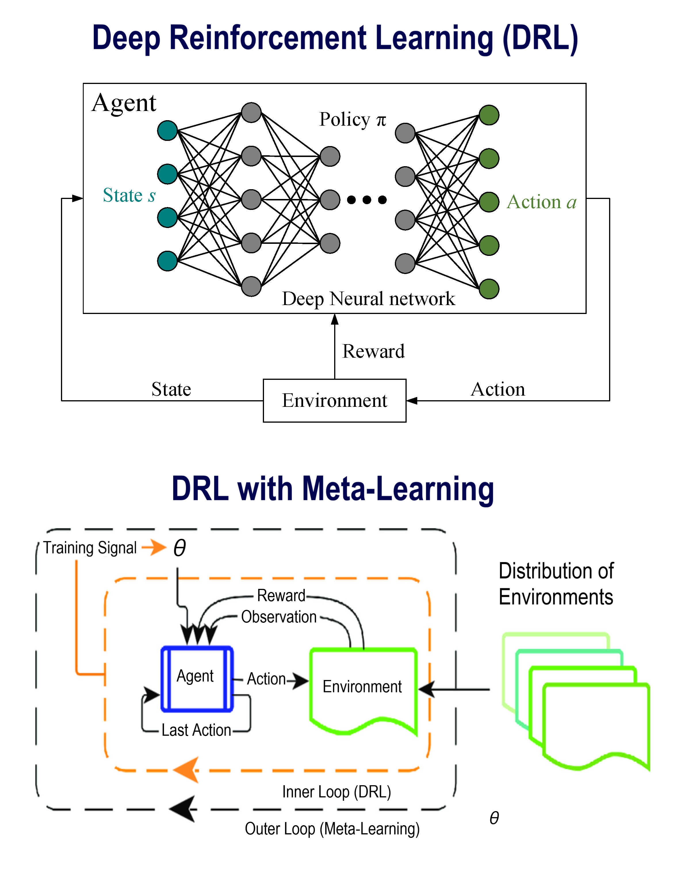
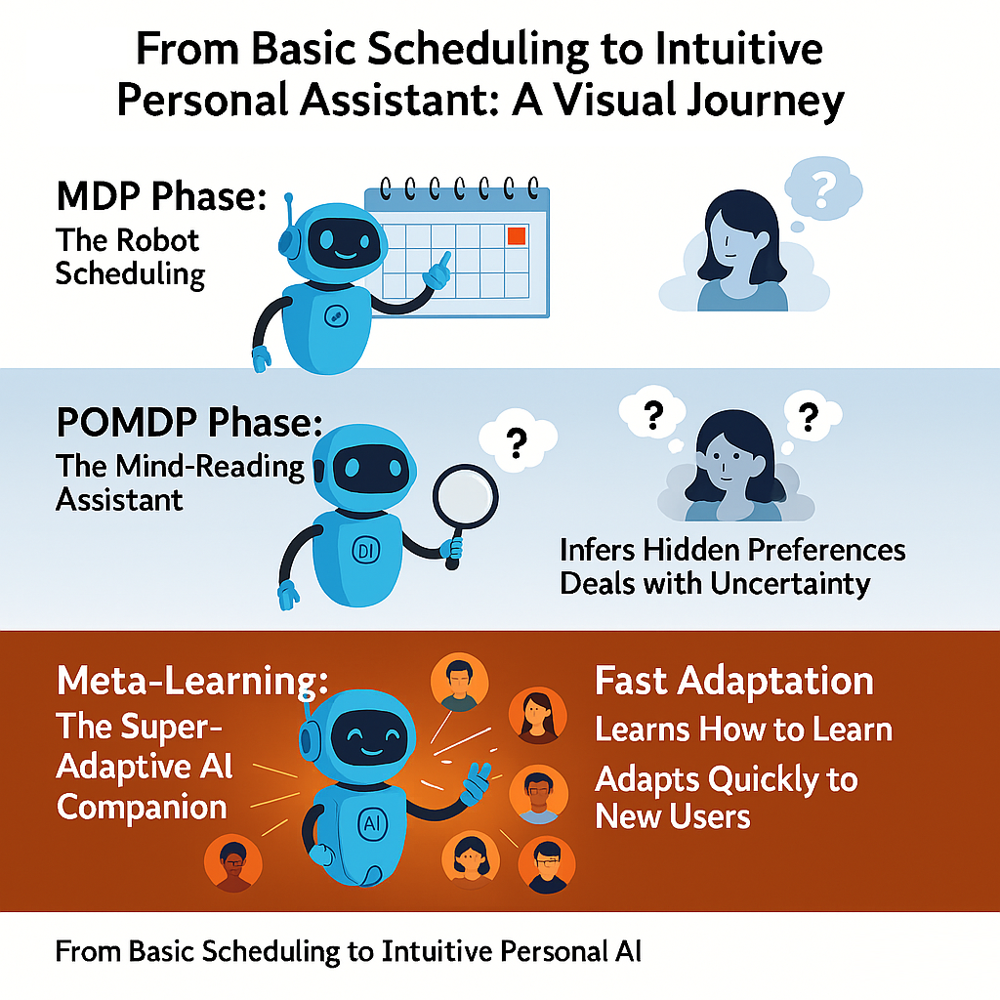
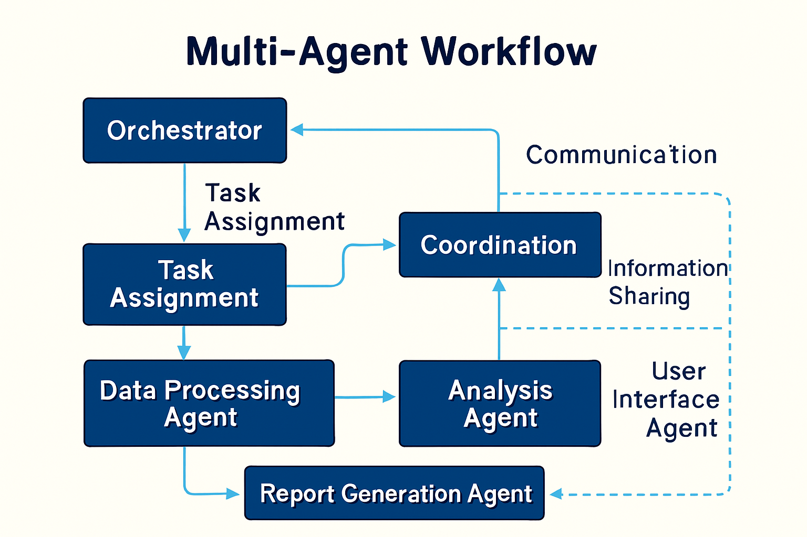
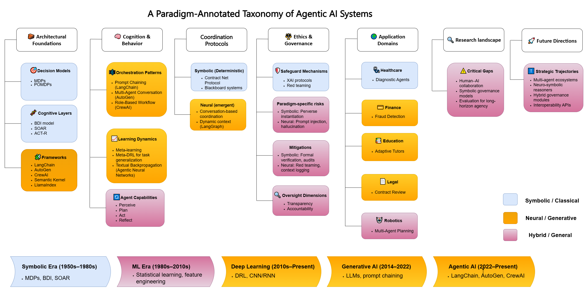

## How to print Revealjs slides

{width="80%" fig-align="center"}

# Introduction to Agentic AI

## The Evolution of AI Paradigms
- The field of artificial intelligence has transitioned from passive computation to active collaboration.
- Traditional ML models act as passive tools, requiring direct human prompting for every action.
- The new paradigm involves **Agentic AI**: systems that proactively perceive, reason, and act in complex environments.
- This represents a shift from "chatbots" to autonomous, stateful workflows.

## AI Assistants vs AI Agents
- [AI Assistants:]{.uured-bold} Require continuous human guidance. They respond to immediate prompts and forget the interaction once completed.
- **AI Agents:** Capable of autonomous operation. They are given a high-level goal, and they independently break it down into steps, execute them, and verify the results.
- Agents operate with a "loop" of perception and action, whereas assistants operate on a linear input/output mechanism.

## What makes a System "Agentic"?
- **Autonomy:** The ability to execute multi-step tasks without human intervention.
- **Contextual Memory:** The ability to store, retrieve, and learn from past interactions.
- **Tool Use:** The ability to interface with external APIs, databases, and filesystems to affect the real world.
- **Dynamic Routing:** The ability to decide *which* tool or sub-agent to use based on real-time environmental feedback.

## The Problem of Conceptual Retrofitting
- As generative AI evolved, researchers attempted to describe it using classical computer science terminology.
- This led to **conceptual retrofitting**: applying rigid, deterministic frameworks to stochastic, generative models.
- Describing an LLM as having "beliefs" or "desires" obscures how it mathematically operates.
- We must evaluate modern systems on their own architectural terms.

## Resolving the Paradigm Confusion
- To build effective systems, we must differentiate between two lineages of AI development.
- The **Symbolic/Classical Lineage** relies on hardcoded logic and mathematical state estimation.
- The **Neural/Generative Lineage** relies on the emergent statistical reasoning of large models.
- Understanding this split is critical for deploying the right architecture for the right problem.

## The Conceptual Framework

{#fig-conceptual-framework width=90% fig-align=center}

## The Symbolic/Classical Lineage
- Relies on explicit logic, hand-crafted rules, and top-down cognitive models.
- "Intelligence" is engineered through rigid deterministic or probabilistic state transitions.
- The system builds an explicit, internal mathematical model of the world.
- Highly interpretable and verifiable, but brittle in unpredictable or open-ended environments.

## The Neural/Generative Lineage
- Defined by stochastic generation and prompt-driven orchestration.
- Relies on the emergent reasoning capabilities of Large Language Models (LLMs) and Deep Learning.
- Replaces internal symbolic world models with external context retrieval (RAG).
- Highly adaptable and capable of handling unstructured data, but struggles with deterministic guarantees.

# Theoretical Foundations: Symbolic

## Core Principles of Autonomy
- Autonomy in classical systems is achieved through rigorous mathematical planning.
- An autonomous agent must be able to calculate the optimal path to a goal state.
- This requires three components: State Estimation, Transition Probabilities, and Reward Functions.
- Every possible action is evaluated against a pre-defined utility metric.

## Algorithmic Decision-Making
- The symbolic lineage relies heavily on decision trees and graph traversal algorithms (e.g., A* search).
- Systems operate with perfect logic but limited flexibility.
- If an environment variable changes unexpectedly, the explicit logic often fails (a "brittle" failure).
- These systems excel in highly constrained domains like manufacturing robotics or chess.

## Markov Decision Processes (MDPs)
- MDPs provide the mathematical scaffolding for modeling environments with full state information.
- Defined by a tuple $(S, A, P, R)$: States, Actions, Transition Probabilities, Rewards.
- The agent knows exactly what state it is in, and calculating the next best action is a matter of maximizing the reward $R$.
- They are foundational but lack robust reasoning under real-world uncertainty.

## Partially Observable MDPs (POMDPs)
- POMDPs extend MDPs for environments with incomplete information.
- The agent does not know its exact state; instead, it maintains a probabilistic *belief state*.
- It infers hidden variables based on sensor observations.
- While powerful, calculating belief states across long time horizons incurs massive computational overhead.

## Symbolic Reasoning in Action
{#fig-mdp-pomdp-comparison width=90% fig-align=center}

## Limitations of Symbolic Architectures
- **The Knowledge Acquisition Bottleneck:** Every rule must be manually coded by a human expert.
- **State Space Explosion:** As the complexity of the environment grows, the number of possible states becomes computationally intractable to calculate.
- **Inflexibility:** Symbolic agents cannot process natural language, unstructured text, or ambiguous instructions.

## Cognitive Architectures: BDI
- The BDI (Belief-Desire-Intention) model attempts to explicitly code human cognition.
- **Belief:** The agent's factual knowledge base about the world.
- **Desire:** The overarching goals or utility functions the agent wants to achieve.
- **Intention:** The current plan of action chosen to achieve the desires.
- BDI systems heavily influenced early multi-agent system designs.

## Cognitive Architectures: SOAR
- SOAR is an architecture designed to model general human intelligence.
- It operates using a "Decision Cycle": input, elaboration, decision, and application.
- Whenever SOAR reaches an impasse (it doesn't know what to do), it spawns a sub-goal to learn the missing information.
- While historically significant, these explicit cognitive models have largely been superseded by neural networks.

# Theoretical Foundations: Neural

## Statistical Learning
- The neural lineage moved away from explicit logic toward stochastic learning.
- Instead of programming rules, developers program architectures that *learn* the rules from massive datasets.
- Intelligence emerges from complex pattern recognition and statistical weights.
- This approach scales beautifully to high-dimensional inputs like pixels and natural language.

## Deep Reinforcement Learning (DRL)
- DRL bridges the gap between neural perception and symbolic action.
- It uses neural networks to approximate the value functions and policies of MDPs.
- Agents learn "what to do" through continuous trial and error in simulated environments.
- Methods like Proximal Policy Optimization (PPO) allow for fine-grained behavioral tuning.

## DRL Generalization
{#fig-drl-comparison width=85% fig-align=center}

## The Evolution to Meta-DRL
- Standard DRL agents often overfit to their training environments.
- Meta-DRL introduces a "dual-loop" architecture: learning how to learn.
- The agent adapts rapidly to new environments by leveraging prior experience, rather than starting from scratch.
- This was the first major step toward generalized neural agency.

## The LLM Substrate
- The introduction of the Transformer architecture revolutionized AI capabilities.
- Large Language Models (LLMs) provide a general-purpose statistical reasoning substrate.
- By predicting the next token across billions of parameters, LLMs demonstrate emergent reasoning capabilities.
- They serve as the "brain" for modern agentic systems, replacing both hand-crafted rules and DRL policies for many tasks.

## From Planning to Generation
- Modern frameworks do not use BDI architectures or explicit state trees.
- They replace symbolic planning with the stochastic generation of next steps via text prompts.
- Internal knowledge bases are replaced with external context retrieval (RAG).
- Centralized actuation is replaced by an LLM generating JSON payloads to trigger external tools.

## Neural Agency Emergence
{#fig-assistant-evolution width=70% fig-align=center}

# Core Components of an Agent

## Component Overview
- Regardless of the specific framework, all modern neural agents rely on a core set of components.
- **Perception:** How the agent receives inputs from the environment.
- **Memory:** How the agent stores past context.
- **Reasoning/Planning:** How the agent decides what to do.
- **Action/Tools:** How the agent affects the external world.

## Perception Mechanisms
- Agents perceive the world through multi-modal inputs.
- **Text:** Direct user prompts or API responses.
- **Vision:** Parsing UI elements, charts, and real-world camera feeds.
- **Audio:** Real-time transcription and sentiment analysis.
- Perception acts as the foundational trigger for the agent's reasoning loop.

## Context and Memory Management
- **Short-term Memory:** The current context window of the LLM. It holds the immediate conversation history and transient variables.
- **Long-term Memory:** Persistent storage that survives across different sessions. 
- Because context windows are finite, agents cannot hold their entire history in short-term memory.
- Effective memory management is the key differentiator between a simple chatbot and an autonomous agent.

## Vector Databases and RAG
- Retrieval-Augmented Generation (RAG) acts as the agent's long-term memory retrieval mechanism.
- Text, documents, and past actions are converted into high-dimensional vector embeddings.
- When an agent encounters a problem, it performs a semantic similarity search to retrieve relevant past context.
- This grounds stochastic LLM outputs in deterministic, factual datasets.

## Planning and Reasoning
- Before taking action, an agent must formulate a plan.
- **Zero-shot reasoning:** The agent reacts immediately to a prompt.
- **Chain-of-Thought (CoT):** The agent generates intermediate reasoning steps before answering, significantly improving logic.
- **Self-Reflection:** The agent critiques its own proposed plan and revises it before execution.

## Tool Calling: Definition
- Tool calling (or function calling) is the mechanism by which an LLM interacts with external software.
- The LLM does not execute the code itself; it generates a structured command (usually JSON) that instructs a host system to run the code.
- Example: The LLM outputs `{"tool": "get_stock_price", "ticker": "AAPL"}`, the system runs the Python function, and returns the result to the LLM.

## Tool Calling: Mechanics
- The developer provides the LLM with a list of available tools and their required schemas (e.g., required data types, descriptions).
- The LLM evaluates the user prompt and decides if a tool is needed.
- If needed, the LLM halts its text generation and outputs the tool call payload.
- The system executes the payload and appends the result to the LLM's context window, prompting it to continue reasoning.

## Creating Robust Tool Schemas
- The success of an agent depends entirely on how well its tools are defined.
- Tool descriptions must be highly explicit. Instead of "Search data", use "Searches the Q3 financial database for revenue metrics. Requires a specific company ticker."
- Strict typing (e.g., using Pydantic in Python) ensures the LLM does not hallucinate invalid parameters.

## Error Handling in Tool Use
- LLMs will inevitably generate invalid tool calls (hallucinated parameters, missing required fields).
- Robust agents implement "Exception Loops":
  1. The tool execution fails and generates an error stack trace.
  2. The stack trace is fed *back* to the LLM.
  3. The LLM is prompted to read the error and generate a corrected tool call.
- This self-correction loop is a hallmark of autonomous agency.

## Agent Communication Protocols
- As systems scale from single agents to multi-agent networks, communication becomes critical.
- Agents must exchange data, negotiate task delegation, and report status.
- Standardized protocols prevent "babel"—where agents built on different frameworks cannot understand each other's outputs.

## Agent-to-Agent (A2A) Protocols
- A2A protocols define the syntax and semantics for inter-agent messaging.
- They dictate how an orchestrator agent assigns a task to a worker agent.
- Messages must include metadata: sender ID, receiver ID, priority, and structured payload data.
- Establishing formal A2A standards is essential for creating interoperable enterprise agent ecosystems.

# Agentic Architectures & Workflows

## Shift from Chat to Workflows
- The industry is moving away from basic conversational interfaces toward structured **Agentic Workflows**.
- A workflow is a predefined graph of nodes and edges, where each node is an LLM call or a tool execution.
- Workflows provide deterministic guardrails around the stochastic LLM, ensuring business logic is followed.

## Prompt Chaining
- **Primary Mechanism:** Orchestrates linear sequences of LLM calls.
- The output of one prompt is programmatically fed as the input to the next.
- Example: Node 1 extracts data -> Node 2 summarizes it -> Node 3 translates it.
- Highly effective, stable, and easy to debug for deterministic, multi-step tasks.

## Routing Mechanisms
- Routing introduces conditional logic into workflows.
- A "Router" LLM evaluates the user intent and dynamically directs the task to a specialized sub-system.
- Example: If the prompt is about "billing", route to the Billing Agent; if about "tech support", route to the Diagnostics Agent.
- Routing optimizes token usage by ensuring simple tasks don't trigger expensive, deep-reasoning loops.

## The ReAct Architecture
- **ReAct (Reasoning + Acting)** is the foundational pattern for autonomous agents.
- The agent operates in a continuous `Thought -> Action -> Observation` loop.
- **Thought:** The LLM decides what to do next.
- **Action:** The LLM calls a tool.
- **Observation:** The system returns the tool result.
- The loop continues until the agent determines the final goal is reached.

## The ReWOO Architecture
- **ReWOO (Reasoning Without Observation)** is an optimization of ReAct.
- In ReAct, the LLM must pause and wait for the tool observation after every single step. This is slow and expensive.
- ReWOO forces the LLM to generate a complete, multi-step tool execution plan upfront, *before* running any tools.
- The system then executes the tools sequentially and feeds all results back simultaneously.

## Comparison: ReAct vs ReWOO
- **ReAct** is highly adaptive. If an early step fails, it can pivot its strategy immediately. It is best for unpredictable, exploratory tasks.
- **ReWOO** is highly efficient. It dramatically reduces latency and token costs. It is best for predictable tasks where the sequence of operations is known in advance.
- Enterprise systems often use a hybrid approach based on task complexity.

## Parallelization Strategies
- Advanced workflows leverage parallel execution to reduce latency.
- If an agent needs to research 5 different competitors, it should not do so sequentially.
- The orchestrator spawns 5 independent worker threads, executes the web searches simultaneously, and synthesizes the results in a final "reducer" step.
- This mimics traditional map-reduce paradigms but with LLM reasoning nodes.

## Orchestrator-Worker Patterns
- The most robust architecture for complex tasks is the Orchestrator-Worker pattern.
- A central **Orchestrator Agent** acts as the project manager. It holds the global state and user intent.
- It delegates specific, isolated sub-tasks to highly specialized **Worker Agents**.
- The Orchestrator reviews the Workers' outputs and decides if the task is complete.

## Multi-Agent Systems (MAS)
- MAS takes the orchestrator pattern further by allowing emergent collaboration.
- Agents adopt distinct personas (e.g., Coder, Reviewer, Tester) and interact through structured dialogue.
- Rather than following a strict flow chart, they "debate" solutions, mimicking human team dynamics.
- MAS excels at tasks requiring deep critique and diverse perspectives.

## Multi-Agent Architecture
{#fig-orchestration width=90% fig-align=center}

## Agentic Roles
- Within a Multi-Agent System, defining clear roles is paramount to success.
- **The Researcher:** Has access to web scraping tools and vector databases. Focuses purely on gathering context.
- **The Critic:** Has no tools. Its sole prompt directive is to find flaws, logical gaps, or security risks in the proposed plan.
- **The Executor:** The only agent with write-access to the database or code repository. Executes the final verified plan.

## Designing Robust Workflows
- **Rule of Thumb:** Never give a single agent access to every tool.
- Overloading an agent with too many tools leads to "decision paralysis" and hallucinations.
- Break down complex processes into small, bounded contexts.
- Use explicit workflow graphs (like LangGraph) to enforce state transitions, preventing infinite reasoning loops.

# Enterprise AI Factory & AgentOps

## The AI Factory Concept
- Moving agents from local prototypes to production requires a massive paradigm shift in infrastructure.
- The **Enterprise AI Factory** is a holistic, cloud-native architecture designed to deploy, scale, and govern agentic workloads.
- It treats AI not as an application, but as a continuous manufacturing process of intelligence.
- It unifies compute, data ingestion, security, and orchestration into a single control plane.

## AgentOps: A New Operational Discipline
- Traditional MLOps focused on model training, weights, and inference deployment.
- **AgentOps** focuses on governing autonomous, long-running, stateful processes.
- It requires monitoring the *decisions* an agent makes over time, rather than just the latency of a single API call.
- AgentOps ensures that agentic workflows are versioned, reproducible, and continuously improving.

## Agent Lifecycle Management
- Agents are treated as software artifacts.
- They possess a defined lifecycle: Prototyping -> Testing -> CI/CD Deployment -> Production Monitoring -> Deprecation.
- Updating an agent involves versioning its system prompt, its tool schemas, and its underlying base model simultaneously.
- A change to any of these three pillars requires rigorous regression testing of the agent's behavior.

## Long-Running Agents and State
- Unlike a stateless chat completion, a production agent may run for hours or days (e.g., an autonomous research agent).
- The AI Factory must provide persistent workspaces.
- Agents require mountable filesystems (e.g., S3 buckets, local databases) to read and write intermediate artifacts.
- If the compute instance crashes, the agent must be able to resume its workflow from the last saved state graph.

## Sandboxing and Secure Execution
- Because agents autonomously execute code and call tools, they pose a massive security risk.
- **Execution Sandboxing** is mandatory. 
- Agents must run in isolated container environments with restricted network access, strict CPU/memory limits, and time-bounded session timeouts.
- A compromised agent must not be able to traverse the corporate network or access unauthorized data lakes.

## GitOps Controllers for Declarative State
- Managing the complexity of an AI Factory requires declarative infrastructure.
- GitOps controllers (e.g., ArgoCD) continuously monitor a Git repository containing the defined state of the agent ecosystem.
- If a developer updates an agent's configuration in Git, the controller automatically reconciles the production cluster to match.
- This ensures an immutable, auditable trail of every change made to the agent platform.

## Artifact Repositories for Agent Skills
- In the AI Factory, "skills" (tools) are modular, versioned assets.
- An Artifact Repository serves as the secure, local hub for these skills.
- Before a skill (e.g., a Python script for database querying) is exposed to an agent, it is scanned for vulnerabilities in the CI/CD pipeline.
- Agents pull validated skills from the repository at runtime, ensuring enterprise security policies are enforced.

## Network Security and Zero Trust
- The AI Factory operates on a Zero Trust architecture.
- Network policies isolate workloads, restricting agent-to-agent communication to explicitly authorized pathways.
- Identity Management via Role-Based Access Control (RBAC) ensures an agent can only access data it is explicitly permitted to see.
- "The agent" is treated as a distinct user identity in the corporate active directory.

## Inference Gateways vs API Gateways
- Traditional API gateways route standard HTTP traffic.
- The AI Factory requires specialized **Inference Gateways**.
- These gateways manage agent-to-agent traffic, handle rate-limiting for LLM providers, and enforce semantic caching.
- They ensure that high-priority agent workflows are not starved of compute resources during demand spikes.

# Universal Tooling: API vs MCP

## Traditional APIs and Bottlenecks
- Historically, connecting an agent to enterprise data required hard-coding integrations with specific REST APIs.
- APIs have rigid, disparate schemas. Every integration requires custom middleware.
- If an API schema changes, the hard-coded integration breaks, crippling the agent.
- This approach scales poorly when an agent needs access to dozens of dynamic, evolving enterprise systems.

## The Model Context Protocol (MCP)
- The **Model Context Protocol (MCP)** represents a paradigm shift in tool integration.
- It is an open standard designed specifically to standardize how AI models interact with data sources.
- MCP acts as a universal "USB-C port" for AI agents.
- Instead of the agent adapting to a web of diverse APIs, tools expose themselves using a standardized MCP interface.

## Bidirectional Connection Standards
- MCP provides a bidirectional, secure connection between foundation models and local or remote datasets.
- It enables **Dynamic Tool Discovery**: an agent can query an MCP server to ask, "What tools and data do you have available?"
- The server responds with self-describing schemas that the LLM natively understands.
- Zero custom middleware is required.

## MCP Hosts, Clients, and Servers
- **MCP Hosts:** The application running the agentic workflow (e.g., a LangGraph orchestrator).
- **MCP Clients:** The protocol layer managing the connection within the host.
- **MCP Servers:** Lightweight, isolated programs that wrap specific capabilities (e.g., a Postgres database, a GitHub repo, or a local file system).
- The Host dynamically queries the Servers for context.

## MCP vs REST Comparisons
- **Integration:** REST requires manual API documentation reading and coding. MCP provides self-describing, plug-and-play integration.
- **Data Flow:** REST returns raw JSON payloads. MCP can stream structured context directly into the agent's working memory.
- **Security:** REST often relies on disparate OAuth flows. MCP servers can run entirely locally or in secure enclaves, keeping sensitive data strictly governed.
- MCP is the foundation for scalable enterprise tool use.

# Observability, Governance, and Future

## Observing Non-Deterministic Systems
- Traditional software observability tracks stack traces and latency.
- Agentic systems are non-deterministic; the same prompt may yield a completely different execution path.
- Observability must answer: *Why* did the agent make this decision? What context did it retrieve?
- Without this visibility, autonomous systems become unaccountable black boxes.

## Tracing Agent Execution
- High-fidelity application tracing is the core of AgentOps.
- Traces must capture the entire lifecycle of a request: the initial user prompt, the sub-tasks generated, the vector database queries, the raw LLM responses, and the tool execution results.
- Open standards like OpenTelemetry are being adapted to support these complex, multi-hop agentic traces.
- This allows engineers to replay failed agent sessions for debugging.

## Metric Tracking (Latency)
- The AI Factory tracks specific inference metrics to ensure performance:
- **TTFT (Time To First Token):** How long it takes for the agent to begin generating a response.
- **TPS (Tokens Per Second):** The throughput of generation.
- **Component Latency:** Tracking exactly how long an agent spends in the "planning" phase versus the "tool execution" phase.

## Metric Tracking (Correctness)
- Evaluating the quality of an agent's output is notoriously difficult.
- **Task Completion Rate:** Did the agent autonomously reach the final goal?
- **Tool Use Accuracy:** Did the agent format the JSON payload correctly for the API?
- **Trajectory Efficiency:** How many unnecessary steps did the agent take before solving the problem?
- These metrics dictate whether an agent is ready for production.

## Integrated Evaluation Loops
- Agentic architectures require built-in evaluation harnesses.
- "LLM-as-a-Judge" patterns are commonly used: a separate, highly capable LLM automatically scores the performance and reasoning of the primary agent based on a rubric.
- Continuous evaluation ensures that updates to the base model or tool schemas do not regress the agent's behavior.

## Hallucination and Faithfulness Mitigation
- Hallucinations—inventing facts or invalid tool parameters—are the greatest risk in neural agency.
- **Faithfulness** measures how strictly the agent's response adheres to the context retrieved via RAG.
- Strict Pydantic schema validation at the tool-calling boundary prevents hallucinated inputs from crashing external systems.
- Human-in-the-Loop (HITL) approval gates are mandatory for destructive or high-stakes actions.

## Application Domains
{#fig-paradigm-annotated width=90% fig-align=center}

## The Future of Hybrid AI
- The future of agentic AI lies in merging the Neural and Symbolic lineages.
- **Neuro-symbolic AI** combines the adaptable, emergent reasoning of LLMs with the absolute mathematical rigor of classical solvers.
- An LLM will act as the perceptual engine, translating unstructured intent into formal logic.
- A symbolic solver will execute that logic, guaranteeing safety, compliance, and perfect accuracy.

## Final Takeaways
- Building Agentic AI requires shifting from prompt engineering to systems engineering.
- Implement robust AgentOps practices: trace everything, enforce sandboxed execution, and monitor component latency.
- Utilize standardized protocols like MCP to build scalable, flexible tool networks.
- The true power of Agentic AI lies in orchestrated, multi-agent workflows operating securely within the Enterprise AI Factory.

