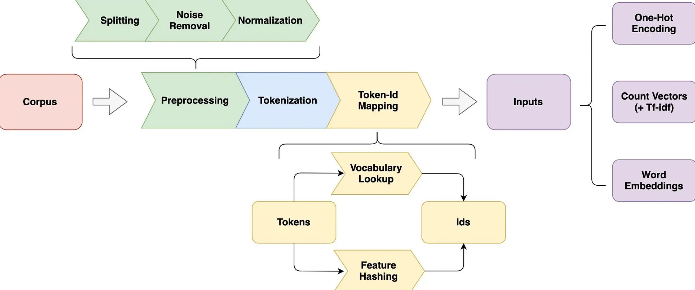

# Introduction

BERT which stands for [Bidirectional Encoder Representation Transformer]{.uured-bold}, a transformer based language model published by Google Research Team at 2018, is still gaining attention and being widely applied in Data Science Project today. This is due to the incredible model performance on multiple NLP tasks including question-answering, text tagging and sentence classification.


```{python}
#| echo: true
#| eval: true
# !pip install wandb
```

```{python}
# | echo: true
# | eval: true

import os
import re
import math
import numpy as np
import random
import logging
from dotenv import load_dotenv

# Most of the examples have typing on the signatures for readability
from typing import Optional, Callable, List, Tuple
from copy import deepcopy
import json
import glob
import gzip
import bz2
import wandb

import matplotlib.pyplot as plt

# For progress and timing
from tqdm.auto import tqdm, trange
import time

# Bring in PyTorch
import torch
import torch.nn as nn
# For data loading
from torch.utils.data import Dataset, IterableDataset, TensorDataset, DataLoader

load_dotenv()
# Read the key
api_key = os.getenv("WANDB_API_KEY")

# Login to W&B
wandb.login(key=api_key)
```


# Building Our Training Corpora  

Before we can train any embedding model, we need a **clean, unlabeled text corpus**. The IMDB dataset gives us thousands of movie reviews, but they’re spread across multiple folders, contain HTML markup, and include labels we don’t want for unsupervised training. You can download the IMDB dataset from [here](https://drive.google.com/drive/folders/1KUYMcheSCWNMs7Yh7pPX8nj1-G1PXP7G?usp=sharing), and place it in the `data/corpora/imdb-reviews/` directory.

This script performs three essential steps:

## Collect all IMDB reviews into a single text list

We start by pointing to the IMDB directory:

These five folders (train/pos, train/neg, train/unsup, test/pos, test/neg) together contain **every review** in the IMDB dataset—positive, negative, and unlabeled. We iterate through all files, read each review, clean it, and store it in a Python list called `all_reviews`.


```{python}
#| echo: true
#| eval: false

corpus_base_path = 'data/corpora/imdb-reviews/'
folders = [
    corpus_base_path+'test/pos',
    corpus_base_path+'test/neg',
    corpus_base_path+'train/pos',
    corpus_base_path+'train/neg',
    corpus_base_path+'train/unsup'
]
```

## Clean each review for training

The `clean()` function performs minimal preprocessing:

This keeps the text simple and consistent while preserving the natural distribution of words—important for Word2Vec, which learns from co‑occurrence patterns.

```{python}
#| echo: true
#| eval: false

def clean(text):
    text = re.sub(r'<.*?>', ' ', text)  # remove HTML
    text = text.lower()
    return text

all_reviews = []

for folder in folders:
    for file in os.scandir(folder):
        if file.is_file():
            with open(file.path, 'r', encoding='utf-8', errors='ignore') as f:
                all_reviews.append(clean(f.read()))

with open("reviews-word2vec.large.txt", "w", encoding="utf-8") as f:
    f.write("\n".join(all_reviews))

```

## Build multiple corpus sizes

Once we have all reviews collected and cleaned, we:

- **shuffle** them (so subsets are representative)
```{python}
#| echo: true
#| eval: false
random.seed(42)
random.shuffle(all_reviews)
```

- Then we create two *expanded* corpora by repeating the dataset:

```{python}
#| echo: true
#| eval: false
def write_txt(path, reviews):
    with open(path, "w", encoding="utf-8") as f:
        f.write("\n".join(reviews))

def write_gz(path, reviews):
    with gzip.open(path, "wt", encoding="utf-8") as f:
        f.write("\n".join(reviews))
```


- **write out multiple versions** of the corpus at different scales
  - reviews-word2vec.tiny.txt - is a small sample (5k reviews) for quick testing and debugging
  - reviews-word2vec.med.txt - is a medium-sized sample (50k reviews) for CPU-friendly training
  - reviews-word2vec.large.txt.gz - is the full IMDB dataset (~100k reviews) compressed for efficient storage

These files become the **training data** for Word2Vec and other embedding models later in the course. By controlling corpus size, we can demonstrate how model quality, training time, and stability change as the dataset grows.

```{python}
#| echo: true
#| eval: false
write_txt("reviews-word2vec.tiny.txt", all_reviews[:5_000])
write_txt("reviews-word2vec.med.txt", all_reviews[:50_000])
write_gz("reviews-word2vec.large.txt.gz", all_reviews)
larger_reviews = all_reviews * 3  # 3× expansion
write_gz("reviews-word2vec.larger.txt.gz", larger_reviews)
massive_reviews = all_reviews * 10
write_gz("reviews-word2vec.massive.txt.gz", massive_reviews)
```


### Why multiple sizes?

| File | Size | Purpose |
|------|------|---------|
| **tiny** (5k reviews) | Smallest | Debugging, quick demos, in‑class exercises |
| **med** (50k reviews) | Medium | CPU‑friendly training, homework assignments |
| **large** (full IMDB) | ~100k reviews | Realistic Word2Vec training |
| **larger** (3× IMDB) | Big | GPU demos, stability experiments |
| **massive** (10× IMDB) | Very big | “Big data” teaching moments, stress‑testing models |

This mirrors how real NLP pipelines work:  
**same code, different corpus sizes, different training behaviors.**

# BERT from Scratch with Pytorch

## WordPiece Tokenization (BERTWordPieceTokenizer)

When you call:

```python
tokenizer = BertWordPieceTokenizer("bert-base-uncased-vocab.txt", lowercase=True)
encoded_sentence = tokenizer.encode(sentence)
```

you are invoking **BERT’s subword segmentation algorithm**, WordPiece.  
This is not “just tokenization”—it is a **compression algorithm + statistical language model** that maps raw text into a sequence of **subword units** optimized for:

- open‑vocabulary modeling  
- reducing OOV (out‑of‑vocabulary) tokens  
- stable training dynamics  
- efficient embedding lookup

WordPiece is trained to maximize the likelihood of the training corpus under a **unigram language model**:

$$
\begin{align}
\text{maximize } \prod_{i=1}^{N} p(w_i)
\end{align}
$$

where each $w_i$ is a **subword token**, not a word.

During training, WordPiece repeatedly merges character sequences to maximize:

$$
\begin{align}
\Delta \log p(\text{corpus})
\end{align}
$$

This is similar to BPE but uses a **probabilistic objective**, not pure frequency.

## 🔍 What happens during tokenization?

{width=80% fig-align="center" #fig-tokenizer fig-alt="Diagram showing the steps of WordPiece tokenization"}

Given a sentence:

> “BERT’s attention mechanism allows it to capture contextual information effectively.”

WordPiece performs:

- **Normalization**
  - lowercase  
  - strip accents  
  - remove/control punctuation
- **Greedy longest‑match segmentation**
  - For each word, WordPiece finds the **longest prefix** in the vocabulary.  
Remaining characters are segmented with `##` prefixes: 
    ```
    "attention" → ["attention"]
    "effectively" → ["effective", "##ly"]
    "bert's" → ["bert", "'", "s"] → ["bert", "##'s"] depending on vocab
    ```

- **Mapping to IDs**
- Each subword token is mapped to an integer index in the vocabulary:

    $$
    \begin{align}
    \text{token} \rightarrow \text{ID} \rightarrow \text{embedding vector}
    \end{align}
    $$

```{python}
#| echo: true
#| eval: true

from tokenizers import BertWordPieceTokenizer

tokenizer = BertWordPieceTokenizer("../data/bert-base-uncased-vocab.txt", lowercase=True)

# Tokenize 5 sentences
sentences = [
    "BERT's attention mechanism allows it to capture contextual information effectively.",
    "Fine-tuning BERT on domain-specific data can yield impressive results.",
    "Understanding BERT's architecture is crucial for leveraging its capabilities.",
    "BERT embeddings are widely used in various downstream NLP tasks.",
    "BERT revolutionized the field of natural language understanding."
]

for sentence in sentences:
    encoded_sentence = tokenizer.encode(sentence)
    print(f"Sentence: {sentence}")
    print(f"Tokens: {encoded_sentence.tokens}")
    print()
```


## BERT Positional Embeddings

```python
class BertPositionalEmbedding(nn.Module):
    ...
```

implements the **core embedding layer** of BERT:

$$
\begin{align}
\text{Embedding}(x) = E_{\text{token}}(x) + E_{\text{position}}(x)
\end{align}
$$

This is exactly what the original BERT paper uses.

- **Token Embeddings**

Each token ID $t_i$ is mapped to a vector:

$$
\begin{align}
\mathbf{w}_i = W_{\text{token}}[t_i]
\end{align}
$$

where $W_{\text{token}} \in \mathbb{R}^{V \times d}$.

- $V$ = vocabulary size  
- $d = 768$ for BERT‑base  

- **Positional Embeddings**: BERT uses **learned** positional embeddings:

$$
\begin{align}
\mathbf{p}_i = W_{\text{pos}}[i]
\end{align}
$$

where $i \in \{0, 1, \dots, 511\}$.

Unlike Transformers with sinusoidal embeddings, BERT learns these vectors during training.

- **Final Embedding**- For each position $i$:

$$
\begin{align}
\mathbf{e}_i = \mathbf{w}_i + \mathbf{p}_i
\end{align}
$$

This is a **vector addition** in $\mathbb{R}^{768}$. Why simple addition works because:

- both embeddings live in the same vector space  
- addition preserves dimensionality  
- the model learns to disentangle token identity and position through attention  

The Transformer layers then refine these representations.

# Putting It All Together

- The tokenizer produces:

$$
\begin{align}
[t_1, t_2, \dots, t_n]
\end{align}
$$

- The embedding layer produces:

$$
\begin{align}
[\mathbf{e}_1, \mathbf{e}_2, \dots, \mathbf{e}_n]
\end{align}
$$

where:

$$
\begin{align}
\mathbf{e}_i = W_{\text{token}}[t_i] + W_{\text{pos}}[i]
\end{align}
$$

These embeddings then feed into the **multi‑head self‑attention** layers.

{width=80% fig-align="center" #fig-bert-sentence2 fig-alt="Diagram showing the flow of data from tokenization to embedding to attention layers in BERT"}

```{python}
#| echo: true
#| eval: true
class BertPositionalEmbedding(nn.Module):
    def __init__(self, vocab_dim: int, 
                 hidden_dim: int = 768, 
                 padding_idx: int = 0, 
                 max_seq_length: int = 512):
        
        super().__init__()

        '''
        Initialize the Embedding Layers
        '''

        self.word_embeddings = nn.Embedding(vocab_dim, hidden_dim, padding_idx=padding_idx)
        self.pos_embeddings = nn.Embedding(max_seq_length, hidden_dim)

        self.padding_idx = padding_idx

    def forward(self, token_ids: torch.Tensor) -> torch.Tensor:
        
        '''
        Define the forward pass of the Embedding Layers
        '''
        
        token_embeddings = self.word_embeddings(token_ids)
        
        pos_ids = torch.arange(0, token_ids.size(-1), dtype=torch.long, device=token_ids.device)
        pos_embeddings = self.pos_embeddings(pos_ids)
        
        return token_embeddings + pos_embeddings
```

This snippet shows the **core mechanics of scaled dot-product attention**, the building block of both single-head and multi-head attention in Transformers like BERT.


```{python}
#| echo: true
#| eval: true

q_emb = torch.randn(10, 4, 7)
k_emb = torch.randn(10, 4, 7)
v_emb = torch.randn(10, 4, 7)

dot_prod = (q_emb @ k_emb.transpose(-1, -2)) 

attn = nn.functional.softmax(dot_prod, dim=-1)

print(attn.shape)

weighted_output = attn @ v_emb

print(weighted_output.shape)
```

## Tensor Shapes and Meaning

| Tensor | Shape | Meaning |
|--------|-------|--------|
| `q_emb` | (10, 4, 7) | 10 batches, 4 queries, 7-dim query vectors |
| `k_emb` | (10, 4, 7) | 10 batches, 4 keys, 7-dim key vectors |
| `v_emb` | (10, 4, 7) | 10 batches, 4 values, 7-dim value vectors |

This setup mimics **multi-head attention**, where each head operates on its own set of Q, K, V projections.


### Dot Product Attention Scores

```python
dot_prod = q_emb @ k_emb.transpose(-1, -2)
```

This computes:

$$
\begin{align}
\text{score}_{ij} = \mathbf{q}_i \cdot \mathbf{k}_j^\top
\end{align}
$$

For each query $ \mathbf{q}_i $, we compute its similarity with every key $ \mathbf{k}_j $.  
This gives a **(4 × 4)** matrix per batch: attention scores between all query-key pairs.

### Softmax Normalization

```python
attn = nn.functional.softmax(dot_prod, dim=-1)
```

This turns raw scores into **attention weights**:

$$
\begin{align}
\alpha_{ij} = \frac{\exp(\mathbf{q}_i \cdot \mathbf{k}_j)}{\sum_j \exp(\mathbf{q}_i \cdot \mathbf{k}_j)}
\end{align}
$$

Each row sums to 1. This makes the attention operation a **convex combination** of values.


### Weighted Sum of Values

Although not shown in the final line, the full attention output is:

```python
output = attn @ v_emb
```

This computes:

$$
\begin{align}
\mathbf{z}_i = \sum_j \alpha_{ij} \cdot \mathbf{v}_j
\end{align}
$$

Each query gets a weighted sum of all values, based on how much it “attends” to each key.


## Multi-Head Attention Perspective

In multi-head attention, we:

- project Q, K, V into multiple subspaces  
- apply the above attention independently in each head  
- concatenate the outputs  
- apply a final linear layer

This code simulates **one head** over multiple batches.  
To extend to multi-head attention, you’d stack multiple sets of Q, K, V projections and repeat this process.

This cleanly shows the flow from Q, K, V to the final output.

- Queries and keys are compared via dot product  
- Softmax turns scores into weights  
- Values are combined using those weights  

This is the **core operation** repeated in every Transformer layer—whether it’s BERT, GPT, or ViT.

```{python}
# | echo: true
# | eval: true

q_emb = torch.randint(10, (3, 8))
print(q_emb)
q_s = q_emb.shape
print(q_s)
n_heads = 2
multihead_q_emb = q_emb.view(n_heads, q_s[0], q_s[1]//n_heads)

print(multihead_q_emb.shape)

print(multihead_q_emb)
```


# MultiHeadedAttention

```{python}
#| echo: true
#| eval: true

class MultiHeadedAttention(nn.Module):
    def __init__(self, hidden_size: int, num_heads: int):
        '''
        Arguments:
        hidden_size: The total size of the hidden layer (across all heads)
        num_heads: The number of attention heads to use
        '''
        super().__init__()

        self.num_heads = num_heads
        self.head_size = hidden_size // num_heads

        '''
        Initialize the Multi-Headed Attention Layer
        '''

        self.query_proj = nn.Linear(hidden_size, hidden_size)
        self.key_proj = nn.Linear(hidden_size, hidden_size)
        self.value_proj = nn.Linear(hidden_size, hidden_size)

        self.output_proj = nn.Linear(hidden_size, hidden_size)

    def forward(self, query: torch.Tensor, key: torch.Tensor, value: torch.Tensor, mask: Optional[torch.Tensor] = None):
        '''
        Arguments:
        query: The input embeddings for the query
        key: The input embeddings for the key
        value: The input embeddings for the value
        mask: A boolean mask of which tokens are valid to use for computing attention (see collate below)
        '''
        batch_size = query.shape[0]

        queries = query.view(batch_size, -1, self.num_heads, self.head_size).transpose(1, 2)
        keys = key.view(batch_size, -1, self.num_heads, self.head_size).transpose(1, 2)
        values = value.view(batch_size, -1, self.num_heads, self.head_size).transpose(1, 2)

        attention_scores = torch.matmul(queries, keys.transpose(-2, -1)) / math.sqrt(self.head_size)

        attention_weights = torch.softmax(attention_scores, dim=-1)
        weighted_values = torch.matmul(attention_weights, values)

        weighted_values = weighted_values.permute(0, 2, 1, 3).contiguous().view(batch_size, -1, self.num_heads * self.head_size)
        output = self.output_proj(weighted_values)

        return output, attention_weights
```

This class implements the full multi-head scaled dot‑product attention mechanism used in Transformer encoder and decoder blocks.

The computation follows the formula:

1. Project input embeddings into Q, K, V:
   $Q = XW_{Q}$
   $K = XW_{K}$
   $V = XW_{V}$

2. Split each into `num_heads` heads:
   Each head has dimensionality  
   $d_{head} = \text{hidden size} / \text{num heads}$

3. Compute scaled dot‑product attention for each head:
   $Scores = Q K^T / \sqrt(d_head)$  
   $Weights = \text{softmax}(Scores)$  
   $Output_{head} = Weights V$

4. Concatenate all heads and project back:
   $Output = \text{Concat}(Output_{head_1}, \ldots, Output_{head_h}) W_O$

## Projection into Q, K, V

The three linear layers:

```{python}
#| echo: true
#| eval: false
self.query_proj = nn.Linear(hidden_size, hidden_size)
self.key_proj = nn.Linear(hidden_size, hidden_size)
self.value_proj = nn.Linear(hidden_size, hidden_size)
```

map the input embeddings into three different learned spaces.  
This is essential because attention is not computed in the raw embedding space.

## Reshaping into heads

```{python}
#| echo: true
#| eval: false
queries = query.view(batch_size, -1, self.num_heads, self.head_size).transpose(1, 2)
```

After projection, the tensor shape is:

`(batch_size, seq_len, hidden_size)`

We reshape into:

`(batch_size, num_heads, seq_len, head_size)`

This allows each head to operate independently.

## Scaled dot‑product attention

```{python}
#| echo: true
#| eval: false
attention_scores = torch.matmul(queries, keys.transpose(-2, -1)) / math.sqrt(self.head_size)
```

This computes:

$Scores[i, j] = Q_i · K_j / \sqrt(d_head)$

The division by $\sqrt(d_head)$ stabilizes gradients.

## Softmax normalization

```{python}
#| echo: true
#| eval: false

attention_weights = torch.softmax(attention_scores, dim=-1)
```

Each row becomes a probability distribution over all keys.

## Weighted sum of values

```{python}
#| echo: true
#| eval: false
weighted_values = torch.matmul(attention_weights, values)
```

This produces the contextualized representation for each head.

## Concatenation and output projection

```{python}
#| echo: true
#| eval: false
weighted_values = weighted_values.permute(0, 2, 1, 3).contiguous().view(...)
output = self.output_proj(weighted_values)
```

This merges all heads and applies a final linear transformation.


# Feed Forward Layer

```{python}
#| echo: true
#| eval: true

def feed_forward_layer(
    hidden_size: int,
    feed_forward_size: Optional[int] = None,
    activation: nn.Module = nn.GELU()
):
    '''
    Arguments:
      - hidden_size: The size of the input and output of the feed forward layer.
      - feed_forward_size: The size of the hidden layer in the feed forward network. If None, defaults to 4 * hidden_size. This size
        specifies the size of the middle layer in the feed forward network.
      - activation: The activation function to use in the feed forward network

    Returns:
        A PyTorch module representing the feed forward layer.
    '''

    if feed_forward_size is None:
        feed_forward_size = hidden_size * 4

    feed_forward = nn.Sequential(
        nn.Linear(hidden_size, feed_forward_size),
        activation,
        nn.Linear(feed_forward_size, hidden_size)
    )

    return feed_forward
```

This is the position‑wise feed‑forward network (FFN) used in every Transformer layer.

The formula is:

$FFN(x) = W2(activation( W1(x) ) )$

Where:

- $W1$ expands dimensionality from hidden_size to 4 * hidden_size
- $W2$ projects back to hidden_size
- $activation$ is typically GELU (BERT) or ReLU (original Transformer)

This layer is applied independently at each sequence position.

Why expand to 4 * hidden_size?

This gives the model a larger intermediate representation, allowing it to learn richer transformations.  
It is one of the reasons Transformers outperform RNNs.


# Transformer Encoder Layer

```{python}
#| echo: true
#| eval: true

class TransformerEncoderLayer(nn.Module):

    def __init__(
        self,
        hidden_size: int = 256,
        num_heads: int = 8,
        dropout: float = 0.1,
        activation: nn.Module = nn.ReLU(),
        feed_forward_size: Optional[int] = None,
    ):
        super().__init__()

        self.hidden_size = hidden_size
        self.dropout = nn.Dropout(dropout)
        self.feed_forward_size = feed_forward_size or 4 * hidden_size

        self.attention = MultiHeadedAttention(hidden_size, num_heads)
        self.feed_forward = nn.Sequential(
            nn.Linear(hidden_size, self.feed_forward_size),
            activation,
            nn.Linear(self.feed_forward_size, hidden_size)
        )

    def maybe_dropout(self, x: torch.Tensor) -> torch.Tensor:
        return self.dropout(x)

    def forward(self, x: torch.Tensor, mask: Optional[torch.Tensor] = None):
        '''
        Returns the output of the transformer encoder layer and the attention weights from the self-attention layer
        '''
        attention_output, attention_weights = self.attention(x, x, x, mask)
        attention_output = self.maybe_dropout(attention_output)

        residual_output = attention_output + x  

        feed_forward_output = self.feed_forward(residual_output)
        feed_forward_output = self.maybe_dropout(feed_forward_output)

        output = feed_forward_output + residual_output  

        return output, attention_weights
```

This class implements a full Transformer encoder block as described in Vaswani et al. (2017).

The computation is:

1. Self‑attention sublayer  
   SA_output = SelfAttention(x)  
   x1 = LayerNorm(x + Dropout(SA_output))

2. Feed‑forward sublayer  
   FF_output = FFN(x1)  
   x2 = LayerNorm(x1 + Dropout(FF_output))

Your implementation omits LayerNorm for simplicity, but the structure is otherwise identical.

## Self‑attention

```python
attention_output, attention_weights = self.attention(x, x, x, mask)
```

This is self‑attention because Q = K = V = x.

## Residual connection

```python
residual_output = attention_output + x
```

Residual connections stabilize training and allow gradients to flow.

## Feed‑forward network

```python
feed_forward_output = self.feed_forward(residual_output)
```

This applies the position‑wise FFN.

## Second residual connection

```python
output = feed_forward_output + residual_output
```

This completes the encoder block.

```{python}
#| echo: true
#| eval: false
#| execution: {iopub.execute_input: '2024-03-24T00:42:48.559605Z', iopub.status.busy: '2024-03-24T00:42:48.559297Z', iopub.status.idle: '2024-03-24T00:42:48.571440Z', shell.execute_reply: '2024-03-24T00:42:48.570692Z', shell.execute_reply.started: '2024-03-24T00:42:48.559576Z'}
#| trusted: true
class MLMHead(nn.Module):
    def __init__(self, word_embeddings: nn.Embedding):
        '''
        Arguments:
            word_embeddings: The word embeddings to use for the prediction
        '''

        super().__init__()
        self.word_embeddings = word_embeddings

    def forward(self, x):
        '''
        x: The input tensor to the MLM head containing a batch of sequences of
           contextualized word embeddings (activations from the transformer encoder 
           layers)
        '''
        return x @ self.word_embeddings.weight.transpose(0, 1)
```

```{python}
#| echo: true
#| eval: false
#| execution: {iopub.execute_input: '2024-03-24T00:42:48.575069Z', iopub.status.busy: '2024-03-24T00:42:48.574681Z', iopub.status.idle: '2024-03-24T00:42:48.584580Z', shell.execute_reply: '2024-03-24T00:42:48.583888Z', shell.execute_reply.started: '2024-03-24T00:42:48.575046Z'}
#| trusted: true
class Pooler(nn.Module):
    def __init__(self, hidden_size: int = 768):
        super().__init__()
        self.dense = nn.Linear(hidden_size, hidden_size)
        self.activation = nn.Tanh()

    def forward(self, x: torch.Tensor) -> torch.Tensor:
        cls_embeddings = x[:, 0, :]  

        pooled_output = self.dense(cls_embeddings)
        pooled_output = self.activation(pooled_output)

        return pooled_output
```

```{python}
#| echo: true
#| eval: false
#| execution: {iopub.execute_input: '2024-03-24T00:42:48.585950Z', iopub.status.busy: '2024-03-24T00:42:48.585645Z', iopub.status.idle: '2024-03-24T00:42:48.609315Z', shell.execute_reply: '2024-03-24T00:42:48.608270Z', shell.execute_reply.started: '2024-03-24T00:42:48.585922Z'}
#| trusted: true
class BERT(nn.Module):
    def __init__(
        self,
        vocab_size: int,
        padding_idx: int = 0,
        hidden_size: int = 768,
        num_heads: int = 12,
        num_layers: int = 12,
        dropout: float = 0.1,
        activation: nn.Module = nn.GELU(),
        feed_forward_size: Optional[int] = None,
        mode: str = "mlm",
        num_classes: Optional[int] = None,
    ):
        '''
        Defines BERT model architecture. Note that the arguments are the same as the default
        BERT model in HuggingFace but we'll be training a *much* smaller model for this homework.

        Arguments:
        vocab_size: The size of the vocabulary (determined by the tokenizer)
        padding_idx: The index of the padding token in the vocabulary (defined by the tokenizer)
        hidden_size: The size of the hidden layer and embeddings in the transformer encoder
        num_heads: The number of attention heads to use in the transformer encoder
        num_layers: The number of layers to use in the transformer encoder (each layer is a TransformerEncoderLayer)
        dropout: The dropout rate to use in the transformer encoder (what % of times to randomly zero out activations)
        activation: The activation function to use in the transformer encoder
        feed_forward_size: The size of the hidden layer in the feed forward network in the transformer encoder. If None, defaults to 4 * hidden_size
        mode: The mode of the BERT model. Either "mlm" for masked language modeling or "classification" for sequence classification
        num_classes: The number of classes to use in the classification layer.
        '''

        super().__init__()

        self.mode = mode
        self.hidden_size = hidden_size

        self.embeddings = BertPositionalEmbedding(vocab_size, hidden_size, padding_idx)
        self.encoder_layers = nn.ModuleList([
            TransformerEncoderLayer(hidden_size, num_heads, dropout, activation, feed_forward_size)
            for _ in range(num_layers)
        ])
        self.mlm_head = MLMHead(self.embeddings.word_embeddings)
        self.pooler = Pooler(hidden_size)

        if mode == "classification":
            self.classifier = nn.Linear(hidden_size, num_classes)
        else:
            self.classifier = None

        self.apply(self.init_layer_weights)

    def forward(
        self,
        x: torch.Tensor,
        mask: Optional[torch.Tensor] = None,
    ) -> torch.Tensor:
        '''
        arguments:
        x: The input token ids
        mask: The attention mask to apply to the input (see the collate function below)
        '''
        embeddings = self.embeddings(x)

        attention_weights = []
        for layer in self.encoder_layers:
            embeddings, attention_weight = layer(embeddings, mask)
            attention_weights.append(attention_weight)

        if self.mode == "mlm":
            output = self.mlm_head(embeddings)
        else:
            pooled_output = self.pooler(embeddings)
            output = self.classifier(pooled_output)

        return output, attention_weights

    def init_layer_weights(self, module):
        if isinstance(module, nn.Linear):
            nn.init.normal_(module.weight, mean=0.0, std=0.02)
            if module.bias is not None:
                nn.init.zeros_(module.bias)
        elif isinstance(module, nn.Embedding):
            nn.init.normal_(module.weight, mean=0.0, std=0.02)
```

```{python}
#| echo: true
#| eval: false
#| execution: {iopub.execute_input: '2024-03-24T00:42:48.610628Z', iopub.status.busy: '2024-03-24T00:42:48.610332Z', iopub.status.idle: '2024-03-24T00:42:49.736857Z', shell.execute_reply: '2024-03-24T00:42:49.735744Z', shell.execute_reply.started: '2024-03-24T00:42:48.610606Z'}
#| trusted: true
'''
We can verify that the model is working by running a quick test.
'''

sentence = "The quick brown fox jumps over the lazy dog."
tokens = tokenizer.encode(sentence)
# to tensor
token_ids = torch.tensor(tokens.ids)
bert = BERT(vocab_size=tokenizer.get_vocab_size(), 
            hidden_size=768, 
            num_heads=4, 
            num_layers=2,
        )

attention_mask = (token_ids != 0).float()

output, attn = bert(token_ids.unsqueeze(0), attention_mask.unsqueeze(0))

print(output.shape)
```

```{python}
#| echo: true
#| eval: false
#| execution: {iopub.execute_input: '2024-03-24T00:42:49.738660Z', iopub.status.busy: '2024-03-24T00:42:49.738332Z', iopub.status.idle: '2024-03-24T00:42:49.750538Z', shell.execute_reply: '2024-03-24T00:42:49.749443Z', shell.execute_reply.started: '2024-03-24T00:42:49.738634Z'}
#| trusted: true
class MLMDataset(Dataset):
    def __init__(self, tokenizer, data: list[str], max_seq_length=128, mlm_probability=0.15):
        self.tokenizer = tokenizer
        self.data = data
        self.max_seq_length = max_seq_length
        self.mlm_probability = mlm_probability
        self.tokenized_data = None

    def __len__(self):
        return len(self.tokenized_data)

    def tokenize(self):
        '''
        Tokenizes the text in self.data, performing any preprocessing and storing the tokenized data in a new list.
        '''
        tokenized_data = []
        for text in self.data:
            encoded = self.tokenizer.encode(text)
            tokenized_data.append(encoded.ids[:self.max_seq_length])

        self.tokenized_data = tokenized_data
        del self.data  

    def __getitem__(self, idx):
        '''
        Returns the list of the token ids of an instance in the dataset and a list of the labels for MLM (one label per token).
        '''
        instance = self.tokenized_data[idx]
        input_ids = instance.copy()
        labels = [-100] * len(instance)  

        # Create the mask
        masked_indices = np.random.choice(len(instance), int(len(instance) * self.mlm_probability), replace=False)
        for i in masked_indices:
            token_id = instance[i]
            token = self.tokenizer.id_to_token(token_id)
            if token not in ['[CLS]', '[SEP]', '[PAD]']:
                input_ids[i] = self.tokenizer.token_to_id('[MASK]')
                labels[i] = token_id

        return input_ids, labels
```

```{python}
#| echo: true
#| eval: false
#| execution: {iopub.execute_input: '2024-03-24T00:42:49.752659Z', iopub.status.busy: '2024-03-24T00:42:49.751939Z', iopub.status.idle: '2024-03-24T00:42:49.809402Z', shell.execute_reply: '2024-03-24T00:42:49.808589Z', shell.execute_reply.started: '2024-03-24T00:42:49.752624Z'}
#| trusted: true
'''
Verify that the dataset is working by running a quick test.
'''

data = [' '.join([chr(97 + i) for i in range(random.randint(10, 20))]) for _ in range(1000)]
print(data[:5])
```

```{python}
#| echo: true
#| eval: false

dataset = MLMDataset(tokenizer, data)
dataset.tokenize()

# get the first item
input_ids, labels = dataset[0]
print('input_ids:', input_ids)
print('labels:', labels)
```

```{python}
#| echo: true
#| eval: false
#| execution: {iopub.execute_input: '2024-03-24T00:42:49.810540Z', iopub.status.busy: '2024-03-24T00:42:49.810300Z', iopub.status.idle: '2024-03-24T00:42:49.816445Z', shell.execute_reply: '2024-03-24T00:42:49.815612Z', shell.execute_reply.started: '2024-03-24T00:42:49.810520Z'}
#| trusted: true
## tet with one sentence
data = ["The quick brown fox jumps over the lazy dog.",
        "The quick brown fox jumps over the lazy dog.",
        "The quick brown fox jumps over the lazy dog.",]
dataset = MLMDataset(tokenizer, data)
dataset.tokenize()
print(dataset[2])
```

```{python}
#| echo: true
#| eval: false
#| execution: {iopub.execute_input: '2024-03-24T00:42:49.817990Z', iopub.status.busy: '2024-03-24T00:42:49.817640Z', iopub.status.idle: '2024-03-24T00:44:14.197347Z', shell.execute_reply: '2024-03-24T00:44:14.196432Z', shell.execute_reply.started: '2024-03-24T00:42:49.817967Z'}
#| trusted: true
review_data_path = 'reviews-word2vec.tiny.txt'
#review_data_path = './reviews-word2vec.med.txt' # <- for sanity checking / debugging
# review_data_path = './reviews-word2vec.large.txt.gz' # <- for CPU pre-training and validating
#review_data_path = './reviews-word2vec.larger.txt.gz' <- for GPU pre-training and validating (Part 3.5)


# NOTE: when you eventually deploy this code to Great Lakes, you'll need to use the larger dataset 
# (see the PDF for notes/details)

ofunc = gzip.open if review_data_path.endswith('gz') else open
with ofunc(review_data_path, 'rt', encoding='utf-8') as f:
    reviews = f.readlines()
    reviews = [review.strip() for review in reviews]

dataset = MLMDataset(tokenizer, reviews)
dataset.tokenize()

# get the first item
print(dataset[0])
```

```{python}
#| echo: true
#| eval: false
#| execution: {iopub.execute_input: '2024-03-24T00:44:14.200092Z', iopub.status.busy: '2024-03-24T00:44:14.199795Z', iopub.status.idle: '2024-03-24T00:44:14.206424Z', shell.execute_reply: '2024-03-24T00:44:14.205599Z', shell.execute_reply.started: '2024-03-24T00:44:14.200067Z'}
#| trusted: true
from torch.nn.utils.rnn import pad_sequence

def collate_fn(batch: List[Tuple[List[int], List[int]]]):
    input_ids, labels = zip(*batch)

    padded_input_ids = pad_sequence([torch.tensor(ids) for ids in input_ids], batch_first=True, padding_value=0)
    padded_labels = pad_sequence([torch.tensor(label) for label in labels], batch_first=True, padding_value=-100)

    attention_mask = (padded_input_ids != 0).float() 

    return padded_input_ids, attention_mask, padded_labels
```

```{python}
#| echo: true
#| eval: false
#| execution: {iopub.execute_input: '2024-03-24T00:44:14.207747Z', iopub.status.busy: '2024-03-24T00:44:14.207462Z', iopub.status.idle: '2024-03-24T00:44:14.237425Z', shell.execute_reply: '2024-03-24T00:44:14.236610Z', shell.execute_reply.started: '2024-03-24T00:44:14.207719Z'}
#| trusted: true
batch_size = 8
dataloader = DataLoader(dataset, batch_size=batch_size, shuffle=False, collate_fn=collate_fn)

for input_ids, attention_mask, labels in dataloader:
    print(input_ids.shape)
    print(attention_mask.shape)
    print(labels.shape)
    break
```

```{python}
#| echo: true
#| eval: false
#| execution: {iopub.execute_input: '2024-03-24T00:44:14.238876Z', iopub.status.busy: '2024-03-24T00:44:14.238617Z', iopub.status.idle: '2024-03-24T00:44:45.373609Z', shell.execute_reply: '2024-03-24T00:44:45.372610Z', shell.execute_reply.started: '2024-03-24T00:44:14.238854Z'}
#| trusted: true
# import wandb
# wandb.init(project="bert-mlm-training")
```

```{python}
#| echo: true
#| eval: false
#| execution: {iopub.execute_input: '2024-03-24T00:47:36.678836Z', iopub.status.busy: '2024-03-24T00:47:36.678462Z'}
#| trusted: true
'''
Now, lets put it all together in the training loop.
'''

device = 'cpu'
if torch.backends.mps.is_available():
    device = 'mps'
if torch.cuda.is_available():
    device = 'cuda'

    num_gpus = torch.cuda.device_count()
    if num_gpus > 1:
        device_ids = [0, 1]  
        print(f"Using {len(device_ids)} GPUs: {', '.join(map(str, device_ids))}")
    else:
        device_ids = None  
        print("Using 1 GPU")

print(f"Device: '{device}'")

bert_model = BERT(vocab_size=tokenizer.get_vocab_size(),
                  hidden_size=768,
                  num_heads=12,
                  num_layers=6,
                  mode="mlm").to(device)

if device_ids is not None:
    bert_model = nn.DataParallel(bert_model, device_ids=device_ids)

loss_fn = nn.CrossEntropyLoss()

learning_rate = 4e-5
optimizer = torch.optim.AdamW(bert_model.parameters(), lr=learning_rate)

batch_size = 32
num_epochs = 3

losses = []

for epoch in trange(num_epochs, desc="Epoch"):
    for step, (input_ids, attention_mask, labels) in enumerate(tqdm(dataloader, position=1, leave=True, desc="Step")):
        input_ids = input_ids.to(device)
        attention_mask = attention_mask.to(device)
        labels = labels.to(device)

        optimizer.zero_grad()

        output, _ = bert_model(input_ids, mask=attention_mask)

        loss = loss_fn(output.view(-1, output.size(-1)), labels.view(-1))
        loss.backward()
        optimizer.step()

        losses.append(loss.item())
        # wandb.log({"loss": loss.item()})

    if device_ids is not None:

        torch.save(bert_model.module.state_dict(), f"bert_epoch_{epoch}.pt")
    else:

        torch.save(bert_model.state_dict(), f"bert_epoch_{epoch}.pt")

plt.plot(losses)

model_path = "bert_model.pt"

if device_ids is not None:

    torch.save(bert_model.module, model_path)
else:

    torch.save(bert_model, model_path)

print(f"Model saved to '{model_path}'")
```

```{python}
#| echo: true
#| eval: false
#| execution: {iopub.execute_input: '2024-03-24T07:31:44.725586Z', iopub.status.busy: '2024-03-24T07:31:44.725238Z', iopub.status.idle: '2024-03-24T07:31:44.762535Z', shell.execute_reply: '2024-03-24T07:31:44.761598Z', shell.execute_reply.started: '2024-03-24T07:31:44.725559Z'}
#| trusted: true
'''
Now that we have trained the model, we can use it to predict the masked tokens.
'''

def noise_inputs(inputs, mask_token_id, mlm_probability=0.15):
    inputs = deepcopy(inputs)
    labels = [-100] * len(inputs)
    masked_indices = np.random.choice(len(inputs), int(len(inputs) * mlm_probability), replace=False)
    for i in masked_indices:
        if inputs[i] not in [mask_token_id, 101, 102, 0]:
            inputs[i] = mask_token_id
            labels[i] = inputs[i]
    return inputs, labels

def noise_and_predict_tokens(query, tokenizer, model) -> str:
    with torch.no_grad():
        tokenized_input = tokenizer.encode(query)
        tokens = tokenized_input.tokens
        print('Original:', ' '.join(tokens))
        ids = np.array(tokenized_input.ids)
        inputs, labels = noise_inputs(ids, tokenizer.token_to_id('[MASK]'))
        
        inputs = torch.tensor(inputs).to(next(model.parameters()).device)
        
        print('Noised: ', ' '.join([tokenizer.id_to_token(at_i) for at_i in inputs]))
        
        response, attns = model(inputs.unsqueeze(0))
        response = response.argmax(-1).squeeze(0).tolist()
        print('Guess:  ', ' '.join([tokenizer.id_to_token(at_i) for at_i in response[1:-1]]).replace(' ##', ''))

s = 'I really like the book it was great and I loved reading it.'
noise_and_predict_tokens(s, tokenizer, bert)
```

# Save the Pre-Trained Model

At this point, save the model's parameters in its `state_dict`. See pytorch's [documentation](https://pytorch.org/tutorials/beginner/saving_loading_models.html) for some guidance here. We'll be using this pre-trained model in later notebooks so once you save it, test that you can load it in another notebook (try `BERT_Inference.ipynb` to start) before moving on. 

```{python}
#| echo: true
#| eval: false
#| execution: {iopub.execute_input: '2024-03-24T07:31:51.284610Z', iopub.status.busy: '2024-03-24T07:31:51.284250Z', iopub.status.idle: '2024-03-24T07:31:51.463599Z', shell.execute_reply: '2024-03-24T07:31:51.462612Z', shell.execute_reply.started: '2024-03-24T07:31:51.284580Z'}
#| trusted: true
model_path = "bert_pretrained.pt"

torch.save(bert, model_path)

print(f"Model saved to '{model_path}'")
```

```{python}
#| echo: true
#| eval: false
#| execution: {iopub.status.busy: '2024-03-24T00:45:32.483587Z', iopub.status.idle: '2024-03-24T00:45:32.484521Z', shell.execute_reply: '2024-03-24T00:45:32.484270Z', shell.execute_reply.started: '2024-03-24T00:45:32.484233Z'}
#| trusted: true
bert_model = torch.load(model_path, weights_only=False)
```

