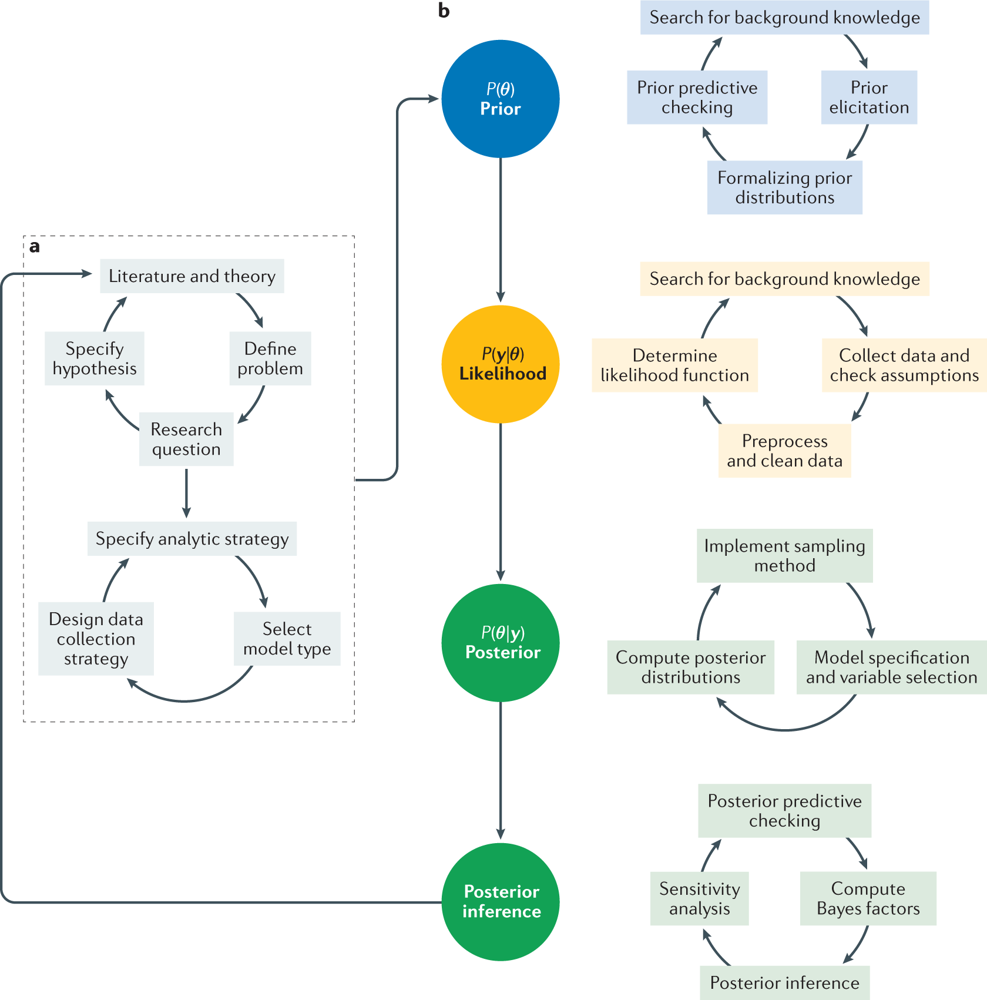

# Recommended assignment build sequence

In general We need to treat this problem as a data engineering task, not a modeling task. The goal is to build a clean, structured, and reusable corpus of Item 1, Item 1A, and Item 7 sections from the SEC 10-K filings. A standard approach is to build a robust Python pipeline that can handle the messy nature of SEC HTML filings and produce a clean dataset for later LLM-based analysis. We could also relate it back to the analytical pipeline or a software engineering workflow, but the core deliverable is a Python pipeline that extracts the relevant sections and saves them in a structured format. @fig-baysian-modeling shows a recommended build sequence for the assignment, which I think is a good approach to follow.

{width=80% fig-align="center" #fig-baysian-modeling fig-alt="Recommended build sequence for the assignment using Bayesian modeling steps"}

Build your understanding on the code here. In most cases the logical structure will remain the same regardless of the type of the dataset/documents you are using. For the SEC Text pipeline, I would structure it like this

- Part 1. Discover and load HTML filings
- Part 2. Clean HTML into normalized text
- Part 3. Detect and extract Item 1, Item 1A, and Item 7
- Part 4. Build a structured corpus dataframe
- Part 5. Save outputs for later assignments

# Discover and load HTML filings

Let's start by discovering all the HTML files in the data directory and loading them into memory. We will use Python's `pathlib` to find all HTML files and read their contents.

## Importing necessary libraries

```{python}
#| echo: true
#| eval: true

import os
import re
import pandas as pd
import numpy as np
from tqdm import tqdm
from pathlib import Path
import json
import unicodedata
from typing import Optional, Dict, List

import pandas as pd
from bs4 import BeautifulSoup

from sklearn.feature_extraction.text import TfidfVectorizer
from sklearn.model_selection import train_test_split
from sklearn.linear_model import LogisticRegression
from sklearn.metrics import classification_report, confusion_matrix

import torch
import torch.nn as nn
from torch.utils.data import DataLoader, TensorDataset

from sentence_transformers import SentenceTransformer

print("PyTorch version:", torch.__version__)
print("CUDA available:", torch.cuda.is_available())

if torch.cuda.is_available():
    print("CUDA version:", torch.version.cuda)
    print("GPU name:", torch.cuda.get_device_name(0))
    print("GPU count:", torch.cuda.device_count())
else:
    print("Running on CPU")
```


## Define the data path and discover HTML files

1. I am using HTML files instead of TXT files because they contain the original formatting and structure, which is crucial for accurate section extraction.
2. The HTML format allows us to leverage tags and layout cues to identify section headers and boundaries more reliably than plain text.
3. These files are located in the shared folder below
   1. [2024 SEC 10-K Filings](https://drive.google.com/drive/folders/1q7BfsNHCewG1zNfnqyCcBj9p_RUt-zW6?usp=sharing)
   2. [2024 SEC 10-K Filings - HTML](https://drive.google.com/drive/folders/1tqqoqDfcOpGKBoRN7PpAtElcmzKcrbGz?usp=sharing)


```{python}
#| echo: true
#| eval: true

DATA_DIR = Path("../../data/SEC-10K-2024-HTML")
OUTPUT_DIR = Path("./outputs/sec_10k_sections")
OUTPUT_DIR.mkdir(parents=True, exist_ok=True)

ALL_HTML_FILES = sorted(DATA_DIR.rglob("*.html")) + sorted(DATA_DIR.rglob("*.htm"))
print(f"Total HTML files found: {len(ALL_HTML_FILES)}")
```

## Selecting small sample for testing

```{python}
#| echo: true
#| eval: true

def select_html_files(
    files: List[Path],
    sample_n: Optional[int] = None,
    random_sample: bool = False,
    random_state: int = 42
) -> List[Path]:
    """
    Select all files or a smaller subset for debugging and development.

    Parameters
    ----------
    files : list[Path]
        Complete list of HTML filing paths.
    sample_n : int | None
        Number of files to process. If None, process all files.
    random_sample : bool
        If True, randomly sample files. Otherwise take the first sample_n files.
    random_state : int
        Seed for reproducibility when random_sample=True.
    """
    if sample_n is None:
        return files

    sample_n = min(sample_n, len(files))

    if random_sample:
        rng = random.Random(random_state)
        selected = rng.sample(files, sample_n)
        selected = sorted(selected)
    else:
        selected = files[:sample_n]

    return selected

html_files = select_html_files(
    ALL_HTML_FILES,
    sample_n=25,
    random_sample=False
)

print(f"Files selected for processing: {len(html_files)}")
html_files[:5]
```

# HTML cleaning helpers

The goal here is to turn messy SEC HTML into normalized text before section extraction. So before we can reliably extract sections, we need to clean the HTML and normalize the text. 

In general we want to process all the HTML files and convert them into clean text. 

1. The first function `normalize_text` will handle unicode normalization, space cleanup, and line break standardization to make regex matching more stable.
2. The second function `html_to_text` will use BeautifulSoup to parse the HTML, remove irrelevant tags (like scripts and styles), and extract the plain text content.

```{python}
#| echo: true
#| eval: true

def normalize_text(text: str) -> str:
    """
    Normalize unicode, spaces, and line breaks for more stable regex matching.
    """
    text = unicodedata.normalize("NFKC", text)
    text = text.replace("\xa0", " ")
    text = text.replace("&nbsp;", " ")
    text = re.sub(r"\r", "\n", text)
    text = re.sub(r"\n{2,}", "\n\n", text)
    text = re.sub(r"[ \t]+", " ", text)
    return text.strip()


def html_to_text(html: str) -> str:
    """
    Parse HTML and return cleaned plain text.
    Removes script/style content and flattens the document.
    """
    soup = BeautifulSoup(html, "lxml")

    for tag in soup(["script", "style", "ix:header", "header", "footer"]):
        tag.decompose()

    text = soup.get_text(separator="\n")
    return normalize_text(text)
```


## Section header patterns

We want to extract:

* **Item 1** — Business
* **Item 1A** — Risk Factors
* **Item 7** — Management’s Discussion and Analysis

The main challenge is that SEC filings often contain, so we need a reasonably defensive regex design. This is probably the most important part of the assignment, because it directly impacts the quality of the extracted corpus. In general my thinking was to remove everything above and below the target section, and then keep the longest plausible span to avoid TOC matches. There are many edge cases, but this approach works well for most filings. In general the core idea is to find candidate start positions for the target item, find candidate end positions for the next boundary items, and then build valid spans where end > start. Finally, we choose the longest plausible span as the extracted section while keeping following in mind.

* Table of contents duplicates
* Repeated item headers
* Formatting inconsistencies
* Inline XBRL artifacts

```{python}
#| echo: true
#| eval: true

ITEM_PATTERNS = {
    "item_1": re.compile(
        r"(?im)^\s*item\s*1[\.\-:\s]*\b(?!a\b)(?:business\b)?",
        re.IGNORECASE | re.MULTILINE
    ),
    "item_1a": re.compile(
        r"(?im)^\s*item\s*1a[\.\-:\s]*\b(?:risk\s+factors\b)?",
        re.IGNORECASE | re.MULTILINE
    ),
    "item_1b": re.compile(
        r"(?im)^\s*item\s*1b[\.\-:\s]*\b",
        re.IGNORECASE | re.MULTILINE
    ),
    "item_2": re.compile(
        r"(?im)^\s*item\s*2[\.\-:\s]*\b",
        re.IGNORECASE | re.MULTILINE
    ),
    "item_7": re.compile(
        r"(?im)^\s*item\s*7[\.\-:\s]*\b(?!a\b)(?:management'?s?\s+discussion\b|md&a\b)?",
        re.IGNORECASE | re.MULTILINE
    ),
    "item_7a": re.compile(
        r"(?im)^\s*item\s*7a[\.\-:\s]*\b",
        re.IGNORECASE | re.MULTILINE
    ),
    "item_8": re.compile(
        r"(?im)^\s*item\s*8[\.\-:\s]*\b",
        re.IGNORECASE | re.MULTILINE
    ),
}
```


## Find all candidate header positions

```{python}
#| echo: true
#| eval: true

def find_item_positions(text: str, pattern: re.Pattern) -> List[int]:
    """
    Return all candidate start positions for a given item header.
    """
    return [m.start() for m in pattern.finditer(text)]
```


## Choose the best section span

This is the most important part. A filing may mention “Item 1A” in the table of contents and later again in the real body. We usually want the **body occurrence**, not the first appearance. A practical strategy is:

* Find all candidate starts for the target item
* Find all candidate starts for the next boundary item
* Build all valid spans where end > start
* Keep a plausible span
* Choose the **longest plausible span**, for now we can say each section can span from 500 characters to 2 million characters. That works surprisingly well for SEC filings. But adjust it a bit before you are running it on a new dataset.


```{python}
#| echo: true
#| eval: true

def extract_section_by_bounds(
    text: str,
    start_pattern: re.Pattern,
    end_patterns: List[re.Pattern],
    min_chars: int = 500,
    max_chars: int = 2_000_000
) -> Optional[str]:
    start_positions = [m.start() for m in start_pattern.finditer(text)]
    if not start_positions:
        return None

    end_positions = []
    for pat in end_patterns:
        end_positions.extend([m.start() for m in pat.finditer(text)])
    end_positions = sorted(set(end_positions))

    candidates = []

    for start in start_positions:
        valid_ends = [end for end in end_positions if end > start]
        if not valid_ends:
            continue

        end = valid_ends[0]
        span_len = end - start

        if min_chars <= span_len <= max_chars:
            candidates.append((start, end, span_len))

    if not candidates:
        return None

    best_start, best_end, _ = max(candidates, key=lambda x: x[2])
    section = text[best_start:best_end].strip()
    return section if section else None
```


## Extract Item 1, Item 1A, and Item 7

We define section boundaries as:

* **Item 1** ends at Item 1A, Item 1B, or Item 2
* **Item 1A** ends at Item 1B or Item 2
* **Item 7** ends at Item 7A or Item 8

```{python}
#| echo: true
#| eval: true

def extract_target_sections(text: str) -> Dict[str, Optional[str]]:
    item_1 = extract_section_by_bounds(
        text=text,
        start_pattern=ITEM_PATTERNS["item_1"],
        end_patterns=[ITEM_PATTERNS["item_1a"], ITEM_PATTERNS["item_1b"], ITEM_PATTERNS["item_2"]],
        min_chars=1000
    )

    item_1a = extract_section_by_bounds(
        text=text,
        start_pattern=ITEM_PATTERNS["item_1a"],
        end_patterns=[ITEM_PATTERNS["item_1b"], ITEM_PATTERNS["item_2"]],
        min_chars=1000
    )

    item_7 = extract_section_by_bounds(
        text=text,
        start_pattern=ITEM_PATTERNS["item_7"],
        end_patterns=[ITEM_PATTERNS["item_7a"], ITEM_PATTERNS["item_8"]],
        min_chars=1000
    )

    return {
        "item_1": item_1,
        "item_1a": item_1a,
        "item_7": item_7,
    }
```

## Metadata extraction

If filenames contain useful metadata, we can parse that.
Otherwise, a simple fallback is to store the filename and derive metadata later.

If you want, later we can add extraction for fields like, company name, CIK, filing date, accession number from the SEC filing header.


```{python}
#| echo: true
#| eval: true

def extract_basic_metadata(file_path: Path, text: str) -> Dict[str, str]:
    """
    Minimal metadata extractor.
    You can later extend this using SEC header fields.
    """
    return {
        "file_name": file_path.name,
        "file_path": str(file_path),
    }
```


# Process all HTML files

```{python}
#| echo: true
#| eval: true

def process_html_files(
    html_files: List[Path],
    save_outputs: bool = True
) -> tuple[pd.DataFrame, pd.DataFrame]:
    """
    Process HTML filings and return:
    1. main extracted corpus
    2. recheck table for files needing manual review or second-pass regex

    A file is sent to recheck if:
    - parsing fails
    - Item 1 is missing
    - Item 1A is missing
    - Item 7 is missing
    """
    records = []
    recheck_records = []

    for i, file_path in enumerate(html_files, start=1):
        try:
            html = file_path.read_text(encoding="utf-8", errors="ignore")
            text = html_to_text(html)

            metadata = extract_basic_metadata(file_path, text)
            sections = extract_target_sections(text)

            item_1 = sections["item_1"]
            item_1a = sections["item_1a"]
            item_7 = sections["item_7"]

            missing_item_1 = item_1 is None
            missing_item_1a = item_1a is None
            missing_item_7 = item_7 is None

            status = "ok"
            if missing_item_1 or missing_item_1a or missing_item_7:
                status = "recheck"

            record = {
                **metadata,
                "raw_text_length": len(text),
                "item_1": item_1,
                "item_1a": item_1a,
                "item_7": item_7,
                "item_1_len": len(item_1) if item_1 else 0,
                "item_1a_len": len(item_1a) if item_1a else 0,
                "item_7_len": len(item_7) if item_7 else 0,
                "missing_item_1": missing_item_1,
                "missing_item_1a": missing_item_1a,
                "missing_item_7": missing_item_7,
                "status": status,
                "error": None,
            }
            records.append(record)

            if status == "recheck":
                recheck_records.append({
                    **metadata,
                    "raw_text_length": len(text),
                    "missing_item_1": missing_item_1,
                    "missing_item_1a": missing_item_1a,
                    "missing_item_7": missing_item_7,
                    "status": status,
                    "error": None,
                    "recheck_reason": "; ".join(
                        reason for reason, flag in [
                            ("missing Item 1", missing_item_1),
                            ("missing Item 1A", missing_item_1a),
                            ("missing Item 7", missing_item_7),
                        ] if flag
                    )
                })

        except Exception as e:
            metadata = extract_basic_metadata(file_path)

            error_record = {
                **metadata,
                "raw_text_length": None,
                "item_1": None,
                "item_1a": None,
                "item_7": None,
                "item_1_len": 0,
                "item_1a_len": 0,
                "item_7_len": 0,
                "missing_item_1": True,
                "missing_item_1a": True,
                "missing_item_7": True,
                "status": "error",
                "error": str(e),
            }
            records.append(error_record)

            recheck_records.append({
                **metadata,
                "raw_text_length": None,
                "missing_item_1": True,
                "missing_item_1a": True,
                "missing_item_7": True,
                "status": "error",
                "error": str(e),
                "recheck_reason": "parser/runtime error",
            })

        if i % 50 == 0 or i == len(html_files):
            print(f"Processed {i}/{len(html_files)} files")

    df_sections = pd.DataFrame(records)
    df_recheck = pd.DataFrame(recheck_records)

    if save_outputs:
        df_sections.to_csv(OUTPUT_DIR / "sec_10k_2024_sections.csv", index=False)
        df_sections.to_json(
            OUTPUT_DIR / "sec_10k_2024_sections.json",
            orient="records",
            force_ascii=False,
            indent=2
        )

        if not df_recheck.empty:
            df_recheck.to_csv(OUTPUT_DIR / "sec_10k_2024_recheck.csv", index=False)
            df_recheck.to_json(
                OUTPUT_DIR / "sec_10k_2024_recheck.json",
                orient="records",
                force_ascii=False,
                indent=2
            )

    return df_sections, df_recheck
```


## Build the corpus dataframe

```{python}
#| echo: true
#| eval: true
df_sections, df_recheck = process_html_files(html_files)

print("Main corpus shape:", df_sections.shape)
print("Recheck shape:", df_recheck.shape)
```

```{python}
#| echo: true
#| eval: true

df_sections.head().style.hide(axis="index")

```

## Quick extraction diagnostics

Let's check how many files we processed, and how many had each section successfully extracted. This will give us a sense of the extraction quality and coverage.

```{python}
#| echo: true
#| eval: true

summary = pd.DataFrame({
    "metric": [
        "total_files",
        "item_1_extracted",
        "item_1a_extracted",
        "item_7_extracted",
    ],
    "value": [
        len(df_sections),
        df_sections["item_1"].notna().sum(),
        df_sections["item_1a"].notna().sum(),
        df_sections["item_7"].notna().sum(),
    ]
})

summary.style.hide(axis="index")
```

Let's also get the section length summaries:

```{python}
#| echo: true
#| eval: true

df_sections[["item_1_len", "item_1a_len", "item_7_len"]].describe()
```


##  Save the corpus

```{python}
#| echo: true
#| eval: true
df_sections.to_csv(OUTPUT_DIR / "sec_10k_2024_sections.csv", index=False)

with open(OUTPUT_DIR / "sec_10k_2024_sections.json", "w", encoding="utf-8") as f:
    json.dump(df_sections.to_dict(orient="records"), f, ensure_ascii=False, indent=2)

print("Saved outputs to:", OUTPUT_DIR.resolve())
```


After we extract the three sections, the next notebook block should reshape the corpus into **long format**, because that is much easier to use later for chunking and retrieval.

## Convert to long format

```{python}
#| echo: true
#| eval: true

section_rows = []

for _, row in df_sections.iterrows():
    for section_name in ["item_1", "item_1a", "item_7"]:
        section_text = row[section_name]
        if isinstance(section_text, str) and section_text.strip():
            section_rows.append({
                "file_name": row["file_name"],
                "file_path": row["file_path"],
                "section_name": section_name,
                "section_text": section_text,
                "section_length": len(section_text),
            })

df_long = pd.DataFrame(section_rows)
df_long.head().style.hide(axis="index")
```

Save it:

```{python}
#| echo: true
#| eval: true
df_long.to_csv(OUTPUT_DIR / "sec_10k_2024_sections_long.csv", index=False)
```

# Sentence splitting and chunking

For SEC filings, I would avoid overly naive splitting like `text.split('.')` because it breaks badly on abbreviations, dollar amounts, and formatting. A good practical option is `nltk.sent_tokenize`.


## Sentence splitting

We still split into sentences first, because sentences are the best building blocks for rolling retrieval windows.

```{python}
#| echo: true
#| eval: true

import nltk
import re

nltk.download("punkt")
nltk.download("punkt_tab")

from nltk.tokenize import sent_tokenize

def clean_sentence(text: str) -> str:
    """
    Light cleanup for sentence text extracted from SEC filings.
    """
    text = str(text)
    text = text.replace("\xa0", " ")
    text = re.sub(r"\s+", " ", text)
    return text.strip()
```

While we are extracting the sentences lets also check for Sentence quality. We can filter out very short sentences and obvious noise like "Table of Contents" or "Item 1". This will help improve the quality of our later chunks and embeddings.

```{python}
#| echo: true
#| eval: true

def is_valid_sentence(text: str, min_chars: int = 25) -> bool:
    """
    Filter obvious noise and very short artifacts.
    """
    text = str(text).strip()

    if len(text) < min_chars:
        return False

    lowered = text.lower()
    bad_values = {
        "table of contents",
        "item 1",
        "item 1a",
        "item 7",
    }

    if lowered in bad_values:
        return False

    return True
```

### Build sentence-level dataframe

```{python}
#| echo: true
#| eval: true
sentence_rows = []

for _, row in df_long.iterrows():
    sentences = sent_tokenize(row["section_text"])

    sent_num = 0
    for sent in sentences:
        sent_clean = clean_sentence(sent)

        if not is_valid_sentence(sent_clean):
            continue

        sent_num += 1

        sentence_rows.append({
            "file_name": row["file_name"],
            "file_path": row["file_path"],
            "section_name": row["section_name"],
            "sentence_number": sent_num,
            "sentence_id": f"{row['file_name']}::{row['section_name']}::s{sent_num}",
            "sentence_text": sent_clean,
            "sentence_length_chars": len(sent_clean),
        })

df_sentences = pd.DataFrame(sentence_rows)

print(df_sentences.shape)
df_sentences.head().style.hide(axis="index")
```

Save the sentence-level file for diagnostics and later reuse:

```{python}
#| echo: true
#| eval: true
df_sentences.to_csv(OUTPUT_DIR / "sec_10k_2024_sentences.csv", index=False)
```

## Approximate token counting

For later RAG, character count is not enough. We want approximate token counts. A practical, lightweight approximation is:

* split on whitespace and punctuation
* count resulting text units

This is not identical to a transformer tokenizer, but it is enough for chunk control in this assignment.

```{python}
#| echo: true
#| eval: true
def approximate_token_count(text: str) -> int:
    """
    Approximate token count using regex-based word/punctuation splitting.
    This is a lightweight stand-in for a model tokenizer.
    """
    text = str(text)
    tokens = re.findall(r"\w+|[^\w\s]", text, flags=re.UNICODE)
    return len(tokens)
```

Apply it to the sentence table:

```{python}
#| echo: true
#| eval: true
df_sentences["approx_token_count"] = df_sentences["sentence_text"].apply(approximate_token_count)

df_sentences[["sentence_text", "approx_token_count"]].head().style.hide(axis="index")
```


## Build rolling sentence chunks with approximate token control

This is the key part. We will build chunks by:

* Moving through each section sentence by sentence
* Collecting adjacent sentences
* Stopping when we approach a token budget
* using overlap between chunks
This creates chunks that are better for retrieval than single sentences.

```{python}
#| echo: true
#| eval: true

from typing import List, Dict

def build_sentence_window_chunks(
    df_sentences: pd.DataFrame,
    target_tokens: int = 250,
    max_tokens: int = 320,
    overlap_sentences: int = 2,
    min_chunk_tokens: int = 40
) -> pd.DataFrame:
    """
    Build overlapping multi-sentence chunks from a sentence-level dataframe.

    Parameters
    ----------
    df_sentences : pd.DataFrame
        Sentence-level dataframe with columns:
        file_name, file_path, section_name, sentence_number, sentence_text, approx_token_count

    target_tokens : int
        Preferred chunk size in approximate tokens.

    max_tokens : int
        Hard upper bound for chunk size.

    overlap_sentences : int
        Number of trailing sentences to carry into the next chunk.

    min_chunk_tokens : int
        Minimum approximate token count required to keep a chunk.
    """
    chunk_rows: List[Dict] = []

    grouped = (
        df_sentences
        .sort_values(["file_name", "section_name", "sentence_number"])
        .groupby(["file_name", "file_path", "section_name"], as_index=False)
    )

    for (file_name, file_path, section_name), group in grouped:
        group = group.sort_values("sentence_number").reset_index(drop=True)

        n = len(group)
        start_idx = 0
        chunk_counter = 1

        while start_idx < n:
            current_sentences = []
            current_token_total = 0
            end_idx = start_idx

            while end_idx < n:
                sent_text = group.loc[end_idx, "sentence_text"]
                sent_tokens = int(group.loc[end_idx, "approx_token_count"])

                # always allow at least one sentence
                if current_token_total == 0:
                    current_sentences.append(sent_text)
                    current_token_total += sent_tokens
                    end_idx += 1
                    continue

                # stop if adding another sentence would exceed max_tokens
                if current_token_total + sent_tokens > max_tokens:
                    break

                current_sentences.append(sent_text)
                current_token_total += sent_tokens
                end_idx += 1

                # if target_tokens reached, we can stop this chunk
                if current_token_total >= target_tokens:
                    break

            chunk_text = " ".join(current_sentences).strip()

            if chunk_text and current_token_total >= min_chunk_tokens:
                start_sentence_num = int(group.loc[start_idx, "sentence_number"])
                end_sentence_num = int(group.loc[end_idx - 1, "sentence_number"])

                chunk_rows.append({
                    "chunk_id": f"{file_name}::{section_name}::c{chunk_counter}",
                    "file_name": file_name,
                    "file_path": file_path,
                    "section_name": section_name,
                    "start_sentence": start_sentence_num,
                    "end_sentence": end_sentence_num,
                    "n_sentences": end_idx - start_idx,
                    "chunk_text": chunk_text,
                    "chunk_length_chars": len(chunk_text),
                    "approx_token_count": current_token_total,
                })

                chunk_counter += 1

            # move forward with overlap
            if end_idx >= n:
                break

            next_start_idx = max(start_idx + 1, end_idx - overlap_sentences)
            if next_start_idx <= start_idx:
                next_start_idx = start_idx + 1

            start_idx = next_start_idx

    return pd.DataFrame(chunk_rows)
```


## Generate the rolling chunk corpus

```{python}
#| echo: true
#| eval: true

df_chunks = build_sentence_window_chunks(
    df_sentences=df_sentences,
    target_tokens=250,
    max_tokens=320,
    overlap_sentences=2,
    min_chunk_tokens=40
)

print(df_chunks.shape)
df_chunks.head().style.hide(axis="index")
```


## Save the retrieval-ready chunk dataset

This is the main dataset you will likely use in later assignments.

```{python}
#| echo: true
#| eval: true
df_chunks.to_csv(OUTPUT_DIR / "sec_10k_2024_sentence_window_chunks.csv", index=False)

df_chunks.to_json(
    OUTPUT_DIR / "sec_10k_2024_sentence_window_chunks.json",
    orient="records",
    force_ascii=False,
    indent=2
)

print("Saved rolling chunk corpus.")
```


#  Diagnostics

# Chunks by section

```python
df_chunks["section_name"].value_counts()
```

### Token count summary

```python
df_chunks["approx_token_count"].describe()
```

### Sentences per chunk

```python
df_chunks["n_sentences"].describe()
```

### Sample chunks

```python
df_chunks.sample(10, random_state=42)[
    ["file_name", "section_name", "start_sentence", "end_sentence", "approx_token_count", "chunk_text"]
]
```

---

## Why this is better than sentence-only rows

This design gives you:

* enough context for company-level and sector-level retrieval
* chunk sizes that are manageable for embeddings
* overlapping windows so important context is not lost at chunk boundaries
* a sentence table that can still be used for debugging and keyword detection

So the pipeline becomes:

```text
HTML filing
   ↓
Item 1 / 1A / 7 extraction
   ↓
section-level corpus
   ↓
sentence-level corpus
   ↓
rolling token-aware chunk corpus
   ↓
embeddings
   ↓
retrieval / RAG
```

---

## Suggested defaults for your course

These are good starting values for SEC filings:

```python
target_tokens = 250
max_tokens = 320
overlap_sentences = 2
min_chunk_tokens = 40
```

If later you want broader context for RAG, you can increase to:

```python
target_tokens = 350
max_tokens = 450
overlap_sentences = 2
```

---

## Recommended artifact naming

At this point, students should save:

* `sec_10k_2024_sections.csv`
* `sec_10k_2024_sections_long.csv`
* `sec_10k_2024_sentences.csv`
* `sec_10k_2024_sentence_window_chunks.csv`

The last one should be the main **retrieval corpus** for Assignment 3.

---

The next best step is to build the **target-signal extraction layer** on top of `df_chunks`, so students can identify chunks related to AI, datacenter, infrastructure, or technology spending.
