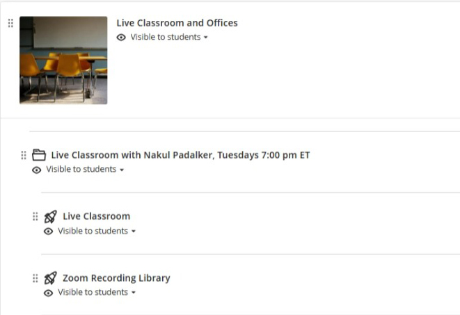

## Course Sections

```{python}
# | echo: false

import pandas as pd
from IPython.display import display, Markdown, HTML

sections = pd.read_excel("data/AD698-Schedule.xlsx", sheet_name="Sections")

sections.drop(1, inplace=True)  # Drop the first row which contains the section names

def restrict_width(column):
    return [("max-width", "200px"), ("overflow", "hidden"), ("text-overflow", "ellipsis")]


styled_table = (
    sections.style
    .hide(axis="index")  # Hide the index
    .set_table_styles([
        {"selector": "th", "props": [("text-align", "left")]},
        {"selector": "td", "props": [("text-align", "left")]},
        {"selector": "tbody td:nth-child(2)", "props": restrict_width(None)},
        # nth-child(4) targets the 4th column
        {"selector": "tbody td:nth-child(3)", "props": restrict_width(None)}
    ])
)

# Render and display the styled table inline in Quarto

display(HTML(styled_table.to_html()))
```


## Course Content and Objectives

{width="95%"}

### Course Description

This course is designed for **analytics developers and advanced business students** seeking to build **practical, production-ready Generative AI (GenAI)** Applications. Emphasizing hands-on learning, students will explore key techniques such as  **Natural Language Processing, Recurrent Neural Networks and Transformer Architectures, prompt engineering, in-context learning (ICL), retrieval-augmented generation (RAG), Agentic Artificial Intelligence, and responsible AI design**.

Students will work with **open-source tools and APIs** including **LangChain**, **LlamaIndex**, and **embedding models**, while learning to implement GenAI systems across the **entire development lifecycle** — from prompt design and knowledge retrieval to fine-tuning and deployment.

The course will emphasize **practical development** over theoretical model internals and will cover topics such as:

* Model optimization strategies (e.g., quantization, adapter-based tuning)
* Inference pipelines and GenAI app deployment
* Evaluation and benchmarking of model performance
* Responsible and explainable GenAI usage in enterprise settings

This course bridges the gap between **business analytics fluency** and **technical AI development**, equipping students to build **domain-specific LLM applications** that solve real-world problems.


## Course Learning Objectives

By the end of this course, students will be able to:

- [Design and implement prompt workflows]{.uublue-bold} to extract relevant, accurate, and useful outputs from large language models using in-context learning (ICL) strategies.
- [Build retrieval-augmented generation (RAG) systems]{.uublue-bold} that combine language models with structured and unstructured knowledge bases.
- [Develop autonomous AI agents]{.uublue-bold} that can reason, retrieve, and execute tasks across business workflows using frameworks such as LangChain and AutoGen.
- [Fine-tune and customize foundation models]{.uublue-bold} (e.g., LLaMA, Mistral) using parameter-efficient techniques like LoRA and QLoRA to adapt to business-specific domains.
- [Evaluate and audit generative models]{.uublue-bold} for quality, risk, bias, and alignment using both manual and automated tools (e.g., OpenAI Evals, GPT-judge, Trulens).
- [Critically assess ethical and governance implications]{.uublue-bold} of deploying GenAI in enterprise settings, including risks of hallucination, misinformation, and data leakage.


## Course Resources

[Fundamentals of Generative AI](https://github.com/ajayvohra2005/fundamentals-of-generative-ai-book/releases) required for this course. All core readings, technical documentation, and video tutorials will be provided on the blackboard course site. Please choose the latest release pdf version of the book.

**Required Readings:**

- Lecture notes per module are available on Blackboard. You can click on them to view and use `Crtl+p` to print them in PDF format.
- Each Module has two lecture notes.
  - For Online class you will need to use both lecture notes from Module
  - For In Person class you will need to use one lecture notes per lecture from Module.


**Recommended (not required):**

- [Designing LLM Applications with LangChain](https://docs.langchain.com/)
- [OpenAI Cookbook](https://cookbook.openai.com/)
- [The Hitchhiker’s Guide to LLMOps](https://arize.com/docs/ax)
- [Generative AI with Python and Hugging Face Transformers](https://huggingface.co/docs/transformers/en/index)

**Tools & Platforms Used:**

* Jupyter, VS Code, GitHub, Python (LangChain, LlamaIndex, OpenAI, Hugging Face)
* APIs: OpenAI, Cohere, Claude (Anthropic), Gemini (Google)
* Deployment tools: Streamlit, FastAPI, GitHub Actions
* Vector DBs: FAISS, ChromaDB
* Evaluation tools: GPT-Eval, Trulens, PromptLayer

All resources are available through [GitHub Education]{.uublue-bold} and [GitHub Classrooms]{.uublue-bold}. Students are [required]{.bloodred-bold} to create a [GitHub account]{.uublue-bold} using their Boston University email address in the first week.

## Course Schedule

The class will generally run for 12 weeks with 6 modules. Module 0 will be a prep module open at the same time as Module 1. Module 7 and 8 are advanced contain materials and are optional.

### Class Schedule 

```{python}
# | label: build-course-schedule
# | echo: false
# | warning: false
# | message: false

from IPython.display import display, HTML
from schedules.config import semester, year
from schedules.generated_schedule import load_generated_schedule

course_table = load_generated_schedule("schedule", semester=semester, year=year)
module0_catalog = load_generated_schedule("module0_catalog", semester=semester, year=year)
summary = load_generated_schedule("summary", semester=semester, year=year)
online_sections = summary.loc[
    summary["Modality"] != "oncampus",
    "Section",
].tolist()

module0_preview_styled = (
    module0_catalog
    .style
    .hide(axis="index")
    # .set_caption("Week Ahead: Module 0 Preview")
    .set_table_styles([
        {"selector": "th", "props": [("text-align", "left")]},
        {"selector": "td", "props": [
            ("text-align", "left"),
            ("vertical-align", "top"),
            ("white-space", "normal")
        ]},
    ])
)

# course_table.drop(columns="A1", errors="ignore", inplace=True)

# display_course_table = course_table.drop(columns=online_sections, errors="ignore")

display_course_table = course_table.copy()

display_course_table.drop(columns=["A1", "O1"], errors="ignore", inplace=True)

styled = (
    display_course_table
    .style
    .hide(axis="index")
    .set_table_styles([
        {"selector": "th", "props": [("text-align", "left")]},
        {"selector": "td", "props": [
            ("text-align", "left"),
            ("vertical-align", "top"),
            ("white-space", "nowrap")
        ]},
    ])
)

display(HTML(module0_preview_styled.to_html()))
display(HTML(styled.to_html()))
```

## Boston University Library Information

As Boston University students, you have full access to the BU Library. From any computer, you can gain access to anything at the library that is electronically formatted. To connect to the library, use the link [http://www.bu.edu/library](http://www.bu.edu/library). You may use the library's content whether you are connected through your online course or not, by confirming your status as a BU community member using your Kerberos password. Once in the library system, you can use the links under "Resources" and "Collections" to find databases, eJournals, and eBooks, as well as search the library by subject.

Please note:

- If you have questions about library resources, go to [Ask a Librarian: Help & FAQs](https://www.bu.edu/library/help/ask-a-librarian/) to email the library or use the live-chat feature.
- You are not to post attachments of the required or other readings in any area of the course, as it is an infringement on copyright laws and department policy. All students have access to the library system and will need to develop research skills that include how to find articles through library systems and databases.

## Blackboard Course Website

To access your course website, go to [http://learn.bu.edu/](http://learn.bu.edu/) and select AD698 Generative AI for Business Analytics

### Software Applications & Remote Access to Virtual Labs

In this course, students will be using AWS Academy and a massive dataset connected through Azure cloud. The instructions can be found in the Module 0 Lecture 1 video. As part of the tuition, all BU students can use these software applications free of charge. For directions to get free remote access to our BU MET Virtual Labs, please visit

[https://www.bu.edu/metit/services/client-technology/virtual-lab/](https://www.bu.edu/metit/services/client-technology/virtual-lab/)

### Live Classroom in Zoom

Select Live Classroom in the **Live Classroom and Offices** Module on the course homepage. Please note that the live sessions are only for the online class.

{width="80%" fig-align="center" fig-alt="Live Classroom Zoom link screenshot"}

## Grading and Assessment

### Grading Structure

On the course homepage, all the material is presented by modules and each module covers two lectures. In the on-campus version of this course, each week we will have a live classroom session that will cover one lecture. In addition, students will work in teams in our virtual labs and will participate in group discussion boards. Please review the Course Calendar & Outline document to get the full schedule of this course.

## Grading Breakdown

### Course Structure and Learning Format

All course materials are organized by **modules**, with each module covering **two lectures**. In the on-campus version of this course, we will meet weekly for a live classroom session that covers one lecture. In addition to in-class instruction, students will work in **teams** on a semester-long project and participate in structured discussions and applied activities.

Please refer to the **Course Calendar & Outline** for detailed scheduling of lectures, assignments, milestones, and presentations.

## Grading Breakdown

Your final grade is based on the following components:

### AWS Academy Generative AI Foundations

All students are required to complete the **AWS Academy Generative AI Foundations** course during the first **10 weeks** of the semester.

- This is a **self-paced, external certification**
- The final deliverable is the **AWS Academy completion badge**
- Points are awarded based on **AWS module check completion**, translated to a 100-point scale

This requirement ensures all students develop a shared baseline in industry-standard generative AI concepts and practices. The assignment is scheduled to be submitted in the 10th week of the semester. Later submission after that week will result in a deduction of 2% per day.

### Group Paper Presentation (Once per Group)\

Each student group will deliver **one research paper presentation** during the semester.

- Presentation length: approximately **15 minutes**
- Each presentation will be followed by **guided class discussion**
- All students are expected to read the assigned paper(s), regardless of whether they are presenting

Presentations focus on:

- The problem the paper addresses
- The technical or conceptual contribution
- Limitations and assumptions
- Implications for building generative AI systems

This component develops skills in **critical reading, synthesis, and technical communication**.


:::{.callout-important}
[Online Students]{.uured-bold}: Please submit a one page pdf/word independently [per week]{.uured-bold} with answers to the following questions by the end of the week. Please include the name of the paper and the authors in your submission.

On the second page of the document, please include your AI disclosure and the output (actual output) from the AI tool you used. Failure to disclose AI usage will result in a 50% penalty.

1. Core Idea
   1. What problem does the paper solve?
   2. What is the model/system contribution?
2. Mechanism
   1. How does it work (pipeline / architecture)?
   2. Key equation / concept / diagram
3. Critical Evaluation
   1. Where does it fail?
   2. Assumptions that break in real-world systems
   3. Application Layer (important for your course)
4. How would this be used in:
    1. RAG systems?
    2. Agents?
    3. Business pipelines?
5. What would you Improve in the papers model/approach? (don't say more data or bigger model) 

:::

### Individual Assignments

There are **four individual assignments**, each aligned with a stage of the generative AI pipeline using SEC 10-K filings. These assignments are submitted individually, even though students work within project teams.

The assignments correspond to the following themes:

1. **Corpus Familiarization & Chatbot Scope**
   Understanding the provided 10-K data and defining the scope of a domain-specific GenAI chatbot.

2. **Text Structuring & Retrieval Units**
   Cleaning, structuring, and chunking SEC filings for retrieval-based systems.

3. **Embeddings & Retrieval Baseline**
   Creating semantic representations and validating retrieval quality.

4. **Grounded Generation & Guardrails**
   Designing prompts and retrieval-augmented generation with explicit grounding and constraints.

### Managerial Report with Application Demo

The **managerial report** is the primary written deliverable for the course.

- Submitted as a **GitHub-hosted website**
- Synthesizes the full GenAI chatbot system built throughout the semester
- Written for a **managerial or executive audience**, not a purely technical one

The report must clearly explain:

* The problem addressed
* The data used
* The generative AI pipeline
* Key insights and limitations
* Appropriate and inappropriate use cases

This component evaluates your ability to **translate technical systems into decision-relevant narratives**.

### Group Project Presentation

At the end of the semester, each group will deliver a **final project presentation**.

* Focuses on the chatbot system, insights, and managerial implications
* Emphasizes clarity, evidence, and responsible design
* Not a code walkthrough

This presentation assesses your ability to **communicate complex GenAI systems clearly and professionally**.

### Group Feedback

Students are required to provide **structured feedback** on other group presentations.

* Feedback will be guided by prompts provided by the instructor
* Evaluates engagement, critical thinking, and comparative analysis

This component ensures active participation and shared responsibility for the learning environment.

### General AI Policy

Review and align the usage of generative AI tools in academic activities based on the following links by BU AIDA:

- [Generative AI Guidelines for Classroom Use](https://www.bu.edu/aida/guidance/generative-ai-guidelines-for-classroom-use/)
- [Generative AI Guidelines for Students](https://www.bu.edu/aida/guidance/generative-ai-guidelines-for-students/)
- Recommended completion by all BU students of the [Individual AI at BU Student Certificate](https://www.bu.edu/aida/)

Students are encouraged to explore and responsibly use artificial intelligence (AI) tools, such as ChatGPT, for brainstorming, practicing problem-solving, and enhancing their learning. However, AI should not be used as a substitute for critical thinking, original work, or assignments unless explicitly permitted. Any use of AI assistance must be properly acknowledged, and students remain fully accountable for the accuracy, integrity, and quality of their submissions. Unauthorized or undisclosed use of AI tools for graded work will be treated as a violation of academic integrity.

Because this is a generative AI course, many assignments explicitly permit or require the use of AI tools. Those uses are allowed when they follow the assignment instructions, are disclosed as required, and are validated by the student.

### AI Usage in Specific Course Deliverables

1. AI Usage in Discussion Forums

Discussion forums are graded deliverables and serve as a space for students to exchange ideas, practice critical thinking, and engage in meaningful peer-to-peer dialogue. While AI tools may be consulted for background information or to inspire ideas, all posted contributions must be written in the student's own voice and demonstrate original reasoning and direct engagement with course materials. Submitting AI-generated responses without personal analysis and reflection is not permitted and will be treated as a violation of participation guidelines. Students are expected to thoughtfully build on each other's contributions, ensuring genuine interaction rather than outsourcing discussions to AI.

2. AI Usage in Data Collection

As part of the Term Project for the course, students will collect and organize data, and AI tools such as Microsoft Copilot may be used to support the data collection process. However, students must not rely on AI for interpreting or analyzing the results of the project unless the assignment instructions explicitly permit that use. The purpose of the project is to develop students' own ability to apply course concepts, exercise judgment, and practice decision-making in a dynamic business environment. While AI may help streamline data gathering, all analysis, insights, and recommendations must come directly from the students' critical thinking and understanding. Any submission that substitutes AI-driven analysis for the student's own work will not fulfill the requirements of this assignment.

3. AI Usage in Graded Submissions

Several graded deliverables in this course, including executive briefings, slide decks, and managerial reports are designed to assess your ability to communicate clearly and apply course concepts independently. AI tools may not be used to generate content for these deliverables unless the assignment instructions explicitly permit that use. Standard editing tools such as spell check or grammar check are permitted for polishing your work, but AI-based tools that rewrite, rephrase, or alter the tone of your writing are not allowed unless explicitly permitted. Please review the assignment guidelines for detailed expectations regarding format and content.

### Important Note

Don't hesitate to inform your instructor, faculty, and student support administrator if you feel others are inappropriately commenting in any forum.

All Boston University students are required to follow academic and behavioral conduct codes. Failure to comply with these conduct codes may result in disciplinary action.


### Grade Points

```{python}
# | echo: false

# | eval: true

import pandas as pd
from IPython.display import display, Markdown, HTML

deliverables = pd.read_excel("data/AD698-Schedule.xlsx", sheet_name="Grade")

deliverables = deliverables[[
    "Class Activity", "Count", "Points", "Max Points"]]

numeric_cols = ["Count", "Points", "Max Points"]

# 1) Coerce strings/objects to numbers, invalids → NaN
deliverables[numeric_cols] = deliverables[numeric_cols].apply(
    pd.to_numeric, errors="coerce"
)

# 2) Use pandas' nullable integer dtype (allows NaN)
deliverables[numeric_cols] = deliverables[numeric_cols].astype("Int64")

# 3) Style: show "-" for NaN without changing the data
styled = (
    deliverables.style
    .hide(axis="index")
    .format(na_rep="-")  # <- this prints "-" wherever value is NA
    .set_table_styles([
        {"selector": "th", "props": [("text-align", "left")]},
        {"selector": "td", "props": [("text-align", "left")]},
        {"selector": "tbody td:nth-child(2)", "props": [(
            "max-width", "200px"), ("overflow", "hidden"), ("text-overflow", "ellipsis")]},
        {"selector": "tbody td:nth-child(3)", "props": [(
            "max-width", "200px"), ("overflow", "hidden"), ("text-overflow", "ellipsis")]}
    ])
)

display(HTML(styled.to_html()))
```

Labs are available in each module deliverables and are meant for self learning and not graded.


:::{.callout-important}
[Online Students]{.uured-bold}: Please submit a one page pdf/word independently with answers to the following questions by the end of the week. Please include the name of the paper and the authors in your submission.
:::

## Class Policies

### Attendance & Absences

Class attendance is [mandatory]{.bloodred-bold}. Please inform your instructor if you know in advance that you will need to miss a class. More than two absences will influence your participation grade in this class.

Regularly engaging in discussions on course-related topics, any cases and readings (during the class and on the Discussion Board), asking questions that lead to better understanding of a concept by the class as a whole, clarifying concepts, readiness to help peers during the consultation sessions and between classes, and sharing professional experience about course-related topics constitute superior class participation and contribute to our collective learning.

### Submission Format

All written contributions should follow the APA writing style, in particular, the requirements how to lay out a paper, as well as how to cite and reference correctly You can get an excellent guide to APA style here.

### Assignment Completion & Due Dates & Late Work

Students should submit completed assignments on the Blackboard course website. All work requests from the instructor (quizzes, assignments, contributions in the teamwork, etc.) have due dates. These are the last dates that stated material is due. This means that it is a good idea to set personal targets before then as your personal completion date to avoid difficulties. Dates are often viewed by students as the date to turn in an assignment. We view assignment due dates as the last date on which to turn in an assignment. With this warning, please note that we are not inclined to accept late work; if late work should be accepted it will be done only after considerable weighing of rationale, and with penalty.

### Academic Conduct Code

Students are expected to adhere to the highest standards of honesty and integrity for this course. Cheating and plagiarism will not be tolerated in any Metropolitan College course. They will result in no credit for the assignment or examination and may lead to disciplinary actions. Please take the time to review the 
[Student Academic Code of Conduct](https://www.bu.edu/academics/policies/academic-conduct-code/) and [Generative AI Guidelines](https://www.bu.edu/aida/guidance/generative-ai-guidelines-for-students/).

This should not be understood as a discouragement for discussing the material or your particular approach to a problem with other students in the class. On the contrary – you should share your thoughts, questions and solutions. Naturally, if you choose to work in a group, you will be expected to come up with more than one and highly original solutions rather than the same mistakes.


### An Important Letter from Your Department Chairperson

Dear Administrative Science Students:

A top priority of the Administrative Sciences Department is to protect the integrity of our Boston University master's degree programs. By formally pledging to uphold high standards of academic conduct each semester, you will help to protect the value of your hard work and your degree.

Your agreement to uphold these standards provides you access to course content. We are certain that you share our values of academic honesty and integrity and understand the importance to your degree prestige that you help us to enforce them. To review Boston University's Academic Conduct Code, [click here](https://www.bu.edu/academics/policies/academic-conduct-code/).

On behalf of the Administrative Sciences faculty,

Irena Vodenska, Ph.D.  
Professor in Finance, Director, Finance Programs, MET, Chair, Administrative Sciences Department

### Request for Accommodations

In accordance with university policy, every effort will be made to accommodate students with respect to speech, hearing, vision, or other disabilities. Any student who may need an accommodation for a documented disability should contact [Disability and Access Services](https://www.bu.edu/disability/) at 617-353-3658 or at [access@bu.edu](mailto:access@bu.edu) for review and approval of accommodation requests.

Once a student receives their accommodation letter, they must send it to their instructor and/or facilitator each semester. They must also send a copy to their Faculty & Student Support Administrator, who may need to update the course settings to ensure accommodation is in place. Accommodation cannot be implemented if the students do not send their letters.
